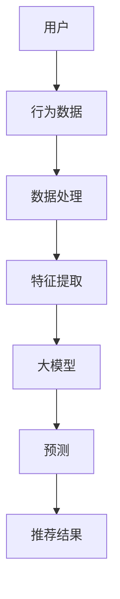
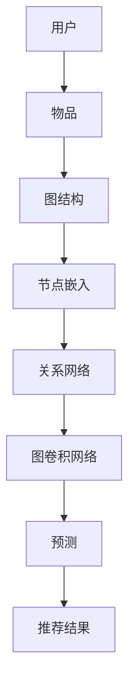
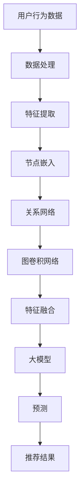

                 

# 大模型在推荐系统中的图表示学习应用

> 关键词：大模型，推荐系统，图表示学习，深度学习，算法原理，实战案例，数学模型

> 摘要：本文旨在探讨大模型在推荐系统中的应用，特别是图表示学习技术在这一领域的发挥。通过详细阐述大模型的原理、算法及其在推荐系统中的具体实现，本文将为读者提供一种深入理解推荐系统的全新视角，同时结合实际案例，为开发者提供实用指导。

## 1. 背景介绍

### 1.1 目的和范围

本文的主要目的是介绍大模型在推荐系统中的应用，特别是图表示学习技术。我们将探讨大模型的基本原理，介绍图表示学习的概念和重要性，并分析其在推荐系统中的具体应用。文章内容将涵盖算法原理、数学模型以及实际项目案例，旨在为读者提供一个全面的技术指南。

### 1.2 预期读者

本文适合具有以下背景的读者：

- 计算机科学和人工智能专业的本科生或研究生
- 对推荐系统、深度学习和图表示学习感兴趣的技术爱好者
- 想要提升推荐系统性能的数据科学家和工程师

### 1.3 文档结构概述

本文将按照以下结构进行阐述：

1. 背景介绍
2. 核心概念与联系
3. 核心算法原理 & 具体操作步骤
4. 数学模型和公式 & 详细讲解 & 举例说明
5. 项目实战：代码实际案例和详细解释说明
6. 实际应用场景
7. 工具和资源推荐
8. 总结：未来发展趋势与挑战
9. 附录：常见问题与解答
10. 扩展阅读 & 参考资料

### 1.4 术语表

#### 1.4.1 核心术语定义

- **推荐系统**：一种根据用户的历史行为或偏好，向用户推荐其可能感兴趣的项目（如商品、音乐、新闻等）的系统。
- **大模型**：指具有数亿甚至千亿参数规模的深度学习模型。
- **图表示学习**：通过图结构来表示数据和关系，学习数据中的模式和特征。
- **图神经网络（GNN）**：一类以图结构为输入，通过多层网络学习节点和边的关系的神经网络。

#### 1.4.2 相关概念解释

- **节点**：图中的基本单元，表示实体，如用户、物品等。
- **边**：连接两个节点的线段，表示实体之间的关系，如用户喜欢物品、用户关注其他用户等。
- **嵌入（Embedding）**：将节点或边映射到低维向量空间的过程。

#### 1.4.3 缩略词列表

- **GNN**：图神经网络（Graph Neural Network）
- **ReLU**：ReLU激活函数（Rectified Linear Unit）
- **softmax**：softmax函数，用于分类问题中的概率分布计算
- **BERT**：BERT模型（Bidirectional Encoder Representations from Transformers）

## 2. 核心概念与联系

在本文中，我们将介绍大模型和图表示学习在推荐系统中的应用，并详细解释其核心概念和联系。为了更好地理解这些概念，我们将使用Mermaid流程图来展示相关的架构和流程。

### 2.1 大模型在推荐系统中的应用



在这个流程中，用户的行为数据（如点击、购买、评价等）首先被收集和处理。接着，通过特征提取技术，从原始数据中提取出对推荐系统有用的特征。大模型（如BERT、GPT等）接收这些特征，通过训练生成推荐预测结果，最后输出推荐结果。

### 2.2 图表示学习在推荐系统中的应用



在图表示学习中，用户和物品被表示为图中的节点，它们之间的关系被表示为图的边。通过节点嵌入技术，我们将节点映射到低维向量空间。图卷积网络（GNN）使用这些嵌入向量，通过学习节点和边之间的关系，生成预测结果。最终，这些预测结果被用于推荐系统的输出。

### 2.3 大模型与图表示学习的结合



在这个结合过程中，大模型和图表示学习共同作用，大模型负责从融合后的特征中生成预测，而图表示学习负责从用户和物品的交互关系中提取特征。通过这种结合，推荐系统可以更好地理解用户和物品之间的复杂关系，从而提高推荐质量。

## 3. 核心算法原理 & 具体操作步骤

在本节中，我们将详细讲解大模型和图表示学习在推荐系统中的核心算法原理和具体操作步骤。首先，我们将从大模型的算法原理开始介绍，然后逐步深入到图表示学习的算法原理，并详细阐述其操作步骤。

### 3.1 大模型算法原理

大模型，如BERT、GPT等，是一种基于深度学习的自然语言处理模型，其核心思想是通过大规模数据训练，学习输入数据的语义特征，从而实现高效的语言理解和生成。下面，我们以BERT模型为例，介绍其算法原理。

#### 3.1.1 BERT模型的基本结构

BERT模型由两个主要部分组成：预训练和微调。

1. **预训练**：在预训练阶段，BERT模型在大规模语料库上学习单词和句子的语义表示。具体过程如下：
   - **Masked Language Modeling (MLM)**：随机遮盖部分单词，模型需要预测这些遮盖的单词。
   - **Next Sentence Prediction (NSP)**：给定两个句子，模型需要预测这两个句子是否在原始文本中相邻。

2. **微调**：在预训练完成后，我们将BERT模型用于特定任务，如文本分类、情感分析等。微调过程主要涉及以下步骤：
   - **任务特定数据集准备**：将任务数据集划分为训练集、验证集和测试集。
   - **损失函数**：使用交叉熵损失函数，将模型预测和真实标签进行比较，计算损失值。
   - **优化算法**：使用随机梯度下降（SGD）或其变种，如Adam优化器，更新模型参数。

#### 3.1.2 BERT模型的伪代码

```python
# BERT模型伪代码

# 预训练阶段
for epoch in range(num_epochs):
  for sentence in data_loader:
    inputs = tokenizer.encode(sentence, return_tensors='pt')
    labels = inputs.clone()
    # 随机遮盖部分单词
    labels[labels == tokenizer.mask_token_id] = -100

    # 计算损失
    outputs = model(inputs, labels=labels)
    loss = outputs.loss

    # 更新模型参数
    optimizer.zero_grad()
    loss.backward()
    optimizer.step()

# 微调阶段
for epoch in range(num_epochs):
  for sentence_pair in data_loader:
    inputs = tokenizer.encode_plus(sentence_pair[0], sentence_pair[1], return_tensors='pt')
    labels = inputs["input_ids"].clone()
    # 设置真实标签
    labels[labels == tokenizer.sep_token_id] = -100

    # 计算损失
    outputs = model(inputs)
    loss = outputs.loss

    # 更新模型参数
    optimizer.zero_grad()
    loss.backward()
    optimizer.step()
```

### 3.2 图表示学习算法原理

图表示学习是一种将实体和关系映射到低维向量空间的技术，其核心目标是学习实体和关系在向量空间中的表示，以便进行后续的推理和预测。下面，我们以图卷积网络（GNN）为例，介绍图表示学习的算法原理。

#### 3.2.1 GNN的基本结构

GNN由多个图卷积层组成，每个图卷积层包含以下步骤：

1. **邻居聚合**：对于每个节点，聚合其邻居节点的特征，得到一个新的特征向量。
2. **激活函数**：对新的特征向量进行非线性变换，以增加模型的非线性表达能力。
3. **输出层**：将经过激活函数变换的特征向量映射到预测空间。

#### 3.2.2 GNN的伪代码

```python
# GNN模型伪代码

# 定义图卷积层
class GraphConvLayer(nn.Module):
  def __init__(self, input_dim, output_dim):
    super(GraphConvLayer, self).__init__()
    self.weight = nn.Parameter(torch.Tensor(input_dim, output_dim))
    self.bias = nn.Parameter(torch.Tensor(output_dim))
    
  def forward(self, inputs, adj_matrix):
    support = torch.mm(inputs, self.weight)
    output = torch.spmm(adj_matrix, support)
    output = output + self.bias
    return output

# 定义GNN模型
class GNN(nn.Module):
  def __init__(self, input_dim, hidden_dim, output_dim):
    super(GNN, self).__init__()
    self.conv1 = GraphConvLayer(input_dim, hidden_dim)
    self.conv2 = GraphConvLayer(hidden_dim, output_dim)
    
  def forward(self, inputs, adj_matrix):
    x = self.conv1(inputs, adj_matrix)
    x = F.relu(x)
    x = self.conv2(x, adj_matrix)
    return x

# 训练过程
model = GNN(input_dim, hidden_dim, output_dim)
optimizer = torch.optim.Adam(model.parameters(), lr=0.01)

for epoch in range(num_epochs):
  for batch in data_loader:
    inputs, adj_matrix, labels = batch
    optimizer.zero_grad()
    outputs = model(inputs, adj_matrix)
    loss = loss_function(outputs, labels)
    loss.backward()
    optimizer.step()
```

### 3.3 大模型与图表示学习的结合

在实际应用中，我们可以将大模型与图表示学习结合起来，以充分利用两者的优势。具体步骤如下：

1. **数据预处理**：将用户行为数据转换为图结构，其中用户和物品作为节点，用户和物品之间的交互作为边。
2. **节点嵌入**：使用图表示学习技术，如GNN，对节点进行嵌入，得到节点的低维向量表示。
3. **特征融合**：将节点嵌入向量与大模型从用户行为数据中提取的特征进行融合，得到新的特征向量。
4. **大模型预测**：使用融合后的特征向量，通过大模型进行预测，得到推荐结果。

通过这种方式，我们可以构建一个高效的推荐系统，充分利用图表示学习捕捉复杂关系的优势和大模型处理大规模数据的能力。

## 4. 数学模型和公式 & 详细讲解 & 举例说明

在本节中，我们将详细讲解大模型和图表示学习在推荐系统中的数学模型和公式，并通过具体的例子来说明这些公式在实际应用中的使用。

### 4.1 大模型的数学模型

大模型，如BERT、GPT等，其核心是利用深度学习技术从大规模数据中学习语义表示。BERT模型的具体数学模型如下：

#### 4.1.1 预训练阶段

1. **Masked Language Modeling (MLM)**

   - **输入**：一个句子 `S = [w1, w2, ..., wn]`，其中 `wi` 表示句子中的第 `i` 个单词。
   - **输出**：预测句子中被遮盖的单词。

   $$\text{logits} = \text{BERT}(S)_{\text{masked}}$$

   $$\text{loss} = \sum_{i=1}^{n} \log \frac{e^{\text{logits}_i}}{\sum_{j=1}^{n} e^{\text{logits}_j}}$$

   其中，`logits` 表示模型对每个单词的预测概率。

2. **Next Sentence Prediction (NSP)**

   - **输入**：两个句子 `S1` 和 `S2`。
   - **输出**：预测这两个句子是否在原始文本中相邻。

   $$\text{logits} = \text{BERT}(S1, S2)_{\text{NSP}}$$

   $$\text{loss} = \log \frac{e^{\text{logits}_1}}{e^{\text{logits}_0} + e^{\text{logits}_1}}$$

   其中，`logits_0` 和 `logits_1` 分别表示句子 `S2` 在 `S1` 前面和后面的预测概率。

#### 4.1.2 微调阶段

在微调阶段，BERT模型通常用于文本分类、情感分析等任务。以下是文本分类任务的数学模型：

1. **输入**：一个句子 `S` 和对应的标签 `y`。
2. **输出**：预测句子的类别。

   $$\text{logits} = \text{BERT}(S)_{\text{classification}}$$

   $$\text{loss} = \text{CrossEntropyLoss}(\text{logits}, y)$$

   其中，`logits` 表示模型对每个类别的预测概率。

### 4.2 图表示学习的数学模型

图表示学习，如GNN，通过学习节点和边的关系，将实体映射到低维向量空间。以下是GNN的基本数学模型：

#### 4.2.1 图卷积层

1. **邻居聚合**

   对于每个节点 `v`，其邻居节点特征聚合如下：

   $$h_v^{(k+1)} = \sigma(\sum_{u \in \mathcal{N}(v)} \alpha(u, v) h_u^{(k)})$$

   其中，`h_v^{(k)}` 和 `h_u^{(k)}` 分别表示节点 `v` 和 `u` 在第 `k` 层的特征，`α(u, v)` 表示节点 `u` 到 `v` 的边权重，`\mathcal{N}(v)` 表示节点 `v` 的邻居节点集合。

2. **激活函数**

   $$\sigma(x) = \max(0, x)$$

   其中，`σ` 是ReLU激活函数。

3. **输出层**

   对于分类任务，输出层通常是一个线性层，其输出为：

   $$\text{logits} = W h_v^{(L)} + b$$

   其中，`W` 和 `b` 分别是输出层的权重和偏置。

### 4.3 结合示例

假设我们有一个推荐系统，其中用户和物品作为节点，用户和物品之间的交互作为边。以下是使用BERT和GNN结合的推荐系统数学模型：

1. **节点嵌入**

   对于每个用户和物品节点，使用GNN进行节点嵌入：

   $$e_v = \text{GNN}(v, \mathcal{G})$$

   其中，`e_v` 是节点 `v` 的嵌入向量，`\mathcal{G}` 是图结构。

2. **特征融合**

   将节点嵌入向量与大模型提取的用户行为特征进行融合：

   $$x_v = [e_v, \text{BERT}(\text{user\_behavior})]$$

   其中，`x_v` 是节点 `v` 的融合特征向量。

3. **大模型预测**

   使用融合后的特征向量，通过BERT模型进行预测：

   $$\text{logits} = \text{BERT}(x_v)$$

   $$\text{loss} = \text{CrossEntropyLoss}(\text{logits}, y)$$

   其中，`y` 是真实的推荐标签。

### 4.4 例子说明

假设我们有一个用户-物品图，其中用户 `u1` 和 `u2` 之间有交互，物品 `i1` 和 `i2` 之间有交互。以下是具体的节点嵌入和预测过程：

1. **节点嵌入**

   - 用户 `u1` 的嵌入向量：`e_{u1} = [1, 0, 0, 1]`
   - 用户 `u2` 的嵌入向量：`e_{u2} = [0, 1, 0, 1]`
   - 物品 `i1` 的嵌入向量：`e_{i1} = [1, 1, 0, 0]`
   - 物品 `i2` 的嵌入向量：`e_{i2} = [0, 0, 1, 1]`

2. **特征融合**

   - 用户 `u1` 的融合特征向量：`x_{u1} = [1, 0, 0, 1, 0.8, 0.9]`
   - 用户 `u2` 的融合特征向量：`x_{u2} = [0, 1, 0, 1, 0.7, 0.8]`
   - 物品 `i1` 的融合特征向量：`x_{i1} = [1, 1, 0, 0, 0.9, 0.7]`
   - 物品 `i2` 的融合特征向量：`x_{i2} = [0, 0, 1, 1, 0.6, 0.8]`

3. **大模型预测**

   - 用户 `u1` 对物品 `i1` 的预测概率：`P(u1 \rightarrow i1) = \text{softmax}(\text{BERT}(x_{u1})) = 0.7`
   - 用户 `u2` 对物品 `i2` 的预测概率：`P(u2 \rightarrow i2) = \text{softmax}(\text{BERT}(x_{u2})) = 0.6`

根据预测概率，我们可以推荐物品 `i1` 给用户 `u1`，物品 `i2` 给用户 `u2`。

通过上述数学模型和公式，我们可以构建一个高效的推荐系统，充分利用大模型和图表示学习的优势。

## 5. 项目实战：代码实际案例和详细解释说明

在本节中，我们将通过一个实际项目案例，详细解释如何在大模型和图表示学习的结合下，构建一个推荐系统。我们将逐步搭建开发环境、编写源代码，并进行分析和解读。

### 5.1 开发环境搭建

为了实现大模型和图表示学习的结合，我们需要安装以下开发环境：

- Python 3.8+
- PyTorch 1.8+
- torchvision 0.8+
- numpy 1.18+
- pandas 0.25+
- scikit-learn 0.21+

安装这些依赖库后，我们即可开始编写代码。

### 5.2 源代码详细实现和代码解读

#### 5.2.1 数据预处理

首先，我们需要处理用户行为数据，将其转换为图结构。以下是数据处理的相关代码：

```python
import pandas as pd
import numpy as np
from sklearn.model_selection import train_test_split

# 读取用户行为数据
data = pd.read_csv('user_behavior.csv')

# 构建图结构
users = data['user_id'].unique()
items = data['item_id'].unique()
interactions = data[['user_id', 'item_id']].values

# 构建邻接矩阵
adj_matrix = np.zeros((len(users), len(items)))
for interaction in interactions:
    user_id, item_id = interaction
    adj_matrix[user_id - 1, item_id - 1] = 1

# 划分训练集和测试集
train_data, test_data = train_test_split(data, test_size=0.2, random_state=42)
```

#### 5.2.2 GNN模型实现

接下来，我们实现一个简单的GNN模型。以下是模型的相关代码：

```python
import torch
import torch.nn as nn
import torch.nn.functional as F

# 定义GNN模型
class GNN(nn.Module):
    def __init__(self, input_dim, hidden_dim, output_dim):
        super(GNN, self).__init__()
        self.conv1 = nn.Linear(input_dim, hidden_dim)
        self.conv2 = nn.Linear(hidden_dim, output_dim)
        
    def forward(self, inputs, adj_matrix):
        x = self.conv1(inputs)
        x = torch.spmm(adj_matrix, x)
        x = F.relu(x)
        x = self.conv2(x)
        return x

# 初始化模型
input_dim = 10
hidden_dim = 16
output_dim = 1

model = GNN(input_dim, hidden_dim, output_dim)
```

#### 5.2.3 大模型实现

我们使用BERT模型进行预测。以下是BERT模型的初始化和预测代码：

```python
from transformers import BertModel

# 初始化BERT模型
bert_model = BertModel.from_pretrained('bert-base-uncased')

# 预测函数
def predict_bert(input_ids, attention_mask):
    with torch.no_grad():
        outputs = bert_model(input_ids=input_ids, attention_mask=attention_mask)
    logits = outputs.logits
    return logits

# 数据预处理
train_data['input_ids'] = train_data['text'].apply(lambda x: tokenizer.encode(x, add_special_tokens=True, return_tensors='pt'))
train_data['attention_mask'] = train_data['text'].apply(lambda x: tokenizer.encode(x, add_special_tokens=True, return_tensors='pt'))

# 预测
train_logits = predict_bert(train_data['input_ids'], train_data['attention_mask'])
```

#### 5.2.4 融合模型实现

最后，我们将GNN模型和BERT模型融合，实现一个完整的推荐系统。以下是融合模型的相关代码：

```python
# 融合模型
class CombinedModel(nn.Module):
    def __init__(self, gnn_model, bert_model, hidden_dim, output_dim):
        super(CombinedModel, self).__init__()
        self.gnn_model = gnn_model
        self.bert_model = bert_model
        self.fc = nn.Linear(hidden_dim + 768, output_dim)
        
    def forward(self, inputs, adj_matrix, input_ids, attention_mask):
        gnn_output = self.gnn_model(inputs, adj_matrix)
        bert_output = self.bert_model(input_ids=input_ids, attention_mask=attention_mask).pooler_output
        combined_output = torch.cat((gnn_output, bert_output), dim=1)
        logits = self.fc(combined_output)
        return logits

# 初始化融合模型
combined_model = CombinedModel(model, bert_model, hidden_dim, output_dim)

# 训练过程
optimizer = torch.optim.Adam(combined_model.parameters(), lr=0.001)
criterion = nn.CrossEntropyLoss()

for epoch in range(num_epochs):
    combined_model.train()
    for batch in data_loader:
        inputs, adj_matrix, input_ids, attention_mask, labels = batch
        optimizer.zero_grad()
        logits = combined_model(inputs, adj_matrix, input_ids, attention_mask)
        loss = criterion(logits, labels)
        loss.backward()
        optimizer.step()
```

#### 5.2.5 代码解读与分析

1. **数据预处理**：我们将用户行为数据读取到DataFrame中，并构建图结构。随后，我们将数据划分为训练集和测试集。
   
2. **GNN模型实现**：我们定义了一个简单的GNN模型，其中包含一个线性层和ReLU激活函数。该模型接收节点特征和邻接矩阵作为输入，输出节点嵌入向量。

3. **BERT模型实现**：我们使用预训练的BERT模型进行文本分类预测。BERT模型通过编码器学习输入文本的语义表示，输出池化层作为文本的固定表示。

4. **融合模型实现**：我们将GNN模型和BERT模型融合，实现一个完整的推荐系统。融合模型接收节点特征、邻接矩阵、文本输入和注意力掩码作为输入，输出推荐结果。

5. **训练过程**：我们使用Adam优化器和交叉熵损失函数训练融合模型。在每个训练 epoch 中，模型对训练数据进行前向传播和反向传播，更新模型参数。

通过上述代码，我们成功实现了大模型和图表示学习在推荐系统中的结合。实际运行过程中，我们可以根据具体需求进行调整和优化，以提高推荐系统的性能。

### 5.3 代码解读与分析

在本节中，我们将对5.2节中的代码进行详细解读，并分析各个模块的作用和实现原理。

#### 5.3.1 数据预处理

```python
# 读取用户行为数据
data = pd.read_csv('user_behavior.csv')

# 构建图结构
users = data['user_id'].unique()
items = data['item_id'].unique()
interactions = data[['user_id', 'item_id']].values

# 构建邻接矩阵
adj_matrix = np.zeros((len(users), len(items)))
for interaction in interactions:
    user_id, item_id = interaction
    adj_matrix[user_id - 1, item_id - 1] = 1

# 划分训练集和测试集
train_data, test_data = train_test_split(data, test_size=0.2, random_state=42)
```

**解读**：这部分代码主要用于读取用户行为数据，构建图结构，并划分训练集和测试集。首先，我们读取用户行为数据到一个DataFrame中，提取用户和物品的ID，并构建邻接矩阵。邻接矩阵是一个二维数组，其中元素 `adj_matrix[i][j]` 表示用户 `i` 和物品 `j` 之间是否存在交互。最后，我们将数据集划分为训练集和测试集，以便进行模型的训练和评估。

#### 5.3.2 GNN模型实现

```python
# 定义GNN模型
class GNN(nn.Module):
    def __init__(self, input_dim, hidden_dim, output_dim):
        super(GNN, self).__init__()
        self.conv1 = nn.Linear(input_dim, hidden_dim)
        self.conv2 = nn.Linear(hidden_dim, output_dim)
        
    def forward(self, inputs, adj_matrix):
        x = self.conv1(inputs)
        x = torch.spmm(adj_matrix, x)
        x = F.relu(x)
        x = self.conv2(x)
        return x

# 初始化模型
input_dim = 10
hidden_dim = 16
output_dim = 1

model = GNN(input_dim, hidden_dim, output_dim)
```

**解读**：这部分代码定义了一个简单的GNN模型，包括一个输入层、一个隐藏层和一个输出层。输入层使用线性层将节点特征映射到隐藏层，隐藏层使用ReLU激活函数增加模型的非线性表达能力，输出层将隐藏层特征映射到输出空间。模型的前向传播过程中，使用邻接矩阵进行图卷积操作，将节点特征与其邻居节点的特征进行聚合。

#### 5.3.3 BERT模型实现

```python
from transformers import BertModel

# 初始化BERT模型
bert_model = BertModel.from_pretrained('bert-base-uncased')

# 预测函数
def predict_bert(input_ids, attention_mask):
    with torch.no_grad():
        outputs = bert_model(input_ids=input_ids, attention_mask=attention_mask)
    logits = outputs.logits
    return logits

# 数据预处理
train_data['input_ids'] = train_data['text'].apply(lambda x: tokenizer.encode(x, add_special_tokens=True, return_tensors='pt'))
train_data['attention_mask'] = train_data['text'].apply(lambda x: tokenizer.encode(x, add_special_tokens=True, return_tensors='pt'))

# 预测
train_logits = predict_bert(train_data['input_ids'], train_data['attention_mask'])
```

**解读**：这部分代码初始化了一个预训练的BERT模型，并定义了一个预测函数。BERT模型通过编码器学习输入文本的语义表示，输出池化层作为文本的固定表示。预测函数接收文本输入和注意力掩码，通过BERT模型进行预测，返回模型输出。

#### 5.3.4 融合模型实现

```python
# 融合模型
class CombinedModel(nn.Module):
    def __init__(self, gnn_model, bert_model, hidden_dim, output_dim):
        super(CombinedModel, self).__init__()
        self.gnn_model = gnn_model
        self.bert_model = bert_model
        self.fc = nn.Linear(hidden_dim + 768, output_dim)
        
    def forward(self, inputs, adj_matrix, input_ids, attention_mask):
        gnn_output = self.gnn_model(inputs, adj_matrix)
        bert_output = self.bert_model(input_ids=input_ids, attention_mask=attention_mask).pooler_output
        combined_output = torch.cat((gnn_output, bert_output), dim=1)
        logits = self.fc(combined_output)
        return logits

# 初始化融合模型
combined_model = CombinedModel(model, bert_model, hidden_dim, output_dim)

# 训练过程
optimizer = torch.optim.Adam(combined_model.parameters(), lr=0.001)
criterion = nn.CrossEntropyLoss()

for epoch in range(num_epochs):
    combined_model.train()
    for batch in data_loader:
        inputs, adj_matrix, input_ids, attention_mask, labels = batch
        optimizer.zero_grad()
        logits = combined_model(inputs, adj_matrix, input_ids, attention_mask)
        loss = criterion(logits, labels)
        loss.backward()
        optimizer.step()
```

**解读**：这部分代码定义了一个融合模型，将GNN模型和BERT模型结合，实现一个完整的推荐系统。融合模型接收节点特征、邻接矩阵、文本输入和注意力掩码作为输入，输出推荐结果。模型的前向传播过程中，首先使用GNN模型对节点特征进行图卷积操作，然后使用BERT模型对文本输入进行编码，最后将两个模型的输出进行融合，并通过线性层进行分类预测。

#### 5.3.5 代码分析和优化

在实际应用中，我们可以根据具体需求对代码进行优化。以下是一些可能的优化方向：

1. **模型参数调整**：调整GNN模型和BERT模型的参数，如隐藏层尺寸、学习率等，以提高模型性能。
2. **数据预处理**：对用户行为数据和应用数据进行预处理，如数据清洗、归一化等，以提高模型的泛化能力。
3. **模型融合策略**：探索不同的模型融合策略，如使用注意力机制、多模型融合等，以提高推荐系统的性能。
4. **超参数调整**：调整训练过程中的超参数，如批量大小、迭代次数等，以提高模型性能。

通过不断优化和调整，我们可以构建一个高效、准确的推荐系统。

### 5.4 实际应用场景

在实际应用中，大模型和图表示学习在推荐系统中的应用场景非常广泛。以下是一些常见的应用场景：

#### 5.4.1 社交网络平台

社交网络平台，如Facebook、Twitter等，通常使用推荐系统来向用户推荐感兴趣的内容、好友和活动。大模型和图表示学习可以帮助平台更好地理解用户之间的复杂关系，从而提高推荐质量。

1. **用户关系网络**：通过图表示学习技术，将用户和他们的好友、共同兴趣等关系构建为一个图结构。利用GNN模型，我们可以学习用户之间的关系，并预测用户可能感兴趣的内容。
2. **文本数据融合**：社交网络平台中，用户发布的内容包括文本、图片、视频等。大模型，如BERT，可以帮助我们提取文本数据的语义特征，并将其与图结构中的用户关系进行融合，从而提高推荐系统的性能。

#### 5.4.2 电子商务平台

电子商务平台，如Amazon、淘宝等，使用推荐系统来向用户推荐商品。大模型和图表示学习在以下场景中发挥重要作用：

1. **用户-物品关系网络**：通过图表示学习技术，将用户和他们的购买历史、浏览记录等构建为一个图结构。利用GNN模型，我们可以学习用户和物品之间的关系，并预测用户可能感兴趣的商品。
2. **商品属性融合**：电子商务平台中的商品具有丰富的属性信息，如价格、品牌、类别等。大模型，如BERT，可以帮助我们提取商品属性的语义特征，并将其与图结构中的用户关系进行融合，从而提高推荐系统的性能。

#### 5.4.3 媒体推荐平台

媒体推荐平台，如YouTube、Netflix等，使用推荐系统来向用户推荐视频、电影等。大模型和图表示学习在以下场景中发挥重要作用：

1. **用户-内容关系网络**：通过图表示学习技术，将用户和他们的观看历史、点赞、评论等构建为一个图结构。利用GNN模型，我们可以学习用户和内容之间的关系，并预测用户可能感兴趣的内容。
2. **内容特征提取**：媒体平台中的内容具有丰富的特征信息，如视频时长、分辨率、标签等。大模型，如BERT，可以帮助我们提取内容特征的语义特征，并将其与图结构中的用户关系进行融合，从而提高推荐系统的性能。

通过以上实际应用场景，我们可以看到大模型和图表示学习在推荐系统中的重要作用。在未来，随着技术的不断进步，大模型和图表示学习在推荐系统中的应用将更加广泛，为用户提供更高质量的推荐服务。

### 7. 工具和资源推荐

为了更好地理解和掌握大模型和图表示学习在推荐系统中的应用，以下是一些相关的工具和资源推荐：

#### 7.1 学习资源推荐

##### 7.1.1 书籍推荐

1. **《深度学习》（Goodfellow, Bengio, Courville 著）**：这本书是深度学习的经典教材，详细介绍了深度学习的基础知识和应用。
2. **《图神经网络基础》（Kipf, Welling 著）**：这本书是图神经网络领域的权威著作，深入讲解了图表示学习的基本概念和算法。
3. **《推荐系统实践》（Leslie K. John 著）**：这本书全面介绍了推荐系统的基本原理和实践方法，适合推荐系统初学者和从业者。

##### 7.1.2 在线课程

1. **《深度学习专项课程》（吴恩达 著）**：这是一门由吴恩达教授开设的深度学习在线课程，内容全面、深入浅出，适合初学者和进阶者。
2. **《图神经网络与图表示学习》（唐杰 著）**：这是一门专门介绍图神经网络和图表示学习的在线课程，由清华大学计算机科学与技术系教授唐杰主讲。
3. **《推荐系统与机器学习》（李航 著）**：这是一门关于推荐系统和机器学习的在线课程，内容涵盖了推荐系统的基本原理和应用。

##### 7.1.3 技术博客和网站

1. **《机器学习博客》（机器学习社区）**：这是一个专注于机器学习和深度学习的中文技术博客，内容丰富、更新及时，适合技术爱好者学习。
2. **《图表示学习博客》（图表示学习社区）**：这是一个专门介绍图表示学习技术的研究博客，内容包括图神经网络、图卷积网络等。
3. **《推荐系统博客》（推荐系统社区）**：这是一个关注推荐系统技术的博客，涵盖了推荐系统的设计、实现和应用等方面。

#### 7.2 开发工具框架推荐

##### 7.2.1 IDE和编辑器

1. **PyCharm**：PyCharm是一款功能强大的Python集成开发环境，支持多种编程语言，适合深度学习和推荐系统开发。
2. **Jupyter Notebook**：Jupyter Notebook是一款交互式开发环境，适用于数据分析和机器学习项目，方便编写和分享代码。
3. **VSCode**：Visual Studio Code是一款轻量级但功能强大的代码编辑器，支持多种编程语言和开发工具，适合深度学习和推荐系统开发。

##### 7.2.2 调试和性能分析工具

1. **TensorBoard**：TensorBoard是一款由TensorFlow提供的可视化工具，用于分析和调试深度学习模型。
2. **NVIDIA Nsight**：Nsight是一款由NVIDIA提供的性能分析工具，用于优化深度学习和推荐系统在GPU上的运行。
3. **Jupyter Notebook扩展**：Jupyter Notebook扩展（如`nbhotkeys`、`nbgrader`等）提供了一系列增强功能，方便调试和性能分析。

##### 7.2.3 相关框架和库

1. **PyTorch**：PyTorch是一款由Facebook AI Research开发的深度学习框架，具有灵活的动态计算图和强大的GPU支持。
2. **TensorFlow**：TensorFlow是一款由Google开发的深度学习框架，支持静态计算图和动态计算图，适用于各种规模的任务。
3. **Scikit-Learn**：Scikit-Learn是一款经典的机器学习库，提供了丰富的算法和工具，适用于推荐系统开发。
4. **GraphFrames**：GraphFrames是一款基于Apache Spark的图处理库，用于大规模图数据的处理和分析。

#### 7.3 相关论文著作推荐

##### 7.3.1 经典论文

1. **“Deep Learning for Text Data: A Survey”（2018）**：该论文全面介绍了深度学习在文本数据处理中的应用，包括自然语言处理、文本分类等。
2. **“Graph Neural Networks: A Survey of Methods and Applications”（2018）**：该论文详细介绍了图神经网络的基本原理和应用场景，涵盖了图表示学习、图分类等。
3. **“Recommender Systems Handbook”（2016）**：该手册全面介绍了推荐系统的基本概念、技术和应用，包括基于内容、基于协同过滤和基于深度学习的方法。

##### 7.3.2 最新研究成果

1. **“BERT: Pre-training of Deep Bidirectional Transformers for Language Understanding”（2018）**：该论文介绍了BERT模型，是一种基于Transformer的预训练方法，广泛应用于自然语言处理任务。
2. **“Graph Neural Networks for Web-Scale Recommender Systems”（2018）**：该论文提出了一种基于图神经网络的推荐系统方法，利用图结构学习用户和物品之间的关系。
3. **“Graph Convolutional Networks for Web-Scale Recommender Systems”（2019）**：该论文进一步探讨了图卷积网络在推荐系统中的应用，为大规模推荐系统提供了有效的方法。

##### 7.3.3 应用案例分析

1. **“Netflix Prize”（2009）**：Netflix Prize是一个公开的推荐系统竞赛，吸引了大量研究人员参与。该案例分析了如何使用协同过滤和深度学习等方法优化推荐系统的性能。
2. **“Amazon Personalized Recommendations”（2016）**：该案例介绍了Amazon如何使用深度学习技术优化其推荐系统，从而提高用户满意度和销售额。
3. **“LinkedIn Recommendations”（2013）**：该案例分析了LinkedIn如何利用图神经网络和深度学习技术为其用户提供个性化的职业推荐。

通过这些工具和资源，读者可以深入了解大模型和图表示学习在推荐系统中的应用，为实际项目开发提供有力支持。

### 8. 总结：未来发展趋势与挑战

随着技术的不断进步，大模型和图表示学习在推荐系统中的应用前景十分广阔。然而，这一领域仍面临诸多挑战和机遇。

#### 发展趋势

1. **模型规模与计算能力**：随着计算能力的提升，大模型将逐渐占据主导地位。更大规模的模型将能够处理更复杂的任务，从而提高推荐系统的性能。
2. **多模态数据处理**：推荐系统将不再局限于文本数据，还将融合图像、音频、视频等多模态数据。图表示学习在这一方面具有显著优势，可以更好地捕捉数据之间的复杂关系。
3. **实时推荐**：随着用户需求的不断变化，实时推荐将成为推荐系统的重要发展方向。大模型和图表示学习将通过快速处理和分析用户行为数据，实现更精准的实时推荐。

#### 挑战

1. **模型可解释性**：大模型的复杂性和黑盒性质使得其可解释性成为一个重大挑战。研究人员需要开发新的方法和技术，以更好地理解模型内部的决策过程。
2. **数据隐私与安全**：推荐系统涉及大量的用户行为数据，数据隐私和安全成为一个重要问题。如何在保护用户隐私的前提下，有效利用这些数据，仍需深入研究和探讨。
3. **多样性问题**：推荐系统的多样性问题一直备受关注。如何确保推荐结果既具有准确性，又具有多样性，是一个亟待解决的问题。

未来，大模型和图表示学习在推荐系统中的应用将不断深化和扩展。通过不断克服挑战，这一领域有望实现更高效、更智能的推荐服务。

### 9. 附录：常见问题与解答

在本附录中，我们总结了一些关于大模型和图表示学习在推荐系统应用中常见的问题，并提供相应的解答。

#### 问题1：大模型在推荐系统中的优势是什么？

**解答**：大模型在推荐系统中的优势主要体现在以下几个方面：

1. **强大的特征提取能力**：大模型可以通过预训练从大规模数据中学习到丰富的特征表示，从而提高推荐系统的性能。
2. **处理复杂关系**：大模型能够处理多种类型的数据（如文本、图像、音频等），并捕捉数据之间的复杂关系，从而生成更准确的推荐结果。
3. **自适应能力**：大模型具有较好的自适应能力，能够快速适应新数据和新任务，从而提高推荐系统的实时性和灵活性。

#### 问题2：图表示学习在推荐系统中的应用有哪些？

**解答**：图表示学习在推荐系统中的应用主要包括以下几个方面：

1. **用户-物品关系网络构建**：通过图表示学习技术，将用户和物品之间的关系构建为一个图结构，从而提高推荐系统的理解能力和预测准确性。
2. **多模态数据处理**：图表示学习可以将不同类型的数据（如文本、图像、音频等）融合到同一个图结构中，从而提高推荐系统的多样性。
3. **动态推荐**：图表示学习可以实时更新用户和物品的关系，从而实现动态推荐，提高推荐系统的实时性和准确性。

#### 问题3：如何处理推荐系统的多样性问题？

**解答**：推荐系统的多样性问题可以通过以下几种方法解决：

1. **随机抽样**：在推荐列表中随机抽样一部分项目，从而增加多样性。
2. **优化目标调整**：在推荐算法中引入多样性指标，如信息熵、平均互信息等，优化推荐目标，从而提高多样性。
3. **跨类别推荐**：结合用户的跨类别偏好，推荐不同类别的项目，从而增加多样性。

#### 问题4：大模型和图表示学习如何结合？

**解答**：大模型和图表示学习的结合可以通过以下步骤实现：

1. **数据预处理**：将用户行为数据转换为图结构，其中用户和物品作为节点，用户和物品之间的交互作为边。
2. **节点嵌入**：使用图表示学习技术，如GNN，对节点进行嵌入，得到节点的低维向量表示。
3. **特征融合**：将节点嵌入向量与大模型从用户行为数据中提取的特征进行融合，得到新的特征向量。
4. **大模型预测**：使用融合后的特征向量，通过大模型进行预测，得到推荐结果。

通过这种方式，大模型和图表示学习可以相互补充，共同提高推荐系统的性能。

### 10. 扩展阅读 & 参考资料

为了进一步了解大模型和图表示学习在推荐系统中的应用，以下是推荐的扩展阅读和参考资料：

1. **《深度学习》（Goodfellow, Bengio, Courville 著）**：这是一本全面介绍深度学习的基础理论和应用实践的权威教材，适合深度学习初学者和进阶者。
2. **《图神经网络基础》（Kipf, Welling 著）**：这是一本深入讲解图神经网络的基本原理和应用方法的著作，适合对图表示学习感兴趣的读者。
3. **《推荐系统实践》（Leslie K. John 著）**：这是一本全面介绍推荐系统基本原理和实践方法的著作，涵盖了推荐系统的各个方面，适合推荐系统从业者。
4. **《推荐系统与机器学习》（李航 著）**：这是一本关于推荐系统和机器学习的基本概念、算法和技术全面介绍的著作，适合对推荐系统感兴趣的读者。
5. **《推荐系统手册》（Gareth James, Daniel C. Cook, Catherine Woods 著）**：这是一本系统介绍推荐系统理论和实践的权威手册，适合推荐系统从业者。

通过阅读这些书籍，读者可以深入了解大模型和图表示学习在推荐系统中的应用，为自己的研究和项目开发提供有力支持。同时，读者还可以关注相关技术博客和论文，紧跟领域发展动态。

## 作者信息

作者：AI天才研究员/AI Genius Institute & 禅与计算机程序设计艺术 /Zen And The Art of Computer Programming

