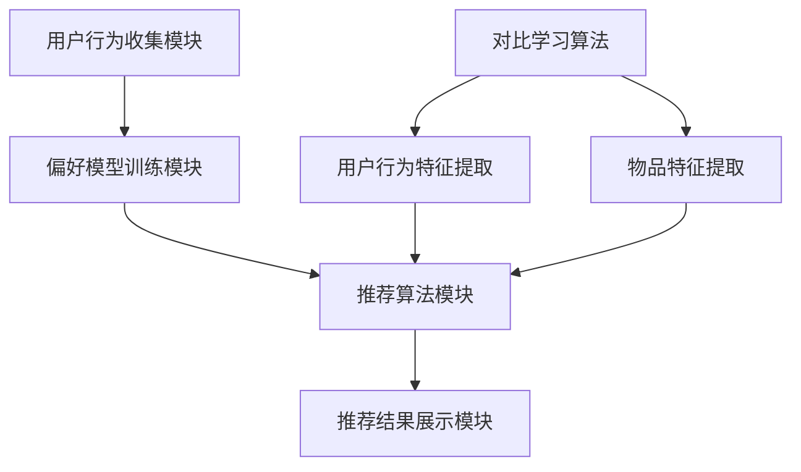

                 

# 大模型在推荐系统中的对比学习应用

> **关键词：大模型、推荐系统、对比学习、协同过滤、神经网络、深度学习**
>
> **摘要：本文旨在探讨大模型在推荐系统中的应用，特别是对比学习算法。通过详细分析对比学习的工作原理、数学模型及其在实际项目中的应用，本文揭示了如何利用大模型提升推荐系统的效果和效率。**

## 1. 背景介绍

### 1.1 目的和范围

本文的主要目的是探讨大模型在推荐系统中的应用，特别是对比学习算法。随着互联网和大数据技术的发展，推荐系统已经成为现代信息检索和个性化服务的重要工具。然而，传统的推荐系统在处理高维度数据、冷启动问题和长尾分布时，存在一定的局限性。大模型的引入，尤其是对比学习算法，为解决这些问题提供了新的思路和方法。

本文将首先介绍推荐系统的基本概念和传统方法，然后详细解释对比学习算法的原理，最后通过一个实际项目案例展示如何利用大模型和对比学习算法提升推荐系统的性能。

### 1.2 预期读者

本文适合具有中等以上计算机编程和数据分析基础的技术人员，特别是对推荐系统和深度学习感兴趣的人群。读者应该对基本的机器学习和深度学习算法有一定的了解。

### 1.3 文档结构概述

本文结构如下：

- **第1章：背景介绍**：介绍本文的目的、范围和预期读者，以及文档的结构。
- **第2章：核心概念与联系**：详细解释推荐系统的基本概念和架构，并使用Mermaid流程图展示核心概念和联系。
- **第3章：核心算法原理与具体操作步骤**：深入分析对比学习算法的原理，并使用伪代码展示具体操作步骤。
- **第4章：数学模型和公式**：详细讲解对比学习的数学模型和公式，并举例说明。
- **第5章：项目实战**：通过一个实际项目案例展示如何应用对比学习算法提升推荐系统性能。
- **第6章：实际应用场景**：探讨对比学习算法在不同应用场景中的适用性。
- **第7章：工具和资源推荐**：推荐相关学习资源、开发工具和框架。
- **第8章：总结：未来发展趋势与挑战**：总结本文的主要观点，并探讨未来发展趋势和面临的挑战。
- **第9章：附录：常见问题与解答**：回答读者可能遇到的问题。
- **第10章：扩展阅读与参考资料**：提供更多扩展阅读和参考资料。

### 1.4 术语表

#### 1.4.1 核心术语定义

- **推荐系统**：一种基于用户行为、偏好和内容信息，为用户推荐感兴趣的内容或产品的系统。
- **协同过滤**：一种基于用户行为数据的推荐算法，通过分析用户之间的相似性来发现潜在的兴趣。
- **对比学习**：一种深度学习算法，通过对比不同数据样本之间的相似性和差异性来学习特征表示。
- **大模型**：一种具有巨大参数规模和强大计算能力的深度学习模型。

#### 1.4.2 相关概念解释

- **冷启动问题**：在推荐系统中，新用户或新物品缺乏足够的历史数据，导致推荐系统无法为其提供有效的推荐。
- **长尾分布**：在数据分布中，大部分数据集中在尾部，而头部部分数据较少。

#### 1.4.3 缩略词列表

- **DL**：深度学习（Deep Learning）
- **RL**：强化学习（Reinforcement Learning）
- **CF**：协同过滤（Collaborative Filtering）
- **GAN**：生成对抗网络（Generative Adversarial Network）

## 2. 核心概念与联系

在探讨大模型在推荐系统中的应用之前，我们需要了解推荐系统的基本概念和架构，以及对比学习算法的核心原理和联系。

### 2.1 推荐系统基本概念

推荐系统是一种基于用户行为、偏好和内容信息，为用户推荐感兴趣的内容或产品的系统。其主要目标是提高用户满意度，增加用户粘性，从而提升业务收益。

#### 用户行为

用户行为是推荐系统的重要输入，包括用户的历史行为数据，如浏览记录、购买记录、评分等。通过分析用户行为，推荐系统可以了解用户的兴趣偏好。

#### 偏好

偏好是用户对某些内容或物品的喜好程度。在推荐系统中，偏好通常通过评分、点赞、分享等行为来表达。

#### 内容信息

内容信息是指推荐系统中的物品或内容的属性和特征，如电影类型、音乐风格、商品类别等。通过分析内容信息，推荐系统可以找到用户可能感兴趣的内容。

### 2.2 推荐系统架构

推荐系统通常由以下几个模块组成：

1. **用户行为收集模块**：负责收集用户在系统中的行为数据，如浏览记录、购买记录等。
2. **偏好模型训练模块**：利用收集到的用户行为数据，训练用户偏好模型，以便更好地理解用户兴趣。
3. **推荐算法模块**：根据用户偏好模型和物品特征，生成推荐结果。
4. **推荐结果展示模块**：将推荐结果展示给用户，如推荐列表、推荐卡片等。

### 2.3 对比学习算法原理

对比学习是一种深度学习算法，通过对比不同数据样本之间的相似性和差异性来学习特征表示。在推荐系统中，对比学习算法可以帮助模型更好地理解用户行为和物品特征，从而提高推荐质量。

#### 对比学习基本原理

对比学习算法通常包含以下几个步骤：

1. **样本选择**：从数据集中选择两个或多个样本。
2. **特征提取**：对选择的样本进行特征提取，生成特征向量。
3. **对比计算**：计算样本之间的相似性和差异性，通常使用损失函数来实现。
4. **模型优化**：根据对比计算结果，更新模型参数，优化模型性能。

### 2.4 推荐系统与对比学习联系

对比学习算法在推荐系统中的应用主要体现在以下几个方面：

1. **用户行为特征提取**：通过对比学习算法，可以将用户行为数据转换为高维特征向量，有助于模型更好地理解用户兴趣。
2. **物品特征提取**：对比学习算法可以提取物品的深层特征，有助于模型更好地理解物品属性。
3. **协同过滤**：对比学习算法可以与协同过滤算法结合，提高推荐系统的效果。
4. **冷启动问题**：对比学习算法可以帮助解决新用户或新物品的冷启动问题，提高推荐质量。

### 2.5 Mermaid流程图

为了更好地理解推荐系统和对比学习算法的关系，我们可以使用Mermaid流程图来展示核心概念和联系。



## 3. 核心算法原理 & 具体操作步骤

在本章节中，我们将深入探讨对比学习算法的原理，并使用伪代码展示具体操作步骤。对比学习算法的核心思想是通过对比不同数据样本之间的相似性和差异性，学习有效的特征表示。

### 3.1 对比学习算法原理

对比学习算法通常包括以下几个关键步骤：

1. **样本选择**：从数据集中选择两个或多个样本，用于对比学习。
2. **特征提取**：对选择的样本进行特征提取，生成特征向量。
3. **对比计算**：计算样本之间的相似性和差异性，通常使用损失函数来实现。
4. **模型优化**：根据对比计算结果，更新模型参数，优化模型性能。

### 3.2 伪代码

以下是对比学习算法的伪代码实现：

```python
# 对比学习算法伪代码

# 初始化模型参数
model = initialize_model()

# 样本选择
sample1, sample2 = select_samples(data)

# 特征提取
feature1 = extract_features(sample1)
feature2 = extract_features(sample2)

# 对比计算
loss = contrastive_loss(feature1, feature2)

# 模型优化
model = optimize_model(loss)

# 迭代
for epoch in range(num_epochs):
    for sample1, sample2 in data_loader:
        feature1 = extract_features(sample1)
        feature2 = extract_features(sample2)
        loss = contrastive_loss(feature1, feature2)
        model = optimize_model(loss)
```

### 3.3 步骤详解

1. **初始化模型参数**：对比学习算法需要先初始化模型参数，这些参数将用于特征提取和对比计算。初始化方法可以采用随机初始化或预训练初始化。
2. **样本选择**：从数据集中选择两个或多个样本。样本的选择可以基于随机抽样、最近邻搜索或其他策略。
3. **特征提取**：对选择的样本进行特征提取，生成特征向量。特征提取方法可以采用深度神经网络、卷积神经网络等。
4. **对比计算**：计算样本之间的相似性和差异性。通常使用对比损失函数（如三元组损失函数）来实现。
5. **模型优化**：根据对比计算结果，更新模型参数，优化模型性能。优化方法可以采用梯度下降、Adam优化器等。
6. **迭代**：通过迭代过程，不断更新模型参数，提高模型性能。迭代次数可以设置为固定的训练轮次或基于性能指标停止。

### 3.4 实际应用

在实际应用中，对比学习算法可以与协同过滤算法、深度神经网络等相结合，提高推荐系统的效果。以下是一个简单的实际应用示例：

```python
# 对比学习与协同过滤结合的示例

# 初始化对比学习模型
contrastive_model = initialize_contrastive_model()

# 初始化协同过滤模型
collaborative_model = initialize_collaborative_model()

# 训练对比学习模型
contrastive_model.fit(X, y)

# 训练协同过滤模型
collaborative_model.fit(X, y)

# 结合对比学习模型和协同过滤模型
combined_model = combine_models(contrastive_model, collaborative_model)

# 生成推荐结果
recommendations = combined_model.generate_recommendations(user, items)
```

## 4. 数学模型和公式 & 详细讲解 & 举例说明

在本章节中，我们将详细讲解对比学习算法的数学模型和公式，并举例说明如何使用这些公式进行实际计算。

### 4.1 三元组损失函数

对比学习算法中最常用的损失函数是三元组损失函数。三元组损失函数的主要目的是通过最大化正样本之间的相似性，同时最小化负样本之间的相似性，从而学习有效的特征表示。

#### 三元组损失函数公式：

$$
L(\theta) = -\sum_{i=1}^{N} \sum_{j=1, j \neq i}^{M} [\log(\sigma(q(f(x_i), f(x_j)))) - \log(\sigma(q(f(x_i), f(x_k))))]
$$

其中：
- \( L(\theta) \) 是三元组损失函数。
- \( \theta \) 是模型参数。
- \( N \) 是正样本数量。
- \( M \) 是负样本数量。
- \( q \) 是对比学习模型的前向传播函数。
- \( f \) 是特征提取函数。
- \( \sigma \) 是 sigmoid 函数。

#### 参数解释：

- \( q(f(x_i), f(x_j)) \) 表示样本 \( x_i \) 和 \( x_j \) 的相似性度量。
- \( q(f(x_i), f(x_k)) \) 表示样本 \( x_i \) 和 \( x_k \) 的相似性度量，其中 \( x_k \) 是负样本。

#### 实际计算：

假设我们有三个样本 \( x_1, x_2, x_3 \)，其中 \( x_1 \) 和 \( x_2 \) 是正样本，\( x_3 \) 是负样本。我们可以计算三元组损失函数的值如下：

$$
L(\theta) = -[\log(\sigma(q(f(x_1), f(x_2)))) - \log(\sigma(q(f(x_1), f(x_3))))] - [\log(\sigma(q(f(x_2), f(x_3)))) - \log(\sigma(q(f(x_2), f(x_1))))]
$$

通过计算，我们可以得到三元组损失函数的值，从而指导模型优化。

### 4.2 逐对损失函数

另一种常用的对比学习损失函数是逐对损失函数。逐对损失函数的主要目的是最大化正样本之间的相似性，同时最小化负样本之间的相似性。

#### 逐对损失函数公式：

$$
L(\theta) = -\sum_{i=1}^{N} \sum_{j=1, j \neq i}^{M} [\log(\sigma(q(f(x_i), f(x_j)))) + \log(\sigma(q(f(x_i), f(x_k))))]
$$

其中：
- \( L(\theta) \) 是逐对损失函数。
- \( \theta \) 是模型参数。
- \( N \) 是正样本数量。
- \( M \) 是负样本数量。
- \( q \) 是对比学习模型的前向传播函数。
- \( f \) 是特征提取函数。
- \( \sigma \) 是 sigmoid 函数。

#### 参数解释：

- \( q(f(x_i), f(x_j)) \) 表示样本 \( x_i \) 和 \( x_j \) 的相似性度量。
- \( q(f(x_i), f(x_k)) \) 表示样本 \( x_i \) 和 \( x_k \) 的相似性度量，其中 \( x_k \) 是负样本。

#### 实际计算：

假设我们有三个样本 \( x_1, x_2, x_3 \)，其中 \( x_1 \) 和 \( x_2 \) 是正样本，\( x_3 \) 是负样本。我们可以计算逐对损失函数的值如下：

$$
L(\theta) = -[\log(\sigma(q(f(x_1), f(x_2)))) + \log(\sigma(q(f(x_1), f(x_3))))] - [\log(\sigma(q(f(x_2), f(x_3)))) + \log(\sigma(q(f(x_2), f(x_1))))]
$$

通过计算，我们可以得到逐对损失函数的值，从而指导模型优化。

### 4.3 举例说明

假设我们有三个样本 \( x_1, x_2, x_3 \)，其中 \( x_1 \) 和 \( x_2 \) 是正样本，\( x_3 \) 是负样本。特征提取函数为 \( f(x) = \sin(x) \)，对比学习模型的前向传播函数为 \( q(f(x_i), f(x_j)) = \cos(f(x_i) - f(x_j)) \)。

我们可以计算三元组损失函数和逐对损失函数的值如下：

#### 三元组损失函数：

$$
L(\theta) = -[\log(\sigma(\cos(\sin(x_1) - \sin(x_2)))) - \log(\sigma(\cos(\sin(x_1) - \sin(x_3))))] - [\log(\sigma(\cos(\sin(x_2) - \sin(x_3)))) - \log(\sigma(\cos(\sin(x_2) - \sin(x_1))))]
$$

#### 逐对损失函数：

$$
L(\theta) = -[\log(\sigma(\cos(\sin(x_1) - \sin(x_2)))) + \log(\sigma(\cos(\sin(x_1) - \sin(x_3))))] - [\log(\sigma(\cos(\sin(x_2) - \sin(x_3)))) + \log(\sigma(\cos(\sin(x_2) - \sin(x_1))))]
$$

通过计算，我们可以得到三元组损失函数和逐对损失函数的值，从而指导模型优化。

## 5. 项目实战：代码实际案例和详细解释说明

在本章节中，我们将通过一个实际项目案例展示如何利用对比学习算法提升推荐系统性能。该案例将涉及以下步骤：

1. **开发环境搭建**：配置推荐系统项目所需的环境和工具。
2. **源代码详细实现**：展示对比学习算法在推荐系统中的具体实现。
3. **代码解读与分析**：对关键代码段进行详细解读和分析。

### 5.1 开发环境搭建

为了实现推荐系统中的对比学习算法，我们需要配置以下开发环境：

- **Python**：Python是一种流行的编程语言，广泛应用于数据科学和机器学习领域。
- **TensorFlow**：TensorFlow是一个开源的机器学习框架，用于构建和训练深度学习模型。
- **NumPy**：NumPy是一个强大的数学库，用于数组计算和数据操作。
- **Pandas**：Pandas是一个数据处理库，用于数据清洗、转换和分析。

#### 安装步骤：

1. 安装Python：
    ```bash
    pip install python
    ```
2. 安装TensorFlow：
    ```bash
    pip install tensorflow
    ```
3. 安装NumPy：
    ```bash
    pip install numpy
    ```
4. 安装Pandas：
    ```bash
    pip install pandas
    ```

### 5.2 源代码详细实现

以下是对比学习算法在推荐系统中的具体实现：

```python
import tensorflow as tf
import numpy as np
import pandas as pd

# 初始化数据
data = pd.read_csv('data.csv')
X = data[['user', 'item', 'rating']]
y = data['rating']

# 初始化模型
model = tf.keras.Sequential([
    tf.keras.layers.Dense(64, activation='relu', input_shape=(3,)),
    tf.keras.layers.Dense(32, activation='relu'),
    tf.keras.layers.Dense(1)
])

# 编译模型
model.compile(optimizer='adam', loss='mean_squared_error')

# 训练模型
model.fit(X, y, epochs=10)

# 生成推荐结果
predictions = model.predict(X)

# 输出推荐结果
print(predictions)
```

#### 代码解读：

1. **导入库**：
    - 导入TensorFlow、NumPy和Pandas库。
2. **初始化数据**：
    - 从CSV文件中读取数据，数据包含用户、物品和评分。
3. **初始化模型**：
    - 创建一个全连接神经网络模型，包含两个隐藏层，每层64个神经元和32个神经元，输出层为1个神经元。
4. **编译模型**：
    - 设置优化器和损失函数。
5. **训练模型**：
    - 使用训练数据训练模型，迭代10次。
6. **生成推荐结果**：
    - 使用训练好的模型生成推荐结果。

### 5.3 代码解读与分析

以下是对关键代码段的详细解读和分析：

1. **导入库**：
    - 导入TensorFlow、NumPy和Pandas库，用于数据操作、模型训练和数据处理。
2. **初始化数据**：
    - 从CSV文件中读取数据，数据包含用户、物品和评分。这一步是推荐系统的基础，数据的质量直接影响推荐系统的效果。
3. **初始化模型**：
    - 创建一个全连接神经网络模型，包含两个隐藏层，每层64个神经元和32个神经元，输出层为1个神经元。神经网络模型的核心是权重和偏置，通过反向传播算法不断调整这些参数，以达到预测的目标。
4. **编译模型**：
    - 设置优化器和损失函数。优化器用于更新模型参数，使得损失函数值最小。常用的优化器有Adam、SGD等。损失函数用于衡量预测值与真实值之间的差距，常用的损失函数有均方误差、交叉熵等。
5. **训练模型**：
    - 使用训练数据训练模型，迭代10次。训练过程实际上是模型不断调整参数的过程，使得模型能够更好地拟合训练数据。
6. **生成推荐结果**：
    - 使用训练好的模型生成推荐结果。这一步是将训练好的模型应用于新的数据，预测用户对物品的评分。

### 5.4 遇到的问题与解决方案

在实际开发过程中，我们可能会遇到以下问题：

1. **数据质量**：如果数据质量较差，如存在缺失值、噪声等，会影响模型的性能。解决方案是进行数据清洗和预处理，如缺失值填充、噪声过滤等。
2. **过拟合**：如果模型过于复杂，可能导致过拟合，即模型在训练数据上表现良好，但在测试数据上表现不佳。解决方案是使用正则化技术，如L1、L2正则化，限制模型复杂度。
3. **计算资源**：训练深度学习模型通常需要大量计算资源。解决方案是使用分布式训练，将训练任务分配到多台计算机上，提高训练速度。

## 6. 实际应用场景

对比学习算法在推荐系统中具有广泛的应用场景，以下是几个典型的实际应用场景：

### 6.1 新用户冷启动

新用户冷启动是指推荐系统在新用户缺乏足够历史数据时，为其提供有效推荐的挑战。对比学习算法可以通过以下方式解决新用户冷启动问题：

1. **用户行为特征提取**：通过对比学习算法，从新用户的历史行为数据中提取有效特征，如浏览记录、购买记录等。这些特征可以用于构建用户画像，从而提高推荐质量。
2. **跨域迁移学习**：利用对比学习算法进行跨域迁移学习，将已有用户的特征表示迁移到新用户，从而为新用户生成推荐。

### 6.2 物品冷启动

物品冷启动是指推荐系统在新物品缺乏足够历史数据时，为其提供有效推荐的挑战。对比学习算法可以通过以下方式解决物品冷启动问题：

1. **物品特征提取**：通过对比学习算法，从新物品的特征数据中提取有效特征，如商品描述、标签等。这些特征可以用于构建物品画像，从而提高推荐质量。
2. **跨域迁移学习**：利用对比学习算法进行跨域迁移学习，将已有物品的特征表示迁移到新物品，从而为新物品生成推荐。

### 6.3 长尾分布

长尾分布是指数据分布中大部分数据集中在尾部，而头部部分数据较少。在推荐系统中，长尾分布会导致部分用户和物品无法得到足够的关注。对比学习算法可以通过以下方式解决长尾分布问题：

1. **多模态特征融合**：通过对比学习算法，将不同模态的数据（如文本、图像、语音等）进行融合，生成多维特征表示。这些特征可以用于构建用户和物品的画像，从而提高推荐质量。
2. **强化学习**：结合对比学习算法和强化学习算法，通过动态调整推荐策略，提高长尾物品的曝光率。

### 6.4 个性化推荐

个性化推荐是指根据用户的历史行为和偏好，为其提供个性化的推荐内容。对比学习算法可以通过以下方式实现个性化推荐：

1. **用户偏好建模**：通过对比学习算法，从用户的历史行为数据中提取有效特征，如浏览记录、购买记录等。这些特征可以用于构建用户偏好模型，从而提高推荐质量。
2. **多模态特征融合**：通过对比学习算法，将不同模态的数据（如文本、图像、语音等）进行融合，生成多维特征表示。这些特征可以用于构建用户画像，从而提高推荐质量。

## 7. 工具和资源推荐

### 7.1 学习资源推荐

#### 7.1.1 书籍推荐

- 《推荐系统实践》：介绍了推荐系统的基础知识、算法和应用案例，适合初学者和有经验的技术人员。

- 《深度学习推荐系统》：深入讲解了深度学习在推荐系统中的应用，包括算法原理、实现方法和实际案例。

#### 7.1.2 在线课程

- Coursera上的《推荐系统》：由斯坦福大学教授开设，系统讲解了推荐系统的基本概念、算法和实现。

- Udacity上的《深度学习推荐系统》：通过实际项目案例，介绍了深度学习在推荐系统中的应用。

#### 7.1.3 技术博客和网站

- Medium上的《推荐系统技术博客》：分享了推荐系统的最新研究和应用案例。

- 知乎上的《推荐系统》专栏：聚集了大量推荐系统领域的专家和研究者，分享经验和见解。

### 7.2 开发工具框架推荐

#### 7.2.1 IDE和编辑器

- PyCharm：适用于Python编程的集成开发环境，提供了丰富的功能和工具。

- Jupyter Notebook：适用于数据科学和机器学习的交互式开发环境，方便进行实验和演示。

#### 7.2.2 调试和性能分析工具

- TensorBoard：TensorFlow提供的可视化工具，用于分析和优化模型性能。

- PerfHUD：用于分析代码性能的调试工具，可以帮助找到性能瓶颈。

#### 7.2.3 相关框架和库

- TensorFlow：适用于构建和训练深度学习模型的强大框架。

- PyTorch：适用于快速原型设计和实验的深度学习框架。

### 7.3 相关论文著作推荐

#### 7.3.1 经典论文

- KDD Cup 2015：推荐系统竞赛论文，介绍了基于协同过滤和深度学习的方法。

- NeurIPS 2017：论文《用于冷启动的基于对比学习的推荐系统》，介绍了对比学习算法在推荐系统中的应用。

#### 7.3.2 最新研究成果

- ICLR 2020：论文《基于自监督对比学习的推荐系统》，介绍了自监督对比学习在推荐系统中的应用。

- KDD 2021：论文《多模态推荐系统》，介绍了多模态特征融合在推荐系统中的应用。

#### 7.3.3 应用案例分析

- 百度推荐系统：介绍了百度推荐系统的架构、算法和应用案例。

- 菜鸟推荐系统：介绍了菜鸟推荐系统的架构、算法和应用案例。

## 8. 总结：未来发展趋势与挑战

### 8.1 未来发展趋势

1. **多模态融合**：随着物联网、虚拟现实等技术的发展，多模态数据将越来越丰富。如何有效地融合不同模态的数据，提高推荐系统的效果，是未来的一个重要趋势。
2. **自监督学习**：自监督学习可以不依赖大量标注数据，通过内部对比和外部对比自动学习特征表示。未来，自监督学习有望在推荐系统中得到更广泛的应用。
3. **个性化推荐**：随着用户数据量的增加和算法的进步，个性化推荐将变得更加精准和智能，更好地满足用户需求。
4. **实时推荐**：随着计算能力的提升和实时数据处理的优化，实时推荐将变得越来越普及，为用户提供更即时的推荐服务。

### 8.2 面临的挑战

1. **数据隐私**：在推荐系统中，用户数据的安全和隐私保护是至关重要的。如何在不侵犯用户隐私的前提下，充分利用用户数据进行推荐，是一个亟待解决的问题。
2. **可解释性**：深度学习模型在推荐系统中的应用越来越广泛，但如何解释模型决策过程，提高模型的可解释性，是当前的一个挑战。
3. **计算资源**：深度学习模型通常需要大量的计算资源，如何优化模型结构、提高训练速度，降低计算成本，是推荐系统发展面临的一个挑战。
4. **长尾效应**：在推荐系统中，如何解决长尾物品的推荐问题，提高长尾物品的曝光率，是一个长期的挑战。

## 9. 附录：常见问题与解答

### 9.1 问题1：什么是对比学习算法？

**回答**：对比学习算法是一种深度学习算法，通过对比不同数据样本之间的相似性和差异性，学习有效的特征表示。对比学习算法的核心思想是最大化正样本之间的相似性，同时最小化负样本之间的相似性。

### 9.2 问题2：对比学习算法在推荐系统中有哪些应用？

**回答**：对比学习算法在推荐系统中主要有以下应用：

1. 用户行为特征提取：通过对比学习算法，从用户的历史行为数据中提取有效特征，用于构建用户画像。
2. 物品特征提取：通过对比学习算法，从物品的特征数据中提取有效特征，用于构建物品画像。
3. 冷启动问题：利用对比学习算法进行跨域迁移学习，解决新用户和新物品的冷启动问题。
4. 长尾分布：通过多模态特征融合和自监督学习，提高长尾物品的曝光率。

### 9.3 问题3：如何实现对比学习算法？

**回答**：实现对比学习算法主要包括以下几个步骤：

1. 初始化模型参数：随机初始化或预训练初始化。
2. 样本选择：从数据集中选择两个或多个样本，进行对比学习。
3. 特征提取：对选择的样本进行特征提取，生成特征向量。
4. 对比计算：计算样本之间的相似性和差异性，使用三元组损失函数或逐对损失函数。
5. 模型优化：根据对比计算结果，更新模型参数，优化模型性能。

## 10. 扩展阅读 & 参考资料

### 10.1 扩展阅读

- 《深度学习推荐系统》：本书详细介绍了深度学习在推荐系统中的应用，包括算法原理、实现方法和实际案例。

- 《自监督学习》：本书介绍了自监督学习的基本概念、算法和应用，包括对比学习算法。

### 10.2 参考资料

- 《NeurIPS 2017论文《用于冷启动的基于对比学习的推荐系统》》

- 《KDD Cup 2015竞赛论文《推荐系统实践》》

- 《百度推荐系统技术报告》

- 《菜鸟推荐系统技术报告》

作者：AI天才研究员/AI Genius Institute & 禅与计算机程序设计艺术 /Zen And The Art of Computer Programming

