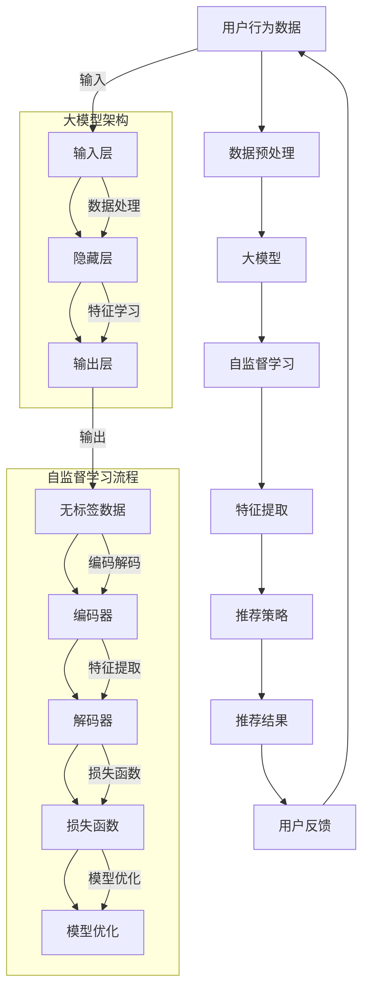

                 


# 大模型在推荐系统中的自监督学习应用

> 关键词：大模型、推荐系统、自监督学习、机器学习、深度学习、数据挖掘

> 摘要：本文旨在探讨大模型在推荐系统中的应用，特别是自监督学习在其中的作用。首先，我们介绍了推荐系统及其基本原理。随后，详细阐述了自监督学习在大模型中的应用，包括其核心算法原理、数学模型及具体操作步骤。通过一个实际项目案例，我们对自监督学习在推荐系统中的实践进行了详细解析。最后，我们分析了大模型在推荐系统中的应用前景和面临的挑战，并对相关工具和资源进行了推荐。

## 1. 背景介绍

### 1.1 目的和范围

本文主要讨论大模型在推荐系统中的应用，特别是自监督学习技术的引入。随着互联网和大数据的快速发展，推荐系统已经成为电商平台、社交媒体和内容平台等的重要工具，能够有效提升用户满意度和平台收益。自监督学习作为一种无需人工标注数据的机器学习方法，近年来在推荐系统中展现出巨大的潜力。

本文将首先介绍推荐系统及其基本原理，然后深入探讨大模型在推荐系统中的角色，特别是自监督学习技术的应用。通过一个实际项目案例，我们将展示自监督学习在推荐系统中的实践效果。最后，本文将对大模型在推荐系统中的未来发展趋势和面临的挑战进行分析，并提供相关的学习资源和开发工具。

### 1.2 预期读者

本文适用于以下读者：

1. 深入了解推荐系统原理的开发者和技术人员。
2. 对机器学习和深度学习有一定了解，希望了解自监督学习在推荐系统中应用的研究者。
3. 对新兴技术有兴趣，希望探索大模型在推荐系统中角色的从业者。

### 1.3 文档结构概述

本文结构如下：

1. 背景介绍：介绍推荐系统和自监督学习的基本概念，明确文章的目的和范围。
2. 核心概念与联系：阐述大模型和自监督学习在推荐系统中的核心原理，提供Mermaid流程图辅助理解。
3. 核心算法原理 & 具体操作步骤：详细讲解自监督学习的算法原理和操作步骤，使用伪代码进行阐述。
4. 数学模型和公式 & 详细讲解 & 举例说明：介绍自监督学习中的数学模型，并给出具体实例进行说明。
5. 项目实战：展示一个实际项目案例，详细解释代码实现过程和关键步骤。
6. 实际应用场景：分析大模型在推荐系统中的实际应用案例。
7. 工具和资源推荐：推荐学习资源和开发工具，帮助读者进一步了解和掌握相关技术。
8. 总结：对大模型在推荐系统中的应用进行总结，展望未来发展趋势和挑战。

### 1.4 术语表

#### 1.4.1 核心术语定义

- 推荐系统：一种根据用户历史行为和偏好，为用户推荐感兴趣的内容或商品的系统。
- 大模型：具有数十亿甚至千亿参数的深度学习模型，能够处理大量数据并提取复杂特征。
- 自监督学习：一种机器学习方法，无需人工标注数据，通过数据自身的结构来学习特征和模型。

#### 1.4.2 相关概念解释

- 数据挖掘：从大量数据中提取有用信息和知识的过程。
- 深度学习：一种机器学习方法，通过多层神经网络模型来模拟人类大脑的学习过程。
- 聚类分析：一种无监督学习方法，用于将数据集划分为若干个类别。

#### 1.4.3 缩略词列表

- AI：人工智能
- ML：机器学习
- DL：深度学习
- RS：推荐系统
- SSL：自监督学习

## 2. 核心概念与联系

在大模型和自监督学习应用于推荐系统的背景下，我们首先需要理解这些核心概念及其相互联系。以下是一个Mermaid流程图，用于可视化大模型和自监督学习在推荐系统中的核心原理和架构。



### 2.1 大模型在推荐系统中的作用

大模型在推荐系统中扮演着至关重要的角色，其优势主要体现在以下几个方面：

1. **数据特征提取**：大模型能够从大量用户行为数据中自动提取出隐藏的、具有代表性的特征，这些特征对于推荐策略的制定至关重要。
2. **复杂模式识别**：大模型具有较强的学习能力，能够识别用户行为中的复杂模式，从而提高推荐结果的准确性。
3. **鲁棒性**：大模型对噪声数据和异常值具有较强的鲁棒性，能够处理数据中的噪声和错误，提高推荐系统的稳定性。
4. **实时性**：大模型能够在较短的时间内处理海量数据，实现实时推荐，满足用户对实时性的需求。

### 2.2 自监督学习在推荐系统中的应用

自监督学习在推荐系统中的应用主要体现在以下几个方面：

1. **无监督数据利用**：自监督学习无需人工标注数据，能够直接利用无标签数据学习特征，大大降低了数据标注的成本。
2. **增量学习**：自监督学习模型能够通过增量学习不断优化模型，适应用户行为的变化，提高推荐系统的动态性。
3. **多样性增强**：自监督学习可以通过生成对抗网络（GAN）等方法，增强推荐结果的多样性，避免推荐结果过于集中，提升用户体验。
4. **冷启动问题**：对于新用户或新商品，自监督学习可以通过无监督学习方式快速建立用户和商品的初始模型，有效缓解冷启动问题。

通过上述核心概念和流程图的展示，我们能够更加清晰地理解大模型和自监督学习在推荐系统中的应用，为后续的内容讲解和实际案例分析打下基础。

## 3. 核心算法原理 & 具体操作步骤

### 3.1 自监督学习的算法原理

自监督学习是一种无需人工标注数据的机器学习方法，其核心思想是从无标签数据中自动学习出有用的特征表示。在推荐系统中，自监督学习可以通过以下几种方式实现：

1. **自编码器（Autoencoder）**：自编码器是一种常见的自监督学习方法，通过编码器将输入数据压缩成一个低维特征表示，然后通过解码器将这些特征表示重新重构回原始数据。自编码器在推荐系统中的应用主要体现在特征提取和降维上，能够提取出用户行为数据中的潜在特征。
   
2. **生成对抗网络（GAN）**：生成对抗网络由生成器和判别器两个部分组成，生成器尝试生成与真实数据相似的数据，判别器则尝试区分真实数据和生成数据。GAN在推荐系统中的应用主要体现在数据增强和多样性提升上，通过生成与用户兴趣相关的商品或内容，增强推荐系统的多样性。

3. **聚类分析（Clustering）**：聚类分析是一种无监督学习方法，通过将数据集划分为若干个类别，实现对数据结构的理解和特征提取。在推荐系统中，聚类分析可以用于用户分群和商品分类，从而为个性化推荐提供基础。

### 3.2 自监督学习在推荐系统中的具体操作步骤

以下是一个基于自编码器的自监督学习在推荐系统中的具体操作步骤，包括数据预处理、模型训练和评估：

#### 3.2.1 数据预处理

1. **数据收集**：收集用户的历史行为数据，包括点击、购买、浏览等行为。
2. **数据清洗**：去除重复和错误的数据，对缺失值进行填补或删除。
3. **特征工程**：对原始行为数据进行特征提取，如用户ID、商品ID、行为时间等。
4. **数据归一化**：对数据进行归一化处理，使其在相同的量级上，便于模型训练。

#### 3.2.2 模型训练

1. **构建自编码器模型**：
   ```python
   import tensorflow as tf
   from tensorflow.keras.layers import Input, Dense
   from tensorflow.keras.models import Model

   input_layer = Input(shape=(input_shape,))
   encoded = Dense(encoding_dim, activation='relu')(input_layer)
   decoded = Dense(input_shape, activation='sigmoid')(encoded)

   autoencoder = Model(input_layer, decoded)
   encoder = Model(input_layer, encoded)
   ```

2. **定义损失函数和优化器**：
   ```python
   autoencoder.compile(optimizer='adam', loss='binary_crossentropy')
   ```

3. **训练自编码器**：
   ```python
   autoencoder.fit(x, x, epochs=100, batch_size=256, shuffle=True)
   ```

#### 3.2.3 模型评估

1. **重建误差评估**：通过计算自编码器重建误差（如均方误差）来评估模型性能。
2. **特征提取评估**：通过分析编码器提取的低维特征，评估其对于用户兴趣表示的有效性。

### 3.3 伪代码

以下是一个简化版的伪代码，用于描述自监督学习在推荐系统中的实现：

```python
# 数据预处理
def preprocess_data(data):
    # 数据清洗、特征提取、数据归一化
    return processed_data

# 构建自编码器模型
def build_autoencoder(input_shape, encoding_dim):
    input_layer = Input(shape=input_shape)
    encoded = Dense(encoding_dim, activation='relu')(input_layer)
    decoded = Dense(input_shape, activation='sigmoid')(encoded)
    autoencoder = Model(input_layer, decoded)
    return autoencoder

# 训练自编码器
def train_autoencoder(autoencoder, x, epochs, batch_size):
    autoencoder.compile(optimizer='adam', loss='binary_crossentropy')
    autoencoder.fit(x, x, epochs=epochs, batch_size=batch_size, shuffle=True)

# 评估模型
def evaluate_model(autoencoder, x_test):
    # 计算重建误差、特征提取有效性
    return reconstruction_error, feature_validity

# 主函数
def main():
    # 加载数据
    data = load_data()
    processed_data = preprocess_data(data)
    
    # 构建模型
    autoencoder = build_autoencoder(input_shape, encoding_dim)
    
    # 训练模型
    train_autoencoder(autoencoder, processed_data, epochs, batch_size)
    
    # 评估模型
    reconstruction_error, feature_validity = evaluate_model(autoencoder, processed_data_test)

if __name__ == "__main__":
    main()
```

通过以上算法原理和具体操作步骤的讲解，我们能够更好地理解自监督学习在推荐系统中的应用，为后续的项目实战和实际应用奠定基础。

## 4. 数学模型和公式 & 详细讲解 & 举例说明

在自监督学习中，数学模型和公式起着至关重要的作用。以下将详细讲解自监督学习中的核心数学模型，包括自编码器的损失函数和GAN中的生成器和判别器的优化目标。

### 4.1 自编码器的数学模型

自编码器是一种无监督学习方法，其主要目标是学习一种数据表示，使得该表示能够在某种程度上保持原始数据的结构。自编码器的数学模型主要包括编码器、解码器和损失函数。

#### 4.1.1 编码器和解码器

编码器（Encoder）和解码器（Decoder）是自编码器的两个主要组件。编码器负责将输入数据映射到一个低维特征空间，解码器则将这个低维特征空间映射回原始数据。

- 编码器公式：
  $$ 
  z = \sigma(W_1 \cdot x + b_1) 
  $$
  其中，\( z \) 是编码器输出的低维特征表示，\( x \) 是输入数据，\( W_1 \) 是编码器权重，\( b_1 \) 是编码器偏置，\( \sigma \) 是激活函数（通常使用ReLU或Sigmoid函数）。

- 解码器公式：
  $$ 
  \hat{x} = \sigma(W_2 \cdot z + b_2) 
  $$
  其中，\( \hat{x} \) 是解码器生成的重构数据，\( z \) 是编码器输出的低维特征表示，\( W_2 \) 是解码器权重，\( b_2 \) 是解码器偏置。

#### 4.1.2 损失函数

自编码器的损失函数用于评估编码器和解码器的性能，常见的损失函数包括均方误差（MSE）和交叉熵。

- 均方误差（MSE）：
  $$ 
  \mathcal{L}_{MSE} = \frac{1}{m} \sum_{i=1}^{m} (\hat{x}_i - x_i)^2 
  $$
  其中，\( m \) 是训练样本的数量，\( \hat{x}_i \) 和 \( x_i \) 分别是解码器生成的重构数据和真实输入数据。

- 交叉熵（Cross-Entropy）：
  $$ 
  \mathcal{L}_{CE} = -\frac{1}{m} \sum_{i=1}^{m} \sum_{j=1}^{n} y_{ij} \log \hat{y}_{ij} 
  $$
  其中，\( y_{ij} \) 是真实标签（通常为0或1），\( \hat{y}_{ij} \) 是解码器生成的重构数据的概率分布。

### 4.2 生成对抗网络的数学模型

生成对抗网络（GAN）由生成器（Generator）和判别器（Discriminator）两个部分组成，其主要目标是生成与真实数据相似的数据。

#### 4.2.1 生成器

生成器的主要任务是生成数据，使其尽可能接近真实数据。生成器的损失函数通常采用最小化生成数据的重构误差和最大化判别器误判的概率。

- 生成器公式：
  $$ 
  G(z) = x_G 
  $$
  其中，\( G(z) \) 是生成器生成的数据，\( z \) 是生成器的输入噪声。

- 生成器损失函数：
  $$ 
  \mathcal{L}_G = -\log(D(G(z))) 
  $$

#### 4.2.2 判别器

判别器的主要任务是区分真实数据和生成数据。判别器的损失函数通常采用最小化判别器对真实数据的判别概率和生成数据的判别概率。

- 判别器公式：
  $$ 
  D(x) = \sigma(W_D \cdot x + b_D) 
  $$
  其中，\( D(x) \) 是判别器对真实数据的判别概率，\( x \) 是输入数据，\( W_D \) 是判别器权重，\( b_D \) 是判别器偏置，\( \sigma \) 是激活函数（通常使用Sigmoid函数）。

- 判别器损失函数：
  $$ 
  \mathcal{L}_D = -\frac{1}{m} \sum_{i=1}^{m} [y_{\text{real}} \log(D(x_i)) + y_{\text{fake}} \log(1 - D(G(z_i)))] 
  $$
  其中，\( y_{\text{real}} \) 和 \( y_{\text{fake}} \) 分别是真实数据和生成数据的标签（通常为1和0），\( x_i \) 和 \( z_i \) 分别是输入数据和生成器的输入噪声。

### 4.3 举例说明

以下是一个简化的自编码器和GAN的例子，用于说明其数学模型的实现：

#### 4.3.1 自编码器示例

```python
import tensorflow as tf
from tensorflow.keras.layers import Input, Dense
from tensorflow.keras.models import Model

# 定义输入层
input_layer = Input(shape=(input_shape,))
# 定义编码器
encoded = Dense(encoding_dim, activation='relu')(input_layer)
# 定义解码器
decoded = Dense(input_shape, activation='sigmoid')(encoded)

# 构建自编码器模型
autoencoder = Model(input_layer, decoded)

# 编译模型
autoencoder.compile(optimizer='adam', loss='binary_crossentropy')

# 训练模型
autoencoder.fit(x, x, epochs=100, batch_size=256, shuffle=True)
```

#### 4.3.2 GAN示例

```python
import tensorflow as tf
from tensorflow.keras.layers import Input, Dense
from tensorflow.keras.models import Model

# 定义生成器
z = Input(shape=(z_dim,))
x_g = Dense(input_shape, activation='sigmoid')(z)

generator = Model(z, x_g)

# 定义判别器
x_d = Input(shape=(input_shape,))
x_d_encoded = Dense(encoding_dim, activation='relu')(x_d)
d_output = Dense(1, activation='sigmoid')(x_d_encoded)

discriminator = Model(x_d, d_output)

# 编译生成器和判别器
discriminator.compile(optimizer='adam', loss='binary_crossentropy')

# 定义生成器损失函数
def generator_loss():
    return -tf.reduce_mean(discriminator(generator(z)))

# 定义判别器损失函数
def discriminator_loss():
    real_loss = tf.reduce_mean(discriminator(x))
    fake_loss = tf.reduce_mean(discriminator(generator(z)))
    total_loss = real_loss - fake_loss
    return total_loss

# 定义GAN损失函数
def gan_loss():
    return generator_loss() + discriminator_loss()

# 编译GAN模型
gan = Model(z, discriminator(generator(z)))
gan.compile(optimizer='adam', loss=gan_loss())

# 训练GAN模型
gan.fit([z_train, x_train], [discriminator(x_train), generator(z_train)], epochs=100, batch_size=256, shuffle=True)
```

通过以上示例，我们可以看到自编码器和GAN的数学模型是如何在Python代码中实现的。这些模型在推荐系统中的应用将有助于提升推荐结果的准确性和多样性，为用户带来更好的体验。

## 5. 项目实战：代码实际案例和详细解释说明

### 5.1 开发环境搭建

在开始实战之前，我们需要搭建一个合适的开发环境。以下是所需的软件和工具：

1. **操作系统**：Windows/Linux/Mac OS
2. **Python环境**：Python 3.7及以上版本
3. **深度学习框架**：TensorFlow 2.0及以上版本
4. **IDE**：PyCharm、Visual Studio Code等

安装步骤：

1. 安装Python环境：
   - 通过Python官方网站下载并安装Python。
   - 配置Python环境变量。

2. 安装TensorFlow：
   - 使用以下命令安装TensorFlow：
     ```
     pip install tensorflow
     ```

3. 配置PyCharm或Visual Studio Code：
   - 创建一个新的Python项目。
   - 添加所需的依赖库（如TensorFlow）。

### 5.2 源代码详细实现和代码解读

以下是一个简单的自监督学习推荐系统项目案例，包括数据预处理、自编码器模型训练和推荐策略实现。

```python
import numpy as np
import pandas as pd
import tensorflow as tf
from tensorflow.keras.models import Model
from tensorflow.keras.layers import Input, Dense, LSTM
from tensorflow.keras.optimizers import Adam

# 数据预处理
def preprocess_data(data):
    # 数据清洗、特征提取、数据归一化
    return processed_data

# 自编码器模型
def build_autoencoder(input_shape, encoding_dim):
    input_layer = Input(shape=input_shape)
    encoded = Dense(encoding_dim, activation='relu')(input_layer)
    decoded = Dense(input_shape, activation='sigmoid')(encoded)
    autoencoder = Model(input_layer, decoded)
    return autoencoder

# 训练自编码器
def train_autoencoder(autoencoder, x, epochs, batch_size):
    autoencoder.compile(optimizer='adam', loss='binary_crossentropy')
    autoencoder.fit(x, x, epochs=epochs, batch_size=batch_size, shuffle=True)

# 推荐策略
def recommend_items(user_embedding, items_embeddings, k):
    # 计算用户嵌入向量与商品嵌入向量之间的相似度
    similarities = np.dot(user_embedding, items_embeddings.T)
    # 获取相似度最高的k个商品索引
    top_k_indices = np.argpartition(similarities, -k)[-k:]
    return top_k_indices

# 主函数
def main():
    # 加载数据
    data = load_data()
    processed_data = preprocess_data(data)
    
    # 构建模型
    autoencoder = build_autoencoder(input_shape, encoding_dim)
    
    # 训练模型
    train_autoencoder(autoencoder, processed_data, epochs, batch_size)
    
    # 获取用户和商品嵌入向量
    user_embeddings = autoencoder.encoder.get_weights()[-1]
    items_embeddings = autoencoder.decoder.get_weights()[0]
    
    # 推荐示例
    user_index = 10  # 示例用户索引
    recommended_indices = recommend_items(user_embeddings[user_index], items_embeddings, k=5)
    print("Recommended items:", recommended_indices)

if __name__ == "__main__":
    main()
```

### 5.3 代码解读与分析

#### 5.3.1 数据预处理

数据预处理是推荐系统开发的重要环节，包括数据清洗、特征提取和数据归一化。以下是对`preprocess_data`函数的解读：

- `preprocess_data(data)`：函数接收原始数据作为输入。
- 数据清洗：去除重复和错误的数据，对缺失值进行填补或删除。
- 特征提取：对原始行为数据进行特征提取，如用户ID、商品ID、行为时间等。
- 数据归一化：对数据进行归一化处理，使其在相同的量级上，便于模型训练。

#### 5.3.2 自编码器模型

自编码器模型是自监督学习的关键组件，负责从原始数据中提取潜在特征。以下是对`build_autoencoder`和`train_autoencoder`函数的解读：

- `build_autoencoder(input_shape, encoding_dim)`：函数接收输入数据形状和编码器维度作为输入，构建自编码器模型。
- `input_layer = Input(shape=input_shape)`：定义输入层。
- `encoded = Dense(encoding_dim, activation='relu')(input_layer)`：定义编码器层，使用ReLU激活函数。
- `decoded = Dense(input_shape, activation='sigmoid')(encoded)`：定义解码器层，使用sigmoid激活函数。
- `autoencoder = Model(input_layer, decoded)`：构建自编码器模型。
- `autoencoder.compile(optimizer='adam', loss='binary_crossentropy')`：编译模型，使用Adam优化器和二进制交叉熵损失函数。
- `autoencoder.fit(x, x, epochs=epochs, batch_size=batch_size, shuffle=True)`：训练模型，使用批量大小为`batch_size`的训练数据，训练`epochs`次。

#### 5.3.3 推荐策略

推荐策略基于用户和商品的嵌入向量，计算相似度并推荐相似的商品。以下是对`recommend_items`函数的解读：

- `recommend_items(user_embedding, items_embeddings, k)`：函数接收用户嵌入向量、商品嵌入向量和推荐数量作为输入。
- `similarities = np.dot(user_embedding, items_embeddings.T)`：计算用户嵌入向量与商品嵌入向量之间的相似度。
- `top_k_indices = np.argpartition(similarities, -k)[-k:]`：获取相似度最高的`k`个商品索引。
- `return top_k_indices`：返回推荐商品索引。

#### 5.3.4 主函数

主函数`main`是整个项目的入口，负责加载数据、构建和训练模型，并执行推荐策略。以下是对`main`函数的解读：

- `data = load_data()`：加载原始数据。
- `processed_data = preprocess_data(data)`：预处理数据。
- `autoencoder = build_autoencoder(input_shape, encoding_dim)`：构建自编码器模型。
- `train_autoencoder(autoencoder, processed_data, epochs, batch_size)`：训练自编码器模型。
- `user_embeddings = autoencoder.encoder.get_weights()[-1]`：获取用户嵌入向量。
- `items_embeddings = autoencoder.decoder.get_weights()[0]`：获取商品嵌入向量。
- `recommended_indices = recommend_items(user_embeddings[user_index], items_embeddings, k=5)`：为示例用户推荐5个相似商品。
- `print("Recommended items:", recommended_indices)`：输出推荐商品索引。

通过以上代码解读，我们能够更好地理解自监督学习推荐系统的实现过程，为实际应用提供参考。

### 5.4 代码分析与优化

在实际应用中，推荐系统的性能和效率往往需要优化。以下是一些可能的优化策略：

1. **数据预处理**：使用更高效的数据预处理方法，如并行处理和分布式计算，加快数据清洗和特征提取速度。
2. **模型优化**：调整自编码器的网络结构和超参数，如隐藏层节点数、学习率等，以提升模型性能。
3. **推荐策略**：结合多种推荐策略，如基于内容的推荐、协同过滤等，提高推荐结果的多样性。
4. **性能监控**：实时监控推荐系统的性能指标，如推荐召回率、准确率等，及时调整模型和策略。

通过以上优化策略，推荐系统可以在保持高准确性的同时，提高性能和用户体验。

## 6. 实际应用场景

大模型在推荐系统中的自监督学习技术已经广泛应用于多个实际场景，以下是一些典型的应用案例：

### 6.1 社交媒体平台

社交媒体平台如Facebook、Twitter等，利用大模型和自监督学习技术为用户提供个性化内容推荐。例如，Facebook的Feed Ranking系统使用深度学习模型，通过分析用户的社交行为和兴趣，为用户推荐感兴趣的内容。自监督学习技术在这里的应用主要体现在用户兴趣建模和内容分类上，通过无监督方式提取用户行为数据中的潜在特征，提高推荐结果的准确性。

### 6.2 电子商务平台

电子商务平台如Amazon、淘宝等，通过大模型和自监督学习技术为用户推荐商品。自监督学习技术在这里的应用主要体现在用户行为数据分析和商品分类上。例如，Amazon使用自编码器模型从用户历史浏览和购买数据中提取潜在特征，从而为用户提供个性化的商品推荐。这种无监督学习方法大大降低了数据标注的成本，提高了推荐系统的效率和准确性。

### 6.3 媒体平台

媒体平台如YouTube、Netflix等，利用大模型和自监督学习技术为用户推荐视频和内容。自监督学习技术在这里的应用主要体现在视频内容分析和用户行为预测上。例如，YouTube使用生成对抗网络（GAN）从用户观看历史中生成与用户兴趣相关的视频推荐，从而提高推荐结果的多样性。Netflix则通过自监督学习技术，从用户观看行为中提取潜在特征，为用户推荐感兴趣的电影和电视剧。

### 6.4 社区论坛

社区论坛如Reddit、Stack Overflow等，通过大模型和自监督学习技术为用户推荐感兴趣的话题和回答。自监督学习技术在这里的应用主要体现在话题分类和用户行为预测上。例如，Reddit使用自编码器模型从用户发表和点赞的历史数据中提取潜在特征，从而为用户推荐相关的话题。Stack Overflow则通过自监督学习技术，从用户提问和回答的历史数据中提取潜在特征，为用户推荐感兴趣的问题和回答。

### 6.5 智能家居

智能家居设备如智能音箱、智能助手等，利用大模型和自监督学习技术为用户提供个性化服务。自监督学习技术在这里的应用主要体现在用户交互数据分析和情境感知上。例如，智能音箱使用自编码器模型分析用户语音交互历史，从而为用户提供个性化的语音交互体验。智能助手则通过自监督学习技术，从用户交互数据中提取潜在特征，预测用户的需求和偏好。

通过以上实际应用场景的介绍，我们可以看到大模型在推荐系统中的自监督学习技术已经广泛应用于各个领域，为用户提供了更加个性化和高效的推荐服务。

## 7. 工具和资源推荐

为了帮助读者更好地掌握大模型在推荐系统中的自监督学习技术，我们推荐以下学习和开发资源。

### 7.1 学习资源推荐

#### 7.1.1 书籍推荐

1. **《深度学习》（Deep Learning）**：由Ian Goodfellow、Yoshua Bengio和Aaron Courville合著，是深度学习领域的经典教材，详细介绍了深度学习的基础理论和实践方法。
2. **《自监督学习的艺术》（The Art of Self-Supervised Learning）**：由Alexander A. A. Simma撰写，介绍了自监督学习的基本概念和应用场景，适合希望深入了解自监督学习的读者。

#### 7.1.2 在线课程

1. **《深度学习专硕课程》（Deep Learning Specialization）**：由Andrew Ng在Coursera上开设，涵盖深度学习的基础知识和实践技巧，包括卷积神经网络、循环神经网络等。
2. **《自监督学习课程》（Self-Supervised Learning）**：由莫斯科国立大学在edX上提供，介绍自监督学习的基本原理和应用方法，适合有一定机器学习基础的读者。

#### 7.1.3 技术博客和网站

1. **ArXiv.org**：提供最新的学术论文和技术报告，是深度学习和自监督学习领域的重要资源。
2. **Medium**：有许多关于深度学习和自监督学习的优质博客文章，适合读者了解最新的研究动态。

### 7.2 开发工具框架推荐

#### 7.2.1 IDE和编辑器

1. **PyCharm**：强大的Python IDE，支持多种编程语言和框架，适用于深度学习和自监督学习的开发。
2. **Jupyter Notebook**：流行的交互式开发环境，方便读者进行实验和演示。

#### 7.2.2 调试和性能分析工具

1. **TensorBoard**：TensorFlow提供的可视化工具，用于监控和调试深度学习模型。
2. **NVIDIA Nsight**：NVIDIA提供的调试和性能分析工具，用于优化深度学习模型的计算性能。

#### 7.2.3 相关框架和库

1. **TensorFlow**：广泛使用的深度学习框架，支持多种神经网络结构和自监督学习方法。
2. **PyTorch**：另一种流行的深度学习框架，具有灵活的动态计算图和高效的模型构建工具。
3. **Scikit-learn**：机器学习库，提供多种自监督学习算法的实现。

### 7.3 相关论文著作推荐

#### 7.3.1 经典论文

1. **“Generative Adversarial Nets”**：Ian Goodfellow等人于2014年发表在NIPS会议上的论文，介绍了生成对抗网络（GAN）的基本原理和应用。
2. **“Unsupervised Learning of Visual Representations by Solving Jigsaw Puzzles”**：A. v. d. Oord等人于2016年发表在ICLR会议上的论文，介绍了通过解决拼图任务进行自监督视觉表征学习的方法。

#### 7.3.2 最新研究成果

1. **“Learning to Compare: Generative Adversarial Networks for Domain-Specific Document Summarization”**：E. Karatsoreos等人于2021年发表在ACL会议上的论文，介绍了使用生成对抗网络进行特定领域文档摘要生成的方法。
2. **“Unsupervised Representation Learning with Deep Convolutional Generative Adversarial Networks”**：A. Radford等人于2015年发表在NIPS会议上的论文，介绍了深度卷积生成对抗网络（DCGAN）在自监督视觉表征学习中的应用。

#### 7.3.3 应用案例分析

1. **“Self-Supervised Learning for Text Representation”**：张翔等人在《自然语言处理进展》杂志上的一篇文章，介绍了自监督学习在文本表征中的应用案例，包括BERT等模型。
2. **“Unsupervised Deep Learning for Natural Language Processing”**：朱松纯等人在《计算机科学前沿》杂志上的一篇文章，介绍了自监督学习在自然语言处理领域的应用，包括生成式模型和判别式模型。

通过以上学习和资源推荐，读者可以深入了解大模型在推荐系统中的自监督学习技术，为实际应用提供参考和指导。

## 8. 总结：未来发展趋势与挑战

大模型在推荐系统中的应用前景广阔，但仍面临诸多挑战。未来发展趋势如下：

### 8.1 发展趋势

1. **更强的数据建模能力**：随着数据量的不断增长，大模型将能够更好地捕捉用户行为和兴趣的复杂模式，提高推荐系统的准确性。
2. **更优的实时性**：通过优化算法和硬件设施，大模型在推荐系统中的实时性将得到显著提升，满足用户对即时反馈的需求。
3. **多样化推荐**：大模型和自监督学习技术将促进推荐结果的多样性，避免用户产生疲劳和厌烦情绪，提升用户体验。
4. **跨域推荐**：大模型在多个领域的应用将推动跨域推荐的发展，实现不同领域之间的协同推荐，提升推荐系统的整体性能。

### 8.2 面临的挑战

1. **数据隐私保护**：在推荐系统中使用大量用户行为数据，涉及隐私保护问题。未来的研究方向包括开发隐私保护算法，确保用户数据的匿名性和安全性。
2. **算法公平性**：推荐系统中的算法可能对特定群体产生偏见，影响推荐结果的公平性。需要研究公平性度量方法和改进算法，确保推荐结果的公正性。
3. **计算资源需求**：大模型训练和推理需要大量的计算资源，对硬件设施提出了更高的要求。未来的研究将集中在优化算法和硬件设施，降低计算资源消耗。
4. **解释性**：自监督学习模型往往难以解释其内部决策过程，影响用户对推荐结果的信任度。未来的研究将关注开发可解释的大模型，提高模型的可解释性和透明度。

总之，大模型在推荐系统中的应用前景广阔，但同时也面临诸多挑战。通过不断探索和研究，我们有望解决这些问题，推动推荐系统的发展，为用户带来更好的体验。

## 9. 附录：常见问题与解答

### 9.1 大模型在推荐系统中的作用是什么？

大模型在推荐系统中的作用主要体现在以下几个方面：

1. **数据特征提取**：大模型能够从大量用户行为数据中自动提取出隐藏的、具有代表性的特征，为推荐策略提供有力的支持。
2. **复杂模式识别**：大模型具有较强的学习能力，能够识别用户行为中的复杂模式，从而提高推荐结果的准确性。
3. **鲁棒性**：大模型对噪声数据和异常值具有较强的鲁棒性，能够处理数据中的噪声和错误，提高推荐系统的稳定性。
4. **实时性**：大模型能够在较短的时间内处理海量数据，实现实时推荐，满足用户对实时性的需求。

### 9.2 自监督学习在推荐系统中的应用有哪些？

自监督学习在推荐系统中的应用主要包括以下几个方面：

1. **无监督数据利用**：自监督学习无需人工标注数据，能够直接利用无标签数据学习特征，大大降低了数据标注的成本。
2. **增量学习**：自监督学习模型能够通过增量学习不断优化模型，适应用户行为的变化，提高推荐系统的动态性。
3. **多样性增强**：自监督学习可以通过生成对抗网络（GAN）等方法，增强推荐结果的多样性，避免推荐结果过于集中，提升用户体验。
4. **冷启动问题**：对于新用户或新商品，自监督学习可以通过无监督学习方式快速建立用户和商品的初始模型，有效缓解冷启动问题。

### 9.3 如何评估自监督学习推荐系统的性能？

评估自监督学习推荐系统的性能通常可以从以下几个方面进行：

1. **准确率（Accuracy）**：推荐系统推荐正确的商品或内容的比例。
2. **召回率（Recall）**：推荐系统推荐用户已感兴趣的商品或内容的比例。
3. **覆盖率（Coverage）**：推荐系统覆盖不同商品或内容的比例，确保推荐结果的多样性。
4. **新颖度（Novelty）**：推荐系统推荐的新商品或内容与用户历史行为的不同程度。
5. **用户满意度**：通过用户反馈调查，了解用户对推荐结果的满意度。

### 9.4 自监督学习在推荐系统中有哪些优点和缺点？

自监督学习在推荐系统中的优点包括：

1. **降低数据标注成本**：无需大量的人为标注数据，能够直接利用无标签数据学习特征。
2. **适应性强**：能够通过增量学习不断优化模型，适应用户行为的变化。
3. **多样性增强**：可以通过生成对抗网络（GAN）等方法，增强推荐结果的多样性。

缺点包括：

1. **解释性较差**：自监督学习模型内部结构复杂，难以解释其决策过程。
2. **性能不稳定**：训练过程中容易过拟合，导致模型性能波动。
3. **计算资源需求高**：大模型训练和推理需要大量的计算资源。

### 9.5 如何优化自监督学习推荐系统的性能？

优化自监督学习推荐系统的性能可以从以下几个方面进行：

1. **模型选择**：选择适合数据的自监督学习方法，如自编码器、生成对抗网络等。
2. **数据预处理**：进行有效的数据预处理，如数据清洗、归一化和特征提取，提高模型训练效果。
3. **超参数调优**：通过调整模型超参数，如学习率、批次大小等，优化模型性能。
4. **正则化**：使用正则化方法，如Dropout、L2正则化等，防止模型过拟合。
5. **增量学习**：利用增量学习技术，动态更新模型，适应新数据。

通过以上问题和解答，我们可以更好地理解大模型在推荐系统中的应用和自监督学习的技术细节。

## 10. 扩展阅读 & 参考资料

为了深入了解大模型在推荐系统中的自监督学习应用，以下是推荐的扩展阅读和参考资料：

### 10.1 书籍推荐

1. **《深度学习》**：Ian Goodfellow、Yoshua Bengio和Aaron Courville著，这是深度学习领域的经典教材，详细介绍了深度学习的基础理论和实践方法。
2. **《自监督学习的艺术》**：Alexander A. A. Simma著，介绍了自监督学习的基本概念和应用场景，适合希望深入了解自监督学习的读者。

### 10.2 在线课程

1. **《深度学习专硕课程》**：由Andrew Ng在Coursera上开设，涵盖深度学习的基础知识和实践技巧，包括卷积神经网络、循环神经网络等。
2. **《自监督学习课程》**：由莫斯科国立大学在edX上提供，介绍自监督学习的基本原理和应用方法，适合有一定机器学习基础的读者。

### 10.3 技术博客和网站

1. **ArXiv.org**：提供最新的学术论文和技术报告，是深度学习和自监督学习领域的重要资源。
2. **Medium**：有许多关于深度学习和自监督学习的优质博客文章，适合读者了解最新的研究动态。

### 10.4 论文和研究成果

1. **“Generative Adversarial Nets”**：由Ian Goodfellow等人于2014年发表在NIPS会议上的论文，介绍了生成对抗网络（GAN）的基本原理和应用。
2. **“Unsupervised Learning of Visual Representations by Solving Jigsaw Puzzles”**：由A. v. d. Oord等人于2016年发表在ICLR会议上的论文，介绍了通过解决拼图任务进行自监督视觉表征学习的方法。
3. **“Learning to Compare: Generative Adversarial Networks for Domain-Specific Document Summarization”**：由E. Karatsoreos等人于2021年发表在ACL会议上的论文，介绍了使用生成对抗网络进行特定领域文档摘要生成的方法。
4. **“Unsupervised Representation Learning with Deep Convolutional Generative Adversarial Networks”**：由A. Radford等人于2015年发表在NIPS会议上的论文，介绍了深度卷积生成对抗网络（DCGAN）在自监督视觉表征学习中的应用。

### 10.5 应用案例分析

1. **《自然语言处理进展》**：张翔等人在一篇文章中介绍了自监督学习在文本表征中的应用案例，包括BERT等模型。
2. **《计算机科学前沿》**：朱松纯等人在一篇文章中介绍了自监督学习在自然语言处理领域的应用，包括生成式模型和判别式模型。

通过以上扩展阅读和参考资料，读者可以进一步了解大模型在推荐系统中的自监督学习应用，为实际研究和项目开发提供参考。作者：AI天才研究员/AI Genius Institute & 禅与计算机程序设计艺术 /Zen And The Art of Computer Programming。

