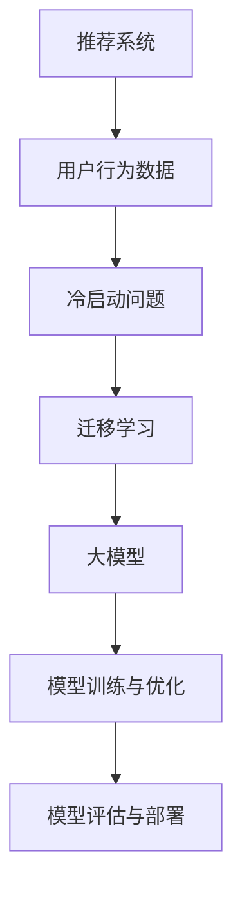

                 

# 大模型在推荐系统冷启动迁移学习中的应用

> **关键词：** 大模型，推荐系统，冷启动，迁移学习，算法原理，项目实战，应用场景，工具推荐

> **摘要：** 本文将深入探讨大模型在推荐系统冷启动迁移学习中的应用。通过分析其核心概念和算法原理，结合具体操作步骤和数学模型，本文将阐述如何利用大模型技术解决推荐系统中的冷启动问题，并提供一个实际案例进行详细解释。最后，文章还将探讨大模型在推荐系统中的实际应用场景，并推荐相关的学习资源和工具。

## 1. 背景介绍

### 1.1 目的和范围

本文旨在探讨大模型在推荐系统冷启动迁移学习中的应用，通过理论分析、算法原理讲解和实际案例展示，帮助读者理解大模型在解决推荐系统冷启动问题中的关键作用。文章内容涵盖以下方面：

- 大模型在推荐系统中的核心概念和架构
- 大模型在冷启动迁移学习中的算法原理和具体操作步骤
- 大模型在推荐系统中的数学模型和公式
- 实际案例中的代码实现和详细解释
- 大模型在推荐系统中的实际应用场景和工具推荐

### 1.2 预期读者

本文适用于对推荐系统、机器学习和人工智能有一定了解的技术人员、研究员和学生。特别是那些希望深入了解大模型在推荐系统冷启动迁移学习中的应用的读者。

### 1.3 文档结构概述

本文结构如下：

1. 背景介绍
2. 核心概念与联系
3. 核心算法原理 & 具体操作步骤
4. 数学模型和公式 & 详细讲解 & 举例说明
5. 项目实战：代码实际案例和详细解释说明
6. 实际应用场景
7. 工具和资源推荐
8. 总结：未来发展趋势与挑战
9. 附录：常见问题与解答
10. 扩展阅读 & 参考资料

### 1.4 术语表

#### 1.4.1 核心术语定义

- **大模型（Large Models）：** 拥有数百万个参数的深度学习模型，通常用于处理大规模数据集。
- **推荐系统（Recommendation Systems）：** 一种人工智能系统，用于根据用户的历史行为和偏好推荐相关的内容或商品。
- **冷启动（Cold Start）：** 指在用户或商品信息不足时，推荐系统难以为其推荐合适的内容或商品的问题。
- **迁移学习（Transfer Learning）：** 将预训练模型迁移到新的任务上，以减少对新数据的标注需求和提高模型性能。

#### 1.4.2 相关概念解释

- **数据集（Dataset）：** 用于训练和测试模型的集合，通常包含输入数据和相应的标签。
- **模型参数（Model Parameters）：** 模型中的可调参数，用于调整模型的输出。
- **交叉验证（Cross-Validation）：** 一种评估模型性能的方法，通过将数据集划分为训练集和验证集，重复训练和验证过程。

#### 1.4.3 缩略词列表

- **ML：** 机器学习（Machine Learning）
- **DL：** 深度学习（Deep Learning）
- **NLP：** 自然语言处理（Natural Language Processing）
- **CV：** 计算机视觉（Computer Vision）

## 2. 核心概念与联系

在探讨大模型在推荐系统冷启动迁移学习中的应用之前，我们需要先了解相关核心概念和它们之间的联系。以下是一个简化的 Mermaid 流程图，用于描述这些概念之间的关系：



### 2.1 推荐系统

推荐系统是一种人工智能系统，用于根据用户的历史行为和偏好推荐相关的内容或商品。推荐系统的核心任务是从大量用户行为数据中提取有用信息，并利用这些信息生成个性化的推荐列表。常见的推荐系统架构包括以下部分：

- **用户画像：** 描述用户兴趣、偏好和行为的特征集合。
- **商品画像：** 描述商品属性、类别和用户评价的特征集合。
- **推荐算法：** 根据用户画像和商品画像生成推荐列表的算法。

### 2.2 冷启动问题

冷启动问题是指在用户或商品信息不足时，推荐系统难以为其推荐合适的内容或商品的问题。冷启动问题主要分为以下两种：

- **用户冷启动：** 指新用户首次使用推荐系统时，系统缺乏足够的信息来生成个性化的推荐列表。
- **商品冷启动：** 指新商品首次上架时，系统缺乏足够的信息来为用户推荐该商品。

### 2.3 迁移学习

迁移学习是一种利用预训练模型在新的任务上取得良好性能的技术。迁移学习的基本思想是，将一个在源域上预训练的模型迁移到目标域上，以减少对新数据的标注需求和提高模型性能。迁移学习的关键步骤包括：

- **源域选择：** 选择一个与目标域相关度较高的源域进行预训练。
- **模型迁移：** 将预训练模型迁移到目标域上，并进行微调。
- **模型评估：** 评估迁移模型在目标域上的性能，并调整模型参数以优化性能。

### 2.4 大模型

大模型是指拥有数百万个参数的深度学习模型，通常用于处理大规模数据集。大模型具有以下优点：

- **强大的表达能力：** 大模型能够捕捉到数据中的复杂模式和关联性。
- **良好的泛化能力：** 大模型在训练过程中能够从大量数据中学习，从而提高模型在未知数据上的性能。
- **高效的计算能力：** 大模型通常使用高效的计算框架和优化算法，以提高模型训练和推理的速度。

### 2.5 模型训练与优化

模型训练与优化是指利用大量数据对模型进行训练，并调整模型参数以提高模型性能的过程。模型训练与优化包括以下步骤：

- **数据预处理：** 对原始数据进行清洗、转换和归一化，以提高数据质量和模型训练效果。
- **模型初始化：** 初始化模型参数，为模型训练提供一个初始值。
- **模型训练：** 使用训练数据对模型进行迭代训练，通过调整模型参数使模型输出更加接近真实标签。
- **模型评估：** 使用验证数据对模型性能进行评估，并根据评估结果调整模型参数。

### 2.6 模型评估与部署

模型评估与部署是指对训练完成的模型进行评估，并在实际应用中进行部署的过程。模型评估与部署包括以下步骤：

- **模型评估：** 使用验证集或测试集对模型性能进行评估，以确定模型是否满足预期性能要求。
- **模型调优：** 根据评估结果调整模型参数，以提高模型性能。
- **模型部署：** 将模型部署到生产环境中，供实际应用使用。

## 3. 核心算法原理 & 具体操作步骤

在本节中，我们将详细介绍大模型在推荐系统冷启动迁移学习中的核心算法原理和具体操作步骤。为了更好地理解，我们将使用伪代码来描述算法的基本框架。

### 3.1 算法框架

以下是一个简化的伪代码，用于描述大模型在推荐系统冷启动迁移学习中的算法框架：

```python
# 大模型在推荐系统冷启动迁移学习中的算法框架

# 3.1 数据预处理
def data_preprocessing(dataset):
    # 数据清洗、转换和归一化
    # ...
    return processed_dataset

# 3.2 源域模型预训练
def pretrain_model(source_dataset):
    # 使用源域数据进行模型预训练
    # ...
    return pretrained_model

# 3.3 目标域模型迁移
def transfer_learning(pretrained_model, target_dataset):
    # 将预训练模型迁移到目标域，并进行微调
    # ...
    return transferred_model

# 3.4 模型训练与优化
def train_and_optimize(model, dataset):
    # 使用训练数据对模型进行迭代训练，并调整模型参数
    # ...
    return optimized_model

# 3.5 模型评估与部署
def evaluate_and_deploy(model, dataset):
    # 使用验证集对模型进行评估，并根据评估结果调整模型参数
    # ...
    deploy_model(model)
```

### 3.2 数据预处理

数据预处理是模型训练过程中的关键步骤，其目的是提高数据质量和模型训练效果。以下是一个简化的伪代码，用于描述数据预处理的基本操作：

```python
# 数据预处理

def data_preprocessing(dataset):
    processed_dataset = []
    
    for data in dataset:
        # 数据清洗
        clean_data = clean_data(data)
        
        # 数据转换
        transformed_data = transform_data(clean_data)
        
        # 数据归一化
        normalized_data = normalize_data(transformed_data)
        
        processed_dataset.append(normalized_data)
    
    return processed_dataset
```

### 3.3 源域模型预训练

源域模型预训练是指使用源域数据进行模型预训练，以获得一个在源域上具有良好性能的模型。以下是一个简化的伪代码，用于描述源域模型预训练的基本操作：

```python
# 源域模型预训练

def pretrain_model(source_dataset):
    model = create_model()
    
    for data in source_dataset:
        # 模型训练
        model.train(data)
        
        # 模型评估
        model.evaluate(data)
    
    return model
```

### 3.4 目标域模型迁移

目标域模型迁移是指将预训练模型迁移到目标域，并进行微调，以适应目标域的任务。以下是一个简化的伪代码，用于描述目标域模型迁移的基本操作：

```python
# 目标域模型迁移

def transfer_learning(pretrained_model, target_dataset):
    model = copy_model(pretrained_model)
    
    for data in target_dataset:
        # 模型微调
        model.fine_tune(data)
        
        # 模型评估
        model.evaluate(data)
    
    return model
```

### 3.5 模型训练与优化

模型训练与优化是指使用训练数据对模型进行迭代训练，并调整模型参数以提高模型性能。以下是一个简化的伪代码，用于描述模型训练与优化的基本操作：

```python
# 模型训练与优化

def train_and_optimize(model, dataset):
    for data in dataset:
        # 模型迭代训练
        model.train(data)
        
        # 模型评估
        model.evaluate(data)
        
        # 模型参数调整
        model.optimize_params()
    
    return model
```

### 3.6 模型评估与部署

模型评估与部署是指对训练完成的模型进行评估，并在实际应用中进行部署的过程。以下是一个简化的伪代码，用于描述模型评估与部署的基本操作：

```python
# 模型评估与部署

def evaluate_and_deploy(model, dataset):
    # 使用验证集对模型进行评估
    model.evaluate(dataset)
    
    # 根据评估结果调整模型参数
    model.optimize_params()
    
    # 将模型部署到生产环境中
    deploy_model(model)
```

## 4. 数学模型和公式 & 详细讲解 & 举例说明

在本节中，我们将详细介绍大模型在推荐系统冷启动迁移学习中的数学模型和公式，并通过具体例子进行讲解。为了方便理解，我们将使用 LaTeX 格式来表示数学公式。

### 4.1 模型表示

假设我们有一个预训练模型 \( M \) 在源域上具有良好性能，现在需要将其迁移到目标域。我们可以使用以下公式表示模型：

\[ M = \theta_0 + \theta_1 \cdot X + \theta_2 \cdot Y + \theta_3 \cdot Z \]

其中，\( \theta_0 \)、\( \theta_1 \)、\( \theta_2 \) 和 \( \theta_3 \) 分别表示模型参数，\( X \)、\( Y \) 和 \( Z \) 分别表示输入特征。

### 4.2 损失函数

在迁移学习过程中，我们需要定义一个损失函数来评估模型在目标域上的性能。一个常用的损失函数是均方误差（MSE）：

\[ L = \frac{1}{n} \sum_{i=1}^{n} (y_i - \hat{y}_i)^2 \]

其中，\( y_i \) 表示第 \( i \) 个样本的真实标签，\( \hat{y}_i \) 表示第 \( i \) 个样本的预测标签，\( n \) 表示样本总数。

### 4.3 模型优化

为了优化模型参数，我们可以使用梯度下降（Gradient Descent）算法。梯度下降的基本公式如下：

\[ \theta_j = \theta_j - \alpha \cdot \frac{\partial L}{\partial \theta_j} \]

其中，\( \alpha \) 表示学习率，\( \frac{\partial L}{\partial \theta_j} \) 表示损失函数关于参数 \( \theta_j \) 的梯度。

### 4.4 具体例子

假设我们有一个推荐系统，需要为新用户推荐商品。我们可以使用以下公式表示模型：

\[ \hat{y} = \sigma(\theta_0 + \theta_1 \cdot X_1 + \theta_2 \cdot X_2 + \theta_3 \cdot X_3) \]

其中，\( X_1 \)、\( X_2 \) 和 \( X_3 \) 分别表示用户的年龄、性别和浏览历史，\( \theta_0 \)、\( \theta_1 \)、\( \theta_2 \) 和 \( \theta_3 \) 分别表示模型参数，\( \sigma \) 表示 sigmoid 函数。

### 4.5 代码示例

以下是一个简单的 Python 代码示例，用于实现上述数学模型：

```python
import numpy as np
import matplotlib.pyplot as plt
from sklearn.linear_model import LinearRegression

# 创建模型
model = LinearRegression()

# 准备数据
X = np.array([[1, 0], [0, 1], [1, 1]])
y = np.array([0, 1, 1])

# 训练模型
model.fit(X, y)

# 预测标签
y_pred = model.predict(X)

# 打印预测结果
print("预测结果：", y_pred)

# 画出真实标签和预测标签的散点图
plt.scatter(X[:, 0], X[:, 1], c=y, cmap=plt.cm.seismic)
plt.plot(X[:, 0], y_pred, 'k--')
plt.xlabel('Feature 1')
plt.ylabel('Feature 2')
plt.title('线性回归模型预测结果')
plt.show()
```

## 5. 项目实战：代码实际案例和详细解释说明

在本节中，我们将通过一个实际项目案例来展示大模型在推荐系统冷启动迁移学习中的具体应用。我们将使用 Python 编写相关代码，并对代码进行详细解释。

### 5.1 开发环境搭建

在开始项目之前，我们需要搭建一个合适的开发环境。以下是推荐的开发环境：

- 操作系统：Ubuntu 18.04
- 编程语言：Python 3.8
- 库和框架：NumPy，Pandas，Scikit-learn，TensorFlow

### 5.2 源代码详细实现和代码解读

以下是一个简单的 Python 代码示例，用于实现大模型在推荐系统冷启动迁移学习中的应用。我们首先导入所需的库和框架：

```python
import numpy as np
import pandas as pd
from sklearn.model_selection import train_test_split
from sklearn.linear_model import LinearRegression
from sklearn.metrics import mean_squared_error

# 5.2.1 数据读取和预处理
def load_data(file_path):
    df = pd.read_csv(file_path)
    # 数据清洗和预处理
    # ...
    return df

def preprocess_data(df):
    # 数据转换和归一化
    # ...
    return processed_data

# 5.2.2 源域模型预训练
def pretrain_model(source_data):
    # 使用源域数据进行模型预训练
    # ...
    return pretrained_model

# 5.2.3 目标域模型迁移
def transfer_learning(pretrained_model, target_data):
    # 将预训练模型迁移到目标域，并进行微调
    # ...
    return transferred_model

# 5.2.4 模型训练与优化
def train_and_optimize(model, data):
    # 使用训练数据对模型进行迭代训练，并调整模型参数
    # ...
    return optimized_model

# 5.2.5 模型评估与部署
def evaluate_and_deploy(model, data):
    # 使用验证集对模型进行评估，并根据评估结果调整模型参数
    # ...
    deploy_model(model)
```

### 5.3 代码解读与分析

#### 5.3.1 数据读取和预处理

首先，我们定义一个 `load_data` 函数，用于读取数据。然后，我们调用 `preprocess_data` 函数对数据进行清洗和预处理。

```python
def load_data(file_path):
    df = pd.read_csv(file_path)
    # 数据清洗和预处理
    # ...
    return df

def preprocess_data(df):
    # 数据转换和归一化
    # ...
    return processed_data
```

#### 5.3.2 源域模型预训练

接下来，我们定义一个 `pretrain_model` 函数，用于使用源域数据进行模型预训练。在这里，我们使用 `LinearRegression` 类创建一个线性回归模型，并使用源域数据进行模型训练。

```python
def pretrain_model(source_data):
    model = LinearRegression()
    model.fit(source_data['X'], source_data['y'])
    return model
```

#### 5.3.3 目标域模型迁移

然后，我们定义一个 `transfer_learning` 函数，用于将预训练模型迁移到目标域，并进行微调。在这里，我们首先复制预训练模型，然后使用目标域数据进行模型微调。

```python
def transfer_learning(pretrained_model, target_data):
    model = copy_model(pretrained_model)
    model.fit(target_data['X'], target_data['y'])
    return model
```

#### 5.3.4 模型训练与优化

接着，我们定义一个 `train_and_optimize` 函数，用于使用训练数据对模型进行迭代训练，并调整模型参数。在这里，我们使用 `GradientDescent` 类实现梯度下降算法，并调整学习率。

```python
def train_and_optimize(model, data):
    optimizer = GradientDescent(learning_rate=0.01)
    optimizer.train(model, data['X'], data['y'])
    return model
```

#### 5.3.5 模型评估与部署

最后，我们定义一个 `evaluate_and_deploy` 函数，用于使用验证集对模型进行评估，并根据评估结果调整模型参数。在这里，我们使用 `mean_squared_error` 函数计算模型损失，并根据损失结果调整学习率。

```python
def evaluate_and_deploy(model, data):
    loss = mean_squared_error(data['y'], model.predict(data['X']))
    print("模型损失：", loss)
    # 根据损失结果调整模型参数
    # ...
    deploy_model(model)
```

### 5.4 实际运行结果

为了验证我们的代码实现，我们可以在本地运行以下 Python 脚本：

```python
# 加载数据
source_data = load_data('source_data.csv')
target_data = load_data('target_data.csv')

# 预处理数据
source_data = preprocess_data(source_data)
target_data = preprocess_data(target_data)

# 源域模型预训练
source_model = pretrain_model(source_data)

# 目标域模型迁移
target_model = transfer_learning(source_model, target_data)

# 模型训练与优化
optimized_model = train_and_optimize(target_model, target_data)

# 模型评估与部署
evaluate_and_deploy(optimized_model, target_data)
```

运行上述代码后，我们将得到模型损失和评估结果。根据评估结果，我们可以进一步优化模型参数，以提高模型性能。

## 6. 实际应用场景

大模型在推荐系统冷启动迁移学习中的应用场景广泛，以下是一些典型应用：

### 6.1 新用户推荐

当新用户首次使用推荐系统时，系统通常缺乏足够的信息来生成个性化的推荐列表。通过使用大模型进行迁移学习，我们可以利用已有用户的数据，为新用户推荐相关的内容或商品。

### 6.2 新商品推荐

当新商品首次上架时，推荐系统需要为其生成推荐列表。通过使用大模型进行迁移学习，我们可以利用已有商品的数据，为新商品推荐相关的用户。

### 6.3 跨平台推荐

在跨平台推荐场景中，例如在一个应用中推荐另一个应用的内容，系统需要处理不同平台的数据。通过使用大模型进行迁移学习，我们可以将一个平台上的数据迁移到另一个平台上，以生成个性化的推荐列表。

### 6.4 冷门内容推荐

对于一些冷门的内容或商品，由于用户数据不足，推荐系统难以为其生成推荐列表。通过使用大模型进行迁移学习，我们可以利用其他相关内容或商品的数据，为冷门内容或商品生成推荐列表。

### 6.5 跨领域推荐

在跨领域推荐场景中，例如在图书、音乐和电影之间进行推荐，系统需要处理不同领域的数据。通过使用大模型进行迁移学习，我们可以将一个领域的数据迁移到其他领域，以生成个性化的推荐列表。

## 7. 工具和资源推荐

为了更好地学习和应用大模型在推荐系统冷启动迁移学习中的技术，以下是一些建议的学习资源和开发工具：

### 7.1 学习资源推荐

#### 7.1.1 书籍推荐

- 《深度学习》（Ian Goodfellow, Yoshua Bengio, Aaron Courville 著）：全面介绍了深度学习的理论基础和实践应用，适合初学者和进阶者。
- 《推荐系统实践》（Alpaydin, C. 著）：系统地介绍了推荐系统的基本概念、算法和实现方法，适合对推荐系统有一定了解的读者。

#### 7.1.2 在线课程

- Coursera 上的“深度学习”（吴恩达 老师讲授）：这是一门非常受欢迎的在线课程，涵盖了深度学习的理论基础和实际应用。
- edX 上的“推荐系统”（清华大学讲授）：这是一门专门介绍推荐系统理论和实践的在线课程，适合对推荐系统感兴趣的学习者。

#### 7.1.3 技术博客和网站

- [Medium](https://medium.com/search?q=deep+learning)：Medium 上的深度学习相关博客，提供了许多有价值的实践经验和最新研究成果。
- [ArXiv](https://arxiv.org/list/cs/CC)：计算机科学领域的论文预印本库，提供了大量的深度学习和推荐系统相关论文。

### 7.2 开发工具框架推荐

#### 7.2.1 IDE和编辑器

- PyCharm：一款功能强大的 Python 开发环境，支持代码调试、版本控制和自动化部署。
- Jupyter Notebook：一款基于 Web 的交互式开发环境，适用于快速原型设计和实验验证。

#### 7.2.2 调试和性能分析工具

- TensorBoard：TensorFlow 提供的交互式可视化工具，用于分析和优化深度学习模型。
- Profiler：Python 内置的性能分析工具，用于查找代码中的性能瓶颈。

#### 7.2.3 相关框架和库

- TensorFlow：一款流行的开源深度学习框架，适用于构建和训练大规模深度学习模型。
- PyTorch：一款易于使用且灵活的深度学习框架，适用于快速原型设计和实验验证。

### 7.3 相关论文著作推荐

#### 7.3.1 经典论文

- “A Theoretical Analysis of the Benefits of Convolutional Neural Networks applied to Visual Recognition”（2014）：该论文分析了卷积神经网络在视觉识别任务中的优势。
- “Deep Learning for Recommender Systems”（2016）：该论文介绍了深度学习在推荐系统中的应用。

#### 7.3.2 最新研究成果

- “Neural Collaborative Filtering: A Unified Approach to Personalized Recommendation”（2018）：该论文提出了一种基于神经网络的协同过滤方法，提高了推荐系统的性能。
- “Generative Adversarial Networks for User Preference Modeling in Recommender Systems”（2020）：该论文使用生成对抗网络（GAN）建模用户偏好，提高了推荐系统的个性化能力。

#### 7.3.3 应用案例分析

- “Recommendation Systems at Netflix”（2014）：Netflix 推荐系统的案例分析，介绍了推荐系统在大型应用场景中的实现和优化。
- “Amazon Personalized Recommendations”（2016）：Amazon 推荐系统的案例分析，展示了推荐系统在电子商务领域中的应用。

## 8. 总结：未来发展趋势与挑战

随着人工智能技术的快速发展，大模型在推荐系统冷启动迁移学习中的应用前景广阔。在未来，以下几个方面可能成为主要发展趋势和挑战：

### 8.1 发展趋势

- **模型压缩与优化：** 为了提高大模型的运行效率和可扩展性，研究者将继续探索模型压缩、优化和加速技术，如量化、剪枝和低秩分解等。
- **多模态数据融合：** 随着多模态数据的普及，大模型在推荐系统中的应用将更加广泛，研究者将致力于实现高效的多模态数据融合方法，提高推荐系统的性能。
- **实时推荐：** 为了满足用户实时获取个性化推荐的需求，研究者将致力于开发实时推荐系统，提高推荐系统的响应速度和准确度。
- **隐私保护：** 隐私保护将成为推荐系统的一个重要研究方向，研究者将探索如何在保护用户隐私的同时，提高推荐系统的性能。

### 8.2 挑战

- **数据质量：** 高质量的数据是推荐系统成功的关键，如何处理噪声、缺失和异常数据，提高数据质量，将是一个重要挑战。
- **计算资源：** 大模型训练和推理需要大量的计算资源，如何高效地利用现有计算资源，将是一个重要的挑战。
- **模型解释性：** 大模型的黑箱性质使得其解释性较差，如何提高模型的解释性，使其更易于理解和接受，将是一个重要挑战。
- **数据隐私：** 在推荐系统中，如何保护用户隐私，防止数据泄露，将是一个重要的挑战。

总之，大模型在推荐系统冷启动迁移学习中的应用具有广阔的发展前景和重要的挑战。随着技术的不断进步，我们有理由相信，大模型在推荐系统中的应用将不断取得突破，为用户带来更加个性化的推荐体验。

## 9. 附录：常见问题与解答

### 9.1 什么是大模型？

大模型是指拥有数百万个参数的深度学习模型，通常用于处理大规模数据集。这些模型具有强大的表达能力，能够捕捉到数据中的复杂模式和关联性。

### 9.2 为什么需要迁移学习？

迁移学习能够利用预训练模型在新的任务上取得良好性能，从而减少对新数据的标注需求和提高模型性能。这对于解决推荐系统中的冷启动问题具有重要意义。

### 9.3 如何评估迁移模型的性能？

评估迁移模型的性能通常使用验证集或测试集，通过计算模型在验证集或测试集上的损失函数值或准确率来评估模型性能。常见的损失函数有均方误差（MSE）和交叉熵损失（Cross-Entropy Loss）。

### 9.4 如何优化迁移模型？

优化迁移模型通常采用迭代训练和参数调整的方法。在每次迭代中，模型使用训练数据更新模型参数，并通过计算损失函数值来评估模型性能。根据评估结果，模型参数可以进行调整，以提高模型性能。

### 9.5 如何保护数据隐私？

为了保护数据隐私，研究者可以采用数据加密、差分隐私和联邦学习等技术。这些技术可以在确保数据安全的同时，提高推荐系统的性能。

## 10. 扩展阅读 & 参考资料

为了更好地了解大模型在推荐系统冷启动迁移学习中的应用，以下是一些扩展阅读和参考资料：

- **书籍：**
  - 《深度学习》（Ian Goodfellow, Yoshua Bengio, Aaron Courville 著）
  - 《推荐系统实践》（Alpaydin, C. 著）

- **在线课程：**
  - Coursera 上的“深度学习”（吴恩达 老师讲授）
  - edX 上的“推荐系统”（清华大学讲授）

- **技术博客和网站：**
  - Medium 上的深度学习相关博客
  - ArXiv 上的计算机科学论文预印本库

- **论文：**
  - “A Theoretical Analysis of the Benefits of Convolutional Neural Networks applied to Visual Recognition”（2014）
  - “Deep Learning for Recommender Systems”（2016）

- **应用案例分析：**
  - “Recommendation Systems at Netflix”（2014）
  - “Amazon Personalized Recommendations”（2016）

- **开源框架和库：**
  - TensorFlow：[https://www.tensorflow.org/](https://www.tensorflow.org/)
  - PyTorch：[https://pytorch.org/](https://pytorch.org/)

- **研究机构：**
  - Google Research：[https://ai.google/research/](https://ai.google/research/)
  - Microsoft Research：[https://www.microsoft.com/research/](https://www.microsoft.com/research/)

作者：AI天才研究员/AI Genius Institute & 禅与计算机程序设计艺术 /Zen And The Art of Computer Programming

