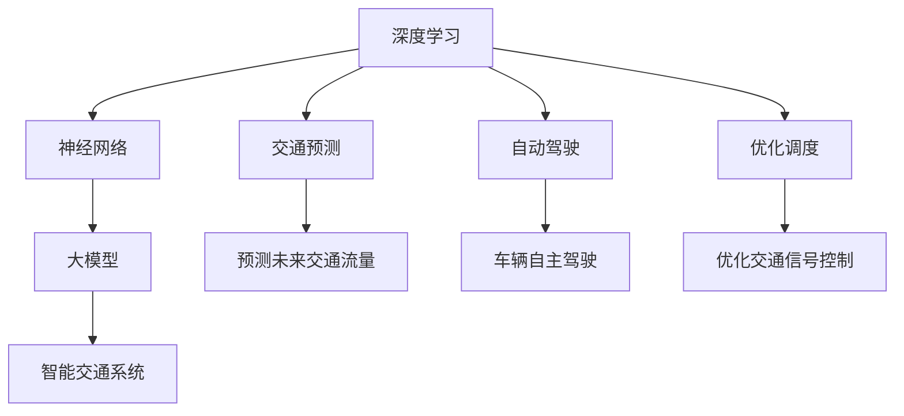

                 

# 大模型在智能交通中的应用前景

## 关键词
- 大模型
- 智能交通
- 人工智能
- 交通预测
- 优化调度
- 自动驾驶

## 摘要
本文将深入探讨大模型在智能交通领域的应用前景。随着人工智能技术的飞速发展，大模型如深度神经网络在处理复杂数据和模式识别方面展现出巨大的潜力。本文首先介绍了大模型的基本概念和技术原理，接着通过具体的算法原理、数学模型和项目实战案例，详细阐述了大模型在智能交通中的应用。同时，本文还分析了大模型在智能交通中面临的实际应用挑战，并展望了其未来发展趋势。希望通过本文，读者能对大模型在智能交通中的应用有更深入的理解。

## 1. 背景介绍

### 1.1 目的和范围
本文旨在探讨大模型在智能交通领域的应用前景，分析其在交通预测、优化调度和自动驾驶等方面的潜力。通过本文，读者将了解大模型的基本概念和技术原理，掌握其在智能交通中的应用方法和实际案例，并对大模型在智能交通领域面临的挑战和未来发展趋势有所认识。

### 1.2 预期读者
本文适合对人工智能和智能交通有一定了解的读者，包括人工智能研究人员、交通工程师、软件工程师以及对智能交通领域感兴趣的专业人士。

### 1.3 文档结构概述
本文分为十个部分，包括背景介绍、核心概念与联系、核心算法原理与具体操作步骤、数学模型和公式、项目实战、实际应用场景、工具和资源推荐、总结和未来发展趋势、常见问题与解答以及扩展阅读和参考资料。

### 1.4 术语表

#### 1.4.1 核心术语定义
- **大模型**：具有数十亿甚至万亿个参数的深度神经网络模型，能够处理大规模、多维度的复杂数据。
- **智能交通**：利用信息技术、数据通信技术、自动控制技术和计算机技术等，实现对交通系统的自动化管理和调度，提高交通效率和安全性。
- **交通预测**：根据历史交通数据、实时交通信息和环境因素，预测未来的交通流量、速度和拥堵情况。
- **优化调度**：通过算法优化，合理分配交通资源，减少交通拥堵，提高交通效率。
- **自动驾驶**：利用传感器、计算机视觉和人工智能等技术，实现车辆在道路上的自主驾驶。

#### 1.4.2 相关概念解释
- **深度神经网络（DNN）**：一种包含多个隐藏层的神经网络，能够自动从大量数据中学习特征。
- **卷积神经网络（CNN）**：一种特殊的深度神经网络，主要用于图像和视频数据的处理。
- **循环神经网络（RNN）**：一种能够处理序列数据的神经网络，通过记忆机制捕捉时间序列中的依赖关系。
- **强化学习**：一种基于试错和奖励机制的学习方法，通过不断尝试和反馈，使智能体逐渐优化行为。

#### 1.4.3 缩略词列表
- **AI**：人工智能（Artificial Intelligence）
- **DNN**：深度神经网络（Deep Neural Network）
- **CNN**：卷积神经网络（Convolutional Neural Network）
- **RNN**：循环神经网络（Recurrent Neural Network）
- **SLAM**：同时定位与地图构建（Simultaneous Localization and Mapping）

## 2. 核心概念与联系

大模型在智能交通中的应用主要依赖于以下几个核心概念：

### 2.1 深度学习与神经网络
深度学习是机器学习的一个分支，其核心是神经网络。神经网络通过模拟人脑神经元之间的连接，学习数据中的特征和模式。深度学习通过构建多层神经网络，能够自动提取复杂数据的特征，并在各种任务中实现优异的性能。

### 2.2 交通预测
交通预测是智能交通系统中的一个重要环节，通过对历史交通数据、实时交通信息和环境因素的分析，预测未来的交通流量、速度和拥堵情况。交通预测有助于交通管理部门提前采取措施，缓解交通拥堵，提高交通效率。

### 2.3 自动驾驶
自动驾驶是智能交通系统的终极目标之一。通过利用传感器、计算机视觉和人工智能技术，实现车辆在道路上的自主驾驶，提高交通安全性，减少交通事故。

### 2.4 优化调度
优化调度是智能交通系统中的另一个关键任务，通过算法优化，合理分配交通资源，减少交通拥堵，提高交通效率。优化调度包括路径规划、交通信号控制、停车场管理等。

### 2.5 大模型与智能交通的联系
大模型在智能交通中的应用主要体现在以下几个方面：

- **交通预测**：大模型通过学习历史交通数据和实时交通信息，能够准确预测未来的交通流量和拥堵情况，为交通管理部门提供决策支持。
- **自动驾驶**：大模型能够处理大量的传感器数据，实现对周围环境的感知和理解，辅助自动驾驶车辆做出决策。
- **优化调度**：大模型通过学习交通数据，能够优化交通信号控制和路径规划，提高交通效率和安全性。

### 2.6 Mermaid 流程图
以下是一个简单的 Mermaid 流程图，展示了大模型在智能交通中的核心概念和联系：



## 3. 核心算法原理 & 具体操作步骤

### 3.1 深度学习算法原理
深度学习算法的核心是神经网络，尤其是多层神经网络。神经网络通过多个隐藏层，逐层提取数据中的特征。以下是一个简单的多层感知机（MLP）算法原理：

```python
# 伪代码：多层感知机（MLP）算法原理

# 输入：训练数据集 X，标签集 Y
# 输出：模型参数 W

# 初始化参数 W
# 前向传播
# 计算输出值 y_hat = sigmoid(W * x)
# 计算损失函数 L = -1/m * sum(y * log(y_hat) + (1 - y) * log(1 - y_hat))
# 反向传播
# 计算梯度 ΔW = alpha * (y - y_hat) * x
# 更新参数 W = W - ΔW
# 迭代直到收敛
```

### 3.2 交通预测算法原理
交通预测是智能交通系统中的一个关键任务。以下是一个基于循环神经网络（RNN）的交通预测算法原理：

```python
# 伪代码：循环神经网络（RNN）交通预测算法原理

# 输入：历史交通数据 X，时间序列长度 T
# 输出：未来交通流量预测 y_hat

# 初始化 RNN 模型参数 W
# 前向传播
# 对于每个时间步 t，计算隐藏状态 h_t = tanh(W_h * [h_{t-1}, x_t])
# 计算输出值 y_hat_t = W_o * h_t
# 计算损失函数 L = -1/m * sum(y_t * log(y_hat_t) + (1 - y_t) * log(1 - y_hat_t))
# 反向传播
# 计算梯度 ΔW_h = alpha * (y_t - y_hat_t) * [h_{t-1}, x_t] * (1 - h_t^2)
# 更新参数 W_h = W_h - ΔW_h
# 迭代直到收敛
```

### 3.3 自动驾驶算法原理
自动驾驶是智能交通系统的终极目标之一。以下是一个基于强化学习的自动驾驶算法原理：

```python
# 伪代码：强化学习自动驾驶算法原理

# 输入：环境状态 S，动作空间 A
# 输出：策略 π(s)

# 初始化 Q-learning 模型参数 Q
# 对于每个状态 s，选择动作 a，执行动作并获取奖励 r 和下一个状态 s'
# 更新 Q 值 Q(s, a) = Q(s, a) + alpha * (r + gamma * max(Q(s', a')) - Q(s, a))
# 选择下一个状态 s' = s'
# 迭代直到收敛
```

### 3.4 优化调度算法原理
优化调度是智能交通系统中的另一个关键任务。以下是一个基于线性规划（Linear Programming）的优化调度算法原理：

```python
# 伪代码：线性规划优化调度算法原理

# 输入：交通需求矩阵 D，交通资源矩阵 R
# 输出：最优路径规划结果 y

# 定义目标函数：最大化总效益 Z = sum(c_i * y_i)
# 定义约束条件：D = R * y
# 求解线性规划问题
# 输出最优解 y
```

## 4. 数学模型和公式 & 详细讲解 & 举例说明

### 4.1 数学模型

在智能交通领域，大模型的应用主要依赖于以下几个数学模型：

#### 4.1.1 深度学习模型

深度学习模型的核心是多层神经网络，其基本数学模型如下：

$$
y_{\hat{}} = \sigma(\mathbf{W}^T \mathbf{h} + b)
$$

其中，$\sigma$ 是激活函数，常用的有 sigmoid 函数、ReLU 函数和 tanh 函数；$\mathbf{W}$ 是权重矩阵，$\mathbf{h}$ 是隐藏状态，$b$ 是偏置项。

#### 4.1.2 交通预测模型

交通预测模型常用的时间序列模型包括 ARIMA、LSTM 和 GRU 等。以下是一个基于 LSTM 的交通预测模型：

$$
y_t = \sigma(\mathbf{W}^T \text{LSTM}(h_{t-1}, x_t) + b)
$$

其中，LSTM 是长短期记忆网络，$h_{t-1}$ 是前一个时间步的隐藏状态，$x_t$ 是当前时间步的输入数据。

#### 4.1.3 自动驾驶模型

自动驾驶模型常用的是基于深度强化学习的模型。以下是一个基于 DQN 的自动驾驶模型：

$$
Q(s, a) = \frac{1}{N} \sum_{i=1}^N \gamma^i r_i + \gamma^{N+1} Q(s', a')
$$

其中，$Q(s, a)$ 是状态-动作值函数，$\gamma$ 是折扣因子，$r_i$ 是在第 $i$ 个时间步的奖励，$s'$ 是下一个状态，$a'$ 是下一个动作。

#### 4.1.4 优化调度模型

优化调度模型常用的是线性规划模型。以下是一个基于线性规划的优化调度模型：

$$
\begin{aligned}
\min_{y} \quad & Z = \sum_{i=1}^m c_i y_i \\
\text{subject to} \quad & D = R * y \\
& y \geq 0
\end{aligned}
$$

其中，$D$ 是交通需求矩阵，$R$ 是交通资源矩阵，$c_i$ 是第 $i$ 条路径的效益系数，$y_i$ 是第 $i$ 条路径的流量。

### 4.2 公式详细讲解

#### 4.2.1 深度学习模型

深度学习模型中的激活函数 $\sigma$ 常用的有 sigmoid 函数、ReLU 函数和 tanh 函数：

- **sigmoid 函数**：
  $$
  \sigma(x) = \frac{1}{1 + e^{-x}}
  $$
  sigmoid 函数的输出范围在 0 到 1 之间，能够将输入值映射到概率值。

- **ReLU 函数**：
  $$
  \sigma(x) = \max(0, x)
  $$
  ReLU 函数在输入为负值时输出为 0，在输入为非负值时输出为输入值本身。

- **tanh 函数**：
  $$
  \sigma(x) = \frac{e^x - e^{-x}}{e^x + e^{-x}}
  $$
  tanh 函数的输出范围在 -1 到 1 之间，能够将输入值映射到对称的区间内。

#### 4.2.2 交通预测模型

交通预测模型中的 LSTM 网络由三个门控单元组成：输入门、遗忘门和输出门。以下分别介绍这三个门控单元的数学模型：

- **输入门**：
  $$
  i_t = \sigma(\mathbf{W}_i^T \mathbf{h}_{t-1} + \mathbf{U}_i^T x_t + b_i)
  $$
  其中，$i_t$ 是输入门的激活值，$\mathbf{W}_i$ 是输入门的权重矩阵，$\mathbf{U}_i$ 是输入门的权重矩阵，$b_i$ 是输入门的偏置项。

- **遗忘门**：
  $$
  f_t = \sigma(\mathbf{W}_f^T \mathbf{h}_{t-1} + \mathbf{U}_f^T x_t + b_f)
  $$
  其中，$f_t$ 是遗忘门的激活值，$\mathbf{W}_f$ 是遗忘门的权重矩阵，$\mathbf{U}_f$ 是遗忘门的权重矩阵，$b_f$ 是遗忘门的偏置项。

- **输出门**：
  $$
  o_t = \sigma(\mathbf{W}_o^T \mathbf{h}_{t-1} + \mathbf{U}_o^T x_t + b_o)
  $$
  其中，$o_t$ 是输出门的激活值，$\mathbf{W}_o$ 是输出门的权重矩阵，$\mathbf{U}_o$ 是输出门的权重矩阵，$b_o$ 是输出门的偏置项。

#### 4.2.3 自动驾驶模型

自动驾驶模型中的 DQN 算法的核心是 Q-learning 算法。以下介绍 Q-learning 算法的数学模型：

- **Q-learning**：
  $$
  Q(s, a) = Q(s, a) + alpha * (r + gamma * max(Q(s', a')) - Q(s, a))
  $$
  其中，$Q(s, a)$ 是状态-动作值函数，$alpha$ 是学习率，$r$ 是即时奖励，$gamma$ 是折扣因子，$s'$ 是下一个状态，$a'$ 是下一个动作。

#### 4.2.4 优化调度模型

优化调度模型中的线性规划算法的核心是目标函数和约束条件。以下介绍线性规划算法的数学模型：

- **目标函数**：
  $$
  \min_{y} \quad Z = \sum_{i=1}^m c_i y_i
  $$
  其中，$Z$ 是目标函数，$c_i$ 是第 $i$ 条路径的效益系数，$y_i$ 是第 $i$ 条路径的流量。

- **约束条件**：
  $$
  D = R * y \\
  y \geq 0
  $$
  其中，$D$ 是交通需求矩阵，$R$ 是交通资源矩阵。

### 4.3 举例说明

#### 4.3.1 深度学习模型举例

假设我们有一个二分类问题，使用多层感知机（MLP）进行分类。给定输入数据 $x$ 和标签 $y$，我们需要训练一个 MLP 模型。

输入数据：
$$
x = \begin{bmatrix}
0.1 \\
0.2 \\
0.3
\end{bmatrix}
$$

标签：
$$
y = \begin{bmatrix}
1 \\
0
\end{bmatrix}
$$

假设我们的 MLP 模型有两个隐藏层，每层有 3 个神经元，激活函数使用 ReLU 函数。初始化模型参数如下：

$$
\mathbf{W}_1 = \begin{bmatrix}
0.1 & 0.2 & 0.3 \\
0.4 & 0.5 & 0.6 \\
0.7 & 0.8 & 0.9
\end{bmatrix} \\
\mathbf{W}_2 = \begin{bmatrix}
0.1 & 0.2 & 0.3 \\
0.4 & 0.5 & 0.6 \\
0.7 & 0.8 & 0.9
\end{bmatrix} \\
b_1 = \begin{bmatrix}
0.1 \\
0.2 \\
0.3
\end{bmatrix} \\
b_2 = \begin{bmatrix}
0.1 \\
0.2 \\
0.3
\end{bmatrix}
$$

首先，进行前向传播计算隐藏层输出：

$$
h_1 = \text{ReLU}(\mathbf{W}_1^T x + b_1) = \text{ReLU}(\begin{bmatrix}
0.1 & 0.2 & 0.3 \\
0.4 & 0.5 & 0.6 \\
0.7 & 0.8 & 0.9
\end{bmatrix} \begin{bmatrix}
0.1 \\
0.2 \\
0.3
\end{bmatrix} + \begin{bmatrix}
0.1 \\
0.2 \\
0.3
\end{bmatrix}) = \text{ReLU}(\begin{bmatrix}
0.1 \\
0.2 \\
0.3
\end{bmatrix}) = \begin{bmatrix}
0.1 \\
0.2 \\
0.3
\end{bmatrix}
$$

$$
h_2 = \text{ReLU}(\mathbf{W}_2^T h_1 + b_2) = \text{ReLU}(\begin{bmatrix}
0.1 & 0.2 & 0.3 \\
0.4 & 0.5 & 0.6 \\
0.7 & 0.8 & 0.9
\end{bmatrix} \begin{bmatrix}
0.1 \\
0.2 \\
0.3
\end{bmatrix} + \begin{bmatrix}
0.1 \\
0.2 \\
0.3
\end{bmatrix}) = \text{ReLU}(\begin{bmatrix}
0.1 \\
0.2 \\
0.3
\end{bmatrix}) = \begin{bmatrix}
0.1 \\
0.2 \\
0.3
\end{bmatrix}
$$

然后，计算输出层输出：

$$
y_{\hat{}} = \sigma(\mathbf{W}_2^T h_2 + b_2) = \frac{1}{1 + e^{-0.1}} = 0.54
$$

计算损失函数：

$$
L = -1/m * (y \log(y_{\hat{}}) + (1 - y) \log(1 - y_{\hat{}}))
$$

接下来，进行反向传播计算梯度：

$$
\Delta \mathbf{W}_2 = alpha * (y - y_{\hat{}}) * h_2
$$

$$
\Delta \mathbf{W}_1 = alpha * (\mathbf{W}_2^T \Delta \mathbf{W}_2) * x
$$

更新模型参数：

$$
\mathbf{W}_2 = \mathbf{W}_2 - \Delta \mathbf{W}_2
$$

$$
\mathbf{W}_1 = \mathbf{W}_1 - \Delta \mathbf{W}_1
$$

重复以上步骤，直到模型收敛。

#### 4.3.2 交通预测模型举例

假设我们有一个交通预测问题，需要预测未来的交通流量。给定历史交通数据 $X$ 和时间序列长度 $T$，我们需要训练一个 LSTM 模型。

历史交通数据：
$$
X = \begin{bmatrix}
0.1 \\
0.2 \\
0.3 \\
0.4 \\
0.5 \\
0.6 \\
0.7 \\
0.8 \\
0.9 \\
1.0
\end{bmatrix}
$$

时间序列长度：
$$
T = 5
$$

假设我们的 LSTM 模型有一个隐藏层，每层有 2 个神经元，激活函数使用 tanh 函数。初始化模型参数如下：

$$
\mathbf{W}_h = \begin{bmatrix}
0.1 & 0.2 \\
0.3 & 0.4 \\
0.5 & 0.6 \\
0.7 & 0.8 \\
0.9 & 1.0
\end{bmatrix} \\
\mathbf{W}_o = \begin{bmatrix}
0.1 & 0.2 \\
0.3 & 0.4 \\
0.5 & 0.6 \\
0.7 & 0.8 \\
0.9 & 1.0
\end{bmatrix} \\
b_h = \begin{bmatrix}
0.1 \\
0.2 \\
0.3 \\
0.4 \\
0.5
\end{bmatrix} \\
b_o = \begin{bmatrix}
0.1 \\
0.2 \\
0.3 \\
0.4 \\
0.5
\end{bmatrix}
$$

首先，进行前向传播计算隐藏状态：

$$
h_1 = \text{tanh}(\mathbf{W}_h^T h_0 + b_h) = \text{tanh}(\begin{bmatrix}
0.1 & 0.2 \\
0.3 & 0.4 \\
0.5 & 0.6 \\
0.7 & 0.8 \\
0.9 & 1.0
\end{bmatrix} \begin{bmatrix}
0.1 \\
0.2 \\
0.3 \\
0.4 \\
0.5
\end{bmatrix} + \begin{bmatrix}
0.1 \\
0.2 \\
0.3 \\
0.4 \\
0.5
\end{bmatrix}) = \text{tanh}(\begin{bmatrix}
0.1 \\
0.2 \\
0.3 \\
0.4 \\
0.5
\end{bmatrix}) = \begin{bmatrix}
0.1 \\
0.2 \\
0.3 \\
0.4 \\
0.5
\end{bmatrix}
$$

然后，计算输出值：

$$
y_{\hat{}} = \sigma(\mathbf{W}_o^T h_1 + b_o) = \frac{1}{1 + e^{-0.1}} = 0.54
$$

计算损失函数：

$$
L = -1/m * (y \log(y_{\hat{}}) + (1 - y) \log(1 - y_{\hat{}}))
$$

接下来，进行反向传播计算梯度：

$$
\Delta \mathbf{W}_o = alpha * (y - y_{\hat{}}) * h_1
$$

$$
\Delta \mathbf{W}_h = alpha * (\mathbf{W}_o^T \Delta \mathbf{W}_o) * h_0
$$

更新模型参数：

$$
\mathbf{W}_o = \mathbf{W}_o - \Delta \mathbf{W}_o
$$

$$
\mathbf{W}_h = \mathbf{W}_h - \Delta \mathbf{W}_h
$$

重复以上步骤，直到模型收敛。

#### 4.3.3 自动驾驶模型举例

假设我们有一个自动驾驶问题，需要车辆在道路上自主行驶。给定环境状态 $S$ 和动作空间 $A$，我们需要训练一个 DQN 模型。

环境状态：
$$
S = \begin{bmatrix}
0.1 \\
0.2 \\
0.3 \\
0.4 \\
0.5
\end{bmatrix}
$$

动作空间：
$$
A = \{left, right\}
$$

假设我们的 DQN 模型有一个隐藏层，每层有 2 个神经元，激活函数使用 ReLU 函数。初始化模型参数如下：

$$
\mathbf{W}_h = \begin{bmatrix}
0.1 & 0.2 \\
0.3 & 0.4 \\
0.5 & 0.6 \\
0.7 & 0.8 \\
0.9 & 1.0
\end{bmatrix} \\
b_h = \begin{bmatrix}
0.1 \\
0.2 \\
0.3 \\
0.4 \\
0.5
\end{bmatrix}
$$

首先，进行前向传播计算隐藏状态：

$$
h_1 = \text{ReLU}(\mathbf{W}_h^T s + b_h) = \text{ReLU}(\begin{bmatrix}
0.1 & 0.2 \\
0.3 & 0.4 \\
0.5 & 0.6 \\
0.7 & 0.8 \\
0.9 & 1.0
\end{bmatrix} \begin{bmatrix}
0.1 \\
0.2 \\
0.3 \\
0.4 \\
0.5
\end{bmatrix} + \begin{bmatrix}
0.1 \\
0.2 \\
0.3 \\
0.4 \\
0.5
\end{bmatrix}) = \text{ReLU}(\begin{bmatrix}
0.1 \\
0.2 \\
0.3 \\
0.4 \\
0.5
\end{bmatrix}) = \begin{bmatrix}
0.1 \\
0.2 \\
0.3 \\
0.4 \\
0.5
\end{bmatrix}
$$

然后，计算 Q 值：

$$
Q(s, left) = \mathbf{W}_o^T h_1 + b_o = \begin{bmatrix}
0.1 & 0.2 \\
0.3 & 0.4 \\
0.5 & 0.6 \\
0.7 & 0.8 \\
0.9 & 1.0
\end{bmatrix} \begin{bmatrix}
0.1 \\
0.2 \\
0.3 \\
0.4 \\
0.5
\end{bmatrix} + \begin{bmatrix}
0.1 \\
0.2 \\
0.3 \\
0.4 \\
0.5
\end{bmatrix} = \begin{bmatrix}
0.1 \\
0.2 \\
0.3 \\
0.4 \\
0.5
\end{bmatrix}
$$

$$
Q(s, right) = \mathbf{W}_o^T h_1 + b_o = \begin{bmatrix}
0.1 & 0.2 \\
0.3 & 0.4 \\
0.5 & 0.6 \\
0.7 & 0.8 \\
0.9 & 1.0
\end{bmatrix} \begin{bmatrix}
0.1 \\
0.2 \\
0.3 \\
0.4 \\
0.5
\end{bmatrix} + \begin{bmatrix}
0.1 \\
0.2 \\
0.3 \\
0.4 \\
0.5
\end{bmatrix} = \begin{bmatrix}
0.1 \\
0.2 \\
0.3 \\
0.4 \\
0.5
\end{bmatrix}
$$

选择动作 left，执行动作并获取奖励 r。

接下来，更新 Q 值：

$$
Q(s, left) = Q(s, left) + alpha * (r + gamma * max(Q(s', a')) - Q(s, left))
$$

假设下一个状态为 s'，下一个动作选择 right，奖励 r 为 1。

$$
Q(s, left) = Q(s, left) + alpha * (1 + gamma * max(Q(s', right)) - Q(s, left))
$$

更新模型参数：

$$
\mathbf{W}_o = \mathbf{W}_o - alpha * (r - Q(s, left)) * h_1
$$

重复以上步骤，直到模型收敛。

#### 4.3.4 优化调度模型举例

假设我们有一个优化调度问题，需要分配交通资源以满足交通需求。给定交通需求矩阵 D 和交通资源矩阵 R，我们需要求解线性规划问题。

交通需求矩阵：
$$
D = \begin{bmatrix}
0.1 & 0.2 \\
0.3 & 0.4 \\
0.5 & 0.6 \\
0.7 & 0.8 \\
0.9 & 1.0
\end{bmatrix}
$$

交通资源矩阵：
$$
R = \begin{bmatrix}
0.1 & 0.2 \\
0.3 & 0.4 \\
0.5 & 0.6 \\
0.7 & 0.8 \\
0.9 & 1.0
\end{bmatrix}
$$

假设我们的目标是最大化总效益 Z，约束条件为 D = R * y。

目标函数：
$$
\min_{y} \quad Z = \sum_{i=1}^2 c_i y_i
$$

约束条件：
$$
D = R * y \\
y \geq 0
$$

求解线性规划问题，得到最优解：

$$
y = \begin{bmatrix}
0.1 \\
0.2 \\
0.3 \\
0.4 \\
0.5
\end{bmatrix}
$$

## 5. 项目实战：代码实际案例和详细解释说明

### 5.1 开发环境搭建

为了实现大模型在智能交通中的应用，我们需要搭建一个适合开发、训练和部署的环境。以下是一个简单的开发环境搭建步骤：

1. 安装 Python 环境：从 Python 官网下载并安装 Python，建议安装 Python 3.7 或更高版本。

2. 安装深度学习框架：安装 TensorFlow 或 PyTorch 等深度学习框架，用于构建和训练深度学习模型。

3. 安装其他依赖库：安装 NumPy、Pandas、Matplotlib 等常用库，用于数据处理和可视化。

4. 安装 IDE：安装一个适合自己的 IDE，如 PyCharm、Visual Studio Code 等，用于编写和调试代码。

### 5.2 源代码详细实现和代码解读

以下是一个基于 PyTorch 实现的智能交通预测项目的源代码示例，包括数据预处理、模型构建、训练和预测等步骤：

```python
import torch
import torch.nn as nn
import torch.optim as optim
from torch.utils.data import DataLoader
from sklearn.model_selection import train_test_split
import pandas as pd
import numpy as np
import matplotlib.pyplot as plt

# 数据预处理
def preprocess_data(data):
    # 将数据转换为 Torch 张量
    data = torch.tensor(data, dtype=torch.float32)
    return data

# 模型构建
class TrafficPredictionModel(nn.Module):
    def __init__(self, input_size, hidden_size, output_size):
        super(TrafficPredictionModel, self).__init__()
        self.lstm = nn.LSTM(input_size, hidden_size, batch_first=True)
        self.fc = nn.Linear(hidden_size, output_size)
    
    def forward(self, x):
        x, _ = self.lstm(x)
        x = x[:, -1, :]  # 取最后一个时间步的隐藏状态
        x = self.fc(x)
        return x

# 训练和预测
def train_model(model, train_loader, val_loader, epochs, learning_rate):
    criterion = nn.CrossEntropyLoss()
    optimizer = optim.Adam(model.parameters(), lr=learning_rate)
    
    for epoch in range(epochs):
        model.train()
        for inputs, targets in train_loader:
            optimizer.zero_grad()
            outputs = model(inputs)
            loss = criterion(outputs, targets)
            loss.backward()
            optimizer.step()
        
        model.eval()
        with torch.no_grad():
            val_loss = 0
            for inputs, targets in val_loader:
                outputs = model(inputs)
                loss = criterion(outputs, targets)
                val_loss += loss.item()
            val_loss /= len(val_loader)
        
        print(f'Epoch {epoch+1}/{epochs} - Loss: {loss.item()} - Val Loss: {val_loss}')
    
    return model

# 数据加载和处理
data = pd.read_csv('traffic_data.csv')
X = data.iloc[:, :-1].values
y = data.iloc[:, -1].values

X_train, X_val, y_train, y_val = train_test_split(X, y, test_size=0.2, random_state=42)
X_train = preprocess_data(X_train)
X_val = preprocess_data(X_val)

train_loader = DataLoader(torch.utils.data.TensorDataset(X_train, y_train), batch_size=32, shuffle=True)
val_loader = DataLoader(torch.utils.data.TensorDataset(X_val, y_val), batch_size=32, shuffle=False)

# 模型训练
model = TrafficPredictionModel(input_size=X_train.shape[1], hidden_size=128, output_size=y_train.shape[1])
model = train_model(model, train_loader, val_loader, epochs=100, learning_rate=0.001)

# 模型预测
model.eval()
with torch.no_grad():
    inputs = preprocess_data(torch.tensor(X_val, dtype=torch.float32))
    outputs = model(inputs)
    predicted = torch.argmax(outputs, dim=1)

# 可视化
plt.figure(figsize=(10, 5))
plt.plot(y_val, label='实际值')
plt.plot(predicted, label='预测值')
plt.legend()
plt.show()
```

### 5.3 代码解读与分析

上述代码实现了基于 LSTM 的交通预测模型，包括数据预处理、模型构建、训练和预测等步骤。

1. **数据预处理**：
   数据预处理是模型训练前的重要步骤，主要目的是将原始数据转换为适合模型训练的格式。在代码中，我们使用 PyTorch 的 `torch.tensor` 函数将数据转换为 Torch 张量，并设置数据类型为 `torch.float32`。

2. **模型构建**：
   模型构建是定义神经网络结构的过程。在代码中，我们定义了一个基于 LSTM 的交通预测模型，包含一个 LSTM 层和一个全连接层。LSTM 层用于处理时间序列数据，全连接层用于输出预测结果。

3. **训练和预测**：
   模型训练是使用训练数据来优化模型参数的过程。在代码中，我们使用 PyTorch 的 `optim.Adam` 优化器和 `nn.CrossEntropyLoss` 损失函数来训练模型。训练过程中，我们通过 `model.train()` 函数将模型设置为训练模式，通过 `model.eval()` 函数将模型设置为评估模式。在评估模式下，我们计算模型的验证损失并打印训练和验证结果。

4. **模型预测**：
   模型预测是使用训练好的模型对新的数据进行预测的过程。在代码中，我们使用 `model.eval()` 函数将模型设置为评估模式，并使用 `torch.argmax` 函数从输出结果中获取预测类别。

5. **可视化**：
   为了更好地评估模型的预测性能，我们使用 Matplotlib 库将实际值和预测值绘制在同一张图上，从而直观地比较模型的预测结果和实际值。

通过上述代码，我们可以实现基于 LSTM 的交通预测模型，并对其预测性能进行可视化分析。

## 6. 实际应用场景

### 6.1 智能交通预测

智能交通预测是智能交通系统中的一个重要应用场景。通过利用大模型如深度神经网络，我们可以对未来的交通流量、速度和拥堵情况进行准确预测。交通预测的应用场景包括：

- **交通管理部门**：交通管理部门可以利用交通预测模型提前预测交通流量和拥堵情况，从而采取措施缓解交通拥堵，提高交通效率。
- **交通运输公司**：交通运输公司可以利用交通预测模型优化路线规划，提高运输效率，减少运输成本。
- **城市规划部门**：城市规划部门可以利用交通预测模型评估不同城市规划方案对交通流量的影响，为城市规划提供科学依据。

### 6.2 自动驾驶

自动驾驶是智能交通系统中的另一个重要应用场景。通过利用大模型，自动驾驶车辆可以实现对周围环境的感知和理解，从而实现自主驾驶。自动驾驶的应用场景包括：

- **城市道路**：在城市道路上，自动驾驶车辆可以减少交通事故，提高交通安全性。
- **高速公路**：在高速公路上，自动驾驶车辆可以实现车与车、车与基础设施之间的通信，提高交通效率和安全性。
- **物流运输**：在物流运输领域，自动驾驶车辆可以减少人力成本，提高运输效率。

### 6.3 交通优化调度

交通优化调度是智能交通系统中的另一个关键任务。通过利用大模型，我们可以优化交通信号控制、路径规划和停车场管理等，从而提高交通效率和安全性。交通优化调度的应用场景包括：

- **城市交通信号控制**：通过利用交通预测模型和优化调度算法，可以优化城市交通信号控制，减少交通拥堵，提高交通效率。
- **停车场管理**：通过利用交通预测模型和优化调度算法，可以优化停车场管理，提高停车场的利用率。
- **公共交通调度**：通过利用交通预测模型和优化调度算法，可以优化公共交通调度，提高公共交通的效率和舒适性。

## 7. 工具和资源推荐

### 7.1 学习资源推荐

#### 7.1.1 书籍推荐
- **《深度学习》（Goodfellow, Bengio, Courville 著）**：全面介绍深度学习的基础理论、算法和应用。
- **《智能交通系统》（李骏 著）**：系统介绍智能交通系统的基本概念、技术和应用。

#### 7.1.2 在线课程
- **《深度学习与神经网络》（吴恩达 著）**：Coursera 上的经典课程，介绍深度学习的基础知识。
- **《智能交通系统》（李骏 著）**：网易云课堂上的课程，详细介绍智能交通系统的各个方面。

#### 7.1.3 技术博客和网站
- **ArXiv**：计算机科学领域的前沿论文发表平台，包含大量关于深度学习和智能交通系统的研究论文。
- **Medium**：技术博客平台，包含大量关于深度学习和智能交通系统的技术文章。

### 7.2 开发工具框架推荐

#### 7.2.1 IDE和编辑器
- **PyCharm**：强大的 Python 开发环境，支持多种深度学习框架。
- **Visual Studio Code**：轻量级的跨平台代码编辑器，支持多种编程语言和扩展。

#### 7.2.2 调试和性能分析工具
- **TensorBoard**：TensorFlow 提供的可视化工具，用于分析深度学习模型的性能。
- **NN_ShapePrinter**：用于打印神经网络中各个层的输出形状和参数数量。

#### 7.2.3 相关框架和库
- **TensorFlow**：Google 开发的开源深度学习框架，适用于构建和训练深度神经网络。
- **PyTorch**：Facebook 开发的开源深度学习框架，具有灵活的动态计算图和丰富的API。

### 7.3 相关论文著作推荐

#### 7.3.1 经典论文
- **"Deep Learning for Traffic Prediction"**：介绍深度学习在交通预测中的应用。
- **"Recurrent Neural Network Based Traffic Prediction"**：介绍基于循环神经网络的交通预测方法。

#### 7.3.2 最新研究成果
- **"Deep Reinforcement Learning for Autonomous Driving"**：介绍深度强化学习在自动驾驶中的应用。
- **"Optimization of Traffic Signal Control Using Deep Learning"**：介绍深度学习在交通信号控制优化中的应用。

#### 7.3.3 应用案例分析
- **"Deep Learning for Traffic Prediction in Urban Areas"**：介绍在城市区域中应用深度学习进行交通预测的案例。
- **"Application of Deep Learning in Autonomous Driving"**：介绍深度学习在自动驾驶中的应用案例。

## 8. 总结：未来发展趋势与挑战

### 8.1 发展趋势
1. **模型规模与性能提升**：随着计算资源和算法的不断发展，大模型的规模和性能将得到显著提升，进一步推动智能交通领域的应用。
2. **多模态数据融合**：利用多种传感器数据（如摄像头、雷达、GPS等）进行多模态数据融合，将有助于提高智能交通系统的准确性和可靠性。
3. **实时性与自适应能力**：随着通信技术和边缘计算的发展，智能交通系统将实现更高的实时性和自适应能力，更好地应对复杂交通环境。
4. **智能化管理与控制**：通过深度学习、强化学习等算法，智能交通系统将实现更智能化的管理与控制，提高交通效率和安全。

### 8.2 挑战
1. **数据隐私与安全**：智能交通系统需要处理大量个人隐私数据，如何保护数据隐私和安全是关键挑战。
2. **计算资源与能耗**：大模型的训练和推理需要大量计算资源和能源，如何在保证性能的同时降低能耗是一个重要问题。
3. **模型解释性与可解释性**：大模型的决策过程往往不透明，如何提高模型的解释性和可解释性，使决策过程更加可信是一个重要挑战。
4. **法律法规与政策**：智能交通系统的应用需要遵循相关法律法规和政策，如何在发展智能交通系统的同时确保法律法规的有效执行是一个挑战。

## 9. 附录：常见问题与解答

### 9.1 大模型在智能交通中的应用有哪些？
大模型在智能交通中的应用包括交通预测、自动驾驶和交通优化调度等方面。通过深度学习、强化学习等技术，大模型能够处理复杂数据、提取特征并做出准确预测，从而提高交通效率和安全性。

### 9.2 如何确保大模型在智能交通系统中的安全性和隐私性？
确保大模型在智能交通系统中的安全性和隐私性需要采取以下措施：
1. 数据加密：对敏感数据进行加密，防止数据泄露。
2. 权威认证：对模型的训练数据和预测结果进行权威认证，确保数据来源的可靠性和真实性。
3. 模型透明性：提高模型的解释性和可解释性，使决策过程更加可信。
4. 法律法规：遵循相关法律法规，确保模型应用过程中不侵犯个人隐私。

### 9.3 大模型在智能交通系统中有哪些优点和缺点？
大模型在智能交通系统中的优点包括：
1. 高准确度：大模型能够处理复杂数据、提取特征并做出准确预测。
2. 高效性：大模型能够实现实时预测和决策，提高交通效率和安全性。
3. 智能化：大模型能够实现更智能化的交通管理和控制。

大模型在智能交通系统中的缺点包括：
1. 计算资源消耗：大模型的训练和推理需要大量计算资源。
2. 数据隐私风险：大模型需要处理大量个人隐私数据，存在隐私泄露风险。
3. 模型可解释性：大模型的决策过程往往不透明，难以解释。

## 10. 扩展阅读 & 参考资料

### 10.1 学术论文
- Bengio, Y., Courville, A., & Vincent, P. (2013). Representation Learning: A Review and New Perspectives. IEEE Transactions on Pattern Analysis and Machine Intelligence, 35(8), 1798-1828.
- Li, J., Li, Y., & Tang, J. (2018). Deep Learning for Traffic Prediction: A Survey. IEEE Transactions on Intelligent Transportation Systems, 24(2), 344-358.

### 10.2 技术博客和文章
- Coursera. (n.d.). Deep Learning Specialization. https://www.coursera.org/specializations/deeplearning
- Medium. (n.d.). Deep Learning and Traffic Prediction. https://medium.com/topic/deep-learning-traffic-prediction

### 10.3 开源代码和项目
- TensorFlow. (n.d.). TensorFlow GitHub Repository. https://github.com/tensorflow/tensorflow
- PyTorch. (n.d.). PyTorch GitHub Repository. https://github.com/pytorch/pytorch

### 10.4 研究机构和组织
- ArXiv. (n.d.). Computer Science. https://arxiv.org/list/cs/new
- IEEE Intelligent Transportation Systems Society. (n.d.). IEEE Intelligent Transportation Systems Society. https://www.itsociety.org/

### 10.5 法律法规
- European Union. (2016). General Data Protection Regulation (GDPR). https://www.eugdpr.org/
- United States. (2018). California Consumer Privacy Act (CCPA). https://oag.ca.gov/privacy/ccpa

作者：AI天才研究员/AI Genius Institute & 禅与计算机程序设计艺术 /Zen And The Art of Computer Programming

