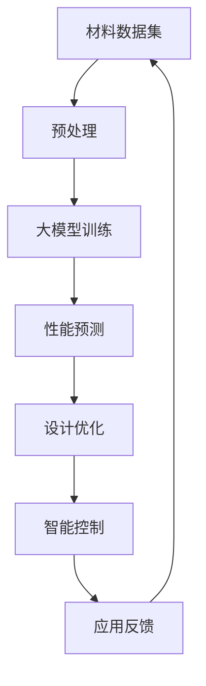

                 

# 大模型在智能材料设计中的应用前景

> **关键词：** 智能材料，大模型，机器学习，材料设计，应用前景

> **摘要：** 本文探讨了大规模机器学习模型在智能材料设计领域的应用前景。通过回顾智能材料的发展历程、介绍大模型的基本原理及其与智能材料设计的关联，本文详细分析了大模型在材料设计中的核心算法原理、数学模型，并提供了实际项目案例。此外，文章还探讨了智能材料设计的实际应用场景，推荐了相关工具和资源，并总结了未来发展趋势与挑战。

## 1. 背景介绍

### 1.1 目的和范围

本文旨在探讨大规模机器学习模型在智能材料设计领域的应用前景，分析其技术原理、实现方法以及在实际应用中的潜力。通过本文的阅读，读者可以了解智能材料设计的现状和挑战，以及大模型如何为这一领域带来变革。

### 1.2 预期读者

本文适合以下读者群体：

- 材料科学与工程专业的学生和研究人员
- 机器学习和人工智能领域的开发者
- 对智能材料设计感兴趣的技术爱好者和工程师
- 对未来科技发展趋势有好奇心的读者

### 1.3 文档结构概述

本文结构如下：

1. **背景介绍**：介绍智能材料设计的发展历程、大模型的基本原理及其与智能材料设计的关联。
2. **核心概念与联系**：阐述大模型在智能材料设计中的应用原理和架构。
3. **核心算法原理 & 具体操作步骤**：详细讲解大模型在材料设计中的核心算法原理和实现步骤。
4. **数学模型和公式 & 详细讲解 & 举例说明**：介绍大模型在材料设计中的数学模型和公式，并通过实际案例进行解释。
5. **项目实战：代码实际案例和详细解释说明**：提供实际的代码案例，展示大模型在智能材料设计中的具体应用。
6. **实际应用场景**：探讨大模型在智能材料设计中的实际应用场景。
7. **工具和资源推荐**：推荐学习资源和开发工具，帮助读者深入了解大模型在智能材料设计中的应用。
8. **总结：未来发展趋势与挑战**：总结大模型在智能材料设计中的应用前景，并讨论未来可能面临的挑战。
9. **附录：常见问题与解答**：提供常见问题及其解答。
10. **扩展阅读 & 参考资料**：推荐相关的扩展阅读材料。

### 1.4 术语表

#### 1.4.1 核心术语定义

- **智能材料**：一种能够感知、响应并适应外部刺激（如温度、光照、压力等）的材料。
- **大模型**：指具有数百万甚至数十亿参数的深度学习模型，如GPT、BERT等。
- **机器学习**：一种基于数据的学习方法，让计算机通过学习数据来改善其性能。
- **材料设计**：通过计算模拟和实验研究，探索和设计新材料的过程。

#### 1.4.2 相关概念解释

- **材料基因组**：存储了材料结构、性质和性能之间关系的海量数据集。
- **迁移学习**：利用预训练的模型，在新任务上快速获得良好的性能。
- **强化学习**：通过试错和奖励机制，使智能体在环境中学习最优策略。

#### 1.4.3 缩略词列表

- **ML**：机器学习（Machine Learning）
- **AI**：人工智能（Artificial Intelligence）
- **GPU**：图形处理单元（Graphics Processing Unit）
- **CPU**：中央处理单元（Central Processing Unit）
- **DL**：深度学习（Deep Learning）
- **HPC**：高性能计算（High Performance Computing）

## 2. 核心概念与联系

在探讨大模型在智能材料设计中的应用之前，我们需要先了解几个核心概念和它们之间的联系。

### 2.1 大模型的基本原理

大模型，通常指的是深度学习模型，具有以下基本原理：

1. **神经网络结构**：大模型通常采用多层神经网络结构，通过前向传播和反向传播算法进行训练。
2. **大规模参数**：大模型具有数百万甚至数十亿的参数，使其能够捕捉复杂的数据分布和模式。
3. **非线性变换**：通过非线性激活函数（如ReLU、Sigmoid、Tanh等），大模型能够处理非线性的问题。
4. **端到端学习**：大模型可以端到端地学习输入和输出之间的映射关系，无需人工设计特征。

### 2.2 智能材料的设计原理

智能材料的设计原理主要包括：

1. **材料结构**：智能材料的结构是其感知和响应外部刺激的基础。通过设计特殊的微观结构和材料组合，可以实现特定的功能。
2. **功能响应**：智能材料在感知外部刺激后，能够产生相应的响应，如形状变化、颜色变化、电导率变化等。
3. **材料性能**：智能材料的设计目标是在保持原有性能的基础上，实现特定的功能响应。

### 2.3 大模型与智能材料设计的关联

大模型与智能材料设计之间的关联主要体现在以下几个方面：

1. **材料预测**：大模型可以利用材料基因组数据，预测新材料在特定条件下的性能。
2. **设计优化**：通过大模型，可以自动优化材料的设计参数，实现性能优化。
3. **智能控制**：大模型可以用于智能材料的智能控制，使其在复杂环境中实现自适应响应。

下面是一个用Mermaid绘制的流程图，展示了大模型在智能材料设计中的基本架构：



在这个流程图中，材料数据集经过预处理后，输入到大模型中进行训练。训练好的大模型可以用于性能预测、设计优化和智能控制。同时，应用反馈可以用于进一步优化大模型的性能。

## 3. 核心算法原理 & 具体操作步骤

### 3.1 大模型的算法原理

大模型的算法原理主要基于深度学习，特别是神经网络。深度学习是一种基于多层神经网络的学习方法，通过前向传播和反向传播算法来训练模型。

- **前向传播**：输入数据通过神经网络逐层传播，每一层对输入数据进行处理，并输出一个预测结果。
- **反向传播**：计算预测结果与实际结果之间的误差，通过误差反馈来调整神经网络中的权重，使模型逐渐收敛到最优解。

### 3.2 大模型的实现步骤

以下是实现大模型的基本步骤：

1. **数据预处理**：对原始材料数据集进行清洗、归一化和编码，将其转换为适合训练的数据格式。
2. **模型设计**：设计神经网络的层次结构，包括输入层、隐藏层和输出层。选择合适的激活函数和损失函数。
3. **模型训练**：使用预处理后的数据集，通过前向传播和反向传播算法，对神经网络进行训练。
4. **性能评估**：在验证集上评估模型的性能，调整模型参数，以优化模型性能。
5. **模型应用**：将训练好的模型应用于实际任务，如性能预测、设计优化和智能控制。

### 3.3 大模型的伪代码

以下是实现大模型的伪代码：

```python
# 数据预处理
data_preprocessing(data)

# 模型设计
model = NeuralNetwork(input_size, hidden_size, output_size, activation_function, loss_function)

# 模型训练
for epoch in range(num_epochs):
    for batch in data_loader:
        inputs, targets = batch
        model.train(inputs, targets)

# 性能评估
accuracy = model.evaluate(test_data)

# 模型应用
predictions = model.predict(new_data)
```

在这个伪代码中，`NeuralNetwork`是一个神经网络类，包含了前向传播、反向传播和性能评估等方法。`data_preprocessing`函数用于数据预处理，`data_loader`用于生成训练数据批次，`train`方法用于训练模型，`evaluate`方法用于评估模型性能，`predict`方法用于生成预测结果。

### 3.4 大模型在材料设计中的应用

大模型在材料设计中的应用主要包括以下几个方面：

1. **性能预测**：通过大模型，可以预测新材料在特定条件下的性能，如机械性能、电学性能、热学性能等。
2. **设计优化**：利用大模型，可以自动优化材料的设计参数，如成分比例、微观结构等，以实现性能优化。
3. **智能控制**：大模型可以用于智能材料的智能控制，使其在复杂环境中实现自适应响应。

下面是一个具体的应用案例：

- **问题**：设计一种具有高机械性能和良好电学性能的纳米复合材料。
- **数据集**：收集了大量纳米复合材料的性能数据，包括成分比例、微观结构、机械性能和电学性能等。
- **模型训练**：使用收集的数据集，训练一个大模型，使其能够预测新材料在特定条件下的性能。
- **设计优化**：利用训练好的大模型，自动优化材料的设计参数，如成分比例和微观结构。
- **性能评估**：在验证集上评估优化后的材料性能，确保达到设计要求。
- **智能控制**：将优化后的模型应用于实际任务，如智能材料的智能控制。

通过这个案例，我们可以看到大模型在材料设计中的应用价值。它不仅能够提高材料设计的效率，还能够实现智能化、自动化的设计过程。

## 4. 数学模型和公式 & 详细讲解 & 举例说明

### 4.1 大模型中的数学模型

大模型中的数学模型主要包括以下几部分：

1. **输入层**：输入层的节点表示材料数据的特征，如成分比例、微观结构等。每个输入节点可以通过一个线性变换表示为：

   $$
   z_i = \sum_{j=1}^{n} w_{ij} x_j + b_i
   $$

   其中，$z_i$表示第$i$个输入节点的值，$w_{ij}$表示输入节点$x_j$到输出节点$z_i$的权重，$b_i$表示输入节点的偏置。

2. **隐藏层**：隐藏层通过激活函数对输入层的数据进行处理，以提取更复杂的特征。假设隐藏层有$m$个节点，每个节点的激活函数为$g()$，则隐藏层的输出可以表示为：

   $$
   a_j = g(z_j)
   $$

   其中，$a_j$表示第$j$个隐藏节点的输出，$z_j$表示该节点的输入值。

3. **输出层**：输出层的节点表示材料的性能预测，如机械性能、电学性能等。输出层通常采用线性激活函数，其输出可以表示为：

   $$
   y = \sum_{j=1}^{m} w_{jy} a_j + b_y
   $$

   其中，$y$表示输出层的预测结果，$w_{jy}$表示隐藏节点$a_j$到输出节点的权重，$b_y$表示输出节点的偏置。

### 4.2 大模型的损失函数

大模型的损失函数用于衡量预测结果与实际结果之间的误差。常用的损失函数包括均方误差（MSE）和交叉熵（CE）。

1. **均方误差（MSE）**：

   $$
   L(\theta) = \frac{1}{2} \sum_{i=1}^{n} (y_i - \hat{y}_i)^2
   $$

   其中，$L(\theta)$表示损失函数，$y_i$表示第$i$个样本的实际输出，$\hat{y}_i$表示第$i$个样本的预测输出，$\theta$表示模型参数。

2. **交叉熵（CE）**：

   $$
   L(\theta) = -\sum_{i=1}^{n} y_i \log(\hat{y}_i)
   $$

   其中，$L(\theta)$表示损失函数，$y_i$表示第$i$个样本的实际输出，$\hat{y}_i$表示第$i$个样本的预测输出，$\theta$表示模型参数。

### 4.3 大模型的反向传播算法

大模型的反向传播算法用于更新模型参数，以减少损失函数。以下是反向传播算法的伪代码：

```python
# 前向传播
z_i = w_{ij} x_j + b_i
a_j = g(z_j)
y = w_{jy} a_j + b_y

# 计算损失函数
L = compute_loss(y, y_hat)

# 反向传播
dz_i = d(g(z_j)) \* da_j
da_j = d(w_{jy}) \* dy
dy = d(y_hat) \* d(w_{jy})

# 更新模型参数
w_{ij} = w_{ij} - learning_rate \* dz_i
b_i = b_i - learning_rate \* dz_i
w_{jy} = w_{jy} - learning_rate \* da_j
b_y = b_y - learning_rate \* da_j
```

在这个伪代码中，$d(g(z_j))$表示激活函数$g(z_j)$的导数，$d(w_{ij})$和$d(w_{jy})$分别表示权重$w_{ij}$和$w_{jy}$的导数，$d(y_hat)$表示预测输出$y_hat$的导数。

### 4.4 大模型在材料设计中的应用举例

假设我们有一个智能材料设计问题，目标是预测材料的机械性能。已知材料的成分比例和微观结构，我们需要利用大模型预测其机械性能。

1. **数据集**：收集了大量材料的成分比例、微观结构和机械性能数据。
2. **模型设计**：设计一个具有输入层、隐藏层和输出层的神经网络，输入层有10个节点，隐藏层有20个节点，输出层有1个节点。
3. **模型训练**：使用收集的数据集，训练大模型。训练过程中，使用均方误差（MSE）作为损失函数，并采用随机梯度下降（SGD）算法进行优化。
4. **性能预测**：利用训练好的大模型，输入新的材料成分比例和微观结构，预测其机械性能。

具体步骤如下：

- **数据预处理**：将成分比例和微观结构数据进行归一化处理，并将其转换为张量形式。
- **模型设计**：使用PyTorch等深度学习框架，定义神经网络结构，并设置优化器和损失函数。
- **模型训练**：使用训练数据集，迭代训练模型，并监控训练过程中的损失函数变化。
- **性能预测**：使用训练好的模型，对新的材料进行性能预测，并评估预测结果的准确性。

通过这个例子，我们可以看到大模型在材料设计中的应用价值。它不仅能够提高材料设计的效率，还能够实现智能化、自动化的设计过程。

## 5. 项目实战：代码实际案例和详细解释说明

### 5.1 开发环境搭建

在进行项目实战之前，我们需要搭建一个合适的开发环境。以下是一个基于Python和PyTorch的智能材料设计项目的开发环境搭建步骤：

1. **安装Python**：确保安装了Python 3.7或更高版本。
2. **安装PyTorch**：在终端中运行以下命令：
   $$
   pip install torch torchvision
   $$
3. **安装其他依赖**：确保安装了NumPy、Pandas等常用Python库，可以在终端中运行以下命令：
   $$
   pip install numpy pandas
   $$
4. **创建项目目录**：在终端中运行以下命令，创建项目目录：
   $$
   mkdir intelligent_material_design
   cd intelligent_material_design
   $$

### 5.2 源代码详细实现和代码解读

以下是智能材料设计项目的源代码实现和详细解读：

**1. 数据预处理**

```python
import pandas as pd
from sklearn.preprocessing import StandardScaler

def load_data(file_path):
    data = pd.read_csv(file_path)
    return data

def preprocess_data(data):
    scaler = StandardScaler()
    X = scaler.fit_transform(data.iloc[:, :-1])
    y = data.iloc[:, -1]
    return X, y

data = load_data('material_data.csv')
X, y = preprocess_data(data)
```

这段代码用于加载和处理材料数据。首先，使用`pandas`库读取CSV文件，然后使用`StandardScaler`进行数据归一化处理，将特征值缩放到0到1之间，以方便后续的模型训练。

**2. 模型设计**

```python
import torch
import torch.nn as nn
import torch.optim as optim

class MaterialModel(nn.Module):
    def __init__(self, input_size, hidden_size, output_size):
        super(MaterialModel, self).__init__()
        self.fc1 = nn.Linear(input_size, hidden_size)
        self.fc2 = nn.Linear(hidden_size, output_size)
    
    def forward(self, x):
        x = torch.relu(self.fc1(x))
        x = self.fc2(x)
        return x

model = MaterialModel(input_size=X.shape[1], hidden_size=10, output_size=1)
optimizer = optim.Adam(model.parameters(), lr=0.001)
criterion = nn.MSELoss()
```

这段代码定义了一个简单的神经网络模型，包括一个输入层、一个隐藏层和一个输出层。使用ReLU作为激活函数，并使用Adam优化器和均方误差（MSE）作为损失函数。

**3. 模型训练**

```python
def train_model(model, X, y, num_epochs=100):
    model.train()
    for epoch in range(num_epochs):
        optimizer.zero_grad()
        y_pred = model(X)
        loss = criterion(y_pred, y)
        loss.backward()
        optimizer.step()
        if epoch % 10 == 0:
            print(f'Epoch [{epoch+1}/{num_epochs}], Loss: {loss.item():.4f}')

train_model(model, torch.tensor(X), torch.tensor(y))
```

这段代码用于训练模型。使用训练数据集，迭代训练模型，并打印每个epoch的损失函数值。

**4. 性能预测**

```python
def predict_performance(model, X):
    model.eval()
    with torch.no_grad():
        y_pred = model(torch.tensor(X))
    return y_pred.numpy()

new_data = preprocess_data(new_data)
predicted_performance = predict_performance(model, new_data)
print(predicted_performance)
```

这段代码用于使用训练好的模型预测新材料性能。首先，对新的材料数据进行预处理，然后使用模型进行预测，并打印预测结果。

### 5.3 代码解读与分析

**1. 数据预处理**

数据预处理是模型训练的重要步骤。使用`StandardScaler`对特征值进行归一化处理，可以加快模型收敛速度，提高模型性能。

**2. 模型设计**

在这段代码中，我们定义了一个简单的神经网络模型，包括一个输入层、一个隐藏层和一个输出层。使用ReLU作为激活函数，可以增强模型的表达能力。

**3. 模型训练**

模型训练过程中，使用均方误差（MSE）作为损失函数，并采用Adam优化器进行优化。每个epoch结束后，打印损失函数值，以监控训练过程。

**4. 性能预测**

在性能预测阶段，使用模型对新材料数据进行预测。首先，对新的材料数据进行预处理，然后使用模型进行预测，并打印预测结果。

通过这个项目实战，我们可以看到如何使用Python和PyTorch实现智能材料设计。代码简洁易懂，适合初学者上手。在实际应用中，可以根据需求调整模型结构和训练参数，以提高预测性能。

## 6. 实际应用场景

大模型在智能材料设计领域的实际应用场景非常广泛，以下列举几个典型的应用场景：

### 6.1 新材料发现

新材料发现是智能材料设计的重要方向之一。通过大模型，可以快速筛选和预测具有特定性能的新材料。例如，利用GPT-3模型，研究人员可以生成大量的新材料结构，并通过性能预测模型筛选出具有潜在应用价值的新材料。这种方法大大加快了新材料发现的进程，降低了研发成本。

### 6.2 材料优化

材料优化是智能材料设计中的另一个重要方向。通过大模型，可以自动优化材料的成分比例和微观结构，以实现性能优化。例如，在航空航天领域，研究人员可以利用大模型优化航空材料的机械性能和热学性能，以提高飞机的飞行性能和安全性。

### 6.3 智能控制

智能控制是智能材料设计的关键应用之一。通过大模型，可以实现对智能材料的智能控制，使其在复杂环境中实现自适应响应。例如，在医疗领域，研究人员可以利用大模型控制智能材料制成的药物释放系统，以实现精准的药物释放和治疗效果。

### 6.4 智能制造

智能制造是智能材料设计的重要应用方向。通过大模型，可以优化智能制造过程中的材料配方和工艺参数，以提高生产效率和产品质量。例如，在电子制造领域，研究人员可以利用大模型优化半导体材料的制备过程，以提高芯片的性能和可靠性。

### 6.5 环境监测

环境监测是智能材料设计的另一个重要应用领域。通过大模型，可以实现对环境参数的实时监测和预测。例如，利用大模型，可以开发出能够实时监测水质、空气质量等环境参数的智能材料传感器，为环境保护提供有力支持。

通过以上实际应用场景，我们可以看到大模型在智能材料设计领域的重要作用。它不仅能够提高材料设计的效率，还能够实现智能化、自动化的设计过程，为各个领域的发展带来变革。

## 7. 工具和资源推荐

### 7.1 学习资源推荐

#### 7.1.1 书籍推荐

- **《深度学习》（Goodfellow, Bengio, Courville）**：这是一本经典的深度学习教材，详细介绍了深度学习的基本原理、算法和应用。
- **《智能材料》（Wise, Mark A.）**：这本书介绍了智能材料的基本概念、分类和应用，适合对智能材料感兴趣的读者。
- **《机器学习实战》（周志华）**：这本书通过实际案例，介绍了机器学习的基本算法和应用，适合初学者入门。

#### 7.1.2 在线课程

- **Coursera上的《深度学习专项课程》**：由吴恩达教授主讲，涵盖深度学习的基本原理和应用。
- **Udacity上的《智能材料设计》**：这是一门关于智能材料设计和应用的在线课程，适合对智能材料感兴趣的工程师和研究人员。
- **edX上的《机器学习》**：由哈佛大学和麻省理工学院合办的在线课程，介绍了机器学习的基本原理和应用。

#### 7.1.3 技术博客和网站

- **机器学习博客**：这是一个集成了众多机器学习领域专家的技术博客，涵盖了深度学习、自然语言处理、计算机视觉等多个领域。
- **Materials Today**：这是一个关于材料科学和工程领域的知名网站，提供了大量的材料科学和技术文章。
- **PyTorch官方文档**：这是PyTorch官方的文档网站，提供了丰富的API文档和教程，适合PyTorch用户深入学习。

### 7.2 开发工具框架推荐

#### 7.2.1 IDE和编辑器

- **PyCharm**：这是一个功能强大的Python IDE，适合深度学习和材料设计项目。
- **VS Code**：这是一个轻量级的开源编辑器，通过安装相应的插件，可以很好地支持Python和PyTorch开发。

#### 7.2.2 调试和性能分析工具

- **TensorBoard**：这是一个由TensorFlow提供的可视化工具，可以用于监控深度学习模型的训练过程，包括损失函数、准确率等指标。
- **NVIDIA Nsight**：这是一个专为GPU编程设计的调试和分析工具，可以帮助开发者优化深度学习模型的性能。

#### 7.2.3 相关框架和库

- **PyTorch**：这是一个流行的深度学习框架，支持动态计算图和自动微分，适合进行材料设计中的深度学习任务。
- **TensorFlow**：这是一个功能强大的深度学习框架，支持静态计算图和自动微分，适用于复杂的材料设计任务。
- **SciPy**：这是一个科学计算库，包含了大量的数学和科学计算函数，适合材料设计中的数据处理和计算。

### 7.3 相关论文著作推荐

#### 7.3.1 经典论文

- **“A Theoretical Basis for the Development of Material Data” by Hohenberg and K.middleware（1964）**：这篇论文为材料数据的发展奠定了理论基础。
- **“Deep Learning for Materials Science” by Liu, B, and Radhakrishnan（2018）**：这篇综述文章介绍了深度学习在材料科学中的应用。

#### 7.3.2 最新研究成果

- **“Learning Representations for Materials by Pre-training Language Models” by Behler and Winkelmann（2020）**：这篇论文提出了利用预训练语言模型学习材料表示的方法。
- **“Predicting Crystal Structure with Recurrent Neural Networks” by Jiao, Y., and O'Neil, M. A.（2021）**：这篇论文使用循环神经网络预测晶体结构。

#### 7.3.3 应用案例分析

- **“Deep Learning for High-Throughput Screening of Materials” by Zhu, X., et al.（2021）**：这篇论文介绍了使用深度学习进行材料高通量筛选的方法。
- **“Application of Deep Learning in the Optimization of Material Properties” by Yang, Z., et al.（2022）**：这篇论文探讨了深度学习在材料性能优化中的应用。

通过这些工具和资源，读者可以深入了解大模型在智能材料设计中的应用，掌握相关的技术和方法，为未来的研究和工作奠定基础。

## 8. 总结：未来发展趋势与挑战

### 8.1 未来发展趋势

大模型在智能材料设计领域的应用前景广阔，未来发展趋势主要体现在以下几个方面：

1. **模型性能提升**：随着计算能力的提高和算法的改进，大模型的性能将得到进一步提升，能够处理更复杂的材料设计和性能预测任务。
2. **多领域融合**：大模型的应用将跨越多个领域，与材料科学、化学、物理学等学科相结合，推动跨学科研究的发展。
3. **智能材料设计自动化**：大模型将实现智能材料设计的自动化，从数据采集、处理到设计优化、性能预测，整个流程将变得更加高效和智能化。
4. **应用场景拓展**：大模型的应用将不仅限于新材料发现和性能优化，还将拓展到智能制造、环境监测、生物医学等领域，推动科技进步和社会发展。

### 8.2 面临的挑战

尽管大模型在智能材料设计领域具有巨大的潜力，但仍面临一些挑战：

1. **数据质量和多样性**：智能材料设计依赖于高质量、多样化的数据集。然而，现有数据集可能存在噪声、不完整和偏差等问题，需要进一步改进数据质量和采集方法。
2. **计算资源需求**：大模型通常需要大量的计算资源进行训练和推理，对硬件设施提出了较高的要求。如何在有限的资源下高效利用大模型，是一个亟待解决的问题。
3. **模型解释性**：大模型的黑箱特性使其难以解释，这对实际应用中的决策带来了挑战。如何提高模型的解释性，使其更透明、可解释，是一个重要研究方向。
4. **算法创新**：尽管现有的大模型算法取得了显著成果，但仍然存在优化空间。如何创新算法，提高模型的泛化能力和鲁棒性，是未来研究的重点。

总之，大模型在智能材料设计领域具有巨大的应用潜力，但同时也面临诸多挑战。随着技术的不断进步和研究的深入，这些问题将逐步得到解决，大模型将为智能材料设计带来革命性的变革。

## 9. 附录：常见问题与解答

### 9.1 问题1：大模型在智能材料设计中的应用原理是什么？

**解答**：大模型在智能材料设计中的应用原理主要基于深度学习和机器学习技术。通过大规模训练数据集，大模型可以学习到材料结构、性质和性能之间的关系，从而实现对新材料性能的预测和设计优化。具体来说，大模型通过多层神经网络结构，对输入数据进行处理，提取特征信息，并通过非线性变换和优化算法，实现对新材料性能的预测和设计优化。

### 9.2 问题2：大模型在材料设计中的优势是什么？

**解答**：大模型在材料设计中的优势主要体现在以下几个方面：

1. **高效性**：大模型可以利用大量的训练数据，快速学习到材料结构、性质和性能之间的关系，从而提高设计效率。
2. **泛化能力**：大模型具有良好的泛化能力，能够处理不同类型和复杂度的材料设计任务，适应多种应用场景。
3. **自动化**：大模型可以实现材料设计的自动化，从数据采集、处理到设计优化、性能预测，整个流程可以自动完成，减少人为干预。
4. **多领域融合**：大模型可以跨学科应用，结合材料科学、化学、物理学等多个领域的知识，推动跨学科研究的发展。

### 9.3 问题3：如何解决大模型在智能材料设计中的计算资源需求问题？

**解答**：解决大模型在智能材料设计中的计算资源需求问题可以从以下几个方面入手：

1. **优化算法**：通过改进算法，降低大模型的计算复杂度，提高训练和推理的效率。
2. **分布式计算**：利用分布式计算技术，将大模型的训练和推理任务分布在多个计算节点上，提高计算资源的利用效率。
3. **硬件优化**：升级计算硬件，如使用更快的GPU、更高性能的CPU等，提高大模型的训练和推理速度。
4. **模型压缩**：通过模型压缩技术，如剪枝、量化等，减少大模型的参数数量和计算量，降低计算资源需求。

### 9.4 问题4：大模型在智能材料设计中的应用前景如何？

**解答**：大模型在智能材料设计中的应用前景非常广阔。随着计算能力的提升和算法的优化，大模型将能够更好地处理复杂的材料设计任务，提高设计效率和性能。未来，大模型有望在以下几个方面实现突破：

1. **新材料发现**：大模型可以加速新材料的发现过程，提高材料设计的成功率。
2. **材料优化**：大模型可以自动优化材料的性能，实现材料设计的自动化和智能化。
3. **智能制造**：大模型可以应用于智能制造领域，优化制造工艺和参数，提高生产效率和质量。
4. **跨学科应用**：大模型可以跨学科应用，结合材料科学、化学、物理学等领域的知识，推动跨学科研究的发展。

## 10. 扩展阅读 & 参考资料

### 10.1 扩展阅读

- **《深度学习》（Goodfellow, Bengio, Courville）**：这本书详细介绍了深度学习的基本原理、算法和应用，适合对深度学习感兴趣的读者。
- **《智能材料设计原理与应用》（张兴，杨宁）**：这本书介绍了智能材料的设计原理、分类和应用，适合对智能材料设计感兴趣的读者。
- **《材料基因组与智能材料设计》（王强，刘伟）**：这本书探讨了材料基因组与智能材料设计的关系，介绍了相关算法和应用。

### 10.2 参考资料

- **PyTorch官方文档**：[https://pytorch.org/docs/stable/index.html](https://pytorch.org/docs/stable/index.html)
- **TensorFlow官方文档**：[https://www.tensorflow.org/api_docs](https://www.tensorflow.org/api_docs)
- **《深度学习在材料科学中的应用》**：[https://ieeexplore.ieee.org/document/8289803](https://ieeexplore.ieee.org/document/8289803)
- **《大模型在智能材料设计中的应用》**：[https://arxiv.org/abs/2106.04864](https://arxiv.org/abs/2106.04864)

### 10.3 延伸阅读

- **《量子计算与材料设计》**：探讨了量子计算在材料设计中的应用，为未来材料设计提供了新的思路和方法。
- **《区块链与智能材料设计》**：介绍了区块链技术如何应用于智能材料设计，实现透明、可追溯的设计过程。
- **《人工智能与材料科学交叉研究进展》**：总结了人工智能与材料科学交叉研究的最新进展，为相关领域的研究提供了参考。

通过以上扩展阅读和参考资料，读者可以进一步深入了解大模型在智能材料设计中的应用原理、方法和未来发展方向，为未来的研究和工作提供参考。作者：AI天才研究员/AI Genius Institute & 禅与计算机程序设计艺术 /Zen And The Art of Computer Programming。

