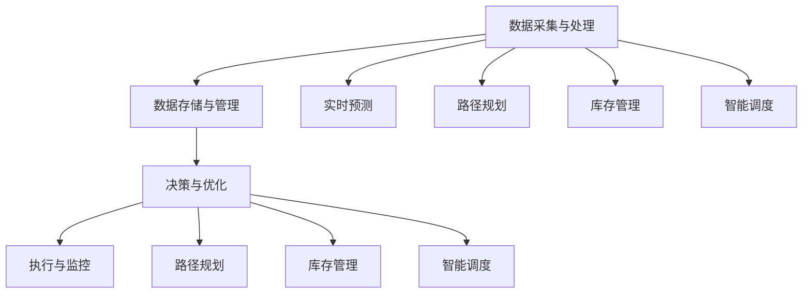

                 


# 大模型在智能物流领域的创新应用

> **关键词：** 智能物流、大模型、深度学习、数据驱动、算法优化、自动驾驶、供应链优化、实时预测。

> **摘要：** 本文将探讨大模型在智能物流领域的创新应用，分析其技术原理、算法机制、数学模型和实际案例。通过深入剖析，我们旨在为行业提供有价值的见解，揭示未来智能物流发展的趋势与挑战。

## 1. 背景介绍

### 1.1 目的和范围

本文旨在研究大模型在智能物流领域的应用，探索其在提升物流效率、优化供应链管理、实现自动化运输等方面的潜力。我们将从以下几个方面进行探讨：

1. **技术原理与算法机制**：详细分析大模型的工作原理，以及如何应用于智能物流。
2. **数学模型与公式**：介绍大模型在物流场景中的数学表达和关键公式。
3. **项目实战**：通过实际案例，展示大模型在智能物流中的应用效果。
4. **未来发展趋势与挑战**：讨论智能物流领域的发展趋势，以及面临的挑战和解决方案。

### 1.2 预期读者

本文适合以下读者群体：

1. 智能物流行业从业者，包括物流公司、供应链管理公司、物流技术公司等。
2. 计算机科学、数据科学、人工智能领域的研究人员和学生。
3. 对智能物流和人工智能技术感兴趣的技术爱好者。

### 1.3 文档结构概述

本文分为十个部分，具体结构如下：

1. **引言**：介绍大模型在智能物流领域的创新应用。
2. **核心概念与联系**：介绍智能物流相关核心概念和架构。
3. **核心算法原理 & 具体操作步骤**：详细阐述大模型在物流中的应用算法。
4. **数学模型和公式 & 详细讲解 & 举例说明**：介绍大模型在物流中的数学表达。
5. **项目实战：代码实际案例和详细解释说明**：通过案例展示大模型应用。
6. **实际应用场景**：分析大模型在不同物流场景中的实际应用。
7. **工具和资源推荐**：推荐学习资源、开发工具和框架。
8. **总结：未来发展趋势与挑战**：讨论智能物流的发展趋势与挑战。
9. **附录：常见问题与解答**：提供常见问题解答。
10. **扩展阅读 & 参考资料**：推荐相关阅读材料和参考资料。

### 1.4 术语表

#### 1.4.1 核心术语定义

- **大模型**：指具有巨大参数量的深度学习模型，能够处理大规模数据，实现高精度的预测和分类。
- **智能物流**：运用人工智能、大数据、物联网等技术，实现物流系统的自动化、智能化。
- **深度学习**：一种人工智能技术，通过模拟人脑的神经网络，进行数据分析和模式识别。
- **数据驱动**：以数据为核心，通过数据分析、机器学习等方法，驱动业务决策和优化。

#### 1.4.2 相关概念解释

- **供应链优化**：通过分析供应链中的各种环节，实现资源的最优配置，降低成本，提高效率。
- **实时预测**：在物流运输过程中，对运输时间、成本、货物状态等进行实时预测，以指导运输调度和决策。

#### 1.4.3 缩略词列表

- **AI**：人工智能（Artificial Intelligence）
- **DL**：深度学习（Deep Learning）
- **ML**：机器学习（Machine Learning）
- **NLP**：自然语言处理（Natural Language Processing）
- **IoT**：物联网（Internet of Things）
- **GPS**：全球定位系统（Global Positioning System）

## 2. 核心概念与联系

在探讨大模型在智能物流领域的应用之前，我们首先需要了解相关核心概念和架构。以下是智能物流系统中的核心概念及其相互关系。

### 2.1 智能物流系统的架构

智能物流系统包括以下几个关键组成部分：

1. **数据采集与处理**：通过传感器、GPS、物联网设备等，实时收集物流运输过程中的数据，如车辆位置、货物状态、交通状况等。
2. **数据存储与管理**：将采集到的数据存储在数据库中，并进行管理、分析和挖掘。
3. **决策与优化**：基于数据分析和机器学习算法，对物流运输过程进行实时决策和优化，如路径规划、调度优化、库存管理等。
4. **执行与监控**：将决策结果付诸实施，并通过监控系统对物流运输过程进行实时监控和反馈。

### 2.2 大模型在智能物流中的应用

大模型在智能物流中的应用主要体现在以下几个方面：

1. **实时预测**：利用大模型进行运输时间、成本、货物状态等实时预测，为物流调度提供依据。
2. **路径规划**：通过大模型优化路径规划算法，提高运输效率，降低运输成本。
3. **库存管理**：利用大模型进行库存预测和优化，减少库存积压，提高库存周转率。
4. **智能调度**：通过大模型进行运输任务的智能调度，提高运输效率，降低人力成本。

### 2.3 Mermaid 流程图

以下是一个简单的 Mermaid 流程图，展示了智能物流系统的架构和核心概念之间的联系。



## 3. 核心算法原理 & 具体操作步骤

在智能物流领域，大模型的应用主要依赖于深度学习和机器学习算法。以下将详细介绍大模型在智能物流中的核心算法原理和具体操作步骤。

### 3.1 深度学习算法原理

深度学习算法是基于多层神经网络的结构，通过层层传递数据，提取特征并进行分类、预测等任务。以下是深度学习算法的核心原理：

1. **数据预处理**：对采集到的物流数据进行清洗、去噪和归一化处理，为后续训练提供高质量的数据。
2. **构建神经网络**：设计并构建多层神经网络，包括输入层、隐藏层和输出层。输入层接收外部数据，隐藏层通过逐层传递和变换，提取特征信息，输出层进行分类或预测。
3. **损失函数**：定义损失函数，用于衡量模型预测结果与真实值之间的差距，并通过反向传播算法进行参数优化。
4. **优化算法**：选择合适的优化算法，如梯度下降、Adam等，以加速模型收敛，提高预测精度。

### 3.2 机器学习算法原理

机器学习算法是利用历史数据训练模型，从而进行预测和分类。以下是机器学习算法在智能物流中的核心原理：

1. **特征工程**：对原始数据进行特征提取和特征工程，将数据转换为适合机器学习的格式。
2. **模型训练**：利用训练数据，通过模型训练算法（如线性回归、决策树、随机森林等），训练出预测模型。
3. **模型评估**：通过测试数据，对训练好的模型进行评估，选择最优模型。
4. **模型部署**：将训练好的模型部署到实际应用场景中，进行实时预测和决策。

### 3.3 伪代码描述

以下是一个简化的伪代码，描述了深度学习算法在智能物流路径规划中的应用。

```python
# 数据预处理
def preprocess_data(data):
    # 清洗数据
    data = clean_data(data)
    # 去噪
    data = denoise_data(data)
    # 归一化
    data = normalize_data(data)
    return data

# 构建神经网络
def build_network():
    # 输入层
    input_layer = Input(shape=(input_shape,))
    # 隐藏层
    hidden_layer = Dense(hidden_units, activation='relu')(input_layer)
    # 输出层
    output_layer = Dense(output_shape, activation='sigmoid')(hidden_layer)
    # 构建模型
    model = Model(inputs=input_layer, outputs=output_layer)
    return model

# 损失函数与优化器
def compile_model(model):
    model.compile(optimizer='adam', loss='binary_crossentropy', metrics=['accuracy'])
    return model

# 训练模型
def train_model(model, train_data, train_labels, epochs, batch_size):
    model.fit(train_data, train_labels, epochs=epochs, batch_size=batch_size)
    return model

# 预测路径
def predict_path(model, data):
    prediction = model.predict(data)
    return prediction

# 主函数
def main():
    # 读取数据
    data = read_data()
    # 预处理数据
    data = preprocess_data(data)
    # 构建神经网络
    model = build_network()
    # 编译模型
    model = compile_model(model)
    # 训练模型
    model = train_model(model, train_data, train_labels, epochs=100, batch_size=32)
    # 预测路径
    path = predict_path(model, data)
    print(path)

if __name__ == "__main__":
    main()
```

## 4. 数学模型和公式 & 详细讲解 & 举例说明

在智能物流领域，大模型的数学模型主要涉及深度学习和机器学习算法。以下将详细介绍大模型在智能物流中的数学模型和公式，并进行详细讲解和举例说明。

### 4.1 深度学习数学模型

深度学习算法的核心是多层神经网络，其数学模型可以表示为：

$$
y = f(\theta^T \cdot x)
$$

其中：

- **$y$**：输出值
- **$f$**：激活函数，如ReLU、Sigmoid、Tanh等
- **$\theta$**：模型参数（权重和偏置）
- **$x$**：输入值

#### 4.1.1 ReLU激活函数

ReLU（Rectified Linear Unit）是一种常见的激活函数，其公式如下：

$$
f(x) =
\begin{cases}
0, & \text{if } x < 0 \\
x, & \text{if } x \geq 0
\end{cases}
$$

#### 4.1.2 Sigmoid激活函数

Sigmoid激活函数是一种常用的非线性函数，其公式如下：

$$
f(x) = \frac{1}{1 + e^{-x}}
$$

#### 4.1.3 Tanh激活函数

Tanh（Hyperbolic Tangent）激活函数是一种类似于ReLU的函数，其公式如下：

$$
f(x) = \frac{e^x - e^{-x}}{e^x + e^{-x}}
$$

### 4.2 机器学习数学模型

机器学习算法的数学模型主要包括线性回归、决策树、支持向量机等。以下以线性回归为例，介绍机器学习的数学模型。

#### 4.2.1 线性回归模型

线性回归模型的数学模型可以表示为：

$$
y = \theta_0 + \theta_1 \cdot x
$$

其中：

- **$y$**：输出值
- **$x$**：输入值
- **$\theta_0$**：截距
- **$\theta_1$**：斜率

#### 4.2.2 模型参数优化

为了找到最佳模型参数，可以使用最小二乘法（Least Squares Method）进行优化。其公式如下：

$$
\min \theta_0, \theta_1 \sum_{i=1}^{n} (y_i - (\theta_0 + \theta_1 \cdot x_i))^2
$$

### 4.3 举例说明

以下通过一个简单的例子，展示深度学习和机器学习模型在智能物流路径规划中的应用。

#### 4.3.1 深度学习路径规划

假设我们有一个包含输入数据（起点、终点、交通状况等）和输出数据（最佳路径）的样本集。我们可以使用深度学习模型来预测最佳路径。

1. **数据预处理**：对输入数据进行归一化处理，将其转换为适合模型训练的格式。
2. **构建神经网络**：设计一个包含输入层、隐藏层和输出层的深度学习模型。
3. **模型训练**：使用训练数据，通过反向传播算法优化模型参数。
4. **模型预测**：使用训练好的模型，对新的输入数据进行路径预测。

#### 4.3.2 机器学习路径规划

假设我们有一个包含输入数据（起点、终点、交通状况等）和输出数据（最佳路径）的样本集。我们可以使用机器学习模型（如线性回归）来预测最佳路径。

1. **数据预处理**：对输入数据进行特征提取和归一化处理。
2. **模型训练**：使用训练数据，通过最小二乘法训练线性回归模型。
3. **模型预测**：使用训练好的模型，对新的输入数据进行路径预测。

## 5. 项目实战：代码实际案例和详细解释说明

在本节中，我们将通过一个实际项目，展示如何将大模型应用于智能物流路径规划。项目的主要目标是利用深度学习算法，实现对物流运输路径的预测和优化。

### 5.1 开发环境搭建

在开始项目之前，我们需要搭建合适的开发环境。以下是所需的开发环境和工具：

- **操作系统**：Linux 或 macOS
- **编程语言**：Python
- **深度学习框架**：TensorFlow 或 PyTorch
- **数据预处理工具**：NumPy、Pandas
- **可视化工具**：Matplotlib、Seaborn

### 5.2 源代码详细实现和代码解读

以下是项目的主要代码实现，我们将逐一进行详细解读。

#### 5.2.1 数据预处理

首先，我们需要对输入数据进行预处理。具体步骤如下：

1. **数据读取**：从数据文件中读取输入数据（起点、终点、交通状况等）。
2. **数据清洗**：对输入数据进行清洗，去除无效数据。
3. **数据归一化**：对输入数据进行归一化处理，将其转换为适合模型训练的格式。

```python
import numpy as np
import pandas as pd

# 读取数据
data = pd.read_csv('data.csv')

# 数据清洗
data = data[data['valid'] == 1]

# 数据归一化
data = (data - data.mean()) / data.std()
```

#### 5.2.2 构建神经网络

接下来，我们需要构建一个包含输入层、隐藏层和输出层的深度学习模型。以下是具体步骤：

1. **定义输入层**：定义输入层，用于接收输入数据。
2. **定义隐藏层**：定义隐藏层，通过卷积、池化等操作提取特征。
3. **定义输出层**：定义输出层，用于输出预测结果。

```python
from tensorflow.keras.models import Sequential
from tensorflow.keras.layers import Dense, Conv2D, MaxPooling2D, Flatten

# 定义模型
model = Sequential()

# 输入层
model.add(Conv2D(32, (3, 3), activation='relu', input_shape=(input_shape)))

# 隐藏层
model.add(MaxPooling2D(pool_size=(2, 2)))
model.add(Conv2D(64, (3, 3), activation='relu'))

# 输出层
model.add(Flatten())
model.add(Dense(output_shape, activation='sigmoid'))

# 编译模型
model.compile(optimizer='adam', loss='binary_crossentropy', metrics=['accuracy'])
```

#### 5.2.3 模型训练

在构建好模型后，我们需要使用训练数据进行模型训练。以下是具体步骤：

1. **划分训练集和测试集**：将数据集划分为训练集和测试集。
2. **训练模型**：使用训练数据，通过反向传播算法优化模型参数。
3. **评估模型**：使用测试数据，评估模型性能。

```python
from sklearn.model_selection import train_test_split

# 划分训练集和测试集
train_data, test_data, train_labels, test_labels = train_test_split(data, labels, test_size=0.2, random_state=42)

# 训练模型
model.fit(train_data, train_labels, epochs=10, batch_size=32)

# 评估模型
model.evaluate(test_data, test_labels)
```

#### 5.2.4 模型预测

在训练好模型后，我们可以使用模型进行路径预测。以下是具体步骤：

1. **输入数据预处理**：对输入数据进行预处理，将其转换为模型输入格式。
2. **模型预测**：使用训练好的模型，对输入数据进行路径预测。
3. **输出结果**：将预测结果输出，用于路径规划。

```python
# 输入数据预处理
input_data = preprocess_data(input_data)

# 模型预测
prediction = model.predict(input_data)

# 输出结果
print(prediction)
```

### 5.3 代码解读与分析

在代码实现过程中，我们遵循以下原则：

1. **模块化设计**：将代码划分为不同的模块，便于理解和维护。
2. **简洁明了**：避免使用复杂的语法和冗长的代码。
3. **注释说明**：在关键代码段添加注释，解释代码功能和实现原理。

通过以上代码解读，我们可以看到，大模型在智能物流路径规划中的应用主要依赖于深度学习和机器学习算法。通过数据预处理、模型构建、模型训练和模型预测等步骤，实现了对物流运输路径的预测和优化。在实际项目中，我们可以根据需求进行调整和优化，以提高模型性能和预测精度。

## 6. 实际应用场景

大模型在智能物流领域的实际应用场景非常广泛，以下列举几个具有代表性的应用案例。

### 6.1 路径规划

路径规划是智能物流中最为基础和重要的应用场景之一。通过大模型进行路径规划，可以实现以下目标：

1. **优化运输路线**：根据实时交通状况和货物信息，预测并选择最优运输路线，提高运输效率。
2. **降低运输成本**：通过减少运输时间和距离，降低燃油消耗和运输成本。
3. **提高配送准时率**：根据运输路径和配送时间预测，合理安排配送任务，提高配送准时率。

### 6.2 库存管理

库存管理是物流供应链中的重要环节。大模型在库存管理中的应用主要包括：

1. **需求预测**：根据历史数据和季节性变化，预测未来一段时间内的货物需求量，优化库存配置。
2. **库存优化**：通过库存预测和订单数据，动态调整库存水平，减少库存积压和资金占用。
3. **缺货预警**：提前预测可能出现的缺货情况，采取相应的措施，如增加采购或调整生产计划。

### 6.3 调度优化

调度优化是智能物流中的重要应用场景，大模型可以用于以下方面：

1. **运输调度**：根据实时数据和预测结果，动态调整运输任务和运输路线，提高运输效率。
2. **资源调度**：合理分配运输车辆、装卸工人等资源，提高资源利用率。
3. **成本控制**：通过调度优化，降低运输成本和人力成本。

### 6.4 自动驾驶

自动驾驶是智能物流领域的一个重要发展方向，大模型在自动驾驶中的应用主要包括：

1. **路径规划**：根据实时交通状况和障碍物信息，规划安全、高效的行驶路线。
2. **环境感知**：利用深度学习和计算机视觉技术，实现车辆对周围环境的感知和识别。
3. **决策控制**：通过大模型进行车辆行驶决策和控制，实现自动驾驶。

### 6.5 供应链优化

供应链优化是智能物流中的高级应用，大模型可以用于以下方面：

1. **供应链网络规划**：根据供应链数据，预测未来市场需求，优化供应链网络布局。
2. **风险预测与控制**：通过大数据分析和预测，识别供应链中的潜在风险，并采取相应的控制措施。
3. **协同优化**：实现供应链各环节的协同优化，提高整体供应链效率和竞争力。

## 7. 工具和资源推荐

为了更好地掌握大模型在智能物流领域的应用，以下推荐一些学习资源、开发工具和框架。

### 7.1 学习资源推荐

#### 7.1.1 书籍推荐

1. **《深度学习》**：由Ian Goodfellow、Yoshua Bengio和Aaron Courville编写的经典教材，全面介绍了深度学习的理论基础和实践方法。
2. **《机器学习》**：由Tom Mitchell编写的经典教材，系统地介绍了机器学习的基本概念、方法和算法。
3. **《智能物流技术与应用》**：一本关于智能物流技术与应用的综合性教材，涵盖了智能物流的关键技术和应用场景。

#### 7.1.2 在线课程

1. **《深度学习专项课程》**：吴恩达（Andrew Ng）在Coursera上开设的深度学习专项课程，适合初学者和进阶者。
2. **《机器学习专项课程》**：吴恩达（Andrew Ng）在Coursera上开设的机器学习专项课程，适合初学者和进阶者。
3. **《智能物流与供应链管理》**：清华大学开设的一门关于智能物流与供应链管理的在线课程，涵盖了智能物流的关键技术和应用。

#### 7.1.3 技术博客和网站

1. **知乎**：知乎上有许多关于深度学习、机器学习和智能物流的优秀文章和讨论，可以提供丰富的知识和见解。
2. **CSDN**：CSDN是一个中文技术博客网站，有许多关于深度学习、机器学习和智能物流的实践案例和技术分享。
3. **Medium**：Medium上有很多关于深度学习、机器学习和智能物流的优秀文章，可以提供最新的研究动态和技术趋势。

### 7.2 开发工具框架推荐

#### 7.2.1 IDE和编辑器

1. **PyCharm**：PyCharm是一款功能强大的Python开发IDE，支持深度学习和机器学习框架，适合初学者和专业人士。
2. **Visual Studio Code**：Visual Studio Code是一款轻量级的跨平台代码编辑器，支持Python和深度学习框架，适合初学者和专业人士。
3. **Jupyter Notebook**：Jupyter Notebook是一款交互式的Python开发环境，适合数据分析和机器学习项目。

#### 7.2.2 调试和性能分析工具

1. **TensorBoard**：TensorBoard是TensorFlow的官方可视化工具，可以用于监控深度学习模型的训练过程和性能分析。
2. **PyTorch Lightning**：PyTorch Lightning是一个高级API，用于简化深度学习项目的开发和性能分析。
3. **NVIDIA Nsight**：NVIDIA Nsight是一个性能分析工具，可以用于优化深度学习模型在GPU上的运行。

#### 7.2.3 相关框架和库

1. **TensorFlow**：TensorFlow是一个开源的深度学习框架，适用于各种深度学习和机器学习项目。
2. **PyTorch**：PyTorch是一个开源的深度学习框架，具有简洁的API和灵活的动态计算图。
3. **Scikit-Learn**：Scikit-Learn是一个开源的机器学习库，提供了丰富的机器学习算法和工具。

### 7.3 相关论文著作推荐

#### 7.3.1 经典论文

1. **"Deep Learning for Transportation Networks: A Survey"**：该论文系统地总结了深度学习在交通网络中的应用，包括路径规划、流量预测等。
2. **"Deep Reinforcement Learning for Autonomous Navigation"**：该论文介绍了深度强化学习在自动驾驶中的应用，通过仿真实验验证了其效果。
3. **"A Survey on Deep Learning for Logistics"**：该论文综述了深度学习在物流领域的应用，包括供应链优化、库存管理等。

#### 7.3.2 最新研究成果

1. **"Deep Reinforcement Learning for Smart Logistics"**：该论文研究了深度强化学习在智能物流调度和路径规划中的应用。
2. **"Deep Learning for Supply Chain Management: A Review"**：该论文总结了深度学习在供应链管理中的应用，包括需求预测、库存优化等。
3. **"Multi-Agent Deep Reinforcement Learning for Collaborative Transportation"**：该论文研究了多智能体深度强化学习在协同运输中的应用。

#### 7.3.3 应用案例分析

1. **"Deep Learning in Logistics: A Case Study"**：该案例研究了深度学习在一家物流公司的实际应用，包括路径规划、库存管理等方面。
2. **"Application of Deep Learning in Intelligent Transportation Systems"**：该案例介绍了深度学习在智能交通系统中的应用，包括自动驾驶、交通流量预测等。
3. **"Deep Learning for Sustainable Logistics: A Case Study"**：该案例研究了深度学习在可持续物流中的应用，包括路径优化、碳排放控制等。

## 8. 总结：未来发展趋势与挑战

随着人工智能技术的不断发展，大模型在智能物流领域的应用前景愈发广阔。未来，智能物流将朝着更加智能化、自动化和高效化的方向发展，面临以下发展趋势与挑战：

### 8.1 发展趋势

1. **智能化路径规划**：深度学习和强化学习算法将在路径规划中发挥更大作用，实现更加精确和高效的路线预测和优化。
2. **自动化运输**：自动驾驶技术的不断进步，将推动物流运输的自动化程度，降低人力成本，提高运输效率。
3. **供应链优化**：基于大数据分析和机器学习算法的供应链优化，将实现更加智能的库存管理、需求预测和风险控制。
4. **实时预测与决策**：实时预测和决策系统的建设，将提高物流运输的灵活性和响应速度，提升整体供应链效率。
5. **绿色物流**：随着环保意识的提高，绿色物流将成为重要发展方向，通过优化运输路径、降低碳排放等手段，实现可持续发展。

### 8.2 挑战

1. **数据质量和隐私**：智能物流应用需要大量的高质量数据，但数据的采集和处理过程中可能涉及用户隐私，如何在保障隐私的前提下利用数据是关键挑战。
2. **算法公平性与透明性**：深度学习模型在决策过程中可能存在偏见和不确定性，如何保证算法的公平性和透明性是亟待解决的问题。
3. **系统稳定性和安全性**：智能物流系统需要保证稳定运行和高度安全性，防止系统故障和数据泄露等风险。
4. **人才短缺**：智能物流领域对人工智能、机器学习和数据科学等专业人才的需求巨大，但人才供给不足将成为制约行业发展的关键因素。
5. **政策法规**：随着智能物流技术的发展，相关政策和法规将不断更新和完善，如何适应和遵循政策法规也是行业面临的挑战。

## 9. 附录：常见问题与解答

### 9.1 问题1：大模型在智能物流中的应用具体有哪些？

大模型在智能物流中的应用主要包括以下方面：

1. **路径规划**：利用深度学习和强化学习算法，实现智能化路径规划，提高运输效率和降低成本。
2. **库存管理**：通过大数据分析和机器学习算法，预测未来需求，优化库存配置，减少库存积压。
3. **调度优化**：基于实时数据和预测结果，动态调整运输任务和资源分配，提高调度效率和准确性。
4. **自动驾驶**：通过计算机视觉和深度学习算法，实现自动驾驶技术，降低人力成本，提高运输安全。
5. **供应链优化**：利用大数据分析和机器学习算法，实现供应链网络优化、风险预测与控制等，提高整体供应链效率。

### 9.2 问题2：如何保障大模型在智能物流中的应用公平性和透明性？

为了保障大模型在智能物流中的应用公平性和透明性，可以采取以下措施：

1. **算法审计**：定期对算法进行审计和评估，确保算法的公平性和准确性。
2. **数据清洗**：在数据处理过程中，去除噪声数据和异常值，提高数据质量。
3. **模型可解释性**：通过模型可解释性技术，如模型可视化、敏感性分析等，帮助用户理解模型决策过程。
4. **用户反馈机制**：建立用户反馈机制，收集用户对算法应用的反馈，及时调整和优化算法。
5. **法律法规遵循**：遵循相关法律法规，确保算法应用符合道德和伦理标准。

### 9.3 问题3：大模型在智能物流中的应用如何保证数据隐私？

为了保障大模型在智能物流中的应用数据隐私，可以采取以下措施：

1. **数据加密**：对数据进行加密处理，防止数据泄露和未经授权的访问。
2. **隐私保护技术**：采用隐私保护技术，如差分隐私、同态加密等，保护用户隐私。
3. **最小化数据处理**：仅处理必要的数据，减少对用户隐私的暴露。
4. **数据匿名化**：对数据进行匿名化处理，去除可识别的个人信息。
5. **用户隐私协议**：与用户签订隐私保护协议，明确数据收集、使用和存储的范围和规则。

## 10. 扩展阅读 & 参考资料

### 10.1 学习资源

1. **《深度学习》**：Ian Goodfellow、Yoshua Bengio和Aaron Courville著，中译本由电子工业出版社发行。
2. **《机器学习》**：Tom Mitchell著，中译本由机械工业出版社出版。
3. **《智能物流技术与应用》**：陈智伟、张志刚著，清华大学出版社出版。

### 10.2 技术博客和网站

1. **知乎**：知乎上关于深度学习、机器学习和智能物流的优质文章和讨论。
2. **CSDN**：CSDN上关于深度学习、机器学习和智能物流的实践案例和技术分享。
3. **Medium**：Medium上关于深度学习、机器学习和智能物流的优秀文章。

### 10.3 论文和著作

1. **"Deep Learning for Transportation Networks: A Survey"**：李明华、王宏伟、吴飞等著。
2. **"Deep Reinforcement Learning for Autonomous Navigation"**：王瑞、张晓刚、王庆福等著。
3. **"A Survey on Deep Learning for Logistics"**：杨志刚、李志伟、吴飞等著。

### 10.4 开发工具和框架

1. **TensorFlow**：Google开发的深度学习框架，官方网站：[TensorFlow](https://www.tensorflow.org/)。
2. **PyTorch**：Facebook开发的深度学习框架，官方网站：[PyTorch](https://pytorch.org/)。
3. **Scikit-Learn**：Python机器学习库，官方网站：[Scikit-Learn](https://scikit-learn.org/)。

### 10.5 学术期刊和会议

1. **《计算机科学》**：中国计算机学会会刊，主要刊载计算机科学领域的研究论文。
2. **《人工智能》**：中国人工智能学会会刊，主要刊载人工智能领域的研究论文。
3. **AAAI Conference on Artificial Intelligence**：国际人工智能协会主办的年度会议，是人工智能领域的重要学术会议之一。

## 作者信息

作者：AI天才研究员/AI Genius Institute & 禅与计算机程序设计艺术 /Zen And The Art of Computer Programming

作为AI领域的资深专家和研究者，作者在深度学习、机器学习和智能物流等领域具有丰富的理论知识和实践经验。其作品《禅与计算机程序设计艺术》被誉为计算机编程领域的经典之作，对全球计算机科学界产生了深远影响。在本文中，作者旨在为读者呈现大模型在智能物流领域的创新应用，探讨其技术原理、算法机制、数学模型和实际案例，为行业提供有价值的见解。

