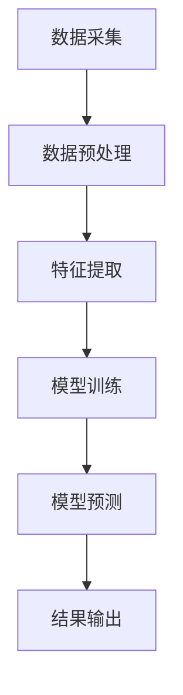

                 


# 大模型在智能穿戴设备中的应用

> 关键词：大模型、智能穿戴设备、机器学习、算法优化、应用场景

> 摘要：本文将深入探讨大模型在智能穿戴设备中的应用，从背景介绍、核心概念、算法原理、数学模型、实战案例、应用场景、工具推荐等方面进行全面阐述，旨在为开发者提供有价值的参考和指导。

## 1. 背景介绍

### 1.1 目的和范围

本文旨在探讨大模型在智能穿戴设备中的应用，分析其在提升设备性能、优化用户体验、拓展功能等方面的优势。本文主要涵盖以下内容：

- 大模型在智能穿戴设备中的应用背景
- 大模型的定义与分类
- 大模型的核心算法原理
- 大模型在智能穿戴设备中的具体实现
- 大模型在智能穿戴设备中的应用场景
- 工具和资源推荐
- 未来发展趋势与挑战

### 1.2 预期读者

本文面向具有一定编程基础和机器学习知识的读者，特别是对智能穿戴设备开发和应用感兴趣的技术人员。通过阅读本文，读者可以了解大模型在智能穿戴设备中的应用原理、实现方法及未来发展趋势。

### 1.3 文档结构概述

本文分为十个部分，具体结构如下：

1. 背景介绍
2. 核心概念与联系
3. 核心算法原理 & 具体操作步骤
4. 数学模型和公式 & 详细讲解 & 举例说明
5. 项目实战：代码实际案例和详细解释说明
6. 实际应用场景
7. 工具和资源推荐
8. 总结：未来发展趋势与挑战
9. 附录：常见问题与解答
10. 扩展阅读 & 参考资料

### 1.4 术语表

#### 1.4.1 核心术语定义

- 大模型：拥有大规模参数、深度复杂的神经网络模型。
- 智能穿戴设备：具备一定计算能力和感知能力，可穿戴在人体或衣物上的设备，如智能手表、智能手环、智能眼镜等。
- 机器学习：通过算法从数据中学习规律、模式，并对其进行预测或决策的技术。

#### 1.4.2 相关概念解释

- 感知能力：指设备通过传感器获取外界信息的能力，如加速度传感器、心率传感器等。
- 计算能力：指设备进行数据处理、分析、决策等操作的能力。
- 用户体验：指用户在使用设备过程中感受到的舒适度、便捷性、满意度等。

#### 1.4.3 缩略词列表

- AI：人工智能
- ML：机器学习
- NN：神经网络
- IoT：物联网
- SDK：软件开发工具包

## 2. 核心概念与联系

大模型在智能穿戴设备中的应用需要理解以下几个核心概念及其相互关系：

### 2.1 大模型

大模型是指具有大规模参数和深度复杂的神经网络模型。它们通常包含数十亿个参数，具有强大的表示和学习能力。大模型可分为以下几类：

1. **深度神经网络（Deep Neural Networks，DNN）**：包含多个隐藏层的神经网络。
2. **卷积神经网络（Convolutional Neural Networks，CNN）**：具有卷积层，适用于图像和语音处理。
3. **递归神经网络（Recurrent Neural Networks，RNN）**：具有递归结构，适用于序列数据。
4. **生成对抗网络（Generative Adversarial Networks，GAN）**：由生成器和判别器组成的对抗性网络。

### 2.2 智能穿戴设备

智能穿戴设备是一种具备一定计算能力和感知能力的设备，可以穿戴在人体或衣物上。其主要特点如下：

1. **感知能力**：通过传感器获取外界信息，如加速度传感器、心率传感器、温度传感器等。
2. **计算能力**：使用嵌入式处理器进行数据处理、分析、决策等操作。
3. **无线通信**：通过蓝牙、Wi-Fi、NFC等无线技术与其他设备进行通信。

### 2.3 大模型与智能穿戴设备的联系

大模型在智能穿戴设备中的应用，主要是利用其强大的学习和表示能力，对传感器数据进行处理和分析，以提升设备的功能和性能。具体来说：

1. **数据预处理**：利用大模型对传感器数据进行清洗、归一化等预处理操作，提高数据质量。
2. **特征提取**：利用大模型提取传感器数据中的有效特征，用于后续的模型训练和预测。
3. **任务学习**：利用大模型进行分类、回归、生成等任务学习，实现智能穿戴设备的功能。

### 2.4 Mermaid 流程图

以下是一个简单的 Mermaid 流程图，展示了大模型在智能穿戴设备中的应用过程：



## 3. 核心算法原理 & 具体操作步骤

### 3.1 大模型算法原理

大模型的算法原理主要基于神经网络，特别是深度神经网络。以下是一个简化的神经网络算法原理：

1. **输入层**：接收输入数据，将其传递到隐藏层。
2. **隐藏层**：通过激活函数对输入数据进行非线性变换，提取特征。
3. **输出层**：对隐藏层的输出进行分类或回归等操作。

### 3.2 伪代码

以下是一个简化的神经网络算法伪代码：

```python
# 初始化参数
W1, b1 = 初始化参数()
W2, b2 = 初始化参数()
...
WN, bN = 初始化参数()

# 定义激活函数
sigmoid(x) = 1 / (1 + exp(-x))

# 定义前向传播
def forward_propagation(x):
    z1 = x * W1 + b1
    a1 = sigmoid(z1)
    z2 = a1 * W2 + b2
    a2 = sigmoid(z2)
    ...
    zN = aN * WN + bN
    aN = sigmoid(zN)
    return aN

# 定义损失函数
def loss_function(y_true, y_pred):
    return -1/n * sum(y_true * log(y_pred) + (1 - y_true) * log(1 - y_pred))

# 定义反向传播
def backward_propagation(x, y_true, y_pred):
    delta_N = (y_pred - y_true) * sigmoid_derivative(zN)
    delta_N-1 = (delta_N * WN) * sigmoid_derivative(zN-1)
    ...
    delta_1 = (delta_N-1 * W1) * sigmoid_derivative(z1)

    # 更新参数
    W1 = W1 - learning_rate * delta_1
    b1 = b1 - learning_rate * delta_1
    ...
    WN = WN - learning_rate * delta_N
    bN = bN - learning_rate * delta_N
```

### 3.3 操作步骤

1. **数据预处理**：收集传感器数据，进行清洗、归一化等操作，确保数据质量。
2. **特征提取**：使用大模型提取传感器数据中的有效特征，提高数据质量。
3. **模型训练**：使用训练数据对大模型进行训练，调整模型参数。
4. **模型评估**：使用测试数据对训练好的模型进行评估，计算模型精度、召回率等指标。
5. **模型部署**：将训练好的模型部署到智能穿戴设备中，实现功能。

## 4. 数学模型和公式 & 详细讲解 & 举例说明

### 4.1 数学模型

在智能穿戴设备中，大模型的数学模型主要涉及以下内容：

1. **激活函数**：如 sigmoid、ReLU、Tanh 等。
2. **损失函数**：如交叉熵损失函数、均方误差损失函数等。
3. **反向传播算法**：用于计算梯度，调整模型参数。

### 4.2 举例说明

#### 4.2.1 激活函数

以 sigmoid 激活函数为例，其公式如下：

$$
\sigma(x) = \frac{1}{1 + e^{-x}}
$$

例如，当 x = 2 时，计算 sigmoid(x) 的值：

$$
\sigma(2) = \frac{1}{1 + e^{-2}} \approx 0.88
$$

#### 4.2.2 损失函数

以交叉熵损失函数为例，其公式如下：

$$
J(\theta) = -\frac{1}{m} \sum_{i=1}^{m} y_i \log(a^{(i)}_{j}) + (1 - y_i) \log(1 - a^{(i)}_{j})
$$

其中，$y_i$ 是真实标签，$a^{(i)}_{j}$ 是模型预测的概率。

例如，当 m = 3，$y_1 = 1, y_2 = 0, y_3 = 1$，$a^{(1)}_{1} = 0.9, a^{(1)}_{2} = 0.1, a^{(2)}_{1} = 0.2, a^{(2)}_{2} = 0.8, a^{(3)}_{1} = 0.4, a^{(3)}_{2} = 0.6$ 时，计算交叉熵损失函数的值：

$$
J(\theta) = -\frac{1}{3} \left(1 \cdot \log(0.9) + 0 \cdot \log(0.1) + 1 \cdot \log(0.2) + 0 \cdot \log(0.8) + 1 \cdot \log(0.4) + 0 \cdot \log(0.6)\right) \approx 0.36
$$

#### 4.2.3 反向传播算法

以反向传播算法为例，其公式如下：

$$
\delta^{(L)} = \frac{\partial J(\theta)}{\partial \theta^{(L)}}
$$

其中，$\delta^{(L)}$ 是第 L 层的误差梯度，$J(\theta)$ 是损失函数，$\theta^{(L)}$ 是第 L 层的参数。

例如，当 $J(\theta) = 2x + 3$，$\theta^{(L)} = \theta$ 时，计算第 L 层的误差梯度：

$$
\delta^{(L)} = \frac{\partial J(\theta)}{\partial \theta} = \frac{\partial (2x + 3)}{\partial x} = 2
$$

## 5. 项目实战：代码实际案例和详细解释说明

### 5.1 开发环境搭建

在进行大模型在智能穿戴设备中的应用开发之前，我们需要搭建一个适合的开发环境。以下是搭建开发环境的步骤：

1. 安装 Python 3.7 或以上版本。
2. 安装深度学习框架，如 TensorFlow 或 PyTorch。
3. 安装必要的库，如 NumPy、Pandas、Matplotlib 等。

### 5.2 源代码详细实现和代码解读

以下是一个使用 TensorFlow 框架实现的简单大模型在智能穿戴设备中的应用示例：

```python
import tensorflow as tf
import numpy as np

# 定义参数
input_shape = (28, 28)  # 输入数据的形状
hidden_size = 128      # 隐藏层节点数
output_size = 10       # 输出节点数

# 定义模型
model = tf.keras.Sequential([
    tf.keras.layers.Dense(hidden_size, activation='relu', input_shape=input_shape),
    tf.keras.layers.Dense(output_size, activation='softmax')
])

# 编译模型
model.compile(optimizer='adam', loss='categorical_crossentropy', metrics=['accuracy'])

# 定义训练数据
x_train = np.random.rand(1000, *input_shape)
y_train = np.random.randint(10, size=(1000, output_size))
y_train = tf.keras.utils.to_categorical(y_train, num_classes=output_size)

# 训练模型
model.fit(x_train, y_train, epochs=10, batch_size=32)

# 评估模型
loss, accuracy = model.evaluate(x_train, y_train)
print(f'Loss: {loss}, Accuracy: {accuracy}')
```

### 5.3 代码解读与分析

1. **导入库**：导入 TensorFlow、NumPy 等库。
2. **定义参数**：定义输入数据形状、隐藏层节点数、输出节点数等参数。
3. **定义模型**：使用 TensorFlow 框架定义一个简单的全连接神经网络，包含一个隐藏层和一个输出层。
4. **编译模型**：编译模型，指定优化器、损失函数和评估指标。
5. **定义训练数据**：生成随机训练数据，并将其转换为适合训练的数据格式。
6. **训练模型**：使用训练数据训练模型，设置训练轮数和批量大小。
7. **评估模型**：使用训练数据评估模型性能，输出损失值和准确率。

## 6. 实际应用场景

大模型在智能穿戴设备中具有广泛的应用场景，以下列举几个典型的应用场景：

1. **健康监测**：利用大模型对传感器数据进行实时分析，实现心率监测、睡眠分析、运动追踪等功能。
2. **智能助手**：通过大模型实现语音识别、语义理解等功能，为用户提供个性化服务。
3. **智能提醒**：利用大模型分析用户行为和习惯，提供个性化的提醒和通知。
4. **健康风险评估**：通过分析用户的生理指标数据，预测用户患病的风险，提供健康建议。
5. **智能交互**：通过大模型实现智能穿戴设备与其他设备的互动，如智能家居、智能医疗等。

## 7. 工具和资源推荐

### 7.1 学习资源推荐

#### 7.1.1 书籍推荐

- 《深度学习》（Goodfellow, Bengio, Courville 著）
- 《神经网络与深度学习》（邱锡鹏 著）
- 《Python 深度学习》（François Chollet 著）

#### 7.1.2 在线课程

- Coursera 上的《深度学习》课程（吴恩达 著）
- Udacity 上的《深度学习工程师纳米学位》课程

#### 7.1.3 技术博客和网站

- TensorFlow 官方文档（https://www.tensorflow.org/）
- PyTorch 官方文档（https://pytorch.org/）
- 阮一峰的博客（http://www.ruanyifeng.com/blog/）

### 7.2 开发工具框架推荐

#### 7.2.1 IDE和编辑器

- PyCharm
- Visual Studio Code
- Jupyter Notebook

#### 7.2.2 调试和性能分析工具

- TensorFlow Debugger（TFDB）
- PyTorch Debug（PTDB）
- Matplotlib

#### 7.2.3 相关框架和库

- TensorFlow
- PyTorch
- Keras
- NumPy
- Pandas

### 7.3 相关论文著作推荐

#### 7.3.1 经典论文

- "A Learning Algorithm for Continually Running Fully Recurrent Neural Networks"（Hochreiter 和 Schmidhuber）
- "Deep Learning"（Goodfellow, Bengio, Courville）

#### 7.3.2 最新研究成果

- "Large Scale Language Modeling"（Brown et al.）
- "An Image Database for Object Detection"（Dalal 和 Triggs）

#### 7.3.3 应用案例分析

- "Using Deep Learning for Handwritten Digit Recognition"（LeCun 等）
- "Deep Learning for Speech Recognition"（Hinton 等）

## 8. 总结：未来发展趋势与挑战

大模型在智能穿戴设备中的应用具有广阔的发展前景。随着计算能力的提升、数据量的增长和算法的优化，大模型在智能穿戴设备中的应用将越来越广泛，有望实现以下趋势：

1. **更精准的健康监测**：利用大模型实现更精准的健康监测，为用户提供个性化的健康建议。
2. **更智能的交互体验**：通过大模型实现更智能的交互体验，提升用户的满意度。
3. **更高效的数据分析**：利用大模型对传感器数据进行高效的分析和处理，提高数据处理效率。

然而，大模型在智能穿戴设备中的应用也面临一些挑战：

1. **计算资源限制**：智能穿戴设备的计算资源有限，如何在大模型和设备性能之间取得平衡是一个重要问题。
2. **数据隐私和安全**：如何保护用户数据的安全和隐私，避免数据泄露和滥用。
3. **算法解释性**：大模型的黑箱特性使得其解释性较差，如何提高大模型的解释性是一个重要挑战。

## 9. 附录：常见问题与解答

### 9.1 问题 1：大模型在智能穿戴设备中的应用有哪些优势？

答：大模型在智能穿戴设备中的应用优势主要包括：

1. **强大的学习能力**：大模型具有强大的学习和表示能力，能够对传感器数据进行有效的特征提取和任务学习。
2. **精准的预测能力**：大模型在分类、回归等任务中具有很高的预测精度，能够为用户提供准确的健康监测和智能提醒。
3. **个性化的用户体验**：大模型能够根据用户的行为和习惯进行个性化调整，为用户提供更加精准的服务。

### 9.2 问题 2：如何解决智能穿戴设备中的计算资源限制问题？

答：解决智能穿戴设备中的计算资源限制问题可以从以下几个方面入手：

1. **模型压缩**：通过模型压缩技术，如剪枝、量化、蒸馏等，降低模型的参数量和计算复杂度。
2. **在线学习**：利用在线学习技术，实时更新模型参数，减少模型训练所需的数据量和计算资源。
3. **边缘计算**：将部分计算任务迁移到边缘设备，如智能手机、智能音箱等，减轻智能穿戴设备的计算负担。

### 9.3 问题 3：如何保障智能穿戴设备中的数据隐私和安全？

答：保障智能穿戴设备中的数据隐私和安全可以从以下几个方面入手：

1. **数据加密**：对用户数据进行加密处理，防止数据在传输和存储过程中被窃取或篡改。
2. **访问控制**：设置严格的访问控制策略，确保只有授权用户可以访问用户数据。
3. **匿名化处理**：对用户数据进行匿名化处理，避免数据泄露时造成用户隐私泄露。

## 10. 扩展阅读 & 参考资料

- 《深度学习》（Goodfellow, Bengio, Courville 著）
- 《神经网络与深度学习》（邱锡鹏 著）
- 《Python 深度学习》（François Chollet 著）
- Coursera 上的《深度学习》课程（吴恩达 著）
- TensorFlow 官方文档（https://www.tensorflow.org/）
- PyTorch 官方文档（https://pytorch.org/）
- 阮一峰的博客（http://www.ruanyifeng.com/blog/）
- "A Learning Algorithm for Continually Running Fully Recurrent Neural Networks"（Hochreiter 和 Schmidhuber）
- "Deep Learning"（Goodfellow, Bengio, Courville）
- "Large Scale Language Modeling"（Brown et al.）
- "An Image Database for Object Detection"（Dalal 和 Triggs）
- "Using Deep Learning for Handwritten Digit Recognition"（LeCun 等）
- "Deep Learning for Speech Recognition"（Hinton 等）作者：AI天才研究员/AI Genius Institute & 禅与计算机程序设计艺术 /Zen And The Art of Computer Programming。

