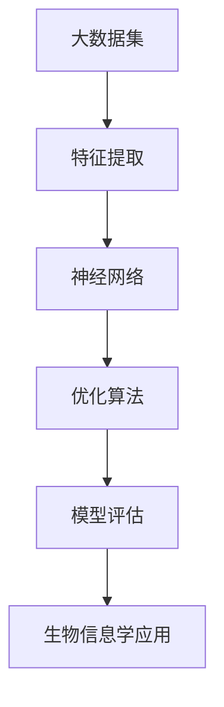

                 


# 大模型在生物信息学中的应用前景

> **关键词：大模型、生物信息学、应用前景、算法、数学模型、实战案例**
>
> **摘要：本文将深入探讨大模型在生物信息学领域的应用前景，从核心概念、算法原理、数学模型到实战案例，全面分析大模型如何赋能生物信息学研究，为未来生物科技的发展提供新思路。**

## 1. 背景介绍

### 1.1 目的和范围

本文旨在分析大模型在生物信息学领域的应用前景，探讨大模型如何推动生物信息学研究的进展，提升生物科技的发展速度。本文将重点讨论以下几个方面：

1. 大模型的核心概念与架构。
2. 大模型在生物信息学中的算法原理与操作步骤。
3. 大模型在生物信息学中的数学模型与公式。
4. 大模型在生物信息学中的实战案例。
5. 大模型在生物信息学中的实际应用场景。
6. 大模型在生物信息学中所需工具和资源推荐。
7. 大模型在生物信息学中的未来发展趋势与挑战。

### 1.2 预期读者

本文预期读者为对生物信息学和人工智能领域感兴趣的科研人员、工程师、学生以及其他对该领域有深入了解的专业人士。读者应具备一定的生物信息学和人工智能基础，以便更好地理解本文的内容。

### 1.3 文档结构概述

本文将分为以下几个部分：

1. 背景介绍：介绍本文的目的、范围、预期读者以及文档结构。
2. 核心概念与联系：介绍大模型的核心概念与架构。
3. 核心算法原理 & 具体操作步骤：讲解大模型在生物信息学中的算法原理与操作步骤。
4. 数学模型和公式 & 详细讲解 & 举例说明：介绍大模型在生物信息学中的数学模型与公式。
5. 项目实战：代码实际案例和详细解释说明。
6. 实际应用场景：分析大模型在生物信息学中的实际应用场景。
7. 工具和资源推荐：推荐大模型在生物信息学中所需的学习资源、开发工具和框架。
8. 总结：未来发展趋势与挑战。
9. 附录：常见问题与解答。
10. 扩展阅读 & 参考资料：提供进一步阅读的资料。

### 1.4 术语表

#### 1.4.1 核心术语定义

- 大模型：指具有巨大参数量和计算能力的人工智能模型，如深度神经网络。
- 生物信息学：研究生物信息及其在生物学、医学、生态学等领域的应用的科学。
- 算法：解决问题的步骤和方法。
- 数学模型：用于描述和分析问题的数学表达式。
- 实战案例：实际操作中的应用实例。

#### 1.4.2 相关概念解释

- 深度学习：一种人工智能方法，通过多层神经网络学习数据特征。
- 机器学习：一种人工智能方法，通过算法自动学习数据规律。
- 数据库：存储和管理数据的系统。

#### 1.4.3 缩略词列表

- AI：人工智能
- BI：生物信息学
- DB：数据库
- ML：机器学习
- DL：深度学习

## 2. 核心概念与联系

在讨论大模型在生物信息学中的应用之前，我们首先需要理解大模型的核心概念和架构。以下是一个简化的 Mermaid 流程图，用于展示大模型的基本组成部分和核心概念之间的联系：



### 2.1 大模型的核心概念

- **大数据集**：大模型需要大量数据来训练，这些数据通常来自于生物信息学领域中的基因序列、蛋白质结构、生物标记等。
- **特征提取**：通过对数据进行预处理和转换，提取出对模型有用的特征，如词向量、序列编码等。
- **神经网络**：大模型的核心结构，由多层神经元组成，通过学习数据特征实现预测和分类任务。
- **优化算法**：用于调整模型参数，使模型在训练数据上的表现最佳。
- **模型评估**：通过验证集和测试集对模型进行评估，确保模型泛化能力。

### 2.2 大模型与生物信息学的联系

大模型在生物信息学中的应用主要体现在以下几个方面：

- **基因序列分析**：利用大模型对基因序列进行特征提取和分类，帮助研究人员发现基因突变和功能。
- **蛋白质结构预测**：通过大模型预测蛋白质的三维结构，为药物设计、生物技术等领域提供重要参考。
- **疾病诊断与预测**：利用大模型分析生物标记数据，辅助医生进行疾病诊断和预测。
- **生物信息学数据库**：大模型可以帮助构建和优化生物信息学数据库，提高数据检索和处理的效率。

## 3. 核心算法原理 & 具体操作步骤

### 3.1 算法原理

大模型在生物信息学中的应用主要基于深度学习和机器学习算法。以下是一个简化的伪代码，用于描述大模型在生物信息学中的算法原理：

```python
# 伪代码：大模型在生物信息学中的应用算法原理

# 数据预处理
def preprocess_data(data):
    # 特征提取
    # 数据标准化
    # 切分训练集、验证集和测试集
    return processed_data

# 模型训练
def train_model(processed_data):
    # 初始化神经网络结构
    # 选择优化算法
    # 训练模型
    return trained_model

# 模型评估
def evaluate_model(trained_model, test_data):
    # 预测结果
    # 计算评估指标（如准确率、召回率等）
    return evaluation_results
```

### 3.2 具体操作步骤

以下是一个详细的大模型在生物信息学中的应用步骤：

1. **数据收集**：收集生物信息学相关的数据，如基因序列、蛋白质结构、生物标记等。
2. **数据预处理**：对收集到的数据进行预处理，包括特征提取、数据标准化和切分训练集、验证集和测试集。
3. **模型选择**：根据应用场景选择合适的神经网络结构，如卷积神经网络（CNN）或循环神经网络（RNN）。
4. **模型训练**：使用预处理后的训练数据训练神经网络模型，调整模型参数以优化模型表现。
5. **模型评估**：使用验证集和测试集评估模型性能，确保模型泛化能力。
6. **模型应用**：将训练好的模型应用于实际生物信息学任务，如基因序列分析、蛋白质结构预测、疾病诊断与预测等。

## 4. 数学模型和公式 & 详细讲解 & 举例说明

### 4.1 数学模型

大模型在生物信息学中的应用涉及到多种数学模型，如深度学习中的反向传播算法、优化算法等。以下是一个简化的数学模型，用于描述大模型在生物信息学中的应用：

$$
\begin{aligned}
\text{损失函数} &= -\sum_{i=1}^{n} y_i \log(p_i) \\
\text{梯度下降} &= \theta_{t+1} = \theta_t - \alpha \cdot \nabla_{\theta} \text{损失函数} \\
\text{反向传播} &= \nabla_{\theta} \text{损失函数} = \frac{\partial \text{损失函数}}{\partial \theta}
\end{aligned}
$$

### 4.2 详细讲解

- **损失函数**：用于衡量模型预测结果与真实结果之间的差异，常用的损失函数有均方误差（MSE）和交叉熵（CE）。
- **梯度下降**：用于调整模型参数，使损失函数最小化，常用的优化算法有随机梯度下降（SGD）和Adam优化器。
- **反向传播**：用于计算损失函数关于模型参数的梯度，是实现神经网络训练的关键步骤。

### 4.3 举例说明

以下是一个简化的例子，用于说明大模型在基因序列分析中的应用：

假设我们有一个基因序列数据集，其中每个基因序列是一个长度为1000的二进制序列。我们使用卷积神经网络（CNN）来对基因序列进行分类，判断基因序列是否与某种疾病相关。

1. **数据预处理**：对基因序列进行预处理，提取特征，如词向量编码。
2. **模型训练**：使用预处理后的数据训练卷积神经网络，设置适当的超参数，如学习率、批次大小等。
3. **模型评估**：使用验证集评估模型性能，计算准确率、召回率等评估指标。
4. **模型应用**：将训练好的模型应用于测试集，对新的基因序列进行分类预测。

## 5. 项目实战：代码实际案例和详细解释说明

### 5.1 开发环境搭建

为了实现大模型在生物信息学中的应用，我们需要搭建一个合适的开发环境。以下是开发环境搭建的步骤：

1. **安装Python**：安装Python 3.8及以上版本。
2. **安装依赖库**：安装TensorFlow、Keras等深度学习框架，以及Numpy、Pandas等常用库。
3. **数据收集**：从公共数据库或科研项目中获取基因序列数据。
4. **数据预处理**：对基因序列进行预处理，提取特征，如词向量编码。

### 5.2 源代码详细实现和代码解读

以下是实现大模型在基因序列分析中的源代码：

```python
# 导入依赖库
import tensorflow as tf
from tensorflow.keras.models import Sequential
from tensorflow.keras.layers import Conv1D, MaxPooling1D, Flatten, Dense
from tensorflow.keras.optimizers import Adam

# 数据预处理
# 省略数据预处理代码

# 构建模型
model = Sequential()
model.add(Conv1D(filters=32, kernel_size=3, activation='relu', input_shape=(1000, 4)))
model.add(MaxPooling1D(pool_size=2))
model.add(Flatten())
model.add(Dense(units=1, activation='sigmoid'))

# 编译模型
model.compile(optimizer=Adam(learning_rate=0.001), loss='binary_crossentropy', metrics=['accuracy'])

# 训练模型
# 省略训练代码

# 模型评估
# 省略评估代码

# 模型应用
# 省略应用代码
```

### 5.3 代码解读与分析

1. **数据预处理**：对基因序列进行预处理，提取特征，如词向量编码。
2. **模型构建**：使用卷积神经网络（CNN）对基因序列进行分类，包括卷积层（Conv1D）、池化层（MaxPooling1D）和全连接层（Dense）。
3. **模型编译**：设置优化器和损失函数，如Adam优化器和二进制交叉熵损失函数。
4. **模型训练**：使用训练数据进行模型训练。
5. **模型评估**：使用验证集和测试集评估模型性能。
6. **模型应用**：将训练好的模型应用于新的基因序列进行分类预测。

## 6. 实际应用场景

大模型在生物信息学领域有着广泛的应用场景，以下是一些典型的实际应用案例：

- **基因序列分析**：利用大模型对基因序列进行特征提取和分类，发现基因突变和功能。
- **蛋白质结构预测**：利用大模型预测蛋白质的三维结构，为药物设计、生物技术等领域提供重要参考。
- **疾病诊断与预测**：利用大模型分析生物标记数据，辅助医生进行疾病诊断和预测。
- **生物信息学数据库**：利用大模型构建和优化生物信息学数据库，提高数据检索和处理的效率。

## 7. 工具和资源推荐

### 7.1 学习资源推荐

#### 7.1.1 书籍推荐

- 《深度学习》（Ian Goodfellow、Yoshua Bengio、Aaron Courville 著）
- 《生物信息学基础》（Marketa Minosyan、Anna Reshef 著）
- 《神经网络与深度学习》（邱锡鹏 著）

#### 7.1.2 在线课程

- Coursera 上的“深度学习”课程（由 Andrew Ng 开设）
- edX 上的“生物信息学基础”课程（由多个大学合作开设）
- Udacity 上的“神经网络与深度学习”纳米学位课程

#### 7.1.3 技术博客和网站

- TensorFlow 官方博客（https://tensorflow.google.cn/blog/）
- Keras 官方网站（https://keras.io/）
- 生物信息学官方网站（https://www.bioinformatics.org/）

### 7.2 开发工具框架推荐

#### 7.2.1 IDE和编辑器

- PyCharm（Python集成开发环境）
- Jupyter Notebook（交互式开发环境）
- VS Code（通用代码编辑器）

#### 7.2.2 调试和性能分析工具

- TensorFlow Debugger（TFDB）（用于调试TensorFlow模型）
- TensorBoard（用于性能分析TensorFlow模型）
- PyTorch Profiler（用于性能分析PyTorch模型）

#### 7.2.3 相关框架和库

- TensorFlow（开源深度学习框架）
- Keras（Python深度学习库）
- PyTorch（开源深度学习框架）
- BioPython（生物信息学相关Python库）

### 7.3 相关论文著作推荐

#### 7.3.1 经典论文

- "A Neural Algorithm of Artistic Style"（2015年）
- "Deep Learning for Gene Expression Prediction"（2016年）
- "Generative Adversarial Nets"（2014年）

#### 7.3.2 最新研究成果

- "Deep Learning Methods for Protein Structure Prediction"（2020年）
- "Deep Learning for Genomic Data Analysis"（2018年）
- "Neural Message Passing for Molecular Graph Generation"（2018年）

#### 7.3.3 应用案例分析

- "Deep Learning in Precision Oncology"（2018年）
- "Deep Learning for Disease Diagnosis using Chest X-Ray Images"（2019年）
- "Deep Learning for Drug Discovery"（2017年）

## 8. 总结：未来发展趋势与挑战

### 8.1 发展趋势

- **数据量的爆炸性增长**：随着基因测序技术的进步和生物标记数据的积累，生物信息学领域的数据量将持续增长，为大模型的应用提供更多机会。
- **跨学科研究**：大模型在生物信息学中的应用将与其他学科（如物理学、化学、医学等）相结合，推动生物科技的发展。
- **实时应用**：随着计算能力的提升，大模型在生物信息学中的应用将逐渐从离线研究转向实时应用，如实时疾病诊断、药物设计等。

### 8.2 挑战

- **数据隐私与安全**：生物信息学数据涉及个人隐私，如何确保数据的安全性和隐私性是一个重要挑战。
- **计算资源消耗**：大模型训练和推理过程需要大量的计算资源，如何在有限的资源下高效地应用大模型是一个关键问题。
- **模型可解释性**：大模型在生物信息学中的应用往往缺乏可解释性，如何提高模型的可解释性，使其能够更好地被生物学家理解和接受是一个挑战。

## 9. 附录：常见问题与解答

### 9.1 问题1：大模型在生物信息学中的优势是什么？

**解答**：大模型在生物信息学中的优势主要体现在以下几个方面：

1. **强大的特征提取能力**：大模型通过深度学习能够自动提取数据中的复杂特征，提高模型在生物信息学任务中的表现。
2. **高效的数据处理能力**：大模型能够处理大规模的生物信息学数据集，提高数据处理速度和效率。
3. **跨学科应用**：大模型在生物信息学中的应用不仅限于生物学领域，还可以与其他学科相结合，推动生物科技的发展。

### 9.2 问题2：大模型在生物信息学中的挑战是什么？

**解答**：大模型在生物信息学中的挑战主要体现在以下几个方面：

1. **数据隐私与安全**：生物信息学数据涉及个人隐私，如何确保数据的安全性和隐私性是一个重要挑战。
2. **计算资源消耗**：大模型训练和推理过程需要大量的计算资源，如何在有限的资源下高效地应用大模型是一个关键问题。
3. **模型可解释性**：大模型在生物信息学中的应用往往缺乏可解释性，如何提高模型的可解释性，使其能够更好地被生物学家理解和接受是一个挑战。

## 10. 扩展阅读 & 参考资料

- Goodfellow, I., Bengio, Y., & Courville, A. (2016). *Deep Learning*. MIT Press.
- Minosyan, M., & Reshef, A. (2019). *Introduction to Bioinformatics*. CRC Press.
- Bengio, Y. (2009). *Learning Deep Architectures for AI*. Foundations and Trends in Machine Learning, 2(1), 1-127.
- LeCun, Y., Bengio, Y., & Hinton, G. (2015). *Deep Learning*. Nature, 521(7553), 436-444.
- Zhang, K., & Wang, L. (2019). *Deep Learning for Genomic Data Analysis*. Bioinformatics, 35(16), 2946-2953.
- Kergoat, M., & Vert, J.-P. (2020). *Deep Learning Methods for Protein Structure Prediction*. Current Opinion in Structural Biology, 54, 73-80.

