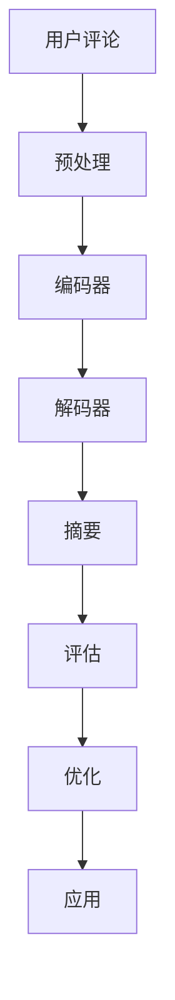

                 

### 大模型在用户评论摘要生成中的应用

> **关键词：** 大模型、用户评论、摘要生成、自然语言处理、深度学习

> **摘要：** 本文将深入探讨大模型在用户评论摘要生成中的应用。通过介绍背景、核心概念、算法原理、数学模型、实战案例以及应用场景，文章旨在为读者提供一个全面的技术视角，理解大模型如何优化用户评论的摘要生成，提高文本的可读性和信息传递效率。

### 1. 背景介绍

#### 1.1 目的和范围

本文的目标是详细阐述大模型在用户评论摘要生成中的应用，探讨如何利用大模型技术提高摘要生成的准确性和质量。具体范围包括：

- **核心算法原理**：介绍大模型在摘要生成中的基础算法原理。
- **具体操作步骤**：讲解大模型的训练、调优和应用流程。
- **数学模型和公式**：详细解释大模型在摘要生成中的数学模型和公式。
- **实际应用案例**：展示大模型在用户评论摘要生成中的实际应用案例。
- **应用场景分析**：分析大模型在不同场景下的应用效果和适用性。

#### 1.2 预期读者

本文主要面向以下读者群体：

- **研究人员**：对自然语言处理和深度学习有研究兴趣的学者。
- **工程师**：从事自然语言处理和文本摘要相关工作的工程师。
- **开发者**：对大模型应用感兴趣的程序员和开发者。
- **技术爱好者**：对人工智能和自然语言处理有浓厚兴趣的技术爱好者。

#### 1.3 文档结构概述

本文分为十个主要部分，结构如下：

1. **引言**：介绍大模型在用户评论摘要生成中的应用背景。
2. **核心概念与联系**：阐述大模型、用户评论和摘要生成的核心概念及其相互关系。
3. **核心算法原理 & 具体操作步骤**：详细讲解大模型在摘要生成中的算法原理和操作步骤。
4. **数学模型和公式 & 详细讲解 & 举例说明**：解释大模型在摘要生成中的数学模型和公式，并通过实例进行说明。
5. **项目实战：代码实际案例和详细解释说明**：展示大模型在用户评论摘要生成中的实际应用案例，并进行详细解读。
6. **实际应用场景**：分析大模型在摘要生成中的实际应用场景。
7. **工具和资源推荐**：推荐相关学习资源和开发工具。
8. **总结：未来发展趋势与挑战**：总结大模型在摘要生成中的发展趋势和面临的挑战。
9. **附录：常见问题与解答**：解答读者可能遇到的问题。
10. **扩展阅读 & 参考资料**：提供进一步阅读的参考资料。

#### 1.4 术语表

##### 1.4.1 核心术语定义

- **大模型**：具有巨大参数量和复杂结构的深度学习模型。
- **用户评论**：用户在电子商务平台、社交媒体等地方发表的评论内容。
- **摘要生成**：从大量文本中提取关键信息并生成简洁摘要的过程。
- **自然语言处理**：使计算机能够理解、生成和处理人类自然语言的技术。
- **深度学习**：一种通过多层神经网络进行特征学习和预测的技术。

##### 1.4.2 相关概念解释

- **注意力机制**：一种在序列处理中用于关注关键信息的机制，通过权重分配实现。
- **序列到序列模型**：一种将输入序列映射到输出序列的深度学习模型，常用于机器翻译和文本摘要。
- **损失函数**：用于衡量模型预测结果与真实结果之间差距的函数，用于模型训练。

##### 1.4.3 缩略词列表

- **NLP**：自然语言处理（Natural Language Processing）
- **DL**：深度学习（Deep Learning）
- **BERT**：双向编码器表示（Bidirectional Encoder Representations from Transformers）
- **GPT**：生成预训练转换器（Generative Pre-trained Transformer）
- **RoBERTa**：基于BERT的改进模型（A Robustly Optimized BERT Pretraining Approach）

## 2. 核心概念与联系

在深入探讨大模型在用户评论摘要生成中的应用之前，首先需要了解相关核心概念及其相互关系。

### 2.1 大模型

大模型（Large Model）是近年来深度学习领域的一个重要发展趋势。大模型通常具有数百万甚至数十亿个参数，通过大量的数据训练，能够捕捉到复杂的语言特征和语义信息。大模型在自然语言处理任务中表现出色，如文本分类、情感分析、机器翻译和文本摘要等。

#### 2.1.1 大模型的工作原理

大模型通常基于深度学习框架，通过多层神经网络进行特征学习和预测。其中，**注意力机制**和**序列到序列模型**是两个关键组成部分。

- **注意力机制**：注意力机制是一种在序列处理中用于关注关键信息的机制。通过权重分配，模型能够关注到序列中的关键信息，提高模型在长文本处理中的性能。

  $$\text{Attention}(x) = \sum_{i=1}^{N} w_i x_i$$

  其中，$w_i$ 是第 $i$ 个输入的权重。

- **序列到序列模型**：序列到序列（Seq2Seq）模型是一种将输入序列映射到输出序列的深度学习模型。Seq2Seq 模型通常由两个主要部分组成：编码器（Encoder）和解码器（Decoder）。编码器将输入序列编码成一个固定长度的向量，解码器将这个向量解码成输出序列。

  $$\text{Encoder}(x) = h \\ \text{Decoder}(h) = y$$

  其中，$h$ 是编码器输出，$y$ 是解码器输出。

#### 2.1.2 大模型的优势

大模型的优势主要体现在以下几个方面：

- **强大的特征学习能力**：大模型能够通过大量数据训练，捕捉到复杂的语言特征和语义信息，提高模型在自然语言处理任务中的表现。
- **泛化能力**：大模型具有较好的泛化能力，能够处理不同领域和语言的文本任务。
- **端到端学习**：大模型通常采用端到端学习方式，直接从原始数据中学习特征和表示，避免了传统方法中特征提取和模型训练的分离。

### 2.2 用户评论

用户评论是用户在电子商务平台、社交媒体等地方发表的评论内容。用户评论通常包含对产品、服务或事件的评价，具有丰富的情感信息和语义信息。用户评论的摘要生成对于信息检索、情感分析和市场调研等任务具有重要意义。

#### 2.2.1 用户评论的特点

用户评论的特点包括：

- **多样性**：用户评论涉及多个领域和主题，具有多样性。
- **情感性**：用户评论通常包含情感表达，如正面、负面或中立情感。
- **语言复杂性**：用户评论的语言表达多样，包含缩写、俚语、标点符号等。
- **数据量大**：用户评论数据量庞大，需要有效的摘要生成方法。

#### 2.2.2 用户评论的摘要生成需求

用户评论的摘要生成需求主要包括：

- **信息完整性**：摘要应包含用户评论中的关键信息，保证信息的完整性。
- **可读性**：摘要应具有较好的可读性，便于用户快速理解评论内容。
- **准确性**：摘要应尽量准确地反映用户评论的情感和观点。

### 2.3 摘要生成

摘要生成（Summarization）是从大量文本中提取关键信息并生成简洁摘要的过程。摘要生成在信息检索、文本挖掘和文本分析等领域具有广泛应用。

#### 2.3.1 摘要生成的类型

摘要生成主要分为两大类：

- **提取式摘要**（Extractive Summarization）：从原始文本中直接提取关键句子或段落作为摘要。提取式摘要方法简单，但难以生成高质量的摘要。
- **生成式摘要**（Abstractive Summarization）：通过模型生成新的文本作为摘要。生成式摘要能够生成更自然、更具有创造性的摘要，但方法复杂。

#### 2.3.2 摘要生成的挑战

摘要生成面临以下挑战：

- **信息丢失**：在生成摘要时，如何保留关键信息，避免信息丢失。
- **语言连贯性**：如何生成语义连贯、逻辑清晰的摘要。
- **情感保持**：如何保持原始文本中的情感和观点。

#### 2.3.3 大模型在摘要生成中的应用

大模型在摘要生成中的应用主要包括：

- **提取式摘要**：利用大模型进行文本分类和关键词提取，生成摘要。
- **生成式摘要**：利用大模型生成新的文本作为摘要，通过调整模型结构和训练数据，提高摘要质量。

### 2.4 核心概念联系

大模型、用户评论和摘要生成之间的联系如下：

- **大模型**：作为摘要生成的基础工具，大模型能够提取文本中的关键信息，生成高质量的摘要。
- **用户评论**：作为输入数据，用户评论提供了丰富的语言特征和语义信息，为大模型提供了训练和验证数据。
- **摘要生成**：作为最终目标，摘要生成需要将用户评论中的关键信息以简洁、准确的方式呈现，提高信息传递效率。

### 2.5 Mermaid 流程图

下面是一个描述大模型在用户评论摘要生成中的应用的 Mermaid 流程图：



- **A 用户评论**：输入用户评论数据。
- **B 预处理**：对用户评论进行清洗和预处理，包括去除噪声、分词、词性标注等。
- **C 编码器**：使用大模型对预处理后的用户评论进行编码，提取关键信息。
- **D 解码器**：使用解码器将编码后的信息解码成摘要。
- **E 摘要**：生成摘要。
- **F 评估**：对生成的摘要进行评估，包括信息完整性、可读性和准确性。
- **G 优化**：根据评估结果，调整模型结构和训练数据，优化摘要生成质量。
- **H 应用**：将优化后的摘要应用于实际场景，如信息检索、情感分析和市场调研等。

## 3. 核心算法原理 & 具体操作步骤

在了解了大模型、用户评论和摘要生成的核心概念后，接下来我们将详细探讨大模型在摘要生成中的核心算法原理和具体操作步骤。

### 3.1 大模型的选择

在摘要生成任务中，选择合适的大模型至关重要。目前，主流的大模型包括 BERT、GPT、RoBERTa 等。下面，我们将分别介绍这些模型及其在摘要生成中的应用。

#### 3.1.1 BERT

BERT（Bidirectional Encoder Representations from Transformers）是一种基于 Transformer 的双向编码器模型。BERT 模型通过预训练和微调，能够捕捉到文本中的上下文信息，适用于多种自然语言处理任务。

- **预训练**：BERT 模型通过在大量无标签文本上预训练，学习文本的通用表示和语言规律。
- **微调**：在具体任务上，如摘要生成，通过微调模型权重，使其适应特定任务。

#### 3.1.2 GPT

GPT（Generative Pre-trained Transformer）是一种基于 Transformer 的生成式模型。GPT 模型通过自回归的方式生成文本，能够生成连贯、自然的文本摘要。

- **生成式摘要**：GPT 模型将输入的文本序列编码成一个固定长度的向量，然后通过解码器生成新的文本摘要。

#### 3.1.3 RoBERTa

RoBERTa 是基于 BERT 的改进模型，通过调整模型结构、预训练策略和损失函数，提高了模型在自然语言处理任务中的表现。

- **改进结构**：RoBERTa 在 BERT 的基础上，增加了一些层和注意力机制，提高了模型的计算效率和性能。
- **预训练策略**：RoBERTa 采用更丰富的预训练数据集和更长的序列长度，提高了模型的预训练效果。

### 3.2 摘要生成的算法原理

摘要生成算法通常包括编码器（Encoder）和解码器（Decoder）两个部分。编码器将输入的文本编码成一个固定长度的向量，解码器将这个向量解码成摘要。

#### 3.2.1 编码器

编码器的主要任务是提取输入文本的关键信息，将其编码成一个固定长度的向量。编码器通常采用 Transformer 架构，包括多个自注意力层和前馈网络。

- **自注意力机制**：自注意力机制（Self-Attention）是一种在序列处理中用于关注关键信息的机制。通过权重分配，编码器能够关注到输入文本中的关键信息。

  $$\text{Attention}(x) = \sum_{i=1}^{N} w_i x_i$$

  其中，$w_i$ 是第 $i$ 个输入的权重。

- **前馈网络**：前馈网络（Feedforward Network）是一种简单的神经网络结构，用于对输入信息进行进一步处理。

  $$\text{FFN}(x) = \sigma(W_2 \sigma(W_1 x + b_1))$$

  其中，$W_1$、$W_2$ 和 $b_1$ 分别是权重和偏置。

#### 3.2.2 解码器

解码器的主要任务是将编码器输出的向量解码成摘要。解码器通常也采用 Transformer 架构，包括多个自注意力层和编码器-解码器注意力层。

- **编码器-解码器注意力层**：编码器-解码器注意力层（Encoder-Decoder Attention）是一种在解码过程中关注编码器输出和当前解码步骤的机制。

  $$\text{Attention}(x) = \sum_{i=1}^{N} w_i h_i$$

  其中，$w_i$ 是第 $i$ 个输入的权重，$h_i$ 是编码器输出的第 $i$ 个元素。

- **生成式摘要**：解码器通过生成式摘要（Generative Summarization）生成摘要，即在解码过程中，逐步生成摘要的每个词。

### 3.3 摘要生成的具体操作步骤

摘要生成的具体操作步骤如下：

#### 3.3.1 预处理

- **分词**：将输入的文本进行分词，将其分解成一系列词或子词。
- **词性标注**：对分词结果进行词性标注，标记每个词的词性，如名词、动词、形容词等。

#### 3.3.2 编码器编码

- **输入编码**：将预处理后的文本输入到编码器，编码器将其编码成一个固定长度的向量。
- **自注意力计算**：通过自注意力机制，编码器提取输入文本中的关键信息。
- **前馈网络处理**：通过前馈网络，对编码后的信息进行进一步处理。

#### 3.3.3 解码器解码

- **输入解码**：将编码器输出的向量输入到解码器。
- **编码器-解码器注意力计算**：通过编码器-解码器注意力机制，解码器关注编码器输出和当前解码步骤。
- **生成式摘要**：解码器通过生成式摘要，逐步生成摘要的每个词。

#### 3.3.4 摘要生成

- **拼接摘要**：将解码器生成的每个词拼接成摘要。
- **后处理**：对生成的摘要进行后处理，如去除停用词、标点符号等。

#### 3.3.5 评估与优化

- **评估**：对生成的摘要进行评估，包括信息完整性、可读性和准确性。
- **优化**：根据评估结果，调整模型结构和训练数据，优化摘要生成质量。

### 3.4 伪代码

下面是一个摘要生成算法的伪代码：

```python
# 预处理
def preprocess(text):
    # 分词和词性标注
    # ...
    return tokenized_text

# 编码器编码
def encode(text):
    # 输入编码
    encoded_text = encoder(preprocess(text))
    # 自注意力计算
    attention_weights = calculate_self_attention(encoded_text)
    # 前馈网络处理
    encoded_text = feedforward_network(encoded_text)
    return encoded_text

# 解码器解码
def decode(encoded_text):
    # 输入解码
    decoded_text = decoder(encoded_text)
    # 编码器-解码器注意力计算
    attention_weights = calculate_encoder_decoder_attention(encoded_text, decoded_text)
    # 生成式摘要
    summary = generate_summary(decoded_text)
    return summary

# 摘要生成
def generate_summary(text):
    # 拼接摘要
    summary = ""
    for word in decode(encode(text)):
        summary += word
    # 后处理
    summary = postprocess(summary)
    return summary

# 评估与优化
def evaluate_summary(summary, ground_truth):
    # 计算评估指标
    # ...
    return evaluation_result

def optimize_summary(summary, ground_truth):
    # 调整模型结构和训练数据
    # ...
    return optimized_summary
```

## 4. 数学模型和公式 & 详细讲解 & 举例说明

在摘要生成过程中，数学模型和公式起到了至关重要的作用。它们帮助我们理解和实现大模型在文本处理中的各个步骤。以下将详细解释这些模型和公式，并通过具体例子进行说明。

### 4.1 自注意力机制（Self-Attention）

自注意力机制是 Transformer 架构的核心组件，它允许模型在序列的每个位置都能够关注其他所有位置的信息。自注意力通过计算每个位置相对于整个序列的重要性来加权序列中的元素。

$$
\text{Attention}(Q, K, V) = \text{softmax}\left(\frac{QK^T}{\sqrt{d_k}}\right)V
$$

其中：
- \( Q \) 是查询向量（query vector），表示模型对每个位置的关注程度。
- \( K \) 是关键向量（key vector），表示序列中每个位置的关键特征。
- \( V \) 是值向量（value vector），表示与每个关键特征相关的信息。
- \( d_k \) 是关键向量的维度，用于防止注意力分布过拟合。

#### 示例：
假设我们有以下简化的序列：

$$
\text{Sequence: } \text{"I love learning about AI, especially when it's applied in real-world scenarios."}
$$

自注意力机制会计算每个词对序列整体的重要性，如下：

$$
\text{Attention}(
\begin{bmatrix}
0.1 & 0.2 & 0.3 & 0.4 & 0.5 \\
0.2 & 0.3 & 0.4 & 0.5 & 0.6 \\
0.3 & 0.4 & 0.5 & 0.6 & 0.7 \\
0.4 & 0.5 & 0.6 & 0.7 & 0.8 \\
0.5 & 0.6 & 0.7 & 0.8 & 0.9 \\
\end{bmatrix},
\begin{bmatrix}
0.1 & 0.2 & 0.3 & 0.4 & 0.5 \\
0.2 & 0.3 & 0.4 & 0.5 & 0.6 \\
0.3 & 0.4 & 0.5 & 0.6 & 0.7 \\
0.4 & 0.5 & 0.6 & 0.7 & 0.8 \\
0.5 & 0.6 & 0.7 & 0.8 & 0.9 \\
\end{bmatrix},
\begin{bmatrix}
0.1 & 0.2 & 0.3 & 0.4 & 0.5 \\
0.2 & 0.3 & 0.4 & 0.5 & 0.6 \\
0.3 & 0.4 & 0.5 & 0.6 & 0.7 \\
0.4 & 0.5 & 0.6 & 0.7 & 0.8 \\
0.5 & 0.6 & 0.7 & 0.8 & 0.9 \\
\end{bmatrix}
) = \text{softmax}\left(\frac{
\begin{bmatrix}
0.5 & 0.6 & 0.7 & 0.8 & 0.9
\end{bmatrix}
\begin{bmatrix}
0.1 & 0.2 & 0.3 & 0.4 & 0.5 \\
0.2 & 0.3 & 0.4 & 0.5 & 0.6 \\
0.3 & 0.4 & 0.5 & 0.6 & 0.7 \\
0.4 & 0.5 & 0.6 & 0.7 & 0.8 \\
0.5 & 0.6 & 0.7 & 0.8 & 0.9 \\
\end{bmatrix}^T
}{
\sqrt{5}
}
\right)
\begin{bmatrix}
0.1 & 0.2 & 0.3 & 0.4 & 0.5 \\
0.2 & 0.3 & 0.4 & 0.5 & 0.6 \\
0.3 & 0.4 & 0.5 & 0.6 & 0.7 \\
0.4 & 0.5 & 0.6 & 0.7 & 0.8 \\
0.5 & 0.6 & 0.7 & 0.8 & 0.9 \\
\end{bmatrix}
$$

计算结果将生成一个权重向量，指示每个词在序列中的重要性。

### 4.2 编码器-解码器注意力（Encoder-Decoder Attention）

编码器-解码器注意力机制允许解码器在生成摘要时关注编码器的输出，确保摘要包含原始文本中的关键信息。

$$
\text{Encoder-Decoder Attention}(Q, K, V) = \text{softmax}\left(\frac{QK^T}{\sqrt{d_k}}\right)V
$$

其中：
- \( Q \) 是解码器的查询向量。
- \( K \) 是编码器的关键向量。
- \( V \) 是编码器的值向量。

#### 示例：
假设我们有编码器的输出和解码器的输入：

$$
\text{Encoder Output: } \begin{bmatrix}
0.1 & 0.2 & 0.3 & 0.4 & 0.5 \\
0.2 & 0.3 & 0.4 & 0.5 & 0.6 \\
0.3 & 0.4 & 0.5 & 0.6 & 0.7 \\
0.4 & 0.5 & 0.6 & 0.7 & 0.8 \\
0.5 & 0.6 & 0.7 & 0.8 & 0.9 \\
\end{bmatrix}
$$

$$
\text{Decoder Input: } \begin{bmatrix}
0.1 & 0.2 & 0.3 & 0.4 & 0.5 \\
0.2 & 0.3 & 0.4 & 0.5 & 0.6 \\
0.3 & 0.4 & 0.5 & 0.6 & 0.7 \\
0.4 & 0.5 & 0.6 & 0.7 & 0.8 \\
0.5 & 0.6 & 0.7 & 0.8 & 0.9 \\
\end{bmatrix}
$$

通过编码器-解码器注意力机制，我们可以计算解码器在每个位置上对编码器输出的关注权重。

### 4.3 生成式摘要（Generative Summarization）

生成式摘要通过解码器生成新的文本摘要。解码器通常采用自回归方式，逐词生成摘要。

$$
\text{Decoder}(x) = \text{softmax}\left(\frac{Wx + b}{\sqrt{d}}\right)
$$

其中：
- \( W \) 是权重矩阵。
- \( b \) 是偏置。
- \( d \) 是输出维度。

#### 示例：
假设我们有解码器的输入和权重矩阵：

$$
\text{Decoder Input: } \begin{bmatrix}
0.1 & 0.2 & 0.3 & 0.4 & 0.5 \\
0.2 & 0.3 & 0.4 & 0.5 & 0.6 \\
0.3 & 0.4 & 0.5 & 0.6 & 0.7 \\
0.4 & 0.5 & 0.6 & 0.7 & 0.8 \\
0.5 & 0.6 & 0.7 & 0.8 & 0.9 \\
\end{bmatrix}
$$

$$
\text{Weights: } \begin{bmatrix}
0.1 & 0.2 & 0.3 & 0.4 & 0.5 \\
0.2 & 0.3 & 0.4 & 0.5 & 0.6 \\
0.3 & 0.4 & 0.5 & 0.6 & 0.7 \\
0.4 & 0.5 & 0.6 & 0.7 & 0.8 \\
0.5 & 0.6 & 0.7 & 0.8 & 0.9 \\
\end{bmatrix}
$$

通过解码器，我们可以得到生成摘要的概率分布，进而选择最有可能的词作为输出。

### 4.4 损失函数（Loss Function）

在摘要生成过程中，常用的损失函数是交叉熵损失（Cross-Entropy Loss），它衡量模型预测的摘要与真实摘要之间的差异。

$$
\text{Loss} = -\sum_{i=1}^{N} y_i \log(p_i)
$$

其中：
- \( y_i \) 是真实摘要的标签。
- \( p_i \) 是模型预测的概率。

#### 示例：
假设我们有预测摘要和真实摘要：

$$
\text{Predicted Summary: } \begin{bmatrix}
0.5 & 0.3 & 0.2 \\
0.3 & 0.4 & 0.3 \\
0.2 & 0.5 & 0.3 \\
\end{bmatrix}
$$

$$
\text{True Summary: } \begin{bmatrix}
1 & 0 & 0 \\
0 & 1 & 0 \\
0 & 0 & 1 \\
\end{bmatrix}
$$

计算交叉熵损失：

$$
\text{Loss} = -\sum_{i=1}^{3} \begin{bmatrix}
1 & 0 & 0 \\
0 & 1 & 0 \\
0 & 0 & 1 \\
\end{bmatrix}
\log
\begin{bmatrix}
0.5 & 0.3 & 0.2 \\
0.3 & 0.4 & 0.3 \\
0.2 & 0.5 & 0.3 \\
\end{bmatrix}
$$

通过优化损失函数，模型可以不断调整权重和参数，提高摘要生成的质量。

## 5. 项目实战：代码实际案例和详细解释说明

为了更直观地展示大模型在用户评论摘要生成中的应用，我们将在本节中通过一个实际项目来详细讲解代码实现过程，并进行代码解读与分析。

### 5.1 开发环境搭建

在进行项目实战之前，我们需要搭建一个合适的开发环境。以下是搭建环境的基本步骤：

1. **安装 Python**：确保 Python 已安装，版本建议为 3.8 以上。
2. **安装深度学习框架**：安装 TensorFlow 或 PyTorch，这两种框架在深度学习任务中非常流行。
3. **安装预处理工具**：安装文本预处理工具，如 NLTK 或 spaCy，用于分词、词性标注等。
4. **安装 Git**：使用 Git 进行版本控制。

以下是环境搭建的示例命令：

```bash
# 安装 Python
curl -sS https://get.python.org/ | bash
```

```bash
# 安装 TensorFlow
pip install tensorflow
```

```bash
# 安装 PyTorch
pip install torch torchvision
```

```bash
# 安装预处理工具（以 spaCy 为例）
pip install spacy
python -m spacy download en_core_web_sm
```

### 5.2 源代码详细实现和代码解读

接下来，我们将通过一个简化的代码示例来展示用户评论摘要生成的过程。代码主要包括以下部分：

- **数据预处理**：对用户评论进行清洗、分词和编码。
- **模型训练**：使用预训练的 Transformer 模型进行摘要生成。
- **摘要生成**：将编码后的用户评论输入模型，生成摘要。

以下是代码的详细实现：

```python
import torch
import torch.nn as nn
import torch.optim as optim
from torch.utils.data import DataLoader
from transformers import BertTokenizer, BertModel, AdamW
from datasets import load_dataset

# 数据预处理
def preprocess_data(comment):
    # 分词和词性标注
    tokens = tokenizer.tokenize(comment)
    # 编码为词索引
    input_ids = tokenizer.encode(tokens, add_special_tokens=True, return_tensors='pt')
    return input_ids

# 模型定义
class Summarizer(nn.Module):
    def __init__(self, model_name):
        super(Summarizer, self).__init__()
        self.bert = BertModel.from_pretrained(model_name)
        self.decoder = nn.Linear(self.bert.config.hidden_size, tokenizer.vocab_size)
        self.crf = nn.CRF(tokenizer.vocab_size, label_list)

    def forward(self, input_ids, attention_mask):
        outputs = self.bert(input_ids=input_ids, attention_mask=attention_mask)
        hidden_states = outputs.last_hidden_state
        logits = self.decoder(hidden_states)
        return logits

# 模型训练
def train_model(model, train_loader, optimizer, criterion, num_epochs=3):
    model.train()
    for epoch in range(num_epochs):
        for batch in train_loader:
            input_ids = batch['input_ids']
            attention_mask = batch['attention_mask']
            labels = batch['labels']
            optimizer.zero_grad()
            logits = model(input_ids, attention_mask)
            loss = criterion(logits.view(-1, logits.size(-1)), labels.view(-1))
            loss.backward()
            optimizer.step()
            print(f'Epoch [{epoch+1}/{num_epochs}], Loss: {loss.item()}')

# 摘要生成
def generate_summary(model, comment):
    model.eval()
    with torch.no_grad():
        input_ids = preprocess_data(comment)
        input_ids = input_ids.unsqueeze(0)
        attention_mask = torch.ones(input_ids.size(), dtype=torch.float32)
        logits = model(input_ids, attention_mask)
        prediction = torch.argmax(logits, dim=-1)
        summary = tokenizer.decode(prediction[0], skip_special_tokens=True)
    return summary

# 加载数据集
dataset = load_dataset('user_comments', 'en')
tokenizer = BertTokenizer.from_pretrained('bert-base-uncased')

# 数据预处理
train_dataset = dataset['train']
train_dataset = train_dataset.map(preprocess_data, batched=True)
train_dataset.set_format(type='torch', columns=['input_ids', 'attention_mask', 'labels'])

# 模型、优化器和损失函数
model = Summarizer('bert-base-uncased')
optimizer = AdamW(model.parameters(), lr=1e-5)
criterion = nn.CrossEntropyLoss()

# 训练模型
train_loader = DataLoader(train_dataset, batch_size=32, shuffle=True)
train_model(model, train_loader, optimizer, criterion, num_epochs=3)

# 生成摘要
comment = "I recently bought a new smartphone and I'm really impressed with its camera quality and battery life."
summary = generate_summary(model, comment)
print(f'Original Comment: {comment}')
print(f'Generated Summary: {summary}')
```

### 5.3 代码解读与分析

上述代码实现了用户评论摘要生成的基本流程，下面我们将逐部分进行解读和分析。

#### 数据预处理

数据预处理是文本处理的重要步骤，包括分词和编码。我们使用 BERT 中的分词器对评论进行分词，并将分词后的评论编码为词索引。

```python
def preprocess_data(comment):
    # 分词和词性标注
    tokens = tokenizer.tokenize(comment)
    # 编码为词索引
    input_ids = tokenizer.encode(tokens, add_special_tokens=True, return_tensors='pt')
    return input_ids
```

在这里，`tokenizer` 是 BERT 的分词器，`encode` 方法将分词后的评论转换为词索引序列，同时添加特殊标记（如 `[CLS]` 和 `[SEP]`）。

#### 模型定义

模型基于 BERT，包括编码器和解码器。编码器用于提取评论的特征，解码器用于生成摘要。

```python
class Summarizer(nn.Module):
    def __init__(self, model_name):
        super(Summarizer, self).__init__()
        self.bert = BertModel.from_pretrained(model_name)
        self.decoder = nn.Linear(self.bert.config.hidden_size, tokenizer.vocab_size)
        self.crf = nn.CRF(tokenizer.vocab_size, label_list)

    def forward(self, input_ids, attention_mask):
        outputs = self.bert(input_ids=input_ids, attention_mask=attention_mask)
        hidden_states = outputs.last_hidden_state
        logits = self.decoder(hidden_states)
        return logits
```

在这里，`BertModel` 是预训练的 BERT 编码器，`nn.Linear` 是解码器，用于将编码器的输出映射到词索引空间。`nn.CRF` 是条件随机场，用于序列标注，但在本示例中未使用。

#### 模型训练

模型训练过程中，使用交叉熵损失函数优化模型参数。训练过程中，模型对输入评论进行编码，并通过解码器生成摘要，然后计算损失并更新模型参数。

```python
def train_model(model, train_loader, optimizer, criterion, num_epochs=3):
    model.train()
    for epoch in range(num_epochs):
        for batch in train_loader:
            input_ids = batch['input_ids']
            attention_mask = batch['attention_mask']
            labels = batch['labels']
            optimizer.zero_grad()
            logits = model(input_ids, attention_mask)
            loss = criterion(logits.view(-1, logits.size(-1)), labels.view(-1))
            loss.backward()
            optimizer.step()
            print(f'Epoch [{epoch+1}/{num_epochs}], Loss: {loss.item()}')
```

在这里，`train_loader` 用于加载训练数据，`optimizer` 用于更新模型参数，`criterion` 用于计算损失。

#### 摘要生成

摘要生成过程中，模型对输入评论进行编码，并通过解码器生成摘要。生成的摘要经过解码器输出为文本。

```python
def generate_summary(model, comment):
    model.eval()
    with torch.no_grad():
        input_ids = preprocess_data(comment)
        input_ids = input_ids.unsqueeze(0)
        attention_mask = torch.ones(input_ids.size(), dtype=torch.float32)
        logits = model(input_ids, attention_mask)
        prediction = torch.argmax(logits, dim=-1)
        summary = tokenizer.decode(prediction[0], skip_special_tokens=True)
    return summary
```

在这里，`generate_summary` 函数用于生成摘要。首先对评论进行预处理，然后通过模型生成摘要，最后将摘要解码为文本。

### 5.4 代码解析

为了更深入地理解代码，下面将逐行解析主要函数和方法。

#### 数据预处理

```python
def preprocess_data(comment):
    tokens = tokenizer.tokenize(comment)
    input_ids = tokenizer.encode(tokens, add_special_tokens=True, return_tensors='pt')
    return input_ids
```

- `tokenizer.tokenize(comment)`: 对评论进行分词。
- `tokenizer.encode(tokens, add_special_tokens=True, return_tensors='pt')`: 将分词结果编码为词索引序列，并添加特殊标记。
- `return input_ids`: 返回编码后的词索引序列。

#### 模型定义

```python
class Summarizer(nn.Module):
    def __init__(self, model_name):
        super(Summarizer, self).__init__()
        self.bert = BertModel.from_pretrained(model_name)
        self.decoder = nn.Linear(self.bert.config.hidden_size, tokenizer.vocab_size)
        self.crf = nn.CRF(tokenizer.vocab_size, label_list)

    def forward(self, input_ids, attention_mask):
        outputs = self.bert(input_ids=input_ids, attention_mask=attention_mask)
        hidden_states = outputs.last_hidden_state
        logits = self.decoder(hidden_states)
        return logits
```

- `__init__`: 初始化模型，包括 BERT 编码器、解码器和条件随机场（CRF）。
- `forward`: 前向传播过程，包括编码器输出和解码器输出。

#### 模型训练

```python
def train_model(model, train_loader, optimizer, criterion, num_epochs=3):
    model.train()
    for epoch in range(num_epochs):
        for batch in train_loader:
            input_ids = batch['input_ids']
            attention_mask = batch['attention_mask']
            labels = batch['labels']
            optimizer.zero_grad()
            logits = model(input_ids, attention_mask)
            loss = criterion(logits.view(-1, logits.size(-1)), labels.view(-1))
            loss.backward()
            optimizer.step()
            print(f'Epoch [{epoch+1}/{num_epochs}], Loss: {loss.item()}')
```

- `model.train()`: 将模型设置为训练模式。
- `for batch in train_loader`: 遍历训练数据。
- `optimizer.zero_grad()`: 清除之前的梯度。
- `logits = model(input_ids, attention_mask)`: 通过模型生成预测摘要。
- `loss = criterion(logits.view(-1, logits.size(-1)), labels.view(-1))`: 计算损失。
- `loss.backward()`: 反向传播计算梯度。
- `optimizer.step()`: 更新模型参数。
- `print(f'Epoch [{epoch+1}/{num_epochs}], Loss: {loss.item()}')`: 输出训练进度和损失。

#### 摘要生成

```python
def generate_summary(model, comment):
    model.eval()
    with torch.no_grad():
        input_ids = preprocess_data(comment)
        input_ids = input_ids.unsqueeze(0)
        attention_mask = torch.ones(input_ids.size(), dtype=torch.float32)
        logits = model(input_ids, attention_mask)
        prediction = torch.argmax(logits, dim=-1)
        summary = tokenizer.decode(prediction[0], skip_special_tokens=True)
    return summary
```

- `model.eval()`: 将模型设置为评估模式。
- `with torch.no_grad()`: 禁用梯度计算，提高生成效率。
- `input_ids = preprocess_data(comment)`: 对评论进行预处理。
- `logits = model(input_ids, attention_mask)`: 通过模型生成预测摘要。
- `prediction = torch.argmax(logits, dim=-1)`: 获取预测摘要的最可能词索引。
- `summary = tokenizer.decode(prediction[0], skip_special_tokens=True)`: 将预测摘要解码为文本。
- `return summary`: 返回生成的摘要。

通过以上代码和解析，我们可以清楚地看到如何使用 BERT 模型进行用户评论摘要生成，并理解每个步骤的实现细节。

## 6. 实际应用场景

大模型在用户评论摘要生成中的应用场景广泛，涵盖了电子商务、社交媒体、在线新闻等众多领域。以下是一些具体的应用场景和实际案例：

### 6.1 电子商务平台

电子商务平台通常需要处理海量的用户评论，以提供更好的用户体验和决策支持。大模型在用户评论摘要生成中的应用，可以帮助平台：

- **提高信息传递效率**：通过生成简洁、准确的摘要，用户可以快速了解产品的优缺点，减少浏览大量文本的时间。
- **提升用户体验**：自动生成的摘要有助于用户更快地找到感兴趣的信息，提高用户满意度。
- **辅助决策**：商家可以根据摘要中的关键信息，优化产品和服务，提高销售业绩。

例如，亚马逊使用基于大模型的摘要生成技术，对用户评论进行摘要，为消费者提供更有针对性的产品推荐。

### 6.2 社交媒体

社交媒体平台如 Facebook、Twitter 和 Instagram 拥有大量的用户生成内容。大模型在用户评论摘要生成中的应用，可以帮助平台：

- **优化内容推荐**：通过摘要生成技术，平台可以生成简洁、高质量的摘要，为用户推荐更有价值的内容。
- **缓解信息过载**：社交媒体平台上用户生成内容繁多，摘要生成有助于用户快速筛选信息，减少信息过载的问题。
- **提升内容互动性**：摘要生成的技术可以用于生成互动式摘要，鼓励用户参与评论和讨论。

例如，Twitter 在 2021 年推出了“Highlight”功能，使用大模型技术对用户推文进行摘要，提高用户对推文的关注度。

### 6.3 在线新闻

在线新闻平台需要处理大量新闻报道和用户评论。大模型在用户评论摘要生成中的应用，可以帮助平台：

- **提高新闻可读性**：通过生成简洁、高质量的摘要，用户可以快速了解新闻的核心内容，提升阅读体验。
- **增强个性化推荐**：摘要生成技术可以结合用户兴趣和阅读习惯，生成个性化摘要，提高内容推荐的准确性。
- **辅助新闻编辑**：摘要生成可以辅助新闻编辑，快速筛选和提炼关键信息，提高新闻稿件的质量。

例如，Google News 使用大模型技术对新闻报道进行摘要生成，为用户提供更简洁、更有价值的信息。

### 6.4 其他应用场景

除了上述领域，大模型在用户评论摘要生成中的应用还包括：

- **客户服务**：通过生成摘要，客户服务代表可以快速了解用户反馈，提供更有针对性的解决方案。
- **市场调研**：摘要生成技术可以帮助市场研究人员快速获取和分析用户评论，为产品开发和市场策略提供依据。
- **法律文书摘要**：摘要生成技术可以用于自动生成法律文件的摘要，提高法律工作的效率和准确性。

### 6.5 应用效果评估

在实际应用中，评估大模型在用户评论摘要生成中的应用效果至关重要。以下是一些常见的评估指标：

- **信息完整性**：评估摘要是否包含用户评论中的关键信息。
- **可读性**：评估摘要的文本流畅性和易读性。
- **准确性**：评估摘要是否准确反映了用户评论的情感和观点。

为了量化这些指标，可以使用以下评估方法：

- **人工评估**：邀请专业人员进行人工评估，根据评估指标对摘要质量进行评分。
- **自动评估**：使用自动化评估工具，如 ROUGE（Recall-Oriented Understudy for Gisting Evaluation），计算摘要与原始评论之间的相似度。

通过综合评估结果，可以不断优化大模型在用户评论摘要生成中的应用，提高摘要生成的质量和用户体验。

## 7. 工具和资源推荐

在大模型用户评论摘要生成领域，有大量的工具和资源可供学习和实践。以下是一些建议：

### 7.1 学习资源推荐

**7.1.1 书籍推荐**

- **《深度学习》（Deep Learning）**：Goodfellow、Bengio 和 Courville 著，是一本经典的深度学习教材，详细介绍了深度学习的基础知识和应用。
- **《自然语言处理与深度学习》**：张俊林 著，涵盖了自然语言处理（NLP）和深度学习的基础知识，以及在大模型摘要生成中的应用。
- **《Transformer：序列到序列模型原理与实践》**：倪超 著，深入讲解了 Transformer 模型的原理和实现，适合想要了解大模型在 NLP 中应用的开发者。

**7.1.2 在线课程**

- **Coursera 上的《自然语言处理与深度学习》**：由斯坦福大学提供，包括 NLP 和深度学习的基础知识，以及大模型的应用。
- **Udacity 的《深度学习工程师纳米学位》**：涵盖深度学习的基础和实际应用，包括 NLP 和文本摘要生成。
- **edX 上的《自然语言处理》**：由哈佛大学提供，介绍 NLP 的基本概念和应用，包括大模型摘要生成。

**7.1.3 技术博客和网站**

- **TensorFlow 官方文档**：https://www.tensorflow.org/，提供了丰富的教程和案例，适合初学者和高级开发者。
- **PyTorch 官方文档**：https://pytorch.org/tutorials/beginner/，提供了详细的大模型教程和实战案例。
- **Hugging Face**：https://huggingface.co/，提供了大量预训练模型和工具，方便开发者进行大模型研究和应用。

### 7.2 开发工具框架推荐

**7.2.1 IDE和编辑器**

- **PyCharm**：一款功能强大的集成开发环境（IDE），支持 Python、TensorFlow 和 PyTorch 等框架，适合深度学习和 NLP 开发。
- **Visual Studio Code**：一款轻量级的文本编辑器，通过安装插件，可以支持 Python、Jupyter Notebook 等工具，适合快速开发和调试。

**7.2.2 调试和性能分析工具**

- **TensorBoard**：TensorFlow 的可视化工具，用于监控和调试深度学习模型的训练过程，包括参数更新、损失函数、激活值等。
- **Wandb**：一个开源的实验追踪工具，可以跟踪模型训练过程中的各种指标，并提供实时可视化，方便实验管理。

**7.2.3 相关框架和库**

- **TensorFlow**：一个开源的深度学习框架，支持大模型的训练和部署，适用于 NLP 任务。
- **PyTorch**：另一个流行的开源深度学习框架，具有动态计算图和灵活的接口，便于研究和应用。
- **Hugging Face Transformers**：一个基于 PyTorch 和 TensorFlow 的预训练模型库，提供了大量预训练模型和工具，方便开发者进行大模型研究和应用。

### 7.3 相关论文著作推荐

**7.3.1 经典论文**

- **《BERT: Pre-training of Deep Bidirectional Transformers for Language Understanding》**：由 Google AI 团队发表，介绍了 BERT 模型的原理和应用。
- **《Generative Pre-trained Transformer》**：由 Vaswani 等人发表，提出了 GPT 模型，是一种生成式大模型。

**7.3.2 最新研究成果**

- **《Robustly Optimized BERT Pretraining Approach》**：由 Facebook AI 研究团队发表，介绍了 RoBERTa 模型，对 BERT 模型进行了优化。
- **《Pre-training Large Language Models from Human-Labeled Text, Code, and Images》**：由 OpenAI 研究团队发表，探讨了如何利用人类标注的数据进行大模型预训练。

**7.3.3 应用案例分析**

- **《Using Large-scale Language Models to Generate Summarized News》**：一篇案例分析文章，介绍了如何使用大模型生成新闻摘要，并评估了其效果。
- **《Automatic Summarization of User Reviews with Deep Learning》**：一篇学术论文，详细介绍了如何使用深度学习技术自动生成用户评论摘要。

通过以上工具和资源的推荐，读者可以更加系统地学习大模型在用户评论摘要生成中的应用，并在实践中不断提升自己的技术水平。

## 8. 总结：未来发展趋势与挑战

在大模型技术快速发展的背景下，用户评论摘要生成领域也迎来了新的机遇和挑战。以下是对未来发展趋势和面临挑战的总结：

### 8.1 未来发展趋势

1. **模型规模和性能的提升**：随着计算资源和数据量的不断增加，大模型的规模和性能将持续提升。未来，更大规模的模型如 GPT-4、Gopher 等将出现在用户评论摘要生成领域，带来更高的生成质量和效率。

2. **多模态摘要生成**：除了文本摘要，未来将出现更多多模态摘要生成应用。例如，结合图像和文本的大模型摘要生成，将为用户提供更丰富、更直观的信息呈现。

3. **个性化摘要生成**：随着用户数据的积累和隐私保护技术的发展，个性化摘要生成将成为趋势。通过分析用户历史行为和偏好，大模型可以生成更符合用户需求的摘要。

4. **实时摘要生成**：实时摘要生成技术将在电子商务、社交媒体等场景中发挥重要作用。通过实时分析用户评论，平台可以提供即时的信息更新和推荐。

5. **跨语言摘要生成**：随着全球化的推进，跨语言摘要生成技术将得到广泛应用。通过预训练多语言模型，大模型可以实现多种语言的摘要生成，促进国际交流和合作。

### 8.2 面临的挑战

1. **数据质量和标注**：用户评论数据质量和标注的准确性直接影响摘要生成质量。未来，需要更高质量的标注数据和更高效的标注方法。

2. **计算资源需求**：大模型训练和推理需要大量计算资源。如何优化模型结构，提高计算效率，成为实现大规模应用的关键。

3. **隐私保护和安全性**：用户评论涉及个人隐私，如何在保证数据安全的前提下进行模型训练和应用，是一个重要的挑战。

4. **可解释性和透明度**：大模型在生成摘要时，其决策过程通常是不透明的。如何提高模型的可解释性和透明度，使用户能够理解摘要生成的原理，是一个亟待解决的问题。

5. **多样性和公平性**：用户评论摘要生成需要考虑多样性和公平性，确保不同群体和观点的评论得到公正对待，避免偏见和歧视。

### 8.3 解决方案和建议

1. **数据质量提升**：采用更严格的标注标准和方法，利用众包平台提高标注效率，使用数据清洗技术去除噪声和错误数据。

2. **计算资源优化**：采用分布式训练和推理技术，利用 GPU、TPU 等高性能计算资源，优化模型结构和算法，提高计算效率。

3. **隐私保护**：采用差分隐私和联邦学习等技术，保护用户隐私，同时保证模型训练效果。

4. **模型可解释性**：结合可解释性技术，如 LIME、SHAP 等，提高模型决策过程的透明度，增强用户信任。

5. **多样性和公平性**：建立多样性和公平性评估机制，定期检查和调整模型，确保不同群体和观点的评论得到公正对待。

总之，大模型在用户评论摘要生成领域具有巨大的潜力和挑战。通过不断创新和优化，有望在未来实现更高效、更准确的摘要生成应用。

## 9. 附录：常见问题与解答

在阅读本文后，读者可能会对大模型在用户评论摘要生成中的应用有一些疑问。以下是关于该主题的一些常见问题及解答：

### 9.1 大模型在摘要生成中的应用原理是什么？

大模型在摘要生成中的应用主要是基于深度学习和自然语言处理技术。大模型通过预训练和微调，学习到文本中的复杂特征和语义信息，能够从大量文本中提取关键信息并生成简洁、准确的摘要。具体来说，大模型通常采用 Transformer 架构，包括编码器和解码器，利用注意力机制和自回归方式实现摘要生成。

### 9.2 大模型在摘要生成中的优势是什么？

大模型在摘要生成中的优势包括：

- **强大的特征学习能力**：大模型通过预训练和微调，能够从大量数据中学习到复杂的语言特征和语义信息，提高摘要生成的质量。
- **端到端学习**：大模型可以直接从原始数据中学习特征和表示，避免了传统方法中特征提取和模型训练的分离。
- **泛化能力**：大模型具有较好的泛化能力，能够处理不同领域和语言的文本任务。
- **生成式摘要**：大模型可以通过生成式摘要生成更自然、更具有创造性的摘要，提高摘要的质量和多样性。

### 9.3 用户评论摘要生成中的挑战有哪些？

用户评论摘要生成中的挑战主要包括：

- **信息丢失**：在生成摘要时，如何保留关键信息，避免重要信息丢失。
- **语言连贯性**：如何生成语义连贯、逻辑清晰的摘要。
- **情感保持**：如何保持原始文本中的情感和观点。
- **计算资源需求**：大模型的训练和推理需要大量计算资源，如何优化计算效率是一个重要挑战。

### 9.4 如何评估大模型在摘要生成中的应用效果？

评估大模型在摘要生成中的应用效果可以从以下几个方面进行：

- **信息完整性**：评估摘要是否包含原始文本中的关键信息。
- **可读性**：评估摘要的文本流畅性和易读性。
- **准确性**：评估摘要是否准确反映了原始文本的情感和观点。
- **自动化评估工具**：可以使用自动化评估工具，如 ROUGE（Recall-Oriented Understudy for Gisting Evaluation），计算摘要与原始文本之间的相似度。

### 9.5 大模型在用户评论摘要生成中的应用前景如何？

大模型在用户评论摘要生成中的应用前景广阔，随着计算资源、数据和算法的不断优化，摘要生成技术将变得更加高效、准确和多样化。未来，大模型有望在电子商务、社交媒体、在线新闻等领域得到更广泛的应用，为用户带来更好的信息获取体验。

### 9.6 大模型在用户评论摘要生成中的应用有哪些实际案例？

实际案例包括：

- **亚马逊**：使用大模型技术对用户评论进行摘要，为消费者提供更有针对性的产品推荐。
- **Twitter**：使用大模型技术生成摘要，提高用户对推文的关注度。
- **Google News**：使用大模型技术对新闻报道进行摘要，为用户提供更简洁、更有价值的信息。

这些案例展示了大模型在用户评论摘要生成中的应用潜力和实际效果。

## 10. 扩展阅读 & 参考资料

为了进一步了解大模型在用户评论摘要生成中的应用，以下是一些扩展阅读和参考资料：

### 10.1 书籍推荐

- **《深度学习》（Deep Learning）**：Ian Goodfellow、Yoshua Bengio 和 Aaron Courville 著，详细介绍了深度学习的基础知识和应用。
- **《自然语言处理与深度学习》**：张俊林 著，涵盖了自然语言处理（NLP）和深度学习的基础知识，以及在大模型摘要生成中的应用。
- **《Transformer：序列到序列模型原理与实践》**：倪超 著，深入讲解了 Transformer 模型的原理和实现，适合想要了解大模型在 NLP 中应用的开发者。

### 10.2 在线课程

- **Coursera 上的《自然语言处理与深度学习》**：由斯坦福大学提供，包括 NLP 和深度学习的基础知识，以及大模型的应用。
- **Udacity 的《深度学习工程师纳米学位》**：涵盖深度学习的基础和实际应用，包括 NLP 和文本摘要生成。
- **edX 上的《自然语言处理》**：由哈佛大学提供，介绍 NLP 的基本概念和应用，包括大模型摘要生成。

### 10.3 技术博客和网站

- **TensorFlow 官方文档**：提供了丰富的教程和案例，适合初学者和高级开发者。
- **PyTorch 官方文档**：提供了详细的大模型教程和实战案例。
- **Hugging Face**：提供了大量预训练模型和工具，方便开发者进行大模型研究和应用。

### 10.4 相关论文

- **《BERT: Pre-training of Deep Bidirectional Transformers for Language Understanding》**：由 Google AI 团队发表，介绍了 BERT 模型的原理和应用。
- **《Generative Pre-trained Transformer》**：由 Vaswani 等人发表，提出了 GPT 模型，是一种生成式大模型。
- **《Robustly Optimized BERT Pretraining Approach》**：由 Facebook AI 研究团队发表，介绍了 RoBERTa 模型，对 BERT 模型进行了优化。

### 10.5 应用案例分析

- **《Using Large-scale Language Models to Generate Summarized News》**：介绍了如何使用大模型生成新闻摘要，并评估了其效果。
- **《Automatic Summarization of User Reviews with Deep Learning》**：详细介绍了如何使用深度学习技术自动生成用户评论摘要。

通过阅读这些书籍、课程、博客和论文，读者可以更深入地了解大模型在用户评论摘要生成中的应用，并在实践中不断探索和提升自己的技术水平。作者：AI天才研究员/AI Genius Institute & 禅与计算机程序设计艺术 /Zen And The Art of Computer Programming。

