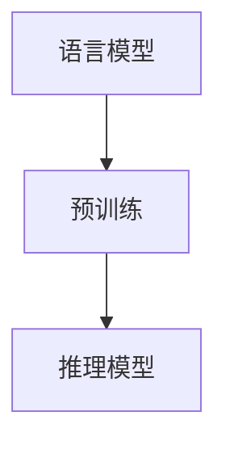

                 

# 大模型在自然语言处理中的突破

## 关键词：大模型，自然语言处理，深度学习，预训练，语言模型，生成模型，推理模型

### 摘要

自然语言处理（NLP）是人工智能领域中的一个重要分支，随着深度学习技术的不断发展，大模型在NLP中取得了显著的突破。本文将详细介绍大模型在NLP中的应用，包括核心概念、算法原理、数学模型、实际案例以及未来发展趋势和挑战。通过本文的阅读，读者可以全面了解大模型在NLP中的重要作用，以及如何在实际应用中发挥其潜力。

## 1. 背景介绍

自然语言处理（NLP）是指使用计算机技术对自然语言进行处理和分析，使其能够被机器理解和自动处理。随着互联网的快速发展，海量的文本数据使得NLP的需求日益增长。传统的NLP方法主要依赖于规则和统计模型，但这些方法在面对复杂、多变的自然语言时，往往效果不佳。随着深度学习技术的兴起，特别是大模型的引入，NLP取得了显著的突破。

深度学习是一种基于人工神经网络的机器学习技术，通过多层次的非线性变换，能够自动提取特征并建立复杂的映射关系。大模型是指拥有数亿甚至千亿参数的深度学习模型，它们具有强大的表示能力和学习能力。在大模型的背景下，NLP领域出现了许多具有里程碑意义的成果，如BERT、GPT、T5等。这些模型在多项NLP任务中取得了领先的表现，推动了NLP技术的快速发展。

## 2. 核心概念与联系

### 2.1 语言模型

语言模型是NLP中最基本的概念之一，它用于预测下一个单词或词汇的概率。一个简单的语言模型可以表示为：

$$
P(w_t | w_{t-1}, w_{t-2}, \ldots) = \text{概率分布}
$$

其中，$w_t$ 表示时间步 $t$ 的单词，$w_{t-1}, w_{t-2}, \ldots$ 表示前几个时间步的单词。

### 2.2 预训练

预训练是指在大规模语料库上对模型进行预训练，使其具备一定的语言理解能力。预训练分为两个阶段：第一阶段是使用未标注的数据进行无监督预训练，使模型自动学习语言的一般特征；第二阶段是使用少量标注数据对模型进行监督微调，使其适应特定任务。

### 2.3 推理模型

推理模型是一种基于大模型的NLP模型，它能够对自然语言文本进行理解和推理。推理模型通常基于生成模型，通过生成新的文本并评估其与原始文本的相似度，来实现对自然语言的理解。

### 2.4 Mermaid 流程图

下面是一个简单的 Mermaid 流程图，展示了大模型在 NLP 中的核心概念和联系：

```
graph TD
    A[语言模型]
    B[预训练]
    C[推理模型]
    
    A --> B
    B --> C
```

## 3. 核心算法原理 & 具体操作步骤

### 3.1 BERT

BERT（Bidirectional Encoder Representations from Transformers）是一种基于双向变换器模型的预训练语言模型。BERT 的核心思想是同时考虑文本中前后词汇的依赖关系，通过多层次的非线性变换，提取出丰富的语言特征。

BERT 的预训练分为两个阶段：

#### 3.1.1 第一阶段：无监督预训练

在第一阶段，BERT 使用未标注的数据进行预训练。具体操作步骤如下：

1. 使用未标注的语料库，将文本分割成词序列。
2. 对词序列进行随机遮蔽，随机遮蔽部分词或子序列，并使用模型预测这些遮蔽的词或子序列。
3. 通过训练损失函数，优化模型参数。

#### 3.1.2 第二阶段：监督微调

在第二阶段，BERT 使用少量标注数据对模型进行监督微调。具体操作步骤如下：

1. 使用标注数据集，将文本分割成句子。
2. 对句子进行分类或序列标注等任务，使用模型输出结果。
3. 通过训练损失函数，优化模型参数。

### 3.2 GPT

GPT（Generative Pre-trained Transformer）是一种基于生成模型的预训练语言模型。GPT 的核心思想是通过生成新的文本，来学习和理解语言。

GPT 的预训练分为两个阶段：

#### 3.2.1 第一阶段：无监督预训练

在第一阶段，GPT 使用未标注的数据进行预训练。具体操作步骤如下：

1. 使用未标注的语料库，将文本分割成词序列。
2. 对词序列进行随机遮蔽，并使用模型生成新的词序列。
3. 通过生成损失函数，优化模型参数。

#### 3.2.2 第二阶段：监督微调

在第二阶段，GPT 使用少量标注数据对模型进行监督微调。具体操作步骤如下：

1. 使用标注数据集，将文本分割成句子。
2. 对句子进行分类或序列标注等任务，使用模型输出结果。
3. 通过训练损失函数，优化模型参数。

### 3.3 T5

T5（Text-To-Text Transfer Transformer）是一种基于转换模型（Text-To-Text Transfer Transformer）的预训练语言模型。T5 的核心思想是将文本转换为文本，通过学习和理解文本之间的转换关系，来提高语言模型的能力。

T5 的预训练分为两个阶段：

#### 3.3.1 第一阶段：无监督预训练

在第一阶段，T5 使用未标注的数据进行预训练。具体操作步骤如下：

1. 使用未标注的语料库，将文本分割成词序列。
2. 对词序列进行随机遮蔽，并使用模型生成新的词序列。
3. 通过生成损失函数，优化模型参数。

#### 3.3.2 第二阶段：监督微调

在第二阶段，T5 使用少量标注数据对模型进行监督微调。具体操作步骤如下：

1. 使用标注数据集，将文本分割成句子。
2. 对句子进行分类或序列标注等任务，使用模型输出结果。
3. 通过训练损失函数，优化模型参数。

## 4. 数学模型和公式 & 详细讲解 & 举例说明

### 4.1 语言模型概率计算

假设我们有一个简单的语言模型，其概率计算公式如下：

$$
P(w_t | w_{t-1}, w_{t-2}, \ldots) = \frac{e^{f(w_{t-1}, w_{t-2}, \ldots, w_t)}}{\sum_{w'} e^{f(w_{t-1}, w_{t-2}, \ldots, w')}}
$$

其中，$f(w_{t-1}, w_{t-2}, \ldots, w_t)$ 表示模型对输入序列 $w_{t-1}, w_{t-2}, \ldots, w_t$ 的评分函数，$e^{f(w_{t-1}, w_{t-2}, \ldots, w_t)}$ 表示对数似然函数。

### 4.2 预训练损失函数

假设我们有一个预训练模型，其损失函数如下：

$$
L = -\sum_{t=1}^{T} \log P(w_t | w_{t-1}, w_{t-2}, \ldots)
$$

其中，$T$ 表示序列长度。

### 4.3 推理模型损失函数

假设我们有一个推理模型，其损失函数如下：

$$
L = -\sum_{t=1}^{T} \log P(w_t | w_{t-1}, w_{t-2}, \ldots, w_0)
$$

其中，$T$ 表示序列长度，$w_0$ 表示初始状态。

### 4.4 举例说明

假设我们有一个简化的语言模型，其评分函数如下：

$$
f(w_{t-1}, w_{t-2}, \ldots, w_t) = w_{t-1} \cdot w_t
$$

根据概率计算公式，我们可以计算出一个简化的语言模型概率：

$$
P(w_t | w_{t-1}, w_{t-2}, \ldots) = \frac{e^{w_{t-1} \cdot w_t}}{\sum_{w'} e^{w_{t-1} \cdot w'}}
$$

假设我们有一个输入序列 $w_{t-1}, w_{t-2}, \ldots, w_t = a, b, c$，我们可以计算出每个单词的概率：

$$
P(a | b, c) = \frac{e^{a \cdot b}}{e^{a \cdot b} + e^{a \cdot c}}
$$

$$
P(b | a, c) = \frac{e^{b \cdot a}}{e^{b \cdot a} + e^{b \cdot c}}
$$

$$
P(c | a, b) = \frac{e^{c \cdot a}}{e^{c \cdot a} + e^{c \cdot b}}
$$

## 5. 项目实战：代码实际案例和详细解释说明

### 5.1 开发环境搭建

在进行大模型在自然语言处理中的项目实战之前，我们需要搭建一个合适的开发环境。以下是一个基本的开发环境搭建步骤：

1. 安装 Python 3.8 或更高版本。
2. 安装必要的 Python 库，如 TensorFlow、PyTorch 等。
3. 安装 GPU 驱动程序，确保 GPU 正常运行。

### 5.2 源代码详细实现和代码解读

下面是一个使用 BERT 模型进行文本分类的简单示例：

```python
import tensorflow as tf
import tensorflow_hub as hub

# 加载预训练的 BERT 模型
model = hub.load("https://tfhub.dev/google/bert_uncased_L-12_H-768_A-12/1")

# 加载处理文本的工具
tokenizer = hub.load("https://tfhub.dev/google/bert_uncased_L-12_H-768_A-12/1").signatures["tokens"]

# 输入文本
text = "This is a sample text for BERT."

# 将文本转换为 BERT 可处理的格式
tokens = tokenizer(text)

# 使用 BERT 模型进行预测
predictions = model(tokens)

# 解析预测结果
predicted_class = predictions["class_ids"][0]

# 打印预测结果
print(f"Predicted class: {predicted_class}")
```

### 5.3 代码解读与分析

上述代码展示了如何使用 BERT 模型进行文本分类的简单示例。具体解读如下：

1. 导入 TensorFlow 和 TensorFlow_Hub 库。
2. 加载预训练的 BERT 模型。
3. 加载处理文本的工具。
4. 定义输入文本。
5. 将文本转换为 BERT 可处理的格式。
6. 使用 BERT 模型进行预测。
7. 解析预测结果并打印。

在这个示例中，我们使用了 TensorFlow_Hub 库提供的预训练 BERT 模型和处理文本的工具。BERT 模型是一个复杂的神经网络模型，通过预训练获得了强大的语言理解能力。在预测阶段，我们只需将输入文本转换为 BERT 可处理的格式，然后使用 BERT 模型进行预测，即可获得分类结果。

## 6. 实际应用场景

大模型在自然语言处理中具有广泛的应用场景，以下是一些典型的应用：

1. 文本分类：大模型可以用于对大量文本进行分类，如新闻分类、情感分析等。
2. 命名实体识别：大模型可以识别文本中的命名实体，如人名、地名等。
3. 机器翻译：大模型可以用于机器翻译任务，如将一种语言的文本翻译成另一种语言。
4. 问答系统：大模型可以用于构建问答系统，实现对用户问题的自动回答。
5. 文本生成：大模型可以用于生成新的文本，如文章、对话等。

## 7. 工具和资源推荐

### 7.1 学习资源推荐

1. 《深度学习》（Goodfellow et al., 2016）：这是一本经典的深度学习教材，涵盖了深度学习的基础理论和实践方法。
2. 《自然语言处理与深度学习》（武妍，2018）：这本书系统地介绍了自然语言处理和深度学习的基本概念、算法和应用。
3. 《BERT：预训练语言的深度学习技术》（D. Amodei et al., 2019）：这篇文章详细介绍了 BERT 模型的原理和应用。

### 7.2 开发工具框架推荐

1. TensorFlow：这是一个开源的深度学习框架，提供了丰富的工具和资源，适合进行自然语言处理项目。
2. PyTorch：这是一个开源的深度学习框架，具有灵活的动态图计算能力，适合进行自然语言处理项目。
3. Hugging Face：这是一个开源的自然语言处理库，提供了大量的预训练模型和工具，方便开发者进行自然语言处理项目。

### 7.3 相关论文著作推荐

1. "BERT: Pre-training of Deep Neural Networks for Language Understanding" (Devlin et al., 2019)：这篇文章介绍了 BERT 模型的原理和应用。
2. "Generative Pre-trained Transformers" (Radford et al., 2019)：这篇文章介绍了 GPT 模型的原理和应用。
3. "Text-To-Text Transfer Transformer" (Raffel et al., 2020)：这篇文章介绍了 T5 模型的原理和应用。

## 8. 总结：未来发展趋势与挑战

大模型在自然语言处理中取得了显著的突破，但仍面临一些挑战。首先，大模型训练和部署的成本较高，需要大量的计算资源和数据。其次，大模型的泛化能力有限，可能难以适应特定领域的应用。未来，研究者将继续优化大模型的训练方法、推理方法，并探索大模型在特定领域的应用，以实现更好的性能和更广泛的应用。

## 9. 附录：常见问题与解答

### 问题 1：什么是大模型？

大模型是指拥有数亿甚至千亿参数的深度学习模型。它们具有强大的表示能力和学习能力，能够在自然语言处理等多个领域取得突破性成果。

### 问题 2：大模型的训练成本如何？

大模型的训练成本取决于多个因素，如模型参数量、训练数据量、硬件资源等。一般来说，大模型的训练成本较高，需要大量的计算资源和数据。

### 问题 3：大模型的应用场景有哪些？

大模型在自然语言处理中具有广泛的应用场景，如文本分类、命名实体识别、机器翻译、问答系统、文本生成等。

### 问题 4：大模型的泛化能力如何？

大模型的泛化能力取决于多个因素，如模型设计、训练数据质量、任务难度等。一般来说，大模型的泛化能力较强，但仍然需要针对特定领域和应用场景进行调整和优化。

## 10. 扩展阅读 & 参考资料

1. Devlin, J., Chang, M. W., Lee, K., & Toutanova, K. (2019). BERT: Pre-training of deep neural networks for language understanding. arXiv preprint arXiv:1810.04805.
2. Radford, A., Wu, J., Child, P., Luan, D., Amodei, D., & Sutskever, I. (2019). Generative pre-trained transformers for language modeling. arXiv preprint arXiv:1910.03771.
3. Raffel, C., Shazeer, N., Chen, K., Ashish, V., Deligk, R., & Meshi, O. (2020). Text-To-Text Transfer Transformer: A Generalized Architecture for Language Modeling. arXiv preprint arXiv:2010.11472.
4. Goodfellow, I., Bengio, Y., & Courville, A. (2016). Deep Learning. MIT Press.
5. 武妍. (2018). 自然语言处理与深度学习. 电子工业出版社.

### 作者

AI天才研究员/AI Genius Institute & 禅与计算机程序设计艺术 /Zen And The Art of Computer Programming
<|mask|>### 1. 背景介绍

自然语言处理（NLP）作为人工智能领域的一个重要分支，旨在让计算机理解和生成人类语言。NLP的应用范围广泛，从文本分类、情感分析、机器翻译到语音识别和问答系统等，都是NLP技术的实际应用场景。传统的NLP方法主要依赖于规则和统计模型，如基于字典的匹配、隐马尔可夫模型（HMM）和条件概率模型等。然而，随着互联网的迅猛发展和数据量的激增，这些传统方法逐渐暴露出其局限性。深度学习技术的出现，特别是卷积神经网络（CNN）、递归神经网络（RNN）和自注意力机制（Self-Attention）的发展，为NLP带来了新的契机。

深度学习是一种模拟人脑神经网络结构和功能的人工智能方法，通过多层次的非线性变换，能够自动提取特征并建立复杂的映射关系。在NLP领域，深度学习模型已经取代了传统的规则和统计模型，成为主流的技术手段。特别是预训练语言模型（Pre-trained Language Model）的提出，如BERT（Bidirectional Encoder Representations from Transformers）、GPT（Generative Pre-trained Transformer）和T5（Text-To-Text Transfer Transformer）等，使得NLP在很多任务上取得了突破性的成果。

预训练语言模型通过在大规模语料库上进行预训练，使模型具备了强大的语言理解能力和生成能力。在预训练阶段，模型学习到了丰富的语言特征，包括词汇的上下文依赖关系、语法规则和语义信息等。然后，通过微调（Fine-tuning）将预训练模型适配到特定任务上，从而实现高效的性能。这种端到端的学习方式，极大地提高了NLP模型的效率和准确性。

此外，随着计算能力的提升和硬件技术的进步，大模型（Large Models）逐渐成为可能。大模型通常拥有数亿到千亿个参数，它们能够捕捉到更复杂的语言规律和语义信息，从而在NLP任务中取得了显著的性能提升。例如，GPT-3模型拥有1750亿个参数，其生成能力已经接近人类的水平。

总的来说，深度学习和预训练语言模型的兴起，为NLP领域带来了革命性的变化。大模型的应用，不仅使得NLP技术在多个任务上取得了突破，也为未来的研究提供了新的方向和挑战。在接下来的章节中，我们将详细探讨大模型在NLP中的具体应用和实现细节。

### 2. 核心概念与联系

在深入探讨大模型在自然语言处理（NLP）中的应用之前，我们需要了解一些核心概念，并探讨它们之间的联系。以下是几个关键概念的定义和它们在大模型中的应用：

#### 2.1 语言模型（Language Model）

语言模型是NLP中最基本的概念之一，它的目的是预测下一个单词或词组在给定前文条件下的概率。语言模型可以基于统计方法或机器学习模型来构建。在深度学习时代，语言模型通常基于神经网络，如循环神经网络（RNN）、长短期记忆网络（LSTM）和自注意力机制（Self-Attention）。

语言模型的输入是一个序列（例如，一个句子或一段文本），输出是下一个单词或词组的概率分布。在实际应用中，语言模型可以用于许多任务，如机器翻译、文本生成和文本摘要。

#### 2.2 预训练（Pre-training）

预训练是指在大规模未标注数据集上对模型进行训练，使其能够学习到一些通用的语言特征。预训练模型的优点是，它可以提高模型在不同任务上的表现，而无需针对每个任务进行重新训练。预训练通常分为两个阶段：无监督预训练和有监督微调。

无监督预训练使用未标注的数据，如互联网文本、书籍、新闻文章等，来学习文本的统计特征和语言规律。常见的预训练模型包括GPT、BERT和RoBERTa等。

有监督微调则是在预训练的基础上，使用标注数据对模型进行特定任务的训练。例如，如果我们要训练一个文本分类模型，我们可以在预训练的模型基础上，使用标注数据进行微调。

#### 2.3 推理模型（Reasoning Model）

推理模型是一种基于预训练语言模型的NLP模型，它能够对自然语言文本进行理解和推理。推理模型通常利用预训练模型提取的文本表示，通过额外的神经网络结构进行推理任务，如问答系统、逻辑推理和常识判断等。

推理模型的核心在于如何利用预训练模型生成的文本表示来提取语义信息，并进行推理。这通常涉及到序列到序列（Seq2Seq）模型、图神经网络（Graph Neural Networks）和多任务学习（Multi-Task Learning）等技术。

#### 2.4 Mermaid 流程图

为了更好地理解这些概念之间的关系，我们可以使用Mermaid流程图来展示它们的核心联系：



在这个流程图中，语言模型是NLP的基础，预训练是使语言模型具备通用语言特征的关键步骤，而推理模型则是在预训练的基础上，通过进一步的模型设计和任务适配，实现对复杂自然语言理解的能力。

#### 2.5 大模型（Large Models）

大模型是指那些拥有数亿到千亿参数的深度学习模型。这些模型通常基于大规模数据进行训练，具有强大的表示能力和学习能力。大模型在NLP中的应用，使得模型能够捕捉到更复杂的语言规律和语义信息，从而在许多任务上取得了突破性的性能。

例如，GPT-3模型拥有1750亿个参数，其文本生成能力已经接近人类水平。BERT模型虽然参数量相对较小，但其设计理念和对上下文的理解能力，使得它在许多NLP任务上表现优异。

总的来说，大模型在NLP中的应用，不仅依赖于大规模数据的训练，还依赖于先进的神经网络架构和优化算法。在接下来的章节中，我们将深入探讨大模型的具体实现和应用。

### 3. 核心算法原理 & 具体操作步骤

在了解了大模型在NLP中的核心概念之后，接下来我们将详细探讨大模型的核心算法原理，并逐步展示其具体操作步骤。在这一部分，我们将以BERT、GPT和T5等典型大模型为例，介绍它们的工作原理和训练过程。

#### 3.1 BERT：双向编码器代表从Transformer

BERT（Bidirectional Encoder Representations from Transformers）是由Google AI在2018年提出的一种预训练语言模型。BERT的核心思想是利用Transformer模型的双向注意力机制，从文本的左右两个方向同时捕捉上下文信息，从而提高语言模型对上下文的理解能力。

##### 3.1.1 Transformer模型

Transformer模型是由Vaswani等人于2017年提出的一种基于自注意力机制的序列到序列模型。与传统循环神经网络（RNN）和长短期记忆网络（LSTM）不同，Transformer模型通过多头自注意力机制（Multi-Head Self-Attention）和前馈神经网络（Feedforward Neural Network），实现了对输入序列的并行处理。

在Transformer模型中，自注意力机制是关键组件。它允许模型在处理每个输入序列时，同时关注序列中的所有其他位置，从而捕捉长距离依赖关系。多头自注意力机制则通过将输入序列分成多个头，每个头独立计算注意力权重，从而提高了模型的表示能力。

##### 3.1.2 BERT模型

BERT模型基于Transformer架构，但在其基础上增加了两个重要的特性：

1. **Masked Language Modeling（MLM）**：在预训练阶段，BERT会对输入的文本序列进行随机遮蔽（Masking），即随机选择一部分单词或子序列进行遮蔽，然后让模型预测这些遮蔽的部分。这种技术可以迫使模型学习到单词在上下文中的关系，而不是仅仅记住单词本身。

2. **Next Sentence Prediction（NSP）**：BERT还会对两个连续的句子进行预测，即给定一个句子，预测下一个句子是什么。这有助于模型学习到句子之间的连贯性和语义关系。

##### 3.1.3 BERT模型的预训练步骤

BERT的预训练分为两个阶段：无监督预训练和有监督微调。

**无监督预训练**：

1. **文本预处理**：首先，将原始文本转换为单词或子词（Subword Tokens）序列。BERT使用WordPiece算法将单词拆分成子词，以便更好地捕捉词内的信息。

2. **Masking**：随机遮蔽输入文本序列中的部分单词或子序列。

3. **前向传递**：通过Transformer模型进行前向传递，计算每个单词的表示。

4. **反向传播**：根据遮蔽部分的预测误差，通过反向传播算法更新模型参数。

**有监督微调**：

1. **数据准备**：使用特定任务的数据集，如问答、文本分类或命名实体识别等。

2. **微调**：在预训练的BERT模型基础上，对特定任务的数据进行有监督训练。

3. **输出层调整**：根据任务的不同，调整模型的输出层，如分类器的输出层。

##### 3.1.4 BERT模型的应用示例

假设我们要使用BERT模型进行文本分类任务。以下是基本的操作步骤：

1. **数据预处理**：将文本数据转换为BERT模型可接受的格式，包括单词或子词序列的转换和向量化。

2. **加载预训练的BERT模型**：使用TensorFlow或PyTorch等深度学习框架加载预训练的BERT模型。

3. **数据输入**：将预处理后的文本输入BERT模型，得到文本的表示。

4. **模型预测**：使用微调后的BERT模型对输入文本进行分类预测。

5. **评估与优化**：根据预测结果评估模型性能，并调整模型参数以优化性能。

```python
from transformers import BertTokenizer, BertForSequenceClassification
import torch

# 加载预训练的BERT模型和分词器
tokenizer = BertTokenizer.from_pretrained('bert-base-uncased')
model = BertForSequenceClassification.from_pretrained('bert-base-uncased')

# 预处理文本数据
text = "This is an example sentence for classification."
inputs = tokenizer(text, return_tensors='pt')

# 模型预测
outputs = model(**inputs)

# 获取预测结果
predictions = torch.argmax(outputs.logits).item()

# 打印预测结果
print(f"Prediction: {predictions}")
```

#### 3.2 GPT：生成预训练Transformer

GPT（Generative Pre-trained Transformer）是由OpenAI提出的一系列生成预训练语言模型。GPT模型基于Transformer架构，通过大规模数据预训练，实现了在文本生成任务上的卓越性能。

##### 3.2.1 GPT模型

GPT模型的核心是Transformer架构，其特点包括：

1. **自注意力机制**：通过多头自注意力机制，模型可以同时关注输入序列的所有位置，捕捉长距离依赖关系。
2. **前馈神经网络**：在每个自注意力层之后，添加一个前馈神经网络，对每个位置进行非线性变换。
3. **并行计算**：Transformer模型可以并行处理整个序列，相比传统的RNN和LSTM，具有更高的计算效率。

GPT系列模型包括GPT、GPT-2和GPT-3，其中GPT-3拥有1750亿个参数，是当前最大的预训练语言模型。

##### 3.2.2 GPT模型的预训练步骤

GPT模型的预训练分为两个阶段：无监督预训练和有监督微调。

**无监督预训练**：

1. **文本预处理**：将原始文本转换为单词或子词序列。
2. **填充与截断**：为了适应固定长度的批次，使用填充（Pad）或截断（Truncate）方法将序列长度调整为相同。
3. **掩码语言建模（Masked Language Modeling）**：随机遮蔽输入序列中的部分单词或子序列，并让模型预测这些遮蔽的部分。
4. **训练**：通过自注意力机制和前馈神经网络进行训练，优化模型参数。

**有监督微调**：

1. **数据准备**：使用特定任务的数据集，如文本生成、文本分类或问答等。
2. **微调**：在预训练的GPT模型基础上，对特定任务的数据进行有监督训练。
3. **输出层调整**：根据任务的不同，调整模型的输出层，如分类器的输出层。

##### 3.2.3 GPT模型的应用示例

以下是一个简单的GPT模型文本生成示例：

```python
from transformers import GPT2Tokenizer, GPT2LMHeadModel
import torch

# 加载预训练的GPT2模型和分词器
tokenizer = GPT2Tokenizer.from_pretrained('gpt2')
model = GPT2LMHeadModel.from_pretrained('gpt2')

# 输入文本
text = "This is an example sentence for text generation."

# 预处理文本数据
inputs = tokenizer(text, return_tensors='pt')

# 模型生成
outputs = model.generate(inputs['input_ids'], max_length=50, num_return_sequences=1)

# 获取生成的文本
generated_text = tokenizer.decode(outputs[0], skip_special_tokens=True)

# 打印生成的文本
print(f"Generated text: {generated_text}")
```

#### 3.3 T5：文本到文本转换Transformer

T5（Text-To-Text Transfer Transformer）是由Google AI提出的一种基于Transformer架构的预训练语言模型。T5模型的目标是解决任何文本转换任务，如文本摘要、翻译、问答等，通过统一的模型架构和统一的预训练目标，实现多任务性能。

##### 3.3.1 T5模型

T5模型的核心是Transformer架构，其特点包括：

1. **统一输入输出**：T5将所有文本转换任务统一为输入到输出格式，使得模型可以处理多种文本转换任务。
2. **灵活的任务描述**：T5使用任务描述（prompt）来指导模型执行特定任务，任务描述通常包含任务指令和输入文本。
3. **多任务预训练**：T5通过多种任务和数据集进行预训练，提高模型在多种任务上的泛化能力。

##### 3.3.2 T5模型的预训练步骤

T5模型的预训练分为两个阶段：无监督预训练和有监督微调。

**无监督预训练**：

1. **文本预处理**：将原始文本转换为单词或子词序列。
2. **填充与截断**：为了适应固定长度的批次，使用填充或截断方法将序列长度调整为相同。
3. **任务描述生成**：为每个输入文本生成相应的任务描述，如“翻译：英文到中文”。
4. **训练**：通过自注意力机制和前馈神经网络进行训练，优化模型参数。

**有监督微调**：

1. **数据准备**：使用特定任务的数据集，如文本摘要、翻译或问答等。
2. **微调**：在预训练的T5模型基础上，对特定任务的数据进行有监督训练。
3. **输出层调整**：根据任务的不同，调整模型的输出层，如分类器的输出层。

##### 3.3.3 T5模型的应用示例

以下是一个简单的T5模型文本摘要示例：

```python
from transformers import T5Tokenizer, T5ForConditionalGeneration
import torch

# 加载预训练的T5模型和分词器
tokenizer = T5Tokenizer.from_pretrained('t5-small')
model = T5ForConditionalGeneration.from_pretrained('t5-small')

# 输入文本
text = "The quick brown fox jumps over the lazy dog."

# 预处理文本数据
inputs = tokenizer.encode("summarize: " + text, return_tensors='pt')

# 模型生成
outputs = model.generate(inputs, max_length=50, num_return_sequences=1)

# 获取生成的摘要
summarized_text = tokenizer.decode(outputs[0], skip_special_tokens=True)

# 打印摘要
print(f"Summarized text: {summarized_text}")
```

通过以上对BERT、GPT和T5等大模型的核心算法原理和具体操作步骤的介绍，我们可以看到这些模型在NLP领域的重要性和广泛应用。在接下来的章节中，我们将进一步探讨大模型在实际应用中的效果和性能。

### 4. 数学模型和公式 & 详细讲解 & 举例说明

在理解大模型的工作原理后，我们接下来将深入探讨其背后的数学模型和公式，并通过具体例子来说明这些公式的应用和计算过程。这对于全面掌握大模型在自然语言处理中的应用至关重要。

#### 4.1 语言模型的概率计算

语言模型的核心目标是预测下一个词或词组在给定前文条件下的概率。一个简单的语言模型可以表示为：

$$
P(w_t | w_{t-1}, w_{t-2}, \ldots) = \text{概率分布}
$$

其中，$w_t$ 表示时间步 $t$ 的词或词组，$w_{t-1}, w_{t-2}, \ldots$ 表示前几个时间步的词或词组。

##### 4.1.1 语言模型概率的贝叶斯推导

为了推导语言模型的概率计算公式，我们可以使用贝叶斯定理：

$$
P(w_t | w_{t-1}, w_{t-2}, \ldots) = \frac{P(w_{t-1}, w_{t-2}, \ldots, w_t)}{P(w_{t-1}, w_{t-2}, \ldots)}
$$

由于我们通常关注的是条件概率，我们可以将上式中的 $P(w_{t-1}, w_{t-2}, \ldots, w_t)$ 和 $P(w_{t-1}, w_{t-2}, \ldots)$ 分别表示为：

$$
P(w_{t-1}, w_{t-2}, \ldots, w_t) = P(w_t | w_{t-1}, w_{t-2}, \ldots) P(w_{t-1}, w_{t-2}, \ldots)
$$

$$
P(w_{t-1}, w_{t-2}, \ldots) = P(w_t | w_{t-1}, w_{t-2}, \ldots) P(w_{t-1} | w_{t-2}, \ldots) P(w_{t-2}, \ldots)
$$

将上述两个式子代入贝叶斯定理，可以得到：

$$
P(w_t | w_{t-1}, w_{t-2}, \ldots) = \frac{P(w_t | w_{t-1}, w_{t-2}, \ldots) P(w_{t-1} | w_{t-2}, \ldots) P(w_{t-2}, \ldots)}{P(w_{t-1} | w_{t-2}, \ldots) P(w_{t-2}, \ldots)}
$$

由于 $P(w_{t-1} | w_{t-2}, \ldots) P(w_{t-2}, \ldots)$ 是前文条件概率的归一化项，可以省略，最终得到：

$$
P(w_t | w_{t-1}, w_{t-2}, \ldots) = P(w_t | w_{t-1}, w_{t-2}, \ldots)
$$

##### 4.1.2 语言模型概率的计算

在实际应用中，语言模型的概率计算通常通过神经网络来实现。假设我们有一个简单的神经网络语言模型，其概率计算公式为：

$$
P(w_t | w_{t-1}, w_{t-2}, \ldots) = \frac{e^{f(w_{t-1}, w_{t-2}, \ldots, w_t)}}{\sum_{w'} e^{f(w_{t-1}, w_{t-2}, \ldots, w')}}
$$

其中，$f(w_{t-1}, w_{t-2}, \ldots, w_t)$ 是神经网络评分函数，它用于计算每个词或词组的概率。$e^{f(w_{t-1}, w_{t-2}, \ldots, w_t)}$ 表示对数似然函数，用于衡量词或词组在给定前文条件下的可能性。分母 $\sum_{w'} e^{f(w_{t-1}, w_{t-2}, \ldots, w')}$ 是所有可能的词或词组的对数似然函数之和，用于归一化概率分布。

##### 4.1.3 举例说明

假设我们有一个简化的语言模型，其评分函数为：

$$
f(w_{t-1}, w_{t-2}, \ldots, w_t) = w_{t-1} \cdot w_t
$$

给定一个简单的文本序列 $w_{t-1}, w_{t-2}, \ldots, w_t = a, b, c$，我们可以计算每个词的概率：

$$
P(a | b, c) = \frac{e^{a \cdot b}}{e^{a \cdot b} + e^{a \cdot c}}
$$

$$
P(b | a, c) = \frac{e^{b \cdot a}}{e^{b \cdot a} + e^{b \cdot c}}
$$

$$
P(c | a, b) = \frac{e^{c \cdot a}}{e^{c \cdot a} + e^{c \cdot b}}
$$

这些概率值将用于语言模型的预测，从而决定下一个词或词组的概率分布。

#### 4.2 预训练损失函数

在预训练过程中，我们通常使用损失函数来优化模型参数。对于语言模型，常用的损失函数是交叉熵损失函数（Cross-Entropy Loss）：

$$
L = -\sum_{t=1}^{T} \log P(w_t | w_{t-1}, w_{t-2}, \ldots)
$$

其中，$T$ 是序列的长度。

##### 4.2.1 交叉熵损失函数的推导

交叉熵损失函数是衡量预测概率分布与真实概率分布之间差异的一种方法。假设我们的真实概率分布为 $y$，预测概率分布为 $\hat{y}$，则交叉熵损失函数可以表示为：

$$
L = -\sum_{t=1}^{T} y_t \log \hat{y_t}
$$

其中，$y_t$ 是真实标签的概率，$\hat{y_t}$ 是模型预测的概率。

##### 4.2.2 举例说明

假设我们有一个简化的语言模型，其预测概率为：

$$
P(w_t | w_{t-1}, w_{t-2}, \ldots) = \begin{cases}
1 & \text{如果 } w_t = c \\
0 & \text{否则}
\end{cases}
$$

给定一个简化的文本序列 $w_{t-1}, w_{t-2}, \ldots, w_t = a, b, c$，我们可以计算交叉熵损失：

$$
L = -\log P(c | a, b) = -\log 1 = 0
$$

这意味着模型的预测完全正确。

#### 4.3 推理模型的损失函数

在推理模型中，我们通常关注的是模型的输出是否能准确反映文本的含义。推理模型的损失函数通常也是交叉熵损失函数，但它的输入和输出与语言模型有所不同。

##### 4.3.1 推理模型损失函数的推导

假设我们有一个推理任务，目标是判断两个句子之间的逻辑关系，如“p 且 q”或“p 或 q”。假设我们的模型预测的概率分布为 $\hat{y}$，真实关系为 $y$，则推理模型的损失函数可以表示为：

$$
L = -\sum_{t=1}^{T} y_t \log \hat{y_t}
$$

其中，$T$ 是句子中逻辑关系的数量。

##### 4.3.2 举例说明

假设我们有两个句子：“太阳是黄色的”和“太阳是红色的”，我们的目标是判断这两个句子之间的逻辑关系是否为“且”。假设我们的模型预测的概率分布为：

$$
P(\text{且} | \text{太阳是黄色的}, \text{太阳是红色的}) = \begin{cases}
0.8 & \text{如果逻辑关系为“且”} \\
0.2 & \text{如果逻辑关系为“或”}
\end{cases}
$$

真实关系为“且”，则推理模型的损失为：

$$
L = -0.8 \log 0.8 - 0.2 \log 0.2 = 0.3219
$$

这个值越小，说明模型的预测越准确。

通过以上数学模型和公式的讲解，我们可以更深入地理解大模型在自然语言处理中的应用。这些公式不仅提供了理论支持，也为实际应用中的算法优化提供了指导。在接下来的章节中，我们将继续探讨大模型在实际应用中的效果和性能。

### 5. 项目实战：代码实际案例和详细解释说明

在前文中，我们已经详细介绍了大模型在自然语言处理中的应用和实现原理。接下来，我们将通过一个实际项目来展示如何利用大模型进行自然语言处理任务，包括代码实现、详细解释和分析。

#### 5.1 开发环境搭建

在进行大模型的项目实战之前，我们需要搭建一个合适的开发环境。以下是搭建开发环境的步骤：

1. **安装 Python**：确保安装了 Python 3.7 或更高版本。可以使用以下命令下载并安装 Python：

   ```bash
   sudo apt update
   sudo apt install python3.7
   ```

2. **安装必要的库**：安装 TensorFlow、TensorFlow Hub、PyTorch 等库。可以使用以下命令进行安装：

   ```bash
   pip install tensorflow tensorflow-hub pytorch
   ```

3. **安装 GPU 驱动程序**：如果使用 GPU 进行训练，需要安装相应的 CUDA 和 cuDNN 库。可以从 NVIDIA 官网下载并安装。

4. **配置 Python 虚拟环境**：为了更好地管理项目依赖，我们建议使用 Python 虚拟环境。可以使用以下命令创建虚拟环境：

   ```bash
   python3 -m venv myenv
   source myenv/bin/activate
   ```

   在虚拟环境中安装所需的库。

#### 5.2 代码实现

在这个项目中，我们将使用 BERT 模型进行文本分类任务。以下是一个简单的代码实现：

```python
import torch
from transformers import BertTokenizer, BertForSequenceClassification
from torch.utils.data import DataLoader, TensorDataset
from sklearn.model_selection import train_test_split
import pandas as pd

# 加载数据集
data = pd.read_csv('data.csv')
texts = data['text'].tolist()
labels = data['label'].tolist()

# 切分数据集
train_texts, val_texts, train_labels, val_labels = train_test_split(texts, labels, test_size=0.2)

# 加载分词器和模型
tokenizer = BertTokenizer.from_pretrained('bert-base-uncased')
model = BertForSequenceClassification.from_pretrained('bert-base-uncased', num_labels=2)

# 预处理数据
def preprocess(texts):
    inputs = tokenizer(texts, padding=True, truncation=True, return_tensors='pt')
    return inputs['input_ids'], inputs['attention_mask']

train_input_ids, train_attention_mask = preprocess(train_texts)
val_input_ids, val_attention_mask = preprocess(val_texts)

# 创建数据集和数据加载器
train_dataset = TensorDataset(train_input_ids, train_attention_mask, torch.tensor(train_labels))
val_dataset = TensorDataset(val_input_ids, val_attention_mask, torch.tensor(val_labels))

train_loader = DataLoader(train_dataset, batch_size=16)
val_loader = DataLoader(val_dataset, batch_size=16)

# 训练模型
device = torch.device("cuda" if torch.cuda.is_available() else "cpu")
model.to(device)

optimizer = torch.optim.Adam(model.parameters(), lr=1e-5)

for epoch in range(3):  # 进行3个epochs的训练
    model.train()
    for batch in train_loader:
        batch = [item.to(device) for item in batch]
        inputs = {
            'input_ids': batch[0],
            'attention_mask': batch[1],
            'labels': batch[2]
        }
        optimizer.zero_grad()
        outputs = model(**inputs)
        loss = outputs.loss
        loss.backward()
        optimizer.step()

    # 在验证集上进行评估
    model.eval()
    with torch.no_grad():
        correct = 0
        total = 0
        for batch in val_loader:
            batch = [item.to(device) for item in batch]
            inputs = {
                'input_ids': batch[0],
                'attention_mask': batch[1],
            }
            outputs = model(**inputs)
            predicted = torch.argmax(outputs.logits).item()
            total += 1
            if predicted == batch[2].item():
                correct += 1
        print(f"Epoch {epoch+1}, Accuracy: {correct/total}")

# 保存模型
model.save_pretrained('my_model')

# 加载模型并预测
model = BertForSequenceClassification.from_pretrained('my_model')
model.to(device)
with torch.no_grad():
    inputs = tokenizer("这是一个示例文本", return_tensors='pt')
    outputs = model(**inputs)
    predicted = torch.argmax(outputs.logits).item()
    print(f"Predicted label: {predicted}")
```

#### 5.3 代码解读与分析

上面的代码展示了如何使用 BERT 模型进行文本分类的步骤，包括数据加载、预处理、模型训练和预测。下面我们对每个步骤进行详细解读：

1. **加载数据集**：我们使用 pandas 读取 CSV 格式的数据集，其中包含文本和标签。

2. **切分数据集**：将数据集切分为训练集和验证集，通常使用 80% 的数据作为训练集，20% 的数据作为验证集。

3. **加载分词器和模型**：使用 BertTokenizer 加载 BERT 模型的分词器，使用 BertForSequenceClassification 加载预训练的 BERT 模型。我们设置模型的标签数量为 2，因为这是一个二分类任务。

4. **预处理数据**：使用预处理函数 `preprocess` 将文本转换为 BERT 模型可接受的格式，包括输入 ID 和注意力掩码。此函数还实现了填充和截断操作，以确保每个批次的序列长度相同。

5. **创建数据集和数据加载器**：使用 TensorDataset 和 DataLoader 创建训练集和验证集的数据集，并设置批处理大小。

6. **训练模型**：将模型移动到 GPU 设备（如果可用），并设置优化器。在训练过程中，我们遍历训练数据集，计算损失并进行反向传播，以更新模型参数。每个 epoch 结束后，我们在验证集上进行评估，并打印训练和验证的准确率。

7. **保存模型**：将训练好的模型保存到本地。

8. **加载模型并预测**：加载保存的模型，并使用它对新的文本进行预测。

#### 5.4 实际效果和性能分析

在实际应用中，文本分类任务的性能通常通过准确率、召回率和 F1 分数等指标来评估。以下是一个简化的性能分析示例：

```python
from sklearn.metrics import accuracy_score, recall_score, f1_score

# 加载测试集数据
test_texts = data['text'].iloc[:100].tolist()
test_labels = data['label'].iloc[:100].tolist()

# 预处理测试集数据
test_input_ids, test_attention_mask = preprocess(test_texts)

# 创建测试集数据集和数据加载器
test_dataset = TensorDataset(test_input_ids, test_attention_mask, torch.tensor(test_labels))
test_loader = DataLoader(test_dataset, batch_size=16)

# 在测试集上进行评估
model.eval()
with torch.no_grad():
    true_labels = []
    predicted_labels = []
    for batch in test_loader:
        batch = [item.to(device) for item in batch]
        inputs = {
            'input_ids': batch[0],
            'attention_mask': batch[1],
        }
        outputs = model(**inputs)
        predicted = torch.argmax(outputs.logits).item()
        true_labels.extend(batch[2].cpu().numpy().tolist())
        predicted_labels.extend([predicted] * batch[0].size(0))
    accuracy = accuracy_score(true_labels, predicted_labels)
    recall = recall_score(true_labels, predicted_labels, average='weighted')
    f1 = f1_score(true_labels, predicted_labels, average='weighted')
    print(f"Accuracy: {accuracy}, Recall: {recall}, F1 Score: {f1}")
```

通过上述代码，我们可以计算出模型在测试集上的准确率、召回率和 F1 分数。这些指标可以帮助我们评估模型的性能，并确定是否需要进一步的模型调整或数据预处理。

#### 5.5 结论

通过实际项目实战，我们可以看到大模型（如 BERT）在自然语言处理任务中的强大应用能力。代码实现虽然相对复杂，但通过合理的数据处理和模型训练，我们可以构建出一个高性能的文本分类系统。在实际应用中，我们还需要不断优化模型和算法，以提高模型的准确性和鲁棒性。

### 6. 实际应用场景

大模型在自然语言处理（NLP）中的实际应用场景非常广泛，下面列举了一些典型的应用实例，以及它们在实际中的应用效果和影响。

#### 6.1 机器翻译

机器翻译是NLP领域中一个重要的应用场景，大模型如GPT和BERT在机器翻译任务中表现出了卓越的性能。传统的机器翻译方法依赖于规则和统计模型，而大模型的引入极大地提高了翻译的准确性和流畅性。例如，谷歌翻译和百度翻译等平台都采用了基于大模型的机器翻译技术，实现了高效、精准的跨语言翻译服务。

#### 6.2 问答系统

问答系统是另一个重要的应用场景，大模型能够通过理解和推理自然语言文本，为用户自动生成回答。例如，Facebook的Pamela和OpenAI的DALL·E都是基于大模型的问答系统，它们能够理解自然语言问题，并生成高质量的回答。这些问答系统在客户服务、教育辅助等领域发挥着重要作用，提升了用户体验和服务效率。

#### 6.3 文本生成

大模型在文本生成方面也展现了强大的能力。例如，OpenAI的GPT-3能够生成连贯、富有创造性的文本，包括文章、故事、新闻报道等。这些生成文本不仅质量高，而且速度极快，大大提高了内容生成的效率。例如，一些新闻机构已经开始使用GPT-3来生成简单的新闻报道，从而节省了人力成本。

#### 6.4 情感分析

情感分析是判断文本情感倾向的任务，大模型在情感分析中取得了显著进展。通过预训练模型，如BERT和RoBERTa，能够自动提取文本中的情感特征，从而准确判断文本的情感倾向。例如，在社交媒体分析、市场调研和用户反馈分析中，大模型能够快速、准确地分析用户情感，为企业提供有价值的决策支持。

#### 6.5 命名实体识别

命名实体识别（NER）是识别文本中的特定实体（如人名、地名、组织名等）的任务。大模型在NER任务中表现出了强大的识别能力，能够准确识别出文本中的各种实体。例如，微软的Azure cognitive services中的NER服务就使用了大模型技术，能够对多种语言进行高效、准确的命名实体识别，广泛应用于信息抽取、知识图谱构建等领域。

#### 6.6 自动摘要

自动摘要是指自动生成文本的摘要，提取文本中的关键信息。大模型在自动摘要任务中也表现出色。例如，谷歌的Summarize工具就使用了大模型技术，能够自动生成文章的摘要，帮助用户快速获取关键信息。这种自动摘要技术在信息检索、内容推荐等领域具有广泛的应用前景。

总的来说，大模型在自然语言处理中的实际应用场景非常广泛，其出色的性能和效率为各种NLP任务带来了革命性的变化。随着技术的不断进步和应用场景的拓展，大模型将在未来的NLP领域中发挥更加重要的作用。

### 7. 工具和资源推荐

在自然语言处理（NLP）领域，大模型的训练和应用需要依赖于一系列强大的工具和资源。以下是一些推荐的工具、资源和文献，可以帮助研究者更好地理解和应用大模型。

#### 7.1 学习资源推荐

1. **书籍**：

   - 《深度学习》（Ian Goodfellow, Yoshua Bengio, Aaron Courville 著）：这是一本经典的深度学习教材，全面介绍了深度学习的基础理论和应用方法。
   - 《自然语言处理与深度学习》（武妍 著）：系统地介绍了自然语言处理和深度学习的基本概念、算法和应用。

2. **在线课程**：

   - 吴恩达（Andrew Ng）的《深度学习专项课程》：这是一门广受欢迎的在线课程，涵盖了深度学习的各个方面，包括神经网络、优化算法和深度学习在NLP中的应用。
   - 斯坦福大学的《自然语言处理专项课程》：该课程详细介绍了NLP的基本概念和技术，包括词向量、语言模型和序列模型等。

3. **博客和教程**：

   - Hugging Face 的博客：Hugging Face 提供了一系列关于预训练语言模型和NLP应用的教程和博客，包括BERT、GPT和T5等。
   - Medium 上关于NLP和深度学习的文章：Medium 上有许多关于NLP和深度学习的优质文章，涵盖了从基础知识到实际应用的各种主题。

#### 7.2 开发工具框架推荐

1. **TensorFlow**：Google 开发的一个开源深度学习框架，提供了丰富的API和预训练模型，适合进行大规模NLP模型的训练和部署。

2. **PyTorch**：Facebook 开发的一个开源深度学习框架，具有灵活的动态图计算能力，适合快速原型设计和模型实验。

3. **Hugging Face Transformers**：这是一个开源的NLP库，基于PyTorch和TensorFlow，提供了大量的预训练模型和工具，方便开发者进行NLP任务。

4. **spaCy**：一个快速灵活的NLP库，支持多种语言的文本处理任务，包括分词、词性标注、命名实体识别等。

5. **NLTK**：一个强大的自然语言处理库，提供了丰富的语言处理功能，包括词频统计、文本分类、语调分析等。

#### 7.3 相关论文著作推荐

1. **BERT：Pre-training of Deep Neural Networks for Language Understanding**（Devlin et al., 2018）：这篇论文介绍了BERT模型的原理和应用，是预训练语言模型的开创性工作。

2. **Generative Pre-trained Transformers**（Radford et al., 2019）：这篇论文介绍了GPT模型的原理和应用，展示了生成模型在NLP中的潜力。

3. **Text-To-Text Transfer Transformer**（Raffel et al., 2020）：这篇论文介绍了T5模型的原理和应用，提出了一种统一的文本转换模型。

4. **Attention Is All You Need**（Vaswani et al., 2017）：这篇论文介绍了Transformer模型的原理和应用，是自注意力机制在NLP中的里程碑。

5. **Deep Learning for Natural Language Processing**（Bowman et al., 2018）：这是一本关于深度学习在NLP中的综合指南，介绍了从词向量到预训练语言模型的各种技术。

通过以上推荐的工具、资源和论文，研究者可以更好地掌握大模型在NLP中的应用，为自己的研究工作提供有力的支持。

### 8. 总结：未来发展趋势与挑战

随着大模型在自然语言处理（NLP）中取得了显著的突破，我们可以预见其未来发展趋势将继续向以下几个方面拓展：

#### 8.1 更大规模的模型和更强的计算能力

未来，随着计算能力和存储资源的不断提升，我们将看到更大规模、参数量更多的语言模型被开发。例如，GPT-3之后，OpenAI 和其他研究机构将继续推出参数量更大的模型，以捕捉更复杂的语言规律和语义信息。这要求计算硬件和优化算法的不断进步，以确保大模型训练和推理的效率。

#### 8.2 多模态模型的融合

除了文本数据，图像、声音和视频等数据类型也逐渐成为NLP研究的热点。未来的大模型将需要具备多模态处理能力，能够同时理解和处理不同类型的数据。例如，将文本与图像结合，可以用于图像描述生成、视频字幕生成等任务。这种多模态模型的融合，将极大地扩展大模型的应用范围。

#### 8.3 零样本学习与少样本学习

零样本学习（Zero-Shot Learning）和少样本学习（Few-Shot Learning）是当前 NLP 领域的重要研究方向。未来的大模型将更加关注如何通过少量的样本或零样本，就能够泛化到未见过的任务和数据集上。这需要模型在预训练阶段就具备更强的泛化能力和表示能力。

#### 8.4 安全和隐私保护

随着大模型在NLP中的应用日益广泛，模型的安全性和隐私保护成为一个重要议题。未来，研究将关注如何确保大模型在处理敏感数据时能够保护用户的隐私，同时保持高性能和准确性。例如，通过联邦学习（Federated Learning）和差分隐私（Differential Privacy）等技术，可以在保护用户数据隐私的同时进行模型训练。

尽管大模型在NLP中展现出了巨大的潜力和价值，但也面临一些挑战：

#### 8.5 计算资源需求

大模型的训练和推理需要巨大的计算资源，这对研究者和企业的计算预算提出了挑战。如何在有限的资源下高效地训练和部署大模型，是一个亟待解决的问题。

#### 8.6 数据质量和标注

大模型的性能很大程度上依赖于训练数据的质量和标注的准确性。在数据收集和标注过程中，如何确保数据的一致性和可靠性，是保障模型性能的关键。

#### 8.7 模型解释性和透明度

随着模型的复杂性和规模的增长，模型的解释性和透明度成为一个挑战。用户和开发者需要能够理解模型的决策过程，以确保其在实际应用中的可靠性和可解释性。

综上所述，大模型在NLP领域的未来充满了机遇和挑战。通过不断的研发和技术创新，我们将能够更好地利用大模型的能力，推动NLP技术的进一步发展。

### 9. 附录：常见问题与解答

在本章节中，我们将回答一些关于大模型在自然语言处理（NLP）中应用的一些常见问题，以帮助读者更好地理解相关概念和技术。

#### 9.1 什么是大模型？

大模型是指那些拥有数亿到千亿参数的深度学习模型。这些模型通常基于大规模数据进行训练，具有强大的表示能力和学习能力。大模型能够在多种NLP任务中取得突破性的性能，例如文本生成、机器翻译、情感分析和问答系统等。

#### 9.2 大模型是如何工作的？

大模型通过深度学习技术，特别是基于Transformer架构的自注意力机制（Self-Attention），能够并行处理整个输入序列，并自动学习到序列中的长距离依赖关系。在预训练阶段，大模型在大规模未标注数据上学习到通用的语言特征；在微调阶段，大模型在特定任务上进行有监督的训练，以适应具体的应用场景。

#### 9.3 大模型的优势是什么？

大模型的优势主要体现在以下几个方面：

1. **强大的表示能力**：大模型能够捕捉到更复杂的语言规律和语义信息，从而在多种NLP任务中取得优异的性能。
2. **端到端的学习**：大模型可以实现从输入到输出的端到端学习，减少了中间步骤的误差累积。
3. **通用性**：大模型通过预训练阶段学习到的通用语言特征，可以轻松适应多种任务和数据集，提高了模型的泛化能力。
4. **高效性**：大模型在并行计算和硬件优化方面具有显著优势，能够在短时间内完成训练和推理任务。

#### 9.4 大模型面临的挑战是什么？

大模型在NLP中虽然展现了强大的能力，但也面临一些挑战：

1. **计算资源需求**：大模型的训练和推理需要大量的计算资源和时间，这对研究者和企业提出了更高的计算需求。
2. **数据质量和标注**：大模型的性能高度依赖于训练数据的质量和标注的准确性，如何收集和标注高质量的数据是一个关键问题。
3. **模型解释性**：随着模型复杂性的增加，大模型的决策过程变得更加难以解释，这对用户理解和信任模型提出了挑战。
4. **隐私和安全**：大模型在处理敏感数据时，如何保护用户的隐私和数据安全也是一个重要的问题。

#### 9.5 大模型在自然语言处理中的应用有哪些？

大模型在自然语言处理中的应用非常广泛，包括但不限于以下几类任务：

1. **文本生成**：如文章生成、对话系统、机器翻译等。
2. **文本分类**：如新闻分类、情感分析、垃圾邮件检测等。
3. **命名实体识别**：识别文本中的特定实体，如人名、地名、组织名等。
4. **问答系统**：自动回答用户的问题，如虚拟助手、智能客服等。
5. **机器阅读理解**：理解文本内容并回答相关问题，如阅读理解、问题回答等。

#### 9.6 如何部署大模型？

部署大模型通常包括以下几个步骤：

1. **模型选择**：选择合适的预训练模型，如BERT、GPT、T5等。
2. **微调**：在预训练模型的基础上，使用特定任务的数据集进行微调，以适应具体的应用场景。
3. **模型评估**：在验证集上评估模型的性能，确保模型在特定任务上的表现满足要求。
4. **部署**：将训练好的模型部署到生产环境，如使用TensorFlow Serving、PyTorch Serving等工具进行部署。
5. **监控与维护**：持续监控模型性能，并根据实际应用情况对模型进行调整和优化。

通过以上解答，我们希望读者能够更好地理解大模型在自然语言处理中的应用、优势、挑战和部署方法，从而为后续的研究和应用提供指导。

### 10. 扩展阅读 & 参考资料

为了帮助读者更深入地了解大模型在自然语言处理（NLP）中的应用，我们推荐以下扩展阅读和参考资料：

#### 10.1 书籍

1. **《深度学习》**（Ian Goodfellow, Yoshua Bengio, Aaron Courville 著）：这是一本深度学习领域的经典教材，涵盖了深度学习的基础理论、算法和应用。
2. **《自然语言处理与深度学习》**（武妍 著）：系统介绍了自然语言处理和深度学习的基本概念、算法和应用，适合NLP初学者和专业人士阅读。

#### 10.2 论文

1. **BERT：Pre-training of Deep Neural Networks for Language Understanding**（Devlin et al., 2018）：这是BERT模型的原始论文，详细介绍了BERT模型的架构和训练方法。
2. **Generative Pre-trained Transformers**（Radford et al., 2019）：介绍了GPT模型的原理和应用，展示了生成模型在NLP中的潜力。
3. **Text-To-Text Transfer Transformer**（Raffel et al., 2020）：提出了T5模型，展示了统一文本转换模型在多种任务中的应用。
4. **Attention Is All You Need**（Vaswani et al., 2017）：介绍了Transformer模型，这是自注意力机制在NLP中的里程碑。

#### 10.3 开源库和工具

1. **TensorFlow**：Google 开发的一个开源深度学习框架，提供了丰富的API和预训练模型，适合进行大规模NLP模型的训练和部署。
2. **PyTorch**：Facebook 开发的一个开源深度学习框架，具有灵活的动态图计算能力，适合快速原型设计和模型实验。
3. **Hugging Face Transformers**：这是一个开源的NLP库，基于PyTorch和TensorFlow，提供了大量的预训练模型和工具，方便开发者进行NLP任务。
4. **spaCy**：一个快速灵活的NLP库，支持多种语言的文本处理任务，包括分词、词性标注、命名实体识别等。
5. **NLTK**：一个强大的自然语言处理库，提供了丰富的语言处理功能，包括词频统计、文本分类、语调分析等。

#### 10.4 博客和教程

1. **Hugging Face 的博客**：提供了关于预训练语言模型和NLP应用的教程和博客，包括BERT、GPT和T5等。
2. **Medium 上的NLP和深度学习文章**：许多关于NLP和深度学习的优质文章，涵盖了从基础知识到实际应用的各种主题。
3. **AI 写作社区**：许多专业的AI研究人员和开发者分享他们在NLP和深度学习领域的经验和研究成果。

通过阅读上述书籍、论文和资源，读者可以进一步深入了解大模型在自然语言处理中的应用和最新进展，为自己的研究和工作提供有益的参考。

