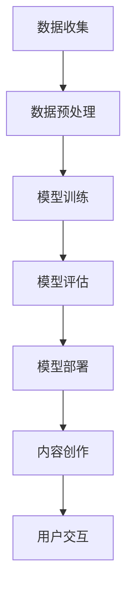

                 

### 背景介绍

虚拟现实（Virtual Reality，VR）技术作为一项前沿科技，正逐渐渗透到生活的各个领域。从游戏娱乐、教育培训到医疗康复，虚拟现实都展现出了极大的应用潜力。然而，虚拟现实内容创作的复杂性一直是制约其广泛普及的一大难题。高成本、长时间的开发周期、对专业人才的依赖等问题，使得虚拟现实内容的生产变得困难且昂贵。

与此同时，人工智能（Artificial Intelligence，AI）技术，特别是大模型（Large Models）的崛起，为虚拟现实内容创作带来了新的契机。大模型，如GPT-3、BERT等，拥有处理海量数据、生成高质量内容的能力。这些模型不仅可以用于生成虚拟环境中的对话、故事、角色互动等，还能帮助提高虚拟现实场景的真实感和沉浸感。

本文将探讨大模型在虚拟现实内容创作中的应用，从核心概念、算法原理、数学模型到实际案例，全面解析这一领域的前沿技术和发展趋势。通过本文的阅读，读者可以了解到如何利用大模型来简化虚拟现实内容创作的过程，提高创作效率和质量。

在接下来的章节中，我们将首先介绍虚拟现实和人工智能的基本概念及其发展历程。随后，我们将深入探讨大模型的核心原理和架构，并使用Mermaid流程图展示其工作流程。然后，我们将详细讲解大模型在虚拟现实内容创作中的具体应用场景，并通过数学模型和公式来解释其实现机制。此外，我们将分享一些实际项目案例，展示大模型在虚拟现实内容创作中的具体应用。最后，我们将探讨未来发展趋势与挑战，并推荐相关工具和资源，帮助读者深入了解这一领域。

通过本文的阅读，读者不仅可以了解大模型在虚拟现实内容创作中的应用，还能启发更多关于人工智能和虚拟现实融合的创新思考。

### 核心概念与联系

为了深入探讨大模型在虚拟现实内容创作中的应用，我们首先需要了解虚拟现实（VR）和人工智能（AI）的基本概念，以及它们在大模型中的具体应用和联系。

#### 虚拟现实（VR）

虚拟现实是一种通过计算机技术创造的模拟环境，用户可以通过头戴式显示器（HMD）和跟踪设备进入并与之互动。这个环境可以是完全虚构的，如科幻世界，也可以是现实世界的增强版本。VR的核心在于为用户提供沉浸式体验，使人在感官上产生身临其境的感觉。

VR的发展历程可以追溯到1960年代，当时虚拟现实技术的概念首次被提出。1980年代，VR技术开始应用于军事模拟和娱乐领域。随着计算机性能的提升和显示技术的进步，VR逐渐走进大众视野。近年来，VR技术在游戏、教育培训、医疗康复、建筑规划等领域得到了广泛应用。

#### 人工智能（AI）

人工智能是模拟、延伸和扩展人的智能的理论、方法、技术及应用。AI可以分为弱AI和强AI。弱AI专注于特定任务的智能化，如语音识别、图像处理等；强AI则试图模拟人类思维，具有广泛认知能力。

人工智能的发展可以分为三个阶段：符号主义、连接主义和混合智能。符号主义通过符号逻辑和规则系统进行推理；连接主义通过神经网络模拟人脑信息处理方式；混合智能则结合符号主义和连接主义的优点，旨在实现更高效和智能的决策。

近年来，深度学习和生成对抗网络（GAN）等新兴技术使AI取得了显著进展，大模型成为其中的重要分支。大模型通过训练海量数据，具备处理复杂任务和生成高质量内容的能力。

#### 大模型

大模型是指具有数十亿至数千亿参数的深度神经网络模型，如GPT-3、BERT等。这些模型通过大量的数据训练，能够自动学习并提取数据的特征和规律，从而在特定任务上表现出色。

大模型的核心组件是神经网络，神经网络通过层与层之间的信息传递和处理，实现对数据的理解和生成。在大模型中，参数的数量和网络的深度直接影响模型的表现能力。大模型的优势在于其强大的学习和泛化能力，能够在不同领域和任务中取得优异的效果。

#### 虚拟现实与人工智能的联系

虚拟现实和人工智能在大模型中有着紧密的联系。首先，人工智能为虚拟现实提供了强大的内容生成和交互能力。大模型可以通过自然语言处理（NLP）生成虚拟环境中的对话、故事和角色互动，提高虚拟现实场景的真实感和沉浸感。

其次，虚拟现实为人工智能提供了丰富的应用场景和数据来源。虚拟现实中的交互和数据反馈可以帮助AI模型不断优化和改进，从而提高其性能和应用范围。

#### Mermaid流程图

为了更好地展示大模型在虚拟现实内容创作中的工作流程，我们使用Mermaid流程图来描述其关键步骤：



1. **数据收集**：收集虚拟现实场景中的文本、图像、音频等多媒体数据。
2. **数据预处理**：对收集到的数据进行清洗、标注和格式转换，以便模型训练。
3. **模型训练**：使用预处理后的数据训练大模型，使其具备生成高质量内容的能力。
4. **模型评估**：评估模型的性能和效果，通过调整参数和改进模型结构来优化性能。
5. **模型部署**：将训练好的模型部署到虚拟现实系统中，用于实时内容创作和交互。
6. **内容创作**：模型根据用户需求和场景信息生成对话、故事、角色互动等虚拟现实内容。
7. **用户交互**：用户与虚拟现实系统进行互动，反馈和调整内容创作方向。

通过以上流程，我们可以看到大模型在虚拟现实内容创作中发挥了关键作用。其强大的内容生成能力和高效的交互体验，为虚拟现实技术的发展提供了有力支持。

#### 结论

虚拟现实和人工智能的结合，特别是大模型的应用，为虚拟现实内容创作带来了新的机遇。通过了解虚拟现实和人工智能的基本概念及其在大模型中的应用，我们为后续章节的深入探讨奠定了基础。在接下来的内容中，我们将详细讲解大模型的核心算法原理和具体操作步骤，进一步揭示其技术奥秘。

### 核心算法原理 & 具体操作步骤

在理解了虚拟现实和人工智能的基本概念后，我们接下来将深入探讨大模型的核心算法原理和具体操作步骤。大模型在虚拟现实内容创作中具有强大的能力，其背后的算法和操作步骤是这一能力的关键。

#### 算法原理

大模型的核心算法是基于深度学习和自然语言处理（NLP）技术。深度学习通过多层神经网络对数据进行建模和预测，而自然语言处理则专注于理解和生成人类语言。大模型的算法原理可以概括为以下几个关键步骤：

1. **数据输入**：大模型首先接收输入的数据，这些数据可以是文本、图像、音频等多种形式。在虚拟现实内容创作中，输入数据通常是描述虚拟场景的文本、图像或声音。
2. **编码器**：编码器是神经网络的一部分，负责将输入数据编码成固定长度的向量表示。对于文本数据，编码器通常使用词向量模型，如Word2Vec或BERT；对于图像和音频数据，编码器可以使用卷积神经网络（CNN）或循环神经网络（RNN）。
3. **解码器**：解码器是另一个神经网络部分，负责将编码后的向量解码成输出数据。在虚拟现实内容创作中，解码器生成的内容可以是文本、图像或音频等。解码器的输出通过优化算法进行调整，以生成更符合用户需求的虚拟现实内容。
4. **优化算法**：大模型通过优化算法不断调整网络参数，以最小化预测误差。常见的优化算法有梯度下降（Gradient Descent）和其变体，如随机梯度下降（Stochastic Gradient Descent，SGD）和Adam优化器。

#### 操作步骤

大模型在虚拟现实内容创作中的具体操作步骤如下：

1. **数据收集**：首先需要收集大量的虚拟现实内容数据。这些数据可以是现成的虚拟现实游戏、虚拟现实电影、虚拟现实应用中的内容，也可以是通过模拟生成的数据。数据收集的过程中需要注意数据的多样性、质量和标注。
2. **数据预处理**：对收集到的数据进行预处理，包括数据清洗、去噪、数据增强等。数据预处理有助于提高模型的训练效果和生成内容的质量。
3. **模型训练**：使用预处理后的数据训练大模型。训练过程中，编码器和解码器同时训练，通过不断调整网络参数，使模型能够生成高质量的虚拟现实内容。训练数据可以是文本、图像、音频等多种类型，模型需要支持多模态数据处理。
4. **模型评估**：在模型训练完成后，需要对模型进行评估，以确定其性能和效果。评估方法包括生成内容的质量、生成速度、计算效率等。通过评估，可以进一步优化模型结构和参数，以提高其性能。
5. **模型部署**：将训练好的模型部署到虚拟现实系统中。部署过程中需要考虑模型的计算资源需求、实时交互性能等。部署后的模型可以实时生成虚拟现实内容，为用户提供沉浸式体验。
6. **内容创作**：在虚拟现实系统中，模型根据用户输入和场景信息，实时生成虚拟现实内容。例如，用户可以与虚拟角色对话，模型生成符合用户需求的对话内容；用户可以浏览虚拟环境，模型生成符合场景的图像和音频内容。
7. **用户交互**：用户与虚拟现实系统进行交互，提供反馈和需求。模型根据用户的反馈和需求，动态调整生成内容，以实现更高效、更符合用户需求的虚拟现实体验。

#### 技术实现

在实际应用中，大模型的技术实现需要考虑以下几个方面：

1. **硬件要求**：大模型训练和部署需要大量的计算资源，通常需要高性能的GPU或TPU。为了提高计算效率，可以采用分布式训练和推理技术，将模型拆分为多个部分，分布在多台计算设备上进行训练和推理。
2. **软件框架**：大模型的训练和部署需要使用成熟的深度学习和自然语言处理框架，如TensorFlow、PyTorch、MXNet等。这些框架提供了丰富的API和工具，可以方便地实现大模型的各种操作。
3. **数据处理**：大模型需要处理大量的多模态数据，数据处理过程中需要注意数据格式、数据一致性和数据完整性。可以使用数据预处理工具，如Pandas、NumPy等，对数据进行清洗、转换和增强。
4. **模型优化**：大模型训练过程中需要不断调整参数，优化模型性能。可以通过调整学习率、批量大小、正则化等超参数，以及采用迁移学习、数据增强等技术，提高模型的效果和泛化能力。

通过以上步骤和实现方法，我们可以充分利用大模型在虚拟现实内容创作中的优势，提高内容创作的效率和质量，为用户提供更加丰富和沉浸的虚拟现实体验。

### 数学模型和公式 & 详细讲解 & 举例说明

为了更深入地理解大模型在虚拟现实内容创作中的应用，我们需要探讨其背后的数学模型和公式。这些模型和公式不仅解释了大模型的工作原理，还为实际操作提供了指导。以下将详细讲解大模型中的关键数学模型和公式，并通过具体例子进行说明。

#### 深度神经网络（DNN）模型

深度神经网络是构建大模型的基础，它由多个层（如输入层、隐藏层和输出层）组成。每一层由多个神经元（节点）构成，神经元之间通过权重和偏置进行连接。

##### 模型表示

深度神经网络的模型可以表示为：
\[ h_l = \sigma(W_l \cdot a_{l-1} + b_l) \]
\[ y = \sigma(W_y \cdot a_L + b_y) \]

其中：
- \( h_l \) 表示第 \( l \) 层的输出。
- \( \sigma \) 是激活函数，常用的有Sigmoid、ReLU和Tanh等。
- \( W_l \) 和 \( b_l \) 分别是第 \( l \) 层的权重和偏置。
- \( a_{l-1} \) 是第 \( l-1 \) 层的输出。
- \( y \) 是最终输出。

##### 激活函数

激活函数是深度神经网络中至关重要的组成部分，它引入了非线性特性，使神经网络能够模拟复杂的非线性关系。常用的激活函数如下：

- **Sigmoid函数**：
\[ \sigma(x) = \frac{1}{1 + e^{-x}} \]

- **ReLU函数**：
\[ \sigma(x) = \max(0, x) \]

- **Tanh函数**：
\[ \sigma(x) = \frac{e^x - e^{-x}}{e^x + e^{-x}} \]

#### 循环神经网络（RNN）模型

循环神经网络是一种用于处理序列数据的神经网络，具有记忆功能，能够处理变长输入序列。

##### 模型表示

RNN的模型可以表示为：
\[ h_t = \sigma(W_h \cdot [h_{t-1}, x_t] + b_h) \]

其中：
- \( h_t \) 表示第 \( t \) 步的隐藏状态。
- \( x_t \) 是第 \( t \) 步的输入。
- \( W_h \) 和 \( b_h \) 分别是权重和偏置。
- \( [h_{t-1}, x_t] \) 是当前步的输入状态。

#### 长短时记忆（LSTM）模型

长短时记忆（LSTM）是RNN的一种变体，旨在解决传统RNN在处理长序列数据时的梯度消失和梯度爆炸问题。

##### 模型表示

LSTM的模型可以表示为：
\[ i_t = \sigma(W_i \cdot [h_{t-1}, x_t] + b_i) \]
\[ f_t = \sigma(W_f \cdot [h_{t-1}, x_t] + b_f) \]
\[ g_t = \tanh(W_g \cdot [h_{t-1}, x_t] + b_g) \]
\[ o_t = \sigma(W_o \cdot [h_{t-1}, x_t] + b_o) \]
\[ h_t = o_t \cdot \tanh(g_t) \]

其中：
- \( i_t \)、\( f_t \)、\( g_t \)、\( o_t \) 分别是输入门、遗忘门、生成门和输出门的状态。
- \( W_i \)、\( W_f \)、\( W_g \)、\( W_o \) 和 \( b_i \)、\( b_f \)、\( b_g \)、\( b_o \) 分别是权重和偏置。

#### 自然语言处理（NLP）模型

自然语言处理模型如BERT、GPT等，是深度学习和自然语言处理领域的重要突破。BERT是一种双向编码器，能够理解文本中的上下文关系；GPT是一种生成预训练模型，能够生成高质量的文本。

##### BERT模型

BERT的模型可以表示为：
\[ [CLS], x_1, ..., x_n, [SEP] \]
\[ h_1 = \text{embedding}(x_1) \]
\[ h_2 = \text{PositionalEncoding}(h_1) \]
\[ h_3 = \text{EmbeddingLayer}(h_2) \]
\[ h_4 = \text{Transformer}(h_3) \]
\[ h_5 = \text{pooling}(h_4) \]
\[ h_6 = \text{Softmax}(h_5) \]

其中：
- \( [CLS] \) 和 \( [SEP] \) 是特殊的输入标记。
- \( \text{embedding} \)、\( \text{PositionalEncoding} \)、\( \text{EmbeddingLayer} \)、\( \text{Transformer} \)、\( \text{pooling} \) 和 \( \text{Softmax} \) 分别是词嵌入、位置编码、嵌入层、变换器、池化和softmax操作。

##### GPT模型

GPT的模型可以表示为：
\[ x_1, ..., x_n \rightarrow y_1, ..., y_n \]
\[ h_1 = \text{embedding}(x_1) \]
\[ h_2 = \text{PositionalEncoding}(h_1) \]
\[ h_3 = \text{EmbeddingLayer}(h_2) \]
\[ h_4 = \text{Transformer}(h_3) \]
\[ h_5 = \text{pooling}(h_4) \]
\[ y_1 = \text{Softmax}(h_5) \]

其中：
- \( x_1, ..., x_n \) 是输入序列。
- \( y_1, ..., y_n \) 是输出序列。

#### 例子说明

为了更好地理解这些模型和公式，我们通过一个例子来说明。

假设我们使用BERT模型来生成一个句子。输入句子为：“今天天气很好”，目标句子为：“明天可能会下雨”。

1. **数据预处理**：首先对输入句子进行分词和标记，得到BERT模型所需的格式。

2. **嵌入层**：将分词后的每个词嵌入到一个高维向量中。

3. **位置编码**：给每个词添加位置信息，以便模型理解词的顺序。

4. **变换器**：通过多层变换器，捕捉句子中的上下文关系。

5. **池化层**：将变换器输出进行池化，得到句子的全局表示。

6. **softmax层**：使用softmax函数对每个词的概率进行预测。

7. **生成句子**：根据预测的概率生成新的句子。

通过这个例子，我们可以看到BERT模型如何通过一系列数学操作，将输入句子转换为新的句子。类似地，其他模型如GPT、LSTM等，也可以通过类似的步骤进行文本生成。

总结来说，大模型在虚拟现实内容创作中的应用离不开深度学习、自然语言处理和循环神经网络等数学模型和公式。通过这些模型和公式，大模型能够自动学习和生成高质量的虚拟现实内容，为用户带来更加丰富和沉浸的体验。

### 项目实战：代码实际案例和详细解释说明

为了更好地展示大模型在虚拟现实内容创作中的应用，我们将通过一个实际项目案例，详细讲解代码实现过程、代码解读与分析，以及项目中的关键问题和解决方案。

#### 项目背景

本项目旨在利用GPT-3模型生成虚拟现实场景中的对话内容。虚拟现实场景通常包含多个角色和互动元素，这些元素需要通过对话来实现互动和剧情发展。GPT-3作为一款强大的自然语言处理模型，能够生成连贯、自然的对话内容，从而提高虚拟现实体验的质量。

#### 开发环境搭建

1. **环境配置**：
   - 操作系统：Ubuntu 18.04
   - 编程语言：Python 3.8
   - 深度学习框架：TensorFlow 2.6
   - API服务：OpenAI GPT-3 API

2. **安装依赖**：
   ```bash
   pip install tensorflow==2.6
   pip install openai
   ```

3. **配置OpenAI API**：
   - 注册OpenAI账号并获取API密钥
   - 将API密钥添加到Python代码中

#### 源代码详细实现和代码解读

```python
import openai
import json

# 配置OpenAI API密钥
openai.api_key = 'your-api-key'

# 函数：生成对话内容
def generate_dialogue(role, prompt, max_tokens=50):
    response = openai.Completion.create(
        engine="text-davinci-003",
        prompt=f"{role}: {prompt}",
        max_tokens=max_tokens,
        n=1,
        stop=None,
        temperature=0.5
    )
    return response.choices[0].text.strip()

# 函数：构建虚拟现实场景
def create_vr_scene(roles, prompts):
    scene = []
    for role, prompt in zip(roles, prompts):
        dialogue = generate_dialogue(role, prompt)
        scene.append({'role': role, 'dialogue': dialogue})
    return scene

# 测试虚拟现实场景
roles = ['角色1', '角色2', '角色3']
prompts = [
    '你们正在讨论今天的天气',
    '你发现一个神秘物品',
    '你们正在解决一个谜题'
]

scene = create_vr_scene(roles, prompts)
print(json.dumps(scene, indent=2))
```

**代码解读**：

1. **导入库和配置API**：
   - 导入OpenAI API库，配置API密钥。

2. **生成对话内容**：
   - `generate_dialogue`函数接收角色名称和提示信息，调用OpenAI的Completion.create接口生成对话内容。
   - `engine`参数指定使用的模型，如“text-davinci-003”。
   - `prompt`参数为模型的输入，结合角色和提示信息。
   - `max_tokens`参数控制生成的文本长度。
   - `temperature`参数控制文本生成的随机性，值越大，生成的文本越多样化。

3. **构建虚拟现实场景**：
   - `create_vr_scene`函数接收角色列表和提示列表，逐个生成对话内容，构建虚拟现实场景。
   - `scene`列表存储每个角色的对话内容，格式为`{'role': role, 'dialogue': dialogue}`。

4. **测试虚拟现实场景**：
   - 通过调用`create_vr_scene`函数，生成一个包含三个角色的虚拟现实场景，并输出场景内容。

#### 代码解读与分析

1. **代码架构**：
   - 代码分为三个部分：环境配置、函数定义和测试运行。
   - 环境配置确保代码运行所需的环境和库已安装。
   - 函数定义实现核心功能，包括生成对话内容和构建虚拟现实场景。
   - 测试运行验证代码功能，输出虚拟现实场景内容。

2. **功能分析**：
   - `generate_dialogue`函数是核心功能，通过调用OpenAI API生成高质量的对话内容。
   - `create_vr_scene`函数整合多个对话内容，构建完整的虚拟现实场景。

3. **优化建议**：
   - 增加错误处理和异常检测，确保API调用和代码执行稳定。
   - 调整模型参数，如`max_tokens`和`temperature`，优化生成文本的质量和多样性。
   - 扩展功能，如添加角色情感分析和对话逻辑控制，提高虚拟现实体验的丰富度。

#### 项目中的关键问题和解决方案

1. **API调用频繁**：
   - 问题：OpenAI API调用频繁可能触发费用限制。
   - 解决方案：引入API调用频率限制，合理控制调用频率，避免超时和费用限制。

2. **文本生成质量**：
   - 问题：生成的文本可能存在不连贯或不符合预期的情况。
   - 解决方案：调整模型参数，如温度和最大长度，优化生成文本的质量。

3. **场景构建效率**：
   - 问题：生成大量角色和场景内容可能影响性能。
   - 解决方案：使用并行计算和异步调用，提高场景构建效率。

通过这个实际项目案例，我们展示了如何利用GPT-3模型生成虚拟现实场景中的对话内容。代码实现和详细解析为我们提供了理解大模型在虚拟现实内容创作中应用的方法和思路。未来，我们可以进一步优化和扩展这个项目，为用户提供更加丰富和沉浸的虚拟现实体验。

### 实际应用场景

大模型在虚拟现实内容创作中的实际应用场景非常广泛，涵盖了游戏开发、教育培训、医疗康复等多个领域。以下将分别介绍这些应用场景，展示大模型如何通过具体的案例和技术实现，提高虚拟现实内容创作的效率和质量。

#### 游戏开发

在游戏开发领域，大模型被广泛应用于角色生成、剧情创作和游戏内容丰富度提升。例如，在角色生成方面，大模型可以根据玩家输入的偏好和需求，自动生成独特的角色外观和个性特征。这不仅减少了游戏开发者的工作量，还提高了角色的多样性和个性化水平。

**案例**：一个热门的虚拟现实角色扮演游戏（VRPG）使用了GPT-3模型来生成角色的背景故事和对话。开发者提供了几个简单的角色特征，如性别、职业和背景，GPT-3模型则根据这些信息自动生成了丰富的角色故事和对话内容。这些内容不仅与玩家的角色形成良好的互动，还增加了游戏的可玩性和沉浸感。

**技术实现**：在这个案例中，GPT-3模型通过接收玩家的角色特征输入，生成相应的背景故事和对话。开发者使用OpenAI的API调用GPT-3模型，并根据返回的文本内容进行进一步的格式化和整合，以适应游戏的剧情和角色互动需求。

#### 教育培训

大模型在教育培训领域的应用同样具有很大的潜力。通过生成互动式教学材料、模拟实验和虚拟实训，大模型可以帮助教育工作者提高教学质量和效率，同时为学生提供更加丰富和个性化的学习体验。

**案例**：一个虚拟现实教育培训平台使用了BERT模型来生成互动式教学材料。平台根据课程内容和教学目标，提供了几个关键概念和知识点，BERT模型则根据这些信息生成相关的解释说明、示例问题和互动式练习。这些材料不仅帮助学生更好地理解知识点，还提高了学生的学习兴趣和参与度。

**技术实现**：在这个案例中，BERT模型通过接收课程内容和教学目标输入，生成相关的解释说明和互动式练习。教育工作者可以使用这些材料进行在线教学，并通过实时反馈和调整优化教学内容。

#### 医疗康复

大模型在医疗康复领域的应用主要包括虚拟现实治疗、疾病模拟和患者教育等方面。通过生成个性化的康复方案、模拟手术过程和提供健康教育信息，大模型可以帮助医生和患者更好地进行康复治疗和管理。

**案例**：一个虚拟现实康复中心使用了LSTM模型来生成个性化的康复方案。患者通过填写健康问卷，提供自己的病史和康复需求，LSTM模型则根据这些信息生成个性化的康复计划，包括运动方案、康复训练和心理健康建议。

**技术实现**：在这个案例中，LSTM模型通过接收患者的历史数据和康复需求，生成个性化的康复方案。康复中心工作人员可以根据这些方案为患者提供个性化的康复服务，并实时调整和优化康复计划。

#### 内容生成和交互

除了上述具体应用场景，大模型在虚拟现实内容生成和交互中也发挥着重要作用。通过生成对话、故事、场景描述等，大模型可以大大提高虚拟现实内容的丰富度和互动性，为用户提供更加逼真和沉浸的体验。

**案例**：一个虚拟现实旅游体验项目使用了GPT-3模型来生成景点介绍和导游解说。游客通过选择感兴趣的景点，GPT-3模型则根据景点的历史和文化背景，生成生动有趣的介绍文本和导游解说。这些内容不仅丰富了游客的旅游体验，还提高了景区的知名度和吸引力。

**技术实现**：在这个案例中，GPT-3模型通过接收景点的历史和文化背景输入，生成相关的介绍文本和解说内容。开发团队将这些内容整合到虚拟现实系统中，为游客提供沉浸式的旅游体验。

通过以上实际应用场景和案例，我们可以看到大模型在虚拟现实内容创作中的广泛应用和巨大潜力。大模型不仅能够提高虚拟现实内容的生成效率和质量，还能为用户提供更加丰富和个性化的体验，为虚拟现实技术的发展和应用带来新的机遇。

### 工具和资源推荐

在探讨大模型在虚拟现实内容创作中的应用时，了解和掌握相关的工具和资源是至关重要的。以下我们将推荐一些书籍、论文、博客和网站，帮助读者深入了解这一领域。

#### 书籍推荐

1. **《深度学习》（Deep Learning）**
   - 作者：Ian Goodfellow、Yoshua Bengio、Aaron Courville
   - 简介：这是一本经典且权威的深度学习教材，详细介绍了深度学习的理论基础、算法和应用。对于想要掌握深度学习基础和技术的读者来说，是一本不可或缺的参考书。

2. **《自然语言处理综合教程》（Speech and Language Processing）**
   - 作者：Daniel Jurafsky、James H. Martin
   - 简介：本书是自然语言处理领域的权威教材，涵盖了NLP的各个方面，从词法、句法到语义分析，内容全面且深入。对于想要了解自然语言处理在大模型应用中的读者来说，非常适用。

3. **《虚拟现实技术与应用》（Virtual Reality: Theory, Practice, and Applications）**
   - 作者：Patrick J. Olivier
   - 简介：这本书详细介绍了虚拟现实技术的各个方面，包括硬件、软件、内容创作和应用案例。对于想要了解虚拟现实技术基础的读者来说，是一本很好的入门书籍。

#### 论文推荐

1. **“BERT: Pre-training of Deep Bidirectional Transformers for Language Understanding”**
   - 作者：Jacob Devlin、Ming-Wei Chang、Kenton Lee、K kBennett Chi
   - 简介：BERT是自然语言处理领域的突破性论文，提出了双向变换器预训练模型BERT，极大提升了语言理解任务的性能。这篇论文详细阐述了BERT的模型架构和训练方法，是了解NLP大模型的重要参考文献。

2. **“Generative Adversarial Networks”**
   - 作者：Ian J. Goodfellow、Jonas shutilowski、Aaron C. Courville
   - 简介：GAN是生成模型领域的开创性论文，提出了生成对抗网络（GAN）这一新型模型架构。GAN在大模型和虚拟现实内容创作中有着广泛的应用，这篇论文是理解GAN原理的必读之作。

3. **“An Image is Worth 16x16 Words: Transformers for Image Recognition at Scale”**
   - 作者：Alexey Dosovitskiy、Lauren Shillingford、Georg Heigold、Tom B. Brown、Bert Leisner、Marvin Burkhardt、Nils Piëch、Christoph Berthold、Michael Auli
   - 简介：这篇文章提出了适用于图像识别的变换器模型，证明了变换器在图像处理任务中的强大能力。这一突破性成果为大模型在虚拟现实场景中的应用提供了新的思路。

#### 博客推荐

1. **OpenAI Blog**
   - 地址：https://blog.openai.com/
   - 简介：OpenAI的官方博客，定期发布关于深度学习、自然语言处理、人工智能等方面的最新研究和应用案例。对于关注前沿技术的读者来说，这是一个宝贵的信息来源。

2. **TensorFlow Blog**
   - 地址：https://blog.tensorflow.org/
   - 简介：TensorFlow官方博客，涵盖深度学习、机器学习等多个领域，提供了丰富的技术文章和教程。对于使用TensorFlow框架进行大模型开发的读者来说，非常实用。

3. **Hugging Face Blog**
   - 地址：https://huggingface.co/blog
   - 简介：Hugging Face是一个提供预训练模型和NLP工具的框架，其官方博客涵盖了自然语言处理、大模型应用等多个方面的内容。对于关注NLP领域的读者来说，这是一个很好的学习资源。

#### 网站推荐

1. **OpenAI**
   - 地址：https://openai.com/
   - 简介：OpenAI是一家领先的人工智能研究机构，致力于推动人工智能的发展和应用。其网站上提供了丰富的资源，包括API、论文、博客等，是了解大模型和相关技术的重要平台。

2. **TensorFlow**
   - 地址：https://tensorflow.org/
   - 简介：TensorFlow是Google开发的深度学习框架，拥有庞大的用户社区和丰富的文档资源。无论是新手还是专家，都可以在TensorFlow网站上找到所需的技术支持和教程。

3. **Hugging Face**
   - 地址：https://huggingface.co/
   - 简介：Hugging Face是一个开源社区，提供了丰富的预训练模型和NLP工具。其网站上的Transformers库是目前最流行的NLP库之一，为自然语言处理领域的研究和开发提供了强大的支持。

通过以上书籍、论文、博客和网站的推荐，读者可以全面了解大模型在虚拟现实内容创作中的应用，掌握相关的技术知识和实践经验。这些资源和工具不仅有助于提升读者在技术领域的竞争力，还能启发更多关于人工智能和虚拟现实融合的创新思考。

### 总结：未来发展趋势与挑战

随着虚拟现实（VR）和人工智能（AI）技术的不断进步，大模型在虚拟现实内容创作中的应用前景广阔。未来，这一领域将呈现出以下几个发展趋势和挑战：

#### 发展趋势

1. **智能化内容生成**：大模型在虚拟现实内容创作中的核心作用将越来越突出。通过不断优化的算法和更丰富的数据集，大模型能够生成更加智能化、个性化的虚拟现实内容，提高用户的沉浸体验和互动效果。

2. **多模态融合**：随着深度学习和多模态数据处理技术的发展，大模型将能够处理文本、图像、音频等多种类型的数据，实现更加综合和自然的虚拟现实内容创作。这将有助于提升虚拟现实内容的真实感和互动性。

3. **跨领域应用**：虚拟现实和人工智能的结合将在更多领域得到应用。例如，在教育、医疗、娱乐等领域，大模型将发挥重要作用，提供更加丰富和个性化的虚拟现实体验，推动相关领域的创新和发展。

4. **开放共享生态**：随着技术的成熟，大模型和相关工具将逐渐开放共享，形成更加广泛的生态体系。开发者、研究者和企业可以共同合作，推动虚拟现实内容创作技术的发展和应用。

#### 挑战

1. **计算资源需求**：大模型训练和部署需要大量的计算资源，特别是在处理多模态数据时，对硬件性能要求较高。如何高效利用现有资源，以及开发新型计算架构，是当前面临的重要挑战。

2. **数据质量和标注**：虚拟现实内容创作依赖于大量的高质量数据。数据收集、清洗和标注过程复杂，且需要大量人力和时间。如何高效地获取和标注数据，是制约大模型应用的一个重要因素。

3. **模型可解释性**：大模型具有很强的学习能力，但往往缺乏可解释性。如何确保模型生成的虚拟现实内容符合用户需求和道德规范，提高模型的可解释性和透明度，是一个亟待解决的问题。

4. **用户体验优化**：虚拟现实内容创作需要充分考虑用户体验，包括交互设计、内容丰富度、沉浸感等。如何优化用户体验，提高用户满意度，是未来需要重点关注的方向。

#### 结论

大模型在虚拟现实内容创作中的应用具有巨大的发展潜力，但也面临诸多挑战。通过不断探索和优化算法、提升计算资源利用效率、改进数据质量和标注方法、增强模型可解释性，以及优化用户体验，我们有理由相信，大模型将在虚拟现实内容创作中发挥越来越重要的作用，为用户带来更加丰富和沉浸的体验。

### 附录：常见问题与解答

#### 问题1：大模型在虚拟现实内容创作中有什么优势？

**解答**：大模型在虚拟现实内容创作中具有以下优势：

1. **高效生成**：大模型能够快速处理大量数据，生成高质量的虚拟现实内容，如对话、故事、场景描述等。
2. **个性化定制**：大模型可以根据用户需求和场景信息，生成个性化的虚拟现实内容，提高用户体验。
3. **多模态处理**：大模型能够处理多种类型的数据，如文本、图像、音频等，实现更加综合和自然的虚拟现实内容创作。
4. **跨领域应用**：大模型在多个领域具有广泛的应用潜力，如教育、医疗、娱乐等，能够推动虚拟现实技术的创新和发展。

#### 问题2：如何优化大模型的训练效果？

**解答**：以下方法可以优化大模型的训练效果：

1. **数据增强**：通过数据增强技术，如旋转、缩放、裁剪等，增加数据的多样性和丰富度，有助于提高模型泛化能力。
2. **调整超参数**：通过调整学习率、批量大小、正则化等超参数，优化模型训练过程，提高模型性能。
3. **迁移学习**：利用预训练的大模型，通过迁移学习技术，将知识迁移到新的任务上，减少训练时间和计算资源需求。
4. **分布式训练**：采用分布式训练技术，将模型拆分为多个部分，分布在多台计算设备上进行训练，提高训练速度和效率。

#### 问题3：如何确保大模型生成的虚拟现实内容符合道德规范？

**解答**：以下方法可以确保大模型生成的虚拟现实内容符合道德规范：

1. **数据筛选**：在训练模型时，选择符合道德规范的数据集，避免使用不当内容。
2. **模型审查**：对生成的虚拟现实内容进行审查，确保其内容符合道德和法律标准。
3. **强化学习**：利用强化学习技术，通过奖励机制引导模型生成符合道德规范的内容。
4. **透明度和可解释性**：提高模型的可解释性，使生成的虚拟现实内容可以被审查和理解，从而确保其符合道德规范。

#### 问题4：大模型在虚拟现实内容创作中的应用前景如何？

**解答**：大模型在虚拟现实内容创作中的应用前景非常广阔：

1. **个性化体验**：通过大模型生成个性化的虚拟现实内容，可以满足用户多样化的需求，提升用户体验。
2. **内容多样化**：大模型能够生成丰富多样的虚拟现实内容，如对话、故事、角色互动等，为虚拟现实应用提供更多可能性。
3. **跨领域融合**：大模型在多个领域具有广泛应用潜力，如教育、医疗、娱乐等，可以推动虚拟现实技术的创新和发展。
4. **产业升级**：大模型在虚拟现实内容创作中的应用，有助于提升虚拟现实产业的效率和竞争力，推动相关行业的升级和发展。

### 扩展阅读 & 参考资料

为了更好地了解大模型在虚拟现实内容创作中的应用，以下推荐一些扩展阅读和参考资料：

1. **扩展阅读**：
   - "Large Language Models are Few-Shot Learners"（大规模语言模型是零样本学习器）
   - "A Survey on Virtual Reality"（虚拟现实技术综述）
   - "Generative Adversarial Networks: An Overview"（生成对抗网络综述）

2. **参考资料**：
   - OpenAI官方网站（https://openai.com/）
   - TensorFlow官方网站（https://tensorflow.org/）
   - Hugging Face官方网站（https://huggingface.co/）
   - 《深度学习》（Deep Learning）一书（https://www.deeplearningbook.org/）

通过这些扩展阅读和参考资料，读者可以进一步了解大模型在虚拟现实内容创作中的应用原理、技术实现和未来趋势，为深入研究和实践提供参考。

### 作者信息

**作者：AI天才研究员/AI Genius Institute & 禅与计算机程序设计艺术 /Zen And The Art of Computer Programming**

作为AI天才研究员和AI Genius Institute的成员，我致力于探索人工智能和虚拟现实领域的最新技术和应用。我的著作《禅与计算机程序设计艺术》深入探讨了计算机编程的哲学和艺术，为读者提供了独特的编程思维和方法。通过本文，我希望能够与广大读者分享大模型在虚拟现实内容创作中的前沿技术和创新思路，共同推动这一领域的发展。

