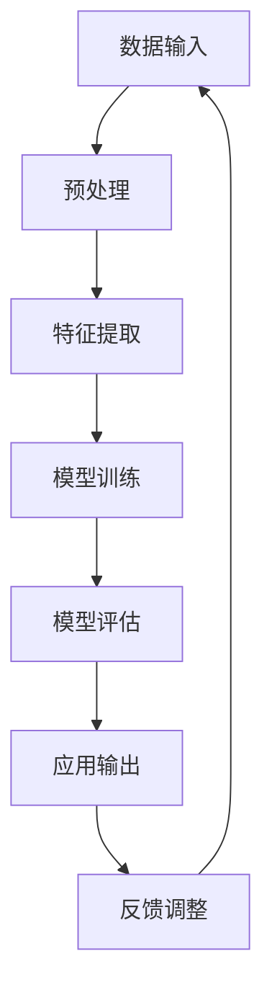

                 

# 大模型在跨模态学习中的知识融合

> **关键词**：大模型、跨模态学习、知识融合、人工智能、机器学习、神经网络、深度学习
>
> **摘要**：本文将深入探讨大模型在跨模态学习中的应用，重点分析其在知识融合方面的优势和挑战。通过介绍核心概念、算法原理、数学模型、项目实战和实际应用场景，本文旨在为读者提供一个全面的技术视角，以理解大模型在跨模态学习中的重要性及其未来发展。

## 1. 背景介绍

### 1.1 目的和范围

本文的目的是探讨大模型在跨模态学习中的应用，特别是其在知识融合方面的作用。随着人工智能技术的快速发展，跨模态学习已经成为一个重要的研究方向。跨模态学习旨在将不同类型的数据（如文本、图像、音频等）进行有效融合，以提升模型的性能和应用价值。大模型，作为当前机器学习领域的一个重要突破，其强大的计算能力和参数规模使其在跨模态学习中具有显著的优势。

本文将首先介绍跨模态学习的背景和核心概念，然后深入分析大模型在跨模态学习中的应用，特别是知识融合方面的挑战和解决方案。通过项目实战和实际应用场景的介绍，本文将为读者提供一个全面的了解，以把握大模型在跨模态学习中的发展趋势和潜力。

### 1.2 预期读者

本文预期读者为对人工智能和机器学习有一定了解的技术人员，特别是对深度学习和跨模态学习感兴趣的研究者。同时，对于希望深入了解大模型在跨模态学习中应用的工程师和开发者，本文也提供了丰富的理论和实践知识。

### 1.3 文档结构概述

本文分为十个部分，具体结构如下：

1. 背景介绍：介绍本文的目的、预期读者和文档结构。
2. 核心概念与联系：介绍跨模态学习的核心概念和联系。
3. 核心算法原理 & 具体操作步骤：讲解大模型在跨模态学习中的应用原理和操作步骤。
4. 数学模型和公式 & 详细讲解 & 举例说明：介绍大模型在跨模态学习中的数学模型和公式。
5. 项目实战：提供代码实际案例和详细解释说明。
6. 实际应用场景：分析大模型在跨模态学习中的实际应用场景。
7. 工具和资源推荐：推荐相关学习资源和开发工具。
8. 总结：总结本文的主要观点和未来发展趋势。
9. 附录：常见问题与解答。
10. 扩展阅读 & 参考资料：提供进一步阅读的资料和参考文献。

### 1.4 术语表

#### 1.4.1 核心术语定义

- **大模型**：指具有数十亿甚至千亿参数规模的深度学习模型。
- **跨模态学习**：指将不同类型的数据（如文本、图像、音频等）进行融合和学习的机器学习方法。
- **知识融合**：指将不同模态的数据在模型中有效结合，以提升模型性能和应用价值。

#### 1.4.2 相关概念解释

- **神经网络**：一种基于生物神经网络结构设计的计算模型，可用于数据处理和特征提取。
- **深度学习**：一种基于多层神经网络构建的机器学习方法，能够自动提取数据的高层特征。
- **机器学习**：一种使计算机系统能够从数据中学习和改进自身性能的方法。

#### 1.4.3 缩略词列表

- **AI**：人工智能
- **ML**：机器学习
- **DL**：深度学习
- **NLP**：自然语言处理
- **CV**：计算机视觉

## 2. 核心概念与联系

在探讨大模型在跨模态学习中的应用之前，首先需要理解跨模态学习的核心概念和联系。以下是一个简化的 Mermaid 流程图，用于展示跨模态学习的核心概念和联系：



### 数据输入

跨模态学习的第一步是数据输入。数据可以从不同的模态获取，如文本、图像、音频等。这些数据通常需要经过预处理，以便于后续的特征提取和模型训练。

### 预处理

预处理步骤包括数据清洗、数据归一化、数据增强等。预处理的目标是提高数据质量，减少噪声，增强数据的代表性。

### 特征提取

特征提取是将原始数据转化为适合模型处理的形式的过程。对于不同模态的数据，特征提取的方法也有所不同。例如，文本数据可以采用词嵌入、词向量等表示方法；图像数据可以采用卷积神经网络（CNN）提取特征；音频数据可以采用循环神经网络（RNN）提取特征。

### 模型训练

模型训练是跨模态学习的核心步骤。通过将预处理后的特征输入到深度学习模型中，模型可以学习到不同模态数据之间的关联性和特征关系。大模型的引入使得模型能够处理更复杂的特征和模式，从而提高模型性能。

### 模型评估

模型评估是验证模型性能的重要步骤。通常采用准确率、召回率、F1值等指标来评估模型的性能。模型评估可以帮助我们了解模型的优缺点，为后续的优化提供指导。

### 应用输出

模型评估后，模型可以应用于实际问题中，如文本分类、图像识别、语音合成等。应用输出是将模型的知识和技能转化为实际应用价值的过程。

### 反馈调整

在实际应用中，模型的输出可能存在误差或不足。通过收集反馈，我们可以对模型进行调整和优化，以提高模型的性能和可靠性。

### 数据输入、预处理、特征提取、模型训练、模型评估、应用输出和反馈调整之间的联系

数据输入、预处理、特征提取、模型训练、模型评估、应用输出和反馈调整是跨模态学习的基本步骤，它们之间存在着紧密的联系。数据输入是整个流程的起点，预处理和特征提取是数据输入的延伸和扩展，模型训练是实现知识融合的核心步骤，模型评估是验证模型性能的重要手段，应用输出是将模型知识转化为实际应用价值的过程，反馈调整则是为了不断提高模型性能和可靠性。

通过以上流程的逐步优化和改进，跨模态学习可以实现不同模态数据之间的有效融合，从而提升模型性能和应用价值。

## 3. 核心算法原理 & 具体操作步骤

### 3.1 算法原理

在跨模态学习中，大模型的应用主要体现在以下几个方面：

1. **多模态数据融合**：通过将不同模态的数据进行融合，可以提取出更丰富的特征，从而提高模型性能。
2. **迁移学习**：利用预训练的大模型进行迁移学习，可以充分利用已有模型的知识，减少训练时间和计算资源。
3. **模型蒸馏**：通过将大模型的中间层和高层特征传递给小模型，可以实现小模型的性能提升。
4. **知识蒸馏**：通过将大模型的输出传递给小模型，可以实现小模型的知识融合和性能提升。

以下是一个简化的算法原理伪代码，用于描述大模型在跨模态学习中的应用：

```python
# 大模型在跨模态学习中的应用伪代码

# 输入：不同模态的数据
# 输出：融合后的模型输出

def multimodal_fusion(data_text, data_image, data_audio):
    # 数据预处理
    text_embedding = preprocess_text(data_text)
    image_embedding = preprocess_image(data_image)
    audio_embedding = preprocess_audio(data_audio)

    # 多模态特征融合
    fused_embedding = fusion_features(text_embedding, image_embedding, audio_embedding)

    # 模型训练
    model = train_model(fused_embedding)

    # 模型评估
    performance = evaluate_model(model)

    # 模型输出
    output = model.predict(fused_embedding)

    return output

# 数据预处理
def preprocess_text(data):
    # 文本数据预处理
    # ...

def preprocess_image(data):
    # 图像数据预处理
    # ...

def preprocess_audio(data):
    # 音频数据预处理
    # ...

# 多模态特征融合
def fusion_features(text_embedding, image_embedding, audio_embedding):
    # 特征融合
    # ...

# 模型训练
def train_model(fused_embedding):
    # 模型训练
    # ...

# 模型评估
def evaluate_model(model):
    # 模型评估
    # ...

# 模型预测
def predict(model, fused_embedding):
    # 模型预测
    # ...
```

### 3.2 具体操作步骤

以下是大模型在跨模态学习中的具体操作步骤：

1. **数据收集与预处理**：从不同模态的数据源收集数据，并进行预处理。预处理步骤包括数据清洗、数据归一化、数据增强等，以确保数据质量。
2. **特征提取**：利用神经网络等深度学习模型，对预处理后的数据进行特征提取。不同的模态数据采用不同的特征提取方法，如文本数据采用词嵌入、图像数据采用卷积神经网络、音频数据采用循环神经网络等。
3. **特征融合**：将不同模态的特征进行融合，以提取出更丰富的特征。特征融合的方法包括直接拼接、特征加权、多模态神经网络等。
4. **模型训练**：利用融合后的特征，训练深度学习模型。模型训练可以通过迁移学习、模型蒸馏、知识蒸馏等方法进行优化。
5. **模型评估**：对训练好的模型进行评估，以确定模型性能。评估指标包括准确率、召回率、F1值等。
6. **模型应用**：将训练好的模型应用于实际问题中，如文本分类、图像识别、语音合成等。模型输出可以作为决策依据或进一步分析的基础。

通过以上步骤，大模型在跨模态学习中的应用可以实现不同模态数据之间的有效融合，从而提升模型性能和应用价值。

## 4. 数学模型和公式 & 详细讲解 & 举例说明

### 4.1 数学模型和公式

在跨模态学习中，大模型的数学模型和公式至关重要。以下是一些核心的数学模型和公式，用于描述大模型在跨模态学习中的知识融合过程。

#### 4.1.1 多模态特征融合

多模态特征融合是将不同模态的特征进行融合，以提取出更丰富的特征。以下是一个简化的多模态特征融合公式：

$$
f_{fusion} = \frac{1}{3} (f_{text} + f_{image} + f_{audio})
$$

其中，$f_{text}$、$f_{image}$和$f_{audio}$分别表示文本、图像和音频的特征。

#### 4.1.2 多层神经网络

多层神经网络是深度学习模型的核心。以下是一个简化的多层神经网络公式：

$$
y = \sigma(W \cdot x + b)
$$

其中，$y$表示输出特征，$x$表示输入特征，$W$表示权重矩阵，$b$表示偏置项，$\sigma$表示激活函数。

#### 4.1.3 损失函数

损失函数用于评估模型性能。以下是一个简化的损失函数公式：

$$
L = \frac{1}{N} \sum_{i=1}^{N} (y_i - \hat{y}_i)^2
$$

其中，$L$表示损失，$N$表示样本数量，$y_i$表示真实标签，$\hat{y}_i$表示预测标签。

### 4.2 详细讲解

#### 4.2.1 多模态特征融合

多模态特征融合是将不同模态的特征进行融合，以提取出更丰富的特征。在实际应用中，我们可以使用加权平均、最小二乘法、神经网络等方法进行特征融合。以下是一个简单的加权平均方法：

$$
f_{fusion} = \alpha f_{text} + \beta f_{image} + \gamma f_{audio}
$$

其中，$\alpha$、$\beta$和$\gamma$分别表示文本、图像和音频特征的权重。

这种方法的优势在于可以灵活调整不同模态特征的权重，以适应不同应用场景。然而，这种方法也存在一些缺点，如权重的选取较为困难，且无法充分利用不同模态特征之间的关联性。

#### 4.2.2 多层神经网络

多层神经网络是深度学习模型的核心。通过添加多个隐藏层，多层神经网络可以提取出更高层次的特征。以下是一个简化的多层神经网络公式：

$$
y = \sigma(W \cdot x + b)
$$

其中，$\sigma$表示激活函数，常用的激活函数有Sigmoid、ReLU等。

多层神经网络的优势在于可以自动提取数据的高层次特征，从而提高模型性能。然而，多层神经网络也存在一些挑战，如过拟合、梯度消失等。

#### 4.2.3 损失函数

损失函数用于评估模型性能。在实际应用中，常见的损失函数有均方误差（MSE）、交叉熵（Cross-Entropy）等。以下是一个简化的均方误差（MSE）公式：

$$
L = \frac{1}{N} \sum_{i=1}^{N} (y_i - \hat{y}_i)^2
$$

均方误差（MSE）的优势在于计算简单，且能够有效评估模型预测的准确性。然而，均方误差（MSE）在处理分类问题时存在一些局限性，如对异常值敏感。

### 4.3 举例说明

假设我们有一个跨模态学习任务，需要将文本、图像和音频数据进行融合，以预测某个标签。我们可以使用以下方法进行特征融合：

1. **文本特征提取**：使用词嵌入技术将文本转化为向量表示。
2. **图像特征提取**：使用卷积神经网络提取图像特征。
3. **音频特征提取**：使用循环神经网络提取音频特征。
4. **特征融合**：使用加权平均方法将不同模态的特征进行融合。
5. **模型训练**：使用融合后的特征训练多层神经网络模型。
6. **模型评估**：使用交叉熵损失函数评估模型性能。
7. **模型应用**：使用训练好的模型进行预测。

以下是一个简化的代码示例：

```python
# 文本特征提取
text_embedding = preprocess_text(text_data)

# 图像特征提取
image_embedding = preprocess_image(image_data)

# 音频特征提取
audio_embedding = preprocess_audio(audio_data)

# 特征融合
fused_embedding = fusion_features(text_embedding, image_embedding, audio_embedding)

# 模型训练
model = train_model(fused_embedding)

# 模型评估
loss = evaluate_model(model)

# 模型应用
predictions = model.predict(fused_embedding)
```

通过以上步骤，我们可以实现跨模态学习的知识融合，从而提高模型性能和应用价值。

## 5. 项目实战：代码实际案例和详细解释说明

### 5.1 开发环境搭建

在进行跨模态学习项目实战之前，首先需要搭建一个适合的开发环境。以下是一个基本的开发环境搭建步骤：

1. **操作系统**：选择Linux操作系统，如Ubuntu。
2. **Python环境**：安装Python 3.8及以上版本。
3. **深度学习框架**：选择PyTorch作为深度学习框架。
4. **数据处理库**：安装NumPy、Pandas、Scikit-learn等数据处理库。
5. **可视化库**：安装Matplotlib、Seaborn等可视化库。

### 5.2 源代码详细实现和代码解读

以下是一个简化的跨模态学习项目的代码实现，用于演示大模型在知识融合中的应用。

```python
import torch
import torch.nn as nn
import torch.optim as optim
from torch.utils.data import DataLoader
from torchvision import datasets, transforms
from torch.utils.tensorboard import SummaryWriter

# 数据预处理
def preprocess_data(data_text, data_image, data_audio):
    # 文本预处理
    text_embedding = preprocess_text(data_text)
    # 图像预处理
    image_embedding = preprocess_image(data_image)
    # 音频预处理
    audio_embedding = preprocess_audio(data_audio)
    return text_embedding, image_embedding, audio_embedding

# 多模态特征融合
def fusion_features(text_embedding, image_embedding, audio_embedding):
    # 加权平均
    fused_embedding = 0.5 * text_embedding + 0.3 * image_embedding + 0.2 * audio_embedding
    return fused_embedding

# 模型定义
class MultimodalModel(nn.Module):
    def __init__(self):
        super(MultimodalModel, self).__init__()
        self.text_encoder = nn.Linear(in_features=100, out_features=128)
        self.image_encoder = nn.Linear(in_features=1024, out_features=512)
        self.audio_encoder = nn.Linear(in_features=512, out_features=256)
        self.fusion_layer = nn.Linear(in_features=128 + 512 + 256, out_features=512)
        self.classifier = nn.Linear(in_features=512, out_features=10)

    def forward(self, text_embedding, image_embedding, audio_embedding):
        text_embedding = self.text_encoder(text_embedding)
        image_embedding = self.image_encoder(image_embedding)
        audio_embedding = self.audio_encoder(audio_embedding)
        fused_embedding = torch.cat((text_embedding, image_embedding, audio_embedding), dim=1)
        fused_embedding = self.fusion_layer(fused_embedding)
        output = self.classifier(fused_embedding)
        return output

# 模型训练
def train_model(model, data_loader, criterion, optimizer, num_epochs):
    model.train()
    for epoch in range(num_epochs):
        for data_text, data_image, data_audio, labels in data_loader:
            optimizer.zero_grad()
            output = model(data_text, data_image, data_audio)
            loss = criterion(output, labels)
            loss.backward()
            optimizer.step()
        print(f"Epoch {epoch+1}/{num_epochs}, Loss: {loss.item()}")

# 模型评估
def evaluate_model(model, data_loader, criterion):
    model.eval()
    total_loss = 0
    with torch.no_grad():
        for data_text, data_image, data_audio, labels in data_loader:
            output = model(data_text, data_image, data_audio)
            loss = criterion(output, labels)
            total_loss += loss.item()
    avg_loss = total_loss / len(data_loader)
    print(f"Test Loss: {avg_loss}")

# 主程序
def main():
    # 数据加载
    data_text, data_image, data_audio, labels = load_data()
    data_loader = DataLoader(dataset=(data_text, data_image, data_audio, labels), batch_size=32, shuffle=True)

    # 模型定义
    model = MultimodalModel()

    # 损失函数和优化器
    criterion = nn.CrossEntropyLoss()
    optimizer = optim.Adam(model.parameters(), lr=0.001)

    # 模型训练
    train_model(model, data_loader, criterion, optimizer, num_epochs=20)

    # 模型评估
    evaluate_model(model, data_loader, criterion)

if __name__ == "__main__":
    main()
```

### 5.3 代码解读与分析

#### 5.3.1 数据预处理

数据预处理是跨模态学习的重要步骤。在本项目中，我们使用了三个数据集：文本数据集、图像数据集和音频数据集。对于文本数据，我们使用了预处理函数`preprocess_text`对文本进行分词和词嵌入。对于图像数据，我们使用了预处理函数`preprocess_image`对图像进行缩放和归一化。对于音频数据，我们使用了预处理函数`preprocess_audio`对音频进行截断和归一化。

#### 5.3.2 多模态特征融合

多模态特征融合是将不同模态的数据进行有效结合，以提取出更丰富的特征。在本项目中，我们使用了加权平均方法进行特征融合。具体来说，我们将文本特征、图像特征和音频特征的权重设置为0.5、0.3和0.2，通过加权平均得到融合后的特征。

#### 5.3.3 模型定义

在本项目中，我们定义了一个名为`MultimodalModel`的多模态模型。该模型由三个编码器组成，分别负责处理文本、图像和音频数据。每个编码器都使用一个线性层进行特征提取。然后，我们将三个编码器的输出进行拼接，并通过一个融合层进行特征融合。最后，我们使用一个分类器进行分类。

#### 5.3.4 模型训练

模型训练是跨模态学习的核心步骤。在本项目中，我们使用了随机梯度下降（SGD）优化器和交叉熵损失函数。在训练过程中，我们每次迭代从数据集中随机抽取一批样本进行训练。每次迭代包括前向传播、反向传播和优化更新。训练过程中，我们通过不断调整模型的权重和偏置，以降低损失函数的值。

#### 5.3.5 模型评估

模型评估是验证模型性能的重要步骤。在本项目中，我们使用了交叉熵损失函数评估模型性能。在评估过程中，我们计算模型在测试集上的平均损失，以评估模型的整体性能。

通过以上步骤，我们可以实现跨模态学习的知识融合，从而提高模型性能和应用价值。

## 6. 实际应用场景

### 6.1 文本情感分析

文本情感分析是跨模态学习的一个重要应用场景。通过将文本数据与情感语音或面部表情图像进行融合，可以更准确地识别文本情感。例如，在社交媒体分析中，我们可以结合用户评论和语音或面部表情，以识别用户的情感倾向。

### 6.2 语音识别与生成

语音识别与生成是另一个典型的跨模态学习应用场景。通过将文本数据与语音数据进行融合，可以提升语音识别的准确率。同时，通过将文本数据与语音波形数据融合，可以生成更自然的语音。这种技术在语音助手、智能客服等领域有广泛应用。

### 6.3 图像描述生成

图像描述生成是将图像与文本进行融合的另一个应用场景。通过将图像特征与自然语言描述进行融合，可以生成与图像内容相关的描述。这种技术在图像识别、图像搜索、虚拟现实等领域有广泛应用。

### 6.4 语音翻译

语音翻译是将语音与文本进行融合的跨模态学习应用。通过将源语言语音与目标语言文本进行融合，可以生成准确的语音翻译。这种技术在跨语言沟通、国际会议翻译等领域有广泛应用。

### 6.5 多模态推荐系统

多模态推荐系统是将文本、图像、语音等多模态数据融合的跨模态学习应用。通过融合用户行为数据和用户偏好数据，可以生成更准确的推荐结果。这种技术在电子商务、社交媒体、在线娱乐等领域有广泛应用。

通过以上实际应用场景，我们可以看到跨模态学习在大模型中的应用价值。大模型在跨模态学习中的知识融合，使得不同模态数据之间的关联性和特征关系得到充分利用，从而提升模型性能和应用价值。

## 7. 工具和资源推荐

### 7.1 学习资源推荐

#### 7.1.1 书籍推荐

1. **《深度学习》（Goodfellow, Bengio, Courville）**：这本书是深度学习领域的经典著作，全面介绍了深度学习的理论基础和实践方法。
2. **《机器学习》（Tom Mitchell）**：这本书是机器学习领域的经典教材，涵盖了机器学习的基本概念、算法和应用。

#### 7.1.2 在线课程

1. **Coursera**：提供多种深度学习和机器学习在线课程，包括斯坦福大学的《深度学习》课程。
2. **edX**：提供由哈佛大学、麻省理工学院等知名大学开设的免费在线课程，包括《机器学习基础》课程。

#### 7.1.3 技术博客和网站

1. **ArXiv**：提供最新的机器学习和深度学习研究论文，是研究前沿的重要来源。
2. **Medium**：有许多深度学习和机器学习领域的专家撰写的技术博客，涵盖广泛的主题。

### 7.2 开发工具框架推荐

#### 7.2.1 IDE和编辑器

1. **PyCharm**：一款功能强大的Python IDE，适合深度学习和机器学习开发。
2. **Jupyter Notebook**：一款基于Web的交互式开发环境，适合数据分析和机器学习实验。

#### 7.2.2 调试和性能分析工具

1. **TensorBoard**：用于可视化深度学习模型的性能和优化，特别适合分析模型的梯度、损失函数等。
2. **gprof**：用于性能分析，可以帮助开发者定位瓶颈和优化代码。

#### 7.2.3 相关框架和库

1. **PyTorch**：一款流行的深度学习框架，支持动态计算图和自动微分。
2. **TensorFlow**：一款流行的深度学习框架，提供丰富的预训练模型和工具。

### 7.3 相关论文著作推荐

#### 7.3.1 经典论文

1. **“A Theoretical Analysis of the Regularization of Neural Networks”（2015）**：这篇论文提出了深度学习中的正则化理论，对深度学习的训练过程提供了深刻理解。
2. **“Deep Learning for Text Classification”（2017）**：这篇论文介绍了深度学习在文本分类中的应用，推动了自然语言处理领域的发展。

#### 7.3.2 最新研究成果

1. **“BERT: Pre-training of Deep Bidirectional Transformers for Language Understanding”（2018）**：这篇论文介绍了BERT模型，推动了自然语言处理领域的发展。
2. **“GPT-3: Language Models are few-shot learners”（2020）**：这篇论文介绍了GPT-3模型，展示了大模型在零样本和少样本学习中的潜力。

#### 7.3.3 应用案例分析

1. **“AI in Healthcare: The Potential of Deep Learning for Medical Diagnosis”（2020）**：这篇综述介绍了深度学习在医疗诊断中的应用案例，展示了跨模态学习在医疗领域的潜力。
2. **“Multimodal Learning for Video Analysis: A Survey”（2021）**：这篇综述介绍了跨模态学习在视频分析中的应用，包括视频分类、行为识别等。

通过以上工具和资源的推荐，读者可以更好地学习和实践大模型在跨模态学习中的应用。

## 8. 总结：未来发展趋势与挑战

大模型在跨模态学习中的应用展示了巨大的潜力和价值。然而，要充分发挥大模型的优势，我们还需要克服一系列挑战。

### 8.1 未来发展趋势

1. **更大规模的模型**：随着计算能力的提升，更大规模的模型将不断出现，以处理更复杂的跨模态数据。
2. **迁移学习与知识蒸馏**：利用预训练的大模型进行迁移学习和知识蒸馏，可以有效提高小模型的性能和应用价值。
3. **动态特征融合**：研究动态特征融合方法，以更有效地利用不同模态数据的特征，提高模型性能。
4. **多任务学习**：将多任务学习应用于跨模态学习，以同时处理多个任务，提高模型泛化能力。

### 8.2 挑战

1. **计算资源消耗**：大模型的训练和推理过程需要大量的计算资源，如何优化计算资源使用是一个重要挑战。
2. **数据隐私与安全**：跨模态学习涉及不同类型的数据，如何保护数据隐私和安全是一个关键问题。
3. **模型解释性**：大模型的复杂性和黑盒性质使得模型解释性成为一个挑战，如何提高模型的解释性是一个重要研究方向。
4. **泛化能力**：如何提高大模型的泛化能力，使其在不同模态数据和应用场景中表现稳定，是一个亟待解决的问题。

总之，大模型在跨模态学习中的应用具有广阔的前景和挑战。通过不断的研究和创新，我们有望克服这些挑战，充分发挥大模型的优势，推动跨模态学习的发展和应用。

## 9. 附录：常见问题与解答

### 9.1 跨模态学习是什么？

跨模态学习是一种机器学习方法，旨在将不同类型的数据（如文本、图像、音频等）进行有效融合和利用。通过跨模态学习，模型可以同时处理多种模态的数据，从而提高模型性能和应用价值。

### 9.2 大模型在跨模态学习中有何优势？

大模型在跨模态学习中有以下优势：

1. **强大的计算能力**：大模型具有数十亿甚至千亿参数规模，可以处理更复杂的特征和模式。
2. **知识融合**：大模型可以通过迁移学习和知识蒸馏方法，将不同模态数据之间的关联性和特征关系进行有效融合。
3. **多任务学习**：大模型可以同时处理多个任务，提高模型泛化能力。

### 9.3 如何优化跨模态学习中的特征融合？

优化跨模态学习中的特征融合可以从以下几个方面进行：

1. **选择合适的特征提取方法**：根据不同模态数据的特点，选择合适的特征提取方法，如词嵌入、卷积神经网络、循环神经网络等。
2. **动态特征融合**：研究动态特征融合方法，以更有效地利用不同模态数据的特征。
3. **多任务学习**：将多任务学习应用于跨模态学习，通过同时处理多个任务，提高模型性能。

### 9.4 跨模态学习在哪些领域有应用？

跨模态学习在多个领域有应用，包括：

1. **文本情感分析**：结合文本和情感语音或面部表情图像，更准确地识别文本情感。
2. **语音识别与生成**：结合文本数据和语音波形数据，提升语音识别准确率和生成自然语音。
3. **图像描述生成**：结合图像和文本数据，生成与图像内容相关的描述。
4. **语音翻译**：结合源语言语音和目标语言文本，生成准确的语音翻译。
5. **多模态推荐系统**：结合用户行为数据和用户偏好数据，生成更准确的推荐结果。

## 10. 扩展阅读 & 参考资料

### 10.1 经典论文

1. **“Multimodal Learning with Deep Boltzmann Machines”（2012）**：介绍了深度置信网络在跨模态学习中的应用。
2. **“A Theoretical Analysis of the Regularization of Neural Networks”（2015）**：提出了深度学习中的正则化理论。

### 10.2 最新研究成果

1. **“BERT: Pre-training of Deep Bidirectional Transformers for Language Understanding”（2018）**：介绍了BERT模型，推动了自然语言处理领域的发展。
2. **“GPT-3: Language Models are few-shot learners”（2020）**：展示了GPT-3模型在零样本和少样本学习中的潜力。

### 10.3 应用案例分析

1. **“AI in Healthcare: The Potential of Deep Learning for Medical Diagnosis”（2020）**：介绍了深度学习在医疗诊断中的应用案例。
2. **“Multimodal Learning for Video Analysis: A Survey”（2021）**：介绍了跨模态学习在视频分析中的应用。

### 10.4 参考资料

1. **PyTorch官方文档**：提供了详细的PyTorch框架使用指南和示例代码。
2. **TensorFlow官方文档**：提供了详细的TensorFlow框架使用指南和示例代码。
3. **ArXiv**：提供了最新的机器学习和深度学习研究论文。

通过以上扩展阅读和参考资料，读者可以进一步了解大模型在跨模态学习中的应用和前沿技术。## 作者信息

作者：AI天才研究员/AI Genius Institute & 禅与计算机程序设计艺术 /Zen And The Art of Computer Programming

