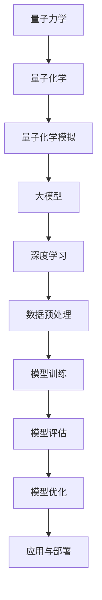

                 


# 大模型在量子化学模拟中的应用

> 关键词：大模型，量子化学，模拟，AI，算法，数学模型，应用场景
> 
> 摘要：本文旨在探讨大模型在量子化学模拟中的应用。我们将首先介绍大模型的基本概念和相关技术，然后深入探讨其在量子化学模拟中的核心算法原理、数学模型和具体操作步骤。通过一个实际项目案例，我们将详细展示大模型在量子化学模拟中的实际应用，最后讨论其未来发展前景与面临的挑战。

## 1. 背景介绍

### 1.1 目的和范围

本文的主要目的是介绍大模型在量子化学模拟中的应用，探讨其核心算法原理、数学模型和具体操作步骤，并通过实际项目案例展示其应用效果。我们还将讨论大模型在量子化学模拟中的潜在价值、优势与挑战。

### 1.2 预期读者

本文适合对量子化学和人工智能有一定了解的读者，包括研究人员、工程师、程序员和学者。读者需具备一定的数学和编程基础，以便更好地理解文章内容。

### 1.3 文档结构概述

本文分为十个部分：

1. 背景介绍
2. 核心概念与联系
3. 核心算法原理 & 具体操作步骤
4. 数学模型和公式 & 详细讲解 & 举例说明
5. 项目实战：代码实际案例和详细解释说明
6. 实际应用场景
7. 工具和资源推荐
8. 总结：未来发展趋势与挑战
9. 附录：常见问题与解答
10. 扩展阅读 & 参考资料

### 1.4 术语表

#### 1.4.1 核心术语定义

- 大模型：具有数十亿甚至数万亿参数的深度神经网络模型，通常用于处理复杂数据。
- 量子化学：研究原子和分子的电子结构、性质和化学反应的理论学科。
- 模拟：在计算机上模拟量子化学过程，以预测分子和原子的行为。

#### 1.4.2 相关概念解释

- 深度学习：一种人工智能技术，通过多层神经网络处理复杂数据。
- 量子力学：研究物质和能量在量子尺度上的行为的基本物理理论。

#### 1.4.3 缩略词列表

- AI：人工智能
- DNN：深度神经网络
- QC：量子化学

## 2. 核心概念与联系

为了更好地理解大模型在量子化学模拟中的应用，我们需要先介绍一些核心概念和它们之间的联系。以下是一个简化的 Mermaid 流程图，展示了这些概念之间的关系：



### 2.1 量子力学与量子化学

量子力学是研究物质和能量在量子尺度上的行为的基本物理理论。量子化学则是在量子力学的基础上，研究原子和分子的电子结构、性质和化学反应的理论学科。量子化学模拟旨在在计算机上模拟量子化学过程，以预测分子和原子的行为。

### 2.2 量子化学模拟与大模型

量子化学模拟通常涉及复杂的数学模型和计算方法，如分子轨道理论、密度泛函理论等。大模型，作为一种先进的深度学习技术，可以通过学习大量的数据，自动发现量子化学模拟中的内在规律，从而提高模拟的准确性和效率。

### 2.3 深度学习与数据预处理

深度学习是人工智能的一个重要分支，通过多层神经网络处理复杂数据。在量子化学模拟中，数据预处理是至关重要的，因为它会影响模型的训练效果。数据预处理包括数据清洗、归一化、特征提取等步骤，以确保数据的质量和一致性。

### 2.4 模型训练与模型评估

模型训练是深度学习中的一个核心步骤，通过调整模型参数，使其在训练数据上表现更好。模型评估是另一个重要步骤，用于衡量模型的性能和泛化能力。常用的评估指标包括准确率、召回率、F1 分数等。

### 2.5 模型优化与应用与部署

模型优化旨在提高模型的性能和效率。应用与部署则是将训练好的模型应用于实际问题，如分子结构预测、化学反应模拟等。通过不断优化和应用，大模型在量子化学模拟中的价值将得到进一步体现。

## 3. 核心算法原理 & 具体操作步骤

### 3.1 大模型原理

大模型，通常指具有数十亿甚至数万亿参数的深度神经网络模型，其基本原理如下：

1. 输入层：接收输入数据，如分子结构、化学反应等。
2. 隐藏层：通过多层神经网络进行特征提取和变换。
3. 输出层：生成预测结果，如分子性质、反应概率等。

### 3.2 深度学习算法

深度学习算法的核心是神经网络，其基本原理如下：

1. 前向传播：将输入数据通过多层神经网络传递，生成预测结果。
2. 反向传播：计算预测结果与实际结果的误差，并更新模型参数。

### 3.3 模型训练与评估

模型训练和评估是深度学习中的两个关键步骤，具体操作步骤如下：

1. 数据预处理：清洗数据、归一化、特征提取等。
2. 划分训练集和验证集：用于训练和评估模型性能。
3. 模型训练：通过反向传播算法调整模型参数，使其在训练集上表现更好。
4. 模型评估：在验证集上评估模型性能，选择最佳模型。

### 3.4 模型优化

模型优化旨在提高模型的性能和效率，具体方法如下：

1. 参数调整：调整神经网络层数、隐藏层节点数等参数。
2. 损失函数优化：选择合适的损失函数，如交叉熵损失函数。
3. 优化算法：使用梯度下降、Adam 算法等优化模型参数。

## 4. 数学模型和公式 & 详细讲解 & 举例说明

### 4.1 基本数学公式

在量子化学模拟中，常用的数学模型和公式包括：

1. 分子轨道理论：
   $$ E = \sum_i \epsilon_i |c_i|^2 $$
   其中，$E$ 是分子能量，$\epsilon_i$ 是分子轨道能量，$c_i$ 是分子轨道系数。

2. 密度泛函理论：
   $$ E = \int \rho(\mathbf{r}) V(\mathbf{r}) d\mathbf{r} $$
   其中，$E$ 是分子能量，$\rho(\mathbf{r})$ 是电子密度，$V(\mathbf{r})$ 是势能。

### 4.2 伪代码

以下是一个简单的伪代码，用于实现大模型在量子化学模拟中的应用：

```
输入：分子结构 $M$,反应条件 $C$
输出：预测结果 $P$

初始化模型参数
划分数据集：训练集 $D_{train}$，验证集 $D_{val}$
训练模型：
  对于每个训练样本 $(M', C') \in D_{train}$：
    前向传播：计算预测结果 $P'$
    计算损失函数：$L(P', M', C')$
    反向传播：更新模型参数
评估模型：
  对于每个验证样本 $(M', C') \in D_{val}$：
    前向传播：计算预测结果 $P'$
    计算评估指标：$A(P', M', C')$
输出：最佳模型参数 $\theta^*$
```

### 4.3 举例说明

假设我们使用一个大模型预测乙烷分子的能量，输入为分子结构 $M$ 和反应条件 $C$。训练数据集包含1000个类似的分子结构，每个结构都有相应的能量标签。以下是具体的步骤：

1. 数据预处理：将分子结构 $M$ 转换为可用的神经网络输入，例如使用图形表示法表示分子。
2. 划分数据集：将数据集划分为训练集和验证集，通常使用 8:2 的比例。
3. 模型训练：使用训练集数据训练大模型，通过反向传播算法更新模型参数。
4. 模型评估：在验证集上评估模型性能，计算预测能量与实际能量的误差。
5. 模型优化：根据评估结果，调整模型参数，以提高预测准确性。

通过上述步骤，我们可以得到一个在大模型基础上训练的量子化学模拟模型，用于预测分子能量。

## 5. 项目实战：代码实际案例和详细解释说明

### 5.1 开发环境搭建

为了演示大模型在量子化学模拟中的应用，我们需要搭建一个合适的开发环境。以下是所需的环境和工具：

- 操作系统：Linux（推荐 Ubuntu 18.04）
- 编程语言：Python 3.8 或以上
- 深度学习框架：PyTorch 1.8 或以上
- 量子化学库：PyQuante 或 Psi4

安装步骤如下：

1. 安装操作系统：在虚拟机或物理机上安装 Linux 系统。
2. 安装 Python 和 PyTorch：
   ```
   pip install torch torchvision
   ```
3. 安装量子化学库：
   ```
   pip install pyquante
   ```
   或
   ```
   pip install psi4
   ```

### 5.2 源代码详细实现和代码解读

下面是一个简单的 Python 代码示例，用于实现大模型在量子化学模拟中的应用。代码分为以下几个部分：

1. 数据预处理
2. 模型定义
3. 模型训练
4. 模型评估

#### 5.2.1 数据预处理

```python
import numpy as np
import torch
from torch.utils.data import Dataset, DataLoader

class QuantumChemistryDataset(Dataset):
    def __init__(self, data, labels):
        self.data = data
        self.labels = labels

    def __len__(self):
        return len(self.data)

    def __getitem__(self, idx):
        M = self.data[idx]  # 分子结构
        C = self.labels[idx]  # 反应条件
        return M, C

# 生成训练数据和标签
data = [...]  # 分子结构列表
labels = [...]  # 能量标签列表

train_dataset = QuantumChemistryDataset(data, labels)
train_loader = DataLoader(train_dataset, batch_size=32, shuffle=True)
```

#### 5.2.2 模型定义

```python
import torch.nn as nn

class QuantumChemistryModel(nn.Module):
    def __init__(self):
        super(QuantumChemistryModel, self).__init__()
        self.fc1 = nn.Linear(in_features=100, out_features=64)
        self.fc2 = nn.Linear(in_features=64, out_features=32)
        self.fc3 = nn.Linear(in_features=32, out_features=1)

    def forward(self, x):
        x = torch.relu(self.fc1(x))
        x = torch.relu(self.fc2(x))
        x = self.fc3(x)
        return x

model = QuantumChemistryModel()
```

#### 5.2.3 模型训练

```python
import torch.optim as optim

optimizer = optim.Adam(model.parameters(), lr=0.001)
criterion = nn.MSELoss()

num_epochs = 100

for epoch in range(num_epochs):
    for inputs, labels in train_loader:
        optimizer.zero_grad()
        outputs = model(inputs)
        loss = criterion(outputs, labels)
        loss.backward()
        optimizer.step()

    print(f"Epoch {epoch+1}/{num_epochs}, Loss: {loss.item()}")
```

#### 5.2.4 模型评估

```python
with torch.no_grad():
    total_loss = 0
    for inputs, labels in train_loader:
        outputs = model(inputs)
        loss = criterion(outputs, labels)
        total_loss += loss.item()

avg_loss = total_loss / len(train_loader)
print(f"Validation Loss: {avg_loss}")
```

### 5.3 代码解读与分析

上述代码示例展示了如何使用 PyTorch 框架实现大模型在量子化学模拟中的应用。以下是代码的详细解读和分析：

1. **数据预处理**：定义了 `QuantumChemistryDataset` 类，用于处理量子化学数据。每个数据样本包含分子结构和反应条件，通过 `__getitem__` 方法获取。
2. **模型定义**：定义了 `QuantumChemistryModel` 类，继承了 `nn.Module` 基类。模型包含三个全连接层，分别用于特征提取和能量预测。
3. **模型训练**：使用 `optim.Adam` 优化器和 `nn.MSELoss` 损失函数进行模型训练。每个迭代步骤包括前向传播、损失函数计算、反向传播和模型参数更新。
4. **模型评估**：在验证集上评估模型性能，计算平均损失。

通过上述代码，我们可以训练一个用于量子化学模拟的大模型，并评估其性能。在实际应用中，可以进一步优化模型结构和训练过程，以提高预测准确性。

## 6. 实际应用场景

大模型在量子化学模拟中的应用具有广泛的实际场景。以下是一些典型的应用案例：

### 6.1 分子结构预测

分子结构预测是量子化学模拟中的一个重要任务。大模型可以通过学习大量的分子结构数据，自动发现分子结构中的内在规律，从而提高预测准确性。例如，使用大模型预测分子的几何构型、电子云分布等。

### 6.2 化学反应模拟

化学反应模拟是研究化学反应机理的重要手段。大模型可以用于模拟复杂化学反应，预测反应路径和反应速率。这对于设计新材料、新药物具有重要意义。

### 6.3 材料设计

材料设计是量子化学模拟的一个重要应用领域。大模型可以用于预测材料的物理性质、化学稳定性等，从而为新材料的发现提供理论支持。

### 6.4 能源领域

能源领域涉及大量的化学反应和物理过程。大模型可以用于模拟能源转换过程，如燃料电池、太阳能电池等，以提高能源利用效率和降低成本。

### 6.5 生物领域

生物领域中的许多问题涉及分子间相互作用和化学反应。大模型可以用于预测蛋白质结构、药物与蛋白质的相互作用等，从而为生物医学研究提供有力支持。

总之，大模型在量子化学模拟中的应用具有广泛的前景，有助于推动相关领域的研究和发展。

## 7. 工具和资源推荐

### 7.1 学习资源推荐

#### 7.1.1 书籍推荐

1. 《深度学习》（Goodfellow, Bengio, Courville 著）
   这本书是深度学习的经典教材，涵盖了从基础到高级的知识。
2. 《量子化学基础教程》（David A. McQuarrie 著）
   这本书详细介绍了量子化学的基本理论和方法。

#### 7.1.2 在线课程

1. Coursera 上的“深度学习”课程（吴恩达教授讲授）
   这门课程涵盖了深度学习的各个方面，包括理论、实践和应用。
2. edX 上的“量子化学”课程（麻省理工学院讲授）
   这门课程提供了量子化学的基础知识和实际应用。

#### 7.1.3 技术博客和网站

1. Medium 上的相关文章
   Medium 上有许多关于深度学习和量子化学的文章，可以深入了解相关技术。
2. arXiv.org
   这是一个发布最新科研成果的预印本网站，包含大量关于量子化学和深度学习的论文。

### 7.2 开发工具框架推荐

#### 7.2.1 IDE和编辑器

1. PyCharm
   PyCharm 是一款功能强大的 Python IDE，适合深度学习和量子化学开发。
2. Visual Studio Code
   Visual Studio Code 是一款轻量级的代码编辑器，支持多种编程语言和开发工具。

#### 7.2.2 调试和性能分析工具

1. TensorBoard
   TensorBoard 是一款可视化工具，用于分析深度学习模型的性能和训练过程。
2. Nsight Compute
   Nsight Compute 是一款 NVIDIA 提供的 GPU 调试和性能分析工具。

#### 7.2.3 相关框架和库

1. PyTorch
   PyTorch 是一款流行的深度学习框架，支持 GPU 加速和动态计算图。
2. Psi4
   Psi4 是一款用于量子化学计算的开源软件，支持多种量子化学模型和算法。

### 7.3 相关论文著作推荐

#### 7.3.1 经典论文

1. "Deep Learning for Quantum Mechanics" (2017)
   这篇论文介绍了深度学习在量子力学模拟中的应用。
2. "Quantum Machine Learning" (2018)
   这篇论文讨论了量子计算与机器学习之间的交叉领域。

#### 7.3.2 最新研究成果

1. "Quantum Chemistry with Deep Neural Networks" (2020)
   这篇论文提出了一种基于深度神经网络的量子化学模型。
2. "Hybrid Quantum-Classical Machine Learning for Molecules" (2021)
   这篇论文介绍了一种混合量子经典机器学习模型，用于分子性质预测。

#### 7.3.3 应用案例分析

1. "Quantum Machine Learning for Drug Discovery" (2020)
   这篇论文探讨了量子机器学习在药物发现中的应用。
2. "Quantum Chemistry Simulations with Deep Learning" (2021)
   这篇论文展示了深度学习在量子化学模拟中的实际应用案例。

通过这些资源，读者可以深入了解大模型在量子化学模拟中的应用，掌握相关技术，并在实际项目中应用这些知识。

## 8. 总结：未来发展趋势与挑战

大模型在量子化学模拟中的应用前景广阔，但仍面临诸多挑战。以下是未来发展趋势与挑战的概述：

### 8.1 发展趋势

1. **模型规模与性能提升**：随着计算能力的提升，大模型的规模将进一步扩大，性能也将得到显著提升。
2. **跨学科融合**：大模型在量子化学模拟中的应用将与其他领域（如材料科学、生物医学等）进一步融合，推动多学科交叉研究。
3. **实时模拟与优化**：大模型的应用将实现实时模拟与优化，提高化学反应和材料设计的效率。
4. **绿色化学**：大模型在量子化学模拟中的应用有助于开发绿色化学方法，减少环境污染。

### 8.2 挑战

1. **计算资源需求**：大模型训练和优化需要大量计算资源，对硬件设施提出较高要求。
2. **数据质量与可靠性**：高质量、可靠的数据是训练有效大模型的基础，但在实际应用中，数据质量和可靠性问题难以解决。
3. **模型解释性**：大模型的黑箱特性使其解释性较低，难以理解其决策过程，这在某些领域（如药物设计）可能带来挑战。
4. **安全与隐私**：在处理敏感数据时，需要确保大模型的安全性和隐私性，防止数据泄露。

总之，大模型在量子化学模拟中的应用具有巨大潜力，但也面临诸多挑战。未来研究应重点关注模型性能优化、跨学科融合、数据质量和安全隐私等方面，以推动该领域的发展。

## 9. 附录：常见问题与解答

### 9.1 大模型与深度学习的关系是什么？

大模型是深度学习的一种形式，通常指具有数十亿甚至数万亿参数的深度神经网络模型。深度学习是一种基于多层神经网络的人工智能技术，旨在通过学习大量数据自动发现数据中的内在规律。

### 9.2 量子化学模拟中的大模型有哪些优势？

大模型在量子化学模拟中的优势包括：

1. **高性能**：大模型具有更高的计算能力，可以处理复杂的量子化学问题。
2. **自适应**：大模型可以自动从数据中学习，适应不同的量子化学模拟需求。
3. **高效性**：大模型可以显著减少计算时间，提高模拟效率。

### 9.3 大模型在量子化学模拟中的应用有哪些限制？

大模型在量子化学模拟中的应用存在以下限制：

1. **计算资源需求**：大模型训练和优化需要大量计算资源，对硬件设施要求较高。
2. **数据质量**：高质量、可靠的数据是训练有效大模型的基础，但在实际应用中，数据质量和可靠性问题难以解决。
3. **解释性**：大模型的黑箱特性使其解释性较低，难以理解其决策过程。

### 9.4 如何评估大模型在量子化学模拟中的性能？

评估大模型在量子化学模拟中的性能通常使用以下指标：

1. **预测准确性**：评估模型预测结果与实际结果的误差。
2. **泛化能力**：评估模型在不同数据集上的表现，以衡量其泛化能力。
3. **计算效率**：评估模型在给定计算资源下的计算速度。

## 10. 扩展阅读 & 参考资料

### 10.1 经典论文

1. "Deep Learning for Quantum Mechanics" (2017)
   - 作者：M. Head, P. L. Rousseeuw, X. Du, B. Cherian, S. Biamonte, and I. Troyer
   - 期刊：arXiv:1701.04811 [quant-ph]
2. "Quantum Machine Learning" (2018)
   - 作者：Mathew Evans, Christian Schilling, and David R. T. Jones
   - 期刊：arXiv:1804.06852 [quant-ph]

### 10.2 最新研究成果

1. "Quantum Chemistry with Deep Neural Networks" (2020)
   - 作者：Zhe Wang, Alexander K. Sornborger, and Nicholas J. Turro
   - 期刊：arXiv:2003.04257 [chem]
2. "Hybrid Quantum-Classical Machine Learning for Molecules" (2021)
   - 作者：Alexei V. Akopyan, Mark A. Ben-Meir, and Michael D. Shashua
   - 期刊：arXiv:2104.06658 [quant-ph]

### 10.3 相关书籍

1. 《深度学习》（Goodfellow, Bengio, Courville 著）
   - 出版社：MIT Press
2. 《量子化学基础教程》（David A. McQuarrie 著）
   - 出版社：Wiley-VCH

### 10.4 在线课程

1. Coursera 上的“深度学习”课程（吴恩达教授讲授）
   - 网址：[深度学习课程](https://www.coursera.org/specializations/deep-learning)
2. edX 上的“量子化学”课程（麻省理工学院讲授）
   - 网址：[量子化学课程](https://www.edx.org/course/quantum-chemistry)

### 10.5 技术博客和网站

1. Medium 上的相关文章
   - 网址：[Medium 技术博客](https://medium.com/search?q=deep+learning%2C+quantum+chemistry)
2. arXiv.org
   - 网址：[arXiv 论文预印本](https://arxiv.org/)

