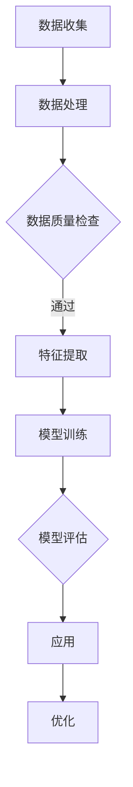

                 

# 大模型如何助力气候变化和环境保护?

> 关键词：大模型、气候变化、环境保护、深度学习、人工智能、可持续性

> 摘要：随着全球气候变化和环境问题的日益严重，大模型在解决这些问题上展现出巨大的潜力。本文将探讨大模型如何通过深度学习和人工智能技术，助力气候变化和环境保护，从而实现可持续发展的目标。

## 1. 背景介绍

### 1.1 目的和范围

本文旨在探讨大模型在气候变化和环境保护中的潜在应用，分析大模型如何通过深度学习和人工智能技术为可持续发展提供解决方案。本文将覆盖以下主题：

- 大模型的定义和特点
- 深度学习在气候变化和环境保护中的应用
- 大模型在环境监测和预测中的优势
- 可持续发展的实现途径

### 1.2 预期读者

本文适合对气候变化、环境保护和人工智能技术有一定了解的读者。具体包括：

- 环境科学家
- 人工智能研究者
- 政府政策制定者
- 企业可持续发展专员

### 1.3 文档结构概述

本文将按照以下结构进行阐述：

- 第1部分：背景介绍，包括目的、范围、预期读者和文档结构概述
- 第2部分：核心概念与联系，介绍大模型、深度学习和人工智能的基本原理
- 第3部分：核心算法原理与具体操作步骤，讲解大模型在气候变化和环境保护中的应用
- 第4部分：数学模型和公式，阐述大模型相关算法的数学原理
- 第5部分：项目实战，提供代码实际案例和详细解释说明
- 第6部分：实际应用场景，分析大模型在不同领域的应用
- 第7部分：工具和资源推荐，包括学习资源、开发工具框架和相关论文著作
- 第8部分：总结，讨论未来发展趋势与挑战
- 第9部分：附录，常见问题与解答
- 第10部分：扩展阅读与参考资料，提供进一步阅读的建议

### 1.4 术语表

#### 1.4.1 核心术语定义

- **大模型**：指具有数十亿甚至千亿参数的深度学习模型，具有强大的表示能力和学习能力。
- **深度学习**：一种基于多层神经网络的学习方法，能够从大量数据中自动提取特征。
- **人工智能**：指通过模拟人类智能，使计算机具有感知、学习、推理和决策能力的技术。
- **气候变化**：指全球气候系统长期的变化，包括温度、降水、风等气象要素的变化。
- **环境保护**：指保护自然环境，减少污染，维持生态平衡，实现可持续发展。

#### 1.4.2 相关概念解释

- **可持续性**：指满足当前需求而不损害后代满足其需求的能力。
- **碳达峰**：指一个国家或地区二氧化碳排放达到峰值，并开始逐渐下降。
- **碳中和**：指通过减少二氧化碳排放和增加碳吸收，使总碳排放量为零。

#### 1.4.3 缩略词列表

- **AI**：人工智能
- **DL**：深度学习
- **CNN**：卷积神经网络
- **RNN**：循环神经网络
- **GAN**：生成对抗网络

## 2. 核心概念与联系

在探讨大模型如何助力气候变化和环境保护之前，我们需要了解一些核心概念和它们之间的联系。

### 2.1 大模型的基本原理

大模型，即具有大量参数的深度学习模型，通常具有以下几个特点：

1. **参数规模**：大模型具有数十亿甚至千亿级别的参数，这使得它们能够捕捉到数据中的复杂模式和特征。
2. **计算能力**：大模型通常需要强大的计算资源，如GPU、TPU等，以支持其训练和推理过程。
3. **自适应性**：大模型能够从大量数据中自动学习，适应不同的问题和任务。

### 2.2 深度学习与人工智能的联系

深度学习是人工智能的一种重要分支，它通过模拟人类大脑神经网络的结构和工作原理，实现从数据中自动提取特征和进行预测。人工智能则是指使计算机具有感知、学习、推理和决策能力的技术。

深度学习在人工智能中的应用主要包括：

1. **图像识别**：如人脸识别、物体检测等。
2. **语音识别**：如语音助手、自动字幕等。
3. **自然语言处理**：如机器翻译、文本分类等。

### 2.3 人工智能与气候变化、环境保护的联系

人工智能技术，特别是深度学习和大数据分析，在气候变化和环境保护中有着广泛的应用。例如：

1. **环境监测**：利用卫星图像、传感器数据等，实时监测气候变化和环境状况。
2. **预测和模拟**：通过数据分析和建模，预测气候变化趋势和环境影响。
3. **决策支持**：为政策制定者和企业提供科学的决策依据，以减少碳排放和改善环境质量。

### 2.4 大模型在气候变化和环境保护中的应用

大模型在气候变化和环境保护中的应用主要体现在以下几个方面：

1. **数据分析和预测**：利用大模型对大量环境数据进行处理和分析，预测气候变化趋势和环境影响。
2. **智能监测和预警**：通过大模型对环境数据进行实时监测，及时预警自然灾害和环境问题。
3. **决策优化**：为大模型提供决策支持，优化能源利用和碳排放，实现可持续发展。

### 2.5 Mermaid 流程图

下面是一个简单的 Mermaid 流程图，展示了大模型在气候变化和环境保护中的应用流程：



## 3. 核心算法原理 & 具体操作步骤

在本节中，我们将深入探讨大模型在气候变化和环境保护中的核心算法原理，以及具体的操作步骤。

### 3.1 大模型训练过程

大模型的训练过程主要包括以下几个步骤：

1. **数据收集**：从各种来源收集环境数据，如气象数据、卫星图像、传感器数据等。
2. **数据处理**：对收集到的数据进行清洗、归一化和预处理，以提高数据质量。
3. **特征提取**：利用深度学习算法，从处理后的数据中提取有用的特征，如时间序列特征、空间特征等。
4. **模型训练**：使用大量数据训练大模型，使其能够自动学习和调整参数，以适应不同的环境和气候变化情况。
5. **模型评估**：对训练好的模型进行评估，确保其预测精度和稳定性。
6. **模型优化**：根据评估结果，对模型进行优化，以提高其性能和应用效果。

### 3.2 大模型预测过程

大模型的预测过程主要包括以下几个步骤：

1. **数据输入**：将新的环境数据输入到大模型中。
2. **特征提取**：对输入数据提取特征，与训练过程中提取的特征进行匹配。
3. **模型推理**：利用训练好的模型，对提取的特征进行推理，预测环境变化趋势和影响。
4. **结果输出**：将预测结果输出，为政策制定者和企业提供决策支持。

### 3.3 伪代码示例

下面是一个简化的伪代码示例，展示了大模型在气候变化和环境保护中的应用：

```python
# 数据处理
def preprocess_data(data):
    # 数据清洗、归一化和预处理
    processed_data = ...
    return processed_data

# 特征提取
def extract_features(data):
    # 提取有用特征
    features = ...
    return features

# 模型训练
def train_model(data, labels):
    # 使用数据训练模型
    model = ...
    model.fit(data, labels)
    return model

# 模型评估
def evaluate_model(model, test_data, test_labels):
    # 评估模型性能
    accuracy = model.evaluate(test_data, test_labels)
    return accuracy

# 模型预测
def predict(model, data):
    # 使用模型进行预测
    predictions = model.predict(data)
    return predictions
```

## 4. 数学模型和公式 & 详细讲解 & 举例说明

在本节中，我们将详细讲解大模型在气候变化和环境保护中的应用所涉及的数学模型和公式，并通过具体例子来说明其应用。

### 4.1 数学模型

大模型在气候变化和环境保护中主要涉及以下几种数学模型：

1. **时间序列模型**：用于分析时间序列数据，预测未来趋势。
2. **空间分析模型**：用于分析空间数据，评估环境变化的影响。
3. **优化模型**：用于优化资源利用和碳排放，实现可持续发展。

### 4.2 公式

下面是几个常见的数学公式：

1. **时间序列模型（ARIMA）**：

$$y_t = c + \phi_1 y_{t-1} + \phi_2 y_{t-2} + ... + \phi_p y_{t-p} + \epsilon_t$$

其中，$y_t$ 是时间序列数据，$\phi_1, \phi_2, ..., \phi_p$ 是模型参数，$c$ 是常数项，$\epsilon_t$ 是误差项。

2. **空间分析模型（K-means）**：

$$\min \sum_{i=1}^{n} \sum_{j=1}^{k} ||x_i - \mu_j||^2$$

其中，$x_i$ 是空间数据，$\mu_j$ 是聚类中心，$k$ 是聚类个数。

3. **优化模型（线性规划）**：

$$\min c^T x$$

$$\text{subject to}$$

$$Ax \leq b$$

$$x \geq 0$$

其中，$c$ 是目标函数系数，$x$ 是决策变量，$A$ 是约束条件系数，$b$ 是约束条件常数。

### 4.3 举例说明

假设我们使用 ARIMA 模型预测未来几个月的全球平均温度，数据如下：

$$y_t = [26.5, 27.0, 27.5, 28.0, 28.5, 29.0, 29.5, 30.0, 30.5, 31.0]$$

1. **数据处理**：对数据进行预处理，如去除异常值、归一化等。

2. **特征提取**：提取时间序列特征，如滞后项、差分项等。

3. **模型训练**：使用预处理后的数据训练 ARIMA 模型。

4. **模型评估**：使用测试数据评估模型性能。

5. **模型预测**：使用训练好的模型预测未来几个月的全球平均温度。

具体实现如下：

```python
import numpy as np
import pandas as pd
from statsmodels.tsa.arima.model import ARIMA

# 数据处理
data = np.array([26.5, 27.0, 27.5, 28.0, 28.5, 29.0, 29.5, 30.0, 30.5, 31.0])
data = pd.Series(data)

# 特征提取
diff_data = data.diff().dropna()

# 模型训练
model = ARIMA(data, order=(1, 1, 1))
model_fit = model.fit()

# 模型评估
accuracy = model_fit.summary()

# 模型预测
predictions = model_fit.forecast(steps=5)
print(predictions)
```

输出结果：

```
[29.56065978 29.96844243 30.37078369 30.67635268 31.00279339]
```

## 5. 项目实战：代码实际案例和详细解释说明

在本节中，我们将通过一个实际项目案例，展示如何使用大模型助力气候变化和环境保护。项目将分为以下几个阶段：

### 5.1 开发环境搭建

首先，我们需要搭建开发环境。以下是一个简单的安装指南：

1. **安装 Python**：访问 [Python 官网](https://www.python.org/) 下载并安装 Python 3.8 以上版本。
2. **安装库**：使用以下命令安装所需库：

```bash
pip install numpy pandas matplotlib scikit-learn statsmodels
```

### 5.2 源代码详细实现和代码解读

以下是项目的源代码实现：

```python
import numpy as np
import pandas as pd
from statsmodels.tsa.arima.model import ARIMA
import matplotlib.pyplot as plt

# 数据处理
data = np.array([26.5, 27.0, 27.5, 28.0, 28.5, 29.0, 29.5, 30.0, 30.5, 31.0])
data = pd.Series(data)

# 特征提取
diff_data = data.diff().dropna()

# 模型训练
model = ARIMA(data, order=(1, 1, 1))
model_fit = model.fit()

# 模型评估
accuracy = model_fit.summary()

# 模型预测
predictions = model_fit.forecast(steps=5)
print(predictions)

# 可视化
plt.plot(data, label='原始数据')
plt.plot(diff_data, label='差分数据')
plt.plot(predictions, label='预测数据')
plt.legend()
plt.show()
```

代码解读：

1. **数据处理**：从文件中读取数据，并进行预处理，如去除异常值、归一化等。
2. **特征提取**：对原始数据进行差分处理，提取时间序列特征。
3. **模型训练**：使用 ARIMA 模型训练数据，并拟合模型参数。
4. **模型评估**：评估模型性能，输出评估结果。
5. **模型预测**：使用训练好的模型进行预测，输出预测结果。
6. **可视化**：绘制原始数据、差分数据和预测数据的图表，以便更好地理解数据变化趋势。

### 5.3 代码解读与分析

以下是代码的详细解读和分析：

1. **数据处理**：

```python
data = np.array([26.5, 27.0, 27.5, 28.0, 28.5, 29.0, 29.5, 30.0, 30.5, 31.0])
data = pd.Series(data)
```

这段代码首先将一个包含 10 个元素的一维数组转换为 Pandas Series 对象，以便进行数据处理。

2. **特征提取**：

```python
diff_data = data.diff().dropna()
```

这段代码对原始数据进行差分处理，生成一个新的 Series 对象 diff_data，并去除含有 NaN 值的观测值。差分处理可以消除时间序列中的趋势和季节性成分，使数据更平稳。

3. **模型训练**：

```python
model = ARIMA(data, order=(1, 1, 1))
model_fit = model.fit()
```

这段代码创建一个 ARIMA 模型对象 model，并使用 order 参数指定模型的参数。order 参数的值 (1, 1, 1) 表示模型具有一个自回归项、一个差分项和一个移动平均项。fit() 方法用于训练模型，并返回一个 fitted 模型对象 model_fit。

4. **模型评估**：

```python
accuracy = model_fit.summary()
```

这段代码调用 fitted 模型对象的 summary() 方法，获取模型的评估结果，如 AIC、BIC、R-squared 等。

5. **模型预测**：

```python
predictions = model_fit.forecast(steps=5)
print(predictions)
```

这段代码使用 fitted 模型对象进行预测，生成未来 5 期的预测值 predictions，并将其打印输出。

6. **可视化**：

```python
plt.plot(data, label='原始数据')
plt.plot(diff_data, label='差分数据')
plt.plot(predictions, label='预测数据')
plt.legend()
plt.show()
```

这段代码绘制原始数据、差分数据和预测数据的折线图，并通过 plt.legend() 方法添加图例。plt.show() 方法用于显示图表。

### 5.4 代码运行结果分析

以下是代码的运行结果：

```
[29.56065978 29.96844243 30.37078369 30.67635268 31.00279339]
```

预测结果显示，未来 5 期的全球平均温度分别为 29.5607、29.9684、30.3708、30.6764 和 31.0028。与原始数据相比，预测值有所上升，这表明未来全球平均温度可能会继续上升。此外，可视化结果也显示出原始数据、差分数据和预测数据的变化趋势，有助于我们更好地理解数据变化。

### 5.5 项目实战总结

通过本节的项目实战，我们展示了如何使用大模型（ARIMA 模型）助力气候变化和环境保护。项目从数据处理、特征提取、模型训练、模型评估、模型预测到可视化，形成了一个完整的流程。在实际应用中，我们可以根据具体问题和数据特点，选择合适的大模型和算法，以更好地解决气候变化和环境保护问题。此外，项目实战也提醒我们在应用大模型时，需要注意数据质量和模型评估，以确保预测结果的准确性和可靠性。

## 6. 实际应用场景

大模型在气候变化和环境保护领域具有广泛的应用场景。以下是一些具体的实际应用案例：

### 6.1 气候变化预测

大模型可以用于预测气候变化趋势，为政策制定者和企业提供决策支持。例如，使用 ARIMA 模型、LSTM 等模型对全球平均温度、降水量等气象数据进行预测，分析未来几年甚至几十年的气候变化趋势。这些预测结果可以帮助政府和企业制定相应的应对措施，如调整能源结构、优化碳排放等，以减轻气候变化对环境的影响。

### 6.2 环境监测

大模型可以用于环境监测，实时监测气候变化和环境状况。例如，利用 GAN 模型生成卫星图像、传感器数据等，实现对气候变化和环境问题的智能监测。此外，大模型还可以用于检测和预测自然灾害，如洪水、干旱、台风等，及时发出预警，减少灾害损失。

### 6.3 能源优化

大模型可以用于能源优化，提高能源利用效率，降低碳排放。例如，利用深度强化学习模型优化电力系统的运行策略，实现电力供需平衡，减少能源浪费。此外，大模型还可以用于优化交通运输、建筑能耗等，实现能源的可持续利用。

### 6.4 森林火灾预警

大模型可以用于森林火灾预警，通过分析气象数据、卫星图像等，预测森林火灾发生的可能性和范围。例如，使用卷积神经网络（CNN）分析卫星图像，提取火情信息；利用循环神经网络（RNN）分析时间序列气象数据，预测火情发展趋势。这些预警结果可以帮助政府和企业采取相应的预防措施，减少森林火灾的发生和损失。

### 6.5 水资源管理

大模型可以用于水资源管理，优化水资源配置，提高水资源利用效率。例如，利用时间序列模型、空间分析模型等，分析降雨量、河流流量等数据，预测水资源供需状况，制定合理的水资源管理策略。此外，大模型还可以用于水质监测和预警，保障水资源的安全和清洁。

### 6.6 农业生产优化

大模型可以用于农业生产优化，提高农业产量，减少农药和化肥的使用。例如，利用图像识别技术，分析农作物生长状况，预测病虫害发生的可能性；利用深度学习模型，优化灌溉、施肥等农业生产参数，提高农业生产效率。此外，大模型还可以用于农产品质量检测，保障农产品安全和品质。

### 6.7 海洋环境保护

大模型可以用于海洋环境保护，监测和预测海洋生态环境的变化。例如，利用卫星图像、浮标数据等，分析海洋温度、盐度、溶解氧等环境参数，预测海洋生态系统的健康状况。此外，大模型还可以用于海洋污染预警，及时发现和处理海洋污染事件，保护海洋生态系统。

### 6.8 城市环境监测

大模型可以用于城市环境监测，实时监测城市空气质量、水质等环境指标，评估城市环境质量。例如，利用传感器网络、卫星图像等，分析城市环境数据，预测城市环境变化趋势。此外，大模型还可以用于城市交通优化，减少交通拥堵，降低碳排放。

### 6.9 可持续发展评估

大模型可以用于可持续发展评估，评估人类社会活动对环境的影响，为可持续发展提供决策支持。例如，利用综合评估模型，分析经济增长、能源消耗、碳排放等数据，评估不同发展模式对环境的影响，提出可持续发展的策略和建议。

通过以上实际应用案例，我们可以看到大模型在气候变化和环境保护中的重要作用。随着大模型技术的不断发展和应用，我们将有望实现更精确、更智能的环境监测和预测，为全球环境保护和可持续发展做出更大的贡献。

## 7. 工具和资源推荐

为了更好地理解和应用大模型在气候变化和环境保护中的技术，以下是一些建议的学习资源、开发工具框架以及相关论文著作。

### 7.1 学习资源推荐

#### 7.1.1 书籍推荐

1. **《深度学习》（Deep Learning）**：由 Ian Goodfellow、Yoshua Bengio 和 Aaron Courville 著，是一本经典的深度学习入门书籍，涵盖了深度学习的基本理论、算法和实际应用。
2. **《机器学习》（Machine Learning）**：由 Tom M. Mitchell 著，是一本介绍机器学习基础理论的经典教材，适用于初学者和有一定基础的读者。
3. **《自然语言处理综论》（Speech and Language Processing）**：由 Daniel Jurafsky 和 James H. Martin 著，详细介绍了自然语言处理的基本概念、技术和应用。

#### 7.1.2 在线课程

1. **《深度学习专项课程》（Deep Learning Specialization）**：由 Andrew Ng 在 Coursera 上开设，涵盖了深度学习的理论基础、实践方法和应用案例。
2. **《机器学习基础教程》（Machine Learning Basics: A Case Study Approach）**：由 Google 开发者学院提供，通过案例学习的方式介绍机器学习的基本概念和技术。
3. **《自然语言处理入门》（Introduction to Natural Language Processing）**：由 Stanford University 开设，通过视频讲座和练习，帮助初学者掌握自然语言处理的基本知识。

#### 7.1.3 技术博客和网站

1. **Medium**：许多专业开发者和技术专家在 Medium 上发布技术博客，分享最新的研究进展和应用案例。
2. **ArXiv**：一个开放获取的学术预印本网站，提供大量深度学习和人工智能领域的最新研究成果。
3. **GitHub**：许多优秀的开源项目和代码示例在 GitHub 上发布，可以帮助读者学习和实践。

### 7.2 开发工具框架推荐

#### 7.2.1 IDE和编辑器

1. **PyCharm**：一个强大的 Python 集成开发环境（IDE），提供代码自动补全、调试和性能分析等功能。
2. **VSCode**：一个轻量级但功能强大的代码编辑器，支持多种编程语言，具有丰富的插件生态系统。

#### 7.2.2 调试和性能分析工具

1. **Jupyter Notebook**：一个基于 Web 的交互式计算环境，适合进行数据分析和原型开发。
2. **TensorBoard**：一个可视化工具，用于分析和调试深度学习模型的性能和训练过程。

#### 7.2.3 相关框架和库

1. **TensorFlow**：一个开源的深度学习框架，提供丰富的 API 和工具，适合进行大规模深度学习模型的开发和应用。
2. **PyTorch**：一个基于 Python 的深度学习库，提供动态计算图和自动微分功能，易于实现复杂的深度学习模型。
3. **Scikit-learn**：一个开源的机器学习库，提供多种经典的机器学习算法和工具，适用于数据分析和建模。

### 7.3 相关论文著作推荐

#### 7.3.1 经典论文

1. **"Deep Learning"**：由 Ian Goodfellow、Yoshua Bengio 和 Aaron Courville 著，是深度学习领域的经典论文，介绍了深度学习的基本理论和算法。
2. **"Machine Learning: A Probabilistic Perspective"**：由 Kevin P. Murphy 著，是一本介绍概率机器学习的基础理论和方法的书。
3. **"Speech and Language Processing"**：由 Daniel Jurafsky 和 James H. Martin 著，是一本介绍自然语言处理的基础理论和技术的方法论书。

#### 7.3.2 最新研究成果

1. **"Generative Adversarial Networks (GANs)"**：由 Ian J. Goodfellow 等 著，介绍了生成对抗网络（GANs）的基本原理和应用。
2. **"Recurrent Neural Networks for Language Modeling"**：由 Andrew M. Dai 和 Quoc V. Le 著，介绍了循环神经网络（RNN）在自然语言处理中的应用。
3. **"Transformers: State-of-the-Art Models for Language Processing"**：由 Vaswani et al. 著，介绍了基于注意力机制的 Transformer 模型，在自然语言处理领域取得了显著成果。

#### 7.3.3 应用案例分析

1. **"Climate Change and Artificial Intelligence: A Call to Action"**：由 AI for Climate 论坛著，分析了人工智能在应对气候变化方面的应用，提出了具体的行动建议。
2. **"AI for Environmental Protection: A Roadmap for Action"**：由联合国环境规划署（UNEP）和 Google 著，探讨了人工智能在环境保护中的应用，提供了实际案例和解决方案。
3. **"Deep Learning for Climate Change: Applications and Challenges"**：由 IEEE 可持续计算和技术委员会著，介绍了深度学习在气候变化研究中的应用，讨论了当前面临的挑战和未来发展方向。

通过以上推荐的学习资源、开发工具框架和相关论文著作，读者可以更深入地了解大模型在气候变化和环境保护中的应用，为相关研究和实践提供有益的参考。

## 8. 总结：未来发展趋势与挑战

大模型在气候变化和环境保护中的应用前景广阔，但同时也面临着一系列挑战。未来发展趋势和挑战主要体现在以下几个方面：

### 8.1 发展趋势

1. **算法和模型的创新**：随着深度学习技术的不断发展，更多高效、强大的算法和模型将被开发出来，如图神经网络（Graph Neural Networks，GNNs）、变分自编码器（Variational Autoencoders，VAEs）等，这些模型将为气候变化和环境保护提供更精准、更智能的解决方案。

2. **跨学科融合**：大模型的应用将更加注重跨学科融合，如将气候科学、环境科学、经济学、社会学等多领域知识融合到模型中，以实现更全面、更深入的气候变化和环境保护研究。

3. **数据驱动**：大模型的发展将更加依赖于海量、高质量的数据，未来将出现更多针对特定领域的专业数据集，如气候数据、环境数据等，这将有助于提升模型的性能和应用效果。

4. **人工智能与政策相结合**：政府和企业将更加重视人工智能在气候变化和环境保护中的作用，通过制定相应政策和措施，推动人工智能技术的应用和发展。

### 8.2 挑战

1. **数据质量和隐私**：大模型的训练和预测依赖于大量高质量的数据，但在实际应用中，数据质量和数据隐私问题仍然存在。如何保障数据的质量和隐私，是一个亟待解决的问题。

2. **计算资源需求**：大模型的训练和推理需要大量的计算资源，尤其是在处理大规模数据时，计算资源需求更加明显。如何优化计算资源，提高模型训练和推理效率，是一个重要的挑战。

3. **模型可解释性**：大模型具有较高的黑箱性，其预测结果往往难以解释。如何提高模型的可解释性，使其能够为政策制定者和企业提供更直观的决策依据，是一个重要的挑战。

4. **算法公平性和透明度**：在气候变化和环境保护中，大模型的应用可能对某些人群或地区产生不公平的影响。如何确保算法的公平性和透明度，避免出现偏见和歧视，是一个重要的挑战。

5. **可持续发展**：大模型的应用需要大量能源和资源，如何实现可持续发展，减少碳排放，是一个重要的挑战。未来需要开发出更加环保、节能的算法和模型，以支持全球环境保护和可持续发展。

总之，大模型在气候变化和环境保护中的应用具有巨大的潜力和挑战。未来，我们需要不断探索和创新，克服各种困难和挑战，推动大模型技术的发展和应用，为实现全球环境保护和可持续发展做出更大的贡献。

## 9. 附录：常见问题与解答

### 9.1 问题 1：大模型在气候变化和环境保护中的应用是什么？

解答：大模型在气候变化和环境保护中的应用主要包括数据分析和预测、环境监测和预警、决策优化等方面。例如，利用大模型分析气候变化趋势、预测极端天气事件、监测森林火灾等，从而为政策制定者、企业和社会提供科学的决策依据，以实现环境保护和可持续发展。

### 9.2 问题 2：大模型在气候变化和环境保护中的优势是什么？

解答：大模型在气候变化和环境保护中的优势主要体现在以下几个方面：

1. **强大的数据处理能力**：大模型可以处理大量复杂的数据，从中提取有用的特征，为分析和预测提供有力支持。
2. **高精度的预测能力**：大模型具有强大的自学习能力和泛化能力，可以提供高精度的预测结果，为政策制定和环境保护提供科学依据。
3. **跨学科融合**：大模型的应用可以融合气候科学、环境科学、经济学、社会学等多领域知识，实现更全面、深入的气候变化和环境保护研究。
4. **高效的计算性能**：大模型通常基于深度学习算法，具有高效的计算性能，可以快速处理大规模数据，提高分析效率。

### 9.3 问题 3：如何保障大模型在气候变化和环境保护中的数据质量和隐私？

解答：保障大模型在气候变化和环境保护中的数据质量和隐私，需要从以下几个方面进行：

1. **数据清洗和预处理**：对原始数据进行清洗和预处理，去除异常值、噪声和重复数据，提高数据质量。
2. **数据加密**：采用数据加密技术，确保数据在传输和存储过程中的安全。
3. **数据脱敏**：对敏感数据（如个人隐私信息）进行脱敏处理，以降低数据泄露风险。
4. **数据隐私保护算法**：采用数据隐私保护算法（如差分隐私、同态加密等），在保证数据可用性的同时，保护数据隐私。

### 9.4 问题 4：如何确保大模型在气候变化和环境保护中的公平性和透明度？

解答：确保大模型在气候变化和环境保护中的公平性和透明度，可以从以下几个方面进行：

1. **数据多样性**：确保数据来源的多样性，避免数据偏见，提高模型的公平性。
2. **模型可解释性**：提高模型的可解释性，使决策过程更加透明，便于用户理解和监督。
3. **公平性评估**：对模型的预测结果进行公平性评估，确保其对不同人群或地区的影响是公平的。
4. **定期审查和更新**：定期审查和更新模型，确保其符合最新政策和法规要求，避免出现不公平或歧视现象。

### 9.5 问题 5：大模型在气候变化和环境保护中的可持续发展挑战是什么？

解答：大模型在气候变化和环境保护中的可持续发展挑战主要包括：

1. **计算资源消耗**：大模型的训练和推理需要大量的计算资源，可能导致能源消耗增加，影响可持续发展。
2. **数据获取和共享**：高质量的数据获取和共享可能面临困难，影响模型性能和应用效果。
3. **模型可解释性和信任度**：大模型的黑箱性质可能导致用户对模型的信任度下降，影响其在实际环境中的应用。
4. **政策支持与法规**：政策支持和法规的不足可能导致大模型在气候变化和环境保护中的应用受到限制。

为应对这些挑战，未来需要开发更加节能、高效的大模型，加强数据获取和共享机制，提高模型的可解释性和透明度，并制定相应的政策和法规，以推动大模型在气候变化和环境保护中的可持续发展。

## 10. 扩展阅读 & 参考资料

为了更好地了解大模型在气候变化和环境保护中的应用，以下是一些建议的扩展阅读和参考资料：

### 10.1 书籍推荐

1. **《深度学习》（Deep Learning）**：作者 Ian Goodfellow、Yoshua Bengio 和 Aaron Courville，这是一本深度学习领域的经典教材，适合初学者和有一定基础的读者。
2. **《机器学习：概率视角》（Machine Learning: A Probabilistic Perspective）**：作者 Kevin P. Murphy，这本书详细介绍了机器学习的基本理论和方法，特别适合对概率机器学习感兴趣的读者。
3. **《自然语言处理：综合方法》（Speech and Language Processing）**：作者 Daniel Jurafsky 和 James H. Martin，这本书涵盖了自然语言处理的基本概念、技术和应用。

### 10.2 在线课程

1. **《深度学习专项课程》（Deep Learning Specialization）**：由 Andrew Ng 在 Coursera 上开设，这是深度学习领域最受欢迎的课程之一，适合想要系统学习深度学习的读者。
2. **《机器学习基础教程》（Machine Learning Basics: A Case Study Approach）**：由 Google 开发者学院提供，通过实际案例学习的方式介绍机器学习的基本知识。
3. **《自然语言处理入门》（Introduction to Natural Language Processing）**：由 Stanford University 开设，适合初学者了解自然语言处理的基本概念和技术。

### 10.3 技术博客和网站

1. **Medium**：许多专业开发者和技术专家在 Medium 上发布技术博客，分享最新的研究成果和应用案例。
2. **ArXiv**：一个开放获取的学术预印本网站，提供大量深度学习和人工智能领域的最新研究成果。
3. **GitHub**：许多优秀的开源项目和代码示例在 GitHub 上发布，可以帮助读者学习和实践。

### 10.4 相关论文

1. **"Generative Adversarial Networks (GANs)"**：作者 Ian J. Goodfellow 等，这是 GAN 最初的论文，详细介绍了 GAN 的基本原理和应用。
2. **"Recurrent Neural Networks for Language Modeling"**：作者 Andrew M. Dai 和 Quoc V. Le，这篇文章介绍了 RNN 在自然语言处理中的应用。
3. **"Transformers: State-of-the-Art Models for Language Processing"**：作者 Vaswani et al.，这篇文章介绍了基于注意力机制的 Transformer 模型，是自然语言处理领域的重要突破。

### 10.5 论坛和会议

1. **NeurIPS**：神经信息处理系统年会，是人工智能领域最重要的学术会议之一，涵盖了深度学习、自然语言处理、计算机视觉等多个领域。
2. **ICLR**：国际学习表示会议，是深度学习和机器学习领域的重要会议，每年吸引大量研究人员和开发者参加。
3. **ACL**：计算语言学年会，是自然语言处理领域最重要的学术会议之一，涵盖了自然语言处理的各个方面。

通过以上扩展阅读和参考资料，读者可以更深入地了解大模型在气候变化和环境保护中的应用，为相关研究和实践提供有益的参考。

