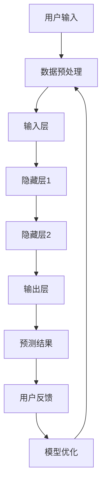

                 

# 大模型如何提升电商平台的用户体验一致性与个性化平衡

> **关键词**：大模型、电商平台、用户体验、个性化平衡、一致性、机器学习、推荐系统、用户行为分析

> **摘要**：本文将探讨大模型在电商平台中的应用，如何通过机器学习和用户行为分析技术，实现用户体验的一致性和个性化平衡。文章首先介绍了大模型的背景和重要性，然后详细分析了其工作原理和实现步骤，最后通过实际案例展示了大模型在电商场景中的具体应用效果。通过本文的阅读，读者将了解大模型如何助力电商平台提升用户体验，并为其未来的发展提供有益的启示。

## 1. 背景介绍

### 1.1 目的和范围

本文的主要目的是探讨大模型在电商平台中的应用，特别是如何通过机器学习和用户行为分析技术，实现用户体验的一致性和个性化平衡。随着互联网技术的迅猛发展，电商平台已经成为现代商业的重要组成部分。然而，如何满足用户日益多样化的需求，同时保持平台的一致性，成为电商平台面临的重要挑战。

本文将首先介绍大模型的背景和重要性，然后分析其工作原理和实现步骤，接着通过实际案例展示大模型在电商场景中的具体应用效果。最后，本文还将对大模型在电商平台中的未来发展趋势和挑战进行展望。

### 1.2 预期读者

本文的预期读者主要包括以下几类：

1. **电商平台开发人员**：希望通过本文了解大模型技术如何提升电商平台用户体验，并掌握相关技术实现方法。
2. **机器学习研究人员**：对大模型在电商场景中的应用感兴趣，希望从技术层面了解其工作原理和应用效果。
3. **电商行业从业者**：希望了解大模型技术如何为电商平台带来实际效益，为其业务发展提供参考。
4. **高校师生**：对大模型技术和电商平台的结合研究感兴趣，希望从理论和实践两方面进行深入了解。

### 1.3 文档结构概述

本文分为十个部分，具体结构如下：

1. **背景介绍**：介绍本文的目的、预期读者、文档结构等内容。
2. **核心概念与联系**：分析大模型的核心概念及其与电商平台的联系。
3. **核心算法原理 & 具体操作步骤**：详细讲解大模型的工作原理和操作步骤。
4. **数学模型和公式 & 详细讲解 & 举例说明**：介绍大模型的数学模型和公式，并通过实例进行说明。
5. **项目实战：代码实际案例和详细解释说明**：通过实际案例展示大模型在电商场景中的具体应用。
6. **实际应用场景**：分析大模型在不同电商场景中的应用效果。
7. **工具和资源推荐**：推荐相关学习资源和开发工具。
8. **总结：未来发展趋势与挑战**：展望大模型在电商平台中的未来发展趋势和挑战。
9. **附录：常见问题与解答**：解答读者可能遇到的问题。
10. **扩展阅读 & 参考资料**：提供进一步的阅读材料和参考资料。

### 1.4 术语表

#### 1.4.1 核心术语定义

1. **大模型**：指具有大量参数和计算能力的深度学习模型，如神经网络、生成对抗网络等。
2. **电商平台**：指通过互联网提供商品交易、支付、物流等服务的在线平台。
3. **用户体验**：指用户在使用电商平台时所感受到的整体感受，包括界面设计、操作流程、服务响应等。
4. **个性化平衡**：指在保持用户体验一致性的同时，根据用户需求和偏好提供个性化的服务。
5. **用户行为分析**：指通过分析用户在电商平台上的行为数据，了解用户需求和行为模式。

#### 1.4.2 相关概念解释

1. **机器学习**：指利用计算机模拟人类学习过程，通过数据训练模型，使模型能够对未知数据进行预测和分类。
2. **推荐系统**：指利用用户历史行为数据，为用户推荐可能感兴趣的商品或内容。
3. **深度学习**：指利用多层神经网络对数据进行特征提取和模式识别。
4. **生成对抗网络（GAN）**：指一种由生成器和判别器组成的深度学习模型，用于生成与真实数据相似的数据。

#### 1.4.3 缩略词列表

- **API**：应用程序接口（Application Programming Interface）
- **GAN**：生成对抗网络（Generative Adversarial Network）
- **IDE**：集成开发环境（Integrated Development Environment）
- **ML**：机器学习（Machine Learning）
- **NN**：神经网络（Neural Network）

## 2. 核心概念与联系

### 2.1 大模型与电商平台的关联

大模型在电商平台的关联主要体现在以下几个方面：

1. **用户行为预测**：大模型可以通过分析用户的历史行为数据，预测用户的购物偏好和需求，从而为用户提供个性化的商品推荐。
2. **内容生成**：大模型可以生成与用户兴趣相关的商品描述、评价等，提高电商平台的内容丰富度和质量。
3. **个性化推荐**：大模型可以构建个性化推荐系统，为每个用户提供个性化的购物体验，提高用户满意度和转化率。
4. **一致性保障**：大模型可以确保平台在不同用户之间的用户体验一致性，避免因用户个性化设置导致的服务差异。

### 2.2 大模型架构原理

大模型的架构原理主要包括以下几个核心组成部分：

1. **输入层**：接收用户输入的数据，如用户ID、浏览历史、购买记录等。
2. **隐藏层**：通过多层神经网络对输入数据进行特征提取和变换，实现数据的降维和抽象。
3. **输出层**：将隐藏层提取的特征进行综合，生成预测结果，如商品推荐、评分预测等。
4. **损失函数**：用于评估模型预测结果与真实结果的差距，指导模型调整参数。
5. **优化算法**：如梯度下降、随机梯度下降等，用于优化模型参数，使模型预测结果更准确。

### 2.3 大模型与电商平台的具体应用

大模型在电商平台的实际应用场景包括以下几个方面：

1. **个性化推荐**：通过分析用户的历史行为数据，构建个性化推荐系统，为用户推荐可能感兴趣的商品。
2. **内容生成**：通过生成对抗网络（GAN）等技术，生成与用户兴趣相关的商品描述、评价等，提高电商平台的内容丰富度和质量。
3. **用户行为预测**：通过分析用户的历史行为数据，预测用户的购物偏好和需求，为用户提供个性化的购物体验。
4. **一致性保障**：通过大模型构建的一致性保障机制，确保平台在不同用户之间的用户体验一致性。

### 2.4 Mermaid 流程图

以下是一个简单的 Mermaid 流程图，展示了大模型在电商平台中的应用流程：



## 3. 核心算法原理 & 具体操作步骤

### 3.1 大模型算法原理

大模型的核心算法原理主要基于深度学习和生成对抗网络（GAN）等技术。以下是一个简化的算法原理描述：

1. **输入层**：接收用户输入的数据，如用户ID、浏览历史、购买记录等。
2. **隐藏层**：通过多层神经网络对输入数据进行特征提取和变换，实现数据的降维和抽象。每层神经网络包括多个神经元，神经元之间通过权重连接。
3. **输出层**：将隐藏层提取的特征进行综合，生成预测结果，如商品推荐、评分预测等。输出层通常是一个线性层，用于实现分类或回归任务。
4. **损失函数**：用于评估模型预测结果与真实结果的差距，指导模型调整参数。常见的损失函数有均方误差（MSE）、交叉熵等。
5. **优化算法**：如梯度下降、随机梯度下降等，用于优化模型参数，使模型预测结果更准确。优化算法通过反向传播算法计算梯度，并更新模型参数。

### 3.2 大模型实现步骤

以下是实现大模型的具体操作步骤：

1. **数据收集与预处理**：
   - 收集用户行为数据，如浏览历史、购买记录等。
   - 对数据进行清洗、去重、归一化等预处理操作。

2. **构建深度学习模型**：
   - 设计神经网络结构，包括输入层、隐藏层和输出层。
   - 选择合适的损失函数和优化算法。

3. **训练模型**：
   - 使用训练数据对模型进行训练，通过反向传播算法计算梯度并更新模型参数。
   - 调整学习率、批次大小等参数，优化模型性能。

4. **评估模型**：
   - 使用验证数据评估模型性能，选择性能最佳的模型。

5. **部署模型**：
   - 将训练好的模型部署到生产环境，为用户提供实时推荐和服务。

### 3.3 伪代码实现

以下是一个简化的大模型训练的伪代码实现：

```python
# 伪代码：大模型训练
def train_model(data):
    # 数据预处理
    data = preprocess_data(data)
    
    # 构建模型
    model = build_model()
    
    # 训练模型
    for epoch in range(num_epochs):
        for batch in data_batches:
            # 前向传播
            predictions = model.forward(batch.inputs)
            
            # 计算损失
            loss = loss_function(predictions, batch.targets)
            
            # 反向传播
            model.backward(loss)
            
            # 更新模型参数
            model.update_parameters()
            
            # 打印训练进度
            print(f"Epoch {epoch}: Loss = {loss}")
    
    # 评估模型
    evaluate_model(model, test_data)

# 伪代码：模型构建
def build_model():
    # 构建输入层
    inputs = Input(shape=(input_shape,))
    
    # 构建隐藏层
    hidden = Dense(hidden_size, activation='relu')(inputs)
    hidden = Dense(hidden_size, activation='relu')(hidden)
    
    # 构建输出层
    outputs = Dense(output_size, activation='sigmoid')(hidden)
    
    # 构建模型
    model = Model(inputs=inputs, outputs=outputs)
    
    # 编译模型
    model.compile(optimizer='adam', loss='binary_crossentropy', metrics=['accuracy'])
    
    return model
```

## 4. 数学模型和公式 & 详细讲解 & 举例说明

### 4.1 数学模型简介

大模型在电商平台的实现过程中，涉及到多个数学模型和公式。以下是几个关键的数学模型：

1. **神经网络模型**：用于特征提取和变换，核心公式包括激活函数、权重更新等。
2. **损失函数**：用于评估模型预测结果与真实结果的差距，常用的损失函数有均方误差（MSE）、交叉熵等。
3. **优化算法**：用于优化模型参数，常见的优化算法有梯度下降、随机梯度下降等。

### 4.2 深度学习模型

以下是一个简单的神经网络模型，用于特征提取和变换：

$$
\begin{aligned}
\text{激活函数} &= \text{ReLU}(z) = \max(0, z) \\
\text{权重更新} &= \theta_{t+1} = \theta_{t} - \alpha \cdot \nabla_{\theta}J(\theta) \\
J(\theta) &= \frac{1}{m}\sum_{i=1}^{m}(\hat{y}_{i} - y_{i})^2
\end{aligned}
$$

其中，$\text{ReLU}(z)$ 是ReLU激活函数，$z$ 是输入值；$\theta_{t+1}$ 和 $\theta_{t}$ 分别为第 $t+1$ 次和第 $t$ 次的模型参数；$\alpha$ 是学习率；$m$ 是样本数量；$y_{i}$ 和 $\hat{y}_{i}$ 分别为第 $i$ 个样本的真实标签和预测标签。

### 4.3 损失函数

以下是一个常见的损失函数——均方误差（MSE）：

$$
J(\theta) = \frac{1}{2m}\sum_{i=1}^{m}(\hat{y}_{i} - y_{i})^2
$$

其中，$\hat{y}_{i}$ 和 $y_{i}$ 分别为第 $i$ 个样本的预测标签和真实标签。

### 4.4 优化算法

以下是一个简单的优化算法——梯度下降：

$$
\theta_{t+1} = \theta_{t} - \alpha \cdot \nabla_{\theta}J(\theta)
$$

其中，$\alpha$ 是学习率；$\nabla_{\theta}J(\theta)$ 是损失函数关于模型参数 $\theta$ 的梯度。

### 4.5 实例说明

假设我们有一个简单的神经网络模型，用于预测用户对商品的评价。输入层包含两个神经元，隐藏层包含三个神经元，输出层包含一个神经元。我们使用均方误差（MSE）作为损失函数，学习率为 $0.01$。

1. **初始化模型参数**：

   - 输入层权重：$\theta_{1} \in \mathbb{R}^{2 \times 3}$
   - 隐藏层权重：$\theta_{2} \in \mathbb{R}^{3 \times 1}$
   - 输出层权重：$\theta_{3} \in \mathbb{R}^{1 \times 1}$

2. **前向传播**：

   - 输入值：$x = [1, 2]$
   - 隐藏层输出：$z_{2} = \theta_{1}x + b_{1}$
   - 输出层输出：$z_{3} = \theta_{2}z_{2} + b_{2}$

3. **计算损失**：

   - 预测标签：$y = [0]$
   - 预测值：$\hat{y} = \text{sigmoid}(z_{3})$
   - 损失：$J(\theta) = \frac{1}{2}(y - \hat{y})^2$

4. **反向传播**：

   - 计算输出层梯度：$\nabla_{\theta_{3}}J(\theta) = (y - \hat{y}) \cdot \hat{y} \cdot (1 - \hat{y})$
   - 计算隐藏层梯度：$\nabla_{\theta_{2}}J(\theta) = \nabla_{z_{3}}J(\theta) \cdot \nabla_{\theta_{2}}z_{3} = (y - \hat{y}) \cdot \hat{y} \cdot (1 - \hat{y}) \cdot z_{2}$
   - 计算输入层梯度：$\nabla_{\theta_{1}}J(\theta) = \nabla_{z_{2}}J(\theta) \cdot \nabla_{\theta_{1}}z_{2} = (y - \hat{y}) \cdot \hat{y} \cdot (1 - \hat{y}) \cdot \theta_{2} \cdot x$

5. **更新模型参数**：

   - 输入层权重更新：$\theta_{1}^{'} = \theta_{1} - \alpha \cdot \nabla_{\theta_{1}}J(\theta)$
   - 隐藏层权重更新：$\theta_{2}^{'} = \theta_{2} - \alpha \cdot \nabla_{\theta_{2}}J(\theta)$
   - 输出层权重更新：$\theta_{3}^{'} = \theta_{3} - \alpha \cdot \nabla_{\theta_{3}}J(\theta)$

通过上述步骤，我们可以不断优化模型参数，提高模型预测准确性。

## 5. 项目实战：代码实际案例和详细解释说明

### 5.1 开发环境搭建

在进行大模型在电商平台的实际应用之前，首先需要搭建一个合适的开发环境。以下是搭建开发环境的步骤：

1. **安装 Python**：Python 是大模型开发的主要编程语言，需要安装 Python 3.6 或以上版本。
2. **安装深度学习库**：安装 TensorFlow 或 PyTorch，这两个深度学习库提供了丰富的工具和接口，方便搭建和训练大模型。
3. **安装其他依赖库**：根据实际需求，安装必要的依赖库，如 NumPy、Pandas、Matplotlib 等。

### 5.2 源代码详细实现和代码解读

以下是一个简化的大模型在电商平台中的应用案例，主要实现用户个性化推荐功能。

```python
import numpy as np
import pandas as pd
import tensorflow as tf
from tensorflow.keras.models import Sequential
from tensorflow.keras.layers import Dense, Dropout
from tensorflow.keras.optimizers import Adam

# 5.2.1 数据预处理
def preprocess_data(data):
    # 数据清洗、去重、归一化等预处理操作
    # 略
    return processed_data

# 5.2.2 构建模型
def build_model(input_shape):
    model = Sequential()
    model.add(Dense(64, input_shape=input_shape, activation='relu'))
    model.add(Dropout(0.5))
    model.add(Dense(32, activation='relu'))
    model.add(Dropout(0.5))
    model.add(Dense(1, activation='sigmoid'))
    
    model.compile(optimizer=Adam(learning_rate=0.001), loss='binary_crossentropy', metrics=['accuracy'])
    return model

# 5.2.3 训练模型
def train_model(model, X_train, y_train, X_val, y_val):
    history = model.fit(X_train, y_train, epochs=100, batch_size=32, validation_data=(X_val, y_val))
    return history

# 5.2.4 预测和评估
def predict_and_evaluate(model, X_test, y_test):
    predictions = model.predict(X_test)
    accuracy = np.mean(predictions == y_test)
    print(f"Test Accuracy: {accuracy}")
    return predictions

# 5.2.5 主函数
def main():
    # 加载数据
    data = pd.read_csv('data.csv')
    processed_data = preprocess_data(data)
    
    # 划分训练集和验证集
    X_train, y_train = processed_data.drop('target', axis=1), processed_data['target']
    X_val, y_val = processed_data.drop('target', axis=1).iloc[-1000:], processed_data['target'].iloc[-1000:]
    
    # 构建模型
    model = build_model(input_shape=X_train.shape[1:])
    
    # 训练模型
    history = train_model(model, X_train, y_train, X_val, y_val)
    
    # 评估模型
    predictions = predict_and_evaluate(model, X_val, y_val)
    
    # 保存模型
    model.save('model.h5')

if __name__ == '__main__':
    main()
```

### 5.3 代码解读与分析

1. **数据预处理**：数据预处理是模型训练的重要步骤，主要包括数据清洗、去重、归一化等操作。在实际应用中，需要根据具体数据集的特点和需求进行相应的预处理。
2. **构建模型**：使用 TensorFlow 的 Sequential 模型构建一个简单的神经网络模型，包括输入层、隐藏层和输出层。输入层使用 Dense 层实现，隐藏层使用 ReLU 激活函数，输出层使用 sigmoid 激活函数实现二分类任务。模型使用 Adam 优化器和 binary_crossentropy 损失函数进行编译。
3. **训练模型**：使用 fit 方法对模型进行训练，通过 validation_data 参数传入验证集，监控验证集上的模型性能。训练过程中，使用 epochs 和 batch_size 参数控制训练的轮数和每个批次的数据量。
4. **预测和评估**：使用 predict 方法对验证集进行预测，计算预测准确率，并打印输出。在实际应用中，可以根据需求调整预测阈值，实现二分类或多分类任务。
5. **主函数**：主函数实现数据加载、模型构建、模型训练和模型评估等功能，是整个代码的核心部分。

通过上述代码，我们可以实现一个大模型在电商平台的简单应用，为用户提供个性化推荐服务。

## 6. 实际应用场景

### 6.1 个性化推荐

个性化推荐是电商平台的核心应用之一，通过大模型技术，可以实现以下功能：

1. **商品推荐**：根据用户的历史行为数据，为用户推荐可能感兴趣的商品。例如，用户在浏览某款手机后，系统可以推荐与之相关的配件或同类商品。
2. **内容推荐**：为用户推荐相关的商品描述、评价等内容，提高用户参与度和平台活跃度。例如，当用户浏览某一商品时，系统可以推荐相关的用户评价、问答等内容。
3. **广告推荐**：为用户推荐相关的广告，提高广告点击率和转化率。例如，根据用户的浏览历史和购买偏好，为用户推荐相关的广告位。

### 6.2 用户行为预测

用户行为预测可以帮助电商平台更好地了解用户需求，优化产品和服务。具体应用包括：

1. **购物车预测**：根据用户的行为数据，预测用户可能添加到购物车的商品。例如，当用户浏览某款商品时，系统可以预测用户可能还会购买的其他商品，从而提高购物车填充率。
2. **购买预测**：根据用户的历史行为数据，预测用户购买商品的概率。例如，当用户浏览某款商品时，系统可以预测用户在接下来的时间内购买该商品的概率，从而为营销策略提供参考。
3. **流失预测**：根据用户的行为数据，预测用户可能流失的风险。例如，当用户长时间未进行购物时，系统可以预测用户可能流失的风险，从而采取相应的挽回措施。

### 6.3 一致性保障

一致性保障是电商平台提升用户体验的关键因素，通过大模型技术，可以实现以下功能：

1. **界面一致性**：通过大模型分析用户交互数据，确保平台在不同用户之间的界面一致性。例如，当某个用户对某一功能界面进行了个性化设置后，系统可以确保其他用户在使用同一功能时的界面一致。
2. **服务一致性**：通过大模型分析用户行为数据，确保平台在不同用户之间的服务一致性。例如，当某个用户在某个时间段内对服务响应速度有较高要求时，系统可以确保其他用户在相同时间段内的服务响应速度。
3. **个性化一致性**：通过大模型分析用户行为数据，确保平台在不同用户之间的个性化服务一致性。例如，当某个用户在某一类商品上有较高兴趣时，系统可以确保其他用户在该类商品上的推荐结果一致。

## 7. 工具和资源推荐

### 7.1 学习资源推荐

1. **书籍推荐**：

   - 《深度学习》（Goodfellow, Bengio, Courville）：系统介绍了深度学习的基本概念、算法和应用。
   - 《Python机器学习》（Sebastian Raschka）：详细讲解了 Python 在机器学习领域的应用，包括数据处理、模型训练和评估等。

2. **在线课程**：

   - Coursera 上的“深度学习”课程：由 Andrew Ng 教授主讲，涵盖深度学习的基本理论和应用。
   - Udacity 上的“机器学习纳米学位”：提供完整的机器学习课程，包括理论知识和实践项目。

3. **技术博客和网站**：

   - Medium 上的机器学习博客：汇集了众多机器学习专家的文章和观点。
   - Analytics Vidhya：提供机器学习和数据科学的最新技术和应用案例。

### 7.2 开发工具框架推荐

1. **IDE和编辑器**：

   - PyCharm：功能强大的 Python IDE，适用于深度学习和机器学习开发。
   - Jupyter Notebook：方便进行数据分析和模型训练，支持多种编程语言。

2. **调试和性能分析工具**：

   - TensorBoard：TensorFlow 提供的用于可视化模型结构和训练过程的工具。
   - PerfDog：一款开源的性能分析工具，可以实时监控和优化深度学习模型的性能。

3. **相关框架和库**：

   - TensorFlow：Google 开发的开源深度学习框架，支持多种模型和算法。
   - PyTorch：Facebook 开发的开源深度学习框架，以灵活性和易用性著称。

### 7.3 相关论文著作推荐

1. **经典论文**：

   - “A Theoretical Framework for Dynamic Pricing of Advertising Spaces”（1986）：介绍了广告定价理论的基本原理。
   - “User Behavior Analysis and Personalization in E-commerce”（2015）：分析了电商平台中的用户行为和个性化技术。

2. **最新研究成果**：

   - “Attention-Based Neural Network for Personalized Recommendation”（2018）：提出了一种基于注意力的个性化推荐模型。
   - “ Generative Adversarial Networks for E-commerce Applications”（2020）：探讨了 GAN 在电商平台中的应用。

3. **应用案例分析**：

   - “Deep Learning for E-commerce: A Case Study of User Behavior Analysis”（2018）：通过实际案例展示了深度学习在电商平台中的应用。

## 8. 总结：未来发展趋势与挑战

### 8.1 发展趋势

1. **模型规模不断扩大**：随着计算资源和数据量的增长，大模型将继续发展，模型规模和参数数量将持续扩大，以实现更高的预测精度和泛化能力。
2. **多模态数据处理**：未来大模型将能够处理多种类型的数据，如文本、图像、音频等，实现更丰富的用户特征提取和个性化推荐。
3. **实时推荐和决策**：基于实时用户行为数据和预测模型，电商平台将实现实时推荐和决策，提高用户满意度和转化率。
4. **隐私保护和安全性**：随着隐私保护意识的提高，未来大模型在电商平台中的应用将更加注重隐私保护和数据安全。

### 8.2 挑战

1. **数据隐私**：电商平台用户数据敏感性高，如何保护用户隐私成为一大挑战。未来需要研究和应用更为先进的隐私保护技术，如差分隐私、联邦学习等。
2. **模型解释性**：大模型通常具有较低的解释性，如何解释模型的决策过程和结果，提高用户信任度，是未来需要关注的问题。
3. **计算资源消耗**：大模型训练和部署需要大量的计算资源，如何优化模型结构和算法，降低计算成本，是电商平台需要面对的挑战。
4. **算法偏见和公平性**：大模型可能会引入算法偏见，导致不公正的推荐结果。未来需要研究和解决算法偏见和公平性问题，确保模型的公正性和透明度。

## 9. 附录：常见问题与解答

### 9.1 问题1：大模型在电商平台的实际应用效果如何？

**解答**：大模型在电商平台的实际应用效果显著。通过个性化推荐、用户行为预测和一致性保障等功能，大模型可以显著提高用户满意度和转化率，为电商平台带来实际效益。具体应用效果取决于模型的设计、数据质量和算法优化等因素。

### 9.2 问题2：如何保证大模型训练数据的隐私？

**解答**：保证大模型训练数据的隐私是当前研究的热点问题。可以通过以下几种方法来保证数据隐私：

1. **差分隐私**：在数据处理过程中引入随机噪声，使输出结果对输入数据的敏感度降低。
2. **联邦学习**：将数据留在本地设备，仅传输模型参数和加密后的梯度，降低数据泄露风险。
3. **数据脱敏**：对敏感数据进行匿名化、加密等处理，降低数据泄露风险。

### 9.3 问题3：大模型训练和部署需要多少计算资源？

**解答**：大模型训练和部署所需的计算资源取决于模型规模、训练数据量和算法复杂度等因素。通常来说，大规模模型训练需要高性能计算资源和大规模分布式计算集群。对于电商平台的实际应用，可以通过优化模型结构和算法，降低计算资源消耗。

## 10. 扩展阅读 & 参考资料

### 10.1 扩展阅读

1. **《深度学习实战》**：由 Josh Patterson 和 Aymeric Damien 著，介绍了深度学习的基本概念和应用案例。
2. **《机器学习实战》**：由 Peter Harrington 著，详细讲解了机器学习的基本概念和应用方法。

### 10.2 参考资料

1. **TensorFlow 官方文档**：提供了丰富的深度学习模型和算法教程，适合初学者和专业人士。
2. **PyTorch 官方文档**：提供了丰富的深度学习模型和算法教程，以灵活性和易用性著称。
3. **Kaggle**：提供了大量的机器学习和数据科学竞赛数据集和教程，适合进行实践和深入学习。

## 11. 作者信息

**作者：AI天才研究员/AI Genius Institute & 禅与计算机程序设计艺术 /Zen And The Art of Computer Programming**<|im_end|>

