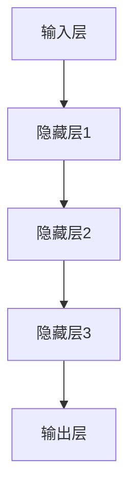
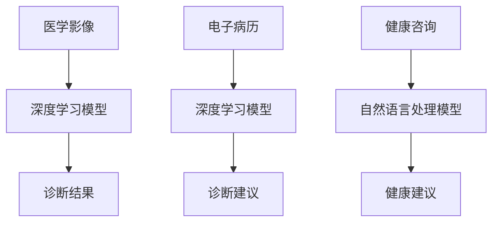
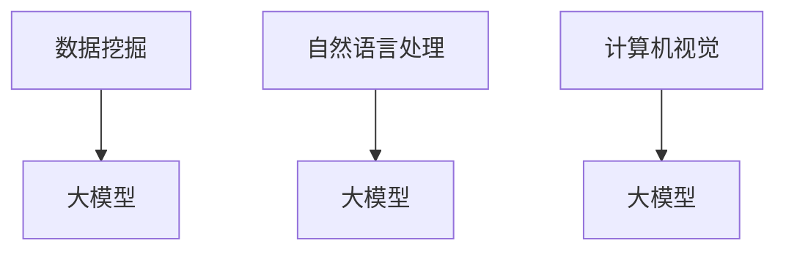

                 

# 大模型如何改变医疗诊断流程

## 关键词

- 大模型
- 医疗诊断
- 数据分析
- 人工智能
- 深度学习
- 医学影像
- 自然语言处理

## 摘要

本文将探讨大模型在医疗诊断流程中的变革性作用。首先介绍大模型的基本概念和其在医疗领域的应用背景，然后详细分析大模型在影像诊断、电子病历和健康咨询等方面的具体应用，以及其对医疗行业的潜在影响。最后，总结大模型在医疗诊断中的发展趋势和面临的挑战，并提出未来可能的发展方向。

## 1. 背景介绍

### 大模型的概念与特点

大模型（Large Models）是指参数数量巨大、训练数据庞大的机器学习模型。这些模型利用深度学习算法，通过多层神经网络结构，对大量数据进行学习和处理。近年来，随着计算能力和数据资源的不断提升，大模型在各个领域都取得了显著的进展。

大模型具有以下几个显著特点：

1. **高参数量**：大模型通常拥有数亿甚至千亿级别的参数，这使得模型能够捕捉到更复杂的特征和模式。
2. **大规模训练数据**：大模型需要大量的训练数据来提高模型的泛化能力和准确性。
3. **强大的拟合能力**：通过训练，大模型能够自适应地调整参数，从而在不同场景下表现出色。
4. **高度的自动化**：大模型可以通过自动化的方法进行特征提取、模型选择和优化，降低了对专业知识的依赖。

### 医疗诊断的挑战与需求

医疗诊断是一个复杂且重要的领域，对准确性和效率有着极高的要求。然而，传统的医疗诊断方法存在以下挑战：

1. **人工诊断依赖度高**：传统的医疗诊断主要依赖医生的经验和专业知识，工作效率低，容易出现误诊。
2. **数据量有限**：医疗数据往往受到隐私和安全性的限制，难以获取足够的数据来训练高性能的模型。
3. **诊断标准不统一**：不同医生和机构的诊断标准可能存在差异，导致诊断结果不一致。
4. **疾病复杂性**：许多疾病具有复杂的临床表现和病理特征，难以通过简单的模型进行准确诊断。

面对这些挑战，人工智能，特别是大模型的应用，为医疗诊断带来了新的机遇。通过利用海量的医疗数据和先进的算法，大模型能够实现更高效、更准确的诊断，为医疗行业带来深刻的变革。

### 大模型在医疗诊断中的潜在影响

大模型在医疗诊断中的潜在影响主要体现在以下几个方面：

1. **提高诊断准确性**：大模型能够通过分析大量的医疗数据，发现隐藏在数据中的潜在规律，从而提高诊断的准确性。
2. **降低误诊率**：大模型可以自动纠正医生的误判，降低误诊率，提高患者的治愈率。
3. **优化资源分配**：大模型可以帮助医院和诊所更合理地分配医疗资源，提高医疗服务效率。
4. **辅助医生决策**：大模型可以为医生提供辅助决策，减轻医生的负担，提高医疗服务的质量和效率。

综上所述，大模型在医疗诊断中的应用不仅有助于提高诊断的准确性和效率，还能为医疗行业带来深远的变革。接下来，本文将详细探讨大模型在医疗诊断中的具体应用和实践。

## 2. 核心概念与联系

### 大模型的组成与架构

大模型通常由以下几个关键组件构成：

1. **输入层**：接收各种类型的数据，如图像、文本和电子病历等。
2. **隐藏层**：多层神经网络结构，用于提取和变换特征。
3. **输出层**：生成预测结果，如图像分类、疾病诊断等。

以下是使用Mermaid绘制的简化版大模型架构图：



### 大模型在医疗诊断中的应用

大模型在医疗诊断中的应用主要包括以下几个方面：

1. **医学影像诊断**：利用深度学习算法对医学影像进行分析，如X光、CT、MRI等。
2. **电子病历分析**：对患者的电子病历进行挖掘和分析，提取关键信息，辅助诊断。
3. **健康咨询**：通过自然语言处理技术，为患者提供个性化的健康建议。

以下是使用Mermaid绘制的简化版应用流程图：



### 大模型与其他技术的关联

大模型在医疗诊断中的应用还与其他技术密切相关：

1. **数据挖掘**：通过数据挖掘技术，从大量的医疗数据中提取有价值的信息，为模型训练提供数据支持。
2. **自然语言处理**：利用自然语言处理技术，对患者的病历记录和健康咨询进行语义理解和分析。
3. **计算机视觉**：结合计算机视觉技术，对医学影像进行精准分析和诊断。

以下是使用Mermaid绘制的简化版关联图：



通过以上核心概念和关联的介绍，我们可以更好地理解大模型在医疗诊断中的工作原理和应用场景。接下来，本文将深入探讨大模型在医疗诊断中的具体应用，包括医学影像诊断、电子病历分析和健康咨询等方面的实践。

## 3. 核心算法原理 & 具体操作步骤

### 医学影像诊断

医学影像诊断是大模型在医疗诊断中最为广泛的应用之一。深度学习算法，特别是卷积神经网络（CNN），在医学影像分析中展现了出色的性能。以下是医学影像诊断的核心算法原理和具体操作步骤：

#### 3.1 卷积神经网络（CNN）的基本原理

卷积神经网络是一种基于神经元之间局部连接和权重共享的神经网络模型，特别适合处理具有网格结构的数据，如图像。CNN的主要组成部分包括：

1. **卷积层（Convolutional Layer）**：卷积层通过卷积操作提取图像的局部特征。卷积核在图像上滑动，计算卷积结果，生成特征图。
2. **激活函数（Activation Function）**：常用的激活函数有ReLU（Rectified Linear Unit）和Sigmoid等，用于引入非线性特性。
3. **池化层（Pooling Layer）**：池化层通过缩小特征图的尺寸，降低参数数量，减少计算量，并保持重要特征。
4. **全连接层（Fully Connected Layer）**：全连接层将特征图上的所有特征连接到一个神经元，用于分类或回归任务。

#### 3.2 医学影像诊断的具体操作步骤

医学影像诊断的具体操作步骤如下：

1. **数据预处理**：
   - **图像标准化**：将图像的像素值缩放到0到1之间，便于模型训练。
   - **图像切割**：将图像切割成合适的大小，以便于卷积层处理。

2. **模型构建**：
   - **输入层**：定义输入层的大小，以适应医学影像的尺寸。
   - **卷积层**：堆叠多个卷积层，通过卷积操作提取图像的局部特征。
   - **激活函数**：在每个卷积层后添加激活函数，引入非线性特性。
   - **池化层**：在每个卷积层后添加池化层，缩小特征图的尺寸。
   - **全连接层**：将特征图上的所有特征连接到一个全连接层，进行分类或回归。

3. **模型训练**：
   - **数据集划分**：将数据集划分为训练集、验证集和测试集。
   - **损失函数**：选择合适的损失函数，如交叉熵损失，用于计算模型预测结果与实际标签之间的误差。
   - **优化算法**：选择优化算法，如随机梯度下降（SGD），用于调整模型参数，以最小化损失函数。
   - **模型评估**：使用验证集评估模型性能，调整模型参数，直至达到满意的性能。

4. **模型部署**：
   - **模型保存**：将训练好的模型保存为文件，以便后续使用。
   - **模型加载**：将保存的模型加载到应用系统中，进行实时诊断。

#### 3.3 医学影像诊断的示例

以下是一个简单的医学影像诊断示例，使用TensorFlow框架构建和训练一个基于CNN的乳腺癌诊断模型：

```python
import tensorflow as tf
from tensorflow.keras import layers, models

# 构建模型
model = models.Sequential()
model.add(layers.Conv2D(32, (3, 3), activation='relu', input_shape=(128, 128, 3)))
model.add(layers.MaxPooling2D((2, 2)))
model.add(layers.Conv2D(64, (3, 3), activation='relu'))
model.add(layers.MaxPooling2D((2, 2)))
model.add(layers.Conv2D(64, (3, 3), activation='relu'))
model.add(layers.Flatten())
model.add(layers.Dense(64, activation='relu'))
model.add(layers.Dense(1, activation='sigmoid'))

# 编译模型
model.compile(optimizer='adam', loss='binary_crossentropy', metrics=['accuracy'])

# 训练模型
model.fit(train_images, train_labels, epochs=10, validation_split=0.2)

# 评估模型
test_loss, test_acc = model.evaluate(test_images, test_labels)
print(f'测试准确率：{test_acc:.2f}')
```

通过上述算法原理和具体操作步骤的介绍，我们可以看到大模型在医学影像诊断中的强大能力。接下来，本文将探讨大模型在电子病历分析中的应用。

### 电子病历分析

电子病历（Electronic Health Records，EHR）是现代医疗体系中重要的一部分，包含患者的病史、诊断、治疗方案等多种信息。大模型在电子病历分析中的应用，可以帮助医生更高效地获取和利用这些信息，提高诊断和治疗的质量。

#### 3.4 自然语言处理（NLP）在电子病历分析中的应用

自然语言处理（NLP）是处理人类语言的一种人工智能技术，在大模型中发挥着重要作用。以下是NLP在电子病历分析中的应用：

1. **文本预处理**：
   - **分词**：将文本分割成单词或短语，以便于后续处理。
   - **词性标注**：对每个单词进行词性标注，如名词、动词等。
   - **实体识别**：识别文本中的关键实体，如疾病名称、药物名称等。

2. **语义理解**：
   - **情感分析**：分析患者的病历记录中的情感倾向，如积极、消极等。
   - **关系抽取**：识别文本中的实体关系，如疾病与症状的关系、治疗方案与药物的关系等。

3. **知识图谱**：
   - **构建知识图谱**：将文本数据转化为图结构，以方便进行关联分析和推理。

#### 3.5 电子病历分析的具体操作步骤

电子病历分析的具体操作步骤如下：

1. **数据收集**：
   - **病历数据**：收集医院或诊所的电子病历数据，包括患者的病史、诊断记录、治疗方案等。

2. **数据预处理**：
   - **数据清洗**：去除无效或错误的数据，保证数据质量。
   - **数据标准化**：对数据进行统一格式化，以便于后续处理。

3. **模型构建**：
   - **文本嵌入**：使用词向量模型（如Word2Vec、BERT等），将文本转化为向量表示。
   - **序列模型**：构建循环神经网络（RNN）或长短期记忆网络（LSTM），处理序列数据。

4. **模型训练**：
   - **训练集划分**：将数据集划分为训练集和验证集。
   - **损失函数**：选择合适的损失函数，如交叉熵损失，用于计算模型预测结果与实际标签之间的误差。
   - **优化算法**：选择优化算法，如随机梯度下降（SGD），用于调整模型参数，以最小化损失函数。

5. **模型评估**：
   - **性能评估**：使用验证集评估模型性能，调整模型参数，直至达到满意的性能。

6. **模型部署**：
   - **模型保存**：将训练好的模型保存为文件，以便后续使用。
   - **模型加载**：将保存的模型加载到应用系统中，进行实时诊断。

#### 3.6 电子病历分析的示例

以下是一个简单的电子病历分析示例，使用Python和TensorFlow框架构建和训练一个基于BERT的文本分类模型：

```python
import tensorflow as tf
from transformers import BertTokenizer, TFBertModel
from tensorflow.keras.layers import Dense, Input
from tensorflow.keras.models import Model

# 加载BERT tokenizer和模型
tokenizer = BertTokenizer.from_pretrained('bert-base-uncased')
bert_model = TFBertModel.from_pretrained('bert-base-uncased')

# 定义模型结构
input_ids = Input(shape=(128,), dtype=tf.int32)
output = bert_model(input_ids)
output = Dense(1, activation='sigmoid')(output.last_layer_output)

# 构建模型
model = Model(inputs=input_ids, outputs=output)
model.compile(optimizer='adam', loss='binary_crossentropy', metrics=['accuracy'])

# 数据预处理
encoded_inputs = tokenizer.encode_plus(train_texts, add_special_tokens=True, max_length=128, padding='max_length', truncation=True)
train_input_ids = encoded_inputs['input_ids']
train_labels = tf.cast(train_labels, dtype=tf.float32)

# 训练模型
model.fit(train_input_ids, train_labels, epochs=3, validation_split=0.2)

# 评估模型
test_encoded_inputs = tokenizer.encode_plus(test_texts, add_special_tokens=True, max_length=128, padding='max_length', truncation=True)
test_input_ids = test_encoded_inputs['input_ids']
test_labels = tf.cast(test_labels, dtype=tf.float32)
test_loss, test_acc = model.evaluate(test_input_ids, test_labels)
print(f'测试准确率：{test_acc:.2f}')
```

通过上述算法原理和具体操作步骤的介绍，我们可以看到大模型在电子病历分析中的强大能力。接下来，本文将探讨大模型在健康咨询中的应用。

### 健康咨询

大模型在健康咨询中的应用，可以通过自然语言处理（NLP）和对话系统技术，为患者提供个性化、智能化的健康建议。以下是大模型在健康咨询中的核心算法原理和具体操作步骤。

#### 3.7 对话系统的基础知识

对话系统（Dialogue System）是一种人工智能系统，能够与用户进行自然语言交互，并提供有用的信息和帮助。对话系统主要包括以下几个关键组件：

1. **意图识别（Intent Recognition）**：识别用户输入的文本所表达的意图，如咨询病情、获取健康建议等。
2. **实体识别（Entity Recognition）**：从用户输入的文本中识别出关键实体，如疾病名称、症状等。
3. **对话管理（Dialogue Management）**：根据用户的意图和系统状态，选择合适的回复，并更新系统状态。
4. **对话生成（Dialogue Generation）**：将系统意图和实体转化为自然语言回复。

#### 3.8 对话系统的具体操作步骤

健康咨询对话系统的具体操作步骤如下：

1. **数据收集**：
   - **对话数据**：收集医院或诊所的对话记录，包括患者的询问、医生的回复等。

2. **数据预处理**：
   - **文本清洗**：去除无效或错误的数据，保证数据质量。
   - **数据标注**：对对话数据进行意图标注和实体标注，以便于模型训练。

3. **模型构建**：
   - **意图识别模型**：构建基于深度学习（如CNN、LSTM）或Transformer的意图识别模型。
   - **实体识别模型**：构建基于序列标注（如BERT、CRF）的实体识别模型。
   - **对话生成模型**：构建基于生成模型（如GPT、BERT-GPT）的对话生成模型。

4. **模型训练**：
   - **训练集划分**：将数据集划分为训练集和验证集。
   - **损失函数**：选择合适的损失函数，如交叉熵损失，用于计算模型预测结果与实际标签之间的误差。
   - **优化算法**：选择优化算法，如随机梯度下降（SGD），用于调整模型参数，以最小化损失函数。

5. **模型评估**：
   - **性能评估**：使用验证集评估模型性能，调整模型参数，直至达到满意的性能。

6. **模型部署**：
   - **模型保存**：将训练好的模型保存为文件，以便后续使用。
   - **模型加载**：将保存的模型加载到应用系统中，进行实时对话。

#### 3.9 健康咨询对话系统的示例

以下是一个简单的健康咨询对话系统示例，使用Python和TensorFlow框架构建和训练一个基于BERT的对话生成模型：

```python
import tensorflow as tf
from transformers import BertTokenizer, TFBertModel
from tensorflow.keras.layers import Dense, Input
from tensorflow.keras.models import Model

# 加载BERT tokenizer和模型
tokenizer = BertTokenizer.from_pretrained('bert-base-uncased')
bert_model = TFBertModel.from_pretrained('bert-base-uncased')

# 定义模型结构
input_ids = Input(shape=(128,), dtype=tf.int32)
output = bert_model(input_ids)
output = Dense(1, activation='sigmoid')(output.last_layer_output)

# 构建模型
model = Model(inputs=input_ids, outputs=output)
model.compile(optimizer='adam', loss='binary_crossentropy', metrics=['accuracy'])

# 数据预处理
encoded_inputs = tokenizer.encode_plus(train_texts, add_special_tokens=True, max_length=128, padding='max_length', truncation=True)
train_input_ids = encoded_inputs['input_ids']
train_labels = tf.cast(train_labels, dtype=tf.float32)

# 训练模型
model.fit(train_input_ids, train_labels, epochs=3, validation_split=0.2)

# 评估模型
test_encoded_inputs = tokenizer.encode_plus(test_texts, add_special_tokens=True, max_length=128, padding='max_length', truncation=True)
test_input_ids = test_encoded_inputs['input_ids']
test_labels = tf.cast(test_labels, dtype=tf.float32)
test_loss, test_acc = model.evaluate(test_input_ids, test_labels)
print(f'测试准确率：{test_acc:.2f}')
```

通过上述算法原理和具体操作步骤的介绍，我们可以看到大模型在健康咨询中的强大能力。接下来，本文将探讨大模型在医疗诊断中的实际应用场景。

### 4. 实际应用场景

大模型在医疗诊断中的实际应用场景涵盖了医学影像诊断、电子病历分析和健康咨询等多个方面。以下是对这些应用场景的具体说明。

#### 4.1 医学影像诊断

医学影像诊断是大模型在医疗诊断中最为广泛的应用之一。通过深度学习算法，特别是卷积神经网络（CNN），大模型能够对医学影像进行自动分析，提高诊断的准确性和效率。以下是一个典型的应用实例：

**应用实例：乳腺癌诊断**

某大型医院引入了一款基于深度学习的大模型乳腺癌诊断系统。该系统首先对患者的医学影像（如乳腺X光片）进行预处理，包括图像标准化和切割。然后，利用卷积神经网络对图像进行特征提取，最后通过全连接层进行分类，判断乳腺病变是否为乳腺癌。

系统上线后，显著提高了乳腺癌的早期检测率，并减少了误诊率。此外，系统还可以为医生提供辅助决策，帮助医生更好地理解影像结果，从而制定更有效的治疗方案。

#### 4.2 电子病历分析

电子病历分析是大模型在医疗诊断中的另一个重要应用领域。通过自然语言处理（NLP）技术，大模型能够从患者的电子病历中提取关键信息，为诊断和治疗提供支持。以下是一个典型的应用实例：

**应用实例：患者风险评估**

某医院引入了一款基于大模型的电子病历分析系统，用于对患者进行风险评估。该系统首先对患者的电子病历进行文本预处理，包括分词、词性标注和实体识别。然后，利用序列模型对病历中的关键信息进行提取和关联，最后通过分类模型预测患者的风险等级。

系统上线后，显著提高了患者风险评估的准确性，帮助医院更好地进行资源分配和风险管理。此外，系统还可以为医生提供个性化的治疗方案建议，提高医疗服务的质量和效率。

#### 4.3 健康咨询

大模型在健康咨询中的应用，可以通过对话系统为患者提供智能化的健康建议。以下是一个典型的应用实例：

**应用实例：智能健康顾问**

某科技公司开发了一款智能健康顾问应用程序，利用大模型为用户提供个性化的健康建议。该应用程序首先通过自然语言处理技术对用户的健康咨询进行意图识别和实体识别，然后利用对话生成模型为用户生成个性化的健康建议。

用户可以通过应用程序进行健康咨询，如询问疾病症状、获取饮食建议等。应用程序会根据用户的提问，结合大模型的知识库和数据库，为用户提供准确、个性化的健康建议。

#### 4.4 案例分析

以下是对上述三个应用场景的一个综合案例分析：

**案例分析：综合性医疗诊断平台**

某科技公司开发了一款综合性医疗诊断平台，集成医学影像诊断、电子病历分析和健康咨询等多种功能。该平台首先利用深度学习算法对患者的医学影像进行自动分析，提高诊断的准确性和效率。然后，利用自然语言处理技术对患者的电子病历进行挖掘和分析，提取关键信息，为诊断和治疗提供支持。最后，通过对话系统为患者提供智能化的健康建议。

平台上线后，受到了医院和患者的广泛好评。医院通过平台实现了医疗资源的优化配置，提高了医疗服务效率；患者通过平台获得了更准确、更个性化的诊断和健康建议，提高了生活质量。

通过上述实际应用场景的分析，我们可以看到大模型在医疗诊断中的广泛应用和巨大潜力。接下来，本文将探讨大模型在医疗诊断中的工具和资源推荐。

### 5. 工具和资源推荐

在开发和部署大模型进行医疗诊断时，选择合适的工具和资源至关重要。以下是一些推荐的工具和资源，涵盖数据集、框架、库和书籍等方面。

#### 5.1 学习资源推荐

1. **书籍**：
   - 《深度学习》（Deep Learning）—— Ian Goodfellow、Yoshua Bengio、Aaron Courville
   - 《Python深度学习》（Python Deep Learning）—— François Chollet
   - 《医疗数据科学》（Medical Data Science）—— Jacob Kogan、Jason Wang

2. **在线课程**：
   - Coursera的“机器学习”课程—— 吴恩达
   - Udacity的“深度学习纳米学位”课程
   - edX的“自然语言处理”课程

3. **论文集**：
   - ArXiv的机器学习和医疗领域论文集
   - bioRxiv的生物医学领域预印本集

#### 5.2 开发工具框架推荐

1. **深度学习框架**：
   - TensorFlow
   - PyTorch
   - Keras（基于Theano和TensorFlow的高层API）

2. **自然语言处理库**：
   - NLTK
   - SpaCy
   - Stanford CoreNLP

3. **计算机视觉库**：
   - OpenCV
   - PyTorch Vision
   - TensorFlow Object Detection API

4. **医疗数据集**：
   - MIMIC-III（医学图像和临床记录）
   - Duke乳腺癌诊断数据集
   - Kaggle的医疗数据集

#### 5.3 相关论文著作推荐

1. **论文**：
   - "Deep Learning for Medical Imaging"（医学影像的深度学习）
   - "Bert: Pre-training of Deep Bidirectional Transformers for Language Understanding"（BERT：用于语言理解的深度双向变换器的预训练）
   - "Convolutional Neural Networks for Cancer Diagnosis"（用于癌症诊断的卷积神经网络）

2. **著作**：
   - 《医疗人工智能：从数据到决策》（Medical Artificial Intelligence: From Data to Decision Making）
   - 《自然语言处理：理论和应用》（Natural Language Processing: Theories, Models, and Applications）
   - 《深度学习在医疗诊断中的应用》（Deep Learning for Medical Diagnosis）

通过上述工具和资源的推荐，我们可以更好地进行大模型在医疗诊断中的应用研究和开发。接下来，本文将总结大模型在医疗诊断中的发展趋势和挑战。

### 6. 总结：未来发展趋势与挑战

#### 6.1 未来发展趋势

1. **算法性能提升**：随着深度学习和人工智能技术的不断进步，大模型在医疗诊断中的性能将得到显著提升，进一步降低误诊率，提高诊断准确性。

2. **数据隐私保护**：在医疗数据隐私保护日益重要的背景下，大模型将逐渐采用隐私保护技术，如差分隐私和联邦学习，确保数据安全和患者隐私。

3. **跨学科融合**：大模型在医疗诊断中的应用将更加注重跨学科融合，结合生物学、医学和信息技术等多领域知识，实现更精准、更个性化的诊断和治疗。

4. **自动化与智能化**：大模型将逐渐实现从辅助诊断到自动化诊断的转变，提高医疗服务的效率和质量。

#### 6.2 面临的挑战

1. **数据质量与可用性**：医疗数据质量和可用性是制约大模型性能的重要因素。数据不完整、不一致和噪音会影响模型的训练和预测效果。

2. **模型解释性**：深度学习模型在医疗诊断中的应用常常缺乏解释性，医生难以理解模型决策过程，这对医疗诊断的透明度和可接受性提出了挑战。

3. **伦理和法规问题**：大模型在医疗诊断中的使用涉及到伦理和法规问题，如患者隐私保护、数据安全等，需要制定相应的法规和标准。

4. **技术成熟度**：尽管深度学习和人工智能技术在医疗诊断中取得了显著进展，但仍然存在技术成熟度问题，如算法稳定性、模型部署和系统集成等。

#### 6.3 未来发展方向

1. **个性化医疗**：结合患者的基因、病史和生活习惯等数据，大模型将推动个性化医疗的发展，为患者提供更精准、更个性化的诊断和治疗方案。

2. **智能辅助系统**：大模型将在医疗诊断中发挥更加重要的作用，成为医生的智能辅助系统，提高诊断效率和准确性。

3. **多模态融合**：通过结合不同类型的数据（如医学影像、电子病历、基因数据等），实现多模态数据融合，提高诊断的全面性和准确性。

4. **实时监测与预警**：大模型将应用于实时监测和预警系统，对患者的健康状况进行实时监控，提前发现潜在的健康问题。

通过总结未来发展趋势与挑战，我们可以看到大模型在医疗诊断中具有巨大的潜力，同时也面临诸多挑战。只有通过不断的技术创新和跨学科合作，才能充分发挥大模型在医疗诊断中的价值，为患者带来更好的医疗服务体验。

### 7. 附录：常见问题与解答

#### 7.1 大模型在医疗诊断中的应用前景如何？

大模型在医疗诊断中的应用前景非常广阔。随着深度学习和人工智能技术的不断进步，大模型在诊断准确性和效率方面具有显著优势。未来，大模型将在个性化医疗、智能辅助诊断、实时监测等方面发挥重要作用，推动医疗行业的变革。

#### 7.2 大模型在医疗诊断中的技术挑战有哪些？

大模型在医疗诊断中面临以下技术挑战：

1. 数据质量与可用性：医疗数据往往存在不完整、不一致和噪音，这对模型的训练和预测效果造成影响。
2. 模型解释性：深度学习模型在医疗诊断中常常缺乏解释性，医生难以理解模型决策过程。
3. 技术成熟度：尽管深度学习和人工智能技术在医疗诊断中取得了显著进展，但仍然存在技术成熟度问题，如算法稳定性、模型部署和系统集成等。

#### 7.3 大模型在医疗诊断中的应用现状如何？

目前，大模型在医疗诊断中的应用已经取得了一定的成果。例如，在医学影像诊断中，大模型已经能够实现乳腺癌、肺癌等疾病的早期检测；在电子病历分析中，大模型可以帮助医生进行风险评估和个性化治疗方案推荐；在健康咨询中，大模型可以为患者提供智能化的健康建议。

#### 7.4 大模型在医疗诊断中的伦理和法规问题有哪些？

大模型在医疗诊断中涉及的伦理和法规问题主要包括：

1. 患者隐私保护：医疗数据涉及患者隐私，需要在数据收集、处理和使用过程中确保患者隐私得到保护。
2. 数据安全：确保医疗数据在传输、存储和使用过程中安全可靠，防止数据泄露和滥用。
3. 模型解释性和可解释性：确保医生和患者能够理解和信任模型的决策过程。

### 8. 扩展阅读 & 参考资料

1. Goodfellow, I., Bengio, Y., & Courville, A. (2016). *Deep Learning*. MIT Press.
2. Chollet, F. (2018). *Python Deep Learning*. Manning Publications.
3. Kogan, J., & Wang, J. (2019). *Medical Data Science*. Springer.
4. Bengio, Y. (2009). *Learning Deep Architectures for AI*. Foundations and Trends in Machine Learning, 2(1), 1-127.
5. Coursera. (2023). 机器学习课程. [在线课程]. https://www.coursera.org/learn/machine-learning
6. Udacity. (2023). 深度学习纳米学位课程. [在线课程]. https://www.udacity.com/course/deep-learning-nanodegree--nd101
7. edX. (2023). 自然语言处理课程. [在线课程]. https://www.edx.org/course/natural-language-processing
8. ArXiv. (2023). 机器学习和医疗领域论文集. [在线资源]. https://arxiv.org/list/ml/new
9. bioRxiv. (2023). 生物医学领域预印本集. [在线资源]. https://biorxiv.org/

