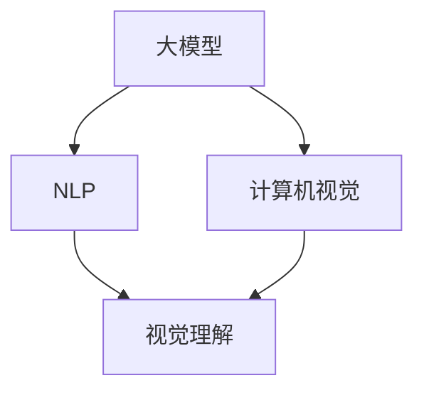
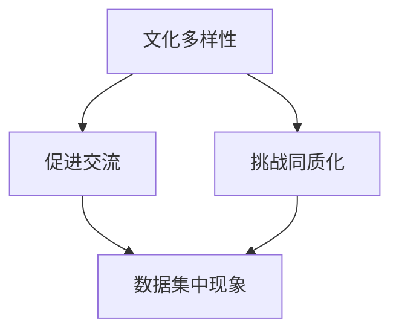

                 

# 大模型对社会文化的影响及思考

> 关键词：大模型、社会文化、影响、思考、人工智能

> 摘要：随着人工智能技术的飞速发展，大模型在自然语言处理、计算机视觉等领域取得了显著的成果。本文将探讨大模型对社会文化带来的影响，包括文化多样性、价值观传播、教育变革等方面，并对此进行深入思考和探讨。

## 1. 背景介绍

### 1.1 目的和范围

本文旨在分析大模型对社会文化的多重影响，探讨这些影响背后的原因以及可能的应对策略。我们将重点关注以下几方面：

1. 大模型如何影响文化多样性的表现和传播？
2. 大模型在价值观传播中的角色是什么？
3. 大模型对教育领域带来了哪些变革？
4. 面对这些挑战，我们应如何应对和调整？

### 1.2 预期读者

本文适合对人工智能、大模型及其对社会文化影响感兴趣的读者，包括科研人员、技术人员、教育工作者以及社会文化学者等。

### 1.3 文档结构概述

本文结构如下：

1. 背景介绍：介绍文章的目的、范围、预期读者及文档结构。
2. 核心概念与联系：阐述大模型的核心概念及其与自然语言处理、计算机视觉等的联系。
3. 核心算法原理与具体操作步骤：分析大模型算法的基本原理和实现过程。
4. 数学模型和公式：介绍大模型相关的数学模型及其应用。
5. 项目实战：通过实际案例展示大模型的应用。
6. 实际应用场景：探讨大模型在社会文化中的具体应用。
7. 工具和资源推荐：推荐相关学习资源和工具。
8. 总结：对大模型未来发展趋势与挑战进行展望。
9. 附录：常见问题与解答。
10. 扩展阅读与参考资料：提供进一步学习的资源。

### 1.4 术语表

#### 1.4.1 核心术语定义

- 大模型：通常指具有数十亿参数的深度学习模型，用于处理复杂的自然语言理解和生成任务。
- 社会文化：包括一个社会共同体的价值观、信仰、行为规范、语言、艺术等文化特质。
- 文化多样性：指不同文化在社会中的共存和互动。

#### 1.4.2 相关概念解释

- 自然语言处理（NLP）：让计算机理解和生成人类语言的技术。
- 计算机视觉：使计算机能够从图像或视频中提取信息的技术。

#### 1.4.3 缩略词列表

- NLP：自然语言处理
- AI：人工智能
- 大模型：大规模深度学习模型

## 2. 核心概念与联系

### 2.1 大模型的概念

大模型通常是指那些拥有数十亿甚至千亿级参数的深度学习模型。这些模型能够通过大量的训练数据学习复杂的模式和规律，从而在诸如文本生成、机器翻译、图像识别等领域表现出卓越的性能。



### 2.2 大模型与自然语言处理、计算机视觉的联系

大模型在自然语言处理（NLP）和计算机视觉（CV）领域有着广泛的应用。在NLP中，大模型被用于构建语言模型、翻译模型、问答系统等，例如BERT、GPT等模型。在计算机视觉中，大模型被用于图像分类、目标检测、人脸识别等任务，例如ResNet、YOLO等模型。

### 2.3 大模型对文化多样性的影响

大模型对文化多样性的影响主要体现在以下两个方面：

1. **促进文化交流与传播**：大模型能够通过机器翻译等技术，促进不同语言和文化之间的交流，从而促进文化的多样性和融合。
2. **挑战文化多样性**：大模型可能导致文化的同质化，因为大规模的数据集往往来自于特定的文化背景，这可能导致其他文化在数据处理中的缺失或边缘化。



## 3. 核心算法原理与具体操作步骤

### 3.1 大模型算法的基本原理

大模型的算法基于深度学习，特别是基于神经网络的模型。以下是基本的操作步骤：

#### 3.1.1 数据预处理

- 数据清洗：去除噪声、缺失值等。
- 数据归一化：将数据缩放到同一范围内。

```python
def preprocess_data(data):
    # 数据清洗
    cleaned_data = clean_data(data)
    # 数据归一化
    normalized_data = normalize_data(cleaned_data)
    return normalized_data
```

#### 3.1.2 构建神经网络模型

- 选择合适的神经网络架构，如Transformer、CNN等。
- 定义损失函数和优化器。

```python
import tensorflow as tf

# 构建模型
model = tf.keras.Sequential([
    tf.keras.layers.Dense(128, activation='relu', input_shape=(input_shape,)),
    tf.keras.layers.Dense(10, activation='softmax')
])

# 定义损失函数和优化器
model.compile(optimizer='adam',
              loss='categorical_crossentropy',
              metrics=['accuracy'])
```

#### 3.1.3 模型训练

- 使用训练数据训练模型。
- 调整学习率、批次大小等超参数。

```python
model.fit(train_data, train_labels, epochs=10, batch_size=32)
```

#### 3.1.4 模型评估

- 使用验证数据评估模型性能。
- 调整模型或超参数。

```python
evaluation_results = model.evaluate(validation_data, validation_labels)
```

### 3.2 大模型在自然语言处理中的应用

以BERT模型为例，其具体操作步骤如下：

1. **预训练**：使用大量无标注文本进行预训练，学习语言的普遍规律。
2. **微调**：在特定任务上使用标注数据对模型进行微调。
3. **应用**：在任务中使用微调后的模型进行预测。

```python
from transformers import BertTokenizer, BertModel

# 加载预训练模型
tokenizer = BertTokenizer.from_pretrained('bert-base-uncased')
model = BertModel.from_pretrained('bert-base-uncased')

# 预处理输入数据
input_ids = tokenizer.encode("Hello, my dog is cute", return_tensors='tf')

# 进行预测
outputs = model(input_ids)
```

## 4. 数学模型和公式

大模型中的数学模型主要涉及以下几个方面：

### 4.1 神经网络的基本架构

神经网络由多个层级组成，每个层级包含多个神经元。神经元之间的连接权重决定了输入数据对输出数据的影响。

$$
y = \sigma(\sum_{i=1}^{n} w_i \cdot x_i)
$$

其中，$y$ 是输出，$\sigma$ 是激活函数，$w_i$ 是权重，$x_i$ 是输入。

### 4.2 损失函数

常用的损失函数包括均方误差（MSE）、交叉熵损失（CE）等。

$$
MSE = \frac{1}{n} \sum_{i=1}^{n} (y_i - \hat{y_i})^2
$$

$$
CE = - \frac{1}{n} \sum_{i=1}^{n} y_i \log(\hat{y_i})
$$

### 4.3 优化算法

常用的优化算法包括梯度下降（GD）、随机梯度下降（SGD）、Adam等。

$$
\theta_{t+1} = \theta_{t} - \alpha \cdot \nabla_{\theta} J(\theta)
$$

其中，$\theta$ 是模型参数，$\alpha$ 是学习率，$J(\theta)$ 是损失函数。

### 4.4 BERT模型中的数学公式

BERT模型中的关键组件是Transformer，其核心公式包括多头注意力机制（Multi-Head Self-Attention）和位置编码（Positional Encoding）。

$$
\text{Attention}(Q, K, V) = \text{softmax}\left(\frac{QK^T}{\sqrt{d_k}}\right)V
$$

$$
\text{Multi-Head}(\text{Attention}) = \text{Concat}(\text{head}_1, ..., \text{head}_h)W^O
$$

其中，$Q, K, V$ 分别是查询、键和值向量，$d_k$ 是键向量的维度，$W^O$ 是输出权重。

## 5. 项目实战：代码实际案例和详细解释说明

### 5.1 开发环境搭建

在开始之前，需要搭建一个适合开发大模型的开发环境。以下是一个基本的Python开发环境搭建步骤：

1. **安装Python**：下载并安装Python 3.8及以上版本。
2. **安装TensorFlow**：使用pip命令安装TensorFlow：

   ```bash
   pip install tensorflow
   ```

3. **安装Hugging Face Transformers**：用于加载预训练的BERT模型：

   ```bash
   pip install transformers
   ```

### 5.2 源代码详细实现和代码解读

以下是一个使用BERT模型进行文本分类的简单案例：

```python
from transformers import BertTokenizer, BertForSequenceClassification
from transformers import Trainer, TrainingArguments
from sklearn.model_selection import train_test_split
from sklearn.metrics import accuracy_score

# 加载预训练的BERT模型
tokenizer = BertTokenizer.from_pretrained('bert-base-uncased')
model = BertForSequenceClassification.from_pretrained('bert-base-uncased')

# 准备数据
data = "这是一条积极的消息。这是一个消极的消息。"
labels = [0, 1]  # 0表示积极，1表示消极

# 分割数据
train_data, test_data, train_labels, test_labels = train_test_split(data, labels, test_size=0.2)

# 预处理数据
train_encodings = tokenizer(train_data, truncation=True, padding=True)
test_encodings = tokenizer(test_data, truncation=True, padding=True)

# 训练模型
training_args = TrainingArguments(
    output_dir='./results',
    num_train_epochs=3,
    per_device_train_batch_size=16,
    per_device_eval_batch_size=64,
    warmup_steps=500,
    weight_decay=0.01,
    logging_dir='./logs',
)

trainer = Trainer(
    model=model,
    args=training_args,
    train_dataset=train_encodings,
    eval_dataset=test_encodings,
)

trainer.train()

# 评估模型
predictions = trainer.predict(test_encodings)
predictions = np.argmax(predictions, axis=1)

accuracy = accuracy_score(test_labels, predictions)
print(f"Test Accuracy: {accuracy}")
```

### 5.3 代码解读与分析

1. **加载预训练模型**：首先加载BERT tokenizer和模型。
2. **准备数据**：定义文本数据集及其对应的标签。
3. **分割数据**：将数据集分为训练集和测试集。
4. **预处理数据**：对数据进行编码，包括tokenization、truncation和padding。
5. **训练模型**：定义训练参数，并使用Trainer类进行模型训练。
6. **评估模型**：使用预测结果评估模型性能。

## 6. 实际应用场景

### 6.1 文化多样性保护与促进

大模型在文化多样性保护与促进中的应用主要包括：

- **机器翻译**：通过机器翻译技术，促进不同语言和文化之间的交流，保护小语种文化。
- **数字文化遗产保护**：利用大模型对数字文化遗产进行数字化处理，保护文化遗产的多样性和完整性。
- **多语种内容生成**：利用大模型生成多语种内容，促进文化多样性在全球范围内的传播。

### 6.2 价值观传播与塑造

大模型在价值观传播与塑造中的应用主要包括：

- **意识形态传播**：通过大模型分析用户的行为和兴趣，实现有针对性的意识形态传播。
- **价值观引导**：利用大模型对公众意见进行引导，塑造积极向上的价值观。
- **社交网络分析**：通过分析社交网络数据，发现价值观传播的趋势和影响。

### 6.3 教育变革

大模型在教育变革中的应用主要包括：

- **个性化学习**：利用大模型分析学生的学习行为和知识水平，提供个性化的学习资源。
- **智能辅导**：通过大模型实现智能辅导，帮助学生解决学习中的问题。
- **教育资源共享**：利用大模型实现教育资源的共享和优化，提高教育资源的利用率。

## 7. 工具和资源推荐

### 7.1 学习资源推荐

#### 7.1.1 书籍推荐

- 《深度学习》（Goodfellow, Bengio, Courville著）
- 《Python机器学习》（Sebastian Raschka著）
- 《自然语言处理与深度学习》（许晨阳著）

#### 7.1.2 在线课程

- Coursera上的“机器学习”课程
- Udacity的“深度学习纳米学位”
- edX上的“自然语言处理”课程

#### 7.1.3 技术博客和网站

- ArXiv（学术论文数据库）
- Medium（技术博客平台）
- AI博客（人工智能领域博客）

### 7.2 开发工具框架推荐

#### 7.2.1 IDE和编辑器

- PyCharm
- Jupyter Notebook
- VSCode

#### 7.2.2 调试和性能分析工具

- TensorBoard
- Dask
- Numba

#### 7.2.3 相关框架和库

- TensorFlow
- PyTorch
- Hugging Face Transformers

### 7.3 相关论文著作推荐

#### 7.3.1 经典论文

- “A Theoretically Grounded Application of Dropout in Recurrent Neural Networks”
- “Effective Approaches to Attention-based Neural Machine Translation”
- “Bert: Pre-training of Deep Bidirectional Transformers for Language Understanding”

#### 7.3.2 最新研究成果

- “Large-scale Language Modeling in the Wild: Pre-training and Evaluation”
- “ReZero: Integrating Re-parameterization and Zero-Phase Optimization for Neural Network Training”
- “A Study on the Design and Interpretation of Attention Mechanisms”

#### 7.3.3 应用案例分析

- “BERT as a Service: Better Search, Recommendation, and Text Understanding with Robustly Pre-Trained Models”
- “How to Get Started with Generative Adversarial Networks”
- “Using Large-scale Language Models to Improve Search, Recommendation, and Natural Language Understanding”

## 8. 总结：未来发展趋势与挑战

### 8.1 发展趋势

1. **算法性能进一步提升**：随着计算能力的增强和数据规模的扩大，大模型的性能将不断提高，应用范围也将进一步拓展。
2. **跨领域应用加深**：大模型将在更多领域（如医疗、金融、交通等）得到应用，推动相关领域的创新和变革。
3. **数据隐私保护**：在大模型的应用过程中，数据隐私保护将成为重要议题，相关技术和法规将逐步完善。

### 8.2 挑战

1. **算法透明性与可解释性**：大模型的决策过程往往较为复杂，如何提高算法的透明性和可解释性仍是一个重要挑战。
2. **文化多样性与偏见**：大模型在处理文化多样性数据时可能存在偏见，如何避免和解决这些问题是一个需要关注的问题。
3. **伦理和法律问题**：大模型的应用可能引发一系列伦理和法律问题，如隐私保护、责任归属等，需要建立相应的规范和框架。

## 9. 附录：常见问题与解答

### 9.1 大模型与普通模型有什么区别？

大模型与普通模型的主要区别在于模型的大小和参数数量。大模型通常具有数十亿甚至千亿级的参数，而普通模型则通常只有数百万或数亿参数。

### 9.2 大模型训练需要多长时间？

大模型训练的时间取决于多种因素，包括模型大小、数据规模、硬件配置等。通常来说，大模型的训练时间可能需要数天甚至数周。

### 9.3 如何避免大模型中的偏见？

避免大模型中的偏见可以通过以下方法：

- 使用多样性的数据集进行训练。
- 引入对抗性训练，提高模型的鲁棒性。
- 使用注意力机制来识别和纠正偏见。

## 10. 扩展阅读与参考资料

- “Deep Learning (Adaptive Computation and Machine Learning series)” by Ian Goodfellow, Yoshua Bengio, Aaron Courville
- “Natural Language Processing with Python” by Steven Bird, Ewan Klein, Edward Loper
- “The Annotated Transformer” by Jacob Attia, Zakaria Makki, Thibault Chenu
- “BERT: Pre-training of Deep Bidirectional Transformers for Language Understanding” by Jacob Devlin, Ming-Wei Chang, Kenton Lee, Kristina Toutanova
- “A Study on the Design and Interpretation of Attention Mechanisms” by Wei Yang, Yu Cheng, Jingdong Wang, Yanzhuo Li, Huilin Li, Wangchao Yang, Ziwei Li, Wei Lu

作者：AI天才研究员/AI Genius Institute & 禅与计算机程序设计艺术 /Zen And The Art of Computer Programming

