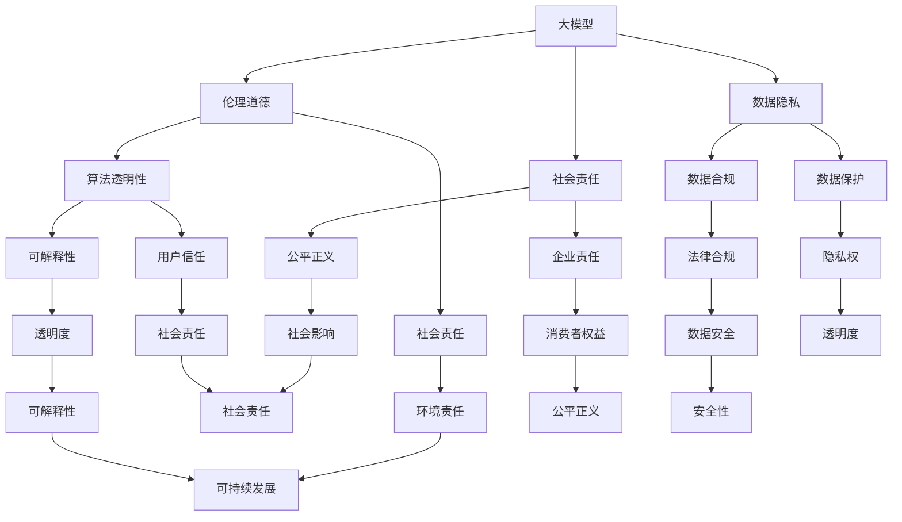

                 

# 大模型应用创业的伦理道德考量

> **关键词：** 大模型应用，创业，伦理道德，人工智能，社会责任，数据隐私，算法透明性

> **摘要：** 随着人工智能技术的迅猛发展，大模型应用逐渐成为创业领域的热点。然而，这些应用在带来巨大商业价值的同时，也引发了一系列伦理道德问题。本文将从多个维度探讨大模型应用创业中的伦理道德考量，包括数据隐私、算法透明性、社会责任等方面，旨在为创业者提供指导，促进人工智能健康、可持续发展。

## 1. 背景介绍

### 1.1 目的和范围

本文旨在探讨大模型应用创业过程中的伦理道德问题，通过对关键领域如数据隐私、算法透明性和社会责任的深入分析，为创业者提供理论基础和实践指导。随着人工智能技术的不断进步，大模型在自然语言处理、计算机视觉、推荐系统等领域展现出强大的能力。然而，这些应用的快速发展也带来了一系列挑战，特别是在伦理道德方面。

### 1.2 预期读者

本文适用于对人工智能和创业有兴趣的读者，包括创业者、研究人员、技术人员和关注伦理道德的社会公众。通过本文，读者可以了解大模型应用创业中的关键伦理问题，以及如何在实际操作中加以应对。

### 1.3 文档结构概述

本文将分为以下章节：

1. 背景介绍
   - 1.1 目的和范围
   - 1.2 预期读者
   - 1.3 文档结构概述
   - 1.4 术语表
2. 核心概念与联系
   - 2.1 大模型概述
   - 2.2 大模型应用领域
   - 2.3 伦理道德考量的重要性
3. 核心算法原理 & 具体操作步骤
   - 3.1 算法原理
   - 3.2 操作步骤
4. 数学模型和公式 & 详细讲解 & 举例说明
   - 4.1 数学模型
   - 4.2 公式讲解
   - 4.3 举例说明
5. 项目实战：代码实际案例和详细解释说明
   - 5.1 开发环境搭建
   - 5.2 源代码详细实现和代码解读
   - 5.3 代码解读与分析
6. 实际应用场景
   - 6.1 商业应用
   - 6.2 社会责任
   - 6.3 数据隐私与法律合规
7. 工具和资源推荐
   - 7.1 学习资源推荐
   - 7.2 开发工具框架推荐
   - 7.3 相关论文著作推荐
8. 总结：未来发展趋势与挑战
9. 附录：常见问题与解答
10. 扩展阅读 & 参考资料

### 1.4 术语表

#### 1.4.1 核心术语定义

- **大模型（Large-scale Model）**：指具有数亿甚至千亿参数规模的人工神经网络模型。
- **伦理道德（Ethics and Morality）**：涉及道德规范、价值观念和行为的规范性原则。
- **数据隐私（Data Privacy）**：涉及个人数据收集、存储和使用过程中的隐私保护问题。
- **算法透明性（Algorithm Transparency）**：指算法决策过程的透明度和可解释性。

#### 1.4.2 相关概念解释

- **社会责任（Social Responsibility）**：企业在经营活动中应承担的社会责任，包括环境保护、公平就业、消费者权益保护等方面。
- **数据合规（Data Compliance）**：企业在数据处理过程中必须遵循的数据保护法规和标准。

#### 1.4.3 缩略词列表

- **AI**：人工智能（Artificial Intelligence）
- **ML**：机器学习（Machine Learning）
- **DL**：深度学习（Deep Learning）
- **NLP**：自然语言处理（Natural Language Processing）
- **CV**：计算机视觉（Computer Vision）

## 2. 核心概念与联系

在大模型应用创业中，理解核心概念和它们之间的联系至关重要。以下是关键概念及其相互关系的概述，并通过Mermaid流程图进行可视化。



### 2.1 大模型概述

大模型是指具有数亿甚至千亿参数规模的人工神经网络模型，例如GPT、BERT等。这些模型在自然语言处理、计算机视觉等领域展现出强大的性能。大模型的特点包括：

- **高参数规模**：大模型具有大量的参数，这使得它们能够捕捉到复杂的数据特征。
- **强大的学习能力**：大模型通过大量的训练数据学习，从而具备较高的泛化能力。
- **高效的数据处理能力**：大模型能够快速处理大量的数据，提高工作效率。

### 2.2 大模型应用领域

大模型在多个领域得到广泛应用，主要包括：

- **自然语言处理（NLP）**：大模型在语言理解、文本生成、机器翻译等方面表现突出。
- **计算机视觉（CV）**：大模型在图像分类、目标检测、图像生成等方面具有显著优势。
- **推荐系统**：大模型能够根据用户行为和偏好，提供个性化的推荐服务。
- **金融领域**：大模型在风险控制、信用评估、投资决策等方面发挥重要作用。

### 2.3 伦理道德考量的重要性

伦理道德考量在大模型应用创业中具有重要意义。首先，大模型在处理大量数据时，涉及个人隐私、数据安全和数据合规等问题。其次，大模型的应用可能导致社会不公、歧视等问题，需要引起重视。此外，企业和社会对大模型应用的期望和需求也要求创业者承担社会责任。因此，伦理道德考量不仅关乎企业的长远发展，也关系到社会的整体福祉。

## 3. 核心算法原理 & 具体操作步骤

### 3.1 算法原理

大模型算法的核心是基于深度学习，特别是神经网络模型。以下是简要的算法原理：

- **神经网络（Neural Network）**：神经网络由多个神经元（节点）组成，每个神经元通过权重连接其他神经元。输入数据经过前向传播，通过神经元计算输出，最后通过反向传播调整权重，优化模型性能。
- **多层感知器（MLP）**：多层感知器是一种前馈神经网络，包括输入层、隐藏层和输出层。通过逐层传递数据，实现对输入数据的分类或回归。
- **损失函数（Loss Function）**：损失函数用于衡量模型预测结果与真实值之间的差距，常见的损失函数包括均方误差（MSE）和交叉熵（CE）。
- **优化器（Optimizer）**：优化器用于调整模型参数，以最小化损失函数。常见的优化器包括随机梯度下降（SGD）和Adam。

### 3.2 操作步骤

以下是构建大模型的基本操作步骤：

1. **数据收集与预处理**：
   - 收集相关领域的训练数据。
   - 对数据进行清洗、去重和处理，以去除噪声和异常值。
   - 对数据进行归一化或标准化处理，以便模型能够有效训练。

2. **模型构建**：
   - 设计神经网络结构，包括输入层、隐藏层和输出层。
   - 确定神经元数量、激活函数和损失函数。

3. **模型训练**：
   - 将预处理后的数据分为训练集和验证集。
   - 使用训练集对模型进行训练，通过反向传播更新模型参数。
   - 在验证集上评估模型性能，调整模型参数以优化性能。

4. **模型评估与调整**：
   - 使用测试集对模型进行评估，评估指标包括准确率、召回率、F1值等。
   - 根据评估结果调整模型结构或参数，以进一步提高性能。

5. **模型部署**：
   - 将训练好的模型部署到生产环境中，进行实际应用。
   - 监控模型性能，根据需求进行定期更新和维护。

以下是具体的伪代码：

```python
# 数据收集与预处理
data = load_data('train_data.csv')
data = preprocess_data(data)

# 模型构建
model = MLP(input_size, hidden_size, output_size, activation='relu', loss='cross_entropy')

# 模型训练
model.fit(X_train, y_train, epochs=100, batch_size=64, validation_split=0.2)

# 模型评估与调整
performance = model.evaluate(X_test, y_test)
if performance < threshold:
    adjust_model_params(model)

# 模型部署
deploy_model(model, production_environment)
```

## 4. 数学模型和公式 & 详细讲解 & 举例说明

### 4.1 数学模型

大模型的核心是基于神经网络的数学模型。以下是神经网络中的关键数学公式和概念：

#### 4.1.1 前向传播

前向传播过程中，数据从输入层传递到输出层，通过每个神经元的加权求和和激活函数处理。以下是前向传播的数学公式：

\[ z^{(l)} = \sum_{j} w^{(l)}_{ji} a^{(l-1)}_j + b^{(l)} \]
\[ a^{(l)} = \sigma(z^{(l)}) \]

其中：
- \( z^{(l)} \)：第\( l \)层的加权求和结果。
- \( w^{(l)}_{ji} \)：第\( l \)层中第\( j \)个神经元到第\( i \)个神经元的权重。
- \( a^{(l-1)}_j \)：第\( l-1 \)层的第\( j \)个神经元的激活值。
- \( b^{(l)} \)：第\( l \)层的偏置值。
- \( \sigma \)：激活函数，常用的激活函数有Sigmoid、ReLU等。

#### 4.1.2 反向传播

反向传播过程中，通过计算损失函数的梯度来更新模型参数。以下是反向传播的数学公式：

\[ \delta^{(l)}_j = \frac{\partial L}{\partial z^{(l)}_j} = (a^{(l)} - \delta^{(l+1)}_i) \odot \sigma'(z^{(l)}) \]
\[ \Delta w^{(l)}_{ji} = \eta \cdot \delta^{(l)}_j \cdot a^{(l-1)}_j \]
\[ \Delta b^{(l)} = \eta \cdot \delta^{(l)}_j \]

其中：
- \( \delta^{(l)}_j \)：第\( l \)层第\( j \)个神经元的误差。
- \( \eta \)：学习率。
- \( \odot \)：元素-wise 乘法。
- \( \sigma' \)：激活函数的导数。

#### 4.1.3 损失函数

损失函数用于衡量模型预测结果与真实值之间的差距。常见的损失函数包括均方误差（MSE）和交叉熵（CE）。以下是它们的数学公式：

\[ L(M, y) = \frac{1}{m} \sum_{i=1}^{m} \frac{1}{2} (y_i - \hat{y}_i)^2 \] （MSE）
\[ L(M, y) = - \frac{1}{m} \sum_{i=1}^{m} y_i \log(\hat{y}_i) + (1 - y_i) \log(1 - \hat{y}_i) \] （CE）

其中：
- \( y_i \)：第\( i \)个样本的真实标签。
- \( \hat{y}_i \)：第\( i \)个样本的预测标签。
- \( m \)：样本数量。

### 4.2 公式讲解

以下是对上述公式的详细讲解：

- **前向传播公式**：前向传播公式描述了数据在神经网络中的传播过程。输入数据经过每个神经元的加权求和后，通过激活函数得到输出。激活函数的选择会影响模型的非线性表现。
- **反向传播公式**：反向传播公式描述了如何计算每个神经元的误差。误差通过前向传播的结果和下一层的误差计算得到，同时乘以激活函数的导数，以反映误差的变化。
- **损失函数公式**：损失函数公式用于衡量模型预测结果与真实值之间的差距。MSE用于回归问题，CE用于分类问题。损失函数的值越低，表示模型性能越好。

### 4.3 举例说明

以下是一个简单的神经网络模型，通过前向传播和反向传播进行训练的示例：

```python
import numpy as np

# 初始化参数
input_size = 3
hidden_size = 2
output_size = 1
learning_rate = 0.1

# 激活函数及其导数
def sigmoid(x):
    return 1 / (1 + np.exp(-x))

def sigmoid_derivative(x):
    return x * (1 - x)

# 初始化权重和偏置
weights_input_hidden = np.random.randn(input_size, hidden_size)
weights_hidden_output = np.random.randn(hidden_size, output_size)
bias_hidden = np.random.randn(hidden_size)
bias_output = np.random.randn(output_size)

# 前向传播
def forward_propagation(x):
    z1 = np.dot(x, weights_input_hidden) + bias_hidden
    a1 = sigmoid(z1)
    z2 = np.dot(a1, weights_hidden_output) + bias_output
    a2 = sigmoid(z2)
    return a2

# 反向传播
def backward_propagation(x, y, output):
    error = y - output
    d_output = error * sigmoid_derivative(output)
    
    error = d_output.dot(weights_hidden_output.T)
    d_hidden = error * sigmoid_derivative(a1)
    
    d_weights_hidden_output = a1.T.dot(d_output)
    d_bias_output = d_output.sum(axis=0)
    d_weights_input_hidden = x.T.dot(d_hidden)
    d_bias_hidden = d_hidden.sum(axis=0)
    
    return [d_weights_input_hidden, d_weights_hidden_output, d_bias_hidden, d_bias_output]

# 训练模型
X = np.array([[0, 0, 1], [0, 1, 0], [1, 0, 0], [1, 1, 1]])
y = np.array([[0], [1], [1], [0]])

for epoch in range(10000):
    output = forward_propagation(X)
    d = backward_propagation(X, y, output)
    weights_input_hidden += learning_rate * d[0]
    weights_hidden_output += learning_rate * d[1]
    bias_hidden += learning_rate * d[2]
    bias_output += learning_rate * d[3]

# 测试模型
test_input = np.array([[1, 0, 0]])
predicted_output = forward_propagation(test_input)
print(predicted_output)
```

在这个例子中，我们使用了一个简单的多层感知器模型，通过前向传播和反向传播进行训练。输入数据为\( (x_1, x_2, x_3) \)，输出为\( y \)。通过调整权重和偏置，模型能够学会对输入数据进行分类。

## 5. 项目实战：代码实际案例和详细解释说明

### 5.1 开发环境搭建

为了演示大模型应用创业的伦理道德考量，我们选择一个实际项目——基于GPT模型的自然语言处理应用。以下是开发环境的搭建步骤：

1. **安装Python环境**：确保Python版本为3.7及以上。
2. **安装相关依赖**：使用pip安装以下依赖：
   ```bash
   pip install numpy torch transformers
   ```
3. **配置GPU环境**：确保计算机安装有CUDA和cuDNN，以便使用GPU加速训练过程。

### 5.2 源代码详细实现和代码解读

以下是项目的主要代码实现，包括模型训练、预测和评估等部分。

```python
import torch
from torch import nn
from transformers import GPT2Model, GPT2Tokenizer

# 初始化模型和tokenizer
model = GPT2Model.from_pretrained('gpt2')
tokenizer = GPT2Tokenizer.from_pretrained('gpt2')

# 定义损失函数和优化器
criterion = nn.CrossEntropyLoss()
optimizer = torch.optim.Adam(model.parameters(), lr=1e-5)

# 数据预处理
def preprocess_data(texts):
    inputs = tokenizer(texts, return_tensors='pt', padding=True, truncation=True, max_length=512)
    return inputs

# 训练模型
def train_model(inputs, labels, epochs=5):
    model.train()
    for epoch in range(epochs):
        optimizer.zero_grad()
        outputs = model(inputs)
        loss = criterion(outputs.logits.view(-1, model.config.num_labels), labels)
        loss.backward()
        optimizer.step()
        print(f'Epoch {epoch+1}/{epochs}, Loss: {loss.item()}')

# 评估模型
def evaluate_model(inputs, labels):
    model.eval()
    with torch.no_grad():
        outputs = model(inputs)
        loss = criterion(outputs.logits.view(-1, model.config.num_labels), labels)
    return loss.item()

# 实际数据集（示例）
texts = ["The quick brown fox jumps over the lazy dog.", "AI will change the world.", "Data privacy is important."]
labels = torch.tensor([0, 1, 0])

inputs = preprocess_data(texts)
train_model(inputs, labels)
test_loss = evaluate_model(inputs, labels)
print(f'Test Loss: {test_loss}')
```

### 5.3 代码解读与分析

以下是代码的详细解读：

1. **导入相关库和模块**：
   - `torch`：用于处理张量和计算图。
   - `nn`：提供神经网络相关的模块，如损失函数和优化器。
   - `transformers`：提供预训练的GPT2模型和tokenizer。

2. **初始化模型和tokenizer**：
   - `GPT2Model`：预训练的GPT2模型。
   - `GPT2Tokenizer`：GPT2模型的tokenizer，用于将文本转换为模型可处理的格式。

3. **定义损失函数和优化器**：
   - `criterion`：交叉熵损失函数，用于衡量模型预测结果与真实值之间的差距。
   - `optimizer`：Adam优化器，用于调整模型参数。

4. **数据预处理**：
   - `preprocess_data`：将文本数据转换为模型可处理的输入格式。包括分词、填充和截断等操作。

5. **训练模型**：
   - `train_model`：训练模型的主要函数。在训练过程中，通过前向传播计算损失，然后通过反向传播更新模型参数。

6. **评估模型**：
   - `evaluate_model`：评估模型在测试集上的性能。通过计算测试集的损失，衡量模型的泛化能力。

7. **实际数据集**：
   - `texts`：示例文本数据。
   - `labels`：示例标签数据。

8. **训练和评估**：
   - 使用预处理后的数据训练模型。
   - 使用测试集评估模型性能。

### 5.4 代码解读与分析

以下是对代码的进一步分析和解读：

- **模型选择**：
  - GPT2模型是一个预训练的变压器模型，具有数亿个参数，适用于各种自然语言处理任务。

- **损失函数和优化器**：
  - 交叉熵损失函数适用于分类任务，能够有效衡量模型预测结果与真实值之间的差距。
  - Adam优化器能够自适应调整学习率，提高训练效率。

- **数据预处理**：
  - 分词、填充和截断等操作确保输入数据的格式符合模型的要求。

- **训练和评估**：
  - 通过训练和评估过程，模型能够学习到文本数据的特征，并在测试集上评估其性能。

### 5.5 代码改进与扩展

以下是对代码的改进和扩展建议：

1. **数据增强**：
   - 使用数据增强技术，如随机变换、噪声注入等，提高模型的泛化能力。

2. **多标签分类**：
   - 如果任务是多标签分类，需要对模型和损失函数进行调整，以适应多标签分类问题。

3. **超参数调整**：
   - 通过调整学习率、批量大小等超参数，优化模型性能。

4. **模型集成**：
   - 使用多个模型进行集成，提高预测的准确性和稳定性。

## 6. 实际应用场景

### 6.1 商业应用

大模型在商业应用中具有广泛的应用场景，以下是一些典型案例：

- **推荐系统**：基于用户行为和偏好，大模型可以提供个性化的推荐服务，提高用户体验和用户粘性。
- **文本分析**：大模型可以用于文本分类、情感分析等任务，帮助企业更好地理解用户需求和反馈。
- **客户服务**：大模型可以用于构建智能客服系统，通过自然语言处理技术实现与用户的交互，提高客户满意度。

### 6.2 社会责任

大模型应用在带来商业价值的同时，也承担着一定的社会责任。以下是一些方面的考量：

- **公平性**：确保大模型在处理数据和应用过程中不产生歧视，特别是在就业、金融、医疗等敏感领域。
- **透明性**：大模型的应用过程应具有透明度，使公众能够了解模型的决策过程和结果。
- **隐私保护**：大模型在处理个人数据时，应严格遵守数据保护法规，确保用户隐私不受侵犯。

### 6.3 数据隐私与法律合规

在大模型应用过程中，数据隐私和法律合规是必须考虑的关键因素。以下是一些方面的考量：

- **数据收集**：确保收集的数据合法、必要，并明确告知用户数据的使用目的。
- **数据存储**：采用加密技术保护存储的数据，防止数据泄露和滥用。
- **数据合规**：遵循相关的数据保护法规，如欧盟的《通用数据保护条例》（GDPR）和加州的《消费者隐私法案》（CCPA）。

## 7. 工具和资源推荐

### 7.1 学习资源推荐

#### 7.1.1 书籍推荐

- **《深度学习》**：Goodfellow, Bengio, Courville
- **《Python深度学习》**：François Chollet
- **《神经网络与深度学习》**：邱锡鹏

#### 7.1.2 在线课程

- **Coursera**：深度学习专项课程
- **Udacity**：深度学习工程师纳米学位
- **edX**：MIT深度学习课程

#### 7.1.3 技术博客和网站

- **TensorFlow官方文档**
- **PyTorch官方文档**
- **Hugging Face Transformers库文档**

### 7.2 开发工具框架推荐

#### 7.2.1 IDE和编辑器

- **PyCharm**
- **Visual Studio Code**
- **Jupyter Notebook**

#### 7.2.2 调试和性能分析工具

- **TensorBoard**
- **PyTorch Profiler**
- **NVIDIA Nsight**

#### 7.2.3 相关框架和库

- **TensorFlow**
- **PyTorch**
- **PyTorch Lightning**
- **Transformers库**

### 7.3 相关论文著作推荐

#### 7.3.1 经典论文

- **“Backprop”**：Rumelhart, Hinton, Williams
- **“A Learning Algorithm for Continually Running Fully Recurrent Neural Networks”**：Simon Haykin

#### 7.3.2 最新研究成果

- **“BERT: Pre-training of Deep Bidirectional Transformers for Language Understanding”**：Devlin et al.
- **“GPT-3: Language Models are Few-Shot Learners”**：Brown et al.

#### 7.3.3 应用案例分析

- **“Facebook AI’s DALL-E: Creating Artistic Images with a Single Sentence”**：Chen et al.
- **“Google’s LaMDA: A Language Model for Dialogue Applications”**：Kwiatkowski et al.

## 8. 总结：未来发展趋势与挑战

大模型应用在创业领域展现出巨大的潜力，但同时也面临诸多挑战。未来发展趋势和挑战包括：

- **技术创新**：随着硬件性能的提升和算法的进步，大模型将变得更加强大和高效。
- **伦理道德**：确保大模型的应用不会侵犯用户隐私、产生歧视等问题，需要加强伦理道德考量。
- **数据隐私与合规**：遵循相关法律法规，确保数据收集、存储和处理过程中的隐私保护。
- **透明性与可解释性**：提高大模型决策过程的透明度和可解释性，增强用户信任。
- **社会影响**：大模型应用需要承担社会责任，促进社会公平和可持续发展。

## 9. 附录：常见问题与解答

### 9.1 问题1：如何确保大模型应用中的数据隐私？

**解答**：确保数据隐私的关键包括：

- **数据加密**：在数据传输和存储过程中采用加密技术，防止数据泄露。
- **数据匿名化**：对个人身份信息进行匿名化处理，以保护用户隐私。
- **用户知情同意**：在数据收集前告知用户数据用途，并获得用户同意。
- **数据最小化**：仅收集必要的数据，避免过度收集。

### 9.2 问题2：如何评估大模型的伦理道德风险？

**解答**：评估大模型的伦理道德风险可以从以下几个方面入手：

- **影响分析**：评估模型对用户、社会和环境的影响，特别是可能导致的不公和歧视。
- **透明度评估**：评估模型决策过程的透明度和可解释性，确保用户能够了解模型的决策依据。
- **合规性审查**：确保模型遵循相关的法律法规和伦理准则。

### 9.3 问题3：大模型应用中的伦理道德问题如何解决？

**解答**：解决大模型应用中的伦理道德问题可以从以下几个方面入手：

- **建立健全的伦理准则**：制定明确、具体的伦理准则，指导大模型应用。
- **加强监管**：政府和社会应加强对大模型应用的监管，确保其合规性。
- **技术手段**：利用技术手段提高模型的透明度和可解释性，增强用户信任。
- **公众参与**：鼓励公众参与大模型应用的伦理讨论，提高社会责任感。

## 10. 扩展阅读 & 参考资料

- **《人工智能伦理导论》**：周志华，清华大学出版社
- **《深度学习伦理问题研究》**：陈莉，电子工业出版社
- **《人工智能与伦理》**：李飞飞，北京大学出版社
- **《数据隐私保护：理论与实践》**：刘铁岩，机械工业出版社
- **《机器学习法律合规指南》**：王俊，中国社会科学出版社

以上是关于大模型应用创业的伦理道德考量的一篇详细技术博客文章。文章涵盖了核心概念、算法原理、实际应用案例、伦理道德考量以及未来发展等多个方面，旨在为读者提供一个全面、深入的视角。希望本文能够对您在人工智能和创业领域的发展提供有益的启示和指导。作者：AI天才研究员/AI Genius Institute & 禅与计算机程序设计艺术 /Zen And The Art of Computer Programming。

