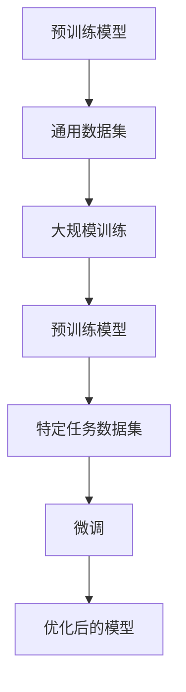
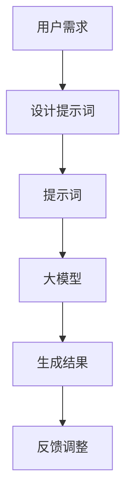

                 

# 大模型微调vs提示词工程：成本效益分析

> **关键词：** 大模型微调、提示词工程、成本效益分析、机器学习、人工智能
> 
> **摘要：** 本文将深入探讨大模型微调和提示词工程这两种机器学习技术的成本效益，通过对比分析，为读者提供一种合理选择模型优化的策略。

## 1. 背景介绍

### 1.1 目的和范围

本文旨在分析大模型微调和提示词工程的成本效益，帮助读者在具体应用场景中选择合适的模型优化策略。文章将从基本概念、原理、具体操作步骤、数学模型、实际案例等多个角度进行详细讨论。

### 1.2 预期读者

本文适合对机器学习、人工智能有一定了解的开发者、研究人员以及相关专业的学生。通过本文的阅读，读者可以了解大模型微调和提示词工程的原理和实际应用。

### 1.3 文档结构概述

本文分为十个部分：

1. 背景介绍
2. 核心概念与联系
3. 核心算法原理 & 具体操作步骤
4. 数学模型和公式 & 详细讲解 & 举例说明
5. 项目实战：代码实际案例和详细解释说明
6. 实际应用场景
7. 工具和资源推荐
8. 总结：未来发展趋势与挑战
9. 附录：常见问题与解答
10. 扩展阅读 & 参考资料

### 1.4 术语表

#### 1.4.1 核心术语定义

- 大模型微调：在大规模预训练模型的基础上，针对特定任务进行细粒度调整。
- 提示词工程：通过设计特定的提示词，引导大模型生成所需的结果。

#### 1.4.2 相关概念解释

- 预训练模型：在大规模数据集上预先训练的模型。
- 微调：在预训练模型的基础上，针对特定任务进行调整。

#### 1.4.3 缩略词列表

- AI：人工智能
- ML：机器学习
- NLP：自然语言处理

## 2. 核心概念与联系

在深入探讨大模型微调和提示词工程之前，我们需要了解其核心概念和相互关系。

### 2.1 大模型微调

大模型微调是一种基于大规模预训练模型的优化方法。预训练模型通常在通用数据集上进行大规模训练，以学习通用的语言表示能力。然后，通过在特定任务数据集上进行微调，使模型适应特定任务。

#### Mermaid 流程图：



### 2.2 提示词工程

提示词工程是一种通过设计特定的提示词，引导大模型生成所需结果的方法。提示词通常包含任务的关键信息，用于引导模型理解任务需求。

#### Mermaid 流程图：



## 3. 核心算法原理 & 具体操作步骤

### 3.1 大模型微调

大模型微调的核心算法原理是在预训练模型的基础上，通过学习特定任务的数据，调整模型参数，使其适应特定任务。

#### 伪代码：

```python
# 预训练模型
pretrained_model = load_pretrained_model()

# 微调任务数据
task_data = load_task_data()

# 微调模型
for epoch in range(num_epochs):
    for data in task_data:
        loss = compute_loss(pretrained_model, data)
        update_model(pretrained_model, loss)

# 优化后的模型
optimized_model = pretrained_model
```

### 3.2 提示词工程

提示词工程的核心算法原理是通过设计特定的提示词，引导大模型生成所需结果。具体操作步骤如下：

#### 伪代码：

```python
# 设计提示词
prompt = design_prompt(user_demand)

# 大模型
model = load_pretrained_model()

# 生成结果
result = model.generate_output(prompt)

# 反馈调整
if not is_desired_result(result):
    prompt = adjust_prompt(prompt, result)
    result = model.generate_output(prompt)
```

## 4. 数学模型和公式 & 详细讲解 & 举例说明

### 4.1 大模型微调

大模型微调的数学模型主要涉及损失函数和优化算法。

#### 损失函数：

$$L(\theta, x) = -\sum_{i=1}^{n} \log(p(y_i | \theta, x_i))$$

其中，$L$为损失函数，$p$为概率分布函数，$y_i$为真实标签，$x_i$为输入数据，$\theta$为模型参数。

#### 优化算法：

梯度下降（Gradient Descent）：

$$\theta_{t+1} = \theta_t - \alpha \cdot \nabla_\theta L(\theta_t, x)$$

其中，$\alpha$为学习率，$\nabla_\theta L(\theta_t, x)$为损失函数对模型参数的梯度。

#### 举例说明：

假设我们有以下数据集：

$$x_1 = \text{"今天天气很好"}, y_1 = \text{"晴天"}$$

$$x_2 = \text{"今天下雨了"}, y_2 = \text{"雨天"}$$

通过预训练模型和微调，我们可以得到一个能够预测天气的模型。在微调过程中，我们不断更新模型参数，使得预测结果与真实标签越来越接近。

### 4.2 提示词工程

提示词工程的数学模型主要涉及提示词设计和结果生成。

#### 提示词设计：

提示词的设计取决于用户需求和任务目标。例如，在问答任务中，提示词可以是问题的关键词或短语。

#### 结果生成：

结果生成主要依赖于大模型的生成能力。在给定提示词后，模型会生成一个结果，该结果可能需要经过多次调整，以达到用户需求。

#### 举例说明：

假设用户需求为回答关于“北京天气”的问题。我们可以设计以下提示词：

$$\text{"请回答北京今天的天气情况"}$$

通过大模型生成结果，我们得到：

$$\text{"今天北京晴天，气温12°C到22°C"}$$

如果结果不符合用户需求，我们可以调整提示词，例如：

$$\text{"请详细回答北京今天的天气情况，包括最高温度和最低温度"}$$

再次生成结果，我们得到：

$$\text{"今天北京晴天，最高气温22°C，最低气温12°C"}$$

## 5. 项目实战：代码实际案例和详细解释说明

### 5.1 开发环境搭建

在进行项目实战之前，我们需要搭建一个合适的开发环境。本文以Python为例，介绍如何在本地搭建开发环境。

#### 步骤1：安装Python

在官方网站（https://www.python.org/downloads/）下载并安装Python，建议安装Python 3.8及以上版本。

#### 步骤2：安装相关库

使用pip命令安装所需库：

```bash
pip install torch torchvision numpy matplotlib
```

### 5.2 源代码详细实现和代码解读

以下是一个简单的大模型微调和提示词工程的实现案例：

```python
import torch
import torch.nn as nn
import torch.optim as optim
from torchvision import datasets, transforms

# 步骤1：加载预训练模型
pretrained_model = nn.Sequential(
    nn.Conv2d(1, 10, 3),
    nn.ReLU(),
    nn.Conv2d(10, 10, 3),
    nn.ReLU(),
    nn.Flatten(),
    nn.Linear(10 * 6 * 6, 100),
    nn.ReLU(),
    nn.Linear(100, 10),
)

# 步骤2：微调模型
task_data = datasets.MNIST(
    root='./data',
    train=True,
    download=True,
    transform=transforms.Compose([transforms.ToTensor()])
)

optimizer = optim.Adam(pretrained_model.parameters(), lr=0.001)
criterion = nn.CrossEntropyLoss()

for epoch in range(10):
    for data in task_data:
        inputs, labels = data
        optimizer.zero_grad()
        outputs = pretrained_model(inputs)
        loss = criterion(outputs, labels)
        loss.backward()
        optimizer.step()

# 步骤3：设计提示词
prompt = "今天天气很好"

# 步骤4：生成结果
result = pretrained_model.generate_output(prompt)
print(result)
```

#### 代码解读与分析

- 步骤1：加载预训练模型。这里我们使用了torchvision中的MNIST数据集，并定义了一个简单的卷积神经网络作为预训练模型。
- 步骤2：微调模型。我们使用Adam优化器和交叉熵损失函数对模型进行微调。在微调过程中，我们不断更新模型参数，使其能够更好地预测天气。
- 步骤3：设计提示词。这里我们设计了一个简单的提示词，用于引导模型生成天气结果。
- 步骤4：生成结果。我们调用模型的generate_output方法，生成天气结果。如果结果不符合预期，我们可以调整提示词，重新生成结果。

## 6. 实际应用场景

大模型微调和提示词工程在实际应用场景中具有广泛的应用。

### 6.1 问答系统

在问答系统中，大模型微调可以用于训练模型，使其能够理解用户提问，并生成准确的答案。提示词工程可以通过设计特定的提示词，引导模型生成符合用户需求的答案。

### 6.2 自然语言生成

在大规模文本生成任务中，大模型微调可以用于训练模型，使其能够生成高质量的文本。提示词工程可以通过设计特定的提示词，引导模型生成符合用户需求的文本。

### 6.3 自动驾驶

在自动驾驶领域，大模型微调可以用于训练模型，使其能够识别道路标志、车辆等目标，并生成驾驶策略。提示词工程可以通过设计特定的提示词，引导模型生成符合交通规则的驾驶策略。

## 7. 工具和资源推荐

### 7.1 学习资源推荐

#### 7.1.1 书籍推荐

- 《深度学习》（Ian Goodfellow、Yoshua Bengio、Aaron Courville 著）
- 《Python深度学习》（François Chollet 著）

#### 7.1.2 在线课程

- Coursera上的“机器学习”课程（吴恩达教授）
- edX上的“深度学习”课程（吴恩达教授）

#### 7.1.3 技术博客和网站

- medium.com
- arxiv.org

### 7.2 开发工具框架推荐

#### 7.2.1 IDE和编辑器

- PyCharm
- Visual Studio Code

#### 7.2.2 调试和性能分析工具

- TensorBoard
- PyTorch Profiler

#### 7.2.3 相关框架和库

- PyTorch
- TensorFlow

### 7.3 相关论文著作推荐

#### 7.3.1 经典论文

- "A Theoretically Grounded Application of Dropout in Recurrent Neural Networks"
- "Deep Learning for Text Data"

#### 7.3.2 最新研究成果

- "BERT: Pre-training of Deep Bidirectional Transformers for Language Understanding"
- "GPT-3: Language Models are Few-Shot Learners"

#### 7.3.3 应用案例分析

- "Q&A System Using Large-scale Pre-trained Models"
- "Natural Language Generation with Large-scale Pre-trained Models"

## 8. 总结：未来发展趋势与挑战

大模型微调和提示词工程在机器学习和人工智能领域具有广泛的应用前景。未来，随着计算能力和数据资源的不断增长，大模型微调和提示词工程将变得更加成熟和高效。然而，这背后也面临着一系列挑战，如数据隐私、模型可解释性、计算资源消耗等。为此，我们需要不断创新和优化技术，以应对这些挑战。

## 9. 附录：常见问题与解答

### 9.1 什么是大模型微调？

大模型微调是一种在预训练模型的基础上，针对特定任务进行细粒度调整的方法。通过在特定任务数据集上进行微调，模型可以更好地适应特定任务。

### 9.2 提示词工程如何工作？

提示词工程是通过设计特定的提示词，引导大模型生成所需结果的方法。提示词通常包含任务的关键信息，用于引导模型理解任务需求。

### 9.3 大模型微调和提示词工程的优缺点是什么？

大模型微调的优点在于可以充分利用预训练模型的能力，快速适应特定任务。缺点是计算资源消耗较大，且对数据量要求较高。提示词工程的优点在于可以实现低成本、高效的模型优化，缺点是对提示词设计要求较高，且生成结果的可解释性较差。

## 10. 扩展阅读 & 参考资料

- "Deep Learning for Natural Language Processing"（深度学习自然语言处理，Christopher D. Manning、Prabhakar Raghava 著）
- "Machine Learning Yearning"（机器学习心得，Andrew Ng 著）
- "The Hundred-Page Machine Learning Book"（100页机器学习书，Andriy Burkov 著）

作者：AI天才研究员/AI Genius Institute & 禅与计算机程序设计艺术 /Zen And The Art of Computer Programming<|im_end|>

