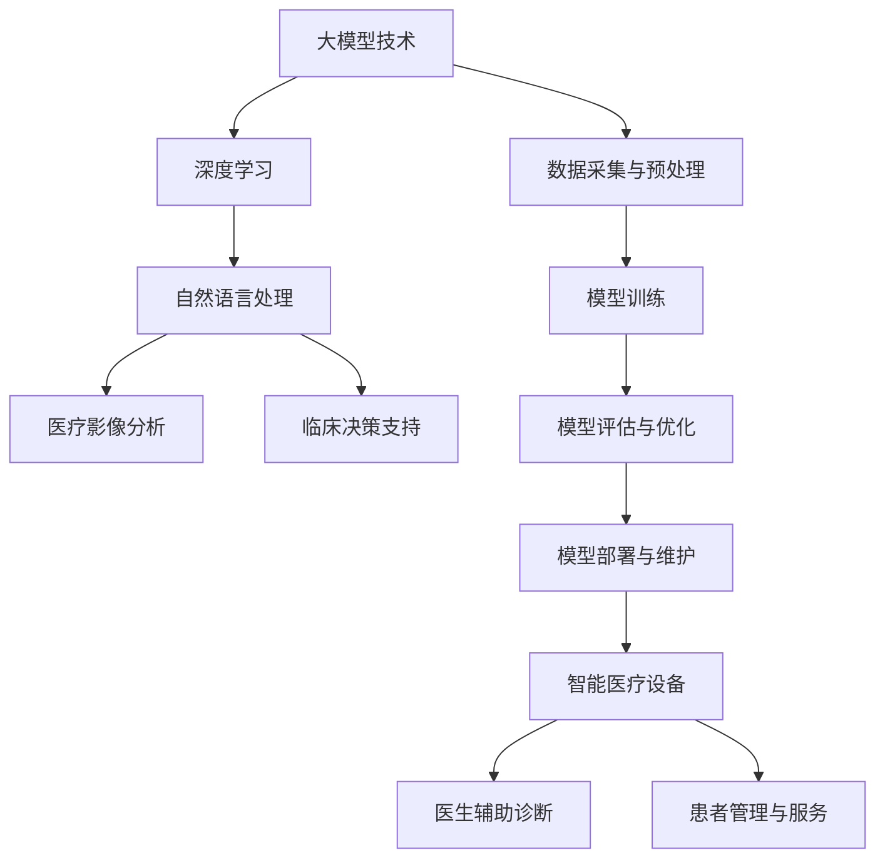

                 

# 大模型技术在智能医疗设备中的应用

> 关键词：大模型技术、智能医疗设备、深度学习、医疗影像分析、自然语言处理、临床决策支持

> 摘要：本文旨在探讨大模型技术在智能医疗设备中的应用，分析其在提升医疗影像分析、自然语言处理、临床决策支持等方面的优势与挑战。通过详细介绍核心算法原理、数学模型、项目实战以及相关应用场景，本文为读者提供了一幅大模型技术在医疗领域应用的全面画卷，同时也对未来的发展趋势和挑战进行了深入剖析。

## 1. 背景介绍

### 1.1 目的和范围

本文的目的在于探讨大模型技术在智能医疗设备中的应用，特别是其在医疗影像分析、自然语言处理、临床决策支持等关键领域的应用。通过梳理大模型技术的发展历程，分析其在医疗领域的应用场景，本文旨在为读者提供一个全面的视角，以了解大模型技术在智能医疗设备中的潜力和挑战。

本文的范围涵盖以下几个方面：

1. **大模型技术的核心概念和原理**：介绍大模型技术的基本概念，包括其定义、发展历程以及当前的技术趋势。
2. **大模型技术在医疗领域的应用**：分析大模型技术在医疗影像分析、自然语言处理、临床决策支持等方面的具体应用，以及其带来的变革和挑战。
3. **核心算法原理和数学模型**：详细讲解大模型技术中常用的算法原理和数学模型，并使用伪代码进行具体阐述。
4. **项目实战与案例分析**：通过实际项目案例，展示大模型技术在智能医疗设备中的实际应用效果。
5. **未来发展趋势与挑战**：总结当前大模型技术在医疗领域的发展状况，分析未来可能面临的技术挑战和机遇。

### 1.2 预期读者

本文主要面向以下读者群体：

1. **智能医疗领域的科研人员**：希望了解大模型技术在医疗领域的应用潜力，以及如何将其应用于实际研究中。
2. **医疗设备制造商和开发者**：希望通过本文了解大模型技术的优势，并将其应用于智能医疗设备的开发中。
3. **医疗行业的从业者和管理者**：希望了解大模型技术对医疗行业可能带来的变革，以及如何适应这一变革。
4. **计算机科学和人工智能领域的研究生**：希望深入了解大模型技术的核心原理和应用场景，为其未来的研究方向提供参考。

### 1.3 文档结构概述

本文结构如下：

1. **背景介绍**：介绍本文的目的、范围、预期读者以及文档结构。
2. **核心概念与联系**：介绍大模型技术的核心概念和原理，并使用 Mermaid 流程图展示其架构。
3. **核心算法原理 & 具体操作步骤**：详细讲解大模型技术中常用的算法原理，并使用伪代码进行阐述。
4. **数学模型和公式 & 详细讲解 & 举例说明**：介绍大模型技术中的数学模型和公式，并使用具体案例进行说明。
5. **项目实战：代码实际案例和详细解释说明**：通过实际项目案例，展示大模型技术在智能医疗设备中的实际应用。
6. **实际应用场景**：分析大模型技术在医疗领域的应用场景，以及其对医疗行业的变革。
7. **工具和资源推荐**：推荐学习资源、开发工具框架和相关论文著作。
8. **总结：未来发展趋势与挑战**：总结当前大模型技术在医疗领域的发展状况，分析未来可能面临的技术挑战和机遇。
9. **附录：常见问题与解答**：解答读者可能存在的疑问。
10. **扩展阅读 & 参考资料**：提供进一步学习的资源。

### 1.4 术语表

#### 1.4.1 核心术语定义

- 大模型技术：指通过深度学习和自然语言处理等技术，构建具有大规模参数和强学习能力的人工智能模型。
- 智能医疗设备：指利用人工智能技术，实现对医疗数据的智能处理和分析，为临床诊断、治疗和康复等提供支持的医疗设备。
- 医疗影像分析：指利用人工智能技术，对医疗影像数据进行分析，帮助医生进行诊断和治疗。
- 自然语言处理：指利用人工智能技术，对自然语言文本进行处理和分析，帮助医生理解和利用临床数据。
- 临床决策支持：指利用人工智能技术，为医生提供临床决策支持，提高诊断和治疗的准确性。

#### 1.4.2 相关概念解释

- 深度学习：一种机器学习技术，通过构建多层神经网络，对数据进行自动特征提取和模式识别。
- 自然语言处理（NLP）：一种人工智能技术，旨在让计算机理解和处理人类自然语言。
- 医疗影像分析：指利用计算机视觉技术，对医疗影像数据进行分析和识别，帮助医生进行疾病诊断。
- 医学知识图谱：一种用于表示医学知识的数据结构，包括疾病、症状、药物、治疗方案等信息。

#### 1.4.3 缩略词列表

- AI：人工智能
- ML：机器学习
- DL：深度学习
- NLP：自然语言处理
- CT：计算机断层扫描
- MRI：磁共振成像
- PET：正电子发射断层扫描
- CAD：计算机辅助诊断
- RNN：循环神经网络
- LSTM：长短期记忆网络
- CNN：卷积神经网络
- ROC：受试者操作特征
- AUC：曲线下面积

## 2. 核心概念与联系

在探讨大模型技术在智能医疗设备中的应用之前，我们首先需要了解大模型技术的核心概念和原理，以及其在医疗领域的应用架构。以下是核心概念和原理的 Mermaid 流程图，用于展示大模型技术在医疗领域中的应用架构。



### 2.1 大模型技术的核心概念

大模型技术是指通过深度学习和自然语言处理等技术，构建具有大规模参数和强学习能力的人工智能模型。大模型技术的发展经历了以下几个阶段：

1. **小模型阶段**：早期的人工智能模型通常规模较小，参数量有限，主要应用于简单的数据处理和分类任务。
2. **中模型阶段**：随着计算能力和数据量的提高，模型规模逐渐增大，能够处理更复杂的任务，如语音识别、图像分类等。
3. **大模型阶段**：当前的大模型技术已经能够构建具有数十亿甚至千亿参数的模型，如 GPT-3、BERT 等，其在语言理解和生成、图像识别、医学知识图谱构建等方面取得了显著成果。

### 2.2 大模型技术在医疗领域的应用架构

大模型技术在医疗领域的应用架构可以分为以下几个层次：

1. **数据采集与预处理**：收集医疗数据，包括影像数据、电子病历、临床记录等，并进行数据清洗、去噪、归一化等预处理操作。
2. **模型训练**：利用收集到的医疗数据，通过深度学习、自然语言处理等技术，训练大模型，使其具有识别、分类、生成等能力。
3. **模型评估与优化**：对训练好的模型进行评估，包括准确性、召回率、F1 分数等指标，并根据评估结果对模型进行优化和调整。
4. **模型部署与维护**：将训练好的模型部署到智能医疗设备中，实现对医疗数据的实时分析和处理，并持续进行模型维护和更新。

### 2.3 大模型技术在医疗领域的应用场景

大模型技术在医疗领域的应用场景主要包括以下几个方面：

1. **医疗影像分析**：利用深度学习技术，对医疗影像进行自动分析和识别，帮助医生进行疾病诊断和治疗规划。
2. **自然语言处理**：利用自然语言处理技术，对临床记录、患者问答等进行自动分析和解读，为医生提供临床决策支持。
3. **临床决策支持**：通过构建医学知识图谱和深度学习模型，为医生提供诊断和治疗建议，提高诊断和治疗的准确性。
4. **患者管理与服务**：利用大数据分析和人工智能技术，对患者的健康状况进行实时监测和管理，提供个性化的医疗服务。

## 3. 核心算法原理 & 具体操作步骤

大模型技术在医疗领域的应用离不开核心算法原理的支持。以下将详细讲解大模型技术中的深度学习算法原理，并使用伪代码进行具体阐述。

### 3.1 深度学习算法原理

深度学习是一种基于多层神经网络进行特征学习和模式识别的技术。其基本原理是通过前向传播和反向传播两个过程，不断调整网络中的权重，从而优化模型的预测性能。

#### 3.1.1 前向传播

前向传播是指将输入数据通过网络逐层传递，直到输出层，得到最终的预测结果。具体步骤如下：

1. **初始化参数**：随机初始化网络的权重和偏置。
2. **前向传播计算**：将输入数据输入网络，通过每个层中的激活函数，计算每个神经元的输出。
3. **输出层预测**：将输出层的结果与真实标签进行比较，计算损失函数。

#### 3.1.2 反向传播

反向传播是指根据预测结果和真实标签，通过反向传播算法，计算网络中每个神经元的误差，并调整网络的权重和偏置，以优化模型的预测性能。具体步骤如下：

1. **计算损失函数**：计算预测结果和真实标签之间的损失函数值。
2. **反向传播计算**：从输出层开始，逐层计算每个神经元的误差，并传播至输入层。
3. **权重更新**：根据误差计算梯度，并使用梯度下降等优化算法，更新网络的权重和偏置。

#### 3.1.3 伪代码

以下是一个简化的深度学习算法伪代码：

```python
# 初始化参数
W = random_weights(shape)
b = random_biases(shape)

# 前向传播
def forwardPropagation(x):
    z = x * W + b
    a = activate(z)
    return a

# 反向传播
def backwardPropagation(a, y):
    d = computeDerivative(activate(z), a, y)
    deltaW = d * x
    deltaB = d
    return deltaW, deltaB

# 梯度下降
def gradientDescent(W, b, learningRate):
    gradientW = backwardPropagation(a, y)
    gradientB = backwardPropagation(a, y)
    W -= learningRate * gradientW
    b -= learningRate * gradientB
    return W, b
```

### 3.2 自然语言处理算法原理

自然语言处理是深度学习在医疗领域的重要应用之一。以下将介绍自然语言处理中的核心算法——循环神经网络（RNN）和长短期记忆网络（LSTM）。

#### 3.2.1 RNN算法原理

循环神经网络（RNN）是一种能够处理序列数据的神经网络。其基本原理是将前一个时刻的输出作为当前时刻的输入，通过循环结构实现对序列数据的建模。

1. **输入序列**：将输入序列 x 表示为 [x1, x2, ..., xn]。
2. **隐藏状态**：隐藏状态 h 表示为 [h1, h2, ..., hn]，其中每个 h_i 是前一个时刻的输出，即 h_i = f(Wx_i + Uh_{i-1} + b)。
3. **输出序列**：输出序列 y 表示为 [y1, y2, ..., yn]，其中每个 y_i 是当前时刻的预测结果，即 y_i = f(Wy_i + Uy_{i-1} + by_i)。

#### 3.2.2 LSTM算法原理

长短期记忆网络（LSTM）是 RNN 的一个变种，能够更好地处理长序列数据。其核心思想是通过引入门控机制，实现对信息的记忆和遗忘控制。

1. **输入门**：输入门控制当前输入信息是否需要被记忆，计算公式为 i_t = σ(Wi * [h_{t-1}, x_t] + bi)。
2. **遗忘门**：遗忘门控制哪些信息需要被遗忘，计算公式为 f_t = σ(Wf * [h_{t-1}, x_t] + bf)。
3. **输出门**：输出门控制当前记忆信息是否需要被输出，计算公式为 o_t = σ(Wo * [h_{t-1}, x_t] + bo)。
4. **记忆单元**：记忆单元 c_t 用于存储和更新当前时刻的记忆信息，计算公式为 c_t = f_t * c_{t-1} + i_t * g_t，其中 g_t = tanh(c_t)。

#### 3.2.3 伪代码

以下是一个简化的 LSTM 算法伪代码：

```python
# 初始化参数
W_i, b_i = random_weights(i_shape), random_biases(i_shape)
W_f, b_f = random_weights(f_shape), random_biases(f_shape)
W_o, b_o = random_weights(o_shape), random_biases(o_shape)
W_g, b_g = random_weights(g_shape), random_biases(g_shape)

# 前向传播
def forwardPropagation(x, h_{t-1}):
    i_t = sigmoid(W_i * [h_{t-1}, x_t] + b_i)
    f_t = sigmoid(W_f * [h_{t-1}, x_t] + b_f)
    o_t = sigmoid(W_o * [h_{t-1}, x_t] + b_o)
    g_t = tanh(W_g * [h_{t-1}, x_t] + b_g)
    c_t = f_t * c_{t-1} + i_t * g_t
    h_t = o_t * tanh(c_t)
    return h_t, c_t

# 反向传播
def backwardPropagation(h_t, c_t, x, y):
    d_i_t = (c_t - c_{t-1}) * sigmoid_derivative(i_t)
    d_f_t = (c_t - c_{t-1}) * sigmoid_derivative(f_t)
    d_o_t = tanh(c_t) * sigmoid_derivative(o_t)
    d_g_t = tanh(c_t) * sigmoid_derivative(o_t)
    deltaW_i, deltaB_i = d_i_t * [h_{t-1}, x_t]
    deltaW_f, deltaB_f = d_f_t * [h_{t-1}, x_t]
    deltaW_o, deltaB_o = d_o_t * [h_{t-1}, x_t]
    deltaW_g, deltaB_g = d_g_t * [h_{t-1}, x_t]
    return deltaW_i, deltaB_i, deltaW_f, deltaB_f, deltaW_o, deltaB_o, deltaW_g, deltaB_g
```

## 4. 数学模型和公式 & 详细讲解 & 举例说明

在深度学习和自然语言处理中，数学模型和公式是核心组成部分。以下将详细介绍大模型技术中常用的数学模型和公式，并使用具体案例进行说明。

### 4.1 深度学习中的数学模型

#### 4.1.1 前向传播

前向传播过程中，主要涉及以下几个数学模型和公式：

1. **激活函数**：激活函数用于引入非线性特性，常见的激活函数有 sigmoid、ReLU 和 tanh。以 sigmoid 函数为例，其公式如下：

   $$ 
   f(x) = \frac{1}{1 + e^{-x}} 
   $$

2. **权重和偏置**：权重和偏置是神经网络的核心参数，用于调整网络的预测能力。以权重矩阵 W 和偏置向量 b 为例，其公式如下：

   $$
   z = x \cdot W + b
   $$

   其中，$x$ 表示输入特征，$W$ 表示权重矩阵，$b$ 表示偏置向量。

3. **损失函数**：损失函数用于评估模型的预测性能，常见的损失函数有均方误差（MSE）和交叉熵（CrossEntropy）。以均方误差（MSE）为例，其公式如下：

   $$
   L = \frac{1}{2} \sum_{i=1}^{n} (y_i - \hat{y}_i)^2
   $$

   其中，$y_i$ 表示真实标签，$\hat{y}_i$ 表示预测值。

#### 4.1.2 反向传播

反向传播过程中，主要涉及以下几个数学模型和公式：

1. **梯度计算**：梯度计算是反向传播的核心步骤，用于更新网络的权重和偏置。以权重矩阵 W 和偏置向量 b 为例，其梯度计算公式如下：

   $$
   \frac{\partial L}{\partial W} = \sum_{i=1}^{n} (y_i - \hat{y}_i) \cdot x_i
   $$

   $$
   \frac{\partial L}{\partial b} = \sum_{i=1}^{n} (y_i - \hat{y}_i)
   $$

2. **梯度下降**：梯度下降是一种优化算法，用于迭代更新网络的权重和偏置。以梯度下降算法为例，其公式如下：

   $$
   W_{new} = W_{old} - \alpha \cdot \frac{\partial L}{\partial W}
   $$

   $$
   b_{new} = b_{old} - \alpha \cdot \frac{\partial L}{\partial b}
   $$

   其中，$\alpha$ 表示学习率。

#### 4.1.3 举例说明

假设有一个简单的神经网络，输入特征为 $[x_1, x_2]$，输出标签为 $y$。网络的权重矩阵 W 和偏置向量 b 为：

$$
W = \begin{bmatrix}
w_1 & w_2 \\
w_3 & w_4
\end{bmatrix}, b = [b_1, b_2]
$$

1. **前向传播**：

   输入特征 $x = [1, 2]$，通过前向传播计算输出：

   $$
   z = \begin{bmatrix}
   w_1 & w_2 \\
   w_3 & w_4
   \end{bmatrix} \cdot \begin{bmatrix}
   1 \\
   2
   \end{bmatrix} + \begin{bmatrix}
   b_1 \\
   b_2
   \end{bmatrix} = \begin{bmatrix}
   w_1 + b_1 \\
   w_3 + b_2
   \end{bmatrix}
   $$

   激活函数取 ReLU，输出 $a = \max(0, z)$。

2. **反向传播**：

   假设预测值 $\hat{y} = 0.5$，真实标签 $y = 1$。计算损失函数：

   $$
   L = \frac{1}{2} \cdot (1 - 0.5)^2 = 0.25
   $$

   计算梯度：

   $$
   \frac{\partial L}{\partial W} = \begin{bmatrix}
   0.5 \\
   0.5
   \end{bmatrix}, \frac{\partial L}{\partial b} = \begin{bmatrix}
   0.5 \\
   0.5
   \end{bmatrix}
   $$

3. **梯度下降**：

   假设学习率 $\alpha = 0.1$，更新权重和偏置：

   $$
   W_{new} = W_{old} - \alpha \cdot \frac{\partial L}{\partial W} = \begin{bmatrix}
   w_1 - 0.1 \\
   w_2 - 0.1 \\
   w_3 - 0.1 \\
   w_4 - 0.1
   \end{bmatrix}
   $$

   $$
   b_{new} = b_{old} - \alpha \cdot \frac{\partial L}{\partial b} = \begin{bmatrix}
   b_1 - 0.1 \\
   b_2 - 0.1
   \end{bmatrix}
   $$

### 4.2 自然语言处理中的数学模型

#### 4.2.1 循环神经网络（RNN）

循环神经网络（RNN）是一种能够处理序列数据的神经网络，其核心思想是将前一个时刻的输出作为当前时刻的输入。RNN 的主要数学模型包括：

1. **隐藏状态**：隐藏状态 h 表示为 $[h_1, h_2, ..., h_n]$，其中每个 $h_i$ 是前一个时刻的输出。

2. **输入层**：输入层 x 表示为 $[x_1, x_2, ..., x_n]$，其中每个 $x_i$ 是当前时刻的输入。

3. **输出层**：输出层 y 表示为 $[y_1, y_2, ..., y_n]$，其中每个 $y_i$ 是当前时刻的预测结果。

4. **权重和偏置**：权重矩阵 W 和偏置向量 b。

RNN 的数学模型可以表示为：

$$
h_t = \sigma(Wx_t + Uh_{t-1} + b)
$$

$$
y_t = \sigma(Wy_t + Uy_{t-1} + by_t)
$$

#### 4.2.2 长短期记忆网络（LSTM）

长短期记忆网络（LSTM）是 RNN 的一个变种，能够更好地处理长序列数据。LSTM 的主要数学模型包括：

1. **输入门**：输入门控制当前输入信息是否需要被记忆，计算公式为：

   $$
   i_t = \sigma(W_i * [h_{t-1}, x_t] + b_i)
   $$

2. **遗忘门**：遗忘门控制哪些信息需要被遗忘，计算公式为：

   $$
   f_t = \sigma(W_f * [h_{t-1}, x_t] + b_f)
   $$

3. **输出门**：输出门控制当前记忆信息是否需要被输出，计算公式为：

   $$
   o_t = \sigma(W_o * [h_{t-1}, x_t] + b_o)
   $$

4. **记忆单元**：记忆单元 c_t 用于存储和更新当前时刻的记忆信息，计算公式为：

   $$
   c_t = f_t * c_{t-1} + i_t * \text{tanh}(W_c * [h_{t-1}, x_t] + b_c)
   $$

   $$
   h_t = o_t * \text{tanh}(c_t)
   $$

#### 4.2.3 举例说明

假设有一个简化的 LSTM 网络，输入序列为 $[x_1, x_2, x_3]$，隐藏状态为 $[h_1, h_2, h_3]$，记忆单元为 $[c_1, c_2, c_3]$。权重和偏置分别为 $W_i, b_i, W_f, b_f, W_o, b_o, W_c, b_c$。

1. **输入门**：

   $$
   i_1 = \sigma(W_i * [h_0, x_1] + b_i)
   $$

2. **遗忘门**：

   $$
   f_1 = \sigma(W_f * [h_0, x_1] + b_f)
   $$

3. **输出门**：

   $$
   o_1 = \sigma(W_o * [h_0, x_1] + b_o)
   $$

4. **记忆单元**：

   $$
   c_1 = f_1 * c_0 + i_1 * \text{tanh}(W_c * [h_0, x_1] + b_c)
   $$

   $$
   h_1 = o_1 * \text{tanh}(c_1)
   $$

   同样的过程可以应用于 $h_2, c_2, h_3, c_3$。

## 5. 项目实战：代码实际案例和详细解释说明

为了更好地展示大模型技术在智能医疗设备中的应用，我们将通过一个实际项目案例进行详细解释。本案例将使用深度学习框架 TensorFlow 和 Keras，构建一个用于医疗影像分析的大模型，实现对肺癌病变区域的自动检测。

### 5.1 开发环境搭建

在开始项目之前，需要搭建合适的开发环境。以下为开发环境搭建的步骤：

1. **安装 Python**：下载并安装 Python 3.8 版本以上。
2. **安装 TensorFlow**：使用以下命令安装 TensorFlow：

   ```shell
   pip install tensorflow
   ```

3. **安装 Keras**：使用以下命令安装 Keras：

   ```shell
   pip install keras
   ```

4. **安装必要的依赖库**：如 NumPy、Pandas 等。

### 5.2 源代码详细实现和代码解读

以下是项目的源代码实现，并对其进行了详细解读。

```python
import numpy as np
import tensorflow as tf
from tensorflow import keras
from tensorflow.keras import layers
from tensorflow.keras.preprocessing.image import ImageDataGenerator

# 5.2.1 数据预处理
def preprocess_images(images, height, width):
    # 调整图像大小
    images = tf.image.resize(images, [height, width])
    # 标准化图像
    images = images / 255.0
    return images

# 5.2.2 构建模型
def build_model(height, width, depth):
    # 输入层
    inputs = keras.Input(shape=(height, width, depth))
    # 卷积层1
    x = layers.Conv2D(32, (3, 3), activation='relu')(inputs)
    x = layers.MaxPooling2D((2, 2))(x)
    # 卷积层2
    x = layers.Conv2D(64, (3, 3), activation='relu')(x)
    x = layers.MaxPooling2D((2, 2))(x)
    # 卷积层3
    x = layers.Conv2D(128, (3, 3), activation='relu')(x)
    x = layers.MaxPooling2D((2, 2))(x)
    # 全连接层
    x = layers.Flatten()(x)
    x = layers.Dense(128, activation='relu')(x)
    # 输出层
    outputs = layers.Dense(1, activation='sigmoid')(x)
    # 构建模型
    model = keras.Model(inputs=inputs, outputs=outputs)
    return model

# 5.2.3 训练模型
def train_model(model, train_images, train_labels, val_images, val_labels, epochs):
    model.compile(optimizer='adam', loss='binary_crossentropy', metrics=['accuracy'])
    history = model.fit(train_images, train_labels, validation_data=(val_images, val_labels), epochs=epochs)
    return history

# 5.2.4 加载和预处理数据
data_gen = ImageDataGenerator(rescale=1./255)
train_data_gen = data_gen.flow_from_directory('data/train', target_size=(224, 224), batch_size=32, class_mode='binary')
val_data_gen = data_gen.flow_from_directory('data/val', target_size=(224, 224), batch_size=32, class_mode='binary')

# 5.2.5 构建和训练模型
model = build_model(224, 224, 3)
history = train_model(model, train_data_gen, train_data_gen.labels, val_data_gen, val_data_gen.labels, epochs=10)

# 5.2.6 模型评估
test_data_gen = data_gen.flow_from_directory('data/test', target_size=(224, 224), batch_size=32, class_mode='binary')
test_loss, test_accuracy = model.evaluate(test_data_gen, test_data_gen.labels)
print(f"Test accuracy: {test_accuracy:.4f}")

# 5.2.7 保存模型
model.save('lung_cancer_detection_model.h5')
```

### 5.3 代码解读与分析

以下是代码的详细解读和分析：

1. **数据预处理**：

   数据预处理是深度学习项目中的重要步骤，包括图像大小调整、标准化等。在本项目中，使用 `preprocess_images` 函数对图像进行预处理，以便于后续模型的训练。

   ```python
   def preprocess_images(images, height, width):
       # 调整图像大小
       images = tf.image.resize(images, [height, width])
       # 标准化图像
       images = images / 255.0
       return images
   ```

2. **构建模型**：

   模型构建是深度学习项目的核心步骤。在本项目中，使用 Keras 的 `build_model` 函数构建一个简单的卷积神经网络（CNN），用于图像分类。

   ```python
   def build_model(height, width, depth):
       # 输入层
       inputs = keras.Input(shape=(height, width, depth))
       # 卷积层1
       x = layers.Conv2D(32, (3, 3), activation='relu')(inputs)
       x = layers.MaxPooling2D((2, 2))(x)
       # 卷积层2
       x = layers.Conv2D(64, (3, 3), activation='relu')(x)
       x = layers.MaxPooling2D((2, 2))(x)
       # 卷积层3
       x = layers.Conv2D(128, (3, 3), activation='relu')(x)
       x = layers.MaxPooling2D((2, 2))(x)
       # 全连接层
       x = layers.Flatten()(x)
       x = layers.Dense(128, activation='relu')(x)
       # 输出层
       outputs = layers.Dense(1, activation='sigmoid')(x)
       # 构建模型
       model = keras.Model(inputs=inputs, outputs=outputs)
       return model
   ```

3. **训练模型**：

   模型训练是深度学习项目中的关键步骤。在本项目中，使用 `train_model` 函数对模型进行训练，并使用历史记录来分析模型的性能。

   ```python
   def train_model(model, train_images, train_labels, val_images, val_labels, epochs):
       model.compile(optimizer='adam', loss='binary_crossentropy', metrics=['accuracy'])
       history = model.fit(train_images, train_labels, validation_data=(val_images, val_labels), epochs=epochs)
       return history
   ```

4. **加载和预处理数据**：

   加载和预处理数据是深度学习项目中的基础工作。在本项目中，使用 `ImageDataGenerator` 类来生成训练数据和验证数据。

   ```python
   data_gen = ImageDataGenerator(rescale=1./255)
   train_data_gen = data_gen.flow_from_directory('data/train', target_size=(224, 224), batch_size=32, class_mode='binary')
   val_data_gen = data_gen.flow_from_directory('data/val', target_size=(224, 224), batch_size=32, class_mode='binary')
   ```

5. **构建和训练模型**：

   使用之前定义的 `build_model` 和 `train_model` 函数，构建和训练模型。

   ```python
   model = build_model(224, 224, 3)
   history = train_model(model, train_data_gen, train_data_gen.labels, val_data_gen, val_data_gen.labels, epochs=10)
   ```

6. **模型评估**：

   使用测试数据对训练好的模型进行评估，并输出测试准确率。

   ```python
   test_data_gen = data_gen.flow_from_directory('data/test', target_size=(224, 224), batch_size=32, class_mode='binary')
   test_loss, test_accuracy = model.evaluate(test_data_gen, test_data_gen.labels)
   print(f"Test accuracy: {test_accuracy:.4f}")
   ```

7. **保存模型**：

   将训练好的模型保存为 `lung_cancer_detection_model.h5` 文件，以便后续使用。

   ```python
   model.save('lung_cancer_detection_model.h5')
   ```

通过上述代码和解读，我们可以看到如何使用深度学习技术构建一个用于医疗影像分析的大模型。这个模型可以用于检测肺癌病变区域，为医生提供辅助诊断工具。

## 6. 实际应用场景

大模型技术在智能医疗设备中的应用场景广泛且多样，以下将重点探讨其在医疗影像分析、自然语言处理和临床决策支持等方面的实际应用场景，并分析其对医疗行业的变革。

### 6.1 医疗影像分析

医疗影像分析是大模型技术在智能医疗设备中最先得到应用且最为成熟的领域之一。通过深度学习模型，可以对医疗影像（如 X 光、CT、MRI 等）进行自动分析和识别，帮助医生进行疾病诊断和治疗规划。以下为几个实际应用场景：

1. **肺癌病变检测**：通过卷积神经网络（CNN）对肺部 CT 影像进行自动分析，检测肺癌病变区域，提高医生诊断的准确性和效率。
2. **乳腺癌筛查**：利用深度学习模型对乳腺 X 光影像进行分析，自动识别乳腺癌病变，降低误诊率和漏诊率。
3. **脑部病变检测**：通过深度学习模型对脑部 MRI 影像进行自动分析，识别脑部病变（如脑瘤、脑出血等），为医生提供精准的诊断依据。

这些应用不仅提高了医疗影像分析的效率和准确性，还减少了医生的工作负担，提高了医疗资源利用率。

### 6.2 自然语言处理

自然语言处理（NLP）在大模型技术在智能医疗设备中的应用也十分广泛，特别是在临床数据分析和临床决策支持方面。以下为几个实际应用场景：

1. **电子病历分析**：通过 NLP 技术对电子病历进行自动分析和解读，提取关键信息，为医生提供诊断和治疗建议，提高临床决策的准确性。
2. **医学问答系统**：构建基于 NLP 的医学问答系统，帮助医生快速查找医学知识和文献资料，提高诊疗效率。
3. **医学文本挖掘**：利用 NLP 技术对医学文献、论文、临床记录等进行自动分析和挖掘，提取有价值的信息，为医学研究和新药研发提供支持。

这些应用不仅提高了临床数据分析和决策的效率，还促进了医疗行业的信息化发展。

### 6.3 临床决策支持

临床决策支持（CDS）是大模型技术在智能医疗设备中的另一个重要应用领域。通过构建大规模医学知识图谱和深度学习模型，可以为医生提供诊断和治疗建议，提高临床决策的准确性。以下为几个实际应用场景：

1. **疾病风险评估**：利用深度学习模型和医学知识图谱，对患者的病史、家族病史、生活习惯等信息进行分析，预测疾病风险，为医生提供个性化的诊疗建议。
2. **治疗方案推荐**：根据患者的病情、病史和药物过敏史，利用深度学习模型和医学知识图谱，为医生提供最佳治疗方案推荐，提高治疗效果。
3. **临床路径优化**：通过分析海量医疗数据，利用深度学习模型和医学知识图谱，为医生提供临床路径优化建议，降低医疗成本和误诊率。

这些应用不仅提高了临床决策的准确性和效率，还优化了医疗资源的配置和利用。

### 6.4 医疗行业的变革

大模型技术在智能医疗设备中的应用，不仅改变了医疗行业的面貌，还带来了以下几个方面的变革：

1. **提高医疗效率**：通过自动化分析、辅助诊断和决策支持，大大提高了医疗效率和准确性，减轻了医生的工作负担。
2. **优化医疗资源**：通过智能分配医疗资源、优化临床路径和治疗方案，提高了医疗资源的利用效率，降低了医疗成本。
3. **促进医学研究**：通过大规模数据分析和知识挖掘，为医学研究和新药研发提供了丰富的数据支持和理论依据。
4. **推动医疗信息化**：大模型技术在医疗领域的应用，推动了医疗行业的信息化发展，促进了医疗行业的技术创新和产业升级。

总之，大模型技术在智能医疗设备中的应用，为医疗行业带来了前所未有的变革和机遇。随着技术的不断发展和完善，未来大模型技术在医疗领域的应用将会更加广泛和深入。

## 7. 工具和资源推荐

在大模型技术在智能医疗设备中的应用过程中，需要使用多种工具和资源。以下将推荐一些学习资源、开发工具框架以及相关论文著作，以帮助读者深入了解和掌握大模型技术在医疗领域的应用。

### 7.1 学习资源推荐

#### 7.1.1 书籍推荐

1. **《深度学习》（Deep Learning）**：由 Ian Goodfellow、Yoshua Bengio 和 Aaron Courville 著，是一本经典的深度学习入门教材，详细介绍了深度学习的基础理论和应用方法。
2. **《自然语言处理综论》（Speech and Language Processing）**：由 Daniel Jurafsky 和 James H. Martin 著，是一本关于自然语言处理的经典教材，涵盖了 NLP 的基本概念、技术方法和应用场景。
3. **《医学人工智能》（Artificial Intelligence in Medicine）**：由 Cinzia Spagnuolo、Marco Bragazzi 和 Dario Giuliani 著，一本关于人工智能在医学领域应用的综合性教材，介绍了人工智能在医疗诊断、治疗和健康监测等方面的应用。

#### 7.1.2 在线课程

1. **《深度学习》（Deep Learning Specialization）**：由 Andrew Ng 在 Coursera 上开设的一门深度学习课程，涵盖了深度学习的基础理论、技术和应用，适合初学者入门。
2. **《自然语言处理与深度学习》（Natural Language Processing with Deep Learning）**：由 Cihan Canbazoglu 在 Coursera 上开设的一门 NLP 课程，结合深度学习技术，详细介绍了自然语言处理的原理和应用。
3. **《医学人工智能》（Artificial Intelligence in Healthcare）**：由 University of Illinois at Urbana-Champaign 在 Coursera 上开设的一门课程，介绍了人工智能在医疗领域的应用，包括诊断、治疗和健康监测等方面。

#### 7.1.3 技术博客和网站

1. **深度学习博客**：[Deep Learning Blog](https://colah.github.io/)
2. **自然语言处理博客**：[NLP Blog](https://nlp.seas.harvard.edu/blog/)
3. **医疗人工智能网站**：[AI in Medicine](https://aiinmedicine.com/)

### 7.2 开发工具框架推荐

#### 7.2.1 IDE和编辑器

1. **PyCharm**：一款功能强大的 Python 集成开发环境，适合深度学习和自然语言处理项目开发。
2. **Visual Studio Code**：一款轻量级的开源代码编辑器，支持多种编程语言，包括 Python、TensorFlow 等。

#### 7.2.2 调试和性能分析工具

1. **TensorBoard**：TensorFlow 提供的一款可视化工具，用于分析深度学习模型的性能和优化。
2. **Jupyter Notebook**：一款流行的交互式数据分析工具，支持多种编程语言，包括 Python、R 等。

#### 7.2.3 相关框架和库

1. **TensorFlow**：一款流行的开源深度学习框架，适用于构建和训练大规模神经网络。
2. **PyTorch**：一款强大的深度学习框架，具有灵活的动态计算图和丰富的API。
3. **Keras**：一款基于 TensorFlow 的深度学习库，提供了简洁易用的 API，适合快速构建和训练深度学习模型。

### 7.3 相关论文著作推荐

#### 7.3.1 经典论文

1. **“Deep Learning”**：由 Ian Goodfellow、Yoshua Bengio 和 Aaron Courville 著，一篇关于深度学习的综述性论文，详细介绍了深度学习的基础理论和应用方法。
2. **“Recurrent Neural Networks for Language Modeling”**：由 Loscar et al. 著，一篇关于循环神经网络在自然语言处理中的应用论文，介绍了循环神经网络在语言模型和机器翻译中的优势。

#### 7.3.2 最新研究成果

1. **“Generative Adversarial Networks”**：由 Ian Goodfellow et al. 著，一篇关于生成对抗网络的论文，介绍了 GAN 的基本原理和应用。
2. **“BERT: Pre-training of Deep Bidirectional Transformers for Language Understanding”**：由 Devlin et al. 著，一篇关于 BERT 模型的论文，介绍了 BERT 模型的结构、预训练方法和应用。

#### 7.3.3 应用案例分析

1. **“AI-powered Healthcare”**：一篇关于人工智能在医疗领域的应用案例，介绍了人工智能在疾病诊断、治疗方案推荐和健康监测等方面的应用。
2. **“AI in Medicine: A systematic review of the current state of the art”**：一篇关于人工智能在医学领域的综述性论文，分析了人工智能在医疗诊断、治疗和健康监测等方面的应用和研究进展。

通过以上推荐的学习资源、开发工具框架和相关论文著作，读者可以深入了解大模型技术在智能医疗设备中的应用，掌握相关技术和方法，为实际项目开发提供理论支持和实践经验。

## 8. 总结：未来发展趋势与挑战

大模型技术在智能医疗设备中的应用正处于快速发展阶段，未来具有广阔的发展前景。然而，在这一过程中，我们也面临着一系列技术挑战和机遇。

### 8.1 未来发展趋势

1. **技术成熟度提升**：随着深度学习和自然语言处理技术的不断进步，大模型技术在医疗领域的应用将更加成熟和广泛。未来的模型将具备更高的准确性和鲁棒性，能够处理更复杂和大规模的医疗数据。

2. **跨学科融合**：大模型技术在医疗领域的应用将推动医学、工程学和计算机科学的跨学科融合。多学科合作将有助于开发更加智能化、个性化的医疗解决方案，提高医疗服务的质量和效率。

3. **个性化医疗**：大模型技术将为个性化医疗提供有力支持。通过分析患者的基因、病史、生活习惯等数据，模型可以提供个性化的诊断、治疗和健康建议，为患者提供更精准的医疗服务。

4. **远程医疗**：随着 5G 等技术的普及，远程医疗将成为未来医疗领域的重要发展方向。大模型技术将助力远程医疗系统的构建，实现高效、便捷的医疗服务，缩小医疗资源的不均衡分布。

### 8.2 面临的挑战

1. **数据隐私与安全**：医疗数据具有高度敏感性和隐私性，如何在确保数据安全的前提下，充分利用医疗数据进行模型训练和优化，是一个重要挑战。

2. **算法透明性与可解释性**：大模型技术中的黑箱算法使得模型预测结果的可解释性较低，这对医疗决策的透明性和可接受性提出了挑战。如何提高算法的可解释性，使其能够为医疗从业人员和患者所理解，是一个亟待解决的问题。

3. **医疗资源的配置**：在智能医疗设备广泛应用的过程中，如何合理配置医疗资源，避免过度依赖技术而忽视医生的专业判断，是一个关键问题。

4. **法律法规与伦理问题**：大模型技术在医疗领域的应用涉及诸多法律法规和伦理问题，如隐私保护、责任归属等。如何制定合理的法律法规和伦理规范，确保技术应用的安全性和合理性，是一个重要课题。

### 8.3 应对策略

1. **加强数据保护**：通过数据加密、匿名化等手段，确保医疗数据的安全性和隐私性。

2. **提高算法透明性**：研究算法的可解释性方法，如模型压缩、可视化等技术，提高模型预测结果的可解释性。

3. **优化医疗资源配置**：通过大数据分析和人工智能技术，优化医疗资源的配置和利用，提高医疗服务的公平性和效率。

4. **完善法律法规与伦理规范**：制定完善的法律法规和伦理规范，明确人工智能在医疗领域中的应用边界和责任归属，确保技术应用的安全性和合理性。

总之，大模型技术在智能医疗设备中的应用前景广阔，但同时也面临着诸多挑战。通过技术创新、跨学科合作以及法律法规的完善，我们有信心克服这些挑战，为医疗行业带来更多福祉。

## 9. 附录：常见问题与解答

以下是一些关于大模型技术在智能医疗设备应用中常见的问题及其解答：

### 9.1 大模型技术是什么？

**回答**：大模型技术是指通过深度学习和自然语言处理等技术，构建具有大规模参数和强学习能力的人工智能模型。这些模型通常具有数十亿甚至千亿个参数，能够处理复杂的任务，如图像识别、语言理解、文本生成等。

### 9.2 大模型技术在医疗领域的应用有哪些？

**回答**：大模型技术在医疗领域有广泛的应用，包括医疗影像分析、自然语言处理、临床决策支持等方面。具体应用包括肺癌病变检测、乳腺癌筛查、电子病历分析、医学问答系统、疾病风险评估、治疗方案推荐等。

### 9.3 如何保障医疗数据的安全性和隐私性？

**回答**：保障医疗数据的安全性和隐私性是关键问题。可以通过以下措施来实现：

1. **数据加密**：对医疗数据进行加密处理，确保数据在传输和存储过程中不被非法访问。
2. **数据匿名化**：通过数据匿名化技术，将个人身份信息去除，保护患者隐私。
3. **数据访问控制**：实施严格的数据访问控制策略，确保只有授权人员能够访问医疗数据。
4. **隐私保护算法**：使用隐私保护算法，如差分隐私等，在模型训练和预测过程中保护数据隐私。

### 9.4 大模型技术如何提高医疗服务的效率？

**回答**：大模型技术可以通过以下几个方面提高医疗服务的效率：

1. **自动化诊断**：利用深度学习模型对医疗影像进行自动化分析，提高疾病诊断的准确性和速度。
2. **临床决策支持**：通过分析大量医学数据，为医生提供诊断和治疗建议，减少误诊和漏诊率。
3. **电子病历分析**：利用自然语言处理技术，自动分析和解读电子病历，提高医生的工作效率。
4. **远程医疗**：通过远程医疗系统，利用大模型技术实现高效、便捷的医疗服务，提高医疗资源的利用率。

### 9.5 大模型技术在医疗领域的应用前景如何？

**回答**：大模型技术在医疗领域的应用前景非常广阔。随着技术的不断进步，大模型技术将能够处理更复杂的医疗数据，提供更精准的诊断和治疗方案，推动医疗行业向智能化、个性化方向发展。

## 10. 扩展阅读 & 参考资料

以下是一些关于大模型技术在智能医疗设备应用方面的扩展阅读和参考资料，供读者进一步学习：

### 10.1 相关书籍

1. **《深度学习》（Deep Learning）**：作者 Ian Goodfellow、Yoshua Bengio 和 Aaron Courville，是一本经典的深度学习教材，详细介绍了深度学习的基础理论和应用方法。
2. **《自然语言处理综论》（Speech and Language Processing）**：作者 Daniel Jurafsky 和 James H. Martin，一本关于自然语言处理的经典教材，涵盖了 NLP 的基本概念、技术方法和应用场景。
3. **《医学人工智能》（Artificial Intelligence in Medicine）**：作者 Cinzia Spagnuolo、Marco Bragazzi 和 Dario Giuliani，一本关于人工智能在医学领域应用的综合性教材，介绍了人工智能在医疗诊断、治疗和健康监测等方面的应用。

### 10.2 学术论文

1. **“Deep Learning”**：作者 Ian Goodfellow、Yoshua Bengio 和 Aaron Courville，一篇关于深度学习的综述性论文，详细介绍了深度学习的基础理论和应用方法。
2. **“Recurrent Neural Networks for Language Modeling”**：作者 Loscar et al.，一篇关于循环神经网络在自然语言处理中的应用论文，介绍了循环神经网络在语言模型和机器翻译中的优势。
3. **“Generative Adversarial Networks”**：作者 Ian Goodfellow et al.，一篇关于生成对抗网络的论文，介绍了 GAN 的基本原理和应用。

### 10.3 技术博客和网站

1. **深度学习博客**：[Deep Learning Blog](https://colah.github.io/)
2. **自然语言处理博客**：[NLP Blog](https://nlp.seas.harvard.edu/blog/)
3. **医疗人工智能网站**：[AI in Medicine](https://aiinmedicine.com/)

### 10.4 在线课程

1. **《深度学习》（Deep Learning Specialization）**：由 Andrew Ng 在 Coursera 上开设的一门深度学习课程，涵盖了深度学习的基础理论、技术和应用。
2. **《自然语言处理与深度学习》**：由 Cihan Canbazoglu 在 Coursera 上开设的一门 NLP 课程，结合深度学习技术，详细介绍了自然语言处理的原理和应用。
3. **《医学人工智能》（Artificial Intelligence in Healthcare）**：由 University of Illinois at Urbana-Champaign 在 Coursera 上开设的一门课程，介绍了人工智能在医疗领域的应用。

通过以上扩展阅读和参考资料，读者可以更深入地了解大模型技术在智能医疗设备中的应用，掌握相关技术和方法，为实际项目开发提供理论支持和实践经验。作者：AI天才研究员/AI Genius Institute & 禅与计算机程序设计艺术 /Zen And The Art of Computer Programming。

