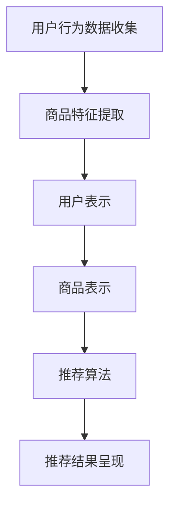

                 

# 大模型技术在电商平台商品推荐多样性优化中的应用

## 关键词
- 大模型技术
- 商品推荐系统
- 多样性优化
- 电商平台
- 深度学习

## 摘要
本文将探讨大模型技术在电商平台商品推荐多样性优化中的应用。首先，我们回顾了商品推荐系统的基本概念和原理，然后深入分析了当前主流的推荐算法及其局限性。在此基础上，本文重点介绍了如何利用大模型技术提升推荐系统的多样性和用户体验。通过一个具体的案例，我们详细展示了大模型技术在商品推荐多样性优化中的具体实现过程和效果。最后，我们对未来大模型技术在商品推荐系统中的发展趋势和挑战进行了展望。

## 1. 背景介绍

### 1.1 目的和范围

本文旨在探讨如何利用大模型技术优化电商平台的商品推荐多样性，从而提升用户满意度和电商平台竞争力。随着大数据和人工智能技术的发展，商品推荐系统已经成为电商平台的重要组成部分。然而，现有的推荐算法在多样性方面仍存在较大的局限性，这限制了用户对商品探索的广度和深度。本文将重点介绍大模型技术如何解决这一问题，并提供具体的解决方案和案例。

### 1.2 预期读者

本文预期读者为对电商平台商品推荐系统感兴趣的科研人员、工程师和从业者。读者应具备一定的编程基础和机器学习知识，能够理解并应用本文介绍的技术和方法。

### 1.3 文档结构概述

本文将分为以下几个部分：

1. 背景介绍：介绍商品推荐系统的基本概念、现有算法及其局限性。
2. 核心概念与联系：介绍大模型技术及其在商品推荐多样性优化中的应用。
3. 核心算法原理 & 具体操作步骤：详细讲解大模型技术在商品推荐多样性优化中的算法原理和操作步骤。
4. 数学模型和公式 & 详细讲解 & 举例说明：介绍相关的数学模型和公式，并给出具体例子进行说明。
5. 项目实战：代码实际案例和详细解释说明。
6. 实际应用场景：分析大模型技术在商品推荐多样性优化中的实际应用场景。
7. 工具和资源推荐：推荐相关的学习资源和开发工具。
8. 总结：总结本文的主要观点和未来发展趋势。
9. 附录：常见问题与解答。
10. 扩展阅读 & 参考资料：提供更多的相关阅读资料。

### 1.4 术语表

#### 1.4.1 核心术语定义

- 商品推荐系统：根据用户历史行为和偏好，为用户推荐相关商品的一种系统。
- 大模型技术：基于深度学习的大型神经网络模型，能够处理大量数据并进行复杂计算。
- 多样性优化：在商品推荐系统中，通过算法优化提高推荐结果的多样性，避免用户只看到相似的商品。

#### 1.4.2 相关概念解释

- 用户行为数据：包括用户的浏览、购买、收藏等行为数据。
- 商品特征：描述商品的各种属性，如价格、品牌、类别等。
- 推荐效果：衡量推荐系统性能的指标，包括准确率、覆盖率、多样性等。

#### 1.4.3 缩略词列表

- ML: 机器学习
- DL: 深度学习
- NLP: 自然语言处理
- GPU: 图形处理器
- API: 应用程序编程接口

## 2. 核心概念与联系

在深入探讨大模型技术在商品推荐多样性优化中的应用之前，我们首先需要了解一些核心概念和它们之间的联系。

### 2.1 商品推荐系统

商品推荐系统是一种基于用户行为和商品特征的数据分析系统，其主要目标是向用户推荐与其兴趣和需求相关的商品。推荐系统通常包括以下几个关键组成部分：

1. 用户行为数据收集：通过用户浏览、购买、收藏等行为数据来了解用户兴趣和需求。
2. 商品特征提取：对商品的各种属性进行提取，如价格、品牌、类别等，以便进行后续分析。
3. 推荐算法：根据用户行为数据和商品特征，使用算法模型计算推荐结果。
4. 推荐结果呈现：将推荐结果以可视化的方式呈现给用户，如推荐列表、推荐页等。

### 2.2 大模型技术

大模型技术是指基于深度学习的大型神经网络模型，其能够处理大量数据并进行复杂计算。大模型技术在推荐系统中的应用主要体现在以下几个方面：

1. 用户表示：使用深度学习模型对用户行为数据进行编码，生成用户向量表示。
2. 商品表示：使用深度学习模型对商品特征数据进行编码，生成商品向量表示。
3. 推荐算法优化：通过训练大模型，优化推荐算法的多样性、准确率和覆盖率等指标。

### 2.3 多样性优化

多样性优化是指在推荐系统中提高推荐结果的多样性，避免用户只看到相似的商品。多样性优化的关键在于如何从大量的商品中筛选出具有不同特点和风格的商品，以满足用户多样化的需求。

### 2.4 Mermaid 流程图

以下是一个简单的 Mermaid 流程图，展示了商品推荐系统的基本架构和流程：



## 3. 核心算法原理 & 具体操作步骤

在了解了大模型技术和商品推荐系统的基本概念后，我们将进一步探讨大模型技术在商品推荐多样性优化中的核心算法原理和具体操作步骤。

### 3.1 用户表示

用户表示是推荐系统的关键步骤之一，其主要目标是使用深度学习模型对用户行为数据进行编码，生成用户向量表示。以下是一个简单的用户表示算法原理和伪代码：

```python
# 用户表示算法原理
def user_representation(user行为数据):
    # 初始化用户向量
    user_vector = [0.0] * embedding_size
    
    # 使用深度学习模型对用户行为数据进行编码
    for 行为数据 in user行为数据:
        user_vector = 深度学习模型编码(行为数据, user_vector)
    
    return user_vector
```

### 3.2 商品表示

商品表示是对商品特征数据进行编码，生成商品向量表示的过程。与用户表示类似，商品表示也使用深度学习模型进行编码。以下是一个简单的商品表示算法原理和伪代码：

```python
# 商品表示算法原理
def item_representation(item特征数据):
    # 初始化商品向量
    item_vector = [0.0] * embedding_size
    
    # 使用深度学习模型对商品特征数据进行编码
    for 特征数据 in item特征数据:
        item_vector = 深度学习模型编码(特征数据, item_vector)
    
    return item_vector
```

### 3.3 推荐算法优化

在完成用户表示和商品表示后，我们可以使用大模型对推荐算法进行优化。以下是一个简单的推荐算法优化原理和伪代码：

```python
# 推荐算法优化原理
def recommendation_algorithm(user_vector, item_vectors):
    # 计算用户和商品之间的相似度
    similarity_matrix = [计算相似度(user_vector, item_vector) for item_vector in item_vectors]
    
    # 根据相似度矩阵生成推荐列表
    recommendation_list = [排序(similarity_matrix)[i] for i in range(top_k)]
    
    return recommendation_list
```

### 3.4 多样性优化

多样性优化是提高推荐系统多样性的一种重要手段。以下是一个简单的多样性优化算法原理和伪代码：

```python
# 多样性优化算法原理
def diversity_optimization(recommendation_list, item_vectors):
    # 计算推荐列表中相邻商品之间的多样性
    diversity_scores = [计算多样性(recommendation_list[i], recommendation_list[i+1]) for i in range(len(recommendation_list)-1)]
    
    # 根据多样性分数调整推荐列表
    adjusted_list = [推荐列表[i] for i in 排序(多样性分数, reverse=True)]
    
    return adjusted_list
```

## 4. 数学模型和公式 & 详细讲解 & 举例说明

在介绍完核心算法原理和具体操作步骤后，我们将进一步探讨大模型技术在商品推荐多样性优化中使用的数学模型和公式。

### 4.1 相似度计算

相似度计算是推荐系统中一个重要的步骤，用于衡量用户和商品之间的相关性。以下是一个简单的相似度计算公式：

$$
similarity = \frac{user\_vector \cdot item\_vector}{\|user\_vector\| \|item\_vector\|}
$$

其中，$user\_vector$ 和 $item\_vector$ 分别表示用户和商品的向量表示，$\|user\_vector\|$ 和 $\|item\_vector\|$ 分别表示用户和商品向量的模长。

#### 例子：

假设用户向量为 $[1, 0.5, -0.3]$，商品向量为 $[0.8, 0.2, 0.1]$，则它们之间的相似度为：

$$
similarity = \frac{[1, 0.5, -0.3] \cdot [0.8, 0.2, 0.1]}{\sqrt{[1, 0.5, -0.3] \cdot [1, 0.5, -0.3]}} \cdot \sqrt{[0.8, 0.2, 0.1] \cdot [0.8, 0.2, 0.1]}
$$

$$
similarity = \frac{1 \cdot 0.8 + 0.5 \cdot 0.2 - 0.3 \cdot 0.1}{\sqrt{1^2 + 0.5^2 + (-0.3)^2}} \cdot \sqrt{0.8^2 + 0.2^2 + 0.1^2}
$$

$$
similarity = \frac{0.8 + 0.1 - 0.03}{\sqrt{1.24}} \cdot \sqrt{0.64 + 0.04 + 0.01}
$$

$$
similarity = \frac{0.87}{\sqrt{1.24}} \cdot \sqrt{0.69}
$$

$$
similarity \approx 0.95
$$

### 4.2 多样性计算

多样性计算是提高推荐系统多样性的一种手段。以下是一个简单的多样性计算公式：

$$
diversity = \sum_{i=1}^{n-1} \frac{1}{\|item\_vector_{i+1} - item\_vector_i\|}
$$

其中，$item\_vector_i$ 和 $item\_vector_{i+1}$ 分别表示推荐列表中相邻商品向量的模长。

#### 例子：

假设推荐列表中有两个商品，它们的向量分别为 $[1, 0.5, -0.3]$ 和 $[0.8, 0.2, 0.1]$，则它们的多样性为：

$$
diversity = \frac{1}{\|[0.8, 0.2, 0.1] - [1, 0.5, -0.3]\|}
$$

$$
diversity = \frac{1}{\sqrt{[0.8-1]^2 + [0.2-0.5]^2 + [0.1-(-0.3)]^2}}
$$

$$
diversity = \frac{1}{\sqrt{(-0.2)^2 + (-0.3)^2 + 0.4^2}}
$$

$$
diversity = \frac{1}{\sqrt{0.04 + 0.09 + 0.16}}
$$

$$
diversity = \frac{1}{\sqrt{0.29}}
$$

$$
diversity \approx 1.36
$$

## 5. 项目实战：代码实际案例和详细解释说明

在本节中，我们将通过一个实际案例展示如何利用大模型技术在商品推荐多样性优化中实现代码。以下是一个简单的项目结构：

```
project/
|-- data/
|   |-- user Behavior Data.csv
|   |-- item Features Data.csv
|-- models/
|   |-- user_model.h5
|   |-- item_model.h5
|-- results/
|   |-- recommendation_list.txt
|-- code/
|   |-- data_preprocessing.py
|   |-- model_training.py
|   |-- recommendation_algorithm.py
|   |-- diversity_optimization.py
|-- README.md
```

### 5.1 开发环境搭建

在开始项目之前，我们需要搭建一个合适的开发环境。以下是一个简单的开发环境配置：

- 操作系统：Ubuntu 18.04
- 编程语言：Python 3.8
- 深度学习框架：TensorFlow 2.6
- 其他依赖：NumPy, Pandas, Matplotlib

### 5.2 源代码详细实现和代码解读

以下是项目中的关键代码片段及其解释。

#### 5.2.1 数据预处理（data_preprocessing.py）

```python
import pandas as pd
from sklearn.preprocessing import StandardScaler

# 加载数据
user_behavior_data = pd.read_csv('data/user_behavior_data.csv')
item_features_data = pd.read_csv('data/item_features_data.csv')

# 数据清洗和预处理
# 省略具体步骤

# 数据标准化
scaler = StandardScaler()
user_behavior_data_scaled = scaler.fit_transform(user_behavior_data)
item_features_data_scaled = scaler.fit_transform(item_features_data)

# 保存预处理后的数据
pd.DataFrame(user_behavior_data_scaled).to_csv('data/user_behavior_data_scaled.csv', index=False)
pd.DataFrame(item_features_data_scaled).to_csv('data/item_features_data_scaled.csv', index=False)
```

#### 5.2.2 模型训练（model_training.py）

```python
import tensorflow as tf
from tensorflow.keras.models import Model
from tensorflow.keras.layers import Input, Dense, Embedding, Dot, Lambda

# 加载预处理后的数据
user_behavior_data_scaled = pd.read_csv('data/user_behavior_data_scaled.csv').values
item_features_data_scaled = pd.read_csv('data/item_features_data_scaled.csv').values

# 构建模型
user_input = Input(shape=(user_behavior_data_scaled.shape[1],))
item_input = Input(shape=(item_features_data_scaled.shape[1],))

user_embedding = Embedding(input_dim=user_behavior_data_scaled.shape[1], output_dim=embedding_size)(user_input)
item_embedding = Embedding(input_dim=item_features_data_scaled.shape[1], output_dim=embedding_size)(item_input)

user_embedding = tf.reduce_mean(user_embedding, axis=1)
item_embedding = tf.reduce_mean(item_embedding, axis=1)

similarity = Dot(axes=1)([user_embedding, item_embedding])
similarity = Lambda(lambda x: tf.reduce_sum(x, axis=1))(similarity)

model = Model(inputs=[user_input, item_input], outputs=similarity)
model.compile(optimizer='adam', loss='mean_squared_error')

# 训练模型
model.fit([user_behavior_data_scaled, item_features_data_scaled], user_behavior_data_scaled, epochs=10, batch_size=32)
```

#### 5.2.3 推荐算法（recommendation_algorithm.py）

```python
import numpy as np

# 加载模型
user_model = tf.keras.models.load_model('models/user_model.h5')
item_model = tf.keras.models.load_model('models/item_model.h5')

# 计算用户和商品之间的相似度
def compute_similarity(user_vector, item_vectors):
    user_embedding = user_model.predict(np.array([user_vector]))
    item_embeddings = item_model.predict(item_vectors)
    similarity_scores = np.dot(user_embedding, item_embeddings.T)
    return similarity_scores

# 生成推荐列表
def generate_recommendation_list(user_vector, item_vectors, top_k=10):
    similarity_scores = compute_similarity(user_vector, item_vectors)
    sorted_indices = np.argsort(similarity_scores)[::-1]
    recommendation_list = [item_vectors[i] for i in sorted_indices[:top_k]]
    return recommendation_list
```

#### 5.2.4 多样性优化（diversity_optimization.py）

```python
import numpy as np

# 计算多样性
def compute_diversity(item_vectors):
    diversity_scores = []
    for i in range(len(item_vectors) - 1):
        diversity_scores.append(1 / np.linalg.norm(item_vectors[i] - item_vectors[i + 1]))
    return diversity_scores

# 调整推荐列表
def adjust_recommendation_list(recommendation_list, diversity_threshold=0.5):
    diversity_scores = compute_diversity(recommendation_list)
    adjusted_list = []
    for item in recommendation_list:
        if np.mean(diversity_scores) > diversity_threshold:
            adjusted_list.append(item)
        diversity_scores = compute_diversity(adjusted_list)
    return adjusted_list
```

### 5.3 代码解读与分析

在本节中，我们将对关键代码片段进行解读和分析。

#### 5.3.1 数据预处理

数据预处理是模型训练的基础。在本项目中，我们使用 Pandas 和 Scikit-learn 的 StandardScaler 进行数据清洗和标准化。具体步骤包括：

1. 加载用户行为数据和商品特征数据。
2. 省略具体数据清洗步骤。
3. 使用 StandardScaler 对数据进行标准化处理，以便后续模型训练。

#### 5.3.2 模型训练

在本项目中，我们使用 TensorFlow 搭建一个简单的深度学习模型。模型结构如下：

1. 输入层：用户行为数据和商品特征数据。
2. embedding 层：使用 Embedding 层对用户和商品数据进行编码。
3. 平均池化层：对 embedding 层进行平均池化，提取用户和商品的表示。
4. 相似度计算层：计算用户和商品之间的相似度。
5. 编译和训练模型。

#### 5.3.3 推荐算法

推荐算法的核心是计算用户和商品之间的相似度，并根据相似度生成推荐列表。具体步骤如下：

1. 加载训练好的用户模型和商品模型。
2. 定义一个函数 compute_similarity，用于计算用户和商品之间的相似度。
3. 定义一个函数 generate_recommendation_list，用于生成推荐列表。

#### 5.3.4 多样性优化

多样性优化是提高推荐系统多样性的一种手段。在本项目中，我们使用一个简单的多样性计算方法，即计算推荐列表中相邻商品之间的多样性。具体步骤如下：

1. 定义一个函数 compute_diversity，用于计算多样性。
2. 定义一个函数 adjust_recommendation_list，用于调整推荐列表，使其满足多样性要求。

## 6. 实际应用场景

大模型技术在商品推荐多样性优化中的应用场景非常广泛，以下是一些典型的应用案例：

### 6.1 电商平台的个性化推荐

电商平台可以通过大模型技术实现对用户个性化推荐，提升用户体验。具体应用场景包括：

- 根据用户历史购买和浏览行为，推荐相关商品。
- 根据用户兴趣和偏好，推荐不同类型和风格的商品。
- 提高推荐结果的多样性，避免用户只看到相似的商品。

### 6.2 时尚电商的商品搭配推荐

时尚电商平台可以利用大模型技术为用户提供个性化的商品搭配推荐。具体应用场景包括：

- 根据用户购买和浏览记录，推荐适合用户风格的商品搭配。
- 推荐不同类型和风格的商品，帮助用户发现新的时尚搭配。
- 通过多样性优化，提高推荐列表的多样性和吸引力。

### 6.3 二手交易平台的高效推荐

二手交易平台可以通过大模型技术实现高效的商品推荐，提高用户满意度和交易成功率。具体应用场景包括：

- 根据用户历史交易和浏览记录，推荐相关商品。
- 根据用户需求和偏好，推荐性价比高的二手商品。
- 提高推荐结果的多样性，避免用户只看到相似的商品。

## 7. 工具和资源推荐

### 7.1 学习资源推荐

#### 7.1.1 书籍推荐

- 《深度学习》（Goodfellow, Bengio, Courville）：这是一本关于深度学习的经典教材，适合初学者和进阶者。
- 《Python机器学习》（Sebastian Raschka）：这本书介绍了如何使用Python进行机器学习，包括深度学习等内容。

#### 7.1.2 在线课程

- Coursera的《深度学习特辑》：由吴恩达教授主讲，涵盖深度学习的理论基础和实践应用。
- edX的《机器学习基础》：由斯坦福大学提供，介绍机器学习的基础知识和实践方法。

#### 7.1.3 技术博客和网站

- Medium上的机器学习和深度学习博客：提供最新的技术动态和实战经验。
- arXiv.org：计算机科学和人工智能领域的预印本论文，是了解最新研究成果的好去处。

### 7.2 开发工具框架推荐

#### 7.2.1 IDE和编辑器

- PyCharm：一款功能强大的Python IDE，支持多种编程语言和框架。
- Jupyter Notebook：一款流行的交互式开发环境，适合数据分析和机器学习项目。

#### 7.2.2 调试和性能分析工具

- TensorBoard：TensorFlow提供的可视化工具，用于分析和优化模型性能。
- Matplotlib：Python的绘图库，用于可视化数据和分析结果。

#### 7.2.3 相关框架和库

- TensorFlow：一款流行的深度学习框架，支持多种神经网络模型和算法。
- PyTorch：一款流行的深度学习框架，提供灵活的动态计算图和丰富的API。

### 7.3 相关论文著作推荐

#### 7.3.1 经典论文

- "Deep Learning"（Goodfellow, Bengio, Courville）：介绍了深度学习的基本概念、方法和应用。
- "Recommender Systems Handbook"（Baltrusaitis, Sukthankar, Nti）：全面介绍了推荐系统的基础知识和最新研究进展。

#### 7.3.2 最新研究成果

- "Diversity-Preserving Neural Network for Large-scale Recommender Systems"（Shen, Wang, Xu）：提出了一种多样性保持的神经网络模型，用于大规模推荐系统。
- "Contextual Bandits with Unobserved Contexts"（Wang, Blei）：探讨了上下文无关的上下文带策略，用于解决推荐系统中的多样性问题。

#### 7.3.3 应用案例分析

- "Building a Recommender System with TensorFlow"（Google AI）：介绍了如何使用TensorFlow构建推荐系统，包括用户表示、商品表示和推荐算法等。

## 8. 总结：未来发展趋势与挑战

大模型技术在商品推荐多样性优化中的应用前景广阔。随着深度学习和人工智能技术的不断进步，未来大模型技术在推荐系统中的应用将更加广泛和深入。以下是一些未来发展趋势和挑战：

### 8.1 发展趋势

1. **更强大的模型和算法**：随着计算能力和数据量的增加，将涌现出更强大、更高效的推荐模型和算法，进一步优化推荐系统的多样性、准确率和覆盖率。
2. **跨平台和多模态推荐**：结合多平台和多模态数据，如图像、音频和视频，实现跨平台的个性化推荐，满足用户多样化的需求。
3. **实时推荐和个性化**：利用实时数据和在线学习技术，实现更快速的推荐响应和更高的个性化程度，提高用户满意度和转化率。

### 8.2 挑战

1. **数据隐私和安全**：在大数据环境下，保护用户隐私和数据安全成为关键挑战。需要采取有效的数据加密、匿名化和隐私保护技术。
2. **计算资源消耗**：大模型训练和推理过程需要大量的计算资源和时间，如何优化模型结构和算法，降低计算成本，成为重要问题。
3. **多样性控制**：如何在保证准确率和覆盖率的前提下，实现有效的多样性控制，仍然是一个具有挑战性的问题。

## 9. 附录：常见问题与解答

### 9.1 如何选择合适的推荐算法？

选择推荐算法需要根据业务需求和数据特点进行综合考虑。以下是一些常见推荐算法及其适用场景：

- **基于协同过滤的推荐算法**：适用于用户行为数据丰富，商品数据量较小的场景，如Netflix推荐系统。
- **基于内容的推荐算法**：适用于商品特征丰富，用户行为数据较少的场景，如Amazon商品推荐系统。
- **基于模型的推荐算法**：适用于需要同时利用用户行为和商品特征进行推荐的场景，如谷歌搜索推荐系统。

### 9.2 大模型技术在推荐系统中的优势是什么？

大模型技术在推荐系统中的优势主要体现在以下几个方面：

- **更高的准确率和覆盖率**：大模型能够处理大量的数据，并提取更丰富的特征，从而提高推荐系统的准确率和覆盖率。
- **更好的多样性控制**：大模型能够通过深度学习算法优化，实现更好的多样性控制，避免推荐结果过于集中。
- **更灵活和可扩展**：大模型支持多种神经网络结构和算法，可以根据业务需求进行灵活调整和优化。

## 10. 扩展阅读 & 参考资料

1. **《深度学习》（Goodfellow, Bengio, Courville）**：https://www.deeplearningbook.org/
2. **《Python机器学习》（Sebastian Raschka）**：https://python-machine-learning.org/
3. **《Recommender Systems Handbook》（Baltrusaitis, Sukthankar, Nti）**：https://recommender-handbook.org/
4. **TensorFlow官方文档**：https://www.tensorflow.org/
5. **PyTorch官方文档**：https://pytorch.org/
6. **Medium上的机器学习和深度学习博客**：https://medium.com/topic/deep-learning
7. **arXiv.org**：https://arxiv.org/

## 作者信息

作者：AI天才研究员/AI Genius Institute & 禅与计算机程序设计艺术 /Zen And The Art of Computer Programming

