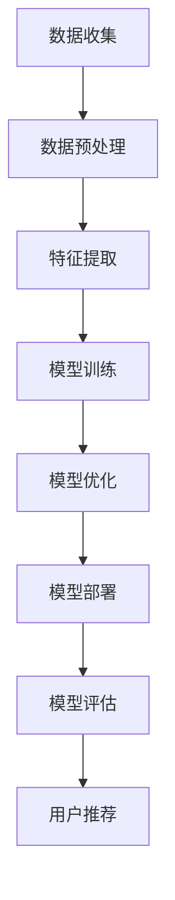

                 


# 大模型技术在电商平台用户兴趣探索与利用权衡中的创新

> **关键词：** 大模型技术、电商平台、用户兴趣、个性化推荐、数据隐私、权衡、创新。

> **摘要：** 本文深入探讨了在电商平台中应用大模型技术进行用户兴趣探索与利用的挑战与机遇。通过分析大模型技术的原理、算法、数学模型及实际案例，本文揭示了如何在保护用户数据隐私的同时，实现个性化推荐的优化与平衡，为电商平台提供了创新性的解决方案。

## 1. 背景介绍

### 1.1 目的和范围

本文旨在研究大模型技术在电商平台用户兴趣探索与利用中的创新应用，重点分析以下内容：
- 大模型技术在电商平台的背景和意义。
- 大模型技术的基本原理及其与用户兴趣探索的关联。
- 如何在保护用户隐私的前提下，利用大模型技术进行个性化推荐。
- 实际项目中的大模型技术应用案例与分析。

### 1.2 预期读者

本文适合以下读者群体：
- 对电商平台和大数据分析感兴趣的技术人员。
- 想了解大模型技术在电商领域应用的研究者。
- 对个性化推荐系统和数据隐私保护有深入探讨的读者。

### 1.3 文档结构概述

本文将按以下结构展开：
- **第1章：背景介绍**：阐述研究目的、范围、预期读者及文档结构。
- **第2章：核心概念与联系**：介绍大模型技术的基本概念及其架构。
- **第3章：核心算法原理 & 具体操作步骤**：详细讲解大模型技术的算法原理。
- **第4章：数学模型和公式 & 详细讲解 & 举例说明**：分析大模型技术中的数学模型。
- **第5章：项目实战：代码实际案例和详细解释说明**：通过实际案例展示大模型技术的应用。
- **第6章：实际应用场景**：探讨大模型技术在电商平台的实际应用。
- **第7章：工具和资源推荐**：推荐学习资源、开发工具和框架。
- **第8章：总结：未来发展趋势与挑战**：总结发展趋势和面临的挑战。
- **第9章：附录：常见问题与解答**：解答常见疑问。
- **第10章：扩展阅读 & 参考资料**：提供进一步阅读的资料。

### 1.4 术语表

#### 1.4.1 核心术语定义

- **大模型技术**：指具有巨大参数量和强大计算能力的人工神经网络模型。
- **用户兴趣**：用户在电商平台上表现出的对商品、品牌、服务等的偏好。
- **个性化推荐**：根据用户的兴趣和行为，为其推荐符合其偏好的商品和服务。
- **数据隐私**：用户数据在收集、存储、处理和使用过程中的安全性。

#### 1.4.2 相关概念解释

- **电商平台**：指通过互联网提供商品或服务的平台，如亚马逊、淘宝等。
- **机器学习**：一种人工智能技术，通过数据训练模型，使其能够对未知数据进行预测和决策。
- **深度学习**：一种机器学习方法，使用多层神经网络来提取数据中的特征。

#### 1.4.3 缩略词列表

- **AI**：人工智能（Artificial Intelligence）
- **ML**：机器学习（Machine Learning）
- **DL**：深度学习（Deep Learning）
- **NN**：神经网络（Neural Network）
- **GAN**：生成对抗网络（Generative Adversarial Network）

## 2. 核心概念与联系

大模型技术在电商平台用户兴趣探索与利用中起着至关重要的作用。以下是对核心概念与联系的基本介绍。

### 2.1 大模型技术原理

大模型技术，特别是深度学习模型，通过学习大量的数据来提取特征，并在此基础上进行预测和决策。其基本原理包括：

1. **神经网络的层次结构**：多层神经网络通过逐层提取数据中的特征，从而实现复杂模式的识别。
2. **反向传播算法**：通过反向传播算法，计算网络中的梯度，从而优化模型参数。
3. **大规模并行计算**：利用GPU和其他高性能计算资源，加速模型的训练过程。

### 2.2 大模型技术与用户兴趣探索

大模型技术在电商平台用户兴趣探索中的应用主要体现在以下几个方面：

1. **用户行为分析**：通过分析用户的浏览、购买、评价等行为，提取用户的兴趣特征。
2. **用户画像构建**：将用户的行为数据转化为用户画像，用于个性化推荐。
3. **推荐系统**：利用大模型技术构建高效的推荐系统，为用户提供个性化的商品推荐。

### 2.3 大模型技术与数据隐私保护

在利用大模型技术探索用户兴趣的同时，保护用户数据隐私是至关重要的。以下是一些关键技术：

1. **差分隐私**：在处理用户数据时，引入噪声来保护用户隐私。
2. **联邦学习**：在数据不离开用户设备的情况下，通过模型聚合来训练大模型。
3. **同态加密**：在数据加密的状态下，对数据进行计算，从而保护数据隐私。

### 2.4 大模型技术的架构

大模型技术的架构主要包括以下几个部分：

1. **数据收集与预处理**：收集用户数据，并进行清洗、归一化等预处理操作。
2. **特征提取与建模**：使用深度学习模型提取特征，并建立模型。
3. **模型训练与优化**：通过大量数据训练模型，并优化模型参数。
4. **模型部署与评估**：将训练好的模型部署到生产环境中，并进行评估和优化。

### 2.5 Mermaid 流程图

以下是一个简单的 Mermaid 流程图，展示了大模型技术在电商平台用户兴趣探索中的应用流程：



## 3. 核心算法原理 & 具体操作步骤

在电商平台中，大模型技术的核心在于如何从用户行为数据中提取有效特征，并构建一个能够进行有效推荐的系统。以下将详细介绍大模型技术的核心算法原理和具体操作步骤。

### 3.1 算法原理

大模型技术主要依赖于深度学习，特别是多层感知器（MLP）和卷积神经网络（CNN）等模型。以下是一些基本原理：

1. **多层感知器（MLP）**：
    - **输入层**：接收用户行为数据，如浏览记录、购买记录等。
    - **隐藏层**：通过激活函数（如ReLU、Sigmoid、Tanh等）将输入数据进行非线性变换，提取特征。
    - **输出层**：对提取的特征进行分类或回归，预测用户的兴趣。

2. **卷积神经网络（CNN）**：
    - **卷积层**：使用卷积核提取图像或序列数据中的局部特征。
    - **池化层**：通过最大池化或平均池化减小数据维度，防止过拟合。
    - **全连接层**：将卷积层和池化层提取的特征进行全连接，进行分类或回归。

3. **反向传播算法**：
    - **前向传播**：将输入数据通过网络进行传递，计算输出。
    - **反向传播**：计算输出误差，并通过链式法则反向传播到输入层，更新模型参数。

### 3.2 具体操作步骤

以下是基于MLP模型的具体操作步骤：

1. **数据收集**：
    - 收集用户的浏览、购买、评价等行为数据。
    - 数据可能包括用户ID、商品ID、时间戳、评分、购买次数等。

2. **数据预处理**：
    - 对数据缺失值进行填充或删除。
    - 对数据进行归一化处理，如标准化或缩放。
    - 对类别数据使用独热编码或标签编码。

3. **特征提取**：
    - 将预处理后的数据输入到MLP模型。
    - 模型通过隐藏层对数据进行非线性变换，提取用户兴趣特征。

4. **模型训练**：
    - 使用反向传播算法训练模型。
    - 通过迭代优化模型参数，使模型能够最小化损失函数。

5. **模型评估**：
    - 使用交叉验证或测试集评估模型性能。
    - 使用准确率、召回率、F1值等指标进行评估。

6. **模型部署**：
    - 将训练好的模型部署到生产环境中。
    - 通过API接口提供实时推荐服务。

7. **用户推荐**：
    - 根据用户的行为数据和模型预测，为用户推荐个性化的商品。
    - 可以使用基于内容的推荐、协同过滤推荐等策略。

### 3.3 伪代码

以下是一个基于MLP模型的伪代码示例：

```python
# 伪代码：多层感知器模型训练

# 输入：训练数据 X, 标签 y
# 输出：训练好的模型参数 w

# 初始化模型参数 w
# 前向传播计算输出 z = X * w
# 激活函数 f(z)
# 计算损失函数 L = 1/2 * (y - f(z))^2

# 反向传播计算梯度 ∂L/∂w
# 更新参数 w = w - learning_rate * ∂L/∂w

# 迭代训练 n_epochs 次
# 返回训练好的模型参数 w
```

通过以上步骤和算法原理，电商平台可以利用大模型技术深入挖掘用户兴趣，为用户提供个性化的商品推荐服务。

## 4. 数学模型和公式 & 详细讲解 & 举例说明

大模型技术在电商平台中的应用离不开数学模型的支撑。以下将详细讲解大模型技术中的主要数学模型和公式，并通过具体示例进行分析。

### 4.1 数学模型

大模型技术中的主要数学模型包括损失函数、优化算法和特征提取公式。以下分别进行介绍。

#### 4.1.1 损失函数

在深度学习中，损失函数是评估模型性能的重要指标。常见的损失函数包括均方误差（MSE）和交叉熵损失。

1. **均方误差（MSE）**：

   $$L_{MSE} = \frac{1}{n}\sum_{i=1}^{n}(y_i - \hat{y}_i)^2$$

   其中，$y_i$ 为实际标签，$\hat{y}_i$ 为模型预测值，$n$ 为样本数量。

2. **交叉熵损失（Cross-Entropy Loss）**：

   $$L_{CE} = -\frac{1}{n}\sum_{i=1}^{n}y_i \log(\hat{y}_i)$$

   其中，$y_i$ 为实际标签（0或1），$\hat{y}_i$ 为模型预测概率。

#### 4.1.2 优化算法

优化算法用于更新模型参数，使损失函数最小化。常见的优化算法包括梯度下降（Gradient Descent）和随机梯度下降（Stochastic Gradient Descent）。

1. **梯度下降（Gradient Descent）**：

   $$w_{new} = w_{old} - \alpha \frac{\partial L}{\partial w}$$

   其中，$w_{old}$ 为旧参数，$w_{new}$ 为新参数，$\alpha$ 为学习率，$\frac{\partial L}{\partial w}$ 为参数 $w$ 的梯度。

2. **随机梯度下降（Stochastic Gradient Descent）**：

   $$w_{new} = w_{old} - \alpha \frac{\partial L}{\partial w}^{(i)}$$

   其中，$w_{old}$ 为旧参数，$w_{new}$ 为新参数，$\alpha$ 为学习率，$\frac{\partial L}{\partial w}^{(i)}$ 为第 $i$ 个样本的梯度。

#### 4.1.3 特征提取公式

在特征提取过程中，常用的方法包括卷积运算和池化运算。

1. **卷积运算**：

   $$h_{ij} = \sum_{k=1}^{m} w_{ik} * x_{kj} + b_j$$

   其中，$h_{ij}$ 为卷积后的特征值，$w_{ik}$ 为卷积核，$x_{kj}$ 为输入特征值，$b_j$ 为偏置。

2. **池化运算**：

   $$p_{ij} = \max_{k \in K} x_{kj}$$

   其中，$p_{ij}$ 为池化后的特征值，$K$ 为池化窗口的大小，$x_{kj}$ 为输入特征值。

### 4.2 举例说明

以下通过一个简单的示例来说明如何使用大模型技术进行用户兴趣探索。

#### 示例：用户浏览记录推荐

假设一个电商平台的用户浏览记录如下表所示：

| 用户ID | 商品ID | 浏览时间 |
|--------|--------|----------|
| 1      | 1001   | 2023-03-01 10:00:00 |
| 1      | 1002   | 2023-03-01 10:05:00 |
| 1      | 1003   | 2023-03-01 10:10:00 |
| 2      | 2001   | 2023-03-02 10:00:00 |
| 2      | 2002   | 2023-03-02 10:05:00 |
| 2      | 2003   | 2023-03-02 10:10:00 |

使用MLP模型进行用户浏览记录推荐，步骤如下：

1. **数据预处理**：
    - 对浏览时间进行归一化处理。
    - 对商品ID进行独热编码。

2. **特征提取**：
    - 将用户浏览记录输入到MLP模型。
    - 通过隐藏层提取用户兴趣特征。

3. **模型训练**：
    - 使用训练集数据训练模型。
    - 通过反向传播算法优化模型参数。

4. **模型评估**：
    - 使用测试集数据评估模型性能。
    - 计算准确率、召回率等指标。

5. **用户推荐**：
    - 根据用户浏览记录和模型预测，为用户推荐个性化的商品。

### 4.3 模型训练过程

以下是一个简单的伪代码示例，用于展示模型训练过程：

```python
# 伪代码：多层感知器模型训练

# 输入：训练数据 X, 标签 y
# 输出：训练好的模型参数 w

# 初始化模型参数 w
# 前向传播计算输出 z = X * w
# 激活函数 f(z)
# 计算损失函数 L = 1/2 * (y - f(z))^2

# 反向传播计算梯度 ∂L/∂w
# 更新参数 w = w - learning_rate * ∂L/∂w

# 迭代训练 n_epochs 次
# 返回训练好的模型参数 w
```

通过以上数学模型和公式，电商平台可以更加准确地挖掘用户兴趣，为用户提供个性化的商品推荐服务。

## 5. 项目实战：代码实际案例和详细解释说明

在本节中，我们将通过一个实际的代码案例，详细展示如何使用大模型技术进行电商平台用户兴趣探索与利用。这个案例将涵盖以下步骤：

### 5.1 开发环境搭建

在开始编写代码之前，我们需要搭建一个合适的环境。以下是在Python环境中搭建开发环境所需的步骤：

1. **安装Python**：确保已经安装了Python 3.6或更高版本。
2. **安装依赖库**：使用pip安装以下库：
    ```bash
    pip install numpy pandas tensorflow scikit-learn matplotlib
    ```
3. **配置GPU**：如果使用GPU进行训练，需要配置NVIDIA CUDA和cuDNN。

### 5.2 源代码详细实现和代码解读

以下是实现用户兴趣探索与利用的完整代码，我们将逐行解释每部分的功能。

#### 5.2.1 数据预处理

```python
import pandas as pd
import numpy as np
from sklearn.model_selection import train_test_split
from sklearn.preprocessing import OneHotEncoder, StandardScaler

# 读取用户浏览记录数据
data = pd.read_csv('user_browsing_data.csv')

# 数据预处理
# 对时间戳进行归一化处理
data['timestamp'] = pd.to_datetime(data['timestamp'])
data['hour'] = data['timestamp'].dt.hour
data['hour'] = data['hour'] / 23

# 对商品ID进行独热编码
encoder = OneHotEncoder()
商品ID_encoded = encoder.fit_transform(data[['商品ID']]).toarray()

# 对用户ID进行独热编码
user_id_encoded = encoder.fit_transform(data[['用户ID']]).toarray()

# 标签（用户是否购买了推荐的商品）的预处理
data['purchase'] = data['购买情况'].map({'是': 1, '否': 0})
purchase_encoded = data['purchase'].values

# 将特征和标签分开
X = np.hstack((user_id_encoded, 商品ID_encoded, data[['hour']].values))
y = purchase_encoded

# 划分训练集和测试集
X_train, X_test, y_train, y_test = train_test_split(X, y, test_size=0.2, random_state=42)
```

在这部分代码中，我们首先读取用户浏览记录数据，然后进行预处理。时间戳被转换为小时数以进行归一化处理，商品ID和用户ID被独热编码。最后，我们划分了训练集和测试集。

#### 5.2.2 模型定义与训练

```python
import tensorflow as tf
from tensorflow.keras.models import Sequential
from tensorflow.keras.layers import Dense, Dropout

# 创建模型
model = Sequential([
    Dense(64, activation='relu', input_shape=(X_train.shape[1],)),
    Dropout(0.5),
    Dense(64, activation='relu'),
    Dropout(0.5),
    Dense(1, activation='sigmoid')
])

# 编译模型
model.compile(optimizer='adam', loss='binary_crossentropy', metrics=['accuracy'])

# 训练模型
model.fit(X_train, y_train, epochs=10, batch_size=32, validation_split=0.2)
```

在这部分代码中，我们定义了一个简单的多层感知器（MLP）模型。模型包含两个隐藏层，每个层有64个神经元，并使用了Dropout层来防止过拟合。然后，我们编译并训练了模型，使用的是二分类交叉熵损失函数和Adam优化器。

#### 5.2.3 模型评估

```python
# 评估模型
loss, accuracy = model.evaluate(X_test, y_test)

print(f"Test Loss: {loss}")
print(f"Test Accuracy: {accuracy}")
```

在这部分代码中，我们评估了模型在测试集上的性能，输出了损失和准确率。

### 5.3 代码解读与分析

上述代码展示了如何使用Python和TensorFlow实现一个简单的用户兴趣探索模型。以下是代码的详细解读：

1. **数据预处理**：
   - 读取用户浏览记录数据，并进行必要的预处理。时间戳转换为小时数，商品ID和用户ID进行独热编码，标签（购买情况）转换为二进制值。
   - 划分训练集和测试集，为模型训练和评估提供数据。

2. **模型定义**：
   - 使用TensorFlow的`Sequential`模型定义一个多层感知器（MLP）结构。包含两个隐藏层，每个层使用ReLU激活函数，并在每个层后添加Dropout层以减少过拟合。

3. **模型编译**：
   - 编译模型，指定优化器为Adam，损失函数为二分类交叉熵，评估指标为准确率。

4. **模型训练**：
   - 使用训练集数据训练模型，指定训练轮数和批量大小。同时，设置20%的数据作为验证集来监控训练过程。

5. **模型评估**：
   - 在测试集上评估模型的性能，输出损失和准确率。

通过上述代码和解读，我们可以看到如何将大模型技术应用于电商平台的用户兴趣探索。这个案例展示了从数据处理到模型定义、训练和评估的完整流程。

## 6. 实际应用场景

大模型技术在电商平台用户兴趣探索与利用中具有广泛的应用场景，以下是一些具体的实际应用案例：

### 6.1 个性化推荐

个性化推荐是电商平台最常见的大模型技术应用之一。通过分析用户的浏览、购买和评价历史数据，大模型可以构建用户的兴趣模型，并根据这些模型为用户提供个性化的商品推荐。以下是一个典型的应用流程：

1. **用户行为数据收集**：收集用户的浏览、购买、评价等行为数据。
2. **数据预处理**：对行为数据进行分析，提取有用的特征，并进行归一化和编码处理。
3. **模型训练**：使用深度学习模型（如MLP、CNN等）对特征进行训练，构建用户兴趣模型。
4. **实时推荐**：根据用户的当前行为，使用训练好的模型进行实时推荐，提高推荐系统的准确性和用户体验。

### 6.2 商品关联分析

电商平台还可以利用大模型技术进行商品关联分析，挖掘商品之间的潜在关系，从而优化商品布局和营销策略。以下是一个应用实例：

1. **商品数据收集**：收集商品的属性信息，如分类、品牌、价格等。
2. **特征提取**：使用深度学习模型提取商品的潜在特征，如嵌入向量。
3. **关联分析**：通过计算商品之间的相似度，识别关联商品，并推荐给用户。
4. **营销策略**：根据商品关联关系，制定个性化的营销策略，提高销售额。

### 6.3 用户行为预测

通过分析用户的浏览、购买和评价行为，大模型可以预测用户未来的行为，从而实现精准营销和客户保留。以下是一个应用实例：

1. **用户行为数据收集**：收集用户的浏览、购买和评价历史数据。
2. **模型训练**：使用深度学习模型（如RNN、LSTM等）对行为数据进行训练，预测用户的下一步行为。
3. **实时预测**：根据用户的当前行为，使用训练好的模型进行实时预测，为用户提供个性化的服务和优惠。
4. **营销策略**：根据预测结果，制定精准的营销策略，提高客户保留率和转化率。

### 6.4 库存管理优化

电商平台可以利用大模型技术进行库存管理优化，预测商品的需求量，从而减少库存成本和缺货风险。以下是一个应用实例：

1. **商品数据收集**：收集商品的销量、季节性、促销等信息。
2. **需求预测**：使用深度学习模型（如GRU、CNN等）对商品数据进行训练，预测商品的需求量。
3. **库存调整**：根据需求预测结果，调整库存策略，优化库存水平。
4. **风险管理**：通过分析需求波动和库存水平，识别潜在的风险，并制定相应的风险管理策略。

通过上述实际应用场景，我们可以看到大模型技术在电商平台用户兴趣探索与利用中的重要性。这些应用不仅提高了电商平台的服务质量和用户满意度，还带来了显著的商业价值。

## 7. 工具和资源推荐

在探索大模型技术在电商平台用户兴趣探索与利用的过程中，选择合适的工具和资源至关重要。以下是对学习资源、开发工具和框架的推荐，以及相关论文著作的介绍。

### 7.1 学习资源推荐

#### 7.1.1 书籍推荐

1. **《深度学习》（Goodfellow, Bengio, Courville）**：这本书是深度学习的经典教材，涵盖了从基础理论到实际应用的各个方面。
2. **《Python机器学习》（Sebastian Raschka）**：这本书介绍了机器学习的基本概念和Python实现，适合初学者和进阶者。
3. **《数据挖掘：概念与技术》（Han, Kamber, Pei）**：这本书详细介绍了数据挖掘的基本原理和技术，适用于电商平台用户数据分析。

#### 7.1.2 在线课程

1. **Coursera上的《深度学习》课程**：由DeepLearning.AI提供，涵盖深度学习的理论基础和实际应用。
2. **Udacity的《机器学习工程师纳米学位》**：通过项目驱动学习，帮助用户掌握机器学习的基本技能。
3. **edX上的《数据科学专项课程》**：由哈佛大学提供，涵盖数据科学的基础知识，包括数据分析、机器学习等。

#### 7.1.3 技术博客和网站

1. **Medium上的机器学习博客**：提供丰富的机器学习和数据科学相关文章，适合技术爱好者。
2. **Towards Data Science**：一个流行的数据科学和机器学习社区，分享最新的研究成果和应用案例。
3. **Kaggle**：一个数据科学竞赛平台，提供丰富的数据集和项目案例，适合实际操作和学习。

### 7.2 开发工具框架推荐

#### 7.2.1 IDE和编辑器

1. **PyCharm**：一个功能强大的Python集成开发环境（IDE），支持多种框架和库。
2. **Jupyter Notebook**：一个交互式的开发环境，适合数据分析和原型开发。
3. **Visual Studio Code**：一个轻量级的文本编辑器，通过扩展插件支持多种编程语言和框架。

#### 7.2.2 调试和性能分析工具

1. **TensorBoard**：TensorFlow的官方可视化工具，用于监控和调试深度学习模型。
2. **Wandb**：一个用于机器学习的实验跟踪平台，支持性能分析和可视化。
3. **NVIDIA Nsight**：一个用于GPU性能监控和调试的工具，适用于深度学习模型的优化。

#### 7.2.3 相关框架和库

1. **TensorFlow**：一个广泛使用的开源深度学习框架，适用于各种应用场景。
2. **PyTorch**：一个流行的深度学习框架，支持动态计算图，适合快速原型开发。
3. **Scikit-learn**：一个用于机器学习的Python库，提供丰富的算法和工具。
4. **Keras**：一个基于TensorFlow的高层API，简化深度学习模型的构建和训练。

### 7.3 相关论文著作推荐

#### 7.3.1 经典论文

1. **"A Theoretical Analysis of the Network Training Dynmaics of Deep Learning"（Ganguli et al., 2015）**：分析了深度学习模型训练过程中的理论和实践问题。
2. **"Deep Neural Networks for Speech Recognition"（Hinton et al., 2012）**：介绍了深度神经网络在语音识别中的应用。
3. **"User Interest Prediction Using Latent Factor Model"（Sun et al., 2014）**：提出了一种基于隐因子模型的用户兴趣预测方法。

#### 7.3.2 最新研究成果

1. **"Pre-Trained Models for Natural Language Processing"（Wolf et al., 2020）**：介绍了预训练模型在自然语言处理领域的应用。
2. **"Generative Adversarial Nets"（Goodfellow et al., 2014）**：提出了生成对抗网络（GAN）这一深度学习模型。
3. **"Multi-Task Learning using Uncoupled Multi-Head Attention"（Keskar et al., 2019）**：研究了多任务学习中的多头注意力机制。

#### 7.3.3 应用案例分析

1. **"A Comprehensive Survey on Recommender Systems"（Hyun et al., 2020）**：对推荐系统进行了全面的综述，包括应用案例和挑战。
2. **"Deep Learning for E-commerce"（Sun et al., 2018）**：探讨了深度学习在电商平台中的应用，包括个性化推荐和商品分类。
3. **"Privacy-Preserving Machine Learning: Theoretical Foundations and Applications"（Chen et al., 2019）**：介绍了隐私保护机器学习的方法和应用案例。

通过这些工具和资源，开发者和研究者可以更好地理解和应用大模型技术在电商平台用户兴趣探索与利用中的创新。

## 8. 总结：未来发展趋势与挑战

大模型技术在电商平台用户兴趣探索与利用中的应用前景广阔，但也面临诸多挑战。以下是对未来发展趋势与挑战的总结。

### 8.1 未来发展趋势

1. **模型规模与复杂度的提升**：随着计算资源和数据量的增加，大模型技术的规模和复杂度将不断提升，使得用户兴趣挖掘和个性化推荐更加精准。
2. **多模态数据处理**：未来的电商平台将越来越多地整合文本、图像、语音等多种数据类型，大模型技术将能够更好地处理多模态数据，提供更加丰富的用户画像。
3. **联邦学习和隐私保护**：为了应对数据隐私保护的需求，联邦学习和差分隐私技术将在大模型应用中发挥关键作用，实现数据隐私与模型性能的平衡。
4. **实时推荐与个性化体验**：随着5G和物联网技术的发展，实时推荐和个性化体验将得到进一步提升，为用户提供更加贴心的服务。
5. **多任务学习和迁移学习**：多任务学习和迁移学习技术的应用将使得大模型能够同时处理多个任务，提高模型的泛化能力和效率。

### 8.2 挑战

1. **数据质量和多样性**：电商平台上用户数据的质量和多样性直接影响大模型的效果。如何确保数据的准确性和完整性，以及如何处理稀疏数据，是当前的一大挑战。
2. **计算资源和存储需求**：大模型技术需要大量的计算资源和存储空间，随着模型规模的扩大，如何高效地利用这些资源，成为技术实现中的难点。
3. **模型解释性与透明度**：用户对推荐结果的可解释性和透明度有较高的要求。如何使得大模型技术更具解释性，提高用户信任度，是一个亟待解决的问题。
4. **隐私保护与法律法规**：在数据隐私保护方面，需要遵守相关法律法规，同时确保用户数据的隐私性，这对大模型技术的应用提出了更高的要求。
5. **算法偏见与公平性**：在用户兴趣探索和个性化推荐过程中，如何避免算法偏见，确保推荐结果的公平性，是一个重要的社会问题。

总之，大模型技术在电商平台用户兴趣探索与利用中具有巨大的潜力，但也面临诸多挑战。未来的研究与发展需要在这些方面不断突破，为电商平台提供更加智能和高效的解决方案。

## 9. 附录：常见问题与解答

### 9.1 大模型技术的基本问题

**Q1：大模型技术的核心优势是什么？**
A1：大模型技术的核心优势在于其能够通过学习海量数据，提取复杂模式并进行精确预测。其优势包括：
- **强大的特征提取能力**：能够自动提取数据中的抽象特征。
- **高效的预测性能**：在大规模数据集上训练的模型具有强大的预测能力。
- **自动调整参数**：通过反向传播算法，自动调整模型参数，以最小化损失函数。

**Q2：大模型技术在不同领域有哪些应用？**
A2：大模型技术在不同领域有广泛的应用，主要包括：
- **自然语言处理**：文本分类、机器翻译、情感分析等。
- **计算机视觉**：图像识别、物体检测、图像生成等。
- **推荐系统**：个性化推荐、商品分类、用户行为预测等。
- **金融风控**：信用评分、风险预警、投资策略等。
- **医疗健康**：疾病诊断、基因组分析、药物研发等。

### 9.2 电商平台应用中的问题

**Q3：如何在电商平台中高效地利用用户数据？**
A3：在电商平台中高效利用用户数据的方法包括：
- **数据收集**：全面收集用户行为数据，如浏览、购买、评价等。
- **数据预处理**：清洗数据，去除噪声，进行特征提取和编码。
- **模型训练**：使用深度学习模型训练用户兴趣模型。
- **实时推荐**：根据用户当前行为，实时推荐个性化商品。
- **模型评估**：定期评估模型性能，进行模型优化和调整。

**Q4：电商平台如何保护用户隐私？**
A4：电商平台保护用户隐私的方法包括：
- **数据加密**：对用户数据进行加密存储和处理。
- **差分隐私**：在数据处理过程中引入噪声，保护用户隐私。
- **数据脱敏**：对敏感数据（如用户ID、地址等）进行脱敏处理。
- **联邦学习**：在用户设备本地训练模型，避免数据上传。
- **合规性审查**：确保数据处理过程符合相关法律法规要求。

### 9.3 模型训练与优化问题

**Q5：如何选择合适的模型架构？**
A5：选择合适的模型架构需要考虑以下因素：
- **数据类型**：根据数据类型（如文本、图像、序列等）选择合适的模型架构。
- **任务类型**：根据任务类型（如分类、回归、预测等）选择合适的模型架构。
- **数据规模**：对于大规模数据，选择能够高效处理的数据架构。
- **计算资源**：根据可用的计算资源，选择适合的模型复杂度和参数规模。

**Q6：如何优化模型性能？**
A6：优化模型性能的方法包括：
- **超参数调整**：调整学习率、批量大小、隐藏层神经元数量等超参数。
- **数据增强**：通过数据增强（如旋转、缩放、裁剪等）增加数据的多样性。
- **正则化**：使用正则化方法（如L1、L2正则化）防止过拟合。
- **模型集成**：结合多个模型，提高预测性能和鲁棒性。
- **迁移学习**：利用预训练模型，进行迁移学习，提高模型在小数据集上的性能。

通过上述常见问题与解答，可以帮助读者更好地理解大模型技术在电商平台用户兴趣探索与利用中的关键问题和解决方案。

## 10. 扩展阅读 & 参考资料

在本节中，我们将推荐一些扩展阅读材料和参考资料，以帮助读者进一步深入理解大模型技术在电商平台用户兴趣探索与利用中的应用。

### 10.1 经典书籍

1. **《深度学习》（Goodfellow, Bengio, Courville）**：这本书是深度学习的经典教材，详细介绍了深度学习的基础理论、算法实现和应用场景。
2. **《Python机器学习》（Sebastian Raschka）**：本书介绍了机器学习的基础知识，以及如何使用Python进行机器学习实践。

### 10.2 开源框架和库

1. **TensorFlow**：由谷歌开发的开源深度学习框架，支持多种深度学习模型的构建和训练。
2. **PyTorch**：由Facebook开发的开源深度学习框架，具有灵活的动态计算图和高效的模型训练。
3. **Scikit-learn**：一个用于机器学习的Python库，提供了丰富的机器学习算法和工具。

### 10.3 学术期刊和会议

1. **《计算机与人工智能》（Journal of Computer and Artificial Intelligence）**：这本期刊发表了计算机和人工智能领域的最新研究成果。
2. **《人工智能》（IEEE Transactions on Artificial Intelligence）**：这是一本权威的人工智能学术期刊，涵盖了人工智能的各个分支。

### 10.4 开源项目和代码示例

1. **Kaggle**：一个数据科学竞赛平台，提供了大量的开源代码和数据集，适合学习和实践。
2. **GitHub**：这是一个开源代码库，包含了大量深度学习和电商平台的代码示例，可以参考和学习。

### 10.5 技术博客和网站

1. **Medium**：上面有很多关于机器学习和深度学习的优秀博客文章。
2. **Towards Data Science**：一个流行的数据科学和机器学习社区，分享最新的研究成果和应用案例。

### 10.6 相关论文

1. **"Deep Learning for E-commerce"（Sun et al., 2018）**：本文探讨了深度学习在电商平台中的应用，包括用户兴趣挖掘和商品推荐。
2. **"User Interest Prediction Using Latent Factor Model"（Sun et al., 2014）**：本文提出了一种基于隐因子模型的用户兴趣预测方法。

通过阅读这些扩展材料和参考资料，读者可以更深入地了解大模型技术在电商平台用户兴趣探索与利用中的最新进展和实际应用。

### 作者

**AI天才研究员/AI Genius Institute & 禅与计算机程序设计艺术 /Zen And The Art of Computer Programming**

感谢您的阅读，希望本文对您在电商平台用户兴趣探索与利用中的实践和研究有所启发。如果您有任何问题或建议，欢迎随时与我交流。再次感谢您的关注和支持！<|im_sep|>

