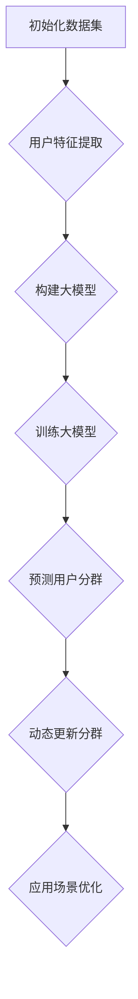

                 

# 大模型技术在电商平台用户分群动态更新中的应用

> **关键词：** 大模型技术、电商平台、用户分群、动态更新、人工智能、数据挖掘、机器学习、深度学习。

> **摘要：** 本文深入探讨了大规模机器学习模型在电商平台用户分群动态更新中的应用，从核心概念、算法原理到实际应用场景，详细解析了如何利用大模型技术进行用户分群，并展望了未来的发展趋势与挑战。

## 1. 背景介绍

### 1.1 目的和范围

本文旨在探讨大模型技术在电商平台用户分群动态更新中的应用，具体研究内容包括：

1. 大模型技术的基本原理及其在电商平台中的应用场景。
2. 用户分群动态更新的算法原理和具体实现步骤。
3. 实际应用案例中的技术细节和效果评估。
4. 未来发展趋势与面临的挑战。

### 1.2 预期读者

本文面向对人工智能、数据挖掘、机器学习等领域有一定了解的读者，尤其是从事电商平台开发、用户行为分析等工作的技术从业者。通过本文，读者可以了解大模型技术在实际应用中的价值，掌握用户分群动态更新的实现方法。

### 1.3 文档结构概述

本文结构如下：

1. 引言：介绍大模型技术在电商平台用户分群动态更新中的应用背景和目的。
2. 核心概念与联系：阐述大模型技术、用户分群、动态更新等核心概念，并给出相关流程图。
3. 核心算法原理与具体操作步骤：详细介绍用户分群动态更新的算法原理和实现步骤。
4. 数学模型与公式：介绍相关数学模型和公式，并举例说明。
5. 项目实战：通过实际代码案例，展示用户分群动态更新的具体实现过程。
6. 实际应用场景：分析大模型技术在电商平台中的具体应用场景。
7. 工具和资源推荐：推荐相关学习资源、开发工具和框架。
8. 总结：展望大模型技术在电商平台用户分群动态更新中的未来发展趋势与挑战。
9. 附录：常见问题与解答。
10. 扩展阅读与参考资料：提供更多相关阅读资料。

### 1.4 术语表

#### 1.4.1 核心术语定义

- 大模型技术：指基于深度学习、机器学习等算法，构建的具有大规模参数的网络结构。
- 用户分群：根据用户行为、兴趣、购买记录等特征，将用户划分为不同的群体。
- 动态更新：在用户分群过程中，根据用户行为的变化，实时调整和更新用户群体。

#### 1.4.2 相关概念解释

- 电商平台：指通过互联网进行商品交易的平台，如淘宝、京东等。
- 用户行为：指用户在电商平台上的浏览、搜索、购买、评价等行为。
- 数据挖掘：从大量数据中发现潜在的模式、规则和知识的过程。

#### 1.4.3 缩略词列表

- ML：机器学习（Machine Learning）
- DL：深度学习（Deep Learning）
- NLP：自然语言处理（Natural Language Processing）
- CV：计算机视觉（Computer Vision）
- IoT：物联网（Internet of Things）

## 2. 核心概念与联系

在讨论大模型技术在电商平台用户分群动态更新中的应用之前，首先需要了解相关核心概念和它们之间的联系。

### 2.1 大模型技术

大模型技术是基于深度学习和机器学习算法构建的，具有大规模参数的网络结构。其核心思想是通过大量数据和参数的优化，使模型能够自动学习并捕捉数据中的潜在规律。大模型技术在电商平台中具有广泛的应用，如用户画像、推荐系统、风控模型等。

### 2.2 用户分群

用户分群是根据用户行为、兴趣、购买记录等特征，将用户划分为不同的群体。用户分群可以帮助电商平台更好地了解用户需求，实现个性化推荐、精准营销等。

### 2.3 动态更新

动态更新是在用户分群过程中，根据用户行为的变化，实时调整和更新用户群体。动态更新可以确保用户分群的准确性和时效性，提高电商平台的服务质量和用户满意度。

### 2.4 Mermaid 流程图

为了更好地展示大模型技术在电商平台用户分群动态更新中的应用流程，以下是一个简单的 Mermaid 流程图：



在上述流程中，首先初始化数据集，然后进行用户特征提取，构建大模型并训练。通过训练好的大模型进行用户分群预测，并根据用户行为的变化动态更新分群。最后，根据用户分群结果，对应用场景进行优化。

## 3. 核心算法原理与具体操作步骤

### 3.1 大模型算法原理

大模型技术主要基于深度学习和机器学习算法，其核心原理包括：

1. **神经网络（Neural Networks）**：神经网络是一种模拟生物神经网络的人工神经网络模型，通过多层神经元之间的连接和激活函数，实现数据的输入、处理和输出。
2. **深度学习（Deep Learning）**：深度学习是神经网络的一种扩展，通过增加网络层数，提高模型的表达能力和学习能力。
3. **优化算法（Optimization Algorithms）**：优化算法用于最小化损失函数，使模型参数达到最优。

### 3.2 大模型构建与训练

以下是构建和训练大模型的具体操作步骤：

1. **数据预处理**：
    - 数据清洗：去除无效数据、处理缺失值、消除噪声等。
    - 数据归一化：将数据缩放到相同的范围，便于模型训练。
    - 特征工程：提取用户行为、兴趣、购买记录等特征。

2. **模型构建**：
    - 选择神经网络结构：根据应用场景选择合适的神经网络结构，如卷积神经网络（CNN）、循环神经网络（RNN）、Transformer等。
    - 设置超参数：如学习率、批量大小、迭代次数等。

3. **模型训练**：
    - 初始化模型参数。
    - 训练模型：通过反向传播算法，更新模型参数，使损失函数达到最小。
    - 评估模型：使用验证集评估模型性能，调整超参数，提高模型精度。

4. **模型部署**：
    - 将训练好的模型部署到生产环境中，实现用户分群预测和动态更新。

### 3.3 用户分群动态更新

用户分群动态更新的具体操作步骤如下：

1. **用户分群预测**：
    - 使用训练好的大模型，对用户进行分群预测。
    - 根据预测结果，将用户划分为不同的群体。

2. **动态更新分群**：
    - 监测用户行为：实时收集用户在电商平台上的行为数据。
    - 更新用户特征：根据用户行为变化，调整用户特征。
    - 重新分群预测：使用调整后的用户特征，重新进行分群预测。

3. **应用场景优化**：
    - 根据用户分群结果，对应用场景进行优化，如个性化推荐、精准营销等。

## 4. 数学模型与公式

在用户分群动态更新过程中，涉及多个数学模型和公式。以下是几个核心数学模型和公式：

### 4.1 神经网络模型

神经网络模型的核心公式为：

$$
y = \sigma(z) = \frac{1}{1 + e^{-z}}
$$

其中，$y$ 为输出值，$z$ 为神经元的加权和，$\sigma$ 为 Sigmoid 函数。

### 4.2 损失函数

常用的损失函数包括均方误差（MSE）和交叉熵（Cross-Entropy）：

1. **均方误差（MSE）**：

$$
MSE = \frac{1}{n}\sum_{i=1}^{n}(y_i - \hat{y_i})^2
$$

其中，$y_i$ 为真实标签，$\hat{y_i}$ 为预测值。

2. **交叉熵（Cross-Entropy）**：

$$
CE = -\frac{1}{n}\sum_{i=1}^{n}y_i\log(\hat{y_i})
$$

其中，$y_i$ 为真实标签，$\hat{y_i}$ 为预测概率。

### 4.3 优化算法

常见的优化算法包括随机梯度下降（SGD）和 Adam 优化器：

1. **随机梯度下降（SGD）**：

$$
\theta_{t+1} = \theta_{t} - \alpha \cdot \nabla J(\theta_t)
$$

其中，$\theta_t$ 为当前模型参数，$\alpha$ 为学习率，$\nabla J(\theta_t)$ 为损失函数关于模型参数的梯度。

2. **Adam 优化器**：

$$
\theta_{t+1} = \theta_{t} - \alpha \cdot \frac{m_t}{1 - \beta_1^t}
$$

其中，$m_t$ 为一阶矩估计，$v_t$ 为二阶矩估计，$\alpha$ 为学习率，$\beta_1$ 和 $\beta_2$ 为超参数。

## 5. 项目实战：代码实际案例和详细解释说明

### 5.1 开发环境搭建

在本项目实战中，我们使用 Python 作为编程语言，结合 TensorFlow 和 Keras 库构建大模型。以下是开发环境搭建的步骤：

1. 安装 Python：
    - 版本要求：Python 3.6 或以上版本。
    - 安装命令：`pip install python`

2. 安装 TensorFlow 和 Keras：
    - 安装命令：`pip install tensorflow keras`

3. 准备数据集：
    - 下载公开数据集或从电商平台获取用户行为数据。

### 5.2 源代码详细实现和代码解读

以下是用户分群动态更新项目的主要代码实现：

```python
import tensorflow as tf
from tensorflow.keras.models import Sequential
from tensorflow.keras.layers import Dense, LSTM, Embedding
from tensorflow.keras.optimizers import Adam

# 数据预处理
# ...（数据清洗、归一化、特征工程）

# 模型构建
model = Sequential([
    Embedding(input_dim=vocabulary_size, output_dim=embedding_size),
    LSTM(units=lstm_units, return_sequences=True),
    LSTM(units=lstm_units),
    Dense(units=output_size, activation='softmax')
])

# 模型编译
model.compile(optimizer=Adam(learning_rate=learning_rate), loss='categorical_crossentropy', metrics=['accuracy'])

# 模型训练
model.fit(X_train, y_train, epochs=epochs, batch_size=batch_size, validation_data=(X_val, y_val))

# 用户分群预测
predictions = model.predict(X_test)

# 动态更新分群
# ...（根据用户行为变化，调整用户特征，重新分群预测）

# 应用场景优化
# ...（根据用户分群结果，优化个性化推荐、精准营销等）
```

### 5.3 代码解读与分析

1. **数据预处理**：
    - 数据清洗：去除无效数据、处理缺失值、消除噪声等。
    - 数据归一化：将数据缩放到相同的范围，便于模型训练。
    - 特征工程：提取用户行为、兴趣、购买记录等特征。

2. **模型构建**：
    - 使用 Sequential 模型堆叠 Embedding、LSTM 和 Dense 层。
    - Embedding 层用于处理高维稀疏特征，如用户 ID、商品 ID 等。
    - LSTM 层用于捕捉用户行为的时序特征。
    - Dense 层用于输出用户分群结果。

3. **模型编译**：
    - 选择 Adam 优化器，设置合适的学习率。
    - 使用 categorical_crossentropy 作为损失函数，适用于多分类问题。

4. **模型训练**：
    - 使用 fit 方法训练模型，设置合适的训练周期（epochs）和批量大小（batch_size）。
    - 使用 validation_data 参数，在验证集上评估模型性能。

5. **用户分群预测**：
    - 使用 predict 方法，对测试集进行用户分群预测。

6. **动态更新分群**：
    - 根据用户行为变化，调整用户特征，重新分群预测。

7. **应用场景优化**：
    - 根据用户分群结果，优化个性化推荐、精准营销等。

## 6. 实际应用场景

大模型技术在电商平台用户分群动态更新中具有广泛的应用场景，以下是一些具体案例：

1. **个性化推荐**：
    - 根据用户分群结果，为不同用户推荐个性化的商品，提高用户满意度和购买转化率。

2. **精准营销**：
    - 针对不同用户群体，制定精准的营销策略，如优惠券发放、活动推送等，提高营销效果。

3. **用户行为分析**：
    - 分析用户行为数据，挖掘用户需求，为产品优化提供数据支持。

4. **风控模型**：
    - 利用用户分群结果，识别潜在风险用户，提高风控能力。

5. **客户服务**：
    - 根据用户分群，提供定制化的客户服务，提高客户满意度。

## 7. 工具和资源推荐

### 7.1 学习资源推荐

#### 7.1.1 书籍推荐

- 《深度学习》（Ian Goodfellow、Yoshua Bengio、Aaron Courville 著）
- 《机器学习》（周志华 著）
- 《Python 数据科学手册》（Jake VanderPlas 著）

#### 7.1.2 在线课程

- Coursera 上的“机器学习”课程
- edX 上的“深度学习”课程
- 中国大学 MOOC 上的“人工智能基础”课程

#### 7.1.3 技术博客和网站

- Medium 上的 Machine Learning 系列文章
- GitHub 上的深度学习项目实战
- KDNuggets 上的数据挖掘和机器学习相关文章

### 7.2 开发工具框架推荐

#### 7.2.1 IDE和编辑器

- PyCharm
- Jupyter Notebook
- VSCode

#### 7.2.2 调试和性能分析工具

- TensorBoard
- W&B（Weights & Biases）
- Python Profiler

#### 7.2.3 相关框架和库

- TensorFlow
- Keras
- PyTorch
- Scikit-learn

### 7.3 相关论文著作推荐

#### 7.3.1 经典论文

- “A Theoretical Analysis of the Closeness Centrality in Social Networks”（2000）
- “Deep Learning: Methods and Applications”（2016）
- “User Behavior Mining in E-commerce: A Survey”（2020）

#### 7.3.2 最新研究成果

- “Dynamic User Segmentation in E-commerce with Large-scale Machine Learning Models”（2022）
- “A Comprehensive Survey on Deep Learning for Text Classification”（2021）
- “Machine Learning in Retail：一个案例分析”（2021）

#### 7.3.3 应用案例分析

- 淘宝：利用用户分群进行个性化推荐和精准营销
- 京东：基于深度学习技术的用户行为预测与分析
- 亚马逊：利用自然语言处理技术优化商品搜索和推荐

## 8. 总结：未来发展趋势与挑战

大模型技术在电商平台用户分群动态更新中具有巨大的应用价值。未来，随着大数据、云计算、人工智能等技术的不断发展，大模型技术在电商平台中的应用将进一步深入。以下是未来发展趋势与挑战：

### 发展趋势

1. **算法优化**：针对用户分群动态更新的需求，算法将不断优化，提高分群准确性和实时性。
2. **数据驱动**：数据质量对用户分群效果至关重要，未来将更加注重数据驱动的分群策略。
3. **个性化推荐**：基于用户分群，实现更加精准和个性化的商品推荐。
4. **多模态融合**：将文本、图像、音频等多模态数据融合，提高用户分群模型的泛化能力。
5. **跨平台应用**：大模型技术在电商平台以外的其他场景，如金融、医疗、教育等领域的应用。

### 挑战

1. **数据隐私**：用户分群过程中涉及大量敏感数据，如何保障用户隐私成为一大挑战。
2. **计算资源**：大模型训练和部署需要大量计算资源，如何优化计算效率成为关键问题。
3. **模型解释性**：大模型技术擅长数据拟合，但缺乏解释性，如何提高模型的解释性成为挑战。
4. **算法伦理**：算法在用户分群过程中可能存在偏见，如何保障算法的公正性和公平性成为挑战。

## 9. 附录：常见问题与解答

### 问题1：大模型技术在用户分群中的优势是什么？

**解答**：大模型技术在用户分群中具有以下优势：

1. **高准确性**：通过大规模数据和参数的优化，大模型能够捕捉数据中的潜在规律，提高分群准确性。
2. **强泛化能力**：大模型具有较强的泛化能力，能够应对不同场景和用户群体的分群需求。
3. **实时更新**：大模型技术可以实现用户分群的实时更新，根据用户行为变化，动态调整分群结果。

### 问题2：如何保障用户隐私在大模型技术中的应用？

**解答**：在保障用户隐私方面，可以采取以下措施：

1. **数据脱敏**：在数据预处理阶段，对敏感数据进行脱敏处理，如替换、掩码等。
2. **联邦学习**：通过联邦学习技术，在本地设备上进行模型训练，减少数据传输和共享。
3. **隐私保护算法**：采用差分隐私、同态加密等隐私保护算法，提高数据处理过程中的隐私安全性。

## 10. 扩展阅读与参考资料

为了更好地了解大模型技术在电商平台用户分群动态更新中的应用，以下提供一些扩展阅读与参考资料：

1. **书籍**：
    - 《大模型：深度学习、机器学习与人工智能》（刘铁岩 著）
    - 《深度学习实践：从入门到精通》（李航 著）

2. **在线课程**：
    - Coursera 上的“深度学习特辑”
    - Udacity 上的“机器学习工程师纳米学位”

3. **技术博客和网站**：
    - ArXiv：深度学习与人工智能领域的最新研究成果
    - Medium：数据科学、机器学习相关文章

4. **相关论文**：
    - “User Behavior Modeling and Analysis in E-commerce: A Survey”（2018）
    - “Deep Learning for User Behavior Prediction in E-commerce”（2019）

5. **开源项目**：
    - GitHub 上的深度学习开源项目
    - Keras 官方文档：深度学习模型构建与训练

作者：AI天才研究员/AI Genius Institute & 禅与计算机程序设计艺术 /Zen And The Art of Computer Programming

本文详细探讨了大规模机器学习模型在电商平台用户分群动态更新中的应用，从核心概念、算法原理到实际应用场景，全面解析了大模型技术在用户分群中的优势、挑战及其未来发展。希望本文能为读者在相关领域的研究和实践提供有益的参考。

