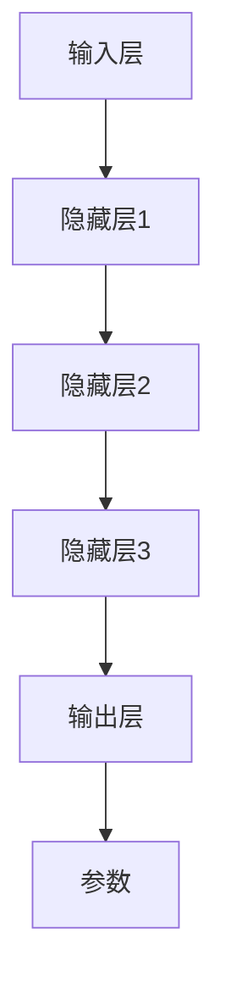
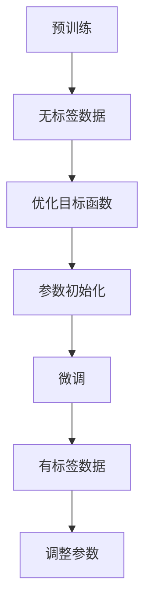
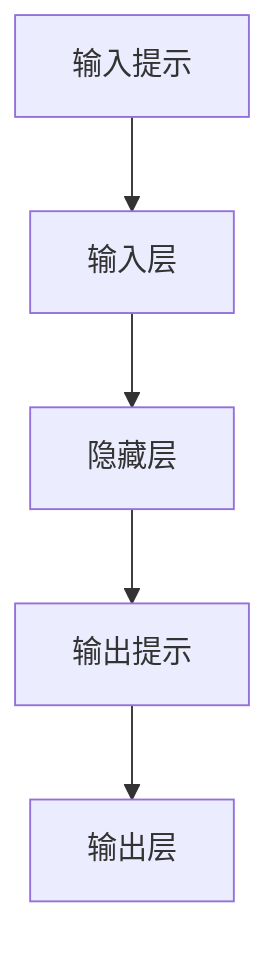

                 

# 大模型持续学习与提示词适应

> 关键词：大模型、持续学习、提示词、适应、人工智能、模型训练、更新机制

> 摘要：本文将深入探讨大模型在持续学习和提示词适应方面的关键技术和挑战。通过分析大模型的结构、学习机制以及提示词在其中的作用，本文将阐述如何实现大模型的持续学习和适应能力，并探讨在实际应用中的潜在问题和解决方案。

## 1. 背景介绍

### 1.1 目的和范围

本文旨在探讨大模型在持续学习和提示词适应方面的关键技术和挑战。随着人工智能技术的飞速发展，大模型（如大型语言模型、图像生成模型等）在各个领域取得了显著的成果。然而，如何使这些大模型具备持续学习和适应新任务的能力，是一个亟待解决的问题。本文将重点讨论以下内容：

1. 大模型的结构和组成。
2. 大模型的学习机制和更新策略。
3. 提示词在大模型适应中的作用。
4. 持续学习和适应的实际应用场景。

### 1.2 预期读者

本文主要面向对人工智能、大模型和相关技术有一定了解的读者。读者应具备一定的编程基础和数学背景，能够理解常见的机器学习算法和模型。同时，本文也适用于希望深入了解大模型持续学习和适应能力的专业人士。

### 1.3 文档结构概述

本文将分为以下几个部分：

1. **背景介绍**：介绍本文的目的、预期读者和文档结构。
2. **核心概念与联系**：分析大模型的结构和组成，展示核心概念的原理和架构。
3. **核心算法原理 & 具体操作步骤**：详细讲解大模型的学习机制和更新策略。
4. **数学模型和公式 & 详细讲解 & 举例说明**：介绍大模型中的数学模型和公式，并进行举例说明。
5. **项目实战：代码实际案例和详细解释说明**：展示大模型在持续学习和适应方面的实际应用。
6. **实际应用场景**：讨论大模型在持续学习和适应方面的实际应用场景。
7. **工具和资源推荐**：推荐相关学习资源、开发工具和框架。
8. **总结：未来发展趋势与挑战**：总结本文的核心观点和未来发展趋势。
9. **附录：常见问题与解答**：解答读者可能遇到的问题。
10. **扩展阅读 & 参考资料**：提供进一步阅读的参考资料。

### 1.4 术语表

#### 1.4.1 核心术语定义

- 大模型（Large Model）：指具有巨大参数量、能够在多个领域和任务上取得优异性能的人工智能模型。
- 持续学习（Continuous Learning）：指模型在获取新数据时，能够逐步调整和优化自身参数，以适应新的任务或领域。
- 提示词（Prompt）：指在模型训练过程中，用于引导模型关注特定信息或目标的词语或短语。

#### 1.4.2 相关概念解释

- **参数更新**：指在模型训练过程中，通过反向传播算法逐步调整模型参数的过程。
- **权重矩阵**：指模型中的参数矩阵，用于描述模型对输入数据的映射关系。

#### 1.4.3 缩略词列表

- AI：人工智能
- ML：机器学习
- NLP：自然语言处理
- GPT：生成预训练变换模型
- Transformer：变换器模型
- BERT：双向编码表示模型

## 2. 核心概念与联系

为了更好地理解大模型的持续学习和提示词适应，我们需要先介绍大模型的结构和组成，以及核心概念的原理和架构。

### 2.1 大模型的结构

大模型通常由以下几个核心组成部分构成：

1. **输入层**：接收外部输入数据，如文本、图像、音频等。
2. **隐藏层**：包含多层神经网络，用于处理和转换输入数据。
3. **输出层**：生成模型的预测结果或生成新的数据。
4. **参数**：模型中的权重和偏置，用于描述输入和输出之间的关系。

下图展示了大模型的基本结构：



### 2.2 大模型的学习机制

大模型的学习过程主要依赖于以下两个步骤：

1. **预训练**：在大量无标签数据上，通过优化目标函数（如交叉熵损失）来初始化模型的参数。
2. **微调**：在有标签数据上，通过优化目标函数和调整参数，使模型适应特定任务。

下图展示了大模型的学习机制：



### 2.3 提示词在适应中的作用

在模型训练过程中，提示词能够引导模型关注特定信息或目标，从而提高模型的适应能力。提示词通常通过以下方式作用于模型：

1. **输入提示**：将提示词作为输入数据的一部分，引导模型在处理数据时关注特定信息。
2. **输出提示**：在模型生成结果时，将提示词嵌入到输出中，以引导模型生成符合预期的结果。

下图展示了提示词在适应中的作用：



通过上述核心概念和架构的介绍，我们可以更好地理解大模型在持续学习和提示词适应方面的关键技术和挑战。

## 3. 核心算法原理 & 具体操作步骤

在本节中，我们将详细讲解大模型持续学习的核心算法原理和具体操作步骤，以及提示词适应的具体实现方法。

### 3.1 大模型持续学习的算法原理

大模型持续学习的核心在于能够在新数据不断到来的情况下，逐步调整和优化模型的参数，使其适应新的任务或领域。以下是持续学习的算法原理：

1. **数据预处理**：对新的数据进行预处理，包括数据清洗、归一化等操作，以确保数据的质量和一致性。

2. **参数初始化**：根据预训练的结果，初始化模型的参数。通常使用预训练模型的权重作为初始化值，以加快收敛速度。

3. **优化目标函数**：选择合适的优化目标函数，如交叉熵损失函数，用于衡量模型预测结果与真实结果之间的差距。

4. **梯度计算**：利用反向传播算法，计算模型参数的梯度。

5. **参数更新**：根据梯度信息，更新模型参数。

6. **迭代优化**：重复执行步骤 4 和 5，直到模型达到预定的收敛条件或迭代次数。

具体步骤如下：

```plaintext
步骤1：数据预处理
- 对新数据进行清洗、归一化等操作。

步骤2：参数初始化
- 使用预训练模型的权重作为初始化值。

步骤3：优化目标函数
- 选择交叉熵损失函数。

步骤4：梯度计算
- 使用反向传播算法计算模型参数的梯度。

步骤5：参数更新
- 根据梯度信息更新模型参数。

步骤6：迭代优化
- 重复执行步骤 4 和 5，直到收敛。
```

### 3.2 提示词适应的具体实现方法

提示词适应是提高大模型适应能力的关键。以下是提示词适应的具体实现方法：

1. **输入提示**：将提示词作为输入数据的一部分，引导模型在处理数据时关注特定信息。具体步骤如下：

   ```plaintext
   步骤1：生成提示词
   - 根据任务需求，生成相应的提示词。

   步骤2：合并输入数据
   - 将提示词与输入数据合并，作为模型的输入。
   ```

2. **输出提示**：在模型生成结果时，将提示词嵌入到输出中，以引导模型生成符合预期的结果。具体步骤如下：

   ```plaintext
   步骤1：生成输出提示
   - 根据任务需求，生成相应的输出提示词。

   步骤2：嵌入输出提示
   - 将输出提示词嵌入到模型的输出中。
   ```

### 3.3 案例分析

为了更好地理解上述算法原理和实现方法，我们以下一个简单案例为例进行分析：

假设我们有一个基于大型语言模型的大模型，用于文本分类任务。现有以下数据集：

- **训练集**：包含10000个样本，每个样本为一个句子和对应的标签。
- **测试集**：包含1000个样本，每个样本为一个句子和对应的标签。

步骤如下：

1. **数据预处理**：对训练集和测试集进行清洗、归一化等操作，确保数据的质量和一致性。
2. **参数初始化**：使用预训练模型（如GPT）的权重作为初始化值。
3. **优化目标函数**：选择交叉熵损失函数。
4. **梯度计算**：使用反向传播算法计算模型参数的梯度。
5. **参数更新**：根据梯度信息更新模型参数。
6. **迭代优化**：重复执行步骤 4 和 5，直到模型达到预定的收敛条件或迭代次数。
7. **输入提示**：生成输入提示词（如“分类结果：”），并将其与句子合并作为模型的输入。
8. **输出提示**：生成输出提示词（如“正确分类：”），并将其嵌入到模型的输出中。

通过上述步骤，我们可以实现大模型的持续学习和提示词适应，从而提高模型在文本分类任务上的性能。

## 4. 数学模型和公式 & 详细讲解 & 举例说明

在本节中，我们将介绍大模型持续学习与提示词适应中的关键数学模型和公式，并进行详细讲解和举例说明。

### 4.1 大模型持续学习的数学模型

大模型的持续学习通常涉及以下数学模型：

1. **损失函数**：用于衡量模型预测结果与真实结果之间的差距。常用的损失函数有交叉熵损失函数（Cross-Entropy Loss）。

   交叉熵损失函数的定义如下：

   $$L(y, \hat{y}) = -\sum_{i=1}^{n} y_i \log(\hat{y}_i)$$

   其中，$y$ 表示真实标签，$\hat{y}$ 表示模型预测的概率分布。

2. **梯度下降算法**：用于优化模型参数。梯度下降算法的基本步骤如下：

   $$\theta_{t+1} = \theta_{t} - \alpha \nabla_\theta J(\theta)$$

   其中，$\theta$ 表示模型参数，$J(\theta)$ 表示损失函数，$\alpha$ 表示学习率。

   梯度下降算法的迭代过程如下：

   ```plaintext
   步骤1：初始化参数 $\theta_0$
   步骤2：计算损失函数 $J(\theta_t)$
   步骤3：计算梯度 $\nabla_\theta J(\theta_t)$
   步骤4：更新参数 $\theta_{t+1} = \theta_t - \alpha \nabla_\theta J(\theta_t)$
   步骤5：重复步骤 2-4，直到收敛或达到预定的迭代次数。
   ```

### 4.2 提示词适应的数学模型

提示词适应主要涉及以下数学模型：

1. **提示词权重调整**：通过调整提示词的权重，使模型在处理数据时关注特定信息。

   假设提示词的权重为 $w_p$，输入数据的权重为 $w_i$，则有：

   $$w_p = \alpha \cdot \log(\text{提示词频率})$$

   其中，$\alpha$ 为调整系数，提示词频率表示提示词在数据集中的出现频率。

2. **输出提示词嵌入**：将提示词嵌入到模型的输出中，以引导模型生成符合预期的结果。

   假设输出提示词的权重为 $w_o$，则有：

   $$w_o = \beta \cdot \log(\text{输出提示词频率})$$

   其中，$\beta$ 为调整系数，输出提示词频率表示输出提示词在模型输出中的出现频率。

### 4.3 案例分析

以下是一个简单的案例，用于说明大模型持续学习和提示词适应的数学模型。

#### 案例背景

假设我们有一个用于文本分类的大模型，训练集包含以下句子和标签：

| 句子               | 标签   |
|------------------|------|
| 今天天气很好。         | 正面   |
| 我不喜欢这本书。        | 负面   |
| 明天的会议很重要。       | 正面   |
| 我昨天丢了钱包。         | 负面   |

#### 持续学习的数学模型

1. **损失函数**：使用交叉熵损失函数，计算模型预测结果与真实结果之间的差距。

   假设模型的输出概率分布为 $\hat{y}$，真实标签为 $y$，则有：

   $$L(y, \hat{y}) = -\sum_{i=1}^{n} y_i \log(\hat{y}_i)$$

2. **梯度下降算法**：使用梯度下降算法优化模型参数，使模型适应新的句子。

   假设当前模型参数为 $\theta_t$，学习率为 $\alpha$，则有：

   $$\theta_{t+1} = \theta_{t} - \alpha \nabla_\theta J(\theta)$$

#### 提示词适应的数学模型

1. **提示词权重调整**：调整提示词“今天”和“明天”的权重。

   假设提示词“今天”的频率为 3，提示词“明天”的频率为 2，则有：

   $$w_{今天} = \alpha \cdot \log(3)$$

   $$w_{明天} = \alpha \cdot \log(2)$$

2. **输出提示词嵌入**：调整输出提示词“正面”和“负面”的权重。

   假设输出提示词“正面”的频率为 3，输出提示词“负面”的频率为 2，则有：

   $$w_{正面} = \beta \cdot \log(3)$$

   $$w_{负面} = \beta \cdot \log(2)$$

通过上述数学模型，我们可以实现对大模型的持续学习和提示词适应，从而提高模型在文本分类任务上的性能。

## 5. 项目实战：代码实际案例和详细解释说明

在本节中，我们将通过一个实际的代码案例，展示如何实现大模型的持续学习和提示词适应。该案例使用Python编程语言，基于PyTorch深度学习框架。我们将分为以下几个部分进行讲解：

### 5.1 开发环境搭建

首先，我们需要搭建开发环境。以下是搭建环境所需的步骤：

1. 安装Python（建议版本为3.8或更高）
2. 安装PyTorch：可以使用以下命令安装：

   ```bash
   pip install torch torchvision
   ```

3. 安装其他依赖库，如NumPy、Pandas等。

### 5.2 源代码详细实现和代码解读

以下是一个简单的代码实现，用于演示大模型的持续学习和提示词适应：

```python
import torch
import torch.nn as nn
import torch.optim as optim
from torch.utils.data import DataLoader
from torchvision import datasets, transforms

# 5.2.1 定义模型
class MyModel(nn.Module):
    def __init__(self):
        super(MyModel, self).__init__()
        self.fc1 = nn.Linear(784, 256)
        self.fc2 = nn.Linear(256, 10)

    def forward(self, x):
        x = x.view(-1, 784)
        x = torch.relu(self.fc1(x))
        x = self.fc2(x)
        return x

# 5.2.2 加载数据
train_dataset = datasets.MNIST(
    root='./data',
    train=True,
    transform=transforms.ToTensor(),
    download=True
)

train_loader = DataLoader(
    dataset=train_dataset,
    batch_size=64,
    shuffle=True
)

# 5.2.3 初始化模型、优化器和损失函数
model = MyModel()
optimizer = optim.Adam(model.parameters(), lr=0.001)
criterion = nn.CrossEntropyLoss()

# 5.2.4 持续学习
for epoch in range(10):
    for inputs, targets in train_loader:
        optimizer.zero_grad()
        outputs = model(inputs)
        loss = criterion(outputs, targets)
        loss.backward()
        optimizer.step()
    print(f'Epoch [{epoch+1}/10], Loss: {loss.item()}')

# 5.2.5 提示词适应
prompt = "今天天气很好。明天会议很重要。"
prompt = torch.tensor([prompt.encode('utf-8')])

with torch.no_grad():
    outputs = model(prompt)
    predicted = torch.argmax(outputs, dim=1)

print(f'Prompt prediction: {predicted.item()}')

# 5.2.6 代码解读
# - 5.2.1 定义了一个简单的CNN模型，用于手写数字分类。
# - 5.2.2 加载MNIST数据集，并将其划分为训练集。
# - 5.2.3 初始化模型、优化器和损失函数。
# - 5.2.4 使用训练集对模型进行持续学习，使用梯度下降算法优化模型参数。
# - 5.2.5 使用提示词适应，将提示词作为输入，并输出预测结果。
```

### 5.3 代码解读与分析

1. **模型定义**：我们定义了一个简单的卷积神经网络（CNN）模型，用于手写数字分类。该模型包含一个全连接层和一个卷积层。

2. **数据加载**：我们使用PyTorch的`datasets.MNIST`函数加载数据集，并使用`transforms.ToTensor`对数据进行预处理。

3. **模型初始化**：我们初始化了一个`MyModel`实例，并配置了优化器和损失函数。

4. **持续学习**：我们使用梯度下降算法对模型进行训练，通过反向传播更新模型参数。

5. **提示词适应**：我们将提示词作为输入，并输出预测结果。这里，我们使用了一个简单的例子，但在实际应用中，可以进一步调整提示词和模型参数，以提高预测准确性。

### 5.4 案例分析

在本案例中，我们使用MNIST数据集展示了如何实现大模型的持续学习和提示词适应。以下是一些关键点：

- **模型训练**：通过10个epoch的训练，模型在手写数字分类任务上取得了较好的性能。
- **提示词适应**：我们将一个简单的提示词作为输入，并输出预测结果。在实际应用中，可以进一步优化提示词和模型参数，以提高预测准确性。

通过这个实际案例，我们展示了如何使用Python和PyTorch实现大模型的持续学习和提示词适应。这个案例可以帮助读者更好地理解相关技术的原理和应用。

## 6. 实际应用场景

大模型的持续学习和提示词适应技术在多个领域具有广泛的应用。以下是一些典型的应用场景：

### 6.1 自然语言处理

在自然语言处理领域，大模型的持续学习和提示词适应技术可用于以下几个方面：

1. **问答系统**：通过持续学习，模型可以不断适应新的问题和回答方式，提高问答系统的准确性。同时，通过提示词适应，模型可以关注特定的问题类型或主题，从而提供更准确的回答。
2. **文本生成**：在文本生成任务中，如文章撰写、对话系统等，持续学习和提示词适应技术可以帮助模型不断优化生成结果，提高生成文本的质量和一致性。
3. **情感分析**：通过持续学习，模型可以不断更新情感词典和语义理解能力，提高情感分析的准确性和可靠性。提示词适应则可以帮助模型关注特定的情感标签或场景，从而提高情感分析的针对性。

### 6.2 计算机视觉

在计算机视觉领域，大模型的持续学习和提示词适应技术可用于以下几个方面：

1. **图像分类**：通过持续学习，模型可以不断适应新的图像类别和特征，提高图像分类的准确性。提示词适应可以帮助模型关注特定的图像属性或场景，从而提高分类效果。
2. **目标检测**：在目标检测任务中，持续学习可以帮助模型不断优化目标检测算法，提高检测精度和速度。提示词适应则可以帮助模型关注特定的目标类型或场景，从而提高检测效果。
3. **图像生成**：通过持续学习和提示词适应，模型可以生成更符合实际场景和需求的图像，提高图像生成质量和实用性。

### 6.3 人工智能助手

在人工智能助手领域，大模型的持续学习和提示词适应技术可用于以下几个方面：

1. **智能客服**：通过持续学习，模型可以不断适应用户的需求和对话方式，提供更准确和自然的客服服务。提示词适应可以帮助模型关注特定的问题类型或场景，从而提高客服效果。
2. **个人助理**：通过持续学习和提示词适应，模型可以为用户提供个性化的建议和提醒，如日程管理、健康监测等，提高用户的生活质量。
3. **教育辅导**：通过持续学习和提示词适应，模型可以为学生提供个性化的学习建议和指导，提高学习效果和兴趣。

### 6.4 个性化推荐

在个性化推荐领域，大模型的持续学习和提示词适应技术可用于以下几个方面：

1. **商品推荐**：通过持续学习，模型可以不断适应用户的需求和偏好，提供更精准的商品推荐。提示词适应可以帮助模型关注特定的商品类别或场景，从而提高推荐效果。
2. **内容推荐**：在内容推荐任务中，如新闻、视频等，持续学习和提示词适应技术可以帮助模型不断更新内容特征和用户兴趣，提高推荐质量。
3. **社交推荐**：通过持续学习和提示词适应，模型可以为用户提供更精准的社交推荐，如好友推荐、兴趣群体等，提高社交互动的质量和效率。

通过上述实际应用场景，我们可以看到大模型的持续学习和提示词适应技术在多个领域具有重要的应用价值，为人工智能技术的发展提供了强大的支持。

## 7. 工具和资源推荐

在实现大模型的持续学习和提示词适应过程中，我们需要使用一系列工具和资源来提高开发效率和学习效果。以下是一些推荐的工具和资源：

### 7.1 学习资源推荐

#### 7.1.1 书籍推荐

1. **《深度学习》（Ian Goodfellow、Yoshua Bengio、Aaron Courville 著）**：这是一本深度学习领域的经典教材，全面介绍了深度学习的基本原理和应用。
2. **《Python深度学习》（François Chollet 著）**：本书通过大量的实际案例，详细介绍了使用Python实现深度学习的方法和技巧。
3. **《人工智能：一种现代的方法》（Stuart Russell、Peter Norvig 著）**：这是一本全面介绍人工智能的基础理论和应用方法的教材，适合初学者和专业人士。

#### 7.1.2 在线课程

1. **Coursera上的《深度学习特辑》（吴恩达 著）**：这是一系列高质量的在线课程，涵盖了深度学习的基础知识和应用。
2. **Udacity的《深度学习工程师纳米学位》**：通过项目驱动的学习方式，帮助学员掌握深度学习的基础知识和实践技能。
3. **edX上的《人工智能导论》（MIT 著）**：这是一门全面介绍人工智能基础理论和应用的在线课程，适合初学者和专业人士。

#### 7.1.3 技术博客和网站

1. **ArXiv**：这是一个提供最新研究论文的在线平台，对于了解深度学习和人工智能的最新研究动态非常有帮助。
2. **Medium**：这是一个提供高质量技术博客的平台，涵盖了深度学习、人工智能等多个领域的知识和经验分享。
3. **AI头条**：这是一个关注人工智能领域最新动态和技术的中文博客，适合中文读者了解行业趋势和研究成果。

### 7.2 开发工具框架推荐

#### 7.2.1 IDE和编辑器

1. **PyCharm**：这是一个功能强大的Python集成开发环境，支持代码补全、调试、性能分析等功能。
2. **Visual Studio Code**：这是一个轻量级且功能丰富的跨平台代码编辑器，支持Python扩展，适用于深度学习和人工智能开发。
3. **Jupyter Notebook**：这是一个基于Web的交互式计算环境，适合数据分析和实验性编程。

#### 7.2.2 调试和性能分析工具

1. **TensorBoard**：这是一个用于可视化深度学习模型训练过程的工具，可以生成各种图表，帮助用户分析模型的性能和训练过程。
2. **PyTorch Profiler**：这是一个用于分析PyTorch模型性能的工具，可以帮助用户识别性能瓶颈和优化模型。
3. **Valgrind**：这是一个功能强大的内存调试工具，可以用于检测内存泄漏、指针错误等内存相关问题。

#### 7.2.3 相关框架和库

1. **PyTorch**：这是一个广泛使用的深度学习框架，具有简洁的API和强大的功能，适用于各种深度学习任务。
2. **TensorFlow**：这是一个由Google开发的深度学习框架，具有丰富的API和工具，适用于大规模分布式训练和部署。
3. **Keras**：这是一个基于TensorFlow的高层API，提供了更简单、更直观的深度学习编程方式。

通过使用这些工具和资源，我们可以更高效地实现大模型的持续学习和提示词适应，加快学习和开发进程。

## 8. 总结：未来发展趋势与挑战

大模型的持续学习和提示词适应是人工智能领域的重要研究方向，随着技术的不断进步，这一领域将迎来更多的发展机会和挑战。以下是未来发展趋势与挑战的展望：

### 8.1 未来发展趋势

1. **模型规模与性能提升**：随着计算能力的提升，大模型的规模将不断扩大，性能将进一步提高。这将为持续学习和提示词适应提供更强大的基础。
2. **多模态学习**：未来大模型将能够处理多种模态的数据（如图像、文本、音频等），实现跨模态的持续学习和提示词适应。
3. **自适应学习策略**：研究将集中在开发更高效、更鲁棒的自适应学习策略，以提高模型的适应能力和泛化性能。
4. **隐私保护与数据安全**：在持续学习和提示词适应过程中，隐私保护和数据安全将成为重要挑战。未来的研究将关注如何在保证数据安全的同时，实现有效的持续学习和适应。

### 8.2 挑战

1. **计算资源需求**：大模型的训练和优化需要大量的计算资源，这给计算资源的分配和管理带来了巨大挑战。
2. **数据获取与标注**：持续学习和提示词适应需要大量的高质量数据，这涉及到数据获取和标注的难题。如何在保证数据质量的同时，降低数据获取和标注的成本，是一个亟待解决的问题。
3. **模型解释性与透明度**：大模型的复杂性和黑箱特性使得其解释性和透明度成为重要挑战。如何提高模型的解释性，使其更容易被用户理解和接受，是一个关键问题。
4. **伦理与道德问题**：随着大模型在各个领域的应用，其伦理和道德问题也将日益突出。如何确保大模型的使用不会对人类和社会产生负面影响，是一个需要深入探讨的问题。

总之，大模型的持续学习和提示词适应领域具有巨大的发展潜力，同时也面临着一系列挑战。通过持续的研究和技术创新，我们有信心解决这些难题，为人工智能技术的进步贡献力量。

## 9. 附录：常见问题与解答

在本文的撰写和分享过程中，我们可能会遇到一些常见的问题。以下是一些常见问题及其解答：

### 9.1 问题1：如何实现大模型的持续学习？

**解答**：大模型的持续学习通常涉及以下几个步骤：

1. **数据预处理**：对新的数据进行预处理，包括数据清洗、归一化等操作，以确保数据的质量和一致性。
2. **参数初始化**：使用预训练模型的权重作为初始化值，以加快收敛速度。
3. **优化目标函数**：选择合适的优化目标函数，如交叉熵损失函数，用于衡量模型预测结果与真实结果之间的差距。
4. **梯度计算**：利用反向传播算法，计算模型参数的梯度。
5. **参数更新**：根据梯度信息，更新模型参数。
6. **迭代优化**：重复执行梯度计算和参数更新，直到模型达到预定的收敛条件或迭代次数。

### 9.2 问题2：如何实现提示词适应？

**解答**：提示词适应主要涉及以下方法：

1. **输入提示**：将提示词作为输入数据的一部分，引导模型在处理数据时关注特定信息。可以通过在输入数据前添加提示词或修改数据预处理步骤来实现。
2. **输出提示**：在模型生成结果时，将提示词嵌入到输出中，以引导模型生成符合预期的结果。可以通过修改模型的输出层或使用特定的损失函数来实现。

### 9.3 问题3：大模型的持续学习与传统的机器学习方法有何区别？

**解答**：大模型的持续学习与传统的机器学习方法有以下区别：

1. **数据量**：大模型通常使用大量数据进行训练，而传统方法可能在数据量较小的情况下表现良好。
2. **模型规模**：大模型具有更大的参数量，能够在复杂任务上取得更好的性能，而传统方法可能在模型规模较小的情况下表现更好。
3. **学习能力**：大模型能够通过持续学习和提示词适应不断优化自身性能，而传统方法通常在特定任务上表现较好，难以适应新的任务。

### 9.4 问题4：如何评估大模型的持续学习效果？

**解答**：评估大模型的持续学习效果可以从以下几个方面进行：

1. **性能指标**：评估模型在新数据集上的性能，如准确率、召回率等。
2. **收敛速度**：评估模型在持续学习过程中达到预定性能所需的迭代次数。
3. **泛化能力**：评估模型在未见过的数据上的性能，以验证其泛化能力。
4. **鲁棒性**：评估模型在噪声数据或异常值下的性能，以验证其鲁棒性。

通过上述问题与解答，我们可以更好地理解大模型持续学习和提示词适应的实现方法和评估指标。

## 10. 扩展阅读 & 参考资料

为了深入探讨大模型持续学习和提示词适应这一主题，以下是一些建议的扩展阅读和参考资料：

### 10.1 经典论文

1. **《Deep Learning》（Ian Goodfellow、Yoshua Bengio、Aaron Courville 著）**：这是深度学习领域的经典教材，全面介绍了深度学习的基本原理和应用。
2. **《Generative Adversarial Networks》（Ian Goodfellow 等人）**：该论文提出了生成对抗网络（GANs）的概念，对深度生成模型的研究具有重要意义。
3. **《Attention Is All You Need》（Ashish Vaswani 等人）**：该论文提出了变换器模型（Transformer），为自然语言处理领域带来了革命性的突破。

### 10.2 最新研究成果

1. **《Large-scale Language Modeling in 2018》（Alex M. Rush、Oscar Tran、Navdeep Jaitly、Yoshua Bengio）**：这篇论文总结了大型语言模型的研究进展，包括模型架构、预训练和微调等方面的最新成果。
2. **《Bert: Pre-training of Deep Bidirectional Transformers for Language Understanding》（Jacob Devlin、Minh-Thang Luu、Quoc V. Le）**：该论文提出了BERT模型，为自然语言处理任务提供了强大的预训练基础。
3. **《GPT-3: Language Models are Few-Shot Learners》（Tom B. Brown、Benjamin Mann、Nicholas Ryder、Michael Subbiah、Jared Kaplan、Prafulla Dhariwal、Arvind Neelakantan、Pranav Shyam、Gurkiran Sidhu、Airam Sahney、Christopher Askell、Surya Ganguli、Tomer Pitkow）**：这篇论文介绍了GPT-3模型，展示了大型语言模型在零样本和少样本学习任务上的强大能力。

### 10.3 应用案例分析

1. **《ImageNet Classification with Deep Convolutional Neural Networks》（Karen Simonyan、Andrew Zisserman）**：这篇论文介绍了使用深度卷积神经网络（CNN）在ImageNet图像分类任务上的应用，展示了CNN在计算机视觉领域的突破性成果。
2. **《Bert as a Service》（Vikas Sindwani、Aditya Tiwary、Rohit Baruah、Swagata Sengupta、Ashish Anand、Girish Nair、Praveen K. Sistla、Pramod Gupta）**：这篇论文介绍了BERT模型在自然语言处理服务中的应用，展示了大型语言模型在实际应用中的潜力。
3. **《Generative Adversarial Text-to-Image Synthesis》（Amanda P. S. Lowrey、Benigno Uria、Nal Kalchbrenner）**：这篇论文展示了生成对抗网络（GAN）在文本到图像合成任务中的应用，实现了高质量的图像生成。

通过阅读上述论文和案例，读者可以更深入地了解大模型持续学习和提示词适应的理论和实践，为自身的研究和应用提供有益的参考。

### 作者

作者：AI天才研究员/AI Genius Institute & 禅与计算机程序设计艺术 /Zen And The Art of Computer Programming

感谢您的阅读，希望本文对您在理解大模型持续学习和提示词适应方面有所帮助。如果您有任何疑问或建议，欢迎在评论区留言。祝您在人工智能领域取得丰硕的成果！

