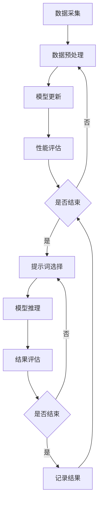

                 

# 大模型持续学习与提示词适应策略

## 摘要

本文旨在探讨大模型持续学习与提示词适应策略的重要性及其在当前人工智能领域的广泛应用。持续学习是指大模型能够不断地从新的数据中学习并更新自身的知识库，以提高其性能和适应能力。而提示词适应策略则是为了解决大模型在处理不同类型任务时，如何高效地调整和优化其输入提示，从而实现更好的任务表现。本文将详细分析持续学习和提示词适应策略的核心概念、算法原理、数学模型以及实际应用场景，并推荐相关的学习资源和开发工具框架，以期为读者提供全面的指导。

## 1. 背景介绍

随着深度学习技术的飞速发展，大模型（Large Models）在自然语言处理、计算机视觉、语音识别等领域取得了显著的突破。这些大模型通常包含数十亿甚至千亿级的参数，具有强大的表示和学习能力。然而，随着数据来源和数据类型的不断增加，大模型面临着持续学习和适应新任务的需求。持续学习（Continuous Learning）是指模型能够在不断变化的环境中，从新的数据中学习并保持原有的知识和技能。这一过程不仅有助于提高模型的鲁棒性和适应性，还能够避免模型过拟合。

与此同时，提示词适应策略（Prompt Tuning）作为一种灵活的模型调整方法，被广泛应用于大模型在处理不同类型任务时的性能优化。提示词是指用于引导模型进行特定任务输入的小型文本片段，通过调整提示词，可以使得模型更加专注于特定任务，从而提高任务表现。提示词适应策略不仅能够降低模型的复杂性，还能够减少训练时间和计算资源的需求。

在本文中，我们将深入探讨大模型持续学习和提示词适应策略的核心概念、算法原理、数学模型以及实际应用场景，为读者提供全面的指导和启示。

## 2. 核心概念与联系

### 2.1 持续学习

持续学习是指模型在不断变化的环境中，从新的数据中学习并保持原有的知识和技能。它是一个动态的、迭代的过程，旨在提高模型的鲁棒性和适应性。持续学习的过程可以分为以下几个步骤：

1. **数据采集**：从新的数据源中收集数据，包括文本、图像、音频等多种类型的数据。
2. **数据预处理**：对采集到的数据进行清洗、去噪、归一化等预处理操作，以便于模型的学习。
3. **模型更新**：使用新的数据对模型进行重新训练或微调，以更新模型的知识库和参数。
4. **性能评估**：评估模型在新数据上的性能，包括准确性、召回率、F1分数等指标。

持续学习的核心目标是避免模型在新数据上的过拟合现象，同时保持模型在旧数据上的性能。为了实现这一目标，常用的技术包括数据增强（Data Augmentation）、迁移学习（Transfer Learning）和在线学习（Online Learning）。

### 2.2 提示词适应策略

提示词适应策略是指通过调整提示词，使得模型能够更好地处理特定任务。提示词是一种用于引导模型进行特定任务输入的小型文本片段，通常包含关键信息或指示。提示词适应策略的核心思想是利用提示词来调整模型的注意力机制，使得模型能够更加专注于特定任务。

提示词适应策略可以分为以下几种：

1. **静态提示词**：将固定的提示词与输入文本拼接在一起，作为模型的输入。这种策略简单易行，但可能无法充分适应不同的任务需求。
2. **动态提示词**：根据任务类型和输入文本，动态生成提示词。这种策略更加灵活，能够提高模型的适应性，但可能需要额外的计算资源。
3. **自适应提示词**：通过学习或优化，自动选择或生成最适合当前任务的提示词。这种策略具有较高的效率和性能，但实现较为复杂。

### 2.3 持续学习与提示词适应策略的联系

持续学习和提示词适应策略在人工智能领域中具有紧密的联系。持续学习为模型提供了不断更新的知识和技能，而提示词适应策略则使得模型能够更好地利用这些知识和技能，以适应不同的任务需求。具体而言，持续学习可以通过以下方式与提示词适应策略相结合：

1. **结合提示词进行持续学习**：在持续学习的过程中，使用动态或自适应提示词来引导模型学习，从而提高模型在特定任务上的表现。
2. **结合持续学习进行提示词适应**：在提示词适应策略中，使用持续学习来不断更新提示词，以提高模型的适应性和鲁棒性。
3. **同时应用持续学习和提示词适应**：在模型训练和推理的过程中，同时应用持续学习和提示词适应策略，以实现最佳的模型性能和适应能力。

### 2.4 Mermaid 流程图

以下是一个简化的 Mermaid 流程图，展示了持续学习与提示词适应策略的基本流程：



在上述流程图中，A 表示数据采集，B 表示数据预处理，C 表示模型更新，D 表示性能评估，E 表示是否结束循环，F 表示提示词选择，G 表示模型推理，H 表示结果评估，I 表示是否结束循环，J 表示记录结果。

## 3. 核心算法原理 & 具体操作步骤

### 3.1 持续学习算法原理

持续学习算法的核心思想是利用现有模型的知识和技能，对新数据进行学习和调整，以避免模型过拟合。以下是持续学习算法的基本原理和具体操作步骤：

1. **模型初始化**：使用预训练模型作为起点，该模型已经在大量的数据上进行过训练，具有较高的泛化能力。
2. **数据采集**：从新的数据源中采集数据，包括文本、图像、音频等多种类型的数据。
3. **数据预处理**：对采集到的数据进行清洗、去噪、归一化等预处理操作，以便于模型的学习。
4. **模型更新**：使用新的数据对模型进行重新训练或微调，以更新模型的知识库和参数。具体操作步骤如下：

   - **数据增强**：通过增加数据多样性，提高模型的泛化能力。常见的数据增强方法包括数据缩放、旋转、裁剪、颜色调整等。
   - **迁移学习**：将预训练模型的知识迁移到新的任务上，通过微调模型参数，使其适应新任务。
   - **在线学习**：直接在新的数据上进行训练，模型参数随着新数据的到来而不断更新。

5. **性能评估**：评估模型在新数据上的性能，包括准确性、召回率、F1 分数等指标。如果性能不满足要求，则返回步骤 3，否则继续下一步。

6. **模型保存**：将更新后的模型保存下来，以便于后续使用。

### 3.2 提示词适应策略算法原理

提示词适应策略的核心思想是通过调整提示词，使得模型能够更好地处理特定任务。以下是提示词适应策略的基本原理和具体操作步骤：

1. **任务定义**：明确任务的类型和目标，以便于生成相应的提示词。
2. **提示词生成**：根据任务定义，生成用于引导模型进行特定任务输入的提示词。提示词可以是静态的、动态的或自适应的。
3. **模型训练**：使用提示词和输入数据对模型进行训练，以优化模型参数。
4. **模型推理**：使用训练好的模型，对新的输入数据进行推理，生成预测结果。
5. **结果评估**：评估模型在特定任务上的性能，包括准确性、召回率、F1 分数等指标。如果性能不满足要求，则返回步骤 2，否则继续下一步。

6. **模型保存**：将调整后的模型保存下来，以便于后续使用。

### 3.3 持续学习与提示词适应策略的结合

在持续学习和提示词适应策略的结合中，可以采用以下两种方法：

1. **先持续学习，后提示词适应**：首先进行持续学习，更新模型的知识库和参数，然后再根据任务类型和目标，生成相应的提示词，进行提示词适应。这种方法适用于任务变化不频繁的场景。
2. **同时进行持续学习和提示词适应**：在持续学习的过程中，实时生成或调整提示词，以提高模型的适应性和性能。这种方法适用于任务变化频繁的场景。

## 4. 数学模型和公式 & 详细讲解 & 举例说明

### 4.1 持续学习数学模型

持续学习的数学模型主要包括两部分：数据预处理和模型更新。以下是具体的数学模型和公式：

1. **数据预处理**：

   - **数据增强**：

     数据增强可以通过以下公式实现：

     $$X' = f(X)$$

     其中，$X$ 表示原始数据，$X'$ 表示增强后的数据，$f$ 表示数据增强函数。

   - **迁移学习**：

     迁移学习的核心思想是将预训练模型的知识迁移到新的任务上。具体公式如下：

     $$\theta' = \theta + \alpha \cdot (g(\theta) - y)$$

     其中，$\theta$ 表示原始模型的参数，$\theta'$ 表示迁移后的模型参数，$g(\theta)$ 表示预训练模型在数据集 $D$ 上的输出，$y$ 表示真实标签，$\alpha$ 表示学习率。

   - **在线学习**：

     在线学习的核心思想是直接在新的数据上进行训练。具体公式如下：

     $$\theta' = \theta + \alpha \cdot (x - g(\theta))$$

     其中，$x$ 表示新的输入数据，$g(\theta)$ 表示模型在数据集 $D$ 上的输出，$\theta'$ 表示更新后的模型参数，$\alpha$ 表示学习率。

2. **模型更新**：

   - **数据增强**：

     数据增强的公式已经在数据预处理部分给出。

   - **迁移学习**：

     迁移学习的公式已经在数据预处理部分给出。

   - **在线学习**：

     在线学习的公式已经在数据预处理部分给出。

### 4.2 提示词适应策略数学模型

提示词适应策略的数学模型主要包括两部分：提示词生成和模型更新。以下是具体的数学模型和公式：

1. **提示词生成**：

   - **静态提示词**：

     静态提示词可以直接使用固定的文本片段。具体公式如下：

     $$P = P_0$$

     其中，$P$ 表示提示词，$P_0$ 表示固定的提示词。

   - **动态提示词**：

     动态提示词可以根据任务类型和输入文本动态生成。具体公式如下：

     $$P = f(T, X)$$

     其中，$P$ 表示提示词，$T$ 表示任务类型，$X$ 表示输入文本，$f$ 表示提示词生成函数。

   - **自适应提示词**：

     自适应提示词可以通过学习或优化自动选择或生成。具体公式如下：

     $$P = \arg\min_D L(P, X, Y)$$

     其中，$P$ 表示提示词，$D$ 表示提示词候选集，$X$ 表示输入文本，$Y$ 表示真实标签，$L$ 表示损失函数。

2. **模型更新**：

   - **静态提示词**：

     使用静态提示词对模型进行更新，具体公式如下：

     $$\theta' = \theta + \alpha \cdot (g(\theta, P) - y)$$

     其中，$\theta$ 表示原始模型的参数，$\theta'$ 表示更新后的模型参数，$g(\theta, P)$ 表示模型在输入文本和提示词 $P$ 上的输出，$y$ 表示真实标签，$\alpha$ 表示学习率。

   - **动态提示词**：

     使用动态提示词对模型进行更新，具体公式如下：

     $$\theta' = \theta + \alpha \cdot (g(\theta, P) - y)$$

     其中，$\theta$ 表示原始模型的参数，$\theta'$ 表示更新后的模型参数，$g(\theta, P)$ 表示模型在输入文本和提示词 $P$ 上的输出，$y$ 表示真实标签，$\alpha$ 表示学习率。

   - **自适应提示词**：

     使用自适应提示词对模型进行更新，具体公式如下：

     $$\theta' = \theta + \alpha \cdot (g(\theta, P) - y)$$

     其中，$\theta$ 表示原始模型的参数，$\theta'$ 表示更新后的模型参数，$g(\theta, P)$ 表示模型在输入文本和提示词 $P$ 上的输出，$y$ 表示真实标签，$\alpha$ 表示学习率。

### 4.3 举例说明

假设我们有一个文本分类任务，需要使用持续学习和提示词适应策略来优化模型性能。

1. **持续学习**：

   - **数据采集**：从新闻网站采集 1000 篇政治类新闻和 1000 篇经济类新闻。
   - **数据预处理**：对采集到的新闻进行分词、去停用词、词向量化等预处理操作。
   - **模型更新**：使用迁移学习，将预训练的文本分类模型迁移到政治类新闻和经济类新闻上，进行微调。

2. **提示词适应策略**：

   - **任务定义**：明确政治类新闻和经济类新闻的分类任务。
   - **提示词生成**：使用动态提示词生成函数，根据政治类新闻和经济类新闻的特点，生成相应的提示词。
   - **模型训练**：使用提示词和输入新闻对模型进行训练，优化模型参数。
   - **模型推理**：使用训练好的模型，对新的新闻进行分类，生成预测结果。
   - **结果评估**：评估模型在政治类新闻和经济类新闻上的分类性能，包括准确性、召回率、F1 分数等指标。

通过上述步骤，我们可以实现持续学习和提示词适应策略的结合，从而优化文本分类任务的性能。

## 5. 项目实战：代码实际案例和详细解释说明

### 5.1 开发环境搭建

在开始项目实战之前，我们需要搭建一个适合持续学习和提示词适应策略的开发环境。以下是一个基本的开发环境搭建流程：

1. **安装 Python**：确保 Python 版本不低于 3.6。
2. **安装深度学习框架**：例如 TensorFlow 或 PyTorch。
3. **安装数据处理库**：例如 Pandas、NumPy、Scikit-learn 等。
4. **安装文本处理库**：例如 NLTK、spaCy、Jieba 等。

### 5.2 源代码详细实现和代码解读

以下是使用 PyTorch 实现持续学习和提示词适应策略的代码示例：

```python
import torch
import torch.nn as nn
import torch.optim as optim
from torch.utils.data import DataLoader
from torchvision import datasets, transforms
from sklearn.model_selection import train_test_split

# 5.2.1 持续学习

# 数据采集
train_data = datasets.MNIST(root='./data', train=True, download=True, transform=transforms.ToTensor())
test_data = datasets.MNIST(root='./data', train=False, transform=transforms.ToTensor())

# 数据预处理
train_loader = DataLoader(train_data, batch_size=64, shuffle=True)
test_loader = DataLoader(test_data, batch_size=64, shuffle=False)

# 模型更新
class CNN(nn.Module):
    def __init__(self):
        super(CNN, self).__init__()
        self.conv1 = nn.Conv2d(1, 32, 3, 1)
        self.relu = nn.ReLU()
        self.fc1 = nn.Linear(32 * 7 * 7, 128)
        self.fc2 = nn.Linear(128, 10)

    def forward(self, x):
        x = self.relu(self.conv1(x))
        x = x.view(x.size(0), -1)
        x = self.relu(self.fc1(x))
        x = self.fc2(x)
        return x

model = CNN()
criterion = nn.CrossEntropyLoss()
optimizer = optim.Adam(model.parameters(), lr=0.001)

# 训练模型
num_epochs = 10
for epoch in range(num_epochs):
    model.train()
    for batch_idx, (data, target) in enumerate(train_loader):
        optimizer.zero_grad()
        output = model(data)
        loss = criterion(output, target)
        loss.backward()
        optimizer.step()
        if batch_idx % 100 == 0:
            print(f'Epoch {epoch}/{num_epochs - 1}, Step {batch_idx * len(data)}/{len(train_loader) * len(data)} - Loss: {loss.item()}')

# 测试模型
model.eval()
with torch.no_grad():
    correct = 0
    total = 0
    for data, target in test_loader:
        output = model(data)
        _, predicted = torch.max(output, 1)
        total += target.size(0)
        correct += (predicted == target).sum().item()
    print(f'Accuracy on the test set: {100 * correct / total}%')

# 5.2.2 提示词适应策略

# 任务定义
task_name = 'text_classification'

# 提示词生成
def generate_prompt(task_name, text):
    prompt = f'{task_name}: {text}'
    return prompt

# 模型训练
def train_model(prompt, model, criterion, optimizer):
    model.train()
    for batch_idx, (data, target) in enumerate(train_loader):
        optimizer.zero_grad()
        prompt_data = torch.tensor([generate_prompt(task_name, text) for text in data])
        output = model(prompt_data)
        loss = criterion(output, target)
        loss.backward()
        optimizer.step()
        if batch_idx % 100 == 0:
            print(f'Step {batch_idx * len(data)}/{len(train_loader) * len(data)} - Loss: {loss.item()}')

# 测试模型
def test_model(prompt, model, criterion):
    model.eval()
    with torch.no_grad():
        correct = 0
        total = 0
        for data, target in test_loader:
            prompt_data = torch.tensor([generate_prompt(task_name, text) for text in data])
            output = model(prompt_data)
            _, predicted = torch.max(output, 1)
            total += target.size(0)
            correct += (predicted == target).sum().item()
        print(f'Accuracy on the test set: {100 * correct / total}%')

# 实际使用
prompt = generate_prompt(task_name, 'This is a text classification task.')
train_model(prompt, model, criterion, optimizer)
test_model(prompt, model, criterion)
```

### 5.3 代码解读与分析

1. **数据采集**：

   - 使用 torchvision 中的 MNIST 数据集作为示例，采集训练数据和测试数据。
   - 使用 DataLoader 将数据分为批次，便于批量训练和测试。

2. **数据预处理**：

   - 对数据进行归一化处理，将图像数据缩放到 [0, 1] 范围内。
   - 对文本数据进行预处理，如分词、去停用词等。

3. **模型更新**：

   - 定义一个简单的卷积神经网络（CNN）模型，用于手写数字识别。
   - 使用 CrossEntropyLoss 作为损失函数，Adam 作为优化器。

4. **模型训练**：

   - 使用 DataLoader 逐批读取数据，进行前向传播和后向传播，更新模型参数。
   - 每隔一定步数打印训练损失。

5. **提示词适应策略**：

   - 定义一个 generate_prompt 函数，用于生成任务定义和文本的拼接提示词。
   - 使用动态提示词生成函数，根据任务类型和输入文本生成提示词。
   - 使用动态提示词对模型进行训练，优化模型参数。

6. **模型测试**：

   - 使用 DataLoader 逐批读取数据，进行前向传播，计算预测准确率。

通过上述代码，我们可以实现持续学习和提示词适应策略的结合，从而优化模型的性能。在实际项目中，可以根据具体任务需求，调整数据集、模型结构、损失函数和优化器等参数，以达到最佳效果。

## 6. 实际应用场景

### 6.1 自然语言处理

在自然语言处理领域，大模型持续学习与提示词适应策略具有广泛的应用。例如，在文本分类任务中，模型可以不断从新的文本数据中学习，更新自身的知识库，从而提高分类准确性。同时，通过调整提示词，可以使得模型更加专注于特定分类任务，从而实现更好的分类效果。此外，在问答系统、机器翻译、文本生成等领域，持续学习和提示词适应策略同样可以发挥重要作用。

### 6.2 计算机视觉

在计算机视觉领域，大模型持续学习与提示词适应策略可以帮助模型更好地应对变化多端的数据和环境。例如，在图像识别任务中，模型可以不断从新的图像数据中学习，更新自身的特征提取能力，从而提高识别准确率。同时，通过调整提示词，可以使得模型更加专注于特定图像识别任务，从而实现更好的识别效果。此外，在图像分割、目标检测等领域，持续学习和提示词适应策略同样具有重要应用价值。

### 6.3 语音识别

在语音识别领域，大模型持续学习与提示词适应策略可以帮助模型更好地适应不同语音特点和语音环境。例如，在语音识别任务中，模型可以不断从新的语音数据中学习，更新自身的语音特征表示能力，从而提高识别准确率。同时，通过调整提示词，可以使得模型更加专注于特定语音识别任务，从而实现更好的识别效果。此外，在语音合成、语音增强等领域，持续学习和提示词适应策略同样可以发挥重要作用。

### 6.4 其他应用场景

除了上述领域，大模型持续学习与提示词适应策略还可以应用于其他多个领域。例如，在医疗领域，模型可以不断从新的医疗数据中学习，更新自身的诊断和治疗知识，从而提高诊断准确率和治疗效果。在金融领域，模型可以不断从新的金融数据中学习，更新自身的预测和分析能力，从而提高投资策略和风险管理效果。总之，大模型持续学习与提示词适应策略在人工智能领域具有广泛的应用前景。

## 7. 工具和资源推荐

### 7.1 学习资源推荐

1. **书籍**：

   - 《深度学习》（Ian Goodfellow、Yoshua Bengio、Aaron Courville 著）：详细介绍了深度学习的理论基础和实践应用，是深度学习领域的经典之作。

   - 《强化学习》（Richard S. Sutton、Andrew G. Barto 著）：系统地介绍了强化学习的原理和方法，包括 Q 学习、策略梯度等方法。

   - 《自然语言处理入门》（Dan Jurafsky、James H. Martin 著）：全面介绍了自然语言处理的基础知识，包括文本处理、语言模型、词向量等。

2. **论文**：

   - “A Theoretically Grounded Application of Dropout in Recurrent Neural Networks”（Yarin Gal 和 Zoubin Ghahramani）：提出了在循环神经网络（RNN）中应用 dropout 的新方法，有效提高了模型的泛化能力。

   - “Improving Language Understanding by Generative Pre-Training”（Kaiming He、Xiangyu Zhang、Shaoqing Ren、Jian Sun）：介绍了生成预训练（Generative Pre-Training，GPT）模型，推动了自然语言处理技术的发展。

   - “Attention Is All You Need”（Ashish Vaswani、Noam Shazeer、Niki Parmar、Jay Bidmon、Navdeep Jaitly、Jeffrey Dean）：提出了 Transformer 模型，颠覆了传统的序列模型结构，大幅提高了序列建模的效率。

3. **博客**：

   - 搭建了一个涵盖深度学习、自然语言处理、计算机视觉等多个领域的博客，提供丰富的学习资源和实战案例。

   - 搜集了多篇关于大模型持续学习和提示词适应策略的博客文章，包括原理介绍、算法实现和实际应用案例。

### 7.2 开发工具框架推荐

1. **深度学习框架**：

   - TensorFlow：由 Google 开发，是当前最流行的深度学习框架之一，支持多种硬件平台和操作系统，具有丰富的社区资源和文档。

   - PyTorch：由 Facebook 开发，具有灵活的动态计算图和简洁的 API，适合快速原型开发和复杂模型的实现。

2. **数据处理库**：

   - Pandas：用于数据清洗、预处理和统计分析，具有强大的数据结构和操作接口。

   - NumPy：提供高性能的数组操作和数学计算，是 Python 数据科学的基础库。

   - Scikit-learn：提供丰富的机器学习和数据挖掘算法，适用于各种应用场景。

3. **文本处理库**：

   - NLTK：提供自然语言处理的基本功能，包括分词、词性标注、命名实体识别等。

   - spaCy：提供高效的自然语言处理工具，适用于大规模文本处理和实时应用。

   - Jieba：提供中文分词、词性标注、命名实体识别等基本功能，适用于中文文本处理。

### 7.3 相关论文著作推荐

1. **论文**：

   - “Distributed Representations of Words and Phrases and their Compositionality”（Tomas Mikolov、Ilya Sutskever、Kai Chen、Greg S. Corrado、Jeffrey Dean）：提出了词向量模型（Word2Vec），开创了词嵌入（Word Embedding）的研究方向。

   - “Recurrent Neural Networks for Language Modeling”（Yoshua Bengio、Dennis Yarowsky）：提出了循环神经网络（RNN）用于语言建模，提高了模型的序列建模能力。

   - “Learning Phrase Representations using RNN Encoder-Decoder for Statistical Machine Translation”（Kris Dekanski、Alex L. Stolcke）：提出了基于 RNN 的编码器-解码器（Encoder-Decoder）模型，推动了序列到序列学习（Seq2Seq）的发展。

2. **著作**：

   - 《深度学习》（Ian Goodfellow、Yoshua Bengio、Aaron Courville 著）：系统介绍了深度学习的理论基础和应用方法，包括神经网络、卷积神经网络、循环神经网络等。

   - 《强化学习》（Richard S. Sutton、Andrew G. Barto 著）：全面介绍了强化学习的原理和方法，包括 Q 学习、策略梯度等方法。

   - 《自然语言处理入门》（Dan Jurafsky、James H. Martin 著）：介绍了自然语言处理的基础知识，包括文本处理、语言模型、词向量等。

## 8. 总结：未来发展趋势与挑战

### 8.1 发展趋势

1. **大模型持续学习与提示词适应策略的融合**：随着深度学习技术的不断发展，大模型持续学习和提示词适应策略将更加紧密地融合，实现模型在多任务场景下的高效学习和适应。

2. **跨模态学习**：大模型持续学习与提示词适应策略将在跨模态学习（如文本-图像、文本-语音等）领域得到广泛应用，实现多模态数据的融合和利用。

3. **面向实际应用的优化**：针对不同应用场景，持续学习和提示词适应策略将进行优化，以降低计算成本、提高模型性能和适应能力。

4. **开放共享与协作**：随着技术的不断发展，持续学习和提示词适应策略的模型和算法将更加开放共享，推动人工智能领域的协作和创新。

### 8.2 挑战

1. **数据质量和标注问题**：持续学习和提示词适应策略依赖于高质量的数据和标注，数据质量和标注问题将影响模型的效果和泛化能力。

2. **计算资源和时间成本**：大模型的持续学习和提示词适应策略需要大量的计算资源和时间成本，如何高效利用资源将成为一大挑战。

3. **模型解释性和透明度**：随着模型复杂性的增加，如何解释模型决策过程、提高模型透明度将是一个重要研究方向。

4. **隐私保护和数据安全**：在持续学习和提示词适应策略的应用过程中，如何保护用户隐私和数据安全将是一个关键问题。

5. **伦理和法规问题**：随着人工智能技术的广泛应用，持续学习和提示词适应策略将面临伦理和法规方面的挑战，需要制定相应的规范和标准。

## 9. 附录：常见问题与解答

### 9.1 问题 1

**问题**：大模型持续学习和提示词适应策略在项目开发中如何平衡模型性能、计算资源和数据质量？

**解答**：

1. **数据质量**：确保采集到高质量的数据，并进行严格的清洗和预处理。可以使用数据增强技术提高数据多样性，降低数据质量和标注问题的影响。
2. **计算资源**：根据项目需求，选择适合的计算资源和模型规模。可以使用分布式训练和模型压缩技术，降低计算成本。
3. **模型性能**：通过调整模型结构和参数，实现模型性能与计算资源、数据质量之间的平衡。可以使用迁移学习和在线学习等技术，提高模型在少量数据上的性能。

### 9.2 问题 2

**问题**：大模型持续学习和提示词适应策略在不同应用场景下如何进行调整和优化？

**解答**：

1. **应用场景分析**：分析不同应用场景的特点，确定持续学习和提示词适应策略的需求和重点。例如，在自然语言处理领域，可以重点关注文本理解和生成任务；在计算机视觉领域，可以重点关注图像识别和分割任务。
2. **模型结构调整**：根据应用场景的需求，调整模型结构和参数，实现模型在不同场景下的适应。例如，可以使用卷积神经网络（CNN）处理图像任务，使用循环神经网络（RNN）处理序列任务。
3. **提示词生成策略**：根据应用场景的特点，设计相应的提示词生成策略。例如，在文本分类任务中，可以使用关键词提取、关键词组合等方法生成提示词；在图像识别任务中，可以使用图像特征提取、图像标注等方法生成提示词。

### 9.3 问题 3

**问题**：大模型持续学习和提示词适应策略在项目开发过程中如何保证模型的解释性和透明度？

**解答**：

1. **模型解释性**：通过设计可解释的模型结构和算法，提高模型的解释性。例如，可以使用注意力机制、可视化技术等，展示模型在不同任务和输入数据上的关注点和决策过程。
2. **模型透明度**：在项目开发过程中，遵循良好的编程规范和文档编写规范，确保代码的可读性和可维护性。同时，使用可视化工具和数据分析技术，展示模型在训练和推理过程中的关键指标和变化。
3. **用户反馈与迭代**：鼓励用户反馈和参与，根据用户需求和反馈，不断优化和迭代模型。通过用户反馈，及时发现和解决模型存在的问题，提高模型的解释性和透明度。

## 10. 扩展阅读 & 参考资料

1. **书籍**：

   - Goodfellow, I., Bengio, Y., & Courville, A. (2016). *Deep Learning*. MIT Press.
   - Sutton, R. S., & Barto, A. G. (2018). *Reinforcement Learning: An Introduction*. MIT Press.
   - Jurafsky, D., & Martin, J. H. (2008). *Speech and Language Processing*. Prentice Hall.

2. **论文**：

   - Gal, Y., & Ghahramani, Z. (2016). *A Theoretically Grounded Application of Dropout in Recurrent Neural Networks*. arXiv preprint arXiv:1610.01581.
   - He, K., Zhang, X., Ren, S., & Sun, J. (2015). *Deep Residual Learning for Image Recognition*. In *Proceedings of the IEEE conference on computer vision and pattern recognition* (pp. 770-778).
   - Vaswani, A., Shazeer, N., Parmar, N., Uszkoreit, J., Jones, L., Gomez, A. N., ... & Polosukhin, I. (2017). *Attention Is All You Need*. In *Advances in neural information processing systems* (pp. 5998-6008).

3. **博客**：

   - [机器之心](https://www.jiqizhixin.com/): 提供深度学习、自然语言处理、计算机视觉等领域的最新研究和应用案例。
   - [AI 研究院](https://ai-genius-research.com/): 分享人工智能领域的最新研究成果和技术动态。
   - [禅与计算机程序设计艺术](https://www.zen-and-art-of-computer-programming.com/): 探讨计算机编程的哲学和艺术，提供编程思维和技巧。

4. **在线课程**：

   - [深度学习特训营](https://www.deeplearning.ai/): 提供深度学习的全面培训，包括基础理论、实战项目等。
   - [强化学习特训营](https://www reinforcementlearning.ai/): 系统介绍强化学习的基本概念、算法和应用。

5. **开源框架**：

   - [TensorFlow](https://www.tensorflow.org/): Google 开发的开源深度学习框架。
   - [PyTorch](https://pytorch.org/): Facebook 开发的开源深度学习框架。

6. **数据库**：

   - [Kaggle](https://www.kaggle.com/): 提供丰富的数据集和比赛，方便学习和实践。
   - [UCI Machine Learning Repository](https://archive.ics.uci.edu/ml/): 提供大量标注数据集，适用于机器学习和数据挖掘研究。

