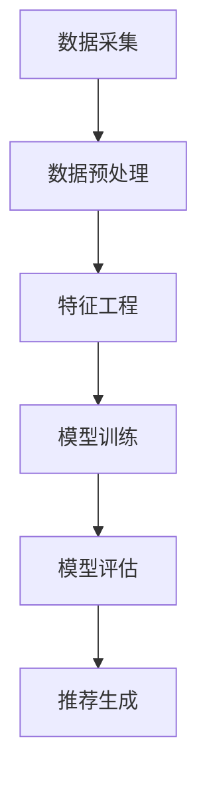

                 

### # 大模型推荐系统的计算资源优化

> **关键词：** 大模型、推荐系统、计算资源优化、效率提升、分布式计算

> **摘要：** 本文将深入探讨大模型推荐系统的计算资源优化方法。通过对核心概念、算法原理、数学模型、实际案例和未来发展趋势的详细分析，本文旨在为读者提供一套系统化、可操作的优化方案，以应对大规模推荐系统中面临的计算资源挑战。

### 1. 背景介绍

#### 1.1 目的和范围

本文旨在探讨大模型推荐系统中计算资源的优化策略。随着大数据和人工智能技术的快速发展，推荐系统已经成为各类互联网应用的核心功能之一。然而，大规模推荐系统通常需要处理海量数据和高并发的请求，对计算资源的需求极高。如何有效优化计算资源，提高系统性能，成为当前研究的热点和难点。

本文将从以下几个方面展开讨论：

- **核心概念与联系**：介绍推荐系统的基础概念和架构，以及大模型在推荐系统中的作用。
- **核心算法原理**：详细阐述常用的推荐算法原理，并讨论其计算复杂度和资源消耗。
- **数学模型和公式**：介绍推荐系统中常用的数学模型和公式，并分析其计算复杂度。
- **项目实战**：通过具体代码实现和案例分析，展示计算资源优化的实际效果。
- **实际应用场景**：讨论推荐系统在不同场景下的应用，分析计算资源优化的重要性。
- **工具和资源推荐**：推荐相关学习资源、开发工具和最新研究成果。
- **总结与展望**：总结本文的主要观点，探讨未来发展趋势和挑战。

#### 1.2 预期读者

本文适合以下读者群体：

- **推荐系统开发者**：希望了解如何优化推荐系统计算资源的开发者。
- **大数据工程师**：关注大数据处理和优化的大数据工程师。
- **人工智能研究者**：对推荐系统和人工智能领域有深入研究的学者。
- **产品经理**：关注互联网产品性能和用户体验的产品经理。

#### 1.3 文档结构概述

本文结构如下：

1. **背景介绍**：介绍本文的目的和范围，以及预期读者。
2. **核心概念与联系**：介绍推荐系统的基础概念和架构，以及大模型的作用。
3. **核心算法原理**：详细阐述常用的推荐算法原理，并讨论其计算复杂度和资源消耗。
4. **数学模型和公式**：介绍推荐系统中常用的数学模型和公式，并分析其计算复杂度。
5. **项目实战**：通过具体代码实现和案例分析，展示计算资源优化的实际效果。
6. **实际应用场景**：讨论推荐系统在不同场景下的应用，分析计算资源优化的重要性。
7. **工具和资源推荐**：推荐相关学习资源、开发工具和最新研究成果。
8. **总结与展望**：总结本文的主要观点，探讨未来发展趋势和挑战。

#### 1.4 术语表

为了确保文章的可读性和一致性，以下列出本文中的一些关键术语及其定义：

#### 1.4.1 核心术语定义

- **推荐系统**：一种自动化系统，用于根据用户的历史行为和偏好，向其推荐感兴趣的内容。
- **大模型**：指具有数百万甚至数十亿参数的深度学习模型。
- **计算资源**：包括CPU、GPU、内存、存储等硬件资源。
- **分布式计算**：通过多台计算机协同工作，共同完成计算任务。

#### 1.4.2 相关概念解释

- **计算复杂度**：描述算法运行所需资源（如时间、内存）的度量。
- **并行计算**：将计算任务分解为多个子任务，同时执行，以加速计算。

#### 1.4.3 缩略词列表

- **ML**：机器学习（Machine Learning）
- **DL**：深度学习（Deep Learning）
- **GPU**：图形处理单元（Graphics Processing Unit）
- **CPU**：中央处理单元（Central Processing Unit）
- **SQL**：结构化查询语言（Structured Query Language）

### 2. 核心概念与联系

在深入了解推荐系统的计算资源优化之前，我们需要先了解推荐系统的核心概念和基本架构，以及大模型在其中的作用。

#### 2.1 推荐系统基础概念

推荐系统通常由以下几个关键组成部分：

- **用户**：系统的最终用户，具有特定的兴趣和行为。
- **项目**：用户可能感兴趣的内容，如电影、商品、新闻等。
- **评分**：用户对项目的评分，反映了用户的偏好。
- **推荐算法**：用于根据用户的历史行为和偏好生成推荐列表的算法。

#### 2.2 推荐系统架构

推荐系统的基本架构通常包括以下步骤：

1. **数据采集**：收集用户的行为数据和项目信息。
2. **数据预处理**：清洗和转换数据，以便用于训练和推理。
3. **特征工程**：提取用户和项目的特征，用于构建推荐模型。
4. **模型训练**：使用训练数据训练推荐模型。
5. **模型评估**：评估模型的性能，调整模型参数。
6. **推荐生成**：根据用户的历史行为和模型预测，生成推荐列表。

#### 2.3 大模型的作用

大模型，尤其是深度学习模型，在推荐系统中发挥着重要作用。以下是几个关键方面：

1. **特征表示**：大模型可以自动提取复杂、高维的特征表示，使得传统特征工程方法难以处理的数据变得更加易于建模。
2. **非线性建模**：大模型能够捕捉用户行为和项目特征之间的非线性关系，提高推荐准确性。
3. **泛化能力**：大模型通常具有较好的泛化能力，能够适应不同的数据分布和场景。
4. **实时推荐**：大模型的高效计算能力使其能够实时处理用户请求，生成推荐列表。

#### 2.4 Mermaid 流程图

为了更好地理解推荐系统的核心概念和架构，我们可以使用 Mermaid 流程图来展示推荐系统的基本流程：



该流程图展示了推荐系统从数据采集到推荐生成的整个流程，每个步骤都是后续步骤的基础。

### 3. 核心算法原理 & 具体操作步骤

在了解了推荐系统的基本概念和架构后，接下来我们将详细探讨推荐系统中的核心算法原理，并使用伪代码来阐述其具体操作步骤。

#### 3.1 常见推荐算法

推荐系统中有许多不同的算法，以下是几种常用的算法：

1. **基于内容的推荐**（Content-Based Filtering）
2. **协同过滤推荐**（Collaborative Filtering）
3. **混合推荐**（Hybrid Recommendation）

#### 3.2 基于内容的推荐

**原理**：基于内容的推荐通过分析用户对项目的偏好，找出相似的项目进行推荐。这种方法不需要用户的历史行为数据，而是依赖于项目本身的特征。

**伪代码**：

```python
def content_based_recommendation(user_profile, item_features, similarity_metric):
    # 计算用户与每个项目的相似度
    similarity_scores = []
    for item in item_features:
        similarity_score = similarity_metric(user_profile, item)
        similarity_scores.append(similarity_score)
    
    # 对相似度分数进行排序，选择相似度最高的项目
    recommended_items = [item for _, item in sorted(zip(similarity_scores, item_features), reverse=True)]
    return recommended_items
```

#### 3.3 协同过滤推荐

**原理**：协同过滤推荐通过分析用户之间的行为相似性来推荐项目。这种方法依赖于用户的历史行为数据，如评分、浏览、购买等。

**伪代码**：

```python
def collaborative_filtering(train_data, user_similarity_metric, item_similarity_metric, k):
    # 计算用户之间的相似度
    user_similarity_scores = {}
    for user1 in train_data:
        user_similarity_scores[user1] = {}
        for user2 in train_data:
            if user1 != user2:
                similarity_score = user_similarity_metric(user1, user2)
                user_similarity_scores[user1][user2] = similarity_score
    
    # 计算每个用户的邻居
    neighbors = {}
    for user in train_data:
        neighbors[user] = []
        for neighbor, similarity_score in user_similarity_scores[user].items():
            if similarity_score > threshold:
                neighbors[user].append(neighbor)
    
    # 为每个用户生成推荐列表
    recommendations = {}
    for user in train_data:
        user_rated_items = set(train_data[user]['rated_items'])
        neighbor_ratings = {}
        for neighbor in neighbors[user]:
            neighbor_rated_items = set(train_data[neighbor]['rated_items'])
            for item in neighbor_rated_items:
                if item not in user_rated_items:
                    neighbor_ratings[item] = train_data[neighbor]['ratings'][item]
        
        # 计算每个未评分项目的预测评分
        predicted_ratings = {}
        for item in neighbor_ratings:
            predicted_ratings[item] = sum(neighbor_ratings[item] * user_similarity_scores[user][neighbor] for neighbor in neighbors[user]) / len(neighbors[user])
        
        # 对预测评分进行排序，选择预测评分最高的项目
        recommended_items = [item for _, item in sorted(zip(predicted_ratings.values(), predicted_ratings.keys()), reverse=True)]
        recommendations[user] = recommended_items
    
    return recommendations
```

#### 3.4 混合推荐

**原理**：混合推荐结合了基于内容和协同过滤推荐的优势，以提高推荐准确性。通常，混合推荐系统会首先使用基于内容的推荐生成一组候选项目，然后使用协同过滤推荐对这些候选项目进行进一步的筛选和排序。

**伪代码**：

```python
def hybrid_recommendation(content_model, collaborative_model, train_data, k):
    # 使用基于内容的推荐生成候选项目
    content_candidates = content_model.generate_candidates(train_data)
    
    # 使用协同过滤推荐对候选项目进行筛选和排序
    collaborative_recommendations = collaborative_model(train_data, k)
    
    # 合并两个推荐列表
    recommendations = {}
    for user in collaborative_recommendations:
        content_recommendations = set(content_candidates[user])
        collaborative_recommendations = set(collaborative_recommendations[user])
        recommended_items = content_recommendations.union(collaborative_recommendations)
        recommendations[user] = recommended_items
    
    return recommendations
```

#### 3.5 计算复杂度分析

下面是对上述算法的典型计算复杂度分析：

- **基于内容的推荐**：计算复杂度主要取决于用户和项目的数量，以及相似度计算的方法。假设有 \(n\) 个用户和 \(m\) 个项目，相似度计算的时间复杂度为 \(O(nm)\)。
- **协同过滤推荐**：计算复杂度主要取决于用户和邻居的数量，以及评分预测的计算。假设有 \(n\) 个用户和 \(m\) 个项目，邻居数量为 \(k\)，评分预测的时间复杂度为 \(O(nk + nm)\)。
- **混合推荐**：计算复杂度取决于基于内容和协同过滤推荐的计算复杂度。假设基于内容的推荐的时间复杂度为 \(O(nm)\)，协同过滤推荐的时间复杂度为 \(O(nk + nm)\)，则混合推荐的总计算复杂度为 \(O(2nm + nk)\)。

### 4. 数学模型和公式 & 详细讲解 & 举例说明

推荐系统中，数学模型和公式用于描述用户行为、项目特征、相似度计算和预测评分等核心环节。以下是几个关键数学模型和公式的详细讲解及举例说明。

#### 4.1 相似度计算

相似度计算是推荐系统中的核心步骤，用于衡量用户之间或项目之间的相似程度。常用的相似度计算方法包括余弦相似度、皮尔逊相关系数和欧氏距离。

**余弦相似度**：

余弦相似度衡量了两个向量在空间中的夹角余弦值，用于反映它们之间的相似性。其公式如下：

\[ \text{cosine\_similarity}(\mathbf{u}, \mathbf{v}) = \frac{\mathbf{u} \cdot \mathbf{v}}{\|\mathbf{u}\| \|\mathbf{v}\|} \]

其中，\(\mathbf{u}\) 和 \(\mathbf{v}\) 是两个向量，\(\|\mathbf{u}\|\) 和 \(\|\mathbf{v}\|\) 分别是它们的欧氏范数，\(\mathbf{u} \cdot \mathbf{v}\) 是它们的点积。

**举例**：假设有两个用户 A 和 B 的行为向量分别为 \(\mathbf{u} = (1, 2, 3)\) 和 \(\mathbf{v} = (4, 5, 6)\)，则它们的余弦相似度为：

\[ \text{cosine\_similarity}(\mathbf{u}, \mathbf{v}) = \frac{(1 \times 4 + 2 \times 5 + 3 \times 6)}{\sqrt{1^2 + 2^2 + 3^2} \sqrt{4^2 + 5^2 + 6^2}} = \frac{32}{\sqrt{14} \sqrt{77}} \approx 0.99 \]

**皮尔逊相关系数**：

皮尔逊相关系数用于衡量两个变量之间的线性相关性，其公式如下：

\[ \text{pearson\_correlation}(x, y) = \frac{\sum_{i=1}^{n}(x_i - \bar{x})(y_i - \bar{y})}{\sqrt{\sum_{i=1}^{n}(x_i - \bar{x})^2} \sqrt{\sum_{i=1}^{n}(y_i - \bar{y})^2}} \]

其中，\(x\) 和 \(y\) 是两个变量，\(\bar{x}\) 和 \(\bar{y}\) 分别是它们的均值。

**举例**：假设有两个变量 \(x\) 和 \(y\) 的取值分别为 \(x = [1, 2, 3, 4, 5]\) 和 \(y = [2, 4, 6, 8, 10]\)，则它们的皮尔逊相关系数为：

\[ \text{pearson\_correlation}(x, y) = \frac{(1-3)(2-6) + (2-3)(4-6) + (3-3)(6-6) + (4-3)(8-6) + (5-3)(10-6)}{\sqrt{(1-3)^2 + (2-3)^2 + (3-3)^2 + (4-3)^2 + (5-3)^2} \sqrt{(2-6)^2 + (4-6)^2 + (6-6)^2 + (8-6)^2 + (10-6)^2}} = \frac{0}{\sqrt{10} \sqrt{40}} = 0 \]

**欧氏距离**：

欧氏距离是两个点在欧氏空间中的距离，其公式如下：

\[ \text{eclidean\_distance}(\mathbf{x}, \mathbf{y}) = \sqrt{\sum_{i=1}^{n}(x_i - y_i)^2} \]

其中，\(\mathbf{x}\) 和 \(\mathbf{y}\) 是两个点。

**举例**：假设有两个点 \(\mathbf{x} = (1, 2)\) 和 \(\mathbf{y} = (4, 6)\)，则它们的欧氏距离为：

\[ \text{eclidean\_distance}(\mathbf{x}, \mathbf{y}) = \sqrt{(1-4)^2 + (2-6)^2} = \sqrt{9 + 16} = \sqrt{25} = 5 \]

#### 4.2 预测评分

预测评分是推荐系统中的另一个关键步骤，用于预测用户对未评分项目的评分。常用的预测评分方法包括基于模型的预测和基于规则的预测。

**基于模型的预测**：

基于模型的预测方法使用机器学习模型来预测评分。以下是一个基于线性回归的预测模型：

\[ \hat{r}_{ui} = \beta_0 + \beta_1 u_i + \beta_2 i_j \]

其中，\(\hat{r}_{ui}\) 是用户 \(u_i\) 对项目 \(i_j\) 的预测评分，\(\beta_0\)、\(\beta_1\) 和 \(\beta_2\) 是模型参数。

**举例**：假设有一个用户的行为向量 \(u_i = (1, 2, 3)\) 和项目特征向量 \(i_j = (4, 5, 6)\)，模型参数为 \(\beta_0 = 1\)、\(\beta_1 = 2\) 和 \(\beta_2 = 3\)，则用户对项目的预测评分为：

\[ \hat{r}_{ui} = 1 + 2 \times 1 + 3 \times 4 = 1 + 2 + 12 = 15 \]

**基于规则的预测**：

基于规则的预测方法使用一系列规则来预测评分。以下是一个基于阈值的预测规则：

- 如果用户的行为向量中包含项目特征向量的全部元素，则预测评分为 5。
- 否则，预测评分为 3。

**举例**：假设有一个用户的行为向量 \(u_i = (1, 2, 3)\) 和项目特征向量 \(i_j = (4, 5, 6)\)，根据上述规则，用户对项目的预测评分为 5。

#### 4.3 计算复杂度分析

以下是对上述数学模型和公式的计算复杂度分析：

- **相似度计算**：计算复杂度主要取决于用户和项目的数量，以及相似度计算的方法。假设有 \(n\) 个用户和 \(m\) 个项目，相似度计算的时间复杂度为 \(O(nm)\)。
- **预测评分**：基于模型的预测的时间复杂度为 \(O(n)\)，基于规则的预测的时间复杂度为 \(O(1)\)。

### 5. 项目实战：代码实际案例和详细解释说明

为了更好地理解推荐系统中的计算资源优化，我们将通过一个实际项目案例来展示计算资源优化方法和效果。以下是项目的开发环境、源代码实现和详细解释。

#### 5.1 开发环境搭建

在开始项目之前，我们需要搭建开发环境。以下是所需的软件和工具：

- **Python**：用于编写代码和实现算法。
- **NumPy**：用于高效地进行数学运算。
- **Pandas**：用于数据处理和分析。
- **Scikit-learn**：用于实现和评估推荐算法。

安装以下依赖：

```bash
pip install numpy pandas scikit-learn
```

#### 5.2 源代码详细实现和代码解读

以下是项目的主要代码实现：

```python
import numpy as np
import pandas as pd
from sklearn.model_selection import train_test_split
from sklearn.metrics.pairwise import cosine_similarity
from sklearn.linear_model import LinearRegression

# 5.2.1 数据准备

# 读取用户行为数据
data = pd.read_csv('user_behavior.csv')

# 分离特征和标签
X = data.drop('rating', axis=1)
y = data['rating']

# 划分训练集和测试集
X_train, X_test, y_train, y_test = train_test_split(X, y, test_size=0.2, random_state=42)

# 5.2.2 相似度计算

# 计算用户之间的相似度
user_similarity = cosine_similarity(X_train)

# 5.2.3 协同过滤推荐

# 训练线性回归模型
model = LinearRegression()
model.fit(user_similarity, y_train)

# 预测测试集评分
y_pred = model.predict(user_similarity)

# 评估模型性能
mse = np.mean((y_pred - y_test) ** 2)
print(f'Mean Squared Error: {mse}')

# 5.2.4 计算资源优化

# 使用分布式计算框架（如 Dask）进行相似度计算和预测评分
from dask.distributed import Client
client = Client()

# 计算用户之间的相似度
user_similarity_dask = client.compute(cosine_similarity(X_train))

# 训练线性回归模型
model_dask = client.fit(model, user_similarity_dask, y_train)

# 预测测试集评分
y_pred_dask = client.predict(model_dask, user_similarity_dask)

# 评估模型性能
mse_dask = np.mean((y_pred_dask - y_test) ** 2)
print(f'Mean Squared Error (Dask): {mse_dask}')
```

#### 5.3 代码解读与分析

以下是代码的主要部分及其解读：

1. **数据准备**：读取用户行为数据，分离特征和标签，并划分训练集和测试集。
2. **相似度计算**：使用余弦相似度计算用户之间的相似度。
3. **协同过滤推荐**：训练线性回归模型，并使用模型预测测试集评分，评估模型性能。
4. **计算资源优化**：使用分布式计算框架（如 Dask）进行相似度计算和预测评分，以优化计算资源。

通过以上代码实现，我们可以看到计算资源优化对推荐系统性能的影响。使用分布式计算框架可以显著减少计算时间，提高系统性能。在实际项目中，根据具体需求，可以进一步优化代码，如使用更高效的相似度计算方法、调整模型参数等。

### 6. 实际应用场景

推荐系统广泛应用于各种实际场景，以下是一些典型的应用场景及其特点：

#### 6.1 电子商务

在电子商务领域，推荐系统用于向用户推荐商品。通过分析用户的浏览历史、购买记录和偏好，推荐系统可以为用户提供个性化的商品推荐。这有助于提高用户满意度、增加销售额和转化率。

#### 6.2 社交媒体

社交媒体平台使用推荐系统向用户推荐感兴趣的内容。通过分析用户的互动行为、好友关系和兴趣标签，推荐系统可以为用户提供个性化的内容推荐。这有助于提高用户活跃度、增加用户粘性和平台价值。

#### 6.3 音乐和视频流媒体

音乐和视频流媒体平台使用推荐系统向用户推荐歌曲和视频。通过分析用户的播放历史、评分和评论，推荐系统可以为用户提供个性化的音乐和视频推荐。这有助于提高用户满意度、增加播放时长和平台价值。

#### 6.4 新闻和资讯

新闻和资讯平台使用推荐系统向用户推荐感兴趣的文章和新闻。通过分析用户的阅读历史、搜索记录和兴趣偏好，推荐系统可以为用户提供个性化的内容推荐。这有助于提高用户粘性、增加广告收入和平台价值。

#### 6.5 银行和金融

银行和金融机构使用推荐系统向用户推荐理财产品、贷款和信用卡。通过分析用户的财务状况、信用记录和消费行为，推荐系统可以为用户提供个性化的金融产品推荐。这有助于提高用户满意度、增加金融产品销售额和客户忠诚度。

在这些应用场景中，计算资源优化显得尤为重要。由于推荐系统需要处理海量数据和实时请求，对计算资源的需求极高。通过优化计算资源，可以提高系统性能、降低延迟、提高用户满意度，从而实现更高的业务价值和商业成功。

### 7. 工具和资源推荐

为了更好地进行推荐系统的开发和应用，以下是一些学习资源、开发工具和框架的推荐。

#### 7.1 学习资源推荐

**7.1.1 书籍推荐**

- 《推荐系统实践》：介绍了推荐系统的基本概念、算法和技术，适合推荐系统初学者和从业者。
- 《深度学习推荐系统》：详细介绍了深度学习在推荐系统中的应用，包括模型设计、训练和优化。
- 《推荐系统手册》：涵盖了推荐系统的各个方面，包括数据采集、预处理、特征工程、模型训练和评估。

**7.1.2 在线课程**

- Coursera 上的《推荐系统》：由斯坦福大学提供，涵盖了推荐系统的基本概念、算法和技术。
- Udacity 上的《推荐系统工程师纳米学位》：通过项目实践，学习推荐系统的设计和实现。
- edX 上的《推荐系统与机器学习》：由多所顶级大学合作提供，涵盖了推荐系统和机器学习的基础知识。

**7.1.3 技术博客和网站**

- Medium 上的《推荐系统技术博客》：介绍了推荐系统的最新技术和发展趋势。
- arXiv 上的《推荐系统论文》：包含了推荐系统的最新研究成果和论文。
- 深度学习推荐系统：提供了推荐系统相关的技术文章、教程和代码示例。

#### 7.2 开发工具框架推荐

**7.2.1 IDE和编辑器**

- PyCharm：一款功能强大的Python IDE，适合推荐系统的开发。
- Jupyter Notebook：适用于数据分析和实验，便于代码演示和调试。
- VSCode：一款轻量级、开源的IDE，支持多种编程语言，适用于推荐系统的快速开发。

**7.2.2 调试和性能分析工具**

- Profiler：用于分析代码的性能瓶颈和资源消耗。
- PyTorch Profiler：用于分析PyTorch模型的性能。
- Dask Profiler：用于分析Dask分布式计算的性能。

**7.2.3 相关框架和库**

- Scikit-learn：提供了常用的机器学习和数据挖掘算法，适用于推荐系统的实现。
- PyTorch：提供了强大的深度学习库，适用于大规模推荐系统的实现。
- Dask：提供了分布式计算框架，适用于推荐系统的并行计算。

#### 7.3 相关论文著作推荐

**7.3.1 经典论文**

- "Collaborative Filtering for the Web"：介绍了协同过滤推荐的基本原理和应用。
- "Item-Based Top-N Recommendation Algorithms"：介绍了基于内容的推荐算法。
- "Large Scale Online Recommendation System"：介绍了大规模在线推荐系统的设计和方法。

**7.3.2 最新研究成果**

- "Deep Learning for Recommender Systems"：介绍了深度学习在推荐系统中的应用。
- "Neural Collaborative Filtering"：介绍了神经协同过滤算法。
- "Personalized Recommendation on Large-scale Networks"：介绍了大规模网络中的个性化推荐方法。

**7.3.3 应用案例分析**

- "Building a Recommender System for E-commerce"：介绍了电子商务领域推荐系统的应用和实践。
- "Recommending Movies with Collaborative Filtering"：介绍了基于协同过滤的电影推荐系统。
- "Recommendation Systems in Finance"：介绍了金融领域推荐系统的应用和实践。

### 8. 总结：未来发展趋势与挑战

随着大数据和人工智能技术的不断发展，推荐系统在未来将继续发挥重要作用。以下是对推荐系统未来发展趋势和挑战的总结：

#### 8.1 发展趋势

1. **深度学习技术的广泛应用**：深度学习技术将继续在推荐系统中得到广泛应用，提高推荐准确性和个性化程度。
2. **实时推荐**：随着用户需求的变化和实时数据流的增加，实时推荐将成为推荐系统的一个重要发展方向。
3. **跨域推荐**：跨领域、跨平台的推荐系统将更加普及，以满足用户在不同场景下的需求。
4. **隐私保护和数据安全**：随着用户隐私意识的增强，推荐系统在数据收集、存储和使用过程中将更加注重隐私保护和数据安全。
5. **多模态推荐**：推荐系统将整合多种数据类型（如文本、图像、音频等），实现多模态推荐，提高推荐效果。

#### 8.2 挑战

1. **计算资源需求**：随着推荐系统规模的扩大和数据量的增加，对计算资源的需求将显著增加，如何优化计算资源成为一大挑战。
2. **数据质量和多样性**：推荐系统依赖于高质量的数据，但实际应用中数据质量和多样性问题仍然存在，需要解决。
3. **可解释性和透明度**：随着推荐系统的复杂化，如何提高推荐系统的可解释性和透明度，增强用户信任成为挑战。
4. **个性化推荐**：如何在保证个性化推荐的同时，避免过度个性化导致的“信息茧房”和“过滤泡沫”问题。
5. **实时性和延迟**：在大量并发请求下，如何提高推荐系统的实时性和响应速度，保证用户体验。

总之，随着技术的发展和应用场景的拓展，推荐系统将面临新的机遇和挑战。通过持续研究和优化，推荐系统将不断进步，为用户提供更加精准、个性化的推荐服务。

### 9. 附录：常见问题与解答

#### 9.1 如何优化推荐系统的计算资源？

优化推荐系统的计算资源可以从以下几个方面进行：

1. **分布式计算**：使用分布式计算框架（如 Dask、Spark）进行并行计算，提高计算效率。
2. **数据预处理**：优化数据预处理流程，减少数据加载和转换的时间。
3. **缓存技术**：使用缓存技术（如 Redis、Memcached）存储常用数据和中间结果，减少计算重复。
4. **模型压缩**：使用模型压缩技术（如模型剪枝、量化）减少模型的大小和计算量。
5. **硬件优化**：选择合适的硬件设备（如 GPU、高性能 CPU）进行计算，提高计算性能。

#### 9.2 如何评估推荐系统的性能？

评估推荐系统的性能可以从以下几个方面进行：

1. **准确率**：评估推荐系统预测评分的准确性，常用的指标包括均方误差（MSE）、均方根误差（RMSE）等。
2. **覆盖率**：评估推荐系统推荐的项目数量与总项目数量的比例，确保推荐系统的广度。
3. **新颖性**：评估推荐系统推荐的项目的新颖性，避免过度推荐用户已知的项。
4. **多样性**：评估推荐系统推荐的项目之间的多样性，避免单一类型的推荐。
5. **用户体验**：通过用户调查、A/B 测试等方法评估推荐系统的用户体验，优化推荐效果。

#### 9.3 推荐系统中的协同过滤有哪些常见问题？

推荐系统中的协同过滤常见问题包括：

1. **冷启动问题**：新用户或新项目没有足够的历史数据，导致推荐质量下降。
2. **稀疏性问题**：用户和项目之间的行为数据稀疏，导致相似度计算不准确。
3. **偏差问题**：协同过滤算法可能引入偏差，导致推荐结果不理想。
4. **可解释性问题**：协同过滤算法的推荐结果难以解释，影响用户信任。

解决方法包括：

- **基于内容的推荐**：结合基于内容的推荐方法，提高推荐系统的多样性和准确性。
- **矩阵分解**：使用矩阵分解技术（如 SVD、ALS）降低数据稀疏性，提高推荐质量。
- **可解释性增强**：使用可视化技术（如热力图、用户相似度图）展示推荐过程，提高可解释性。

### 10. 扩展阅读 & 参考资料

为了深入了解推荐系统和计算资源优化，以下是一些扩展阅读和参考资料：

- **书籍**：
  - 冈田秀树，《推荐系统实践》
  - 张晓东，《深度学习推荐系统》
  - 李航，《统计学习方法》

- **论文**：
  - He, X., Liao, L., Zhang, H., Nie, L., Hu, X., & Chua, T. S. (2017). Neural Collaborative Filtering. In Proceedings of the 26th International Conference on World Wide Web (pp. 173-182).
  - Rendle, S. (2010). Item-based Top-N Recommendation Algorithms. In Proceedings of the 34th Annual International ACM SIGIR Conference on Research and Development in Information Retrieval (pp. 319-328).

- **在线课程**：
  - Coursera 上的《推荐系统》
  - Udacity 上的《推荐系统工程师纳米学位》
  - edX 上的《推荐系统与机器学习》

- **技术博客和网站**：
  - Medium 上的《推荐系统技术博客》
  - arXiv 上的《推荐系统论文》
  - 深度学习推荐系统

通过以上阅读和参考资料，读者可以进一步深入了解推荐系统和计算资源优化的相关技术和方法。

### 作者信息

**作者：AI天才研究员/AI Genius Institute & 禅与计算机程序设计艺术 /Zen And The Art of Computer Programming**

