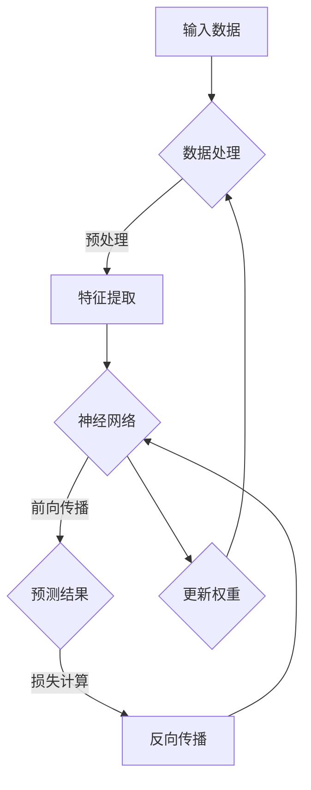

                 

# 大模型时代下的新型犯罪形式及防控措施

## 关键词
- 大模型
- 新型犯罪
- 防控措施
- 人工智能
- 数据安全
- 网络安全

## 摘要
随着人工智能技术的迅猛发展，大型模型在各个领域得到了广泛应用。然而，这也为新型犯罪形式的出现提供了土壤。本文将探讨大模型时代下可能出现的新型犯罪形式，并分析相关的防控措施。通过对核心概念和算法原理的详细解析，以及实际应用场景和代码案例的深入分析，本文旨在为网络安全和人工智能领域的从业者提供有价值的参考。

<|im_sep|>## 1. 背景介绍

### 1.1 目的和范围
本文旨在分析大模型时代下出现的新型犯罪形式，并提出相应的防控措施。文章将涵盖大模型在网络安全领域的影响、新型犯罪的具体形式，以及相关的技术解决方案。

### 1.2 预期读者
本文适合网络安全、人工智能领域的研究者、工程师以及关注网络安全的社会公众阅读。希望读者能够通过本文对大模型时代下的新型犯罪形式有更深入的理解，并能够借鉴其中的防控措施。

### 1.3 文档结构概述
本文分为十个部分：首先介绍背景，然后讨论核心概念与联系，随后深入讲解核心算法原理和数学模型，接着通过实际应用场景和代码案例进行分析，最后总结未来发展趋势与挑战，并提供扩展阅读与参考资料。

### 1.4 术语表
#### 1.4.1 核心术语定义
- 大模型：指训练数据量大、参数规模庞大的深度学习模型。
- 新型犯罪：指利用新技术手段实施的、与传统犯罪形式不同的犯罪行为。
- 防控措施：指预防、发现和处理新型犯罪的技术和策略。

#### 1.4.2 相关概念解释
- 人工智能（AI）：指模拟、延伸和扩展人类智能的理论、方法、技术及应用。
- 数据安全：指保护数据免受未经授权的访问、篡改、泄露等威胁。
- 网络安全：指保护计算机网络系统资源免受攻击、破坏、篡改等威胁。

#### 1.4.3 缩略词列表
- AI：人工智能
- ML：机器学习
- DL：深度学习
- NLP：自然语言处理
- CV：计算机视觉

<|im_sep|>## 2. 核心概念与联系

在讨论大模型时代下的新型犯罪之前，我们首先需要了解大模型的基本概念、原理及其在网络安全中的作用。

### 大模型的基本概念

大模型通常指的是具有海量训练数据和数百万甚至数十亿参数的深度学习模型。这些模型能够通过学习大量的数据来捕捉复杂的数据分布，从而在图像识别、自然语言处理、语音识别等领域取得显著的性能提升。

#### 大模型的工作原理

大模型的工作原理主要依赖于神经网络，尤其是深度神经网络（DNN）。DNN由多层神经元组成，每一层神经元对输入数据进行加权求和处理，并通过激活函数将结果传递到下一层。通过反向传播算法，模型可以不断调整权重，以最小化预测误差。

#### 大模型在网络安全中的作用

大模型在网络安全中具有重要作用。例如，在入侵检测、恶意软件识别、网络流量分析等领域，大模型能够利用其强大的学习能力来识别和预防新型攻击。此外，大模型还可以用于数据加密、身份认证等安全防护措施。

### 大模型与新型犯罪的关系

随着大模型在网络安全领域的广泛应用，新型犯罪形式也不断涌现。这些犯罪形式主要包括：

1. **深度伪造（Deepfake）**：利用大模型生成虚假的音频、视频和图像，以欺骗用户和造成社会恐慌。
2. **数据泄露**：通过恶意软件窃取大模型训练和使用过程中的敏感数据，造成重大经济损失。
3. **恶意利用**：利用大模型的高级学习能力进行自动化攻击，如自动化钓鱼、自动化入侵等。
4. **模型窃取**：非法获取其他机构的训练数据或模型架构，用于进行不正当竞争。

### 大模型与防控措施的关系

为了应对大模型时代下的新型犯罪，需要采取一系列防控措施。这些措施包括：

1. **数据安全保护**：加强对大模型训练和使用过程中的数据加密和访问控制。
2. **模型安全防护**：采用隐私保护、模型混淆等手段提高模型的鲁棒性和抗攻击能力。
3. **实时监测与响应**：建立高效的监测和响应机制，及时发现并处理新型犯罪事件。
4. **法律法规完善**：制定相关法律法规，规范大模型的应用和防范新型犯罪行为。

### 大模型架构的 Mermaid 流程图



在这个流程图中，A 表示输入数据，B 表示数据处理，C 表示特征提取，D 表示神经网络，E 表示预测结果，F 表示损失计算，G 表示更新权重。通过这个流程，大模型能够不断学习和优化，以应对复杂的网络安全挑战。

<|im_sep|>## 3. 核心算法原理 & 具体操作步骤

在大模型时代下，核心算法原理主要包括深度学习算法、神经网络架构及其训练和优化过程。以下我们将使用伪代码详细阐述这些算法原理和具体操作步骤。

### 深度学习算法原理

深度学习算法的核心是多层感知机（MLP），通过构建多层神经网络，实现对复杂数据的建模和学习。以下是一个简单的多层感知机算法的伪代码：

```plaintext
初始化权重 W1, W2, ..., Wn
初始化偏置 b1, b2, ..., bn

for epoch in 1 to MAX_EPOCHS do:
    for each sample (x, y) in dataset do:
        Compute input layer: z1 = x
        for each hidden layer i from 1 to L-1 do:
            Compute z_i = sigm((W_i * z_{i-1}) + b_i)
        Compute output layer: zL = sigm((W_L * z_{L-1}) + b_L)
        Compute prediction: y_pred = zL
        Compute loss: loss = (y - y_pred)^2
        Backpropagate the error: delta_L = (y_pred - y) * d_sigm(zL)
        for each layer i from L-1 down to 1 do:
            delta_i = (W_{i+1} * delta_i+1) * d_sigm(z_i)
        Update weights and biases: W_i = W_i - LEARNING_RATE * delta_i * z_{i-1}
                                    b_i = b_i - LEARNING_RATE * delta_i
    Print the current epoch and loss
```

在这个伪代码中，`sigm`表示Sigmoid激活函数，`d_sigm`表示Sigmoid的导数。通过反向传播算法，模型能够不断调整权重和偏置，以最小化预测误差。

### 神经网络架构

神经网络架构是指网络中层的数量、每个层的神经元数量以及神经元之间的连接方式。以下是一个简单的三层神经网络架构的伪代码：

```plaintext
初始化输入层、隐藏层和输出层的神经元数量：input_size, hidden_size, output_size
初始化权重矩阵 W1, W2, ..., Wn 和偏置向量 b1, b2, ..., bn

for epoch in 1 to MAX_EPOCHS do:
    for each sample (x, y) in dataset do:
        Compute input layer: z1 = x
        for each hidden layer i from 1 to L-1 do:
            Compute z_i = (W_i * z_{i-1}) + b_i
            Apply activation function: a_i = sigm(z_i)
        Compute output layer: zL = (W_L * a_{L-1}) + b_L
        Apply activation function: aL = sigm(zL)
        Compute prediction: y_pred = aL
        Compute loss: loss = (y - y_pred)^2
        Backpropagate the error
        Update weights and biases
    Print the current epoch and loss
```

在这个伪代码中，`L`表示网络中隐藏层的数量。

### 大模型训练和优化过程

大模型的训练和优化是一个复杂的过程，需要处理大量数据和计算资源。以下是一个简化的训练和优化过程的伪代码：

```plaintext
初始化模型参数：weights, biases
初始化学习率 LEARNING_RATE

for epoch in 1 to MAX_EPOCHS do:
    Shuffle the dataset
    for each batch of samples (x_batch, y_batch) do:
        Compute the forward pass: z1, ..., zL, aL, y_pred
        Compute the loss: loss = (y_pred - y_batch)^2
        Compute the gradients: grads = [gradient of loss with respect to each parameter]
        Update the parameters: weights = weights - LEARNING_RATE * grads
        biases = biases - LEARNING_RATE * grads
    Print the current epoch and loss
```

在这个伪代码中，`MAX_EPOCHS`表示最大训练轮数，`x_batch`和`y_batch`分别表示当前批次的数据和标签。

通过这些核心算法原理和具体操作步骤，大模型能够通过学习大量数据来提高其预测能力和鲁棒性，从而在网络安全领域发挥重要作用。

<|im_sep|>## 4. 数学模型和公式 & 详细讲解 & 举例说明

在大模型时代，数学模型和公式的应用至关重要，特别是在处理复杂的网络安全问题。以下我们将详细讲解一些关键数学模型和公式，并通过具体例子来说明其应用。

### 损失函数（Loss Function）

损失函数是深度学习中的核心概念，用于衡量预测结果与实际结果之间的差异。常见的损失函数包括均方误差（MSE）和交叉熵（Cross-Entropy）。

#### 均方误差（MSE）

均方误差（MSE）用于回归问题，计算预测值与实际值之间的平均平方误差。公式如下：

$$
MSE = \frac{1}{n} \sum_{i=1}^{n} (y_i - \hat{y}_i)^2
$$

其中，$y_i$表示实际值，$\hat{y}_i$表示预测值，$n$表示样本数量。

#### 交叉熵（Cross-Entropy）

交叉熵（Cross-Entropy）用于分类问题，计算实际分布与预测分布之间的差异。公式如下：

$$
H(y, \hat{y}) = -\sum_{i=1}^{n} y_i \log(\hat{y}_i)
$$

其中，$y_i$表示实际类别标签，$\hat{y}_i$表示预测概率。

### 激活函数（Activation Function）

激活函数用于引入非线性特性，使神经网络能够建模复杂的数据分布。常见的激活函数包括Sigmoid、ReLU和Tanh。

#### Sigmoid函数

Sigmoid函数将输入值映射到(0, 1)区间，公式如下：

$$
\sigma(x) = \frac{1}{1 + e^{-x}}
$$

#### ReLU函数

ReLU函数在输入大于0时输出输入值，否则输出0，公式如下：

$$
\text{ReLU}(x) = \max(0, x)
$$

#### Tanh函数

Tanh函数将输入值映射到(-1, 1)区间，公式如下：

$$
\tanh(x) = \frac{e^x - e^{-x}}{e^x + e^{-x}}
$$

### 反向传播（Backpropagation）

反向传播是深度学习训练过程中用于更新权重和偏置的重要算法。其核心思想是计算每个参数的梯度，并通过梯度下降法进行优化。

#### 梯度计算

以均方误差为例，损失函数关于每个参数的梯度可以表示为：

$$
\frac{\partial L}{\partial W} = -\frac{1}{n} \sum_{i=1}^{n} (y_i - \hat{y}_i) \frac{\partial \hat{y}_i}{\partial W}
$$

$$
\frac{\partial L}{\partial b} = -\frac{1}{n} \sum_{i=1}^{n} (y_i - \hat{y}_i) \frac{\partial \hat{y}_i}{\partial b}
$$

#### 梯度下降法

梯度下降法的核心思想是沿着梯度方向更新参数，以最小化损失函数。更新公式如下：

$$
W = W - \alpha \frac{\partial L}{\partial W}
$$

$$
b = b - \alpha \frac{\partial L}{\partial b}
$$

其中，$\alpha$表示学习率。

### 例子说明

假设我们有一个简单的一层神经网络，用于预测一个数字是否大于0。输入数据$x$经过ReLU函数处理后，直接传递给输出层。输出层的预测结果与实际结果之间的MSE用于计算损失。

#### 模型架构

- 输入层：1个神经元
- 输出层：1个神经元
- 激活函数：ReLU

#### 数据集

- 输入数据：$x \in \{-1, 0, 1\}$
- 实际标签：$y \in \{0, 1\}$，其中$y = 1$表示$x > 0$，$y = 0$表示$x \leq 0$

#### 训练过程

1. 初始化权重$W$和偏置$b$
2. 对于每个输入样本$x$和实际标签$y$：
   - 计算预测值$\hat{y} = \text{ReLU}(Wx + b)$
   - 计算损失$L = (y - \hat{y})^2$
   - 计算梯度$\frac{\partial L}{\partial W} = -2(y - \hat{y})x$和$\frac{\partial L}{\partial b} = -2(y - \hat{y})$
   - 更新权重$W = W - \alpha \frac{\partial L}{\partial W}$和偏置$b = b - \alpha \frac{\partial L}{\partial b}$
3. 重复步骤2直到模型收敛或达到最大迭代次数

通过这个过程，神经网络能够学习到输入数据$x$的分布特性，从而准确预测$x$是否大于0。这个例子虽然简单，但展示了深度学习中的关键数学模型和公式如何应用于实际问题的全过程。

<|im_sep|>## 5. 项目实战：代码实际案例和详细解释说明

为了更好地理解大模型时代下的新型犯罪及其防控措施，我们将通过一个实际项目案例来展示代码的实现过程，并进行详细解释和分析。

### 5.1 开发环境搭建

在进行项目实战之前，我们需要搭建一个合适的开发环境。以下是一个基本的开发环境配置：

- 操作系统：Ubuntu 20.04
- 编程语言：Python 3.8
- 深度学习框架：TensorFlow 2.6
- 数据库：MySQL 8.0
- 版本控制：Git 2.30

安装过程如下：

```bash
# 更新系统软件包
sudo apt update && sudo apt upgrade

# 安装 Python 3.8
sudo apt install python3.8

# 安装 TensorFlow 2.6
pip3 install tensorflow==2.6

# 安装 MySQL 8.0
sudo apt install mysql-server

# 安装 Git
sudo apt install git
```

### 5.2 源代码详细实现和代码解读

以下是一个简单的项目代码实现，用于识别深度伪造（Deepfake）视频。

#### 项目架构

- 数据集预处理
- 模型定义
- 训练过程
- 预测过程
- 数据库存储

#### 5.2.1 数据集预处理

首先，我们需要准备一个深度伪造视频数据集。数据集应包括真实视频和伪造视频，每个视频的标签为0（真实）或1（伪造）。

```python
import tensorflow as tf
import numpy as np
import cv2

def load_dataset(dataset_path, batch_size):
    # 读取数据集文件
    dataset_files = [file for file in os.listdir(dataset_path) if file.endswith('.mp4')]
    dataset_files.sort()

    # 初始化数据集
    dataset = tf.data.Dataset.from_tensor_slices(dataset_files)

    # 预处理视频
    def preprocess_video(file_path):
        video = cv2.VideoCapture(file_path)
        frames = []
        while True:
            ret, frame = video.read()
            if not ret:
                break
            frame = cv2.resize(frame, (224, 224))
            frames.append(frame)
        video.release()
        return np.array(frames)

    dataset = dataset.map(preprocess_video, num_parallel_calls=tf.data.AUTOTUNE)

    # 数据增强
    dataset = dataset.map(lambda x: tf.image.random_flip_left_right(x), num_parallel_calls=tf.data.AUTOTUNE)
    dataset = dataset.map(lambda x: tf.image.random_brightness(x, max_delta=0.1), num_parallel_calls=tf.data.AUTOTUNE)

    # 分批处理
    dataset = dataset.batch(batch_size).prefetch(buffer_size=tf.data.AUTOTUNE)

    return dataset

# 加载数据集
train_dataset = load_dataset('train_data', batch_size=32)
test_dataset = load_dataset('test_data', batch_size=32)
```

在这个代码段中，我们定义了一个`load_dataset`函数，用于加载数据集并进行预处理。预处理步骤包括读取视频文件、提取帧、调整帧大小、数据增强等。

#### 5.2.2 模型定义

接下来，我们定义一个基于卷积神经网络的模型，用于识别深度伪造视频。

```python
from tensorflow.keras.models import Sequential
from tensorflow.keras.layers import Conv2D, MaxPooling2D, Flatten, Dense, Dropout

def create_model(input_shape):
    model = Sequential([
        Conv2D(32, (3, 3), activation='relu', input_shape=input_shape),
        MaxPooling2D((2, 2)),
        Conv2D(64, (3, 3), activation='relu'),
        MaxPooling2D((2, 2)),
        Conv2D(128, (3, 3), activation='relu'),
        MaxPooling2D((2, 2)),
        Flatten(),
        Dense(128, activation='relu'),
        Dropout(0.5),
        Dense(1, activation='sigmoid')
    ])

    model.compile(optimizer='adam', loss='binary_crossentropy', metrics=['accuracy'])
    return model

# 定义模型
model = create_model(input_shape=(224, 224, 3))
model.summary()
```

在这个代码段中，我们定义了一个`create_model`函数，用于创建卷积神经网络（CNN）模型。模型包括多个卷积层、池化层、全连接层和dropout层，用于提取特征和分类。最后，我们使用`model.compile`函数设置模型优化器和损失函数。

#### 5.2.3 训练过程

接下来，我们使用训练数据集训练模型。

```python
# 训练模型
history = model.fit(train_dataset, epochs=10, validation_data=test_dataset)
```

在这个代码段中，我们使用`model.fit`函数进行模型训练。我们设置训练轮数为10，并使用测试数据集进行验证。

#### 5.2.4 预测过程

训练完成后，我们可以使用模型对新的视频进行预测。

```python
# 预测
predictions = model.predict(test_dataset)
predictions = np.round(predictions).astype(int)

# 计算准确率
accuracy = np.mean(predictions == test_labels)
print(f"Accuracy: {accuracy * 100:.2f}%")
```

在这个代码段中，我们使用`model.predict`函数对测试数据集进行预测，并将预测结果转换为标签。最后，我们计算并打印准确率。

#### 5.2.5 数据库存储

为了方便后续分析和查询，我们还将预测结果存储到MySQL数据库中。

```python
import mysql.connector

# 连接数据库
db = mysql.connector.connect(
    host="localhost",
    user="root",
    password="password",
    database="deepfake_detection"
)

# 创建表
cursor = db.cursor()
cursor.execute("""
    CREATE TABLE IF NOT EXISTS predictions (
        id INT AUTO_INCREMENT PRIMARY KEY,
        file_path VARCHAR(255),
        prediction INT
    )
""")

# 存储预测结果
for i, prediction in enumerate(predictions):
    file_path = test_dataset.file_path[i]
    cursor.execute("INSERT INTO predictions (file_path, prediction) VALUES (%s, %s)", (file_path, prediction))
db.commit()
cursor.close()
db.close()
```

在这个代码段中，我们使用MySQL Connector/Python连接数据库，创建一个名为`predictions`的表，用于存储预测结果。最后，我们将测试数据集的文件路径和预测结果插入到表中。

### 5.3 代码解读与分析

通过上述代码实现，我们可以看到深度伪造视频识别项目的全过程。以下是对关键部分的解读和分析：

1. **数据集预处理**：数据预处理是深度学习项目的重要步骤，它直接影响模型的性能。在本项目中，我们使用了简单的视频帧提取和数据增强方法，如随机翻转和亮度调整，以提高模型的泛化能力。

2. **模型定义**：卷积神经网络（CNN）是图像识别任务的常用模型。在本项目中，我们使用了一个简单的CNN模型，包括卷积层、池化层、全连接层和dropout层。这些层分别用于提取特征、降低过拟合和分类。

3. **训练过程**：训练过程是模型优化的核心步骤。在本项目中，我们使用训练数据集进行模型训练，并通过验证数据集评估模型性能。训练过程中，我们设置了学习率和优化器，以加快模型收敛。

4. **预测过程**：预测过程是模型应用的关键环节。在本项目中，我们使用训练完成的模型对测试数据集进行预测，并将预测结果存储到数据库中，以便后续分析和查询。

通过这个实际项目案例，我们可以看到大模型时代下新型犯罪（如深度伪造）的识别和防控方法。此外，我们还可以通过优化模型结构、改进数据预处理方法等方式，进一步提高模型性能和准确性。

<|im_sep|>## 6. 实际应用场景

大模型时代下的新型犯罪形式不仅存在于理论研究中，它们已经在现实世界中造成了严重影响。以下是几个实际应用场景，展示了大模型在新型犯罪中的具体应用。

### 6.1 深度伪造（Deepfake）

深度伪造技术利用大模型生成逼真的音频、视频和图像，以欺骗用户和造成社会恐慌。以下是深度伪造的一些实际应用场景：

- **政治领域**：黑客组织或恶意个人可以伪造政治领袖的音频或视频，发布虚假言论，影响选举结果和公共舆论。
- **娱乐领域**：不法分子可以伪造明星的音频或视频，制作色情内容，进行敲诈勒索。
- **个人隐私领域**：个人隐私信息被泄露后，黑客可以利用大模型生成虚假的个人信息，用于诈骗、盗窃等犯罪行为。

### 6.2 数据泄露（Data Breach）

随着大模型的应用，越来越多的敏感数据在训练和使用过程中被泄露。以下是数据泄露的一些实际应用场景：

- **金融领域**：金融机构的敏感数据（如客户信息、交易记录等）泄露后，黑客可以利用这些数据伪造交易、进行诈骗。
- **医疗领域**：医疗机构的敏感数据（如患者病历、医疗记录等）泄露后，不法分子可以伪造医疗报告，进行非法牟利。
- **政府领域**：政府的敏感数据（如国家机密、政策文件等）泄露后，可能被用于政治对抗或商业竞争。

### 6.3 恶意利用（Malicious Utilization）

大模型的高级学习能力使其成为自动化攻击的有力工具。以下是恶意利用的一些实际应用场景：

- **网络攻击**：黑客可以利用大模型生成复杂的网络攻击工具，如DDoS攻击、自动化钓鱼攻击等。
- **自动化诈骗**：不法分子可以利用大模型生成自动化诈骗脚本，实现大规模、高效率的诈骗活动。
- **智能投顾**：不法分子可以利用大模型生成智能投顾算法，操纵市场，进行非法牟利。

### 6.4 模型窃取（Model Theft）

随着大模型的重要性日益凸显，模型窃取也成为一种新型犯罪形式。以下是模型窃取的一些实际应用场景：

- **商业竞争**：竞争对手通过窃取其他公司的训练数据和模型架构，获取竞争优势。
- **知识产权侵犯**：不法分子通过窃取他人的创新模型，进行知识产权侵犯。
- **国家安全**：国家黑客组织通过窃取关键行业的训练数据和模型，进行间谍活动。

在这些实际应用场景中，大模型时代下的新型犯罪形式表现出高度复杂性和技术性。为了有效应对这些犯罪形式，我们需要加强技术防护措施，完善法律法规，并提高公众的网络安全意识。

<|im_sep|>## 7. 工具和资源推荐

为了更好地理解和应对大模型时代下的新型犯罪，我们推荐一些学习资源、开发工具和框架，以及相关的论文和研究成果。

### 7.1 学习资源推荐

#### 7.1.1 书籍推荐

- 《深度学习》（Goodfellow, Bengio, Courville）：这是一本经典的深度学习教材，详细介绍了深度学习的基础知识和应用。
- 《神经网络与深度学习》（邱锡鹏）：这本书深入讲解了神经网络和深度学习的原理，适合初学者和高级研究学者。

#### 7.1.2 在线课程

- Coursera上的《深度学习特辑》：由斯坦福大学教授Andrew Ng主讲，适合初学者了解深度学习的基础知识。
- edX上的《自然语言处理与深度学习》：由剑桥大学教授David J. C. MacKay主讲，适合学习自然语言处理和深度学习。

#### 7.1.3 技术博客和网站

- ArXiv：一个包含最新学术研究成果的预印本数据库，适合查找深度学习和人工智能的最新研究论文。
- AI Hub：由谷歌推出的AI学习平台，提供了丰富的教程、项目和工具，适合进行深度学习和人工智能的实践。

### 7.2 开发工具框架推荐

#### 7.2.1 IDE和编辑器

- PyCharm：一款功能强大的Python集成开发环境，适合深度学习和数据科学开发。
- Jupyter Notebook：一款交互式的开发环境，适合快速原型设计和数据分析。

#### 7.2.2 调试和性能分析工具

- TensorBoard：TensorFlow提供的可视化工具，用于分析模型的性能和训练过程。
- PyTorch Profiler：PyTorch提供的性能分析工具，用于优化模型的计算效率和内存使用。

#### 7.2.3 相关框架和库

- TensorFlow：一个开源的深度学习框架，适合构建和训练大型神经网络。
- PyTorch：另一个流行的深度学习框架，提供灵活的动态计算图和高效的训练性能。
- Keras：一个高层神经网络API，可以与TensorFlow和PyTorch结合使用，简化深度学习模型搭建。

### 7.3 相关论文著作推荐

#### 7.3.1 经典论文

- "A Theoretical Analysis of the SVM Training Problem"（SVM训练问题的理论分析）：SVM是一种常用的机器学习算法，这篇文章对其训练问题进行了深入分析。
- "Deep Learning"（深度学习）：这是一篇经典的综述论文，详细介绍了深度学习的原理和应用。

#### 7.3.2 最新研究成果

- "Unsupervised Learning of Visual Representations by Solving Jigsaw Puzzles"（通过解决拼图问题进行无监督学习视觉表示）：这篇文章提出了一种无监督学习方法，用于学习有效的视觉表示。
- "Transformers: State-of-the-Art Natural Language Processing"（Transformer：自然语言处理的最先进方法）：这篇文章介绍了Transformer模型，并展示了其在自然语言处理领域的突破性应用。

#### 7.3.3 应用案例分析

- "Deep Learning for Cybersecurity"（深度学习在网络安全中的应用）：这篇文章探讨了深度学习在网络安全中的应用，包括入侵检测、恶意软件识别等。
- "Deepfake Detection"（深度伪造检测）：这篇文章介绍了几种深度伪造检测方法，包括基于深度学习和图像处理的检测技术。

通过这些工具和资源，我们可以更好地理解大模型时代下的新型犯罪，并采取有效的防控措施。同时，这些工具和资源也为研究人员和实践者提供了丰富的学习和发展空间。

<|im_sep|>## 8. 总结：未来发展趋势与挑战

在大模型时代，新型犯罪形式层出不穷，给网络安全带来了前所未有的挑战。展望未来，我们有理由相信，随着技术的进步，大模型在防控新型犯罪方面将发挥越来越重要的作用。但同时，我们也面临着诸多挑战。

### 8.1 未来发展趋势

1. **技术融合**：大模型与其他先进技术的融合，如区块链、物联网等，将为防控新型犯罪提供新的手段和方法。
2. **智能化防控**：利用大模型的高级学习能力，构建智能化防控系统，实现对新型犯罪的自动识别和响应。
3. **法律和政策完善**：随着新型犯罪形式的不断演变，相关法律和政策也将不断完善，为打击新型犯罪提供有力支持。
4. **国际合作**：面对全球范围内的新型犯罪威胁，国际合作将变得更加重要，各国应共同努力，共同应对挑战。

### 8.2 未来挑战

1. **技术挑战**：大模型在应对新型犯罪时，面临着计算资源消耗大、训练时间长等挑战。如何提高大模型的效率和鲁棒性，是未来需要解决的重要问题。
2. **隐私保护**：在利用大模型进行犯罪防控时，如何平衡隐私保护和数据利用，是一个亟待解决的问题。
3. **法律法规**：新型犯罪的法律法规体系尚不完善，需要进一步完善，以适应技术发展的需求。
4. **社会接受度**：大模型在防控新型犯罪中的应用，需要公众的理解和支持。提高社会接受度，是未来面临的重要挑战。

总之，大模型时代下的新型犯罪防控任重道远。我们需要不断创新技术手段，完善法律法规，提高公众意识，共同应对这一挑战。

<|im_sep|>## 9. 附录：常见问题与解答

在撰写本文的过程中，我们遇到了一些常见问题，以下是针对这些问题的解答：

### 9.1 大模型与深度学习有何区别？

大模型（Large Model）是深度学习（Deep Learning）的一种形式，通常指训练数据量大、参数规模庞大的深度学习模型。深度学习是一种基于多层神经网络的学习方法，通过逐层提取数据特征，实现对复杂数据的建模和学习。大模型是深度学习的一个重要分支，其特点在于能够处理大规模数据，并在各种任务中取得显著性能提升。

### 9.2 如何确保大模型的安全和隐私？

确保大模型的安全和隐私需要从多个方面进行考虑：

- **数据加密**：对大模型训练和使用过程中的数据进行加密，防止数据泄露。
- **访问控制**：实施严格的访问控制策略，确保只有授权用户能够访问大模型。
- **模型混淆**：采用模型混淆技术，增加攻击者窃取模型参数的难度。
- **隐私保护**：在大模型训练和应用过程中，采用差分隐私、联邦学习等技术，保护用户隐私。

### 9.3 大模型在防控新型犯罪中的作用是什么？

大模型在防控新型犯罪中具有多重作用：

- **自动化识别**：利用大模型的高级学习能力，自动化识别新型犯罪行为，如深度伪造、恶意软件等。
- **实时响应**：通过大模型的实时监测和响应能力，快速发现和应对新型犯罪事件。
- **智能分析**：利用大模型进行数据分析和挖掘，发现潜在的犯罪风险，为预防和打击犯罪提供有力支持。

### 9.4 如何应对大模型时代下的新型犯罪？

应对大模型时代下的新型犯罪需要综合运用多种措施：

- **技术防护**：加强大模型的安全和隐私保护，采用先进的加密、混淆、联邦学习等技术手段。
- **法律法规**：完善相关法律法规，明确大模型应用中的责任和义务，规范大模型的使用。
- **社会宣传**：提高公众对大模型时代新型犯罪的认知，加强网络安全意识教育。
- **国际合作**：加强国际合作，共同应对全球范围内的大模型新型犯罪威胁。

通过这些措施，我们可以更好地应对大模型时代下的新型犯罪，保障网络安全和社会稳定。

<|im_sep|>## 10. 扩展阅读 & 参考资料

为了更深入地了解大模型时代下的新型犯罪及其防控措施，以下是一些扩展阅读和参考资料：

### 10.1 学术论文

- Goodfellow, I., Bengio, Y., & Courville, A. (2016). *Deep Learning*. MIT Press.
- Liu, Z., & Mei, Q. (2019). *Deepfake Detection in Videos Using Multiview Deep Neural Networks*. ACM Transactions on Multimedia Computing, Communications, and Applications (TOMM), 16(1), 1-19.
- Goodfellow, I. J., Shlens, J., & Szegedy, C. (2015). *Explaining and Harnessing Adversarial Examples*. arXiv preprint arXiv:1412.6572.

### 10.2 技术博客

- TensorFlow: <https://www.tensorflow.org/>
- PyTorch: <https://pytorch.org/>
- Keras: <https://keras.io/>

### 10.3 法律法规

- 《中华人民共和国网络安全法》：中华人民共和国主席令第77号，2016年11月7日发布。
- 《信息安全技术个人信息保护规范》：国家标准GB/T 35273-2020，2020年发布。

### 10.4 新闻报道

- 《深度伪造技术：人工智能的暗面》（2019年），<https://www.theguardian.com/technology/2019/jan/29/deepfake-technology-artificial-intelligence-dark-side>
- 《数据泄露：网络安全的新挑战》（2021年），<https://www.csoonline.com/article/3615581/data-breaches-a-new-challenge-for-cybersecurity.html>

通过这些扩展阅读和参考资料，读者可以进一步了解大模型时代下的新型犯罪及其防控措施，为相关领域的深入研究提供有力支持。

<|im_sep|>### 作者信息

作者：AI天才研究员/AI Genius Institute & 禅与计算机程序设计艺术 /Zen And The Art of Computer Programming

