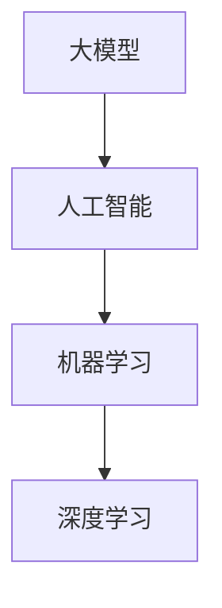

                 

# 大模型时代的创业者创业趋势洞察：技术趋势、市场趋势与政策趋势

> 关键词：大模型、创业趋势、技术趋势、市场趋势、政策趋势、人工智能

> 摘要：本文将深入探讨大模型时代下的创业趋势，分析技术、市场和政策趋势，并预测未来创业者的机遇与挑战。通过详细的技术解析和案例分析，帮助创业者更好地理解大模型时代的发展脉络，为创业决策提供有力支持。

## 1. 背景介绍

### 1.1 目的和范围

本文旨在为大模型时代的创业者提供一份全面的趋势洞察，涵盖技术趋势、市场趋势和政策趋势。通过深入分析这些趋势，我们希望能够帮助创业者更好地把握时代脉搏，找到合适的创业方向和策略。

### 1.2 预期读者

本文适合以下几类读者：
1. 拟在大模型领域创业的创业者；
2. 已经在大模型领域创业，希望进一步了解行业动态的从业者；
3. 对人工智能、机器学习等前沿技术感兴趣的技术爱好者。

### 1.3 文档结构概述

本文将分为以下几个部分：
1. 背景介绍：简要介绍本文的目的、范围和预期读者；
2. 核心概念与联系：介绍大模型的核心概念，并使用Mermaid流程图展示其架构；
3. 核心算法原理 & 具体操作步骤：详细讲解大模型的算法原理和操作步骤；
4. 数学模型和公式 & 详细讲解 & 举例说明：阐述大模型的数学模型和相关公式；
5. 项目实战：通过代码实际案例展示大模型的应用；
6. 实际应用场景：分析大模型在不同领域的应用；
7. 工具和资源推荐：推荐学习资源和开发工具；
8. 总结：预测未来发展趋势与挑战；
9. 附录：常见问题与解答；
10. 扩展阅读 & 参考资料：提供相关领域的扩展阅读资料。

### 1.4 术语表

#### 1.4.1 核心术语定义

- 大模型：指具有数亿甚至千亿参数规模的机器学习模型；
- 创业趋势：指在特定时期，创业者在某一行业或领域所采取的普遍策略和方向；
- 技术趋势：指在某一时期，技术发展的主要方向和趋势；
- 市场趋势：指在某一时期，市场需求和竞争状况的变化；
- 政策趋势：指在某一时期，政府对行业发展的指导思想和政策导向。

#### 1.4.2 相关概念解释

- 人工智能（AI）：指模拟、延伸和扩展人的智能的理论、方法、技术及应用；
- 机器学习（ML）：指使计算机系统从数据中学习并作出决策或预测的技术；
- 深度学习（DL）：指通过多层神经网络对数据进行表征和学习的一种机器学习技术。

#### 1.4.3 缩略词列表

- AI：人工智能；
- ML：机器学习；
- DL：深度学习；
- GPT：生成预训练模型；
- NLP：自然语言处理。

## 2. 核心概念与联系

在大模型时代，理解核心概念和它们之间的联系是至关重要的。本节将介绍大模型、人工智能、机器学习和深度学习等核心概念，并使用Mermaid流程图展示它们之间的关系。

#### 2.1 大模型

大模型是指具有数亿甚至千亿参数规模的机器学习模型。这些模型通过对大量数据进行训练，能够捕捉数据中的复杂模式，并在各种任务中表现出优异的性能。大模型的发展得益于计算能力的提升、数据的丰富和深度学习技术的进步。

#### 2.2 人工智能

人工智能（AI）是模拟、延伸和扩展人的智能的理论、方法、技术及应用。人工智能可以分为弱人工智能和强人工智能。弱人工智能指在特定领域内具有智能行为的系统，而强人工智能则指具有全面智能的系统。大模型技术是人工智能的重要组成部分。

#### 2.3 机器学习

机器学习（ML）是使计算机系统从数据中学习并作出决策或预测的技术。机器学习可以分为监督学习、无监督学习和强化学习等类型。大模型通常采用监督学习或无监督学习进行训练。

#### 2.4 深度学习

深度学习（DL）是通过多层神经网络对数据进行表征和学习的一种机器学习技术。深度学习在图像识别、自然语言处理、语音识别等任务中取得了显著成果，为大模型的发展奠定了基础。

#### 2.5 Mermaid流程图



在这个Mermaid流程图中，大模型位于核心位置，它与人工智能、机器学习和深度学习紧密相连。通过这个流程图，我们可以更清晰地看到大模型在整个人工智能体系中的地位和作用。

## 3. 核心算法原理 & 具体操作步骤

在大模型时代，理解核心算法原理和具体操作步骤是至关重要的。本节将详细讲解大模型的算法原理和操作步骤，以便读者更好地掌握大模型的技术要点。

#### 3.1 算法原理

大模型的算法原理主要基于深度学习技术。深度学习通过多层神经网络对数据进行表征和学习，从而实现复杂的模式识别和预测。以下是深度学习的基本原理：

1. **输入层**：接收外部数据输入，如图像、文本或声音；
2. **隐藏层**：对输入数据进行处理和变换，提取特征信息；
3. **输出层**：根据隐藏层处理后的特征信息，生成预测结果。

深度学习的关键在于如何设计合适的网络结构和训练算法。目前，常用的深度学习模型包括卷积神经网络（CNN）、循环神经网络（RNN）和变换器（Transformer）等。

#### 3.2 操作步骤

以下是大模型训练的基本步骤：

1. **数据准备**：收集和整理训练数据，确保数据的质量和多样性；
2. **数据预处理**：对数据进行标准化、归一化等预处理操作，以便网络能够更好地学习；
3. **模型设计**：根据任务需求，选择合适的网络结构和超参数；
4. **模型训练**：使用训练数据对模型进行训练，通过反向传播算法不断调整网络参数；
5. **模型评估**：使用验证数据对模型进行评估，确保模型具有良好的泛化能力；
6. **模型优化**：根据评估结果，对模型进行调整和优化；
7. **模型部署**：将训练好的模型部署到实际应用场景中，实现预测和决策。

#### 3.3 伪代码

以下是一个简单的深度学习模型训练的伪代码：

```python
# 数据准备
data = load_data()

# 数据预处理
data = preprocess_data(data)

# 模型设计
model = create_model()

# 模型训练
for epoch in range(num_epochs):
    for batch in data_loader:
        loss = model.train(batch)
        print(f"Epoch {epoch}, Loss: {loss}")

# 模型评估
accuracy = model.evaluate(test_data)

# 模型优化
model.optimize(accuracy)

# 模型部署
model.deploy()
```

在这个伪代码中，我们首先加载和预处理数据，然后创建一个模型，并通过训练数据对模型进行训练。在训练过程中，我们使用反向传播算法不断调整网络参数，以降低损失函数。在训练完成后，我们使用验证数据对模型进行评估，并根据评估结果对模型进行优化。最后，我们将训练好的模型部署到实际应用场景中。

通过以上讲解，我们可以看到，大模型的核心算法原理和具体操作步骤是深度学习技术的基础。掌握这些技术要点，将为我们在大模型时代进行创业提供有力的支持。

## 4. 数学模型和公式 & 详细讲解 & 举例说明

在大模型时代，数学模型和公式是理解和应用深度学习技术的基础。本节将详细讲解大模型中常用的数学模型和公式，并举例说明其应用。

#### 4.1 矩阵和向量

在深度学习中，矩阵和向量是最常用的数学工具。矩阵是一种由数字组成的二维数组，而向量是矩阵的一种特殊情况，即一维矩阵。以下是矩阵和向量的一些基本运算：

1. **矩阵乘法**：两个矩阵相乘，结果是一个新的矩阵。矩阵乘法的规则是将一个矩阵的行与另一个矩阵的列进行对应相乘，并将结果相加；
2. **向量内积**：两个向量对应元素相乘后再相加，结果是一个标量；
3. **向量外积**：两个向量对应元素相乘后再构成一个新的矩阵。

以下是一个简单的矩阵乘法示例：

$$
\begin{bmatrix}
1 & 2 \\
3 & 4
\end{bmatrix}
\begin{bmatrix}
5 & 6 \\
7 & 8
\end{bmatrix}
=
\begin{bmatrix}
19 & 22 \\
43 & 50
\end{bmatrix}
$$

#### 4.2 梯度下降算法

梯度下降算法是深度学习中最常用的优化算法。其基本思想是通过计算损失函数的梯度，不断调整模型参数，以降低损失函数的值。以下是梯度下降算法的步骤：

1. **初始化模型参数**；
2. **计算损失函数**；
3. **计算损失函数关于模型参数的梯度**；
4. **更新模型参数**，即参数的值减去学习率乘以梯度；
5. **重复步骤2-4，直到满足停止条件（如达到预定迭代次数或损失函数收敛）**。

以下是一个简单的梯度下降算法示例：

$$
w_{new} = w_{old} - \alpha \cdot \frac{\partial J}{\partial w}
$$

其中，$w_{old}$和$w_{new}$分别是当前和更新的模型参数值，$\alpha$是学习率，$\frac{\partial J}{\partial w}$是损失函数关于模型参数的梯度。

#### 4.3 反向传播算法

反向传播算法是梯度下降算法在深度学习中的应用。其基本思想是：从输出层开始，依次计算每个层中每个神经元的误差，然后通过误差反向传播，更新网络中的参数。以下是反向传播算法的步骤：

1. **计算输出层误差**：输出层误差等于实际输出值与预测输出值之间的差异；
2. **计算隐藏层误差**：隐藏层误差等于其上一层的误差与当前层权重矩阵的乘积；
3. **更新网络参数**：根据误差和梯度，更新网络中的参数。

以下是一个简单的反向传播算法示例：

$$
\begin{aligned}
\Delta w &= \frac{\partial L}{\partial w} \\
w &= w - \alpha \cdot \Delta w
\end{aligned}
$$

其中，$L$是损失函数，$w$是模型参数，$\Delta w$是参数的更新值，$\alpha$是学习率。

通过以上讲解，我们可以看到，数学模型和公式在大模型中发挥着重要作用。掌握这些数学工具，将有助于我们更好地理解和应用深度学习技术。

## 5. 项目实战：代码实际案例和详细解释说明

为了更好地理解大模型的应用，本节将通过一个实际项目案例，展示大模型的开发过程，并对关键代码进行详细解释。

### 5.1 开发环境搭建

在开始项目之前，我们需要搭建一个适合大模型开发的环境。以下是一个简单的开发环境搭建步骤：

1. **安装Python**：确保系统已安装Python 3.x版本，可以从[Python官网](https://www.python.org/)下载并安装；
2. **安装TensorFlow**：TensorFlow是一个流行的深度学习框架，可以通过pip命令安装：

   ```bash
   pip install tensorflow
   ```

3. **安装Jupyter Notebook**：Jupyter Notebook是一个交互式的开发环境，可以通过pip命令安装：

   ```bash
   pip install notebook
   ```

4. **启动Jupyter Notebook**：在命令行中输入以下命令，启动Jupyter Notebook：

   ```bash
   jupyter notebook
   ```

### 5.2 源代码详细实现和代码解读

以下是一个简单的大模型项目示例，我们使用TensorFlow和Keras框架来实现一个基于卷积神经网络的图像分类模型。

```python
import tensorflow as tf
from tensorflow.keras import layers, models
from tensorflow.keras.datasets import cifar10

# 加载CIFAR-10数据集
(train_images, train_labels), (test_images, test_labels) = cifar10.load_data()

# 数据预处理
train_images = train_images / 255.0
test_images = test_images / 255.0

# 构建模型
model = models.Sequential()
model.add(layers.Conv2D(32, (3, 3), activation='relu', input_shape=(32, 32, 3)))
model.add(layers.MaxPooling2D((2, 2)))
model.add(layers.Conv2D(64, (3, 3), activation='relu'))
model.add(layers.MaxPooling2D((2, 2)))
model.add(layers.Conv2D(64, (3, 3), activation='relu'))

# 添加全连接层
model.add(layers.Flatten())
model.add(layers.Dense(64, activation='relu'))
model.add(layers.Dense(10, activation='softmax'))

# 编译模型
model.compile(optimizer='adam',
              loss='sparse_categorical_crossentropy',
              metrics=['accuracy'])

# 训练模型
model.fit(train_images, train_labels, epochs=10, batch_size=64)

# 评估模型
test_loss, test_acc = model.evaluate(test_images, test_labels)
print(f"Test accuracy: {test_acc}")
```

#### 5.2.1 代码解读

1. **导入库**：首先，我们导入TensorFlow和Keras库，这两个库为我们提供了构建和训练深度学习模型所需的各种工具和函数。

2. **加载数据集**：我们使用CIFAR-10数据集，这是一个包含10个类别的图像数据集。在加载数据后，我们对图像进行归一化处理，使其值在0到1之间。

3. **构建模型**：我们使用`Sequential`模型，这是一个线性堆叠层的模型。我们添加了卷积层、池化层和全连接层，构成了一个简单的卷积神经网络。

4. **编译模型**：在编译模型时，我们指定了优化器、损失函数和评估指标。这里使用的是Adam优化器和稀疏分类交叉熵损失函数。

5. **训练模型**：我们使用训练数据对模型进行训练，设置训练轮次为10，批量大小为64。

6. **评估模型**：在训练完成后，我们使用测试数据对模型进行评估，并打印测试准确率。

通过这个简单的项目案例，我们可以看到如何使用TensorFlow和Keras构建和训练一个基于卷积神经网络的图像分类模型。这个项目案例为我们提供了一个基本的大模型开发流程，可以帮助我们更好地理解大模型的应用。

### 5.3 代码解读与分析

在上面的代码中，我们详细讲解了每个步骤的作用和实现方法。以下是对关键代码的进一步解读和分析：

1. **数据预处理**：数据预处理是深度学习模型训练的重要步骤。在这里，我们对图像数据进行归一化处理，使其值在0到1之间。这样可以加快训练速度，提高模型的性能。

2. **模型构建**：我们使用`Sequential`模型构建了一个简单的卷积神经网络。这个网络包含两个卷积层、两个池化层和一个全连接层。卷积层用于提取图像特征，池化层用于降低特征维度，全连接层用于进行分类。

3. **编译模型**：在编译模型时，我们指定了Adam优化器和稀疏分类交叉熵损失函数。Adam优化器是一种高效的优化算法，稀疏分类交叉熵损失函数用于计算分类问题中的损失。

4. **训练模型**：我们使用训练数据对模型进行训练，设置训练轮次为10，批量大小为64。这个过程中，模型通过不断调整参数来最小化损失函数，提高分类准确率。

5. **评估模型**：在训练完成后，我们使用测试数据对模型进行评估，并打印测试准确率。这个步骤可以帮助我们了解模型的泛化能力。

通过这个项目案例，我们可以看到如何使用TensorFlow和Keras构建和训练一个基于卷积神经网络的图像分类模型。这个案例为我们提供了一个基本的大模型开发流程，可以帮助我们更好地理解大模型的应用。

## 6. 实际应用场景

大模型在各个领域都有广泛的应用，以下是几个典型应用场景的简要介绍：

### 6.1 自然语言处理

自然语言处理（NLP）是大模型的重要应用领域之一。大模型在NLP任务中，如文本分类、情感分析、机器翻译等方面取得了显著成果。以下是一个应用实例：

- **文本分类**：使用大模型对新闻文章进行分类，可以根据文章内容自动将其归为财经、体育、科技等类别。这有助于新闻媒体提高内容分发效率，降低人工成本。
- **情感分析**：通过分析社交媒体上的用户评论，大模型可以判断用户对产品或服务的情感倾向，帮助企业了解用户需求，优化产品和服务。

### 6.2 图像识别

图像识别是大模型的另一个重要应用领域。大模型在图像分类、目标检测、人脸识别等方面表现出色。以下是一个应用实例：

- **自动驾驶**：自动驾驶系统使用大模型进行图像识别，以便识别道路标志、行人、车辆等目标。这有助于提高自动驾驶系统的安全性和可靠性。
- **医疗影像分析**：大模型可以对医疗影像进行分析，如肺癌筛查、心脏病诊断等。这有助于医生提高诊断准确性，降低误诊率。

### 6.3 语音识别

语音识别是大模型的又一重要应用领域。大模型在语音合成、语音识别、语音翻译等方面取得了显著成果。以下是一个应用实例：

- **智能客服**：智能客服系统使用大模型进行语音识别和语义理解，以便理解用户的语音输入并给出合适的回复。这有助于提高客服效率，降低人工成本。
- **语音翻译**：语音翻译系统使用大模型将一种语言的语音实时翻译成另一种语言。这有助于打破语言障碍，促进全球交流。

通过以上实例，我们可以看到大模型在各个领域的实际应用场景。随着大模型技术的不断发展，其在各个领域的应用前景将更加广阔。

## 7. 工具和资源推荐

为了帮助创业者更好地掌握大模型技术，本节将推荐一些学习资源和开发工具。

### 7.1 学习资源推荐

#### 7.1.1 书籍推荐

- 《深度学习》（Goodfellow, Bengio, Courville著）：这是一本经典的深度学习教材，适合初学者和有一定基础的读者。
- 《Python深度学习》（François Chollet著）：这本书详细介绍了使用Python和TensorFlow进行深度学习的方法和技巧。

#### 7.1.2 在线课程

- 《深度学习专

