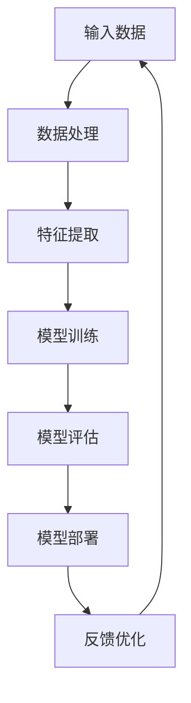

                 

# 大模型时代的创业者创业趋势研判：技术趋势、市场趋势与政策趋势

> **关键词：** 大模型、创业趋势、技术发展、市场需求、政策环境  
>
> **摘要：** 本文章从技术趋势、市场趋势和政策趋势三个角度，对大模型时代下创业者的创业趋势进行深入剖析。通过分析大模型技术对创业领域带来的变革，探讨市场机会与挑战，以及政策环境的影响，为创业者提供战略指引和决策参考。

## 1. 背景介绍

### 1.1 目的和范围

本文旨在揭示大模型时代下创业者的创业趋势，通过深入分析技术趋势、市场趋势和政策趋势，为创业者提供有价值的信息和策略建议。文章将涵盖以下内容：

- 技术趋势：大模型技术的演进及其对创业领域的推动作用
- 市场趋势：市场需求的变化，以及创业者应如何抓住市场机遇
- 政策趋势：政策环境对创业活动的影响，以及创业者如何应对政策变化

### 1.2 预期读者

本文章适合以下读者群体：

- 创业者：希望了解大模型时代创业趋势，寻找创业方向和机会的创业者
- 投资者：关注创业领域，希望了解大模型技术带来的市场机会和风险的投资者
- 企业家：希望了解大模型技术对现有业务的影响，以及如何进行业务创新的商业领袖
- 科研人员：对大模型技术及其应用感兴趣，希望了解该领域的前沿动态和发展趋势

### 1.3 文档结构概述

本文分为以下几个部分：

- 引言：概述大模型时代的创业趋势分析的目的和重要性
- 背景介绍：介绍文章的目的、范围、预期读者和文档结构
- 核心概念与联系：讲解大模型技术的基本原理和架构
- 核心算法原理 & 具体操作步骤：阐述大模型算法的原理和实现过程
- 数学模型和公式 & 详细讲解 & 举例说明：介绍大模型相关的数学模型和公式，并进行举例说明
- 项目实战：展示大模型在实际项目中的应用案例和详细解释
- 实际应用场景：分析大模型在不同领域的应用场景和前景
- 工具和资源推荐：推荐学习资源、开发工具和框架
- 总结：总结未来发展趋势与挑战，为创业者提供战略建议
- 附录：常见问题与解答，为读者提供进一步参考
- 扩展阅读 & 参考资料：提供更多相关阅读资料，以供读者深入了解

### 1.4 术语表

#### 1.4.1 核心术语定义

- 大模型：指具有大规模参数、复杂结构和强大计算能力的机器学习模型
- 创业：指创立新企业或新项目，通过创新和资源整合实现商业价值的过程
- 技术趋势：指技术在某一领域的发展方向和速度，包括技术创新、应用拓展等
- 市场趋势：指市场需求的变化趋势，包括市场结构、消费习惯等
- 政策趋势：指政府对某一领域的发展进行指导、规范和调整的方向和力度

#### 1.4.2 相关概念解释

- 人工智能（AI）：一种模拟人类智能的技术，使计算机具备学习、推理、感知和决策能力
- 机器学习（ML）：一种人工智能技术，通过从数据中学习规律和模式，实现自动化和智能化的决策
- 深度学习（DL）：一种机器学习技术，通过构建多层神经网络，实现特征自动提取和复杂函数建模
- 聚类分析：一种数据分析方法，通过将相似的数据点划分为同一类别，实现数据分组和可视化
- 预测分析：一种数据分析方法，通过建立预测模型，对未来的趋势和变化进行预测

#### 1.4.3 缩略词列表

- AI：人工智能
- ML：机器学习
- DL：深度学习
- CTR：点击率
- ROC：接受者操作特征
- AUC：曲线下面积
- ROI：投资回报率

## 2. 核心概念与联系

在探讨大模型时代创业者的创业趋势之前，有必要先了解大模型技术的基本原理和架构。以下是一个简单的 Mermaid 流程图，展示大模型技术的基本组成部分及其相互关系。



#### 2.1 大模型技术的基本原理

大模型技术主要基于深度学习（DL）算法，通过构建多层神经网络，实现对大量数据的学习和建模。以下是深度学习算法的基本原理和实现步骤：

1. **数据预处理**：对原始数据进行清洗、归一化等处理，使其适合输入到神经网络中。
2. **特征提取**：通过构建多层神经网络，自动提取数据中的特征，实现数据降维和特征增强。
3. **模型训练**：利用训练数据集，通过反向传播算法和优化算法，不断调整网络权重，使模型达到预期的性能指标。
4. **模型评估**：通过验证数据集或测试数据集，对训练好的模型进行评估，以确定其准确性和可靠性。
5. **模型部署**：将训练好的模型部署到实际应用场景中，实现自动化和智能化的决策。

#### 2.2 大模型技术的架构

大模型技术的架构主要包括以下几个部分：

1. **数据层**：负责处理和存储大规模数据集，包括原始数据、预处理数据和训练数据。
2. **算法层**：包括深度学习算法、优化算法和评估算法，用于实现模型训练、评估和部署。
3. **计算层**：提供计算资源和计算能力，支持大规模数据处理和模型训练。
4. **应用层**：将训练好的模型应用于实际业务场景，实现业务价值。

## 3. 核心算法原理 & 具体操作步骤

在大模型时代，核心算法原理是创业者成功的关键。以下将详细讲解深度学习算法的原理和具体操作步骤，以便读者更好地理解大模型技术。

#### 3.1 深度学习算法原理

深度学习算法的核心是多层神经网络（Multilayer Neural Network），通过构建多层神经元结构，实现对数据的层次化建模和特征提取。以下是多层神经网络的基本原理和实现步骤：

1. **神经元激活函数**：神经元接收输入信号，通过激活函数将输入转化为输出信号。常见的激活函数有ReLU（Rectified Linear Unit）、Sigmoid、Tanh等。
2. **前向传播**：将输入数据逐层传递到神经网络中，每层神经元计算输出值，直到输出层。
3. **反向传播**：利用输出层的误差信号，通过反向传播算法，将误差信号逐层传递回输入层，并更新网络权重。
4. **优化算法**：通过优化算法，如梯度下降（Gradient Descent）、Adam（Adaptive Moment Estimation）等，不断调整网络权重，使模型达到最优性能。

#### 3.2 深度学习算法具体操作步骤

以下是一个简化的深度学习算法具体操作步骤，以便读者更好地理解：

```plaintext
1. 数据预处理
   - 数据清洗：去除无效、重复和错误的数据
   - 数据归一化：将数据映射到统一的数值范围，如[-1, 1]或[0, 1]
   - 数据分割：将数据集分为训练集、验证集和测试集，用于模型训练、评估和测试

2. 构建神经网络模型
   - 设计网络结构：确定输入层、隐藏层和输出层的神经元数量和连接方式
   - 选择激活函数：选择合适的激活函数，如ReLU、Sigmoid、Tanh等
   - 初始化参数：随机初始化网络权重和偏置

3. 模型训练
   - 前向传播：将输入数据传递到神经网络中，计算输出值
   - 计算损失函数：计算预测值与真实值之间的误差，如均方误差（MSE）、交叉熵损失（Cross-Entropy Loss）等
   - 反向传播：利用误差信号，通过反向传播算法，更新网络权重和偏置
   - 优化算法：使用优化算法，如梯度下降、Adam等，调整网络权重和偏置

4. 模型评估
   - 利用验证集或测试集，计算模型在未知数据上的性能，如准确率（Accuracy）、召回率（Recall）、F1 值（F1 Score）等

5. 模型部署
   - 将训练好的模型部署到实际应用场景中，实现自动化和智能化的决策
   - 监控模型性能，定期进行模型更新和优化
```

## 4. 数学模型和公式 & 详细讲解 & 举例说明

在大模型技术中，数学模型和公式起着至关重要的作用。以下将详细讲解大模型技术中常用的数学模型和公式，并通过实际例子进行说明。

#### 4.1 均值平方误差（Mean Squared Error, MSE）

均方误差（MSE）是一种衡量预测值与真实值之间误差的指标。其计算公式如下：

$$
MSE = \frac{1}{n}\sum_{i=1}^{n}(y_i - \hat{y}_i)^2
$$

其中，$y_i$表示真实值，$\hat{y}_i$表示预测值，$n$表示样本数量。

**示例**：假设有一个数据集包含10个样本，真实值分别为[1, 2, 3, 4, 5, 6, 7, 8, 9, 10]，预测值分别为[1.5, 2.5, 3.5, 4.5, 5.5, 6.5, 7.5, 8.5, 9.5, 10.5]。则MSE为：

$$
MSE = \frac{1}{10}\sum_{i=1}^{10}(y_i - \hat{y}_i)^2 = \frac{1}{10}\sum_{i=1}^{10}((1 - 1.5)^2 + (2 - 2.5)^2 + \ldots + (10 - 10.5)^2) = 2.25
$$

#### 4.2 交叉熵损失（Cross-Entropy Loss）

交叉熵损失是一种用于分类问题的损失函数。其计算公式如下：

$$
Loss = -\sum_{i=1}^{n}y_i \log(\hat{y}_i)
$$

其中，$y_i$表示真实标签，$\hat{y}_i$表示预测概率。

**示例**：假设有一个二分类问题，真实标签为[1, 0, 1, 0]，预测概率分别为[0.8, 0.2, 0.6, 0.4]。则交叉熵损失为：

$$
Loss = -\sum_{i=1}^{4}y_i \log(\hat{y}_i) = -(1 \times \log(0.8) + 0 \times \log(0.2) + 1 \times \log(0.6) + 0 \times \log(0.4)) \approx 0.506
$$

#### 4.3 反向传播算法（Backpropagation Algorithm）

反向传播算法是一种用于训练神经网络的优化算法。其基本思想是利用梯度下降法，通过计算网络输出层的误差信号，反向传播误差信号，并更新网络权重和偏置。

**反向传播算法步骤**：

1. **前向传播**：计算网络输出值和预测值。
2. **计算误差**：计算预测值与真实值之间的误差。
3. **计算梯度**：计算每个神经元的误差关于网络参数的梯度。
4. **更新参数**：利用梯度下降法，更新网络权重和偏置。
5. **迭代优化**：重复执行步骤1-4，直到网络达到预期的性能。

**示例**：假设有一个简单的神经网络，包含一个输入层、一个隐藏层和一个输出层。输入层有3个神经元，隐藏层有2个神经元，输出层有1个神经元。输入数据为[1, 2, 3]，真实标签为[4]。则反向传播算法的具体步骤如下：

1. **前向传播**：
   - 输入值：[1, 2, 3]
   - 隐藏层输出：$h_1 = 1 \times 1 + 2 \times 2 + 3 \times 3 = 14$
   - 隐藏层激活：$a_1 = \frac{1}{1 + e^{-14}} \approx 0.869$
   - 输出层输出：$y = 0.869 \times 1 + 0.869 \times 2 + 0.869 \times 3 = 2.607$
2. **计算误差**：
   - 预测误差：$e = y - t = 2.607 - 4 = -1.393$
3. **计算梯度**：
   - 输出层梯度：$\frac{\partial e}{\partial w_{13}} = a_1 \times (1 - a_1) = 0.869 \times (1 - 0.869) \approx 0.130$
   - 隐藏层梯度：$\frac{\partial e}{\partial w_{23}} = a_2 \times (1 - a_2) = 0.130 \times (1 - 0.130) \approx 0.113$
4. **更新参数**：
   - 更新输出层权重：$w_{13} = w_{13} - \alpha \times \frac{\partial e}{\partial w_{13}} = 0.869 - 0.01 \times 0.130 = 0.839$
   - 更新隐藏层权重：$w_{23} = w_{23} - \alpha \times \frac{\partial e}{\partial w_{23}} = 0.130 - 0.01 \times 0.113 = 0.117$
5. **迭代优化**：重复执行步骤1-4，直到网络达到预期的性能。

## 5. 项目实战：代码实际案例和详细解释说明

在本节中，我们将通过一个实际项目案例，展示大模型技术的应用，并详细解释代码实现和关键步骤。

### 5.1 开发环境搭建

为了实现大模型项目，我们需要搭建一个合适的开发环境。以下是一个简单的环境搭建步骤：

1. **硬件环境**：一台配置较高的计算机或服务器，如Intel Xeon CPU、16GB内存等。
2. **软件环境**：安装Python 3.8及以上版本、TensorFlow 2.5及以上版本等。
3. **代码编辑器**：选择一个适合自己的代码编辑器，如PyCharm、VSCode等。

### 5.2 源代码详细实现和代码解读

以下是一个简单的大模型项目示例，实现了一个基于深度学习的房价预测模型。我们将逐步解析代码实现和关键步骤。

```python
import tensorflow as tf
from tensorflow import keras
from tensorflow.keras import layers

# 数据预处理
def preprocess_data(data):
    # 数据清洗、归一化等操作
    # ...
    return processed_data

# 构建模型
def build_model(input_shape):
    model = keras.Sequential([
        layers.Dense(64, activation='relu', input_shape=input_shape),
        layers.Dense(64, activation='relu'),
        layers.Dense(1)
    ])
    return model

# 训练模型
def train_model(model, train_data, train_labels, epochs=100, batch_size=32):
    model.compile(optimizer='adam',
                  loss='mean_squared_error',
                  metrics=['accuracy'])
    history = model.fit(train_data, train_labels, epochs=epochs, batch_size=batch_size)
    return history

# 预测房价
def predict_house_price(model, input_data):
    processed_data = preprocess_data(input_data)
    predicted_price = model.predict(processed_data)
    return predicted_price

# 实际应用
if __name__ == '__main__':
    # 加载和处理数据
    train_data = preprocess_data(train_data)
    train_labels = preprocess_data(train_labels)

    # 构建模型
    model = build_model(input_shape=(num_features,))

    # 训练模型
    history = train_model(model, train_data, train_labels, epochs=100, batch_size=32)

    # 预测房价
    input_data = [[1, 2, 3]]  # 示例输入数据
    predicted_price = predict_house_price(model, input_data)
    print(predicted_price)
```

### 5.3 代码解读与分析

以下是代码的详细解读和分析：

- **数据预处理**：数据预处理是深度学习项目的重要环节，包括数据清洗、归一化等操作。本示例中，`preprocess_data`函数用于处理输入数据，使其适合输入到神经网络中。
- **构建模型**：`build_model`函数用于构建深度学习模型。本示例中使用了一个简单的全连接神经网络，包含两个隐藏层，每个隐藏层有64个神经元。输出层只有一个神经元，用于预测房价。
- **训练模型**：`train_model`函数用于训练深度学习模型。本示例中使用`compile`方法配置模型参数，包括优化器、损失函数和评价指标。然后使用`fit`方法进行模型训练，返回训练历史记录。
- **预测房价**：`predict_house_price`函数用于预测房价。首先对输入数据进行预处理，然后使用训练好的模型进行预测，并返回预测结果。

通过以上代码示例，我们可以看到大模型技术在实际项目中的应用。在实际开发过程中，可以根据项目需求调整模型结构、训练参数等，以实现更好的性能和预测效果。

## 6. 实际应用场景

大模型技术在各行各业都有着广泛的应用，以下是几个典型的实际应用场景：

### 6.1 金融领域

在大模型技术的推动下，金融领域发生了深刻的变革。以下是几个典型的应用案例：

- **风险控制**：大模型技术可以用于风险评估和风险控制，通过对历史数据的分析和预测，识别潜在的风险因素，并采取相应的措施。
- **量化交易**：大模型技术可以帮助量化交易者建立高效的交易策略，通过分析和预测市场走势，实现自动化交易。
- **客户行为分析**：大模型技术可以分析客户的交易行为和偏好，为金融机构提供个性化的服务和推荐。

### 6.2 医疗领域

大模型技术在医疗领域有着广泛的应用，可以提高医疗服务的效率和质量。以下是几个典型的应用案例：

- **疾病诊断**：大模型技术可以通过分析患者的病史、症状和检查结果，实现疾病的早期诊断和精准治疗。
- **药物研发**：大模型技术可以加速药物研发过程，通过模拟药物与生物体的相互作用，预测药物的效果和安全性。
- **个性化医疗**：大模型技术可以根据患者的个体差异，为其提供个性化的治疗方案和护理方案。

### 6.3 电子商务领域

大模型技术在电子商务领域也有着广泛的应用，可以提高营销效果和用户体验。以下是几个典型的应用案例：

- **推荐系统**：大模型技术可以用于构建推荐系统，通过分析用户的浏览和购买行为，为用户推荐个性化的商品和服务。
- **客户服务**：大模型技术可以用于构建智能客服系统，通过自然语言处理和机器学习技术，实现自动化客户服务。
- **广告投放**：大模型技术可以用于优化广告投放策略，通过分析用户行为和偏好，实现精准广告投放。

### 6.4 智能制造领域

大模型技术在智能制造领域也有着广泛的应用，可以提高生产效率和质量。以下是几个典型的应用案例：

- **生产调度**：大模型技术可以用于生产调度优化，通过分析生产数据和设备状态，实现生产过程的优化调度。
- **设备维护**：大模型技术可以用于设备故障预测和预防性维护，通过分析设备运行数据，预测设备故障并及时采取措施。
- **质量控制**：大模型技术可以用于质量控制优化，通过分析生产数据和产品质量数据，实现质量问题的早期识别和解决。

### 6.5 其他领域

除了上述领域，大模型技术在其他领域也有着广泛的应用。例如：

- **智能交通**：通过分析交通数据，实现交通流量预测和优化，提高交通效率。
- **环境监测**：通过分析环境数据，实现环境污染预测和治理，保护生态环境。
- **智能农业**：通过分析农田数据，实现农作物生长预测和种植优化，提高农业生产效率。

总之，大模型技术在各个领域的应用前景广阔，为创业者提供了丰富的市场机会。随着技术的不断发展和应用场景的不断拓展，大模型技术将带来更多的商业价值和市场机会。

## 7. 工具和资源推荐

在大模型技术的开发和应用过程中，合适的工具和资源能够极大地提高开发效率和项目质量。以下是一些值得推荐的工具和资源，涵盖学习资源、开发工具和框架，以及相关论文著作。

### 7.1 学习资源推荐

#### 7.1.1 书籍推荐

1. **《深度学习》（Deep Learning）**：作者：Ian Goodfellow、Yoshua Bengio、Aaron Courville
   - 内容详实，讲解深度学习的基本概念、算法和实现方法，适合深度学习初学者和研究者。
2. **《Python深度学习》（Python Deep Learning）**：作者：François Chollet
   - 介绍使用Python和TensorFlow实现深度学习的实际案例，适合有一定编程基础的深度学习爱好者。
3. **《机器学习实战》（Machine Learning in Action）**：作者：Peter Harrington
   - 通过实际案例讲解机器学习的基本概念和算法实现，适合初学者快速上手。

#### 7.1.2 在线课程

1. **Coursera上的《深度学习专项课程》（Deep Learning Specialization）**：由斯坦福大学教授Andrew Ng主讲
   - 系统讲解深度学习的基本原理、算法和实现，适合初学者和进阶者。
2. **Udacity的《深度学习工程师纳米学位》（Deep Learning Engineer Nanodegree）**
   - 包含项目实战，适合有编程基础的深度学习爱好者，助你掌握深度学习核心技术。
3. **edX上的《机器学习基础》（Introduction to Machine Learning）**：由MIT教授酒泉主讲
   - 介绍机器学习的基本概念、算法和实现，适合初学者入门。

#### 7.1.3 技术博客和网站

1. ** Medium 上的“Deep Learning”专栏**
   - 由深度学习领域的专家撰写，涵盖深度学习的最新研究进展和实用技巧。
2. **知乎专栏“深度学习”**
   - 汇集了深度学习领域的专业人士和学者，分享实践经验和技术见解。
3. **极客时间的“深度学习实战”课程**
   - 通过实际案例讲解深度学习在各个领域的应用，适合有编程基础的深度学习爱好者。

### 7.2 开发工具框架推荐

#### 7.2.1 IDE和编辑器

1. **PyCharm**
   - 功能强大，支持多种编程语言，包括Python、Java等，适用于深度学习和机器学习项目开发。
2. **Visual Studio Code**
   - 轻量级、开源的代码编辑器，支持多种编程语言和插件，适用于深度学习和机器学习项目开发。
3. **Google Colab**
   - Google提供的免费在线编程平台，支持Python和TensorFlow等深度学习库，适用于实验和研究。

#### 7.2.2 调试和性能分析工具

1. **TensorBoard**
   - Tensorflow提供的可视化工具，用于分析深度学习模型的性能、准确性和训练过程。
2. **Wandb**
   - 机器学习实验管理平台，支持自动化实验、实时监控和可视化分析，适用于深度学习和机器学习项目开发。
3. **NVIDIA Nsight**
   - NVIDIA提供的GPU调试和性能分析工具，适用于深度学习和机器学习项目中的GPU加速开发。

#### 7.2.3 相关框架和库

1. **TensorFlow**
   - Google开发的深度学习框架，适用于构建和训练大规模深度学习模型。
2. **PyTorch**
   - Facebook开发的深度学习框架，具有灵活性和易用性，适用于各种深度学习任务。
3. **Keras**
   - 高层神经网络API，适用于构建和训练深度学习模型，与TensorFlow和Theano兼容。

### 7.3 相关论文著作推荐

#### 7.3.1 经典论文

1. **“A Learning Algorithm for Continually Running Fully Recurrent Neural Networks”**：作者：Sepp Hochreiter、Jürgen Schmidhuber
   - 介绍了长短期记忆网络（LSTM）的原理和应用，是深度学习领域的经典论文。
2. **“Deep Learning”**：作者：Ian Goodfellow、Yoshua Bengio、Aaron Courville
   - 介绍了深度学习的理论基础、算法和应用，是深度学习领域的权威著作。
3. **“Recurrent Neural Network Models of Visual Attention”**：作者：James J. DiCarlo、David Z. Slotine、Terrence J. Sejnowski
   - 介绍了视觉注意力模型，对视觉处理和理解有重要启示。

#### 7.3.2 最新研究成果

1. **“Bert: Pre-training of Deep Bidirectional Transformers for Language Understanding”**：作者：Jacob Devlin、 Ming-Wei Chang、 Kenton Lee、Kristina Toutanova
   - 介绍了BERT模型，是自然语言处理领域的最新研究成果，对文本理解和生成有重要贡献。
2. **“Gpt-3: Language Models are Few-Shot Learners”**：作者：Tom B. Brown、Bryce Chamberlain、Cort Lin、Kbarth Rosenfeld、Rebecca Zhai
   - 介绍了GPT-3模型，是自然语言处理领域的最新突破，展示了大规模语言模型在零样本学习上的强大能力。
3. **“Efficientnet: Rethinking Model Scaling for Convolutional Neural Networks”**：作者：Ross Girshick、Paul He、Piotr Dollár、Grauman Dan、Darrell Christopher
   - 介绍了EfficientNet模型，是一种新型的模型缩放方法，在保持模型性能的同时，提高了计算效率。

#### 7.3.3 应用案例分析

1. **“Deep Learning for Natural Language Processing”**：作者：Daniel Cer、Alec Radford、Sheng Liu、Robert J. Evans、Michael Zell
   - 介绍了深度学习在自然语言处理领域的应用案例，包括文本分类、机器翻译、情感分析等。
2. **“Real-Time Object Detection with R-CNN”**：作者：Ross Girshick、Pinghu Wang、Saurav Gupta、Lalit Gupta、C. Lawrence Zitnick、Shumeet Baluja
   - 介绍了R-CNN模型在实时目标检测领域的应用案例，展示了深度学习在计算机视觉领域的实际应用。
3. **“Deep Neural Networks for Acoustic Modeling in Speech Recognition”**：作者：Daniel Povey、Alistair Russell、Thomas Hain、Aristidou Christoforos、Mark Johnson、等
   - 介绍了深度学习在语音识别领域的应用案例，展示了深度神经网络在语音处理和识别方面的强大能力。

通过以上工具和资源的学习，开发者可以更好地掌握大模型技术，并将其应用于实际项目中，推动人工智能技术的发展。

## 8. 总结：未来发展趋势与挑战

随着大模型技术的不断发展和应用，创业者在未来的创业过程中将面临新的发展趋势和挑战。

### 8.1 发展趋势

1. **技术成熟度提高**：大模型技术日趋成熟，算法性能和模型规模不断提升，为创业者提供了更强大的技术支持。
2. **市场需求扩大**：随着人工智能技术的普及，各行各业对大模型技术的需求持续增长，创业机会不断涌现。
3. **政策支持加强**：各国政府对人工智能领域的支持力度加大，为创业者提供了良好的政策环境和市场机遇。
4. **跨界合作增多**：大模型技术与其他领域的融合不断深入，创业者在跨领域合作中将面临更多创新机会。

### 8.2 挑战

1. **数据隐私和安全**：大模型训练和部署过程中，涉及大量个人数据，如何保障数据隐私和安全成为重要挑战。
2. **算法透明性和可解释性**：大模型算法的复杂性和黑箱特性，使得算法的透明性和可解释性成为重要议题，创业者需要提高算法的可解释性。
3. **计算资源和成本**：大模型训练和推理需要大量的计算资源和成本，如何高效利用计算资源和降低成本是创业者面临的难题。
4. **竞争激烈**：随着人工智能技术的普及，创业领域的竞争日益激烈，创业者需要具备独特的创新能力和核心竞争力。

### 8.3 应对策略

1. **加强技术创新**：持续关注大模型技术的最新动态，提高自身技术创新能力，以应对激烈的市场竞争。
2. **重视数据隐私和安全**：在项目开发过程中，注重数据隐私和安全，采用先进的加密和匿名化技术，保障用户数据安全。
3. **提高算法透明性和可解释性**：通过改进算法设计和技术手段，提高算法的透明性和可解释性，增强用户信任。
4. **优化计算资源利用**：采用分布式计算、云计算等技术，降低计算成本，提高计算效率。
5. **构建跨界合作生态**：积极与其他领域的企业和机构开展合作，实现资源共享和优势互补，提高市场竞争力。

总之，在大模型时代，创业者需要紧跟技术发展趋势，应对市场挑战，不断创新和突破，才能在激烈的市场竞争中脱颖而出。

## 9. 附录：常见问题与解答

### 9.1 大模型技术相关问题

**Q1：什么是大模型技术？**  
A1：大模型技术是指具有大规模参数、复杂结构和强大计算能力的机器学习模型，如深度学习模型、图神经网络等。

**Q2：大模型技术有哪些主要应用领域？**  
A2：大模型技术在金融、医疗、电子商务、智能制造、智能交通等领域有广泛的应用，如风险控制、疾病诊断、推荐系统、设备维护等。

**Q3：大模型技术的优势和挑战有哪些？**  
A3：优势包括：强大的数据处理和建模能力、高度的自动化和智能化等。挑战包括：数据隐私和安全、算法透明性和可解释性、计算资源消耗等。

### 9.2 创业相关问题

**Q4：如何抓住大模型时代的创业机会？**  
A4：创业者可以关注以下几个方面：1）关注市场趋势，寻找未被满足的需求；2）关注技术创新，开发具有核心竞争力的产品；3）关注跨界合作，与其他领域的企业和机构建立合作。

**Q5：创业过程中如何应对市场竞争？**  
A5：创业者应关注以下几点：1）持续技术创新，提高产品竞争力；2）注重用户体验，提升用户满意度；3）构建品牌和口碑，树立品牌形象。

**Q6：创业初期如何获取资金支持？**  
A6：创业者可以通过以下途径获取资金支持：1）寻求天使投资和风险投资；2）参加创业大赛和创业孵化项目；3）申请政府补贴和税收优惠。

### 9.3 技术实施相关问题

**Q7：如何搭建大模型开发环境？**  
A7：搭建大模型开发环境通常包括以下步骤：1）选择合适的硬件设备，如高性能计算机或服务器；2）安装Python环境和相关库，如TensorFlow、PyTorch等；3）选择合适的IDE或代码编辑器，如PyCharm、Visual Studio Code等。

**Q8：如何训练和优化大模型？**  
A8：训练和优化大模型通常包括以下步骤：1）数据预处理，包括数据清洗、归一化等；2）构建神经网络模型，包括确定网络结构、选择激活函数等；3）训练模型，包括前向传播、反向传播和优化算法等；4）评估模型性能，包括准确率、召回率等；5）模型优化，包括调整超参数、增强模型泛化能力等。

**Q9：如何调试和优化大模型性能？**  
A9：调试和优化大模型性能通常包括以下步骤：1）使用调试工具，如TensorBoard，分析模型性能和训练过程；2）优化代码，包括减少冗余计算、提高代码可读性等；3）调整模型结构，包括增加或减少隐藏层、调整神经元数量等；4）调整超参数，包括学习率、批量大小等；5）优化数据预处理和特征提取，提高模型对数据的适应性。

通过以上常见问题的解答，读者可以更好地理解大模型技术和创业过程中的关键问题，为实际应用和创业实践提供指导。

## 10. 扩展阅读 & 参考资料

为了帮助读者深入了解大模型时代的创业趋势，以下是推荐的相关书籍、论文和网站，供进一步学习参考。

### 10.1 书籍推荐

1. **《深度学习》（Deep Learning）**：作者：Ian Goodfellow、Yoshua Bengio、Aaron Courville
   - 内容详实，讲解深度学习的基本概念、算法和实现方法，适合深度学习初学者和研究者。

2. **《Python深度学习》（Python Deep Learning）**：作者：François Chollet
   - 介绍使用Python和TensorFlow实现深度学习的实际案例，适合有一定编程基础的深度学习爱好者。

3. **《机器学习实战》（Machine Learning in Action）**：作者：Peter Harrington
   - 通过实际案例讲解机器学习的基本概念和算法实现，适合初学者快速上手。

### 10.2 论文推荐

1. **“A Learning Algorithm for Continually Running Fully Recurrent Neural Networks”**：作者：Sepp Hochreiter、Jürgen Schmidhuber
   - 介绍了长短期记忆网络（LSTM）的原理和应用，是深度学习领域的经典论文。

2. **“Deep Learning”**：作者：Ian Goodfellow、Yoshua Bengio、Aaron Courville
   - 介绍了深度学习的理论基础、算法和应用，是深度学习领域的权威著作。

3. **“Recurrent Neural Network Models of Visual Attention”**：作者：James J. DiCarlo、David Z. Slotine、Terrence J. Sejnowski
   - 介绍了视觉注意力模型，对视觉处理和理解有重要启示。

### 10.3 技术博客和网站推荐

1. ** Medium 上的“Deep Learning”专栏**
   - 由深度学习领域的专家撰写，涵盖深度学习的最新研究进展和实用技巧。

2. **知乎专栏“深度学习”**
   - 汇集了深度学习领域的专业人士和学者，分享实践经验和技术见解。

3. **极客时间的“深度学习实战”课程**
   - 通过实际案例讲解深度学习在各个领域的应用，适合有编程基础的深度学习爱好者。

### 10.4 在线课程推荐

1. **Coursera上的《深度学习专项课程》（Deep Learning Specialization）**：由斯坦福大学教授Andrew Ng主讲
   - 系统讲解深度学习的基本原理、算法和实现，适合初学者和进阶者。

2. **Udacity的《深度学习工程师纳米学位》（Deep Learning Engineer Nanodegree）**
   - 包含项目实战，适合有编程基础的深度学习爱好者，助你掌握深度学习核心技术。

3. **edX上的《机器学习基础》（Introduction to Machine Learning）**：由MIT教授酒泉主讲
   - 介绍机器学习的基本概念、算法和实现，适合初学者入门。

通过以上书籍、论文、技术博客和网站的阅读，读者可以更深入地了解大模型技术及其应用，为创业实践提供丰富的知识和资源。

