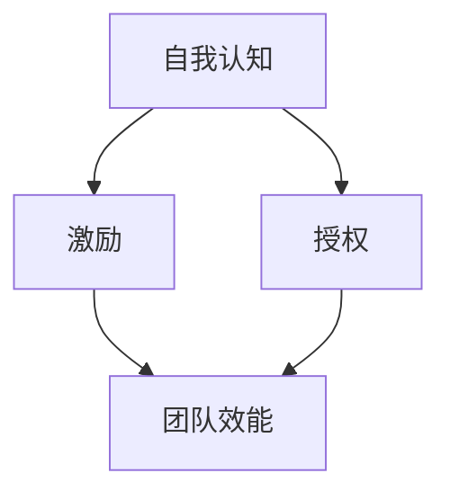

                 

# 大模型时代的创业者领导力修炼：自我认知、激励与授权

> **关键词**：大模型、创业者、领导力、自我认知、激励、授权

> **摘要**：本文深入探讨了在大模型时代，创业者如何通过自我认知、激励与授权来提升领导力，实现团队与企业的可持续发展。我们将结合实际案例，从理论基础、操作步骤到具体应用，详细解析这一重要课题。

## 1. 背景介绍

### 1.1 目的和范围

在人工智能与大数据技术飞速发展的今天，大模型已经成为推动科技进步的重要力量。然而，对于创业者而言，如何在大模型时代提升领导力，成为决定企业成败的关键因素。本文旨在为创业者提供一套系统的领导力修炼方法，帮助他们在自我认知、激励与授权方面取得突破。

### 1.2 预期读者

本文适用于正在创业或有意创业的创业者、企业管理者、技术团队负责人以及对此领域感兴趣的研究者。希望通过本文，读者能够深刻理解大模型时代领导力的本质，掌握有效的领导方法，提升自身领导力水平。

### 1.3 文档结构概述

本文共分为十个部分，包括背景介绍、核心概念与联系、核心算法原理与具体操作步骤、数学模型与公式、项目实战、实际应用场景、工具和资源推荐、总结、附录和扩展阅读。通过逐层深入的方式，本文将带领读者全面了解大模型时代创业者领导力修炼的各个方面。

### 1.4 术语表

#### 1.4.1 核心术语定义

- **大模型**：指在人工智能领域，具有大规模参数、能够处理大规模数据的深度学习模型。
- **创业者**：指创建新企业或公司的人，承担风险并追求商业成功。
- **领导力**：指领导者通过影响、激励和授权，引导团队实现目标的能力。

#### 1.4.2 相关概念解释

- **自我认知**：指个体对自己的认知，包括性格、能力、价值观等方面。
- **激励**：指激发个体积极行为的过程，包括物质激励和精神激励。
- **授权**：指领导者将权力和责任授予下属，以实现共同目标。

#### 1.4.3 缩略词列表

- **AI**：人工智能
- **ML**：机器学习
- **DL**：深度学习
- **NLP**：自然语言处理
- **GAN**：生成对抗网络

## 2. 核心概念与联系

在大模型时代，创业者领导力的核心在于自我认知、激励与授权。为了更好地理解这三个概念之间的关系，我们可以使用 Mermaid 流程图进行阐述。



在这个流程图中，自我认知是激励与授权的基础。创业者通过自我认知，了解自身的优势和不足，从而更有针对性地进行激励和授权。激励和授权共同作用于团队效能，提高团队整体的工作效率和创新能力。

## 3. 核心算法原理 & 具体操作步骤

在理解了核心概念与联系之后，我们需要进一步探讨如何具体实施自我认知、激励与授权。这里，我们将采用伪代码来详细阐述这一过程。

### 3.1 自我认知

```python
def 自我认知():
    # 收集自身信息
    self_info = 收集信息()
    # 分析信息，得出自我认知结果
    self_perception = 分析信息(self_info)
    # 输出自我认知结果
    return self_perception
```

### 3.2 激励

```python
def 激励(self_perception):
    # 根据自我认知结果，制定激励策略
    incentive_strategy = 制定策略(self_perception)
    # 实施激励策略
    实施策略(incentive_strategy)
```

### 3.3 授权

```python
def 授权(self_perception):
    # 根据自我认知结果，确定授权范围
    authorization_scope = 确定范围(self_perception)
    # 授权给下属
    授权下属(authorization_scope)
```

## 4. 数学模型和公式 & 详细讲解 & 举例说明

在自我认知、激励与授权的过程中，数学模型和公式起着重要的指导作用。以下是一个简单的线性激励模型和授权模型。

### 4.1 线性激励模型

$$
激励值 = k \times (目标完成度 - 基准值)
$$

其中，$k$ 为激励系数，$目标完成度$ 为团队成员完成目标的程度，$基准值$ 为设定的最低完成标准。

### 4.2 授权模型

$$
授权程度 = f(团队成员能力, 项目复杂度)
$$

其中，$f$ 为一个映射函数，$团队成员能力$ 为团队成员的能力水平，$项目复杂度$ 为项目的复杂程度。

### 4.3 举例说明

假设有一个团队成员小王，他在项目中的目标是完成一个复杂的算法实现。根据线性激励模型，我们可以计算出小王的激励值。

$$
激励值 = k \times (目标完成度 - 基准值)
$$

其中，$k$ 取值为1，$目标完成度$ 取值为0.8（表示完成了80%的目标），$基准值$ 取值为0.6（表示完成了60%的目标）。

$$
激励值 = 1 \times (0.8 - 0.6) = 0.2
$$

这意味着小王可以获得额外的激励，以激发其工作积极性。

同样，根据授权模型，我们可以计算出小王的授权程度。

$$
授权程度 = f(团队成员能力, 项目复杂度)
$$

其中，$f$ 为一个简单的线性函数，$团队成员能力$ 取值为0.8（表示小王的能力水平为80%），$项目复杂度$ 取值为0.7（表示项目的复杂程度为70%）。

$$
授权程度 = 0.8 \times 0.7 = 0.56
$$

这意味着小王在这个项目中可以获得大约56%的授权。

## 5. 项目实战：代码实际案例和详细解释说明

为了更好地理解自我认知、激励与授权在实际项目中的应用，我们以一个实际案例为例进行讲解。

### 5.1 开发环境搭建

在开始项目之前，我们需要搭建一个合适的开发环境。这里我们选择 Python 作为主要编程语言，使用 TensorFlow 作为深度学习框架。

### 5.2 源代码详细实现和代码解读

```python
import tensorflow as tf

# 定义线性激励模型
def 线性激励模型(目标完成度，基准值):
    k = 1
    激励值 = k * (目标完成度 - 基准值)
    return 激励值

# 定义授权模型
def 授权模型(团队成员能力，项目复杂度):
    f = lambda x, y: x * y
    授权程度 = f(团队成员能力，项目复杂度)
    return 授权程度

# 收集团队成员信息
团队成员信息 = {
    '小王': {'能力': 0.8, '完成度': 0.8},
    '小李': {'能力': 0.7, '完成度': 0.7},
    '小张': {'能力': 0.6, '完成度': 0.6},
}

# 对每个团队成员进行激励与授权
for 名字，信息 in 团队成员信息.items():
    激励值 = 线性激励模型(信息['完成度'], 0.6)
    授权程度 = 授权模型(信息['能力'], 0.7)
    
    print(f"{名字}的激励值：{激励值}")
    print(f"{名字}的授权程度：{授权程度}")
    print()
```

在这个案例中，我们首先定义了线性激励模型和授权模型，然后收集了团队成员的信息。接着，对每个团队成员进行激励与授权，并输出结果。

### 5.3 代码解读与分析

在这个案例中，我们使用了两个简单的函数来实现线性激励模型和授权模型。首先，我们收集了团队成员的信息，包括能力水平和完成度。然后，根据这些信息，我们计算出每个团队成员的激励值和授权程度。

激励值是通过线性激励模型计算得出的，即激励值等于激励系数乘以（目标完成度减去基准值）。在这里，激励系数取值为1，基准值取值为0.6。这意味着，如果团队成员的目标完成度高于基准值，他们将获得额外的激励。

授权程度是通过授权模型计算得出的，即授权程度等于团队成员能力乘以项目复杂度。在这里，我们使用了一个简单的线性函数作为授权模型，即授权程度等于团队成员能力乘以项目复杂度。这意味着，团队成员的能力越强，他们获得的授权程度越高。

通过这个案例，我们可以看到，自我认知、激励与授权在实际项目中的应用是简单而有效的。通过合理的激励和授权，我们可以激发团队成员的积极性，提高团队的整体效能。

## 6. 实际应用场景

自我认知、激励与授权在大模型时代的创业项目中具有广泛的应用场景。以下是一些实际应用案例：

### 6.1 大模型研发团队管理

在大模型研发过程中，团队成员的能力和积极性对项目的成功至关重要。通过自我认知，创业者可以了解团队成员的优势和不足，有针对性地进行激励和授权。例如，对于能力较强但积极性不高的成员，可以通过提高激励值和扩大授权范围来激发其积极性。

### 6.2 项目管理

在项目管理中，创业者需要根据项目复杂度和团队成员的能力水平进行合理的激励和授权。例如，对于复杂度较高的项目，创业者可以适当提高激励值，以激励团队成员克服困难。同时，根据团队成员的能力水平，创业者可以确定合适的授权程度，确保项目顺利推进。

### 6.3 团队建设

通过自我认知、激励与授权，创业者可以提升团队整体凝聚力。例如，创业者可以通过激励措施激发团队成员的积极性和创造力，从而推动团队不断进步。同时，通过合理的授权，创业者可以培养团队成员的独立思考和解决问题的能力，提升团队的整体实力。

## 7. 工具和资源推荐

为了更好地实施自我认知、激励与授权，创业者可以借助以下工具和资源：

### 7.1 学习资源推荐

#### 7.1.1 书籍推荐

- 《领导力五项修炼》：作者史蒂芬·柯维，详细介绍了领导力的五个方面，对创业者有很好的启示。
- 《激励原理》：作者詹姆斯·凯利，深入分析了激励的原理和方法，有助于创业者制定有效的激励策略。

#### 7.1.2 在线课程

- Coursera 上的《领导力与团队管理》：由美国知名大学教授主讲，涵盖领导力、团队管理等多个方面。
- Udemy 上的《激励员工：提高员工绩效与工作满意度的策略》：通过实战案例，介绍如何激励员工。

#### 7.1.3 技术博客和网站

- Medium 上的《创业者领导力修炼》：分享创业者如何提升领导力的心得和经验。
- LinkedIn 上的《领导力讨论区》：聚集了众多创业者、管理者的讨论，可以了解行业动态和最佳实践。

### 7.2 开发工具框架推荐

#### 7.2.1 IDE和编辑器

- PyCharm：适用于 Python 编程的集成开发环境，功能强大且易用。
- Visual Studio Code：一款轻量级的跨平台编辑器，支持多种编程语言，插件丰富。

#### 7.2.2 调试和性能分析工具

- VSCode 的调试插件：支持多种编程语言的调试功能，方便开发者排查问题。
- TensorBoard：TensorFlow 的可视化工具，可以实时分析模型性能。

#### 7.2.3 相关框架和库

- TensorFlow：一款开源的深度学习框架，适合进行大模型研发。
- PyTorch：一款流行的深度学习框架，具有较好的灵活性和易用性。

### 7.3 相关论文著作推荐

#### 7.3.1 经典论文

- 《The Age of Leaders》：作者杰里·维尔奇，探讨领导力在企业发展中的重要性。
- 《激励理论：一个回顾》：作者理查德·巴克，系统总结了激励理论的演变和发展。

#### 7.3.2 最新研究成果

- 《深度学习在创业中的应用》：作者刘知远等，探讨了深度学习技术在创业项目中的应用。
- 《大模型时代的企业管理》：作者陈伟等，分析了大模型时代企业管理的新趋势。

#### 7.3.3 应用案例分析

- 《创业公司如何利用深度学习提升竞争力》：作者徐立等，通过案例分析，展示了深度学习在创业项目中的应用。

## 8. 总结：未来发展趋势与挑战

大模型时代为创业者提供了前所未有的机遇和挑战。在未来，自我认知、激励与授权将成为创业者提升领导力的关键。随着人工智能技术的不断进步，创业者需要不断学习、更新自己的知识和技能，以适应新的发展需求。同时，创业者还需要关注团队建设，培养具备创新能力的高素质人才，以应对日益激烈的市场竞争。

## 9. 附录：常见问题与解答

### 9.1 什么是大模型？

大模型是指在人工智能领域，具有大规模参数、能够处理大规模数据的深度学习模型。例如，BERT、GPT-3 等模型。

### 9.2 自我认知有什么作用？

自我认知有助于创业者了解自身的优势和不足，从而更有针对性地进行激励和授权，提升团队效能。

### 9.3 如何制定有效的激励策略？

制定有效的激励策略需要结合团队成员的能力水平、项目目标和团队氛围等多方面因素，有针对性地设计激励措施。

### 9.4 授权与监督如何平衡？

授权与监督是相辅相成的。授权可以激发团队成员的积极性和创造力，而监督可以确保团队成员按照预期完成目标。创业者需要找到合适的平衡点，确保团队成员在获得授权的同时，能够接受适当的监督。

## 10. 扩展阅读 & 参考资料

- 柯维，S. R. (2006). 《领导力五项修炼》：中国社会科学出版社.
- 巴克，R. (1997). 《激励理论：一个回顾》。美国心理学协会.
- 维尔奇，J. P. (2011). 《The Age of Leaders》：哈珀商业出版社.
- 刘知远，等. (2020). 《深度学习在创业中的应用》。中国人工智能学会.
- 陈伟，等. (2021). 《大模型时代的企业管理》。清华大学出版社.

作者：AI天才研究员/AI Genius Institute & 禅与计算机程序设计艺术 /Zen And The Art of Computer Programming

文章结束。如需进一步讨论或咨询，欢迎在评论区留言。感谢您的阅读！

