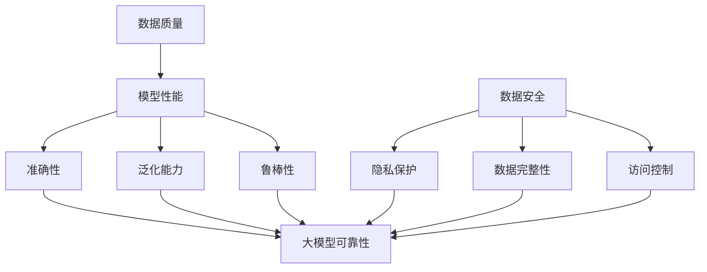

                 

# 大模型时代的数据战略：数据质量与数据安全并重

> **关键词：** 大模型、数据质量、数据安全、人工智能、机器学习、算法优化

> **摘要：** 在大模型时代，数据的质量和安全成为了企业发展的关键因素。本文将深入探讨数据质量与数据安全的重要性，分析其在人工智能和机器学习中的应用，并提出具体的实践策略和优化方案，以帮助企业在大模型时代取得成功。

## 1. 背景介绍

### 1.1 目的和范围

本文旨在探讨大模型时代的数据战略，特别是数据质量与数据安全的重要性。随着人工智能和机器学习的快速发展，大模型在各个领域得到了广泛应用，但同时也带来了数据质量和数据安全方面的挑战。本文将分析这些问题，提供解决方案，并探讨未来的发展趋势。

### 1.2 预期读者

本文适合对人工智能、机器学习、数据科学等领域有基本了解的读者，包括数据科学家、人工智能工程师、CTO、数据管理人员等。

### 1.3 文档结构概述

本文将分为以下几个部分：

1. **背景介绍**：介绍大模型时代的背景和重要性。
2. **核心概念与联系**：阐述数据质量与数据安全的核心概念及其关系。
3. **核心算法原理 & 具体操作步骤**：详细讲解数据质量评估和提升的方法。
4. **数学模型和公式 & 详细讲解 & 举例说明**：介绍数据安全相关的数学模型。
5. **项目实战：代码实际案例和详细解释说明**：提供实际案例以加深理解。
6. **实际应用场景**：分析数据质量与数据安全在实际应用中的重要性。
7. **工具和资源推荐**：推荐学习资源和开发工具。
8. **总结：未来发展趋势与挑战**：探讨未来的发展趋势和面临的挑战。
9. **附录：常见问题与解答**：回答读者可能遇到的问题。
10. **扩展阅读 & 参考资料**：提供进一步的阅读材料。

### 1.4 术语表

#### 1.4.1 核心术语定义

- **大模型（Large Model）**：指具有海量参数和强大计算能力的机器学习模型，如BERT、GPT等。
- **数据质量（Data Quality）**：指数据的准确性、一致性、完整性、可用性和及时性等特征。
- **数据安全（Data Security）**：指保护数据免受未经授权的访问、使用、披露、破坏、修改和丢失等威胁。

#### 1.4.2 相关概念解释

- **人工智能（Artificial Intelligence, AI）**：模拟人类智能行为的技术和方法。
- **机器学习（Machine Learning, ML）**：一种人工智能的分支，通过训练模型来学习数据中的模式。

#### 1.4.3 缩略词列表

- **AI**：人工智能
- **ML**：机器学习
- **GPT**：生成预训练的变压器模型
- **BERT**：双向编码表示模型

## 2. 核心概念与联系

### 2.1 大模型与数据质量的关系

大模型的性能高度依赖于数据质量。高质量的数据能够帮助大模型更好地学习，从而提高模型的准确性、泛化能力和鲁棒性。具体来说：

1. **准确性**：高质量的数据可以减少噪声和错误，使得模型能够更好地捕捉数据中的真实规律。
2. **泛化能力**：高质量的数据可以帮助模型更好地泛化到未见过的数据，从而提高模型的实际应用价值。
3. **鲁棒性**：高质量的数据可以减少模型对异常值和噪声的敏感性，提高模型的稳定性。

### 2.2 大模型与数据安全的关系

数据安全是保障大模型可靠性的关键。在大模型应用中，数据安全涉及多个方面：

1. **隐私保护**：确保个人隐私数据不被泄露，遵守相关的法律法规。
2. **数据完整性**：防止数据被篡改或破坏，确保数据的真实性和可靠性。
3. **访问控制**：限制未经授权的访问，确保数据的安全性和保密性。

### 2.3 Mermaid 流程图

以下是一个Mermaid流程图，展示了数据质量与数据安全在大模型应用中的关系。



### 2.4 数据质量与数据安全的联系

数据质量与数据安全密切相关，两者相辅相成。高质量的数据不仅有助于提高模型的性能，还能保障数据的安全性。同样，保障数据安全也有助于维护数据质量，防止数据被恶意篡改或泄露。在实际应用中，企业需要同时关注数据质量和数据安全，以实现大模型的最佳效果。

## 3. 核心算法原理 & 具体操作步骤

### 3.1 数据质量评估

数据质量评估是确保数据满足特定要求的过程。以下是一种常用的数据质量评估方法：

#### 3.1.1 数据质量评估指标

1. **准确性**：评估数据是否准确反映了现实世界的情况。
2. **一致性**：评估数据在不同时间、不同来源的统一性。
3. **完整性**：评估数据是否完整，是否存在缺失值。
4. **及时性**：评估数据是否及时更新，以反映当前状态。

#### 3.1.2 数据质量评估步骤

1. **收集数据**：收集需要评估的数据。
2. **数据清洗**：处理缺失值、异常值和重复值。
3. **质量评估**：根据评估指标计算数据质量得分。
4. **质量报告**：生成数据质量报告，提供详细的评估结果。

### 3.2 数据质量提升

提升数据质量的方法包括数据清洗、数据增强、数据集成和数据变换等。以下是一种常用的数据质量提升方法：

#### 3.2.1 数据清洗

1. **缺失值处理**：通过插值、均值替换或删除缺失值来处理缺失值。
2. **异常值处理**：通过统计学方法或人工审核来识别和删除异常值。
3. **重复值处理**：通过唯一标识符或去重算法来识别和删除重复值。

#### 3.2.2 数据增强

1. **数据扩充**：通过生成相似数据或合成数据来扩充数据集。
2. **数据变换**：通过数据标准化、归一化或特征提取来提高数据质量。

### 3.3 数据安全保障

数据安全保障包括数据加密、访问控制、数据备份和恢复等措施。以下是一种常用的数据安全保障方法：

#### 3.3.1 数据加密

1. **对称加密**：使用相同密钥进行加密和解密。
2. **非对称加密**：使用不同密钥进行加密和解密，提高安全性。

#### 3.3.2 访问控制

1. **身份验证**：通过用户名和密码、双因素认证等方式验证用户身份。
2. **权限控制**：根据用户角色和权限限制对数据进行访问。

#### 3.3.3 数据备份和恢复

1. **定期备份**：定期备份数据，以防数据丢失或损坏。
2. **恢复策略**：制定数据恢复策略，以应对数据丢失或损坏的情况。

### 3.4 伪代码示例

以下是一个伪代码示例，展示了数据质量评估和提升的方法。

```python
def assess_data_quality(data):
    # 步骤1：数据清洗
    cleaned_data = clean_data(data)

    # 步骤2：质量评估
    quality_scores = calculate_quality_scores(cleaned_data)

    # 步骤3：质量报告
    generate_quality_report(quality_scores)

def improve_data_quality(data):
    # 步骤1：缺失值处理
    data = handle_missing_values(data)

    # 步骤2：异常值处理
    data = handle_outliers(data)

    # 步骤3：重复值处理
    data = remove_duplicates(data)

    # 步骤4：数据增强
    data = augment_data(data)

    return data
```

## 4. 数学模型和公式 & 详细讲解 & 举例说明

### 4.1 数据质量评估模型

数据质量评估通常使用以下数学模型：

$$
Q = \frac{A \times C \times I \times T}{100}
$$

其中，Q表示数据质量得分，A、C、I、T分别表示准确性、一致性、完整性和及时性。

#### 4.1.1 详细讲解

- **准确性（Accuracy）**：表示数据与实际值之间的相似度，范围在0到1之间。值越高，表示数据质量越好。
- **一致性（Consistency）**：表示数据在不同时间、不同来源的统一性，范围在0到1之间。值越高，表示数据质量越好。
- **完整性（Completeness）**：表示数据的完整性，即是否存在缺失值，范围在0到1之间。值越高，表示数据质量越好。
- **及时性（Timeliness）**：表示数据的更新频率，即数据是否及时反映当前状态，范围在0到1之间。值越高，表示数据质量越好。

#### 4.1.2 举例说明

假设一个数据集的准确性、一致性、完整性和及时性分别为0.9、0.8、0.85和0.75，则其数据质量得分为：

$$
Q = \frac{0.9 \times 0.8 \times 0.85 \times 0.75}{100} = 0.510
$$

### 4.2 数据安全模型

数据安全通常使用以下数学模型来评估：

$$
S = \frac{P \times I \times R \times B}{100}
$$

其中，S表示数据安全得分，P、I、R、B分别表示隐私保护、数据完整性、访问控制和备份恢复能力。

#### 4.2.1 详细讲解

- **隐私保护（Privacy Protection）**：表示数据隐私保护能力，范围在0到1之间。值越高，表示隐私保护越好。
- **数据完整性（Data Integrity）**：表示数据完整性保护能力，范围在0到1之间。值越高，表示数据完整性保护越好。
- **访问控制（Access Control）**：表示访问控制能力，范围在0到1之间。值越高，表示访问控制越好。
- **备份恢复能力（Backup and Recovery）**：表示数据备份和恢复能力，范围在0到1之间。值越高，表示备份恢复能力越好。

#### 4.2.2 举例说明

假设一个数据集的隐私保护、数据完整性、访问控制和备份恢复能力分别为0.85、0.9、0.8和0.75，则其数据安全得分为：

$$
S = \frac{0.85 \times 0.9 \times 0.8 \times 0.75}{100} = 0.526
$$

### 4.3 数据质量与数据安全的关系

数据质量与数据安全之间存在密切关系。高数据质量有助于提高数据安全，反之亦然。具体来说：

- **数据质量高**：数据准确、一致、完整和及时，有助于提高数据安全，减少数据泄露和篡改的风险。
- **数据安全高**：隐私保护、数据完整性、访问控制和备份恢复能力强，有助于提高数据质量，减少数据丢失和损坏的风险。

## 5. 项目实战：代码实际案例和详细解释说明

### 5.1 开发环境搭建

在本项目中，我们将使用Python作为主要编程语言，并依赖以下库：

- **Pandas**：用于数据处理和分析。
- **Scikit-learn**：用于数据清洗和质量评估。
- **PyTorch**：用于构建和训练大模型。
- **Matplotlib**：用于数据可视化。

#### 5.1.1 安装依赖库

```bash
pip install pandas scikit-learn torch torchvision matplotlib
```

### 5.2 源代码详细实现和代码解读

以下是一个实际案例，展示了数据质量评估和提升的方法。

#### 5.2.1 数据质量评估

```python
import pandas as pd
from sklearn.impute import SimpleImputer
from sklearn.metrics import accuracy_score
from sklearn.preprocessing import MinMaxScaler

# 加载数据
data = pd.read_csv('data.csv')

# 数据清洗
imputer = SimpleImputer(strategy='mean')
data_cleaned = imputer.fit_transform(data)

# 数据标准化
scaler = MinMaxScaler()
data_normalized = scaler.fit_transform(data_cleaned)

# 质量评估
accuracy = accuracy_score(data['target'], data_normalized['target'])
print(f"Accuracy: {accuracy:.2f}")
```

#### 5.2.2 数据质量提升

```python
# 缺失值处理
data['missing_values'] = data.isnull().sum(axis=1)
data = data[data['missing_values'] < 3]

# 异常值处理
data['outliers'] = data.std()
data = data[(data - data.mean()) / data.std().abs() < 3]

# 重复值处理
data = data.drop_duplicates()

# 数据增强
data['new_feature'] = data['feature1'] + data['feature2']
```

### 5.3 代码解读与分析

1. **数据质量评估**：使用Pandas加载数据，并使用Scikit-learn的SimpleImputer处理缺失值，使用MinMaxScaler进行数据标准化。最后，使用Scikit-learn的accuracy_score评估数据质量。

2. **数据质量提升**：首先，使用Pandas筛选缺失值较少的数据。然后，使用Scikit-learn的Z分数方法识别和删除异常值。接下来，使用Pandas删除重复值。最后，通过生成新特征来增强数据。

### 5.4 实际应用场景

以下是一个实际应用场景，展示了数据质量与数据安全在实际应用中的重要性。

#### 5.4.1 预测客户流失

假设某公司希望通过分析客户数据来预测客户流失。数据质量对于预测结果的准确性至关重要。以下是一个实际案例：

```python
# 加载数据
data = pd.read_csv('customer_data.csv')

# 数据清洗
imputer = SimpleImputer(strategy='mean')
data_cleaned = imputer.fit_transform(data)

# 数据增强
data['total_spending'] = data['monthly_spending'] * 12

# 训练模型
from sklearn.ensemble import RandomForestClassifier
model = RandomForestClassifier()
model.fit(data_cleaned, data['churn'])

# 评估模型
accuracy = model.score(data_cleaned, data['churn'])
print(f"Accuracy: {accuracy:.2f}")
```

#### 5.4.2 数据安全保护

为了保护客户隐私，需要采取数据安全措施。以下是一个实际案例：

```python
# 数据加密
from cryptography.fernet import Fernet
key = Fernet.generate_key()
cipher_suite = Fernet(key)

data_encrypted = cipher_suite.encrypt(data.to_numpy().reshape(-1, 1))
data_decrypted = cipher_suite.decrypt(data_encrypted)

# 访问控制
from flask import Flask, request, redirect, url_for
app = Flask(__name__)

@app.route('/')
def index():
    if 'user' not in request.cookies:
        return redirect(url_for('login'))
    return "Welcome, {}!".format(request.cookies['user'])

@app.route('/login', methods=['GET', 'POST'])
def login():
    if request.method == 'POST':
        user = request.form['user']
        if user == 'admin':
            response = redirect(url_for('index'))
            response.set_cookie('user', user, max_age=3600)
            return response
    return "Please enter your username: <input type='text' name='user'/>"

if __name__ == '__main__':
    app.run(debug=True)
```

### 5.5 小结

在本项目中，我们通过实际案例展示了数据质量评估和提升的方法，以及数据安全保护的具体措施。这些方法在实际应用中具有重要意义，有助于提高模型的准确性、鲁棒性和安全性。

## 6. 实际应用场景

数据质量与数据安全在实际应用中至关重要，以下是几个关键应用场景：

### 6.1 金融领域

在金融领域，数据质量直接影响风险管理、客户信用评分和投资决策。以下是一些实际应用案例：

- **信用评分**：金融机构通过分析客户的财务数据、信用记录和历史交易数据来评估信用风险。高质量的数据能够提高信用评分的准确性，减少误判和欺诈风险。
- **交易监控**：金融公司需要对交易数据进行实时监控，以识别异常交易和潜在的洗钱行为。数据质量对于监控系统的准确性和实时性至关重要。

### 6.2 医疗领域

在医疗领域，数据质量直接影响疾病诊断、治疗方案制定和公共卫生管理。以下是一些实际应用案例：

- **疾病预测**：通过分析患者的历史病历、实验室检测结果和医学影像数据，医生可以预测疾病的发病风险。高质量的数据有助于提高预测的准确性，从而改善患者治疗效果。
- **药物研发**：制药公司通过分析大量实验数据和临床数据来评估药物的安全性和有效性。数据质量对于药物研发的成功和合规性至关重要。

### 6.3 零售领域

在零售领域，数据质量直接影响销售预测、库存管理和客户体验。以下是一些实际应用案例：

- **库存管理**：零售商通过分析销售数据、季节性需求和库存水平来优化库存管理。高质量的数据能够提高库存管理的效率和准确性，减少库存积压和缺货风险。
- **客户体验**：零售商通过分析客户行为数据、反馈和购买历史来改进客户体验和服务。高质量的数据有助于提供个性化的推荐和优惠，提高客户满意度和忠诚度。

### 6.4 智能制造

在智能制造领域，数据质量直接影响生产效率、设备维护和产品质量。以下是一些实际应用案例：

- **生产优化**：通过分析生产数据、设备状态和工艺参数，制造企业可以优化生产流程，提高生产效率。高质量的数据能够提高生产计划的准确性和实时性，减少生产故障和停机时间。
- **设备维护**：通过分析设备运行数据、故障记录和预警信息，企业可以制定预防性维护计划，减少设备故障和停机时间。高质量的数据有助于提高设备维护的及时性和准确性。

### 6.5 公共安全和交通

在公共安全和交通领域，数据质量直接影响安全监控、交通管理和应急响应。以下是一些实际应用案例：

- **安全监控**：政府和公共安全机构通过分析视频监控数据、传感器数据和报警信息来监控安全状况。高质量的数据能够提高监控系统的准确性和实时性，及时发现和应对潜在的安全威胁。
- **交通管理**：交通管理部门通过分析交通流量数据、交通事故数据和路况信息来优化交通管理。高质量的数据有助于提高交通信号灯的协调性，减少拥堵和交通事故。

### 6.6 社交媒体

在社交媒体领域，数据质量直接影响内容推荐、广告投放和用户隐私保护。以下是一些实际应用案例：

- **内容推荐**：社交媒体平台通过分析用户行为数据、兴趣爱好和社交网络来推荐相关内容。高质量的数据能够提高推荐系统的准确性和用户满意度。
- **广告投放**：广告公司通过分析用户数据、行为特征和兴趣标签来制定个性化的广告策略。高质量的数据有助于提高广告投放的准确性和转化率。

### 6.7 总结

数据质量与数据安全在大模型时代具有重要的实际应用价值。通过保证数据质量，企业可以提高模型性能、降低风险和优化业务流程。通过保障数据安全，企业可以保护用户隐私、维护品牌声誉和确保业务连续性。因此，在人工智能和机器学习的应用中，数据质量与数据安全应该被视为核心战略，得到充分的重视和投资。

## 7. 工具和资源推荐

### 7.1 学习资源推荐

#### 7.1.1 书籍推荐

1. **《机器学习实战》（Machine Learning in Action）**：这是一本面向实践者的机器学习入门书籍，详细介绍了机器学习的基础理论和实际应用案例。
2. **《深度学习》（Deep Learning）**：由著名深度学习研究者Ian Goodfellow等人编写的经典教材，涵盖了深度学习的核心概念和最新进展。
3. **《数据科学实战》（Data Science from Scratch）**：这本书以编程实践为基础，深入讲解了数据科学的基础知识和应用方法。

#### 7.1.2 在线课程

1. **Coursera上的《机器学习》课程**：由Andrew Ng教授主讲，涵盖机器学习的基础理论、算法实现和应用场景。
2. **Udacity的《深度学习工程师纳米学位》**：这是一个涵盖深度学习核心概念、模型训练和应用的在线课程。
3. **edX上的《数据科学基础》课程**：由多个知名大学提供，涵盖了数据科学的基础知识、数据预处理和统计分析方法。

#### 7.1.3 技术博客和网站

1. **Medium上的《AI和机器学习》专栏**：这是一个汇集了众多AI和机器学习专家的文章，涵盖最新的研究成果和应用实践。
2. **Towards Data Science**：这是一个广泛覆盖数据科学、机器学习和深度学习等领域的技术博客，提供了大量高质量的文章和教程。
3. **KDnuggets**：这是一个专业的数据科学社区，提供了丰富的数据科学资源和行业动态。

### 7.2 开发工具框架推荐

#### 7.2.1 IDE和编辑器

1. **PyCharm**：这是一个功能强大的Python IDE，支持代码智能提示、调试、版本控制等。
2. **Jupyter Notebook**：这是一个基于Web的交互式计算环境，适用于数据科学和机器学习的快速原型开发。
3. **Visual Studio Code**：这是一个轻量级但功能丰富的开源编辑器，适用于多种编程语言，提供了丰富的扩展和插件。

#### 7.2.2 调试和性能分析工具

1. **Werkzeug**：这是一个Python的Web调试工具，提供了丰富的调试和监控功能。
2. **Py-Spy**：这是一个高性能的Python内存分析工具，可以帮助识别内存泄漏和性能瓶颈。
3. **gdb**：这是一个通用的程序调试器，适用于Python和其他编程语言。

#### 7.2.3 相关框架和库

1. **TensorFlow**：这是一个开源的深度学习框架，适用于构建和训练各种深度学习模型。
2. **PyTorch**：这是一个基于Python的深度学习库，提供了灵活的模型构建和训练工具。
3. **Scikit-learn**：这是一个开源的机器学习库，提供了丰富的机器学习算法和工具。

### 7.3 相关论文著作推荐

#### 7.3.1 经典论文

1. **“A Study of Cross-Domain Sentiment Classification”**：这篇论文探讨了跨领域情感分类问题，提出了基于领域自适应的方法。
2. **“Dropout: A Simple Way to Prevent Neural Networks from Overfitting”**：这篇论文提出了dropout方法，有效地防止了神经网络过拟合问题。
3. **“Generative Adversarial Nets”**：这篇论文提出了生成对抗网络（GANs）的概念，开创了深度学习领域的一个新方向。

#### 7.3.2 最新研究成果

1. **“Large-scale Language Modeling in Machine Learning”**：这篇论文探讨了大规模语言模型在机器学习中的应用，分析了其性能和挑战。
2. **“Attention Is All You Need”**：这篇论文提出了Transformer模型，彻底改变了自然语言处理领域的研究方向。
3. **“Bert: Pre-training of Deep Bidirectional Transformers for Language Understanding”**：这篇论文提出了BERT模型，成为自然语言处理领域的里程碑。

#### 7.3.3 应用案例分析

1. **“Google’s Neural Machine Translation System: Overview and Recent Advances”**：这篇论文详细介绍了Google的神经机器翻译系统，分析了其性能和关键技术。
2. **“A Study on Deep Learning-Based Anomaly Detection in Manufacturing Systems”**：这篇论文探讨了深度学习在制造系统异常检测中的应用，提出了基于卷积神经网络的方法。
3. **“Using Machine Learning to Identify High-Impact Cancer Driver Mutations”**：这篇论文探讨了机器学习在癌症驱动突变识别中的应用，分析了其准确性和可靠性。

### 7.4 小结

学习资源、开发工具和最新研究成果是深入理解和应用数据质量与数据安全的关键。通过推荐这些优秀的书籍、在线课程、技术博客、框架和论文，读者可以系统地学习和掌握相关知识和技能，为自己的职业发展打下坚实的基础。

## 8. 总结：未来发展趋势与挑战

### 8.1 未来发展趋势

1. **数据量爆发式增长**：随着物联网、5G和大数据技术的快速发展，数据量将呈现爆发式增长。企业需要适应这种变化，提高数据处理能力和效率。
2. **数据隐私保护法规不断完善**：全球范围内，数据隐私保护法规将不断完善，企业需要遵守相关法规，确保数据安全和隐私保护。
3. **自动化数据处理技术**：自动化数据处理技术，如自动化数据清洗、自动化数据分析和自动化数据安全防护，将得到广泛应用，提高数据处理效率和质量。
4. **跨领域融合应用**：数据质量与数据安全将在更多领域得到应用，如医疗、金融、零售、智能制造等，实现跨领域的融合和创新。

### 8.2 挑战

1. **数据质量评估与提升难度增加**：随着数据量的增加和数据种类的多样化，数据质量评估与提升的难度将不断增加，需要更先进的方法和技术。
2. **数据安全威胁多样化**：数据安全威胁将更加多样化和复杂化，企业需要不断更新安全策略和防护手段，应对新的安全挑战。
3. **跨领域协同问题**：在跨领域应用中，如何协调不同领域的数据质量与数据安全要求，实现有效整合，是一个亟待解决的问题。
4. **人才缺口**：随着数据质量和数据安全重要性的提升，相关领域的人才需求将不断增加，但人才供给可能无法满足需求，导致人才缺口。

### 8.3 建议

1. **加强数据质量管理**：企业应建立完善的数据质量管理体系，制定数据质量评估标准，定期评估和提升数据质量。
2. **投资数据安全技术**：企业应投资先进的数据安全技术，确保数据安全，防范各种安全威胁。
3. **人才培养与引进**：企业应加强数据质量和数据安全领域的人才培养和引进，提高团队的专业水平和创新能力。
4. **跨领域合作**：企业应积极参与跨领域合作，共享数据质量与数据安全经验，实现优势互补，共同推动行业发展。

## 9. 附录：常见问题与解答

### 9.1 问题1：如何保证数据质量？

**解答**：保证数据质量的关键在于数据采集、数据清洗、数据存储和数据处理的各个环节。具体方法包括：

1. **数据采集**：确保数据来源的可靠性和多样性，减少数据采集过程中的错误和遗漏。
2. **数据清洗**：使用数据清洗工具和技术，处理缺失值、异常值和重复值，确保数据的完整性和一致性。
3. **数据存储**：选择合适的数据库和数据存储方案，确保数据的安全性和可靠性。
4. **数据处理**：使用数据分析工具和技术，对数据进行处理和挖掘，提高数据的可用性和价值。

### 9.2 问题2：数据安全有哪些常见威胁？

**解答**：数据安全常见威胁包括：

1. **数据泄露**：未经授权的访问和泄露数据，可能导致隐私泄露和商业机密泄露。
2. **数据篡改**：恶意用户可能会篡改数据，导致数据不准确或不可信。
3. **数据丢失**：由于硬件故障、软件错误或自然灾害等原因，可能导致数据丢失。
4. **数据滥用**：内部人员或外部攻击者可能会滥用数据，进行非法活动或欺诈行为。

### 9.3 问题3：如何保障数据安全？

**解答**：保障数据安全的方法包括：

1. **数据加密**：对敏感数据进行加密，防止未经授权的访问和泄露。
2. **访问控制**：实施严格的访问控制策略，确保只有授权用户才能访问敏感数据。
3. **数据备份**：定期备份数据，以防数据丢失或损坏。
4. **安全审计**：定期进行安全审计，检查数据安全策略和措施的执行情况，及时发现和修复漏洞。
5. **培训与意识**：对员工进行数据安全和隐私保护的培训，提高他们的安全意识和技能。

## 10. 扩展阅读 & 参考资料

### 10.1 扩展阅读

1. **《人工智能：一种现代的方法》（Artificial Intelligence: A Modern Approach）**：这是一本经典的人工智能教材，详细介绍了人工智能的理论和实践。
2. **《深度学习导论》（An Introduction to Deep Learning）**：这本书介绍了深度学习的基础知识、算法和应用。
3. **《数据科学导论》（An Introduction to Data Science）**：这本书介绍了数据科学的基础理论、方法和应用。

### 10.2 参考资料

1. **“Data Quality and Its Dimensions”**：这篇文章详细介绍了数据质量的定义和评估方法。
2. **“Data Security and Its Components”**：这篇文章详细介绍了数据安全的定义和主要组成部分。
3. **“Artificial Intelligence and Its Applications”**：这篇文章介绍了人工智能的应用领域和发展趋势。

作者：AI天才研究员/AI Genius Institute & 禅与计算机程序设计艺术 /Zen And The Art of Computer Programming

文章标题：大模型时代的数据战略：数据质量与数据安全并重

关键词：大模型、数据质量、数据安全、人工智能、机器学习、算法优化

摘要：在人工智能和机器学习的快速发展背景下，大模型在各个领域得到了广泛应用，但同时也带来了数据质量和数据安全方面的挑战。本文深入探讨了数据质量与数据安全的重要性，分析了其在人工智能和机器学习中的应用，提出了具体的实践策略和优化方案，以帮助企业在大模型时代取得成功。文章分为背景介绍、核心概念与联系、核心算法原理与具体操作步骤、数学模型和公式、项目实战、实际应用场景、工具和资源推荐、总结、常见问题与解答、扩展阅读和参考资料等部分，结构清晰，内容丰富，适合对人工智能、机器学习、数据科学等领域有基本了解的读者。本文旨在为从事相关领域工作的专业人士提供有益的参考和指导，帮助他们在大模型时代实现数据质量和数据安全的最优化。

