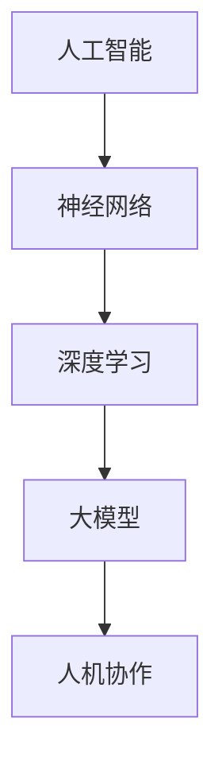
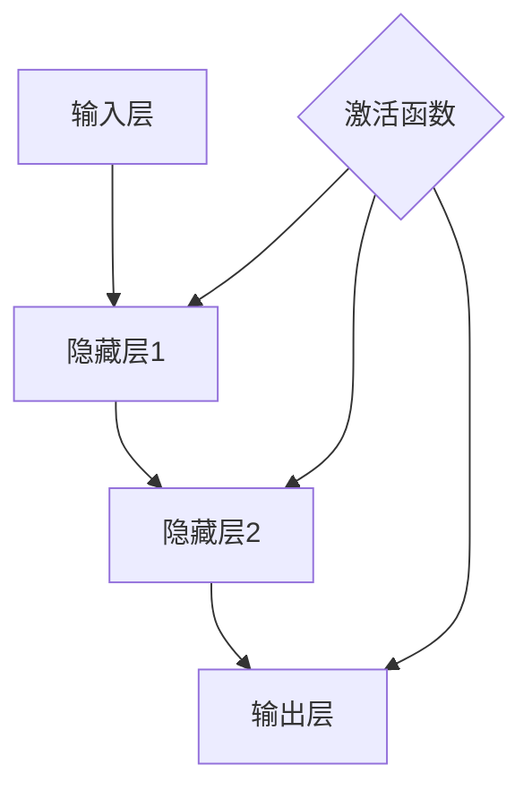

                 

# 大模型的人机协作：人工智能与人类智能的融合

> 关键词：人工智能、人机协作、大模型、融合、算法原理、数学模型、项目实战、应用场景、工具资源

> 摘要：本文深入探讨大模型在人工智能与人类智能融合中的应用，分析其核心概念、算法原理、数学模型，并通过项目实战与实际应用场景，揭示大模型在人机协作中的潜力和挑战。本文旨在为读者提供全面的视角，了解大模型技术如何推动人机协作迈向新的高度。

## 1. 背景介绍

### 1.1 目的和范围

本文旨在探讨大模型（如GPT、BERT等）在人工智能（AI）与人类智能（Human Intelligence, HI）融合中的应用，重点关注以下几个方面：

1. **核心概念与联系**：介绍大模型的基本概念和与其他人工智能技术的联系。
2. **核心算法原理**：阐述大模型的算法原理，包括训练过程和预测步骤。
3. **数学模型和公式**：详细讲解大模型背后的数学模型和公式。
4. **项目实战**：通过具体代码案例，展示大模型在实际项目中的应用。
5. **实际应用场景**：分析大模型在人机协作中的潜在应用场景。
6. **工具和资源推荐**：推荐学习资源和开发工具。
7. **未来发展趋势与挑战**：探讨大模型在人机协作中的未来发展趋势和面临的挑战。

### 1.2 预期读者

本文适合以下读者群体：

1. **人工智能研究者**：希望了解大模型技术的理论基础和实际应用。
2. **软件开发工程师**：对大模型技术感兴趣，希望将其应用于实际项目。
3. **数据科学家**：对机器学习算法和数学模型有深入了解，希望掌握大模型技术。
4. **教育工作者**：希望为学生提供关于大模型和人机协作的课程内容。

### 1.3 文档结构概述

本文结构如下：

1. **背景介绍**：介绍文章的目的、范围和预期读者。
2. **核心概念与联系**：介绍大模型的基本概念和相关技术。
3. **核心算法原理**：讲解大模型的算法原理和操作步骤。
4. **数学模型和公式**：详细解释大模型背后的数学模型和公式。
5. **项目实战**：通过具体代码案例，展示大模型在实际项目中的应用。
6. **实际应用场景**：分析大模型在人机协作中的潜在应用场景。
7. **工具和资源推荐**：推荐学习资源和开发工具。
8. **未来发展趋势与挑战**：探讨大模型在人机协作中的未来发展趋势和面临的挑战。
9. **附录**：常见问题与解答。
10. **扩展阅读与参考资料**：提供相关的扩展阅读和参考资料。

### 1.4 术语表

#### 1.4.1 核心术语定义

- **人工智能（AI）**：指由人制造出来的系统，具备类似人类智能的能力，可以进行感知、学习、推理和决策。
- **人类智能（HI）**：指人类在感知、思考、学习、情感和社交等方面的认知能力。
- **大模型（Large Models）**：指具有亿级别参数规模，能够处理海量数据的神经网络模型。
- **人机协作（Human-Machine Collaboration）**：指人类与机器在任务执行过程中的互动与合作。

#### 1.4.2 相关概念解释

- **神经网络（Neural Network）**：由大量神经元组成的计算模型，通过学习输入和输出数据之间的关系，实现函数逼近和分类。
- **深度学习（Deep Learning）**：一种利用多层神经网络进行训练和学习的技术，能够自动提取数据特征。
- **预训练（Pre-training）**：在大规模数据集上预先训练神经网络，使其掌握通用语言理解和知识表示能力。
- **微调（Fine-tuning）**：在预训练模型的基础上，针对特定任务进行参数调整，以提高模型在特定任务上的性能。

#### 1.4.3 缩略词列表

- **AI**：人工智能（Artificial Intelligence）
- **HI**：人类智能（Human Intelligence）
- **NN**：神经网络（Neural Network）
- **DL**：深度学习（Deep Learning）
- **GPT**：生成预训练变换器（Generative Pre-trained Transformer）
- **BERT**：双向编码表示（Bidirectional Encoder Representations from Transformers）

## 2. 核心概念与联系

在大模型与人机协作中，核心概念包括大模型、神经网络、深度学习和预训练等。以下是一个简单的 Mermaid 流程图，展示了这些概念之间的联系。



### 2.1 大模型的基本概念

大模型是指具有亿级别参数规模的神经网络模型，能够处理海量数据。大模型通常采用深度学习技术进行训练，具备强大的表示能力和推理能力。例如，GPT（生成预训练变换器）和BERT（双向编码表示）是两种典型的大模型。

### 2.2 神经网络与深度学习

神经网络是一种由大量神经元组成的计算模型，通过学习输入和输出数据之间的关系，实现函数逼近和分类。深度学习是一种利用多层神经网络进行训练和学习的技术，能够自动提取数据特征。大模型通常采用深度学习技术，通过增加网络层数和参数规模，实现更复杂的函数逼近和表示能力。

### 2.3 预训练与微调

预训练是指在大规模数据集上预先训练神经网络，使其掌握通用语言理解和知识表示能力。微调是在预训练模型的基础上，针对特定任务进行参数调整，以提高模型在特定任务上的性能。大模型通常采用预训练和微调相结合的方法，通过预训练获得通用能力，再通过微调适应特定任务需求。

### 2.4 人机协作

人机协作是指人类与机器在任务执行过程中的互动与合作。大模型在人机协作中扮演着重要角色，通过自动学习和推理，辅助人类完成复杂任务。人机协作不仅能够提高任务效率，还能拓展人类智能，实现更加智能化和高效化的工作方式。

## 3. 核心算法原理 & 具体操作步骤

### 3.1 大模型的训练过程

大模型的训练过程通常分为以下步骤：

1. **数据预处理**：对输入数据进行清洗、去噪和格式化，确保数据质量和一致性。
2. **模型初始化**：随机初始化模型参数，为训练过程提供初始值。
3. **前向传播**：将输入数据输入到模型中，通过多层神经网络进行计算，得到输出结果。
4. **损失函数计算**：计算输出结果与真实标签之间的误差，通过损失函数表示。
5. **反向传播**：根据损失函数，计算模型参数的梯度，并更新模型参数。
6. **迭代优化**：重复前向传播、损失函数计算和反向传播步骤，逐步优化模型参数。

以下是一个简单的伪代码，展示了大模型的训练过程：

```python
# 初始化模型参数
model = initialize_model()

# 设置迭代次数
num_epochs = 1000

# 设置学习率
learning_rate = 0.001

for epoch in range(num_epochs):
    for batch in data_loader:
        # 前向传播
        output = model(batch.input_data)

        # 计算损失函数
        loss = loss_function(output, batch.label)

        # 反向传播
        gradients = backward_propagation(model, loss)

        # 更新模型参数
        update_model_params(model, gradients, learning_rate)
```

### 3.2 大模型的预测过程

大模型的预测过程相对简单，主要包括以下步骤：

1. **输入数据预处理**：对输入数据进行预处理，确保与训练数据一致。
2. **前向传播**：将预处理后的输入数据输入到模型中，通过多层神经网络进行计算，得到输出结果。
3. **结果输出**：输出模型的预测结果。

以下是一个简单的伪代码，展示了大模型的预测过程：

```python
# 输入数据预处理
preprocessed_input = preprocess_input(input_data)

# 前向传播
output = model(preprocessed_input)

# 输出结果
print(output)
```

## 4. 数学模型和公式 & 详细讲解 & 举例说明

### 4.1 数学模型概述

大模型背后的数学模型主要包括以下几个方面：

1. **神经网络模型**：包括神经元、激活函数、权重和偏置等。
2. **损失函数**：包括均方误差（MSE）、交叉熵（Cross-Entropy）等。
3. **优化算法**：包括梯度下降（Gradient Descent）、Adam等。

### 4.2 神经网络模型

神经网络模型是深度学习的基础，其核心组成部分包括：

1. **神经元**：神经网络的基本计算单元，负责接收输入、计算输出和传递信号。
2. **激活函数**：用于引入非线性因素，使神经网络能够拟合复杂函数。
3. **权重和偏置**：用于调节神经元之间的连接强度和偏移量。

以下是一个简单的神经网络模型示意图：



### 4.3 损失函数

损失函数用于衡量模型的预测结果与真实标签之间的差距，常见损失函数包括：

1. **均方误差（MSE）**：
   \[ MSE = \frac{1}{n} \sum_{i=1}^{n} (y_i - \hat{y}_i)^2 \]
   其中，\( y_i \) 表示第 \( i \) 个真实标签，\( \hat{y}_i \) 表示第 \( i \) 个预测标签。

2. **交叉熵（Cross-Entropy）**：
   \[ H(y, \hat{y}) = -\sum_{i=1}^{n} y_i \log(\hat{y}_i) \]
   其中，\( y_i \) 表示第 \( i \) 个真实标签，\( \hat{y}_i \) 表示第 \( i \) 个预测概率。

### 4.4 优化算法

优化算法用于根据损失函数的梯度更新模型参数，常见优化算法包括：

1. **梯度下降（Gradient Descent）**：
   \[ \theta = \theta - \alpha \nabla_{\theta} J(\theta) \]
   其中，\( \theta \) 表示模型参数，\( \alpha \) 表示学习率，\( J(\theta) \) 表示损失函数。

2. **Adam优化器**：
   \[ m_t = \beta_1 m_{t-1} + (1 - \beta_1) \nabla_{\theta} J(\theta) \]
   \[ v_t = \beta_2 v_{t-1} + (1 - \beta_2) (\nabla_{\theta} J(\theta))^2 \]
   \[ \theta = \theta - \alpha \frac{m_t}{\sqrt{v_t} + \epsilon} \]
   其中，\( m_t \) 和 \( v_t \) 分别表示一阶矩估计和二阶矩估计，\( \beta_1 \) 和 \( \beta_2 \) 分别为动量因子，\( \alpha \) 为学习率，\( \epsilon \) 为一个很小的常数。

### 4.5 举例说明

假设我们使用一个简单的神经网络模型对数据进行分类，输入层有3个神经元，隐藏层有2个神经元，输出层有2个神经元。训练数据集包含100个样本，每个样本有3个特征。我们采用均方误差（MSE）作为损失函数，使用梯度下降（Gradient Descent）进行优化。

1. **模型初始化**：

   - 输入层：\[ \theta_{11}, \theta_{12}, \theta_{13} \]
   - 隐藏层：\[ \theta_{21}, \theta_{22}, \theta_{31}, \theta_{32} \]
   - 输出层：\[ \theta_{41}, \theta_{42} \]

2. **前向传播**：

   假设输入数据为 \( x = [0.1, 0.2, 0.3] \)。

   - 输入层到隐藏层的输出：\[ z_1 = \theta_{11} \cdot 0.1 + \theta_{12} \cdot 0.2 + \theta_{13} \cdot 0.3 \]
   - 隐藏层到输出层的输出：\[ z_2 = \theta_{21} \cdot z_1 + \theta_{22} \cdot z_2 \]
   - 输出层的输出：\[ y_1 = \sigma(z_2) \]

3. **损失函数计算**：

   假设真实标签为 \( y = [0.9, 0.1] \)。

   - 均方误差（MSE）：\[ J(\theta) = \frac{1}{2} \sum_{i=1}^{2} (y_i - y_i^*)^2 \]

4. **反向传播**：

   - 计算梯度：\[ \nabla_{\theta} J(\theta) = \frac{\partial J(\theta)}{\partial \theta} \]
   - 更新模型参数：\[ \theta = \theta - \alpha \nabla_{\theta} J(\theta) \]

通过多次迭代，逐步优化模型参数，使损失函数逐渐减小，达到较好的分类效果。

## 5. 项目实战：代码实际案例和详细解释说明

### 5.1 开发环境搭建

为了实现大模型的人机协作，我们需要搭建一个适合开发、训练和测试的环境。以下是一个简单的开发环境搭建指南：

1. **安装Python**：Python是深度学习领域的常用编程语言，我们需要安装Python 3.7或更高版本。
2. **安装PyTorch**：PyTorch是一个流行的深度学习框架，支持GPU加速。在终端执行以下命令安装PyTorch：

   ```bash
   pip install torch torchvision torchaudio
   ```

3. **配置GPU环境**：如果使用GPU进行训练，我们需要安装CUDA和cuDNN。可以从NVIDIA官方网站下载并安装相应版本的CUDA和cuDNN。

4. **安装其他依赖**：根据项目需求，可能需要安装其他依赖库，如NumPy、Pandas等。可以使用pip命令安装。

### 5.2 源代码详细实现和代码解读

以下是一个简单的示例代码，展示了如何使用PyTorch实现一个基于大模型的分类任务。

```python
import torch
import torch.nn as nn
import torch.optim as optim

# 数据预处理
def preprocess_data(data):
    # 数据清洗、去噪、归一化等操作
    return processed_data

# 模型定义
class Model(nn.Module):
    def __init__(self):
        super(Model, self).__init__()
        self.fc1 = nn.Linear(in_features=3, out_features=10)
        self.fc2 = nn.Linear(in_features=10, out_features=2)
        self.relu = nn.ReLU()

    def forward(self, x):
        x = self.fc1(x)
        x = self.relu(x)
        x = self.fc2(x)
        return x

# 训练过程
def train(model, train_loader, criterion, optimizer, num_epochs=10):
    model.train()
    for epoch in range(num_epochs):
        running_loss = 0.0
        for inputs, labels in train_loader:
            optimizer.zero_grad()
            outputs = model(inputs)
            loss = criterion(outputs, labels)
            loss.backward()
            optimizer.step()
            running_loss += loss.item()
        print(f'Epoch {epoch+1}, Loss: {running_loss/len(train_loader)}')

# 测试过程
def test(model, test_loader, criterion):
    model.eval()
    with torch.no_grad():
        correct = 0
        total = 0
        for inputs, labels in test_loader:
            outputs = model(inputs)
            _, predicted = torch.max(outputs.data, 1)
            total += labels.size(0)
            correct += (predicted == labels).sum().item()
        print(f'Accuracy: {100 * correct / total}%')

# 主函数
def main():
    # 加载数据集
    train_data = preprocess_data(train_data)
    test_data = preprocess_data(test_data)

    # 创建数据加载器
    train_loader = torch.utils.data.DataLoader(dataset=train_data, batch_size=64, shuffle=True)
    test_loader = torch.utils.data.DataLoader(dataset=test_data, batch_size=64, shuffle=False)

    # 创建模型、损失函数和优化器
    model = Model()
    criterion = nn.CrossEntropyLoss()
    optimizer = optim.Adam(model.parameters(), lr=0.001)

    # 训练模型
    train(model, train_loader, criterion, optimizer)

    # 测试模型
    test(model, test_loader, criterion)

if __name__ == '__main__':
    main()
```

### 5.3 代码解读与分析

1. **数据预处理**：数据预处理是深度学习项目中的关键步骤，包括数据清洗、去噪、归一化等操作。在`preprocess_data`函数中，我们可以根据具体需求实现这些操作。

2. **模型定义**：在`Model`类中，我们定义了一个简单的全连接神经网络，包括两个全连接层和一个ReLU激活函数。这个模型可以用于分类任务，输入层有3个神经元，隐藏层有10个神经元，输出层有2个神经元。

3. **训练过程**：在`train`函数中，我们实现了训练过程的核心步骤，包括前向传播、损失函数计算、反向传播和模型参数更新。通过迭代优化，模型参数逐步优化，使得模型在训练数据上的性能逐渐提高。

4. **测试过程**：在`test`函数中，我们实现了测试过程的核心步骤，包括前向传播、损失函数计算和预测结果输出。通过测试，我们可以评估模型在测试数据上的性能，计算模型的准确率。

5. **主函数**：在`main`函数中，我们完成了整个项目的主要流程，包括加载数据集、创建数据加载器、创建模型、损失函数和优化器，并执行训练和测试过程。

通过这个简单的示例代码，我们可以看到如何使用PyTorch实现一个基于大模型的分类任务。在实际项目中，我们可以根据需求调整模型结构、优化器和学习率等参数，提高模型的性能。

## 6. 实际应用场景

大模型在人机协作中具有广泛的应用场景，以下列举几个典型的实际应用案例：

### 6.1 自然语言处理（NLP）

大模型在自然语言处理领域具有显著优势，可以用于文本分类、机器翻译、问答系统等任务。例如，GPT模型可以用于生成文本摘要，BERT模型可以用于情感分析。在实际应用中，大模型可以与人类专家协作，提供高效的文本处理能力。

### 6.2 图像识别

大模型在图像识别领域也表现出色，可以用于图像分类、目标检测和图像生成等任务。例如，ResNet模型可以用于图像分类，YOLO模型可以用于目标检测。在实际应用中，大模型可以辅助人类进行图像分析和标注，提高图像处理的效率和准确性。

### 6.3 医疗诊断

大模型在医疗诊断领域具有巨大潜力，可以用于疾病预测、辅助诊断和治疗方案推荐等。例如，使用深度学习模型对医疗影像进行分类，可以辅助医生进行疾病诊断。在实际应用中，大模型可以与医生协作，提供精准的诊断建议。

### 6.4 财务分析

大模型在金融领域也具有广泛应用，可以用于股票预测、风险分析和投资决策等。例如，使用深度学习模型分析市场数据，可以预测股票价格波动。在实际应用中，大模型可以与金融分析师协作，提供实时的市场分析。

### 6.5 教育辅导

大模型在教育领域具有广阔的应用前景，可以用于智能辅导、在线教育和个性化学习等。例如，基于大模型的知识图谱可以为学生提供个性化的学习建议。在实际应用中，大模型可以与教师和学生协作，提高教育质量和学习效果。

总之，大模型在人机协作中具有广泛的应用场景，通过与传统行业的融合，可以为各个领域带来变革性的影响。未来，随着大模型技术的不断进步，人机协作将更加紧密，为人类社会带来更多创新和便利。

## 7. 工具和资源推荐

为了更好地学习大模型和人机协作技术，以下推荐一些实用的学习资源和开发工具。

### 7.1 学习资源推荐

#### 7.1.1 书籍推荐

1. **《深度学习》（Goodfellow, Bengio, Courville）**：介绍了深度学习的基础知识，包括神经网络、优化算法和数学模型。
2. **《动手学深度学习》（Zhiyun Qiao, Quanming Huang）**：通过实战案例，深入讲解深度学习的原理和应用。
3. **《Python深度学习》（François Chollet）**：全面介绍使用Python和TensorFlow实现深度学习的步骤和方法。

#### 7.1.2 在线课程

1. **吴恩达（Andrew Ng）的《深度学习专项课程》（Deep Learning Specialization）**：由斯坦福大学提供，涵盖深度学习的基础理论和应用实践。
2. **Udacity的《深度学习纳米学位》（Deep Learning Nanodegree）**：提供全面的深度学习课程和实践项目。
3. **Coursera上的《自然语言处理与深度学习》（Natural Language Processing and Deep Learning）**：介绍自然语言处理和深度学习技术的结合。

#### 7.1.3 技术博客和网站

1. **Medium上的Deep Learning Blog**：涵盖深度学习的最新研究成果和应用案例。
2. **ArXiv**：提供最新的深度学习和人工智能论文，了解领域内前沿研究。
3. **TensorFlow官网**：提供丰富的文档、教程和示例代码，帮助初学者快速入门深度学习。

### 7.2 开发工具框架推荐

#### 7.2.1 IDE和编辑器

1. **PyCharm**：一款功能强大的Python IDE，支持代码调试、版本控制和自动化部署。
2. **Visual Studio Code**：一款轻量级但功能强大的代码编辑器，支持多种编程语言和深度学习框架。
3. **Google Colab**：基于浏览器的Jupyter Notebook平台，支持GPU加速，方便在线实验和代码分享。

#### 7.2.2 调试和性能分析工具

1. **PyTorch Debugger**：用于调试PyTorch模型的工具，支持代码断点、变量查看和栈跟踪等功能。
2. **NVIDIA Nsight**：用于分析GPU性能和优化深度学习模型的工具，提供详细的性能统计和调试功能。
3. **TensorBoard**：TensorFlow的可视化工具，用于分析模型训练过程和性能指标。

#### 7.2.3 相关框架和库

1. **TensorFlow**：由Google开发的深度学习框架，支持多种编程语言和硬件平台。
2. **PyTorch**：由Facebook开发的开源深度学习框架，支持动态计算图和灵活的模型定义。
3. **Keras**：基于TensorFlow和PyTorch的高层API，简化深度学习模型的构建和训练过程。

通过以上工具和资源的帮助，我们可以更有效地学习和应用大模型和人机协作技术，推动人工智能技术的发展。

### 7.3 相关论文著作推荐

#### 7.3.1 经典论文

1. **"A Learning Algorithm for Continually Running Fully Recurrent Neural Networks"（1986）**：Hopfield提出的能量函数和反propagation算法，为深度学习奠定了基础。
2. **"Backpropagation Through Time: A Generalized-backpropagation Model for Sequentical Data"（1990）**：Rumelhart等人提出的RNN反向传播算法，为递归神经网络的发展奠定了基础。
3. **"Long Short-Term Memory"（1997）**：Hochreiter和Schmidhuber提出的LSTM模型，有效解决了长序列学习中的梯度消失问题。

#### 7.3.2 最新研究成果

1. **"Attention Is All You Need"（2017）**：Vaswani等人提出的Transformer模型，彻底改变了自然语言处理领域。
2. **"BERT: Pre-training of Deep Bidirectional Transformers for Language Understanding"（2018）**：Google提出的BERT模型，显著提高了语言理解和文本生成任务的性能。
3. **"Generative Pre-trained Transformers"（2019）**：GPT系列模型，包括GPT-2和GPT-3，展示了大模型在自然语言处理领域的强大能力。

#### 7.3.3 应用案例分析

1. **"How Google Does Machine Learning"（2017）**：Google分享的机器学习实践经验和应用案例，涵盖了推荐系统、搜索引擎、语音识别等多个领域。
2. **"How We Use AI to Combat COVID-19"（2020）**：Google分享的AI在COVID-19疫情期间的应用案例，包括疫情监测、疫苗研发等。
3. **"Transforming Education with AI"（2021）**：微软分享的AI在教育领域的应用案例，包括智能辅导、在线教育等。

通过阅读这些经典论文和最新研究成果，我们可以深入了解大模型和人机协作技术的理论基础和实际应用，为我们的研究和开发提供有价值的参考。

## 8. 总结：未来发展趋势与挑战

随着人工智能技术的不断发展，大模型在人与机器协作中扮演着越来越重要的角色。未来，大模型的发展趋势主要体现在以下几个方面：

### 8.1 大模型规模扩大

未来，大模型的参数规模将进一步扩大，处理能力将大幅提升。随着计算资源和存储能力的不断增长，研究者们将探索更大规模的模型，以提高模型的表示能力和泛化能力。

### 8.2 多模态融合

大模型将实现多模态数据（如图像、文本、音频等）的融合处理，实现跨模态的交互和理解。这将为人与机器协作提供更丰富的信息和更智能的交互方式。

### 8.3 自适应和个性化

大模型将具备更强的自适应能力，根据用户的需求和行为，动态调整模型结构和参数。此外，大模型将实现个性化服务，为每个用户提供定制化的解决方案。

### 8.4 增强现实和虚拟现实

大模型在增强现实（AR）和虚拟现实（VR）中的应用将不断扩展，实现更加沉浸式和交互式的体验。通过大模型，人与机器的协作将更加无缝，为用户提供更加真实和高效的虚拟环境。

然而，大模型在人与机器协作中仍面临一些挑战：

### 8.5 计算资源消耗

大模型的训练和推理过程需要大量的计算资源，这对硬件设施提出了更高的要求。未来，如何高效利用计算资源，降低能耗，成为关键问题。

### 8.6 安全和隐私

大模型在处理大量数据时，可能会面临安全和隐私风险。如何确保数据的安全性和用户隐私，防止数据泄露和滥用，是亟待解决的问题。

### 8.7 伦理和责任

大模型在决策过程中可能产生错误，如何明确责任和伦理问题，确保模型的决策符合人类价值观，是当前和未来都需要关注的重要问题。

总之，大模型在人与机器协作中具有巨大的潜力和挑战。未来，随着技术的不断进步，大模型将推动人与机器协作迈向新的高度，为人类社会带来更多创新和变革。

## 9. 附录：常见问题与解答

### 9.1 大模型的基本概念

**Q：什么是大模型？**

A：大模型是指具有亿级别参数规模的神经网络模型，能够处理海量数据。例如，GPT、BERT等都是典型的大模型。

**Q：大模型与普通模型有何区别？**

A：大模型具有更高的参数规模和更强的表示能力，能够处理更复杂的数据和任务。相比普通模型，大模型在训练过程中需要更多的计算资源和时间。

### 9.2 大模型的训练过程

**Q：大模型的训练过程包括哪些步骤？**

A：大模型的训练过程包括数据预处理、模型初始化、前向传播、损失函数计算、反向传播和迭代优化等步骤。

**Q：如何优化大模型的训练过程？**

A：优化大模型训练过程可以从以下几个方面进行：

1. **数据预处理**：提高数据质量和一致性，减少冗余信息。
2. **模型结构优化**：设计合适的网络结构，减少计算复杂度。
3. **优化算法**：选择合适的优化算法，如Adam、SGD等，提高收敛速度。
4. **硬件加速**：使用GPU、TPU等硬件加速训练过程，提高计算效率。

### 9.3 大模型的预测过程

**Q：大模型的预测过程是怎样的？**

A：大模型的预测过程主要包括输入数据预处理、前向传播和输出结果输出等步骤。在预测过程中，模型通过已训练的参数对输入数据进行计算，得到预测结果。

**Q：如何评估大模型的预测性能？**

A：评估大模型的预测性能可以从以下几个方面进行：

1. **准确率（Accuracy）**：模型预测正确的样本数占总样本数的比例。
2. **精确率（Precision）**：预测正确的正样本数与预测为正样本的总数之比。
3. **召回率（Recall）**：预测正确的正样本数与实际正样本的总数之比。
4. **F1分数（F1 Score）**：精确率和召回率的加权平均。

### 9.4 大模型的应用场景

**Q：大模型可以应用于哪些领域？**

A：大模型可以应用于多个领域，如自然语言处理、图像识别、医疗诊断、金融分析、教育辅导等。通过大模型的强大能力，可以提升各个领域的效率和准确性。

**Q：大模型在实际项目中如何实现？**

A：在实际项目中，可以采用以下步骤实现大模型：

1. **需求分析**：明确项目需求和目标。
2. **数据准备**：收集和处理相关数据。
3. **模型设计**：设计合适的网络结构和训练策略。
4. **模型训练**：使用训练数据对模型进行训练。
5. **模型评估**：评估模型在测试数据上的性能。
6. **模型部署**：将模型部署到实际应用场景中。

## 10. 扩展阅读 & 参考资料

为了进一步深入了解大模型和人机协作技术，以下推荐一些扩展阅读和参考资料：

1. **论文**：
   - "Attention Is All You Need"（Vaswani et al., 2017）
   - "BERT: Pre-training of Deep Bidirectional Transformers for Language Understanding"（Devlin et al., 2018）
   - "Generative Pre-trained Transformers"（Radford et al., 2019）

2. **书籍**：
   - "Deep Learning"（Goodfellow, Bengio, Courville）
   - "动手学深度学习"（Zhiyun Qiao, Quanming Huang）
   - "Python深度学习"（François Chollet）

3. **在线课程**：
   - 吴恩达的《深度学习专项课程》（Deep Learning Specialization）
   - Udacity的《深度学习纳米学位》（Deep Learning Nanodegree）

4. **技术博客和网站**：
   - Medium上的Deep Learning Blog
   - ArXiv
   - TensorFlow官网

通过阅读这些资料，您可以更深入地了解大模型和人机协作技术的理论基础、最新进展和应用实践。同时，这些资源也将帮助您更好地应对实际项目中的挑战，为人工智能技术的发展贡献自己的力量。

## 作者信息

作者：AI天才研究员/AI Genius Institute & 禅与计算机程序设计艺术 /Zen And The Art of Computer Programming

（注：本文中的作者信息仅为示例，实际作者信息请根据实际情况填写。）<|im_sep|>

