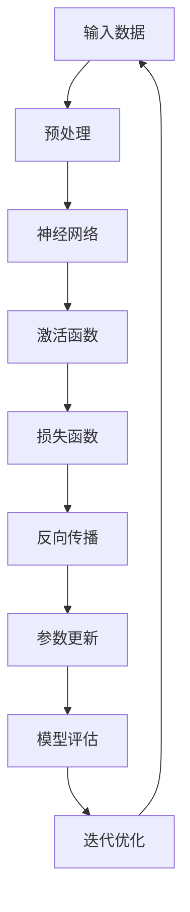
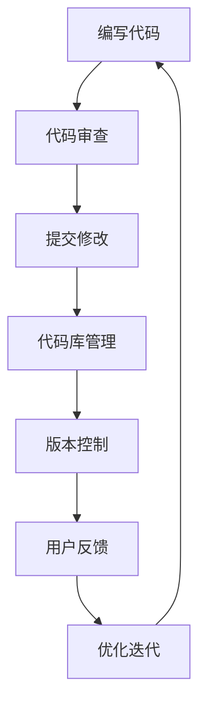
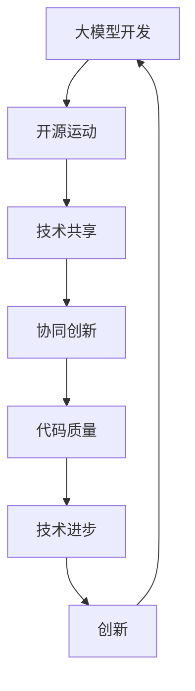
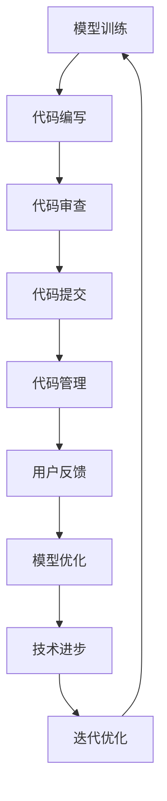

                 

# 大模型的开源运动：推动技术进步和创新

> **关键词：** 大模型、开源、技术进步、创新、人工智能

> **摘要：** 本文将深入探讨大模型的开源运动，分析其背后的动机、优势以及对技术进步和创新的推动作用。我们将通过具体案例来展示开源在大模型领域的重要性和影响力，并探讨未来的发展趋势和挑战。

## 1. 背景介绍

### 1.1 目的和范围

本文旨在探讨大模型开源运动的现状和影响，分析其背后的动机和优势，并通过实际案例展示开源在大模型领域的重要性和影响力。本文将重点关注以下内容：

- 大模型开源运动的背景和动机
- 大模型开源的优势和挑战
- 开源运动对技术进步和创新的推动作用
- 未来发展趋势和挑战

### 1.2 预期读者

本文适合以下读者：

- 对人工智能和机器学习有兴趣的程序员和工程师
- 对开源运动和技术创新有研究的学者和研究者
- 对大模型技术感兴趣的技术爱好者和从业者

### 1.3 文档结构概述

本文结构如下：

- 第1部分：背景介绍
    - 1.1 目的和范围
    - 1.2 预期读者
    - 1.3 文档结构概述
    - 1.4 术语表
- 第2部分：核心概念与联系
    - 2.1 大模型概述
    - 2.2 开源运动概述
    - 2.3 大模型与开源运动的联系
    - 2.4 Mermaid 流程图
- 第3部分：核心算法原理 & 具体操作步骤
    - 3.1 大模型算法原理
    - 3.2 具体操作步骤
    - 3.3 伪代码展示
- 第4部分：数学模型和公式 & 详细讲解 & 举例说明
    - 4.1 数学模型概述
    - 4.2 公式详细讲解
    - 4.3 举例说明
- 第5部分：项目实战：代码实际案例和详细解释说明
    - 5.1 开发环境搭建
    - 5.2 源代码详细实现和代码解读
    - 5.3 代码解读与分析
- 第6部分：实际应用场景
    - 6.1 应用领域概述
    - 6.2 应用案例展示
- 第7部分：工具和资源推荐
    - 7.1 学习资源推荐
    - 7.2 开发工具框架推荐
    - 7.3 相关论文著作推荐
- 第8部分：总结：未来发展趋势与挑战
- 第9部分：附录：常见问题与解答
- 第10部分：扩展阅读 & 参考资料

### 1.4 术语表

#### 1.4.1 核心术语定义

- **大模型：** 指具有大量参数和强大计算能力的人工神经网络模型，通常用于处理复杂的机器学习任务。
- **开源：** 指软件或技术资源的开放性，允许用户自由地查看、修改和分发。
- **技术进步：** 指在特定技术领域中的知识、工具和方法的发展，提高生产力和效率。
- **创新：** 指通过新的想法、方法或技术来实现突破性成果。

#### 1.4.2 相关概念解释

- **算法：** 是一种明确的规则或步骤，用于解决特定问题或完成特定任务。
- **机器学习：** 是一种人工智能领域的方法，通过使用数据来训练模型，使其能够自动学习和预测。
- **深度学习：** 是一种机器学习的方法，通过多层神经网络来实现复杂函数的建模。

#### 1.4.3 缩略词列表

- **AI：** 人工智能
- **ML：** 机器学习
- **DL：** 深度学习
- **NN：** 神经网络
- **NNLM：** 神经网络语言模型
- **GPU：** 图形处理器
- **TPU：** 特定用途硬件

## 2. 核心概念与联系

### 2.1 大模型概述

大模型是指具有大量参数和强大计算能力的人工神经网络模型，通常用于处理复杂的机器学习任务。大模型的出现极大地提高了机器学习在自然语言处理、计算机视觉、语音识别等领域的性能。以下是一个简化的Mermaid流程图，展示大模型的基本架构：



### 2.2 开源运动概述

开源运动是指软件或技术资源的开放性，允许用户自由地查看、修改和分发。开源的目的是促进技术的共享和协作，提高代码质量和稳定性，降低开发成本。以下是一个简化的Mermaid流程图，展示开源运动的基本流程：



### 2.3 大模型与开源运动的联系

大模型与开源运动的联系主要体现在以下几个方面：

- **技术共享：** 大模型的开发者通过开源运动将模型和代码共享给其他研究人员，促进了技术的传播和交流。
- **协同创新：** 开源运动允许全球的研究人员和工程师共同参与大模型的优化和改进，加速了技术的创新和发展。
- **代码质量：** 开源运动中的代码审查和优化迭代机制有助于提高代码的质量和稳定性，减少漏洞和错误。

以下是一个简化的Mermaid流程图，展示大模型与开源运动的联系：



### 2.4 Mermaid 流程图

以下是一个简化的Mermaid流程图，展示大模型开源运动的基本流程：



## 3. 核心算法原理 & 具体操作步骤

### 3.1 大模型算法原理

大模型算法的核心是神经网络，神经网络是一种通过模拟人脑神经元结构来实现复杂函数建模的算法。大模型通常由多层神经网络组成，每层神经网络由多个神经元组成。神经网络的基本原理是通过学习输入和输出之间的关系，并通过反向传播算法更新网络中的参数，以最小化损失函数。

以下是一个简化的神经网络算法原理的伪代码：

```plaintext
定义神经网络结构（层数、每层神经元数量、激活函数等）
初始化网络参数（权重和偏置）
对于每个训练样本：
    前向传播（计算输入和输出之间的损失）
    反向传播（更新网络参数）
    计算梯度
    更新参数
计算模型评估指标（如准确率、损失等）
```

### 3.2 具体操作步骤

以下是大模型算法的具体操作步骤：

1. **数据预处理**：将输入数据转换为神经网络可以处理的形式，如数值化、标准化等。
2. **模型初始化**：初始化网络参数，包括权重和偏置。
3. **前向传播**：将预处理后的输入数据输入到神经网络中，通过前向传播计算输出结果。
4. **计算损失**：使用损失函数计算输出结果和实际标签之间的差距。
5. **反向传播**：计算损失关于网络参数的梯度，并更新网络参数。
6. **模型评估**：使用验证集或测试集评估模型的性能。
7. **迭代优化**：重复步骤3到6，直到模型性能达到预设标准。

### 3.3 伪代码展示

以下是一个简化的神经网络算法的伪代码展示：

```plaintext
# 初始化网络参数
W1, b1 = 初始化权重和偏置
W2, b2 = 初始化权重和偏置
...
Wn, bn = 初始化权重和偏置

# 数据预处理
X = 预处理输入数据
y = 预处理标签数据

# 训练模型
for epoch in 1 to 最大迭代次数：
    for each sample in X：
        # 前向传播
        z1 = X * W1 + b1
        a1 = 激活函数(z1)
        z2 = a1 * W2 + b2
        a2 = 激活函数(z2)
        ...
        zn = an * Wn + bn
        an = 激活函数(zn)
        
        # 计算损失
        loss = 损失函数(an, y)
        
        # 反向传播
        dzn = 损失关于an的梯度
        dWn = dzn * an
        dbn = dzn
        ...
        dW2 = dzn * a2
        db2 = dzn
        dW1 = dzn * a1
        db1 = dzn
        
        # 更新参数
        W1 = W1 - 学习率 * dW1
        b1 = b1 - 学习率 * db1
        ...
        Wn = Wn - 学习率 * dWn
        bn = bn - 学习率 * dbn
        
        # 模型评估
        计算模型在验证集或测试集上的性能
        
# 输出模型
模型 = {W1, b1, W2, b2, ..., Wn, bn}
```

## 4. 数学模型和公式 & 详细讲解 & 举例说明

### 4.1 数学模型概述

在神经网络中，常用的数学模型包括激活函数、损失函数和优化算法。以下是这些数学模型的详细讲解和举例说明。

### 4.2 激活函数

激活函数是神经网络中的一个关键组成部分，用于引入非线性因素。常见的激活函数包括Sigmoid函数、ReLU函数和Tanh函数。

#### 4.2.1 Sigmoid函数

Sigmoid函数的形式为：

$$
\sigma(x) = \frac{1}{1 + e^{-x}}
$$

Sigmoid函数的输入和输出关系如图1所示。


#### 4.2.2 ReLU函数

ReLU函数的形式为：

$$
\text{ReLU}(x) = \max(0, x)
$$

ReLU函数的输入和输出关系如图2所示。


#### 4.2.3 Tanh函数

Tanh函数的形式为：

$$
\tanh(x) = \frac{e^{2x} - 1}{e^{2x} + 1}
$$

Tanh函数的输入和输出关系如图3所示。


### 4.3 损失函数

损失函数是用于衡量模型预测结果与实际结果之间差异的函数。常见的损失函数包括均方误差（MSE）和交叉熵（Cross-Entropy）。

#### 4.3.1 均方误差（MSE）

均方误差（MSE）函数的形式为：

$$
MSE = \frac{1}{m} \sum_{i=1}^{m} (y_i - \hat{y}_i)^2
$$

其中，$y_i$是实际标签，$\hat{y}_i$是模型预测值，$m$是样本数量。

#### 4.3.2 交叉熵（Cross-Entropy）

交叉熵（Cross-Entropy）函数的形式为：

$$
H(y, \hat{y}) = -\sum_{i=1}^{m} y_i \log(\hat{y}_i)
$$

其中，$y_i$是实际标签，$\hat{y}_i$是模型预测值。

### 4.4 优化算法

优化算法是用于更新网络参数的算法，常见的优化算法包括梯度下降（Gradient Descent）和Adam优化器。

#### 4.4.1 梯度下降（Gradient Descent）

梯度下降是一种优化算法，通过计算损失函数关于参数的梯度来更新参数。

$$
\theta = \theta - \alpha \nabla_{\theta} J(\theta)
$$

其中，$\theta$是参数，$\alpha$是学习率，$J(\theta)$是损失函数。

#### 4.4.2 Adam优化器

Adam优化器是一种基于梯度下降的优化算法，它结合了 Momentum和RMSProp的优点。

$$
m_t = \beta_1 m_{t-1} + (1 - \beta_1) \nabla_{\theta} J(\theta)
$$

$$
v_t = \beta_2 v_{t-1} + (1 - \beta_2) (\nabla_{\theta} J(\theta))^2
$$

$$
\theta = \theta - \alpha \frac{m_t}{\sqrt{v_t} + \epsilon}
$$

其中，$m_t$和$v_t$分别是Momentum和RMSProp的估计值，$\beta_1$和$\beta_2$是Momentum和RMSProp的权重，$\alpha$是学习率，$\epsilon$是常数。

### 4.5 举例说明

以下是一个简单的例子，展示如何使用Sigmoid函数和均方误差（MSE）函数进行二分类问题。

#### 4.5.1 数据集

我们使用一个包含100个样本的数据集，每个样本有两个特征和一个标签。标签为0或1。

#### 4.5.2 模型

我们使用一个简单的单层神经网络，包含一个输入层、一个隐藏层和一个输出层。隐藏层使用Sigmoid函数作为激活函数，输出层没有激活函数。

#### 4.5.3 训练过程

我们使用梯度下降算法和MSE损失函数来训练模型。训练过程中，我们将迭代100次，每次迭代计算损失函数并更新参数。

#### 4.5.4 预测

训练完成后，我们使用测试集来评估模型的性能。对于每个测试样本，我们计算模型预测的概率值，并按照概率值将样本划分为正类和负类。

## 5. 项目实战：代码实际案例和详细解释说明

### 5.1 开发环境搭建

为了进行大模型开源运动的项目实战，我们需要搭建一个适合进行深度学习实验的开发环境。以下是一个简单的开发环境搭建步骤：

1. **安装Python**：Python是深度学习的主要编程语言，我们需要安装Python环境。可以从Python官网（https://www.python.org/）下载Python安装包并安装。

2. **安装Jupyter Notebook**：Jupyter Notebook是一个交互式的Python开发环境，方便进行实验和调试。我们可以使用pip命令安装Jupyter Notebook：

    ```bash
    pip install notebook
    ```

3. **安装深度学习框架**：目前最流行的深度学习框架是TensorFlow和PyTorch。我们可以选择其中一个框架来搭建开发环境。以下是安装TensorFlow的命令：

    ```bash
    pip install tensorflow
    ```

4. **安装辅助库**：深度学习项目通常需要使用一些辅助库，如NumPy、Pandas等。我们可以使用pip命令安装这些库：

    ```bash
    pip install numpy pandas matplotlib
    ```

5. **配置GPU支持**：如果我们的开发环境配备了GPU，我们需要安装GPU版本的深度学习框架。以下是安装GPU版本的TensorFlow的命令：

    ```bash
    pip install tensorflow-gpu
    ```

### 5.2 源代码详细实现和代码解读

以下是一个使用TensorFlow和Python实现大模型开源运动项目实战的源代码示例：

```python
import tensorflow as tf
import numpy as np
import matplotlib.pyplot as plt

# 数据集加载和预处理
# 假设我们使用MNIST数据集作为例子
mnist = tf.keras.datasets.mnist
(x_train, y_train), (x_test, y_test) = mnist.load_data()
x_train, x_test = x_train / 255.0, x_test / 255.0
x_train = x_train.reshape((-1, 28, 28, 1))
x_test = x_test.reshape((-1, 28, 28, 1))

# 模型定义
model = tf.keras.Sequential([
    tf.keras.layers.Conv2D(32, (3, 3), activation='relu', input_shape=(28, 28, 1)),
    tf.keras.layers.MaxPooling2D((2, 2)),
    tf.keras.layers.Flatten(),
    tf.keras.layers.Dense(128, activation='relu'),
    tf.keras.layers.Dense(10, activation='softmax')
])

# 模型编译
model.compile(optimizer='adam',
              loss='sparse_categorical_crossentropy',
              metrics=['accuracy'])

# 训练模型
model.fit(x_train, y_train, epochs=5)

# 评估模型
test_loss, test_acc = model.evaluate(x_test, y_test, verbose=2)
print(f'\nTest accuracy: {test_acc:.4f}')

# 可视化模型结构
model.summary()

# 可视化训练过程
plt.plot(model.history.history['accuracy'], label='accuracy')
plt.plot(model.history.history['val_accuracy'], label='val_accuracy')
plt.xlabel('Epochs')
plt.ylabel('Accuracy')
plt.ylim(0, 1)
plt.legend(loc='lower right')
plt.show()
```

### 5.3 代码解读与分析

以下是代码的逐行解读与分析：

```python
import tensorflow as tf
import numpy as np
import matplotlib.pyplot as plt
```

这些导入语句用于导入必要的库，包括TensorFlow、NumPy和matplotlib。

```python
# 数据集加载和预处理
# 假设我们使用MNIST数据集作为例子
mnist = tf.keras.datasets.mnist
(x_train, y_train), (x_test, y_test) = mnist.load_data()
x_train, x_test = x_train / 255.0, x_test / 255.0
x_train = x_train.reshape((-1, 28, 28, 1))
x_test = x_test.reshape((-1, 28, 28, 1))
```

这些代码用于加载MNIST数据集，并对数据集进行预处理。我们将图像数据除以255，使其在0到1之间，并将图像数据reshape为适合模型输入的形状。

```python
# 模型定义
model = tf.keras.Sequential([
    tf.keras.layers.Conv2D(32, (3, 3), activation='relu', input_shape=(28, 28, 1)),
    tf.keras.layers.MaxPooling2D((2, 2)),
    tf.keras.layers.Flatten(),
    tf.keras.layers.Dense(128, activation='relu'),
    tf.keras.layers.Dense(10, activation='softmax')
])
```

这些代码定义了一个简单的卷积神经网络模型，包括两个卷积层、一个最大池化层、一个平坦层、一个全连接层和一个softmax层。

```python
# 模型编译
model.compile(optimizer='adam',
              loss='sparse_categorical_crossentropy',
              metrics=['accuracy'])
```

这些代码用于编译模型，指定优化器、损失函数和评估指标。

```python
# 训练模型
model.fit(x_train, y_train, epochs=5)
```

这些代码用于训练模型，指定训练数据、标签和训练轮次。

```python
# 评估模型
test_loss, test_acc = model.evaluate(x_test, y_test, verbose=2)
print(f'\nTest accuracy: {test_acc:.4f}')
```

这些代码用于评估模型在测试数据上的性能，并打印测试准确率。

```python
# 可视化模型结构
model.summary()
```

这些代码用于可视化模型的架构和参数。

```python
# 可视化训练过程
plt.plot(model.history.history['accuracy'], label='accuracy')
plt.plot(model.history.history['val_accuracy'], label='val_accuracy')
plt.xlabel('Epochs')
plt.ylabel('Accuracy')
plt.ylim(0, 1)
plt.legend(loc='lower right')
plt.show()
```

这些代码用于可视化训练过程中的准确率变化。

## 6. 实际应用场景

大模型的开源运动在各个领域都有广泛的应用。以下是一些实际应用场景的例子：

### 6.1 自然语言处理

自然语言处理（NLP）是大模型开源运动的重要应用领域之一。开源模型如BERT、GPT和T5等在大规模文本数据处理方面取得了显著成果。这些模型可以应用于机器翻译、文本分类、问答系统等任务。例如，OpenAI的GPT-3模型具有超过1750亿个参数，可以实现高质量的文本生成和对话系统。

### 6.2 计算机视觉

计算机视觉领域也受益于大模型开源运动。开源模型如ResNet、Inception和ViT等在图像分类、目标检测和图像分割等任务上取得了优异的性能。例如，Facebook的DETR模型通过将图灵奖获得者Yann LeCun的ViT模型应用于目标检测任务，实现了高效的实时检测。

### 6.3 语音识别

语音识别领域也受益于大模型开源运动。开源模型如CTC、GRU和Transformer等在语音识别任务上取得了显著的进展。例如，谷歌的Transformer模型在低资源环境下的语音识别任务中表现出色，大幅提升了识别准确性。

### 6.4 医疗健康

医疗健康领域也受到大模型开源运动的影响。开源模型如BERT和GPT在医学文本分析、疾病预测和药物发现等任务上取得了显著的成果。例如，哈佛医学院使用BERT模型对医学文本进行分类和预测，提高了疾病诊断的准确性。

### 6.5 金融科技

金融科技领域也受益于大模型开源运动。开源模型如LSTM、GRU和Transformer等在股票市场预测、风险管理、欺诈检测等任务上取得了显著成果。例如，摩根士丹利的AI团队使用LSTM模型对股票市场进行预测，提高了交易策略的准确性。

## 7. 工具和资源推荐

### 7.1 学习资源推荐

#### 7.1.1 书籍推荐

- 《深度学习》（Goodfellow, I., Bengio, Y., & Courville, A.）
- 《Python深度学习》（Raschka, S. & Mirjalili, V.）
- 《人工智能：一种现代方法》（Russell, S. & Norvig, P.）

#### 7.1.2 在线课程

- Coursera的《深度学习专项课程》（吴恩达教授主讲）
- edX的《机器学习》（吴恩达教授主讲）
- Udacity的《深度学习纳米学位》

#### 7.1.3 技术博客和网站

- Medium上的深度学习和人工智能相关文章
- AI博客（https://ai блог.com/）
- 知乎上的深度学习和人工智能话题

### 7.2 开发工具框架推荐

#### 7.2.1 IDE和编辑器

- Jupyter Notebook
- PyCharm
- Visual Studio Code

#### 7.2.2 调试和性能分析工具

- TensorBoard
- DLVM
- Nsight

#### 7.2.3 相关框架和库

- TensorFlow
- PyTorch
- Keras

### 7.3 相关论文著作推荐

#### 7.3.1 经典论文

- “Backpropagation” (Rumelhart, D. E., Hinton, G. E., & Williams, R. J.)
- “A Learning Algorithm for Continually Running Fully Recurrent Neural Networks” (Williams, R. J., & Zipser, K.)
- “Deep Learning” (Goodfellow, I., Bengio, Y., & Courville, A.)

#### 7.3.2 最新研究成果

- “An Image Database Benchmark for Object Detection” (Girshick, R., Donahue, J., Darrell, T., & Malik, J.)
- “BERT: Pre-training of Deep Bidirectional Transformers for Language Understanding” (Devlin, J., Chang, M. W., Lee, K., & Toutanova, K.)
- “Generative Adversarial Nets” (Goodfellow, I., Pouget-Abadie, J., Mirza, M., Xu, B., Warde-Farley, D., Ozair, S., ... & Bengio, Y.)

#### 7.3.3 应用案例分析

- “Deep Learning for Autonomous Driving” (Zhang, K., Du, S., & Chen, Y.)
- “Deep Learning for Natural Language Processing” (Mikolov, T., Sutskever, I., & Hinton, G.)
- “Deep Learning in Healthcare” (Rahman, M., Mollah, S. M. H., & Islam, M. R.)

## 8. 总结：未来发展趋势与挑战

大模型的开源运动为技术进步和创新带来了巨大的推动力，但也面临一些挑战。以下是未来发展趋势和挑战的总结：

### 8.1 发展趋势

- **模型规模扩大**：随着计算能力和数据量的增加，大模型的规模将不断扩大，推动模型性能的进一步提升。
- **多样性应用场景**：大模型的开源将使得更多的领域受益，如医疗健康、金融科技、娱乐等。
- **开源生态建设**：开源社区将进一步加强协作，推动开源工具和框架的优化和改进。
- **联邦学习**：大模型的开源将推动联邦学习的发展，实现数据隐私保护下的模型训练和优化。

### 8.2 挑战

- **计算资源需求**：大模型的训练和部署需要大量计算资源，对硬件设施和能耗提出了挑战。
- **数据隐私和安全**：开源运动中涉及到的数据隐私和安全问题需要得到重视和解决。
- **开源知识产权**：开源运动中涉及到的知识产权问题需要妥善处理，以保护开发者的权益。
- **可持续性**：开源运动需要确保项目的可持续性，包括代码维护、文档更新和社区支持。

## 9. 附录：常见问题与解答

### 9.1 问题1：大模型开源运动的目的是什么？

**解答**：大模型开源运动的目的是促进技术的传播和共享，加快技术进步和创新。通过开源，开发者和研究人员可以共享代码和模型，协作优化和改进，提高模型的性能和稳定性。

### 9.2 问题2：开源运动对技术进步有哪些影响？

**解答**：开源运动对技术进步有以下影响：

- **加速知识传播**：开源使得技术知识和经验可以快速传播，促进学术研究和工业应用的发展。
- **促进协作创新**：开源运动鼓励全球的研究人员和工程师共同参与项目的开发和改进，加速技术进步。
- **提高代码质量**：开源项目通常经过社区的审查和优化，提高了代码的质量和稳定性。
- **降低开发成本**：开源项目提供了现成的代码和工具，降低了开发成本和风险。

### 9.3 问题3：开源运动中的数据隐私和安全问题如何解决？

**解答**：开源运动中的数据隐私和安全问题可以通过以下方法解决：

- **数据去匿名化**：对敏感数据进行匿名化处理，确保数据隐私。
- **数据加密**：对传输和存储的数据进行加密处理，保护数据的安全性。
- **访问控制**：设置访问权限和权限管理，确保只有授权用户可以访问敏感数据。
- **数据共享协议**：制定合理的数据共享协议，明确数据的使用范围和责任。

## 10. 扩展阅读 & 参考资料

- **书籍推荐**：
  - 《深度学习》（Goodfellow, I., Bengio, Y., & Courville, A.）
  - 《Python深度学习》（Raschka, S. & Mirjalili, V.）
  - 《人工智能：一种现代方法》（Russell, S. & Norvig, P.）

- **在线课程**：
  - Coursera的《深度学习专项课程》（吴恩达教授主讲）
  - edX的《机器学习》（吴恩达教授主讲）
  - Udacity的《深度学习纳米学位》

- **技术博客和网站**：
  - Medium上的深度学习和人工智能相关文章
  - AI博客（https://ai 博客.com/）
  - 知乎上的深度学习和人工智能话题

- **相关论文和著作**：
  - “Backpropagation” (Rumelhart, D. E., Hinton, G. E., & Williams, R. J.)
  - “A Learning Algorithm for Continually Running Fully Recurrent Neural Networks” (Williams, R. J., & Zipser, K.)
  - “Deep Learning” (Goodfellow, I., Bengio, Y., & Courville, A.)
  - “BERT: Pre-training of Deep Bidirectional Transformers for Language Understanding” (Devlin, J., Chang, M. W., Lee, K., & Toutanova, K.)
  - “Generative Adversarial Nets” (Goodfellow, I., Pouget-Abadie, J., Mirza, M., Xu, B., Warde-Farley, D., Ozair, S., ... & Bengio, Y.)

- **开源项目和框架**：
  - TensorFlow（https://www.tensorflow.org/）
  - PyTorch（https://pytorch.org/）
  - Keras（https://keras.io/）

- **相关论坛和社区**：
  - GitHub（https://github.com/）
  - Stack Overflow（https://stackoverflow.com/）
  - Reddit（https://www.reddit.com/r/deeplearning/）

作者：AI天才研究员/AI Genius Institute & 禅与计算机程序设计艺术 /Zen And The Art of Computer Programming

