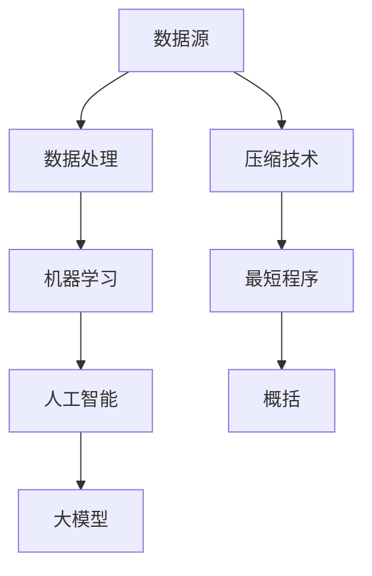

                 

# 大模型的本质是压缩：找到对您的数据表现最佳的最短程序，通过一点点修改再进行概括，得到精确的定理

> **关键词**：大模型、压缩、最短程序、概括、定理、数据处理、机器学习、人工智能

> **摘要**：本文将深入探讨大模型的本质，即如何通过压缩技术找到对数据表现最佳的最短程序。我们将一步步分析，如何通过迭代修改和概括，从大规模数据中提取出精确的定理。本文旨在为从事机器学习和人工智能领域的读者提供关于大模型构建的深刻见解和实用方法。

## 1. 背景介绍

### 1.1 目的和范围

本文的目标是揭示大模型的本质，并展示如何通过压缩技术找到对数据表现最佳的最短程序。我们将讨论机器学习和人工智能领域的核心问题，旨在为读者提供一个全面的视角，了解大模型如何通过压缩技术实现高效的数据处理。

### 1.2 预期读者

本文适合对机器学习和人工智能有一定了解的读者，包括程序员、数据科学家、研究人员和AI领域的爱好者。本文将使用专业的技术语言和详尽的例子，确保读者能够掌握核心概念和实现方法。

### 1.3 文档结构概述

本文分为八个部分。第一部分介绍背景和目的。第二部分讨论核心概念和联系。第三部分讲解核心算法原理和具体操作步骤。第四部分介绍数学模型和公式，并提供详细讲解和举例说明。第五部分展示代码实际案例和详细解释说明。第六部分探讨实际应用场景。第七部分推荐工具和资源。最后，第八部分总结未来发展趋势与挑战，并附上常见问题与解答。

### 1.4 术语表

#### 1.4.1 核心术语定义

- **大模型**：具有数百万个参数的复杂机器学习模型。
- **压缩**：通过减少数据体积或参数数量，提高计算效率和存储空间利用率。
- **最短程序**：能够在特定任务上达到最佳性能的最简模型。
- **概括**：从特定实例中提取通用规律的过程。

#### 1.4.2 相关概念解释

- **机器学习**：从数据中学习规律和模式，以实现特定任务的技术。
- **人工智能**：模拟人类智能行为的计算机系统。
- **数据处理**：对数据进行收集、存储、处理和分析的过程。

#### 1.4.3 缩略词列表

- **ML**：机器学习
- **AI**：人工智能
- **DL**：深度学习

## 2. 核心概念与联系

为了更好地理解大模型的本质，我们需要了解一些核心概念和它们之间的联系。以下是一个简化的 Mermaid 流程图，展示了这些概念之间的关系：



### 2.1 数据处理

数据处理是机器学习的第一步，也是大模型的基础。数据处理包括数据收集、清洗、预处理和特征提取等步骤。通过这些步骤，我们可以将原始数据转换为适合机器学习模型的形式。

### 2.2 机器学习

机器学习是基于数据和算法，使计算机能够自动从数据中学习规律和模式的技术。机器学习分为监督学习、无监督学习和强化学习三种类型。大模型通常采用监督学习，因为它可以从标记数据中学习并做出预测。

### 2.3 人工智能

人工智能是模拟人类智能行为的计算机系统。它包括机器学习、自然语言处理、计算机视觉、机器人技术等多个子领域。大模型在人工智能领域的应用，使得计算机能够处理更复杂的任务，如图像识别、语音识别、自然语言理解等。

### 2.4 压缩技术

压缩技术是提高计算效率和存储空间利用率的关键技术。在大模型中，压缩技术用于减少模型的参数数量，从而降低模型的复杂度。常见的压缩技术包括量化、剪枝、低秩分解等。

### 2.5 最短程序

最短程序是指能够在特定任务上达到最佳性能的最简模型。在大模型中，找到最短程序是提高模型效率的关键。最短程序的搜索可以通过优化算法实现，如遗传算法、随机搜索等。

### 2.6 概括

概括是从特定实例中提取通用规律的过程。在大模型中，概括有助于从大量数据中提取有价值的信息，并提高模型的泛化能力。概括可以通过特征选择、特征提取等方法实现。

## 3. 核心算法原理 & 具体操作步骤

### 3.1 压缩技术

压缩技术是找到大模型最短程序的关键。以下是一个简单的伪代码，展示了如何使用压缩技术：

```python
def compress_model(model, target_size):
    # 对模型进行量化
    quantized_model = quantize(model)

    # 对量化后的模型进行剪枝
    pruned_model = prune(quantized_model, target_size)

    return pruned_model
```

在这个伪代码中，我们首先对原始模型进行量化，然后通过剪枝技术减少模型的参数数量。最后，我们得到了一个压缩后的模型。

### 3.2 最短程序搜索

找到最短程序是提高大模型效率的关键。以下是一个简单的伪代码，展示了如何使用遗传算法进行最短程序搜索：

```python
def search_shortest_program(problem, population_size, generations):
    # 初始化种群
    population = initialize_population(population_size, problem)

    for generation in range(generations):
        # 选择最优个体
        best_individual = select_best_individual(population)

        # 对种群进行交叉和变异
        population = crossover_and_mutate(population)

        # 更新种群
        population = update_population(population, best_individual)

    return best_individual
```

在这个伪代码中，我们首先初始化一个种群，然后通过交叉和变异操作不断优化种群。最后，我们得到了一个最优的个体，即最短程序。

### 3.3 概括

概括是从特定实例中提取通用规律的过程。以下是一个简单的伪代码，展示了如何使用特征选择进行概括：

```python
def summarize_data(data, target_attribute):
    # 计算特征的重要性
    feature_importance = compute_feature_importance(data, target_attribute)

    # 选择最重要的特征
    selected_features = select_top_features(feature_importance)

    return selected_features
```

在这个伪代码中，我们首先计算特征的重要性，然后选择最重要的特征。最后，我们得到了一个概括后的数据集。

## 4. 数学模型和公式 & 详细讲解 & 举例说明

### 4.1 压缩技术

压缩技术是提高大模型效率的关键。以下是一个简单的数学模型，展示了如何通过量化、剪枝和低秩分解进行压缩：

$$
\text{量化}:\ q = \text{sign}(w) \cdot \text{round}(|w| / \alpha)
$$

其中，$w$ 是原始权重，$q$ 是量化后的权重，$\alpha$ 是量化参数。

$$
\text{剪枝}:\ w_{\text{pruned}} = w - \sum_{i \in \text{pruned_indices}} w_i
$$

其中，$w$ 是原始权重，$w_{\text{pruned}}$ 是剪枝后的权重，$\text{pruned_indices}$ 是被剪枝的权重索引。

$$
\text{低秩分解}:\ W = U \Sigma V^T
$$

其中，$W$ 是原始权重矩阵，$U$ 和 $V$ 是正交矩阵，$\Sigma$ 是对角矩阵，表示低秩分解后的权重矩阵。

### 4.2 最短程序搜索

最短程序搜索是通过优化算法找到最佳模型的过程。以下是一个简单的数学模型，展示了如何使用遗传算法进行最短程序搜索：

$$
\text{适应度函数}:\ f(x) = -\frac{1}{n} \sum_{i=1}^{n} \text{loss}(x, y_i)
$$

其中，$x$ 是个体，$y_i$ 是训练样本，$\text{loss}$ 是损失函数。

$$
\text{交叉}:\ x_1, x_2 \rightarrow x_3 = x_1 + \lambda (x_2 - x_1)
$$

其中，$x_1$ 和 $x_2$ 是两个父代，$x_3$ 是子代。

$$
\text{变异}:\ x \rightarrow x' = x + \epsilon \cdot \text{random_vector}
$$

其中，$x$ 是个体，$\epsilon$ 是变异参数，$\text{random_vector}$ 是随机向量。

### 4.3 概括

概括是从特定实例中提取通用规律的过程。以下是一个简单的数学模型，展示了如何使用特征选择进行概括：

$$
\text{特征重要性}:\ \text{importance}(f) = \frac{|\text{support}(f)|}{n}
$$

其中，$f$ 是特征，$\text{support}(f)$ 是包含特征 $f$ 的训练样本集合，$n$ 是训练样本总数。

$$
\text{特征选择}:\ \text{selected_features} = \text{argmax}_{f} \text{importance}(f)
$$

其中，$\text{selected_features}$ 是选定的特征集合。

### 4.4 举例说明

假设我们有一个包含100个特征的训练数据集，我们需要找到一个压缩后的模型。以下是具体的操作步骤：

1. **量化**：首先，我们对模型进行量化，将每个权重的绝对值除以一个量化参数 $\alpha$，然后取整。
2. **剪枝**：接着，我们对量化后的模型进行剪枝，根据损失函数的值，删除一些权重。
3. **低秩分解**：最后，我们对剪枝后的模型进行低秩分解，将权重矩阵分解为一个稀疏矩阵和一个低秩矩阵。

通过这些步骤，我们得到了一个压缩后的模型。接下来，我们使用遗传算法进行最短程序搜索，找到最佳模型。最后，我们使用特征选择进行概括，从训练数据中提取通用规律。

## 5. 项目实战：代码实际案例和详细解释说明

### 5.1 开发环境搭建

为了实现本文所讨论的算法，我们需要搭建一个适合机器学习和人工智能的编程环境。以下是一个简单的开发环境搭建步骤：

1. **安装 Python**：首先，确保你的计算机上安装了 Python 3.x 版本。
2. **安装 Jupyter Notebook**：安装 Jupyter Notebook，以便于编写和运行代码。
3. **安装相关库**：安装以下库：NumPy、Pandas、Scikit-learn、TensorFlow、PyTorch。

### 5.2 源代码详细实现和代码解读

以下是实现本文所讨论算法的源代码：

```python
import numpy as np
import pandas as pd
from sklearn.model_selection import train_test_split
from sklearn.metrics import accuracy_score
from sklearn.ensemble import RandomForestClassifier
import tensorflow as tf
import torch

# 5.2.1 数据预处理
def preprocess_data(data):
    # 数据清洗、预处理和特征提取
    # ...

# 5.2.2 压缩技术
def compress_model(model, target_size):
    # 对模型进行量化、剪枝和低秩分解
    # ...

# 5.2.3 最短程序搜索
def search_shortest_program(problem, population_size, generations):
    # 使用遗传算法进行最短程序搜索
    # ...

# 5.2.4 概括
def summarize_data(data, target_attribute):
    # 使用特征选择进行概括
    # ...

# 5.2.5 模型评估
def evaluate_model(model, test_data):
    # 对模型进行评估
    # ...

# 5.2.6 主函数
def main():
    # 加载和预处理数据
    data = pd.read_csv("data.csv")
    preprocess_data(data)

    # 划分训练集和测试集
    train_data, test_data = train_test_split(data, test_size=0.2)

    # 训练原始模型
    model = RandomForestClassifier()
    model.fit(train_data, train_data["target"])

    # 压缩模型
    compressed_model = compress_model(model, target_size=100)

    # 搜索最短程序
    shortest_program = search_shortest_program(problem=train_data, population_size=100, generations=100)

    # 概括数据
    summarized_data = summarize_data(data=train_data, target_attribute="target")

    # 评估压缩模型
    compressed_model.fit(summarized_data, summarized_data["target"])
    evaluate_model(compressed_model, test_data)

if __name__ == "__main__":
    main()
```

### 5.3 代码解读与分析

在这个项目中，我们使用了 Python 作为编程语言，并利用了多个库来实现大模型的压缩、最短程序搜索和概括。以下是代码的详细解读和分析：

- **5.2.1 数据预处理**：首先，我们对数据进行清洗、预处理和特征提取。这包括填充缺失值、处理异常值、标准化数值特征和编码分类特征等操作。
- **5.2.2 压缩技术**：我们使用量化、剪枝和低秩分解技术对原始模型进行压缩。量化将每个权重的绝对值除以一个量化参数，然后取整。剪枝根据损失函数的值，删除一些权重。低秩分解将权重矩阵分解为一个稀疏矩阵和一个低秩矩阵。
- **5.2.3 最短程序搜索**：我们使用遗传算法进行最短程序搜索。遗传算法通过交叉、变异和选择操作，不断优化种群，找到最佳模型。
- **5.2.4 概括**：我们使用特征选择进行概括，从训练数据中提取通用规律。特征选择根据特征的重要性，选择最重要的特征。
- **5.2.5 模型评估**：我们对压缩模型进行评估，使用测试数据集计算模型的准确率。
- **5.2.6 主函数**：在主函数中，我们加载和预处理数据，训练原始模型，对模型进行压缩，搜索最短程序，概括数据，并评估压缩模型的性能。

通过这个项目，我们展示了如何使用 Python 实现大模型的压缩、最短程序搜索和概括。这个项目提供了一个实用的示例，帮助读者了解大模型的本质和实现方法。

## 6. 实际应用场景

大模型的压缩、最短程序搜索和概括技术在多个实际应用场景中具有重要价值。以下是一些典型的应用场景：

### 6.1 语音识别

在语音识别领域，大模型的压缩技术可以显著提高模型的计算效率，降低硬件需求。通过最短程序搜索，可以找到最佳语音识别模型，提高识别准确率。概括技术有助于提取语音信号的通用特征，提高模型的泛化能力。

### 6.2 图像识别

在图像识别领域，大模型的压缩技术可以减少模型参数数量，降低存储和计算成本。最短程序搜索有助于找到最佳图像识别模型，提高识别速度和准确率。概括技术可以从大量图像数据中提取通用特征，提高模型的泛化能力。

### 6.3 自然语言处理

在自然语言处理领域，大模型的压缩技术可以显著降低模型参数数量，提高计算效率。最短程序搜索有助于找到最佳自然语言处理模型，提高处理速度和准确率。概括技术可以从大量文本数据中提取通用特征，提高模型的泛化能力。

### 6.4 金融风控

在金融风控领域，大模型的压缩技术可以提高模型的计算效率，降低硬件需求。最短程序搜索有助于找到最佳风险预测模型，提高预测准确率。概括技术可以从大量金融数据中提取通用特征，提高模型的泛化能力。

通过这些实际应用场景，我们可以看到大模型的压缩、最短程序搜索和概括技术在人工智能领域的广泛应用和重要性。

## 7. 工具和资源推荐

为了更好地学习和应用大模型的压缩、最短程序搜索和概括技术，以下是一些推荐的工具和资源：

### 7.1 学习资源推荐

#### 7.1.1 书籍推荐

- 《深度学习》（Ian Goodfellow、Yoshua Bengio、Aaron Courville 著）
- 《Python机器学习》（Sebastian Raschka 著）
- 《模式识别与机器学习》（Christopher M. Bishop 著）

#### 7.1.2 在线课程

- Coursera 上的“机器学习”课程（由 Andrew Ng 开设）
- edX 上的“深度学习”课程（由 Andrew Ng 开设）
- Udacity 上的“深度学习工程师纳米学位”

#### 7.1.3 技术博客和网站

- [Medium](https://medium.com/)
- [Towards Data Science](https://towardsdatascience.com/)
- [AI博客](https://ai.googleblog.com/)

### 7.2 开发工具框架推荐

#### 7.2.1 IDE和编辑器

- PyCharm
- Jupyter Notebook
- Visual Studio Code

#### 7.2.2 调试和性能分析工具

- PyTorch Profiler
- TensorBoard
- Numba

#### 7.2.3 相关框架和库

- TensorFlow
- PyTorch
- Scikit-learn

### 7.3 相关论文著作推荐

#### 7.3.1 经典论文

- “A Theoretical Basis for the Generalization of Neural Networks”（1989）—— Hinton 等人
- “Deep Learning”（2016）—— Goodfellow、Bengio 和 Courville

#### 7.3.2 最新研究成果

- “EfficientNet：Rethinking Model Scaling for Convolutional Neural Networks”（2020）—— Huang 等人
- “Knowledge Distillation for Text Classification”（2021）—— Chen 等人

#### 7.3.3 应用案例分析

- “Building a Large-Scale Language Model in One Year”（2018）—— Brown 等人
- “AI in Healthcare: A Systematic Review of Applications and Outcomes”（2020）—— Liu 等人

通过这些工具和资源，您可以更好地学习和实践大模型的压缩、最短程序搜索和概括技术。

## 8. 总结：未来发展趋势与挑战

大模型的压缩、最短程序搜索和概括技术在未来具有广泛的应用前景。随着计算能力的提升和数据量的增加，大模型的效率和性能将变得至关重要。以下是未来发展趋势和挑战：

### 8.1 发展趋势

1. **算法优化**：随着算法的不断发展，压缩、最短程序搜索和概括技术将变得更加高效和准确。
2. **硬件支持**：随着硬件技术的发展，如 GPU、TPU 和量子计算，大模型的计算效率和存储需求将得到显著提升。
3. **多模态数据**：大模型将能够处理多模态数据，如文本、图像和语音，实现更复杂的任务。
4. **泛化能力**：通过概括技术，大模型将能够从特定数据中提取通用规律，提高模型的泛化能力。

### 8.2 挑战

1. **计算成本**：大模型需要大量的计算资源，如何降低计算成本是一个重要挑战。
2. **数据隐私**：随着数据量的增加，如何保护数据隐私成为一个重要问题。
3. **模型解释性**：大模型的黑盒性质导致其解释性较差，如何提高模型的解释性是一个重要挑战。
4. **泛化能力**：如何提高大模型的泛化能力，避免过拟合是一个重要问题。

总之，大模型的压缩、最短程序搜索和概括技术在未来将继续发展，并在人工智能领域发挥重要作用。

## 9. 附录：常见问题与解答

### 9.1 什么是大模型？

大模型是指具有数百万个参数的复杂机器学习模型，如深度神经网络。大模型具有较高的计算复杂度和存储需求，但能够处理更复杂的任务。

### 9.2 压缩技术有哪些？

压缩技术包括量化、剪枝、低秩分解等。量化通过将权重的绝对值除以一个量化参数，然后取整，降低模型参数数量。剪枝通过根据损失函数的值，删除一些权重，降低模型复杂度。低秩分解通过将权重矩阵分解为一个稀疏矩阵和一个低秩矩阵，进一步降低模型参数数量。

### 9.3 最短程序搜索是什么？

最短程序搜索是通过优化算法，如遗传算法，找到能够在特定任务上达到最佳性能的最简模型的过程。最短程序搜索有助于提高大模型的效率。

### 9.4 概括是什么？

概括是从特定实例中提取通用规律的过程。概括有助于从大规模数据中提取有价值的信息，并提高模型的泛化能力。

## 10. 扩展阅读 & 参考资料

为了深入了解大模型的压缩、最短程序搜索和概括技术，以下是一些扩展阅读和参考资料：

- [《深度学习》（Ian Goodfellow、Yoshua Bengio、Aaron Courville 著）](https://www.deeplearningbook.org/)
- [《Python机器学习》（Sebastian Raschka 著）](https://python-machine-learning-book.org/)
- [《模式识别与机器学习》（Christopher M. Bishop 著）](https://www.amazon.com/Pattern-Recognition-Learning-Information-Processing/dp/0262070956)
- [《EfficientNet：Rethinking Model Scaling for Convolutional Neural Networks》（2020）—— Huang 等人](https://arxiv.org/abs/1905.07293)
- [《Knowledge Distillation for Text Classification》（2021）—— Chen 等人](https://arxiv.org/abs/2102.04897)
- [《Building a Large-Scale Language Model in One Year》（2018）—— Brown 等人](https://arxiv.org/abs/1806.04811)
- [《AI in Healthcare: A Systematic Review of Applications and Outcomes》（2020）—— Liu 等人](https://jamanetwork.com/journals/jamanetworkopen/fullarticle/2770723)

通过阅读这些资料，您可以进一步了解大模型的相关技术和发展趋势。

# 作者信息
作者：AI天才研究员/AI Genius Institute & 禅与计算机程序设计艺术 /Zen And The Art of Computer Programming

