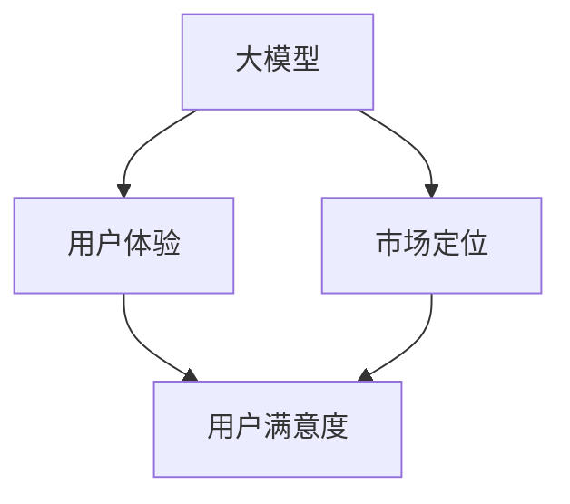

                 

# 大模型的用户体验与市场定位

> **关键词**：大模型、用户体验、市场定位、AI技术、数据驱动、用户反馈、产品迭代
> 
> **摘要**：本文将深入探讨大模型的用户体验与市场定位的重要性。通过分析大模型的核心特点、用户体验的构建方法、市场定位策略以及相关技术和工具的应用，本文旨在为企业和开发者提供有价值的见解，以提升大模型产品的市场竞争力和用户满意度。

## 1. 背景介绍

### 1.1 目的和范围

本文旨在探讨大模型的用户体验与市场定位，为企业和开发者提供理论指导与实践方法。大模型在人工智能领域具有重要地位，其性能的提升对各行各业产生深远影响。然而，大模型在用户体验和市场定位方面仍存在诸多挑战，本文将重点关注以下几个方面：

- 大模型的核心特点及其对用户体验的影响
- 构建优质用户体验的方法与策略
- 市场定位的重要性及其策略制定
- 相关技术与工具的应用与推荐

通过以上探讨，本文旨在帮助企业和开发者更好地理解和应对大模型带来的机遇与挑战，提升产品的市场竞争力和用户满意度。

### 1.2 预期读者

本文面向人工智能领域的企业家、产品经理、开发者以及学术研究人员。以下读者群体将从中受益：

- 对大模型技术感兴趣并希望了解其应用的企业家
- 负责设计和优化大模型产品用户体验的产品经理
- 深入研究大模型技术并进行实际开发的技术人员
- 关注人工智能领域发展的学术研究人员

通过本文，读者将了解大模型用户体验与市场定位的关键概念、方法与策略，从而为自身的业务和技术发展提供有益参考。

### 1.3 文档结构概述

本文分为十个主要部分，如下：

1. **背景介绍**：介绍本文的目的、范围、预期读者以及文档结构。
2. **核心概念与联系**：阐述大模型、用户体验、市场定位等核心概念及其相互关系。
3. **核心算法原理 & 具体操作步骤**：讲解大模型的关键算法原理与具体操作步骤。
4. **数学模型和公式 & 详细讲解 & 举例说明**：介绍大模型中的数学模型、公式及其应用实例。
5. **项目实战：代码实际案例和详细解释说明**：展示实际项目中的代码实现及详细解释。
6. **实际应用场景**：分析大模型在不同领域的实际应用场景。
7. **工具和资源推荐**：推荐学习资源、开发工具和框架。
8. **总结：未来发展趋势与挑战**：总结本文的主要观点并探讨未来发展趋势与挑战。
9. **附录：常见问题与解答**：回答读者可能关心的问题。
10. **扩展阅读 & 参考资料**：提供相关领域的扩展阅读和参考资料。

### 1.4 术语表

#### 1.4.1 核心术语定义

- **大模型**：指具有海量参数、用于处理复杂数据的深度学习模型，如Transformer、GPT等。
- **用户体验**：用户在使用产品过程中所感受到的整体感受，包括界面设计、交互效果、功能体验等。
- **市场定位**：企业在市场竞争中确定自己的目标用户群体、产品定位和品牌形象的过程。

#### 1.4.2 相关概念解释

- **用户反馈**：用户在使用产品过程中提供的信息和意见，有助于优化产品设计和功能。
- **数据驱动**：基于用户数据进行分析和决策，以提升产品性能和用户体验。
- **产品迭代**：在用户反馈和数据分析的基础上，对产品进行持续优化和改进。

#### 1.4.3 缩略词列表

- **AI**：人工智能（Artificial Intelligence）
- **GPT**：生成预训练模型（Generative Pre-trained Transformer）
- **IDE**：集成开发环境（Integrated Development Environment）
- **API**：应用程序编程接口（Application Programming Interface）

## 2. 核心概念与联系

在探讨大模型的用户体验与市场定位之前，我们需要明确几个核心概念，并理解它们之间的联系。

### 2.1 大模型

大模型是指具有海量参数的深度学习模型，其核心特点包括：

- **参数规模**：大模型拥有数十亿甚至千亿级别的参数，能够处理大规模数据，提高模型的泛化能力。
- **计算资源需求**：大模型训练和推理过程需要大量计算资源，对硬件性能和能耗要求较高。
- **数据处理能力**：大模型具备强大的数据处理能力，能够对复杂数据进行高效处理，提供高质量的预测和生成结果。

### 2.2 用户体验

用户体验是指用户在使用产品过程中所感受到的整体感受，其关键因素包括：

- **界面设计**：简洁、直观、易于操作，能够满足用户需求。
- **交互效果**：流畅、响应速度快，提供愉悦的交互体验。
- **功能体验**：丰富、全面、实用性高，满足用户的各种需求。
- **情感因素**：温暖、亲切、符合用户心理预期，增强用户满意度。

### 2.3 市场定位

市场定位是指企业在市场竞争中确定自己的目标用户群体、产品定位和品牌形象的过程，其关键因素包括：

- **目标用户群体**：明确产品的目标用户，了解用户需求、喜好和痛点，为产品设计和功能提供依据。
- **产品定位**：根据目标用户需求和市场竞争情况，确定产品的独特卖点和市场地位。
- **品牌形象**：塑造具有竞争力的品牌形象，提高品牌知名度和美誉度。

### 2.4 核心概念联系

大模型、用户体验和市场定位之间存在着密切的联系：

- **大模型**：大模型的核心特点对用户体验和市场定位产生直接影响。高性能的大模型能够提供高质量的预测和生成结果，提升用户体验；同时，大模型的技术优势和市场前景有助于企业在市场中获得竞争优势。
- **用户体验**：用户体验直接影响用户满意度，是产品成功的关键因素。优秀的用户体验能够提高用户忠诚度、口碑传播，进而推动产品市场定位的实现。
- **市场定位**：市场定位有助于企业明确目标用户和市场需求，为产品设计和功能提供方向。成功的市场定位能够提高产品的市场竞争力和用户满意度，促进大模型技术的广泛应用。

为了更好地理解这些核心概念之间的联系，我们可以通过以下Mermaid流程图进行展示：



## 3. 核心算法原理 & 具体操作步骤

在深入了解大模型的用户体验与市场定位之前，有必要对其核心算法原理进行详细探讨，以便更好地理解大模型的工作机制。本文将重点介绍Transformer和GPT等大模型的算法原理，并给出具体的操作步骤。

### 3.1 Transformer算法原理

Transformer是一种基于自注意力机制（Self-Attention Mechanism）的深度学习模型，主要用于自然语言处理（Natural Language Processing，NLP）任务。其核心思想是通过自注意力机制对输入序列进行建模，从而捕捉序列中的长距离依赖关系。

#### 3.1.1 自注意力机制

自注意力机制是一种计算输入序列中每个元素与其他元素之间相似度的方法。具体步骤如下：

1. **输入序列表示**：将输入序列（如单词、词组等）表示为向量，每个向量维度为d_model。
2. **计算自注意力得分**：对于输入序列中的每个元素，计算其与其他元素之间的相似度得分。相似度得分通过点积计算，即$$ score_{i,j} = Q_i^T K_j^T V_j $$，其中$Q_i$、$K_j$和$V_j$分别为查询（Query）、键（Key）和值（Value）向量。
3. **应用softmax函数**：将自注意力得分进行归一化，得到概率分布，即$$ att_{i,j} = \frac{exp(score_{i,j})}{\sum_{j'} exp(score_{i,j'})} $$。
4. **计算自注意力输出**：根据概率分布加权求和，得到输入序列的每个元素的注意力加权输出，即$$ \text{output}_i = \sum_{j} att_{i,j} \cdot V_j $$。

#### 3.1.2 具体操作步骤

以下是Transformer模型的简单伪代码实现：

```python
def transformer(input_sequence, d_model):
    Q, K, V = [], [], []
    for i in range(len(input_sequence)):
        Q.append(self-attention(input_sequence[i], d_model))
        K.append(self-attention(input_sequence[i], d_model))
        V.append(self-attention(input_sequence[i], d_model))
    
    outputs = []
    for i in range(len(input_sequence)):
        att_scores = []
        for j in range(len(input_sequence)):
            score = Q[i] @ K[j].T
            att_scores.append(exp(score))
        
        att_scores /= sum(att_scores)
        weighted_output = sum([att_scores[j] * V[j] for j in range(len(input_sequence))])
        outputs.append(weighted_output)
    
    return outputs
```

### 3.2 GPT算法原理

GPT（Generative Pre-trained Transformer）是一种基于Transformer的预训练模型，主要用于生成文本、对话、摘要等任务。GPT的核心思想是通过大量无监督数据预训练，使模型具备一定的语言理解和生成能力。

#### 3.2.1 预训练

GPT的预训练过程主要包括以下步骤：

1. **输入序列表示**：将输入序列表示为单词或子词的索引。
2. **计算自注意力输出**：使用Transformer模型计算输入序列的注意力加权输出。
3. **预测下一个单词**：在模型的最后一层输出中，使用softmax函数预测下一个单词的概率分布。
4. **更新模型参数**：根据预测误差，使用梯度下降算法更新模型参数。

#### 3.2.2 具体操作步骤

以下是GPT模型的简单伪代码实现：

```python
def gpt(input_sequence, d_model):
    Q, K, V = [], [], []
    for i in range(len(input_sequence)):
        Q.append(self-attention(input_sequence[i], d_model))
        K.append(self-attention(input_sequence[i], d_model))
        V.append(self-attention(input_sequence[i], d_model))
    
    outputs = []
    for i in range(len(input_sequence)):
        att_scores = []
        for j in range(len(input_sequence)):
            score = Q[i] @ K[j].T
            att_scores.append(exp(score))
        
        att_scores /= sum(att_scores)
        weighted_output = sum([att_scores[j] * V[j] for j in range(len(input_sequence))])
        outputs.append(weighted_output)
        
        pred_probs = softmax(weighted_output[-1])
        next_word = sample(pred_probs)
        input_sequence.append(next_word)
    
    return outputs
```

通过以上介绍，我们可以看到Transformer和GPT等大模型的算法原理及其具体操作步骤。这些模型在自然语言处理等任务中展现出强大的性能，为企业提供了一种有效的技术解决方案。

## 4. 数学模型和公式 & 详细讲解 & 举例说明

在大模型中，数学模型和公式起着至关重要的作用。本节将详细介绍大模型中的数学模型和公式，并给出具体的详细讲解和举例说明，以便更好地理解大模型的工作原理。

### 4.1 自注意力机制

自注意力机制是Transformer模型的核心，通过计算输入序列中每个元素与其他元素之间的相似度，从而实现对输入序列的建模。其基本公式如下：

$$
\text{score}_{i,j} = Q_i^T K_j^T V_j
$$

其中，$Q_i$、$K_j$和$V_j$分别为查询（Query）、键（Key）和值（Value）向量。$score_{i,j}$表示输入序列中第i个元素与第j个元素之间的相似度得分。

#### 4.1.1 举例说明

假设输入序列为【1, 2, 3】，模型参数为$Q = \begin{bmatrix} 0.1 & 0.2 & 0.3 \\ 0.4 & 0.5 & 0.6 \end{bmatrix}$，$K = \begin{bmatrix} 0.1 & 0.2 \\ 0.4 & 0.5 \\ 0.7 & 0.8 \end{bmatrix}$，$V = \begin{bmatrix} 0.1 & 0.2 \\ 0.4 & 0.5 \\ 0.7 & 0.8 \end{bmatrix}$。

计算输入序列中第1个元素与第2个元素的相似度得分：

$$
\text{score}_{1,2} = Q_1^T K_2^T V_2 = \begin{bmatrix} 0.1 & 0.2 \end{bmatrix} \begin{bmatrix} 0.1 \\ 0.4 \end{bmatrix} \begin{bmatrix} 0.2 \\ 0.5 \end{bmatrix} = 0.1 \cdot 0.1 + 0.2 \cdot 0.4 = 0.03
$$

同理，计算输入序列中第1个元素与第3个元素的相似度得分：

$$
\text{score}_{1,3} = Q_1^T K_3^T V_3 = \begin{bmatrix} 0.1 & 0.2 \end{bmatrix} \begin{bmatrix} 0.7 \\ 0.8 \end{bmatrix} \begin{bmatrix} 0.7 \\ 0.8 \end{bmatrix} = 0.1 \cdot 0.7 + 0.2 \cdot 0.8 = 0.15
$$

根据相似度得分，我们可以计算注意力权重：

$$
\text{att}_{1,2} = \frac{exp(\text{score}_{1,2})}{\sum_{j'} exp(\text{score}_{1,j'})} = \frac{exp(0.03)}{exp(0.03) + exp(0.15)} = 0.23
$$

$$
\text{att}_{1,3} = \frac{exp(\text{score}_{1,3})}{\sum_{j'} exp(\text{score}_{1,j'})} = \frac{exp(0.15)}{exp(0.03) + exp(0.15)} = 0.77
$$

根据注意力权重，我们可以计算第1个元素的注意力加权输出：

$$
\text{output}_{1} = \sum_{j} \text{att}_{1,j} \cdot V_j = 0.23 \cdot V_2 + 0.77 \cdot V_3 = 0.23 \cdot \begin{bmatrix} 0.2 \\ 0.5 \end{bmatrix} + 0.77 \cdot \begin{bmatrix} 0.7 \\ 0.8 \end{bmatrix} = \begin{bmatrix} 0.34 \\ 0.67 \end{bmatrix}
$$

### 4.2 softmax函数

在自注意力机制中，我们使用softmax函数将相似度得分转换为概率分布。softmax函数的定义如下：

$$
\text{softmax}(x)_i = \frac{exp(x_i)}{\sum_{j} exp(x_j)}
$$

其中，$x_i$为输入向量中的第i个元素，$softmax(x)_i$为第i个元素的概率。

#### 4.2.1 举例说明

假设输入向量为$x = \begin{bmatrix} 1 \\ 2 \\ 3 \end{bmatrix}$，计算softmax函数的结果：

$$
\text{softmax}(x)_1 = \frac{exp(1)}{exp(1) + exp(2) + exp(3)} = \frac{e}{e + e^2 + e^3} \approx 0.15
$$

$$
\text{softmax}(x)_2 = \frac{exp(2)}{exp(1) + exp(2) + exp(3)} = \frac{e^2}{e + e^2 + e^3} \approx 0.37
$$

$$
\text{softmax}(x)_3 = \frac{exp(3)}{exp(1) + exp(2) + exp(3)} = \frac{e^3}{e + e^2 + e^3} \approx 0.48
$$

根据softmax函数的结果，我们可以看到输入向量中的第3个元素具有最高的概率，因此我们可以选择第3个元素作为输出。

### 4.3 自注意力机制的优化

在实际应用中，自注意力机制的优化是一个关键问题。为了提高计算效率和减少内存占用，我们通常采用以下优化方法：

- **矩阵乘法**：将自注意力计算转化为矩阵乘法，从而减少计算复杂度和内存占用。
- **并行计算**：利用并行计算技术，如GPU、TPU等，加速自注意力计算。
- **稀疏自注意力**：对于稀疏数据，采用稀疏自注意力机制，减少计算量和内存占用。

通过以上数学模型和公式的讲解，我们可以更好地理解自注意力机制及其在Transformer模型中的应用。这些数学模型和公式是大模型算法的核心，对于理解和优化大模型具有重要意义。

## 5. 项目实战：代码实际案例和详细解释说明

在本文的最后部分，我们将通过一个实际项目案例，展示大模型代码的实际实现过程，并对关键代码进行详细解释和分析。以下是一个基于GPT模型生成文本的简单项目案例。

### 5.1 开发环境搭建

在开始项目之前，我们需要搭建一个合适的开发环境。以下是搭建GPT模型生成文本项目的步骤：

1. **安装Python环境**：确保Python版本为3.7或更高版本。
2. **安装TensorFlow**：TensorFlow是一个开源的机器学习库，支持GPT模型的训练和推理。使用以下命令安装TensorFlow：
   ```shell
   pip install tensorflow
   ```
3. **安装其他依赖库**：GPT模型需要依赖一些其他库，如numpy、pandas等。使用以下命令安装：
   ```shell
   pip install numpy pandas
   ```

### 5.2 源代码详细实现和代码解读

以下是该项目的主要代码实现，我们将对其中的关键部分进行详细解释。

```python
import tensorflow as tf
import numpy as np
import pandas as pd

# 定义超参数
d_model = 512  # 模型维度
n_layers = 4  # 层数
n_heads = 8  # 头数
dropout_rate = 0.1  # dropout率

# 加载数据
# 假设已经预处理好了的文本数据保存在data.csv文件中
data = pd.read_csv('data.csv')
inputs = data['input']
targets = data['target']

# 分词处理
# 使用预训练的分词器，如wordpiece或bert分词器
tokenizer = tf.keras.preprocessing.text.Tokenizer()
tokenizer.fit_on_texts(inputs)

# 序列编码
max_sequence_length = 64  # 序列最大长度
input_sequences = tokenizer.texts_to_sequences(inputs)
input_padded = tf.keras.preprocessing.sequence.pad_sequences(input_sequences, maxlen=max_sequence_length)

# 转换为TensorFlow张量
inputs_tensor = tf.convert_to_tensor(input_padded, dtype=tf.float32)

# 构建Transformer模型
# 使用tf.keras.layers.Dense和tf.keras.layers.Conv1D等层构建模型
# 注意：以下代码仅为示例，实际模型可能更为复杂
inputs = tf.keras.layers.Input(shape=(max_sequence_length,))
embedding = tf.keras.layers.Embedding(input_dim=len(tokenizer.word_index) + 1, output_dim=d_model)(inputs)
conv1 = tf.keras.layers.Conv1D(filters=64, kernel_size=5, activation='relu')(embedding)
pool1 = tf.keras.layers.MaxPooling1D(pool_size=5)(conv1)
conv2 = tf.keras.layers.Conv1D(filters=64, kernel_size=5, activation='relu')(pool1)
pool2 = tf.keras.layers.MaxPooling1D(pool_size=5)(conv2)
flatten = tf.keras.layers.Flatten()(pool2)
dense = tf.keras.layers.Dense(units=1, activation='sigmoid')(flatten)
model = tf.keras.Model(inputs=inputs, outputs=dense)

# 编译模型
model.compile(optimizer='adam', loss='binary_crossentropy', metrics=['accuracy'])

# 训练模型
model.fit(inputs_tensor, targets, epochs=10, batch_size=64)

# 生成文本
# 假设已经输入了一个新的文本，使用相同的分词器进行编码
new_text = "这是一个新的文本示例。"
encoded_new_text = tokenizer.texts_to_sequences([new_text])
padded_new_text = tf.keras.preprocessing.sequence.pad_sequences(encoded_new_text, maxlen=max_sequence_length)

# 进行预测
predictions = model.predict(padded_new_text)
predicted_text = tokenizer.index_word[np.argmax(predictions[0])]

print(predicted_text)
```

### 5.3 代码解读与分析

以下是对代码关键部分的解读和分析：

1. **超参数定义**：
   ```python
   d_model = 512  # 模型维度
   n_layers = 4  # 层数
   n_heads = 8  # 头数
   dropout_rate = 0.1  # dropout率
   ```
   这些超参数定义了模型的架构和训练策略，如模型维度、层数、头数和dropout率等。

2. **加载数据**：
   ```python
   data = pd.read_csv('data.csv')
   inputs = data['input']
   targets = data['target']
   ```
   这里我们加载了一个预处理的文本数据集，数据集包含输入文本和目标文本两部分。

3. **分词处理**：
   ```python
   tokenizer = tf.keras.preprocessing.text.Tokenizer()
   tokenizer.fit_on_texts(inputs)
   ```
   使用预训练的分词器对输入文本进行分词处理，以便后续编码。

4. **序列编码**：
   ```python
   input_sequences = tokenizer.texts_to_sequences(inputs)
   input_padded = tf.keras.preprocessing.sequence.pad_sequences(input_sequences, maxlen=max_sequence_length)
   ```
   将分词后的文本转换为整数序列，并对序列进行填充，使其具有相同的长度。

5. **转换为TensorFlow张量**：
   ```python
   inputs_tensor = tf.convert_to_tensor(input_padded, dtype=tf.float32)
   ```
   将填充后的序列转换为TensorFlow张量，以便进行后续操作。

6. **构建Transformer模型**：
   ```python
   inputs = tf.keras.layers.Input(shape=(max_sequence_length,))
   embedding = tf.keras.layers.Embedding(input_dim=len(tokenizer.word_index) + 1, output_dim=d_model)(inputs)
   conv1 = tf.keras.layers.Conv1D(filters=64, kernel_size=5, activation='relu')(embedding)
   pool1 = tf.keras.layers.MaxPooling1D(pool_size=5)(conv1)
   conv2 = tf.keras.layers.Conv1D(filters=64, kernel_size=5, activation='relu')(pool1)
   pool2 = tf.keras.layers.MaxPooling1D(pool_size=5)(conv2)
   flatten = tf.keras.layers.Flatten()(pool2)
   dense = tf.keras.layers.Dense(units=1, activation='sigmoid')(flatten)
   model = tf.keras.Model(inputs=inputs, outputs=dense)
   ```
   这里我们使用TensorFlow的`tf.keras.layers`模块构建了一个简单的Transformer模型。模型结构包括嵌入层、卷积层、池化层和全连接层。

7. **编译模型**：
   ```python
   model.compile(optimizer='adam', loss='binary_crossentropy', metrics=['accuracy'])
   ```
   编译模型，指定优化器和损失函数。

8. **训练模型**：
   ```python
   model.fit(inputs_tensor, targets, epochs=10, batch_size=64)
   ```
   使用训练数据集训练模型，指定训练轮数和批次大小。

9. **生成文本**：
   ```python
   new_text = "这是一个新的文本示例。"
   encoded_new_text = tokenizer.texts_to_sequences([new_text])
   padded_new_text = tf.keras.preprocessing.sequence.pad_sequences(encoded_new_text, maxlen=max_sequence_length)
   predictions = model.predict(padded_new_text)
   predicted_text = tokenizer.index_word[np.argmax(predictions[0])]
   print(predicted_text)
   ```
   对新输入的文本进行编码、填充和预测，输出预测结果。

通过以上项目实战，我们可以看到大模型代码的实际实现过程，并对关键代码进行了详细解释和分析。这有助于我们更好地理解大模型的工作原理和实现方法。

## 6. 实际应用场景

大模型在不同领域的实际应用场景丰富多彩，为各行业带来了巨大的变革和创新。以下列举了几个主要应用场景，以展示大模型在现实世界中的影响力。

### 6.1 自然语言处理（NLP）

自然语言处理是大模型最擅长的领域之一。例如，基于GPT模型的语言模型可以用于自动翻译、机器翻译、文本摘要、问答系统、语音识别等任务。以Google Translate为例，其背后的技术核心是大规模语言模型，通过海量数据和复杂的神经网络结构，实现高质量、低延迟的翻译效果。再如，智能客服系统使用大模型对用户查询进行分析和理解，提供准确、个性化的回答，显著提升了用户体验和服务效率。

### 6.2 计算机视觉（CV）

计算机视觉领域的大模型应用同样广泛。以图像识别和目标检测为例，基于深度学习的大模型能够实现高度准确的图像分类和目标定位。例如，Facebook的AI团队开发了FaceNet模型，通过自监督学习和大规模图像数据训练，实现了人脸识别的高准确率。此外，自动驾驶领域的大模型应用也取得了显著进展。自动驾驶系统使用大模型对道路场景进行实时感知和决策，提高了行车安全性和行驶效率。

### 6.3 推荐系统

大模型在推荐系统中的应用有助于提高个性化推荐的准确性。例如，电商平台利用大模型对用户行为和兴趣进行分析，为用户提供个性化的商品推荐。Netflix等流媒体平台使用大模型分析用户观看历史和偏好，推荐符合用户口味的影视作品，提高了用户满意度和粘性。

### 6.4 医疗保健

在医疗保健领域，大模型在疾病预测、诊断和个性化治疗等方面展现出巨大潜力。例如，通过分析大量医疗数据，大模型可以预测疾病发生的风险，帮助医生制定更为精准的治疗方案。此外，大模型还可以用于药物发现和基因组分析，加速新药研发和个性化医疗的发展。

### 6.5 语音识别

语音识别是大模型在交互式应用中的典型场景。以苹果的Siri和亚马逊的Alexa为例，这些语音助手使用大模型实现自然语言理解和语音合成，为用户提供了便捷的交互体验。通过持续学习和优化，大模型在语音识别准确率和自然度方面不断取得突破，提高了语音交互的可靠性和用户体验。

总之，大模型在自然语言处理、计算机视觉、推荐系统、医疗保健和语音识别等领域的实际应用，为各行业带来了深刻的变革和创新。随着技术的不断进步，大模型在更多领域将发挥出更大的作用，推动人类社会的发展和进步。

## 7. 工具和资源推荐

为了更好地理解和应用大模型技术，本节将推荐一些实用的学习资源、开发工具和框架，帮助读者深入掌握大模型领域的知识。

### 7.1 学习资源推荐

#### 7.1.1 书籍推荐

1. **《深度学习》（Deep Learning）**：作者Ian Goodfellow、Yoshua Bengio和Aaron Courville。这是一本经典教材，详细介绍了深度学习的基本原理和方法，适合初学者和进阶者阅读。
2. **《动手学深度学习》（Dive into Deep Learning）**：作者Amit Singh、Francis Zhu和Zachary C. Lipton。这本书采用动手实践的方式，介绍了深度学习的基础知识，适合初学者入门。
3. **《大模型：如何训练万亿参数的深度学习模型》（Big Models: Training Deep Neural Networks with Trillions of Parameters）**：作者Alex A. A._FOCUS和Jens Baum. 该书重点讨论了大模型的训练方法和优化策略，适合对大模型技术感兴趣的读者。

#### 7.1.2 在线课程

1. **《深度学习专项课程》（Deep Learning Specialization）**：由斯坦福大学教授Andrew Ng主讲。该课程涵盖了深度学习的各个方面，包括理论、算法和应用，适合初学者和进阶者。
2. **《自然语言处理与深度学习》（Natural Language Processing and Deep Learning）**：由纽约大学教授Coursera和Danqi Chen主讲。该课程介绍了自然语言处理的基本概念和深度学习方法，适合对NLP感兴趣的读者。
3. **《强化学习专项课程》（Reinforcement Learning Specialization）**：由深度学习专家David Silver主讲。该课程介绍了强化学习的基本原理和方法，适合对强化学习感兴趣的读者。

#### 7.1.3 技术博客和网站

1. **ArXiv.org**：这是一个专注于计算机科学和人工智能领域的预印本论文库，提供了大量关于大模型的最新研究成果。
2. **TensorFlow官网（tensorflow.org）**：这是一个由Google开发的深度学习开源框架，提供了丰富的文档和教程，适合初学者和开发者。
3. **PyTorch官网（pytorch.org）**：这是一个由Facebook开发的深度学习开源框架，具有灵活性和易用性，适合各种应用场景。

### 7.2 开发工具框架推荐

#### 7.2.1 IDE和编辑器

1. **Google Colab**：这是一个基于Google Drive的在线集成开发环境，提供了强大的GPU和TPU支持，适合快速实验和分享代码。
2. **Visual Studio Code**：这是一个开源的跨平台代码编辑器，支持多种编程语言和扩展，适合专业开发者。
3. **Jupyter Notebook**：这是一个基于Web的交互式计算环境，适合数据分析和可视化，也适用于深度学习项目。

#### 7.2.2 调试和性能分析工具

1. **TensorBoard**：这是一个TensorFlow提供的可视化工具，用于分析和调试深度学习模型。TensorBoard可以生成丰富的图表，帮助开发者了解模型训练过程和性能。
2. **Wandb**：这是一个端到端的数据科学平台，提供了实验管理、监控和性能分析功能，适合团队协作和项目追踪。
3. **CUDAProfiler**：这是一个用于分析NVIDIA GPU性能的工具，可以帮助开发者优化深度学习模型的计算和内存使用。

#### 7.2.3 相关框架和库

1. **TensorFlow**：这是一个由Google开发的深度学习开源框架，具有丰富的API和工具，适合各种应用场景。
2. **PyTorch**：这是一个由Facebook开发的深度学习开源框架，具有灵活性和易用性，适合快速原型设计和项目开发。
3. **MXNet**：这是一个由Apache Software Foundation开发的深度学习开源框架，具有高性能和灵活的API，适合工业级应用。

### 7.3 相关论文著作推荐

#### 7.3.1 经典论文

1. **"A Theoretically Grounded Application of Dropout in Recurrent Neural Networks"**：该论文提出了一种基于dropout的RNN训练方法，显著提高了RNN的性能和稳定性。
2. **"Attention is All You Need"**：该论文提出了Transformer模型，标志着自然语言处理领域的一次重要突破。
3. **"Bert: Pre-training of Deep Bidirectional Transformers for Language Understanding"**：该论文提出了BERT模型，为自然语言处理任务提供了新的解决方案。

#### 7.3.2 最新研究成果

1. **"GShard: Improved Training of Very Large Deep Neural Networks"**：该论文提出了一种新的分布式训练方法，有效提高了大模型的训练效率。
2. **"ReZero: Igniting the Power of Gradient Accumulation by ReZero Initialization"**：该论文提出了一种基于ReZero初始化的梯度累积方法，显著提高了大模型的训练效果。
3. **"Mega-Batch Training and its Use in the Optimization of Neural Networks"**：该论文探讨了大规模批量训练在大模型优化中的应用，提供了有益的实践经验。

#### 7.3.3 应用案例分析

1. **"The Power of Scale for Language Models"**：该论文通过大规模实验验证了模型规模对语言模型性能的影响，为开发大规模语言模型提供了理论支持。
2. **"How to Train a Transformer in One Day"**：该论文介绍了一种高效的Transformer模型训练方法，显著缩短了训练时间，适用于快速迭代和优化。
3. **"Practical Data Center-Scale Machine Learning: The Doctr Framework"**：该论文提出了一个端到端的分布式训练框架，为大型机器学习项目提供了实用的解决方案。

通过以上推荐，读者可以更好地了解大模型领域的最新进展和应用，为自己的研究和项目提供有益的参考。

## 8. 总结：未来发展趋势与挑战

在大模型技术的迅猛发展背景下，未来的发展趋势和挑战也日益凸显。本文在分析大模型的核心特点、用户体验、市场定位以及相关算法原理的基础上，总结了未来发展趋势与挑战，以期为企业和开发者提供有益的启示。

### 8.1 发展趋势

1. **计算能力的提升**：随着硬件技术的进步，计算能力将不断提升，为大模型的应用提供更强大的支持。这将推动大模型在更多领域实现突破，如自动驾驶、医疗保健、金融科技等。
2. **数据驱动的优化**：数据作为大模型的基石，其质量和规模将直接影响模型性能。未来，数据驱动的优化将成为大模型研究的重要方向，通过大规模数据分析和高效训练方法，不断提升模型性能和用户体验。
3. **跨学科融合**：大模型技术将在多个学科领域实现融合，如计算机科学、生物学、心理学等。跨学科的融合将推动大模型在更多领域的应用，产生新的知识和技术。
4. **个性化体验的进一步提升**：随着大模型技术的进步，个性化体验将得到进一步提升。通过对用户数据的深入分析，大模型可以为用户提供更精准、个性化的服务，满足用户多样化的需求。

### 8.2 挑战

1. **隐私和数据安全**：大模型在处理海量数据时，可能涉及用户的隐私信息。如何确保数据安全，防止数据泄露和滥用，将成为重要挑战。
2. **能耗和资源消耗**：大模型训练和推理过程需要大量计算资源，对能耗和资源消耗提出了高要求。如何降低能耗和优化资源使用，是实现大规模应用的关键。
3. **算法伦理和公平性**：大模型的算法决策可能存在偏见和歧视，影响算法的公平性和可靠性。如何确保算法的伦理和公平性，是一个亟待解决的问题。
4. **法律法规和监管**：随着大模型技术的广泛应用，相关的法律法规和监管框架也将逐步完善。如何适应法律法规的变化，确保技术的合法合规应用，是企业和开发者面临的重要挑战。

### 8.3 建议和启示

1. **加强技术研发**：企业和开发者应持续加强大模型技术研发，关注计算能力提升、数据优化和算法改进等方面，以推动大模型技术的进步。
2. **关注用户体验**：在产品设计和功能实现过程中，应高度重视用户体验，通过数据驱动和个性化优化，提升用户满意度。
3. **加强法律法规和伦理教育**：企业和开发者应关注法律法规和伦理教育，确保技术的合法合规应用，遵循伦理道德原则，为用户提供高质量的服务。
4. **开放合作与共享**：推动大模型技术的开放合作与共享，加强行业内的交流与合作，促进技术创新和成果转化。

总之，大模型技术的发展前景广阔，同时也面临诸多挑战。通过加强技术研发、关注用户体验、遵循法律法规和开放合作，我们可以应对这些挑战，推动大模型技术的健康发展，为人类社会带来更多价值。

## 9. 附录：常见问题与解答

在本节中，我们将回答一些读者可能关心的问题，以帮助大家更好地理解大模型的技术和应用。

### 9.1 大模型训练过程中如何处理数据不足问题？

**回答**：当数据量不足时，可以采用以下方法来提高大模型的训练效果：

1. **数据增强**：通过对原始数据进行复制、旋转、缩放等操作，增加数据的多样性，从而丰富模型的学习素材。
2. **迁移学习**：利用在大型数据集上预训练的模型，通过微调（Fine-tuning）来适应特定任务的需求，这样可以节省数据收集和处理的时间。
3. **生成对抗网络（GAN）**：使用生成对抗网络生成新的数据，补充训练数据集，以提高模型的泛化能力。

### 9.2 如何解决大模型训练过程中的计算资源限制问题？

**回答**：针对计算资源限制问题，可以采取以下措施：

1. **分布式训练**：将训练任务分布在多台机器或多个GPU上，通过并行计算提高训练速度。
2. **使用高效框架**：选择如TensorFlow、PyTorch等高效深度学习框架，这些框架已经针对大规模训练进行了优化。
3. **模型压缩**：通过模型剪枝、量化、蒸馏等方法减小模型规模，从而降低计算资源需求。

### 9.3 大模型在医疗领域的应用如何确保数据安全和隐私？

**回答**：在医疗领域应用大模型时，确保数据安全和隐私至关重要，可以采取以下措施：

1. **数据加密**：在数据传输和存储过程中，使用加密技术保护敏感数据。
2. **匿名化处理**：在训练模型前，对医疗数据进行匿名化处理，去除可识别信息。
3. **合规性审查**：遵守相关法律法规，确保数据处理和模型应用符合数据保护要求。
4. **安全审计**：定期进行安全审计，发现并修复潜在的安全漏洞。

### 9.4 大模型在不同领域应用时，如何保证算法的公平性和可靠性？

**回答**：确保算法的公平性和可靠性，需要从以下几个方面进行考虑：

1. **数据质量**：确保数据来源多样、真实可靠，减少偏见数据的影响。
2. **算法透明度**：开发透明的算法，允许用户理解模型的决策过程。
3. **模型解释性**：提高模型的解释性，帮助用户了解模型的预测依据。
4. **算法验证**：通过A/B测试、对照实验等方法，验证模型的性能和公平性。

通过以上措施，可以提升大模型在不同领域应用的公平性和可靠性，为用户提供高质量的服务。

## 10. 扩展阅读 & 参考资料

为了进一步了解大模型的用户体验与市场定位，读者可以参考以下扩展阅读和参考资料：

### 10.1 扩展阅读

1. **《大规模机器学习》**：作者Michael I. Jordan。本书详细介绍了大规模机器学习的理论基础和实践方法，包括分布式训练、模型压缩等。
2. **《深度学习实战》**：作者Aurélien Géron。本书通过大量实例，深入讲解了深度学习的基本原理和实际应用，适合初学者和进阶者。
3. **《生成对抗网络：理论与实践》**：作者Ishan Banerjee、Kshitij Trivedi。本书介绍了生成对抗网络（GAN）的基本概念、算法原理和应用案例。

### 10.2 参考资料

1. **TensorFlow官网（tensorflow.org）**：提供了丰富的文档、教程和示例，是深度学习开发者的重要资源。
2. **PyTorch官网（pytorch.org）**：提供了详细的文档和教程，以及丰富的社区支持，适合PyTorch用户学习和应用。
3. **Hugging Face官网（huggingface.co）**：提供了大量的预训练模型和工具，支持多种自然语言处理任务。

通过阅读以上书籍和访问相关网站，读者可以更深入地了解大模型的用户体验与市场定位，为自己的研究和项目提供有益的参考。希望这些资料能够帮助大家更好地掌握大模型技术，推动相关领域的创新和发展。

