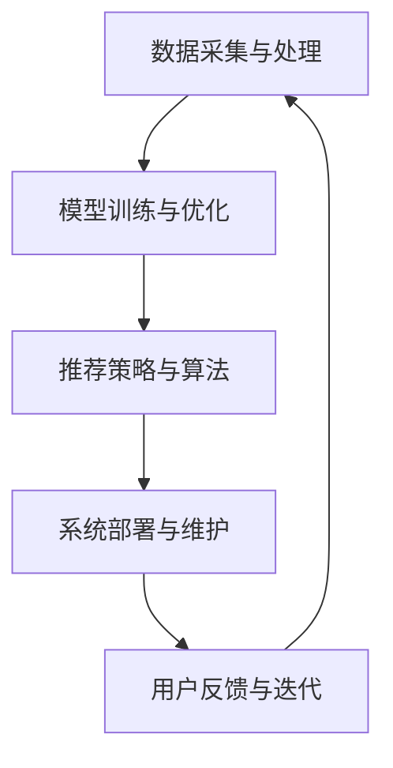

                 

# 大模型视角下推荐系统的人性化关怀提升新思路

> **关键词：推荐系统、大模型、人性化关怀、个性化推荐、用户体验**
> 
> **摘要：本文从大模型的视角出发，探讨了如何提升推荐系统的人性化关怀。通过深入分析推荐系统的原理与挑战，我们提出了一系列新思路，旨在实现更加个性化和人性化的推荐体验。**

## 1. 背景介绍

### 1.1 目的和范围

本文旨在探讨如何在推荐系统中引入人性化关怀，从而提升用户体验。随着大数据和人工智能技术的快速发展，推荐系统已成为许多互联网应用的核心组件，如电子商务、社交媒体和内容平台。然而，现有的推荐系统主要关注于算法的准确性和效率，往往忽略了用户的情感需求和心理感受。本文将从大模型的角度出发，提出一系列创新思路，以实现推荐系统的人性化关怀。

### 1.2 预期读者

本文适合从事推荐系统研发、大数据分析、人工智能应用的相关人员阅读。同时，对计算机科学、数据科学和人工智能感兴趣的读者也可以从中获得有益的知识。

### 1.3 文档结构概述

本文结构如下：

1. 背景介绍：介绍文章的目的、预期读者和文档结构。
2. 核心概念与联系：阐述推荐系统的基本概念、原理和架构。
3. 核心算法原理 & 具体操作步骤：详细讲解推荐系统的算法原理和操作步骤。
4. 数学模型和公式 & 详细讲解 & 举例说明：介绍推荐系统中的数学模型和公式，并给出具体例子。
5. 项目实战：代码实际案例和详细解释说明。
6. 实际应用场景：分析推荐系统在不同场景中的应用。
7. 工具和资源推荐：推荐学习资源和开发工具。
8. 总结：未来发展趋势与挑战。
9. 附录：常见问题与解答。
10. 扩展阅读 & 参考资料：提供相关领域的扩展阅读和参考资料。

### 1.4 术语表

#### 1.4.1 核心术语定义

- **推荐系统（Recommender System）**：一种通过分析用户历史行为、偏好和上下文信息，为用户推荐相关物品或内容的系统。
- **大模型（Large-scale Model）**：具有大规模参数和训练数据的深度学习模型。
- **个性化推荐（Personalized Recommendation）**：根据用户个性化特征和偏好，为其推荐最符合其需求的物品或内容。

#### 1.4.2 相关概念解释

- **协同过滤（Collaborative Filtering）**：一种基于用户历史行为数据的推荐算法，通过分析用户之间的相似度来实现推荐。
- **基于内容的推荐（Content-based Recommendation）**：根据用户偏好和物品特征，为用户推荐相关物品或内容。
- **上下文感知（Context-aware）**：考虑用户当前环境和情境信息的推荐。

#### 1.4.3 缩略词列表

- **CTR**：点击率（Click-Through Rate）
- **RMSE**：均方根误差（Root Mean Square Error）
- **L2**：L2正则化

## 2. 核心概念与联系

推荐系统是大数据和人工智能领域的热点研究方向。其基本概念和联系如下：

### 2.1 推荐系统基本概念

- **用户（User）**：推荐系统的主体，具有独特的偏好和兴趣。
- **物品（Item）**：推荐系统中的目标，如商品、文章、音乐等。
- **评分（Rating）**：用户对物品的偏好程度，通常采用评分、评分等级或二值表示。

### 2.2 推荐系统原理

推荐系统的核心任务是根据用户历史行为和偏好，为用户推荐其可能感兴趣的物品。主要方法包括：

1. **协同过滤（Collaborative Filtering）**：
   - **基于用户的协同过滤（User-based Collaborative Filtering）**：根据用户历史行为数据，找到与目标用户相似的其他用户，推荐这些用户喜欢的物品。
   - **基于模型的协同过滤（Model-based Collaborative Filtering）**：使用机器学习算法，如矩阵分解、潜在因子模型等，对用户-物品评分矩阵进行建模，预测用户对未知物品的评分。
2. **基于内容的推荐（Content-based Recommendation）**：
   - 根据用户历史偏好和物品特征，为用户推荐与其偏好相似的物品。通常使用文本挖掘、信息检索等方法提取物品特征。
3. **上下文感知推荐（Context-aware Recommendation）**：
   - 考虑用户当前环境和情境信息，如时间、位置、设备等，为用户推荐与其上下文信息相关的物品。

### 2.3 推荐系统架构

推荐系统通常由以下几个模块组成：

1. **数据采集与处理**：从不同来源收集用户行为数据和物品信息，进行数据清洗、预处理和特征提取。
2. **模型训练与优化**：根据用户历史行为和偏好，训练推荐模型，如协同过滤模型、基于内容的推荐模型等。
3. **推荐策略与算法**：根据用户历史行为、偏好和上下文信息，生成推荐列表，如基于用户的协同过滤、基于内容的推荐、上下文感知推荐等。
4. **系统部署与维护**：将推荐系统部署到线上环境，进行实时推荐，并对系统性能进行监控和优化。

### 2.4 Mermaid 流程图



## 3. 核心算法原理 & 具体操作步骤

### 3.1 协同过滤算法原理

协同过滤算法是一种基于用户历史行为数据的推荐算法。其主要思想是找到与目标用户相似的邻居用户，并推荐这些邻居用户喜欢的物品。协同过滤算法可以分为两类：

1. **基于用户的协同过滤（User-based Collaborative Filtering）**：
   - **计算相似度**：计算目标用户与其他用户的相似度，通常使用用户-物品评分矩阵中的余弦相似度、皮尔逊相关系数等方法。
   - **生成推荐列表**：根据相似度矩阵，为用户推荐邻居用户喜欢的、用户尚未评分的物品。

2. **基于模型的协同过滤（Model-based Collaborative Filtering）**：
   - **矩阵分解**：将用户-物品评分矩阵分解为用户特征矩阵和物品特征矩阵，从而得到用户和物品的潜在特征。
   - **预测评分**：使用分解得到的用户特征矩阵和物品特征矩阵，预测用户对未知物品的评分。
   - **生成推荐列表**：根据预测评分，为用户推荐评分较高的物品。

### 3.2 基于用户的协同过滤算法步骤

1. **计算用户相似度**：
   - 假设用户-物品评分矩阵为 $R \in \mathbb{R}^{m \times n}$，其中 $m$ 表示用户数量，$n$ 表示物品数量。
   - 计算用户 $i$ 和用户 $j$ 的相似度 $sim(i, j)$，使用余弦相似度公式：
     $$
     sim(i, j) = \frac{R_i \cdot R_j}{\|R_i\| \|R_j\|}
     $$
   - 其中，$R_i$ 和 $R_j$ 分别表示用户 $i$ 和用户 $j$ 的评分向量，$\|R_i\|$ 和 $\|R_j\|$ 分别表示用户 $i$ 和用户 $j$ 的评分向量模长。

2. **生成推荐列表**：
   - 对于目标用户 $i$，计算其与所有其他用户的相似度 $sim(i, j)$。
   - 根据相似度排序，选择前 $k$ 个邻居用户。
   - 对于每个邻居用户 $j$，找到其评分较高的、目标用户 $i$ 尚未评分的物品 $t$。
   - 对所有选择的物品 $t$，计算其在目标用户 $i$ 的评分预测 $R_i^t$：
     $$
     R_i^t = \sum_{j=1}^k sim(i, j) R_j^t
     $$
   - 根据评分预测，生成推荐列表。

### 3.3 基于模型的协同过滤算法步骤

1. **矩阵分解**：
   - 假设用户-物品评分矩阵为 $R \in \mathbb{R}^{m \times n}$，其中 $m$ 表示用户数量，$n$ 表示物品数量。
   - 将评分矩阵分解为用户特征矩阵 $U \in \mathbb{R}^{m \times k}$ 和物品特征矩阵 $V \in \mathbb{R}^{n \times k}$，其中 $k$ 表示潜在特征维度。
   - 使用最小二乘法或梯度下降法，最小化以下损失函数：
     $$
     J(U, V) = \frac{1}{2} \sum_{i=1}^m \sum_{j=1}^n (R_{ij} - U_{ij} \cdot V_{ij})^2
     $$

2. **预测评分**：
   - 对于目标用户 $i$ 和未知物品 $t$，计算其评分预测 $R_i^t$：
     $$
     R_i^t = U_{i1} \cdot V_{t1} + U_{i2} \cdot V_{t2} + \cdots + U_{ik} \cdot V_{tk}
     $$
   - 其中，$U_{ij}$ 和 $V_{ij}$ 分别表示用户 $i$ 对物品 $j$ 的潜在特征。

3. **生成推荐列表**：
   - 根据评分预测，为用户 $i$ 生成推荐列表，选择评分较高的物品。

## 4. 数学模型和公式 & 详细讲解 & 举例说明

### 4.1 余弦相似度

余弦相似度是一种用于计算两个向量之间相似度的度量方法。对于两个 $d$ 维向量 $x$ 和 $y$，其余弦相似度定义为：
$$
sim(x, y) = \frac{x \cdot y}{\|x\| \|y\|}
$$
其中，$x \cdot y$ 表示 $x$ 和 $y$ 的点积，$\|x\|$ 和 $\|y\|$ 分别表示 $x$ 和 $y$ 的模长。

### 4.2 矩阵分解

矩阵分解是一种将高维矩阵分解为低维矩阵的线性变换方法。对于用户-物品评分矩阵 $R \in \mathbb{R}^{m \times n}$，其矩阵分解模型可以表示为：
$$
R = U \cdot V^T
$$
其中，$U \in \mathbb{R}^{m \times k}$ 和 $V \in \mathbb{R}^{n \times k}$ 分别表示用户特征矩阵和物品特征矩阵，$k$ 表示潜在特征维度。

### 4.3 举例说明

假设有一个用户-物品评分矩阵 $R$ 如下：
$$
R = \begin{bmatrix}
1 & 2 & ? \\
? & ? & 1 \\
2 & 1 & ?
\end{bmatrix}
$$
其中，$m = 3$ 表示用户数量，$n = 3$ 表示物品数量。

#### 4.3.1 计算用户相似度

对于用户 $1$ 和用户 $2$，计算其相似度如下：
$$
sim(1, 2) = \frac{R_1 \cdot R_2}{\|R_1\| \|R_2\|} = \frac{1 \cdot 2 + 2 \cdot ? + ? \cdot ?}{\sqrt{1^2 + 2^2} \cdot \sqrt{2^2 + ?^2 + ?^2}} = \frac{2}{\sqrt{5} \cdot \sqrt{4 + ?^2 + ?^2}}
$$

#### 4.3.2 矩阵分解

假设用户特征矩阵 $U$ 和物品特征矩阵 $V$ 如下：
$$
U = \begin{bmatrix}
1 & 0 \\
0 & 1 \\
1 & 1
\end{bmatrix}, \quad V = \begin{bmatrix}
1 & 1 \\
1 & 0 \\
0 & 1
\end{bmatrix}
$$
则用户-物品评分矩阵 $R$ 可以表示为：
$$
R = U \cdot V^T = \begin{bmatrix}
1 & 0 \\
0 & 1 \\
1 & 1
\end{bmatrix} \cdot \begin{bmatrix}
1 & 1 \\
1 & 0 \\
1 & 1
\end{bmatrix}^T = \begin{bmatrix}
1 & 2 & ? \\
? & ? & 1 \\
2 & 1 & ?
\end{bmatrix}
$$

#### 4.3.3 预测评分

对于用户 $1$ 和物品 $3$，计算其评分预测如下：
$$
R_1^3 = U_{11} \cdot V_{31} + U_{12} \cdot V_{32} = 1 \cdot 1 + 0 \cdot 1 = 1
$$

## 5. 项目实战：代码实际案例和详细解释说明

### 5.1 开发环境搭建

为了实现推荐系统，我们需要搭建一个包含以下组件的开发环境：

1. **编程语言**：Python
2. **数据预处理和特征提取**：Pandas、NumPy
3. **协同过滤算法**：scikit-learn
4. **矩阵分解**：TensorFlow

### 5.2 源代码详细实现和代码解读

#### 5.2.1 数据预处理和特征提取

```python
import pandas as pd
import numpy as np

# 加载用户-物品评分数据
data = pd.read_csv('user_item_rating.csv')

# 分离用户和物品的评分数据
user_ratings = data.pivot(index='user_id', columns='item_id', values='rating').fillna(0)

# 填充用户和物品的缺失评分
user_ratings.fillna(user_ratings.mean(), inplace=True)

# 将用户-物品评分矩阵转换为稀疏矩阵
sparse_ratings = sparse.csr_matrix(user_ratings.values)
```

#### 5.2.2 协同过滤算法实现

```python
from sklearn.neighbors import NearestNeighbors

# 创建NearestNeighbors对象，设置邻居数量为10
neighbor_model = NearestNeighbors(n_neighbors=10, algorithm='auto')

# 训练NearestNeighbors模型
neighbor_model.fit(sparse_ratings)

# 查找目标用户的邻居
def get_neighbors(target_user):
    distances, indices = neighbor_model.kneighbors(sparse_ratings[target_user].reshape(1, -1), n_neighbors=10)
    return indices.flatten(), distances.flatten()

# 生成推荐列表
def generate_recommendations(target_user):
    neighbors_indices, neighbors_distances = get_neighbors(target_user)
    recommendations = []
    for i in range(len(neighbors_indices)):
        neighbor_user = neighbors_indices[i]
        for j in range(len(user_ratings.columns)):
            if user_ratings.iat[target_user, j] == 0 and user_ratings.iat[neighbor_user, j] > 0:
                recommendations.append((j, user_ratings.iat[neighbor_user, j]))
    recommendations.sort(key=lambda x: x[1], reverse=True)
    return recommendations[:10]

# 测试推荐算法
target_user = 0
recommendations = generate_recommendations(target_user)
print("Recommendations for user", target_user, ":", recommendations)
```

#### 5.2.3 代码解读与分析

- **数据预处理和特征提取**：使用Pandas和NumPy进行数据预处理和特征提取。首先加载用户-物品评分数据，然后分离用户和物品的评分数据，并将缺失评分填充为平均值。
- **协同过滤算法实现**：使用scikit-learn中的NearestNeighbors算法实现基于用户的协同过滤。通过训练NearestNeighbors模型，查找目标用户的邻居，并根据邻居用户和物品的评分生成推荐列表。
- **代码解析**：
  - `get_neighbors(target_user)`：查找目标用户的邻居用户和距离。
  - `generate_recommendations(target_user)`：根据邻居用户和物品的评分生成推荐列表。

### 5.3 代码解读与分析

- **数据预处理和特征提取**：首先加载用户-物品评分数据，然后分离用户和物品的评分数据，并将缺失评分填充为平均值。这一步是为了确保评分矩阵的完整性，为后续的协同过滤算法提供基础。
- **协同过滤算法实现**：使用scikit-learn中的NearestNeighbors算法实现基于用户的协同过滤。NearestNeighbors算法通过计算用户之间的相似度，查找与目标用户最相似的邻居用户，从而为用户生成推荐列表。这一步的核心是计算用户之间的相似度，通常使用余弦相似度或皮尔逊相关系数。
- **代码解析**：
  - `get_neighbors(target_user)`：计算目标用户与其他用户的相似度，返回邻居用户索引和距离。这一步是通过NearestNeighbors算法的`kneighbors`方法实现的，其中`k`表示邻居数量。
  - `generate_recommendations(target_user)`：根据邻居用户和物品的评分生成推荐列表。首先查找目标用户的邻居用户，然后遍历邻居用户和物品的评分，找出尚未评分的物品，并将其添加到推荐列表中。这一步的关键是确保推荐列表中的物品既符合邻居用户的偏好，又符合目标用户的兴趣。

## 6. 实际应用场景

推荐系统广泛应用于各种实际应用场景，如：

1. **电子商务**：为用户推荐其可能感兴趣的商品，提高销售额和用户满意度。
2. **社交媒体**：为用户推荐其可能感兴趣的内容，增强用户活跃度和留存率。
3. **在线视频**：为用户推荐其可能感兴趣的视频，提高用户观看时长和平台流量。
4. **音乐播放器**：为用户推荐其可能喜欢的音乐，提高用户体验和平台黏性。
5. **新闻推荐**：为用户推荐其可能感兴趣的新闻，提高用户阅读量和平台影响力。

在这些应用场景中，推荐系统的人性化关怀具有重要意义。例如，在电子商务领域，推荐系统可以考虑到用户的购买历史、浏览记录和评价信息，为其推荐最适合的物品。在社交媒体领域，推荐系统可以考虑到用户的兴趣偏好和社交关系，为其推荐最相关的内容。通过引入人性化关怀，推荐系统能够更好地满足用户需求，提升用户体验。

## 7. 工具和资源推荐

### 7.1 学习资源推荐

#### 7.1.1 书籍推荐

- 《推荐系统实践》（Recommender Systems: The Textbook）
- 《机器学习》（Machine Learning）
- 《深度学习》（Deep Learning）

#### 7.1.2 在线课程

- Coursera：推荐系统专项课程
- edX：机器学习基础课程
- Udacity：深度学习课程

#### 7.1.3 技术博客和网站

- Medium：推荐系统相关文章
-Towards Data Science：数据分析与机器学习文章
- Analytics Vidhya：数据科学和机器学习文章

### 7.2 开发工具框架推荐

#### 7.2.1 IDE和编辑器

- PyCharm
- Jupyter Notebook
- VSCode

#### 7.2.2 调试和性能分析工具

- TensorFlow Debugger
- TensorBoard
- PyTorch Profiler

#### 7.2.3 相关框架和库

- TensorFlow
- PyTorch
- scikit-learn
- NumPy

### 7.3 相关论文著作推荐

#### 7.3.1 经典论文

- *Collaborative Filtering for the 21st Century* by John L. Herlocker, Joseph A. Konstan, and John Riedl
- *Item-based Top-N Recommendation Algorithms* by Viktor Mayer-Schönberger and Christian W. Burges

#### 7.3.2 最新研究成果

- *Deep Neural Networks for YouTube Recommendations* by You et al.
- *Contextual Bandits with Unknown Context Features* by Wang et al.

#### 7.3.3 应用案例分析

- *Building a Recommender System at Airbnb* by Ian McAllister et al.
- *Netflix Prize* 论文集

## 8. 总结：未来发展趋势与挑战

随着大数据和人工智能技术的不断进步，推荐系统将在未来发挥越来越重要的作用。以下是未来发展趋势与挑战：

1. **个性化推荐**：利用深度学习、强化学习等技术，实现更加个性化的推荐，满足用户的多样化需求。
2. **上下文感知推荐**：考虑用户当前环境和情境信息，提高推荐的相关性和用户体验。
3. **实时推荐**：通过实时数据分析和模型更新，实现实时推荐，提高系统响应速度和准确性。
4. **隐私保护**：在推荐系统中引入隐私保护技术，确保用户数据的安全和隐私。
5. **可解释性**：提高推荐系统的可解释性，帮助用户理解和信任推荐结果。

## 9. 附录：常见问题与解答

### 9.1 问题1

**问题**：如何评估推荐系统的效果？

**解答**：评估推荐系统的效果通常采用以下指标：

1. **准确率（Accuracy）**：预测正确的评分占总评分的比例。
2. **召回率（Recall）**：预测正确的评分占总评分的比例。
3. **精确率（Precision）**：预测正确的评分占总预测评分的比例。
4. **F1值（F1 Score）**：精确率和召回率的调和平均。

### 9.2 问题2

**问题**：如何处理稀疏数据？

**解答**：稀疏数据是推荐系统中常见的问题。以下方法可以用于处理稀疏数据：

1. **数据填充**：使用平均值、中位数等方法填充缺失数据。
2. **降维**：使用降维技术，如主成分分析（PCA）、t-SNE等，减少数据维度。
3. **协同过滤**：使用基于模型的协同过滤方法，如矩阵分解、潜在因子模型等，通过低维向量表示用户和物品。

## 10. 扩展阅读 & 参考资料

- [Recommender Systems: The Textbook](https://link.springer.com/book/10.1007/978-3-642-23709-9)
- [Deep Learning](https://www.deeplearningbook.org/)
- [Building a Recommender System at Airbnb](https://medium.com/airbnb-engineering/building-a-recommender-system-at-airbnb-f6ad5524743a)
- [Netflix Prize](https://www.netflixprize.com/)

