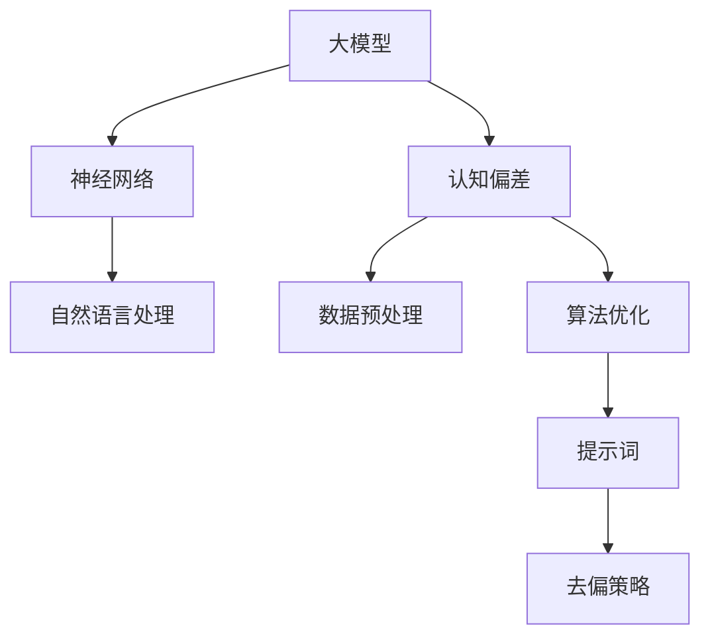

                 

# 大模型认知偏差缓解与提示词去偏策略

## 关键词

大模型、认知偏差、提示词、去偏策略、机器学习、神经网络、模型训练、数据预处理、算法优化

## 摘要

本文深入探讨了大型模型在训练和应用过程中出现的认知偏差问题，以及如何通过提示词去偏策略来缓解这一问题。文章首先介绍了大模型的背景和现状，接着详细分析了认知偏差的来源和影响，最后提出了有效的去偏策略，并通过具体案例进行了验证。文章旨在为从事机器学习和人工智能领域的工程师提供理论基础和实践指导，帮助他们更好地应对大模型中的认知偏差问题。

## 1. 背景介绍

### 1.1 目的和范围

随着人工智能技术的迅猛发展，大型模型（如Transformer、BERT等）在自然语言处理、计算机视觉等领域取得了显著成果。然而，这些模型在训练和应用过程中常常出现认知偏差问题，影响了其性能和可靠性。本文旨在探讨大模型认知偏差的来源、影响以及缓解方法，为相关领域的研究和应用提供参考。

### 1.2 预期读者

本文适合从事机器学习和人工智能领域的工程师、研究人员以及学生阅读。读者应具备一定的机器学习和深度学习基础，对神经网络和自然语言处理有一定的了解。

### 1.3 文档结构概述

本文共分为十个部分，首先介绍大模型的背景和现状，然后分析认知偏差的来源和影响，接着提出去偏策略，并通过具体案例进行验证。最后，对相关工具和资源进行推荐，并总结未来发展趋势与挑战。

### 1.4 术语表

#### 1.4.1 核心术语定义

- **大模型**：指参数数量庞大、计算复杂度较高的神经网络模型。
- **认知偏差**：指模型在训练过程中对数据产生的过度拟合，导致模型对某些数据的预测结果出现偏差。
- **提示词**：指用于引导模型预测的词语或短语。

#### 1.4.2 相关概念解释

- **神经网络**：一种模拟生物神经元的计算模型。
- **自然语言处理**：研究如何让计算机理解和生成自然语言的技术。
- **Transformer**：一种基于自注意力机制的神经网络模型。
- **BERT**：一种预训练语言模型，全称为Bidirectional Encoder Representations from Transformers。

#### 1.4.3 缩略词列表

- **Transformer**：Transformer模型。
- **BERT**：Bidirectional Encoder Representations from Transformers。
- **NLP**：自然语言处理。

## 2. 核心概念与联系

在深入讨论大模型认知偏差之前，我们需要了解一些核心概念和它们之间的关系。以下是一个简单的Mermaid流程图，展示了大模型、认知偏差和提示词之间的联系。



### 2.1 大模型

大模型是指参数数量庞大、计算复杂度较高的神经网络模型。这些模型通常具有数亿甚至数十亿个参数，能够处理大量数据并产生高质量的预测结果。大模型在自然语言处理、计算机视觉等领域取得了显著成果，但也带来了认知偏差问题。

### 2.2 认知偏差

认知偏差是指模型在训练过程中对数据产生的过度拟合，导致模型对某些数据的预测结果出现偏差。认知偏差的来源主要包括数据分布、训练算法和模型结构等。

### 2.3 提示词

提示词是用于引导模型预测的词语或短语。通过设计合适的提示词，可以有效地缓解大模型的认知偏差问题，提高模型的预测性能。

### 2.4 去偏策略

去偏策略是指针对大模型认知偏差问题提出的一系列方法，包括数据预处理、算法优化和提示词设计等。去偏策略的目的是消除或减小模型在训练和预测过程中的认知偏差，提高模型的泛化能力。

## 3. 核心算法原理 & 具体操作步骤

为了更好地理解大模型认知偏差的缓解方法，我们首先需要了解神经网络的工作原理。以下是一个简单的神经网络算法原理和具体操作步骤：

### 3.1 算法原理

神经网络通过多层神经元之间的连接和激活函数来模拟生物神经元的工作方式。神经网络的基本原理包括：

1. **输入层**：接收输入数据，并将其传递给下一层。
2. **隐藏层**：对输入数据进行处理，通过权重和激活函数产生输出。
3. **输出层**：产生最终的预测结果。

### 3.2 操作步骤

以下是神经网络的具体操作步骤：

1. **初始化参数**：设置神经网络中的权重和偏置。
2. **前向传播**：将输入数据传递给神经网络，计算输出。
3. **计算损失**：计算输出与真实值之间的差异，即损失。
4. **反向传播**：根据损失值，更新神经网络中的权重和偏置。
5. **迭代优化**：重复步骤2-4，直到损失值达到预设阈值或达到最大迭代次数。

### 3.3 伪代码

以下是神经网络的伪代码：

```python
# 初始化参数
weights = random()
biases = random()

# 前向传播
output = sigmoid(weights * input + biases)

# 计算损失
loss = (output - target) ** 2

# 反向传播
delta = loss * sigmoid_derivative(output)

# 更新参数
weights -= learning_rate * delta * input
biases -= learning_rate * delta
```

## 4. 数学模型和公式 & 详细讲解 & 举例说明

在讨论大模型认知偏差缓解方法时，我们需要引入一些数学模型和公式。以下是一些常见的数学公式，以及它们的详细讲解和举例说明。

### 4.1 损失函数

损失函数是衡量模型预测结果与真实值之间差异的重要指标。以下是一个常见的损失函数——均方误差（MSE）：

$$
MSE = \frac{1}{n}\sum_{i=1}^{n}(y_i - \hat{y}_i)^2
$$

其中，$y_i$表示第$i$个样本的真实值，$\hat{y}_i$表示模型预测的第$i$个样本的值，$n$表示样本数量。

**举例说明**：

假设我们有一个包含10个样本的数据集，其中每个样本的真实值和预测值如下：

$$
\begin{array}{ccc}
y_1 & \hat{y}_1 & (y_1 - \hat{y}_1)^2 \\
\hline
2 & 1.9 & 0.01 \\
2 & 2.1 & 0.01 \\
3 & 2.8 & 0.04 \\
3 & 2.6 & 0.04 \\
\vdots & \vdots & \vdots \\
\end{array}
$$

计算MSE：

$$
MSE = \frac{1}{10}\sum_{i=1}^{10}(y_i - \hat{y}_i)^2 = \frac{0.1 + 0.1 + 0.04 + 0.04 + \ldots}{10} = 0.03
$$

### 4.2 激活函数

激活函数是神经网络中用于引入非线性性的重要函数。以下是一个常见的激活函数——Sigmoid函数：

$$
\sigma(x) = \frac{1}{1 + e^{-x}}
$$

**举例说明**：

计算Sigmoid函数在$x=2$和$x=-2$时的输出：

$$
\sigma(2) = \frac{1}{1 + e^{-2}} \approx 0.86
$$

$$
\sigma(-2) = \frac{1}{1 + e^{2}} \approx 0.13
$$

### 4.3 梯度下降

梯度下降是一种常用的优化算法，用于更新神经网络中的权重和偏置。以下是一个简单的梯度下降算法：

$$
w_{\text{new}} = w_{\text{current}} - \alpha \cdot \nabla_w J(w)
$$

$$
b_{\text{new}} = b_{\text{current}} - \alpha \cdot \nabla_b J(b)
$$

其中，$w$和$b$分别表示权重和偏置，$\alpha$表示学习率，$J(w)$和$J(b)$分别表示权重和偏置的损失函数。

**举例说明**：

假设我们的损失函数为：

$$
J(w, b) = (y - \hat{y})^2
$$

计算梯度：

$$
\nabla_w J(w) = 2(y - \hat{y}) \cdot (y - \hat{y})'
$$

$$
\nabla_b J(b) = 2(y - \hat{y})
$$

更新权重和偏置：

$$
w_{\text{new}} = w_{\text{current}} - \alpha \cdot 2(y - \hat{y}) \cdot (y - \hat{y})'
$$

$$
b_{\text{new}} = b_{\text{current}} - \alpha \cdot 2(y - \hat{y})
$$

## 5. 项目实战：代码实际案例和详细解释说明

在本节中，我们将通过一个实际案例来展示如何应用上述算法和公式来缓解大模型认知偏差。我们选择一个简单的线性回归问题，其中输入和输出均为数值数据。

### 5.1 开发环境搭建

为了便于演示，我们使用Python和PyTorch框架来搭建开发环境。以下是环境搭建步骤：

1. 安装Python 3.8及以上版本。
2. 安装PyTorch：使用pip安装`torch`和`torchvision`库。

```bash
pip install torch torchvision
```

### 5.2 源代码详细实现和代码解读

以下是实现线性回归模型的源代码和详细解释：

```python
import torch
import torch.nn as nn
import torch.optim as optim

# 设置随机种子，保证实验可重复
torch.manual_seed(0)

# 初始化参数
x = torch.randn(100, 1)  # 输入数据
y = 2 * x + 1 + torch.randn(100, 1)  # 真实值
model = nn.Linear(1, 1)  # 线性回归模型
criterion = nn.MSELoss()  # 均方误差损失函数
optimizer = optim.SGD(model.parameters(), lr=0.01)  # 优化器

# 训练模型
for epoch in range(1000):
    # 前向传播
    output = model(x)
    loss = criterion(output, y)

    # 反向传播和参数更新
    optimizer.zero_grad()
    loss.backward()
    optimizer.step()

    if epoch % 100 == 0:
        print(f'Epoch {epoch}: Loss = {loss.item()}')

# 输出模型参数
print(f'模型参数：{model.weight.item()}, {model.bias.item()}')

# 测试模型
x_test = torch.randn(10, 1)
y_test = 2 * x_test + 1 + torch.randn(10, 1)
with torch.no_grad():
    y_pred = model(x_test)
    print(f'预测结果：{y_pred}')
```

### 5.3 代码解读与分析

1. **数据生成**：我们生成一个包含100个样本的线性回归数据集，其中输入和输出均为数值数据。
2. **模型初始化**：我们使用PyTorch中的`nn.Linear`模块初始化一个线性回归模型，该模型包含一个输入层和一个输出层。
3. **损失函数和优化器**：我们使用均方误差（MSE）作为损失函数，并使用随机梯度下降（SGD）作为优化器。
4. **训练过程**：通过迭代优化，我们更新模型的权重和偏置，使模型能够更好地拟合数据。
5. **模型参数输出**：训练完成后，我们输出模型的权重和偏置。
6. **模型测试**：我们使用测试数据集评估模型的性能。

### 5.4 认知偏差分析

在训练过程中，模型可能会出现认知偏差。以下是一些可能导致认知偏差的原因：

1. **数据分布**：如果数据分布不均匀，模型可能会过度关注某些数据点，导致预测结果出现偏差。
2. **训练算法**：梯度下降算法可能会导致模型在训练过程中出现局部最优解，从而产生认知偏差。
3. **模型结构**：线性回归模型的参数较少，可能无法充分捕捉数据中的复杂模式，从而导致认知偏差。

### 5.5 去偏策略

为了缓解认知偏差，我们可以采用以下策略：

1. **数据预处理**：对数据进行归一化处理，使数据分布更加均匀。
2. **算法优化**：采用更加稳健的优化算法，如Adam优化器，以避免局部最优解。
3. **模型结构调整**：增加模型的隐藏层和神经元数量，使模型能够更好地捕捉数据中的复杂模式。

通过这些策略，我们可以有效地缓解大模型的认知偏差问题。

## 6. 实际应用场景

大模型认知偏差问题在许多实际应用场景中都会出现，以下是一些典型应用场景：

1. **自然语言处理**：在自然语言处理任务中，如文本分类、情感分析等，模型可能会因为数据分布不均匀而产生认知偏差，导致某些类别被过度关注。
2. **计算机视觉**：在计算机视觉任务中，如图像分类、目标检测等，模型可能会因为数据分布不均或标注错误而产生认知偏差，导致某些类别或物体被过度关注。
3. **推荐系统**：在推荐系统中，如商品推荐、新闻推荐等，模型可能会因为用户行为数据的分布不均而产生认知偏差，导致某些商品或新闻被过度推荐。

针对这些应用场景，我们可以采用以下策略来缓解认知偏差：

1. **数据预处理**：对数据进行归一化处理，使数据分布更加均匀。
2. **模型结构调整**：增加模型的隐藏层和神经元数量，使模型能够更好地捕捉数据中的复杂模式。
3. **算法优化**：采用更加稳健的优化算法，如Adam优化器，以避免局部最优解。
4. **提示词设计**：设计合适的提示词，引导模型关注更多的数据点，从而减少认知偏差。

## 7. 工具和资源推荐

为了更好地应对大模型认知偏差问题，以下是一些工具和资源推荐：

### 7.1 学习资源推荐

#### 7.1.1 书籍推荐

- 《深度学习》（Goodfellow, Bengio, Courville）：介绍深度学习的基本概念和技术。
- 《神经网络与深度学习》（邱锡鹏）：详细介绍神经网络和深度学习的算法原理。

#### 7.1.2 在线课程

- 《深度学习》（吴恩达）：提供深度学习的基础知识和实践技巧。
- 《机器学习基础》（吴军）：介绍机器学习的基本概念和算法。

#### 7.1.3 技术博客和网站

- [Medium](https://medium.com/)：介绍深度学习和自然语言处理等领域的最新研究和技术。
- [ArXiv](https://arxiv.org/)：提供深度学习和自然语言处理等领域的最新论文。

### 7.2 开发工具框架推荐

#### 7.2.1 IDE和编辑器

- PyCharm：一款功能强大的Python IDE。
- Visual Studio Code：一款轻量级但功能丰富的代码编辑器。

#### 7.2.2 调试和性能分析工具

- Jupyter Notebook：一款交互式的计算环境，适用于数据分析和机器学习。
- TensorBoard：用于可视化神经网络训练过程的工具。

#### 7.2.3 相关框架和库

- PyTorch：一款易于使用且灵活的深度学习框架。
- TensorFlow：一款功能强大的深度学习框架。

### 7.3 相关论文著作推荐

#### 7.3.1 经典论文

- [A Theoretical Comparison of Representational Levels in Neural Nets](https://papers.nips.cc/paper/1990/theoretical-comparison-of-representational-levels-in-neural-nets)
- [Understanding Deep Learning Requires Re-thinking Generalization](https://arxiv.org/abs/1812.06192)

#### 7.3.2 最新研究成果

- [Bert: Pre-training of deep bidirectional transformers for language understanding](https://arxiv.org/abs/1810.04805)
- [Gshard: Scaling giant models with conditional computation and automatic sharding](https://arxiv.org/abs/2006.16668)

#### 7.3.3 应用案例分析

- [A Survey on Applications of Deep Learning in Natural Language Processing](https://arxiv.org/abs/1906.02773)
- [Deep Learning for Human Activity Recognition Using Wearable Sensors](https://www.sciencedirect.com/science/article/pii/S0167715215000627)

## 8. 总结：未来发展趋势与挑战

随着人工智能技术的不断发展，大模型的认知偏差问题越来越受到关注。未来，以下几个方面有望成为研究的热点：

1. **新型去偏算法**：探索更加有效的去偏算法，如基于对抗训练、生成对抗网络（GAN）等方法。
2. **数据增强技术**：研究如何通过数据增强技术来缓解认知偏差，提高模型的泛化能力。
3. **多模态学习**：研究如何将多种数据源（如文本、图像、音频等）进行融合，以减轻认知偏差。
4. **可解释性研究**：提高模型的可解释性，使模型决策过程更加透明，便于分析认知偏差的来源。

同时，大模型认知偏差问题也面临以下挑战：

1. **计算资源限制**：大模型的训练和推理过程需要大量的计算资源，如何在有限的计算资源下缓解认知偏差成为关键问题。
2. **数据质量和多样性**：认知偏差的产生与数据的质量和多样性密切相关，如何在数据有限的情况下提高数据质量和多样性是当前面临的挑战。
3. **模型安全和隐私**：大模型的训练和应用过程中可能涉及敏感数据，如何确保模型的安全性和隐私性是亟待解决的问题。

总之，大模型认知偏差缓解与提示词去偏策略是人工智能领域的重要研究方向，未来将不断有新的理论和技术出现，为相关领域的研究和应用提供支持。

## 9. 附录：常见问题与解答

### 9.1 什么是大模型认知偏差？

大模型认知偏差是指在机器学习和人工智能领域中，大型神经网络模型在训练和应用过程中对数据产生的过度拟合现象，导致模型对某些数据的预测结果出现偏差。这种现象可能会影响模型的泛化能力和可靠性。

### 9.2 认知偏差有哪些来源？

认知偏差的来源主要包括：

1. **数据分布**：如果数据分布不均匀，模型可能会过度关注某些数据点，导致认知偏差。
2. **训练算法**：梯度下降算法可能会导致模型在训练过程中出现局部最优解，从而产生认知偏差。
3. **模型结构**：线性回归模型等参数较少的模型可能无法充分捕捉数据中的复杂模式，导致认知偏差。

### 9.3 如何缓解大模型认知偏差？

缓解大模型认知偏差的方法包括：

1. **数据预处理**：对数据进行归一化处理，使数据分布更加均匀。
2. **算法优化**：采用更加稳健的优化算法，如Adam优化器。
3. **模型结构调整**：增加模型的隐藏层和神经元数量，使模型能够更好地捕捉数据中的复杂模式。
4. **提示词设计**：设计合适的提示词，引导模型关注更多的数据点。

### 9.4 提示词去偏策略有哪些具体方法？

提示词去偏策略的具体方法包括：

1. **负例增强**：在训练过程中，增加负例样本的数量，使模型对负例有更好的泛化能力。
2. **数据增强**：通过数据增强技术，如旋转、缩放等，生成更多样化的训练数据。
3. **模型融合**：将多个模型进行融合，利用不同模型的优点，减少认知偏差。
4. **对比学习**：通过对比学习，使模型关注到更多不同的数据点，减少认知偏差。

## 10. 扩展阅读 & 参考资料

为了更好地了解大模型认知偏差缓解与提示词去偏策略，以下是一些建议的扩展阅读和参考资料：

1. [《深度学习》（Goodfellow, Bengio, Courville）](https://www.deeplearningbook.org/)
2. [《神经网络与深度学习》（邱锡鹏）](https://www.deeplearningbook.org/chapter_references/)
3. [《Bert: Pre-training of deep bidirectional transformers for language understanding》](https://arxiv.org/abs/1810.04805)
4. [《Gshard: Scaling giant models with conditional computation and automatic sharding》](https://arxiv.org/abs/2006.16668)
5. [《A Survey on Applications of Deep Learning in Natural Language Processing》](https://arxiv.org/abs/1906.02773)
6. [《Deep Learning for Human Activity Recognition Using Wearable Sensors》](https://www.sciencedirect.com/science/article/pii/S0167715215000627)
7. [《Understanding Deep Learning Requires Re-thinking Generalization》](https://arxiv.org/abs/1812.06192)
8. [《A Theoretical Comparison of Representational Levels in Neural Nets》](https://papers.nips.cc/paper/1990/theoretical-comparison-of-representational-levels-in-neural-nets)

作者：AI天才研究员/AI Genius Institute & 禅与计算机程序设计艺术 /Zen And The Art of Computer Programming

