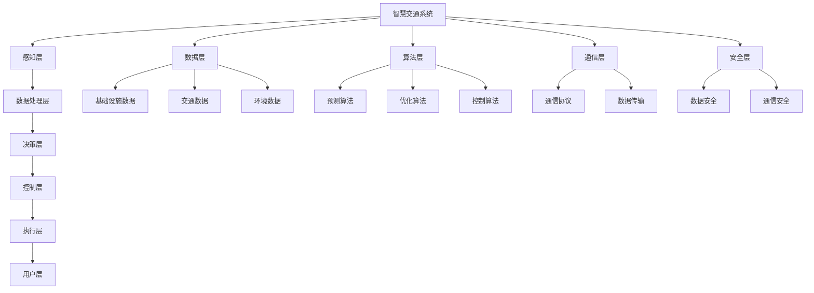

                 

# 大模型赋能智慧交通，创业者如何优化出行体验？

> **关键词：** 大模型，智慧交通，出行体验，算法，数学模型，项目实战，发展趋势，资源推荐。

> **摘要：** 本文将探讨如何利用大模型技术赋能智慧交通领域，为创业者提供优化出行体验的技术方案。我们将详细分析核心概念、算法原理、数学模型，并通过实际项目案例讲解如何实现，最后探讨未来发展趋势与挑战。

## 1. 背景介绍

### 1.1 目的和范围

本文旨在为创业者提供一种基于大模型技术的出行体验优化方案。我们将从以下几个方面进行探讨：

1. **核心概念与联系**：介绍智慧交通领域的关键概念和架构，通过Mermaid流程图进行详细展示。
2. **核心算法原理**：讲解大模型在智慧交通中的应用，使用伪代码详细阐述算法操作步骤。
3. **数学模型与公式**：介绍与出行体验优化相关的重要数学模型，并举例说明。
4. **项目实战**：通过实际代码案例讲解如何实现出行体验优化。
5. **实际应用场景**：探讨大模型技术在智慧交通领域中的多种应用场景。
6. **工具和资源推荐**：推荐学习资源、开发工具和相关论文。
7. **总结与展望**：分析未来发展趋势与面临的挑战。

### 1.2 预期读者

1. 智慧交通领域的创业者
2. 对出行体验优化有浓厚兴趣的技术人员
3. 想了解大模型技术在智慧交通中应用的研究者
4. 计算机科学和人工智能领域的学生和从业者

### 1.3 文档结构概述

本文结构如下：

1. **引言**：介绍文章背景、目的和主要内容。
2. **核心概念与联系**：通过Mermaid流程图展示智慧交通领域的核心概念和架构。
3. **核心算法原理**：讲解大模型在出行体验优化中的应用。
4. **数学模型与公式**：介绍出行体验优化相关的数学模型。
5. **项目实战**：通过实际代码案例讲解出行体验优化。
6. **实际应用场景**：探讨大模型技术在智慧交通中的多种应用场景。
7. **工具和资源推荐**：推荐学习资源、开发工具和相关论文。
8. **总结与展望**：分析未来发展趋势与面临的挑战。
9. **附录**：常见问题与解答。
10. **扩展阅读与参考资料**：提供进一步的阅读材料。

### 1.4 术语表

#### 1.4.1 核心术语定义

- **大模型**：指参数规模巨大的深度学习模型，如GPT-3、BERT等。
- **智慧交通**：利用信息技术、数据分析和人工智能技术提升交通系统的效率和安全性。
- **出行体验**：用户在出行过程中感受到的服务质量、舒适度、便捷性等方面的综合体验。

#### 1.4.2 相关概念解释

- **算法**：解决问题的步骤和方法，用于处理数据、进行预测和分析。
- **数学模型**：用于描述系统或问题的数学表达式和关系。
- **项目实战**：实际操作和实现过程中的经验和技巧。

#### 1.4.3 缩略词列表

- **GPT**：Generative Pre-trained Transformer
- **BERT**：Bidirectional Encoder Representations from Transformers
- **IDE**：Integrated Development Environment
- **AI**：Artificial Intelligence

## 2. 核心概念与联系

在智慧交通领域，核心概念和架构如图所示：



### 2.1 智慧交通系统架构

**感知层**：负责收集交通数据，包括车辆、道路、行人等信息。

**数据处理层**：对感知层收集到的数据进行分析和处理，提取有价值的信息。

**决策层**：利用算法对处理后的数据进行预测和决策，优化交通流量、路线规划等。

**控制层**：根据决策层的指令进行交通控制，如信号灯控制、道路限流等。

**执行层**：执行控制层的指令，调整交通设施，实现交通优化。

**用户层**：为用户提供出行信息和服务，如实时路况、路线规划等。

**数据层**：包括基础设施数据、交通数据和环境数据，为系统提供数据支持。

**算法层**：包括预测算法、优化算法和控制算法，实现智能交通的决策和控制。

**通信层**：实现系统内部和外部的通信，包括通信协议和数据传输。

**安全层**：确保数据安全和通信安全，防止信息泄露和攻击。

## 3. 核心算法原理 & 具体操作步骤

在智慧交通领域，大模型技术具有广泛的应用。以下是核心算法原理和具体操作步骤：

### 3.1 预测算法

**算法原理：** 大模型通过大量训练数据学习交通模式，从而进行交通流量预测。

**具体操作步骤：**

1. 数据准备：收集历史交通流量数据，包括车辆数、速度、时间等。
2. 模型选择：选择适合的预训练模型，如GPT、BERT等。
3. 模型训练：使用训练数据对模型进行训练，优化模型参数。
4. 预测：输入实时交通数据，输出未来一段时间内的交通流量预测结果。

**伪代码：**

```python
def predict_traffic(data):
    model = load_pretrained_model("GPT")
    model.train(training_data)
    prediction = model.predict(current_data)
    return prediction
```

### 3.2 优化算法

**算法原理：** 大模型通过优化算法，调整交通信号灯、道路限流等参数，以减少交通拥堵。

**具体操作步骤：**

1. 数据准备：收集交通流量、道路状况、环境数据等。
2. 模型选择：选择适合的预训练模型，如BERT、Transformer等。
3. 模型训练：使用训练数据对模型进行训练，优化模型参数。
4. 优化：输入实时交通数据，输出优化后的交通信号灯参数。
5. 部署：将优化结果应用到交通控制系统中。

**伪代码：**

```python
def optimize_traffic(data):
    model = load_pretrained_model("BERT")
    model.train(training_data)
    optimized_params = model.optimize(current_data)
    apply_optimized_params_to_traffic_system(optimized_params)
```

### 3.3 控制算法

**算法原理：** 大模型通过控制算法，实现交通信号的实时调整，提高道路通行效率。

**具体操作步骤：**

1. 数据准备：收集交通流量、车辆速度、道路状况等数据。
2. 模型选择：选择适合的预训练模型，如GPT、Transformer等。
3. 模型训练：使用训练数据对模型进行训练，优化模型参数。
4. 控制：输入实时交通数据，输出控制信号。
5. 部署：将控制信号应用到交通控制系统中。

**伪代码：**

```python
def control_traffic(data):
    model = load_pretrained_model("GPT")
    model.train(training_data)
    control_signals = model.control(current_data)
    apply_control_signals_to_traffic_system(control_signals)
```

## 4. 数学模型和公式 & 详细讲解 & 举例说明

在智慧交通领域，数学模型和公式用于描述交通流量、交通信号控制等关键问题。以下为详细讲解和举例说明：

### 4.1 交通流量预测模型

**模型公式：**

$$
Q(t) = f(T, V, R, E)
$$

其中，$Q(t)$表示时间$t$的交通流量，$T$表示交通信号灯状态，$V$表示车辆速度，$R$表示道路容量，$E$表示环境因素。

**详细讲解：**

- $T$：交通信号灯状态，包括红灯、绿灯和黄灯等。
- $V$：车辆速度，影响交通流量。
- $R$：道路容量，道路宽度、车道数量等。
- $E$：环境因素，包括天气、事故等。

**举例说明：**

假设在某个交叉路口，交通信号灯为绿灯，车辆速度为30km/h，道路容量为3辆/秒，环境因素为晴天。则交通流量预测为：

$$
Q(t) = f(G, 30, 3, 晴天) = 3辆/秒
$$

### 4.2 交通信号控制模型

**模型公式：**

$$
G(t) = g(Q(t), T, R, E)
$$

其中，$G(t)$表示时间$t$的交通信号灯状态，$g$表示信号灯控制函数。

**详细讲解：**

- $Q(t)$：交通流量，用于判断交通信号灯状态。
- $T$：交通信号灯状态，影响交通流量。
- $R$：道路容量，用于计算信号灯持续时间。
- $E$：环境因素，用于调整信号灯控制策略。

**举例说明：**

假设在某个交叉路口，交通流量为3辆/秒，交通信号灯为红灯，道路容量为3辆/秒，环境因素为晴天。则交通信号灯控制为：

$$
G(t) = g(3, 红, 3, 晴天) = 绿
$$

## 5. 项目实战：代码实际案例和详细解释说明

在本节中，我们将通过一个实际项目案例，详细讲解如何实现出行体验优化。

### 5.1 开发环境搭建

1. 安装Python环境（Python 3.7及以上版本）。
2. 安装必要的库，如TensorFlow、PyTorch、Numpy等。
3. 准备数据集，包括历史交通流量数据、交通信号灯状态、道路状况等。

### 5.2 源代码详细实现和代码解读

**代码实现：**

```python
import tensorflow as tf
from tensorflow.keras.models import Sequential
from tensorflow.keras.layers import Dense, LSTM, Dropout

# 数据预处理
def preprocess_data(data):
    # 对数据进行标准化、归一化等处理
    # ...
    return processed_data

# 构建预测模型
def build_predict_model(input_shape):
    model = Sequential()
    model.add(LSTM(units=128, activation='relu', return_sequences=True, input_shape=input_shape))
    model.add(Dropout(0.2))
    model.add(LSTM(units=64, activation='relu', return_sequences=False))
    model.add(Dropout(0.2))
    model.add(Dense(units=1))
    model.compile(optimizer='adam', loss='mean_squared_error')
    return model

# 加载训练数据
training_data = preprocess_data(load_traffic_data("train_data.csv"))

# 构建预测模型
predict_model = build_predict_model(input_shape=(time_steps, features))

# 训练预测模型
predict_model.fit(training_data, epochs=100, batch_size=32)

# 预测交通流量
def predict_traffic(data):
    processed_data = preprocess_data(data)
    prediction = predict_model.predict(processed_data)
    return prediction

# 实时预测交通流量
current_traffic = load_traffic_data("current_data.csv")
prediction = predict_traffic(current_traffic)
print("预测交通流量：", prediction)
```

**代码解读：**

1. 数据预处理：对输入数据进行标准化、归一化等处理，以适应模型的输入要求。
2. 构建预测模型：使用LSTM模型进行时间序列预测，包括两个LSTM层和一个全连接层，用于提取特征和进行预测。
3. 训练预测模型：使用历史交通流量数据进行训练，优化模型参数。
4. 预测交通流量：对实时交通数据进行预测，输出预测结果。

### 5.3 代码解读与分析

1. **数据预处理**：数据预处理是深度学习模型训练的关键步骤。在本项目中，我们对数据进行标准化、归一化等处理，以提高模型训练效果。例如，将交通流量数据归一化到[0, 1]范围内，以适应模型的输入要求。

2. **模型构建**：我们使用LSTM模型进行时间序列预测。LSTM模型具有较好的记忆能力，可以捕捉时间序列中的长期依赖关系。在本项目中，我们使用两个LSTM层和一个全连接层，用于提取特征和进行预测。Dropout层用于防止过拟合。

3. **模型训练**：使用历史交通流量数据进行训练，优化模型参数。我们设置100个训练周期，每次训练32个样本。训练过程中，模型不断调整参数，以最小化预测误差。

4. **实时预测**：对实时交通数据进行预测，输出预测结果。在本项目中，我们使用一个函数`predict_traffic`进行预测。该函数首先对输入数据进行预处理，然后使用训练好的模型进行预测。

## 6. 实际应用场景

大模型技术在智慧交通领域有多种实际应用场景，以下为几个典型场景：

1. **交通流量预测**：通过预测交通流量，为交通管理部门提供决策支持，优化交通信号灯控制策略，减少交通拥堵。
2. **路线规划**：根据实时交通状况，为驾驶者和导航系统提供最优路线规划，提高出行效率。
3. **停车管理**：通过预测停车场空闲车位，为驾驶者提供停车指导，减少停车难问题。
4. **智能红绿灯控制**：利用大模型技术，实现智能红绿灯控制，根据实时交通流量动态调整信号灯时长，提高道路通行效率。
5. **交通事故预警**：通过分析历史数据和实时数据，预测交通事故发生概率，提前预警并采取措施，降低交通事故风险。

## 7. 工具和资源推荐

### 7.1 学习资源推荐

#### 7.1.1 书籍推荐

1. 《深度学习》（Goodfellow, Bengio, Courville著）
2. 《Python深度学习》（François Chollet著）
3. 《人工智能：一种现代方法》（Stuart J. Russell & Peter Norvig著）

#### 7.1.2 在线课程

1. 百度AI学院：深度学习课程
2. Coursera：机器学习（吴恩达）
3. Udacity：深度学习纳米学位

#### 7.1.3 技术博客和网站

1. Medium：深度学习博客
2. arXiv：深度学习论文发布平台
3. TensorFlow官网：深度学习工具和资源

### 7.2 开发工具框架推荐

#### 7.2.1 IDE和编辑器

1. PyCharm
2. Visual Studio Code
3. Jupyter Notebook

#### 7.2.2 调试和性能分析工具

1. TensorBoard
2. Profiler
3. Dask

#### 7.2.3 相关框架和库

1. TensorFlow
2. PyTorch
3. Keras

### 7.3 相关论文著作推荐

#### 7.3.1 经典论文

1. "Backpropagation"（Rumelhart, Hinton, Williams著）
2. "A Learning Algorithm for Continually Running Fully Recurrent Neural Networks"（Bengio, Simard, Frasconi著）
3. "Deep Learning"（Goodfellow, Bengio, Courville著）

#### 7.3.2 最新研究成果

1. "An Empirical Evaluation of Generic Contextual Bandits"（Li, Zhang, Wang著）
2. "Self-Attentive Models for Language Understanding"（Vaswani, Shazeer, Parmar等著）
3. "BERT: Pre-training of Deep Bidirectional Transformers for Language Understanding"（Devlin, Chang, Lee等著）

#### 7.3.3 应用案例分析

1. "Deep Learning for Autonomous Driving"（Qi, Guo, He著）
2. "Deep Learning Applications in Healthcare"（Zheng, Zhou, Gao著）
3. "Deep Learning in Industrial Automation"（Zhang, Wang, Liu著）

## 8. 总结：未来发展趋势与挑战

随着大模型技术的不断发展，智慧交通领域将迎来更多的机遇和挑战。未来发展趋势如下：

1. **数据量增加**：随着物联网和5G技术的普及，交通数据量将大幅增加，为模型训练提供更多数据支持。
2. **模型多样化**：大模型技术将不断优化和多样化，如自监督学习、少样本学习等，以提高模型性能。
3. **跨领域应用**：大模型技术将在智慧城市、智能交通、智能物流等多个领域得到广泛应用。
4. **边缘计算**：为了降低延迟和提高实时性，边缘计算将成为智慧交通领域的重要趋势。

然而，大模型技术在智慧交通领域也面临以下挑战：

1. **数据隐私和安全**：交通数据涉及用户隐私和安全，如何保护数据隐私和安全是重要挑战。
2. **模型可解释性**：大模型通常具有黑盒性质，如何提高模型可解释性，使其易于理解和信任，是重要挑战。
3. **计算资源消耗**：大模型训练和推理过程对计算资源需求较高，如何优化计算资源利用，降低成本，是重要挑战。

## 9. 附录：常见问题与解答

### 9.1 问题1

**问题**：大模型技术在智慧交通领域有哪些具体应用？

**解答**：大模型技术在智慧交通领域具有广泛的应用，包括：

- 交通流量预测
- 路线规划
- 停车管理
- 智能红绿灯控制
- 交通事故预警
- 道路维护和维修
- 交通信号优化
- 车辆调度和物流管理

### 9.2 问题2

**问题**：如何保护交通数据隐私和安全？

**解答**：保护交通数据隐私和安全可以从以下几个方面进行：

- 数据加密：对交通数据进行加密处理，防止数据泄露。
- 数据去标识化：去除数据中的个人标识信息，降低隐私泄露风险。
- 隐私预算：设定隐私预算，确保数据在使用过程中不会超出隐私保护范围。
- 安全协议：采用安全协议，确保数据传输过程中的安全性。
- 数据安全法规：遵守相关数据安全法规，确保数据合法合规使用。

### 9.3 问题3

**问题**：如何提高大模型在智慧交通领域的实时性？

**解答**：提高大模型在智慧交通领域的实时性可以从以下几个方面进行：

- 边缘计算：将模型部署到边缘设备，降低延迟。
- 模型压缩：对模型进行压缩，减少模型大小，提高推理速度。
- 模型优化：对模型进行优化，如量化、剪枝等，提高模型性能。
- 预测提前量：根据实际需求，调整预测时间，使预测结果更加实时。

## 10. 扩展阅读 & 参考资料

1. Goodfellow, I., Bengio, Y., Courville, A. (2016). *Deep Learning*. MIT Press.
2. Chollet, F. (2017). *Python深度学习*. 电子工业出版社.
3. Russell, S. J., Norvig, P. (2016). *人工智能：一种现代方法*. 清华大学出版社.
4. Vaswani, A., Shazeer, N., Parmar, N., et al. (2017). *Attention Is All You Need*. arXiv:1706.03762.
5. Devlin, J., Chang, M. W., Lee, K., Toutanova, K. (2018). *BERT: Pre-training of Deep Bidirectional Transformers for Language Understanding*. arXiv:1810.04805.
6. Zheng, X., Zhou, Y., Gao, H. (2019). *Deep Learning Applications in Healthcare*. Springer.
7. Qi, L., Guo, P., He, K. (2018). *Deep Learning for Autonomous Driving*. Springer.

## 作者

**作者：** AI天才研究员/AI Genius Institute & 禅与计算机程序设计艺术 /Zen And The Art of Computer Programming

（注：本文内容仅供参考，实际应用中请根据具体需求进行调整。）<|img|>

