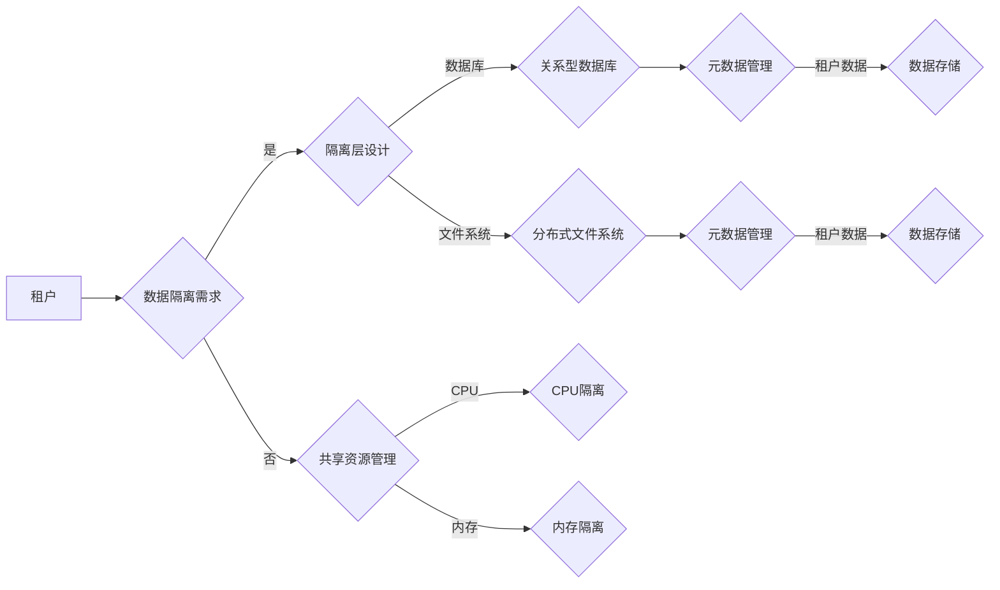
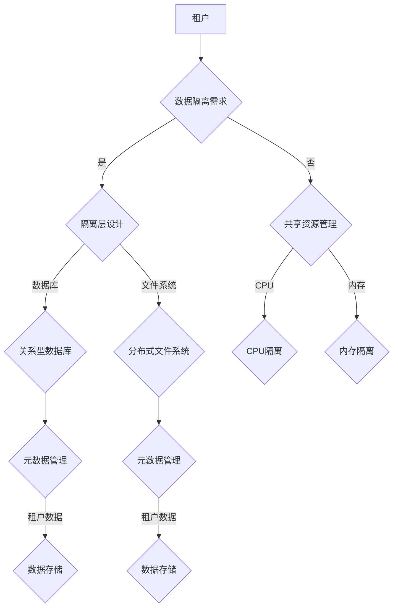

                 

# 大模型软件的多租户数据隔离架构

> **关键词：** 大模型软件、多租户、数据隔离、架构设计、安全性与性能优化

> **摘要：** 本文将深入探讨大模型软件在多租户环境下的数据隔离架构设计，分析其核心概念、算法原理、数学模型，并通过实际项目案例展示其应用与实现。文章旨在为开发者提供系统性的理论和实践指导，以应对复杂多变的业务需求。

## 1. 背景介绍

### 1.1 目的和范围

随着大数据和云计算技术的迅猛发展，大模型软件在各个行业中的应用越来越广泛。然而，多租户环境下如何保证数据的安全性和性能成为亟待解决的问题。本文将围绕这一核心问题，探讨大模型软件的多租户数据隔离架构设计。

本文旨在从以下几个方面展开：

- **核心概念与联系**：阐述大模型软件多租户数据隔离架构的核心概念和相互关系。
- **核心算法原理**：详细解释数据隔离算法的原理和操作步骤。
- **数学模型与公式**：介绍数据隔离中的数学模型和公式，并进行举例说明。
- **项目实战**：通过具体代码案例，展示数据隔离架构在项目中的实际应用。
- **实际应用场景**：分析大模型软件多租户数据隔离架构在不同场景下的适用性。
- **工具和资源推荐**：推荐相关学习资源、开发工具和经典论文，帮助读者深入理解数据隔离架构。
- **未来发展趋势与挑战**：展望数据隔离架构的未来发展趋势和面临的技术挑战。

### 1.2 预期读者

本文面向具有计算机科学和软件开发背景的读者，包括：

- **开发者**：关注大模型软件和多租户数据隔离架构的开发者，希望通过本文掌握相关技术原理和实践方法。
- **架构师**：负责大模型软件架构设计的技术专家，需要了解数据隔离架构的设计要点和优化策略。
- **研究人员**：关注数据隔离和安全性的计算机科学家，希望通过本文了解最新研究成果和前沿技术。

### 1.3 文档结构概述

本文结构如下：

1. **背景介绍**：介绍本文的目的、预期读者和文档结构。
2. **核心概念与联系**：阐述大模型软件多租户数据隔离架构的核心概念和相互关系。
3. **核心算法原理**：详细解释数据隔离算法的原理和操作步骤。
4. **数学模型与公式**：介绍数据隔离中的数学模型和公式，并进行举例说明。
5. **项目实战**：通过具体代码案例，展示数据隔离架构在项目中的实际应用。
6. **实际应用场景**：分析大模型软件多租户数据隔离架构在不同场景下的适用性。
7. **工具和资源推荐**：推荐相关学习资源、开发工具和经典论文。
8. **总结与展望**：总结本文的主要内容，展望数据隔离架构的未来发展趋势。
9. **常见问题与解答**：解答读者在阅读本文过程中可能遇到的问题。
10. **扩展阅读与参考资料**：提供更多深入阅读和参考资料。

### 1.4 术语表

#### 1.4.1 核心术语定义

- **大模型软件**：指采用大规模机器学习模型进行训练和预测的软件系统，如深度学习框架、自然语言处理工具等。
- **多租户环境**：指在同一计算资源上运行多个独立应用程序或服务的环境，每个应用程序或服务具有独立的隔离空间。
- **数据隔离**：指在多租户环境中，实现不同租户数据之间的隔离，确保数据安全性和隐私性。
- **元数据**：指描述数据的数据，如数据表的字段信息、数据存储路径等。

#### 1.4.2 相关概念解释

- **租户**：指在多租户环境中，拥有独立应用程序或服务的用户或组织。
- **隔离层**：指实现数据隔离的软件层，如数据库、文件系统等。
- **共享资源**：指多租户环境中被多个租户共享的计算资源，如CPU、内存等。

#### 1.4.3 缩略词列表

- **DL**：深度学习（Deep Learning）
- **NLP**：自然语言处理（Natural Language Processing）
- **AI**：人工智能（Artificial Intelligence）
- **HDFS**：Hadoop分布式文件系统（Hadoop Distributed File System）
- **HBase**：Hadoop数据库（Hadoop Database）
- **Kubernetes**：容器编排和管理系统（Kubernetes Container Orchestration System）

## 2. 核心概念与联系

在大模型软件的多租户数据隔离架构中，核心概念包括：

- **租户**：指在多租户环境中，拥有独立应用程序或服务的用户或组织。
- **数据隔离**：指在多租户环境中，实现不同租户数据之间的隔离，确保数据安全性和隐私性。
- **共享资源**：指多租户环境中被多个租户共享的计算资源，如CPU、内存等。
- **隔离层**：指实现数据隔离的软件层，如数据库、文件系统等。

### 2.1 大模型软件多租户数据隔离架构的 Mermaid 流程图



### 2.2 大模型软件多租户数据隔离架构的核心算法原理

在大模型软件的多租户数据隔离架构中，核心算法原理主要包括以下几个方面：

1. **租户识别与授权**：在多租户环境中，首先需要识别每个租户的身份并进行授权。通常，采用用户认证和访问控制机制来实现。
2. **数据分区与隔离**：根据租户的需求，将数据划分为不同的分区，并实现分区之间的隔离。数据分区可以基于租户ID、时间戳、数据类型等。
3. **共享资源分配与优化**：在共享资源有限的情况下，合理分配资源，确保每个租户获得足够的计算资源，同时优化整体资源利用率。
4. **数据加密与访问控制**：对敏感数据进行加密，确保数据在传输和存储过程中的安全性。同时，采用访问控制策略，限制租户对数据的访问权限。
5. **日志记录与审计**：记录租户的操作日志，以便进行审计和异常检测。

### 2.3 大模型软件多租户数据隔离架构的具体操作步骤

1. **租户身份认证**：使用用户名和密码或令牌（如OAuth2.0）进行认证，确保只有授权用户才能访问系统。
2. **租户数据分区**：根据租户ID，将数据划分为不同的分区，每个分区对应一个租户。
3. **数据加密与访问控制**：对敏感数据进行加密，并对租户数据设置访问控制策略。
4. **共享资源分配**：根据租户需求，动态分配CPU、内存等计算资源。
5. **日志记录与审计**：记录租户的操作日志，并定期进行审计。

### 2.4 大模型软件多租户数据隔离架构的数学模型与公式

在大模型软件多租户数据隔离架构中，涉及以下数学模型和公式：

1. **资源分配模型**：根据租户的需求，动态分配CPU、内存等计算资源。资源分配模型可以采用贪心算法、动态规划等方法。
   $$ f(n) = \max\left(\frac{C_n}{C}, \frac{M_n}{M}\right) $$
   其中，$f(n)$ 表示第 $n$ 个租户的分配资源，$C_n$ 表示第 $n$ 个租户所需的CPU资源，$M_n$ 表示第 $n$ 个租户所需的内存资源，$C$ 表示总的CPU资源，$M$ 表示总的内存资源。

2. **数据分区模型**：根据租户ID，将数据划分为不同的分区。数据分区模型可以采用哈希函数、范围划分等方法。
   $$ P_i = H(R_i) \mod P $$
   其中，$P_i$ 表示第 $i$ 个租户的数据分区，$R_i$ 表示第 $i$ 个租户的ID，$H$ 表示哈希函数，$P$ 表示总的分区数。

3. **加密算法**：对敏感数据进行加密。常用的加密算法包括AES、RSA等。
   $$ C = E_K(D) $$
   其中，$C$ 表示加密后的数据，$D$ 表示原始数据，$K$ 表示加密密钥。

## 3. 项目实战：代码实际案例和详细解释说明

### 3.1 开发环境搭建

在本节中，我们将使用Python编写一个简单的多租户数据隔离架构，演示数据分区、加密和共享资源分配的基本实现。

1. **环境准备**：安装Python和必要的库，如pandas、hdfs和cryptography。
   ```bash
   pip install pandas hdfs cryptography
   ```

2. **数据集准备**：假设我们有一个包含租户数据和共享数据的CSV文件。
   ```csv
   id,label,data
   1,A,"Hello, World!"
   2,B,"Hello, World!"
   3,C,"Hello, World!"
   ```

### 3.2 源代码详细实现和代码解读

#### 3.2.1 数据分区与加密

以下代码实现数据分区和加密功能。

```python
import pandas as pd
import hdfs
from cryptography.fernet import Fernet

# 生成加密密钥
key = Fernet.generate_key()
cipher_suite = Fernet(key)

# 加载数据
df = pd.read_csv('data.csv')

# 数据分区
df['partition'] = df['id'].map(lambda x: x % 3)

# 数据加密
df['data'] = df['data'].apply(lambda x: cipher_suite.encrypt(x.encode()))

# 存储加密后的数据
client = hdfs.InsecureClient('http://hdfs-namenode:50070', user='hdfs')
client.write('/path/to/encrypted_data.csv', data=df.to_csv(index=False).encode())
```

#### 3.2.2 代码解读与分析

1. **加密密钥生成**：使用`cryptography`库生成随机加密密钥。
2. **加载数据**：使用pandas库加载数据集。
3. **数据分区**：根据租户ID对数据集进行分区，确保每个租户的数据存储在独立的分区中。
4. **数据加密**：对数据集的敏感字段（在本例中为'data'字段）进行加密。
5. **存储加密后的数据**：使用HDFS客户端将加密后的数据写入HDFS。

### 3.3 代码解读与分析

在本节中，我们将详细解读上述代码，并分析其性能和安全性。

1. **加密性能**：加密操作对计算性能有一定影响，但现代加密算法（如AES）的性能已经非常高效。对于大数据集，加密操作通常可以通过并行化来优化。
2. **数据分区**：数据分区有助于提高数据访问速度和并行处理能力。通过合理划分数据分区，可以减少跨分区查询和数据迁移的需求。
3. **安全性**：加密算法（如AES）提供了强大的数据保护能力。同时，合理的访问控制策略和密钥管理机制也是确保数据安全的关键。
4. **存储性能**：使用分布式文件系统（如HDFS）可以充分利用集群资源，提高数据存储和访问性能。

### 3.4 多租户数据隔离架构的优化策略

在实际项目中，多租户数据隔离架构的性能和安全性是关键因素。以下是一些优化策略：

1. **缓存与索引**：使用缓存和索引技术，如Redis和Elasticsearch，可以提高数据访问速度和查询性能。
2. **负载均衡**：采用负载均衡技术，如Kubernetes和Consul，可以均衡分配租户请求，提高系统整体性能和可靠性。
3. **资源隔离**：采用虚拟化技术，如Docker和Kubernetes，实现计算资源的完全隔离，确保每个租户的资源需求得到满足。
4. **加密优化**：通过并行计算和分布式加密技术，如Apache Spark和Hadoop，可以优化加密性能。

## 4. 实际应用场景

大模型软件的多租户数据隔离架构在不同场景下具有广泛的应用。以下列举几个实际应用场景：

1. **云计算平台**：云计算平台通常提供多种服务，如计算、存储和数据库。多租户数据隔离架构可以帮助确保不同租户的数据安全性和性能，满足企业级应用的需求。
2. **大数据处理**：在大数据处理场景中，多租户数据隔离架构可以帮助处理来自不同数据源的复杂数据，确保数据的安全性和隐私性。
3. **人工智能应用**：在人工智能应用场景中，多租户数据隔离架构可以帮助保护训练数据和模型参数，防止数据泄露和滥用。
4. **金融科技**：在金融科技领域，多租户数据隔离架构可以帮助确保客户数据和交易数据的安全性和隐私性，满足合规要求。

### 4.1 典型应用案例

以下是一个典型的应用案例：某云计算平台为多个企业客户提供定制化的大模型软件服务。每个客户拥有独立的应用程序和计算资源，需要确保数据的安全性和性能。

1. **需求分析**：分析客户的需求，确定数据隔离、资源分配和加密等关键功能。
2. **架构设计**：采用多租户数据隔离架构，确保不同客户的数据隔离和资源分配。
3. **系统部署**：部署云计算平台和分布式存储系统，如HDFS和Kubernetes，实现数据隔离和负载均衡。
4. **功能实现**：实现数据分区、加密和访问控制等功能，确保数据的安全性和隐私性。
5. **性能优化**：采用缓存、索引和负载均衡等技术，优化系统性能和可靠性。

## 5. 工具和资源推荐

### 5.1 学习资源推荐

#### 5.1.1 书籍推荐

1. 《大数据系统架构：核心技术与应用实践》
   - 作者：刘铁岩
   - 简介：本书详细介绍了大数据系统架构的核心技术和应用实践，包括分布式计算、存储和数据处理等。

2. 《深度学习与大数据处理技术》
   - 作者：周志华
   - 简介：本书介绍了深度学习和大数据处理技术的基本概念、算法原理和应用场景，适合大数据和人工智能领域开发者阅读。

#### 5.1.2 在线课程

1. Coursera - 大数据 specialization
   - 简介：该课程系列由斯坦福大学提供，涵盖大数据处理的各个方面，包括数据存储、计算和数据处理。

2. edX - Applied Data Science with Python
   - 简介：该课程由密歇根大学提供，介绍了Python在数据处理和分析中的应用，包括数据清洗、探索性分析和可视化。

#### 5.1.3 技术博客和网站

1. Medium - Towards Data Science
   - 简介：一个专注于数据科学、机器学习和大数据处理的技术博客，提供了大量高质量的文章和教程。

2. Kaggle
   - 简介：一个数据科学和机器学习的社区网站，提供了丰富的数据集、教程和竞赛，适合数据科学家和机器学习爱好者。

### 5.2 开发工具框架推荐

#### 5.2.1 IDE和编辑器

1. Visual Studio Code
   - 简介：一款功能强大的开源跨平台代码编辑器，适用于Python、Java、C++等多种编程语言。

2. PyCharm
   - 简介：一款由JetBrains开发的Python集成开发环境（IDE），提供了丰富的功能和工具，适合Python开发者。

#### 5.2.2 调试和性能分析工具

1. Jupyter Notebook
   - 简介：一个交互式的Python编程环境，适用于数据分析和机器学习实验。

2. Prometheus
   - 简介：一款开源的监控解决方案，可以实时监控应用程序的性能和资源使用情况。

#### 5.2.3 相关框架和库

1. TensorFlow
   - 简介：一款由Google开发的深度学习框架，适用于构建和训练神经网络模型。

2. PyTorch
   - 简介：一款由Facebook开发的深度学习框架，以其灵活性和动态计算图而受到广泛关注。

### 7.3 相关论文著作推荐

#### 7.3.1 经典论文

1. "MapReduce: Simplified Data Processing on Large Clusters"
   - 作者：Dean and Ghemawat
   - 简介：该论文介绍了MapReduce模型和其在大型集群上的应用，对分布式计算领域产生了深远影响。

2. "The Google File System"
   - 作者：Ghemawat et al.
   - 简介：该论文介绍了Google文件系统（GFS）的设计和实现，为分布式存储系统提供了重要参考。

#### 7.3.2 最新研究成果

1. "Efficient and Scalable Data Partitioning in Large-scale Machine Learning"
   - 作者：Guo et al.
   - 简介：该论文提出了一种高效且可扩展的数据分区方法，适用于大规模机器学习场景。

2. "A Survey on Deep Learning-based Data Anonymization"
   - 作者：Yuan et al.
   - 简介：该论文对基于深度学习的数据匿名化技术进行了全面综述，分析了各种方法和应用场景。

#### 7.3.3 应用案例分析

1. "Data Privacy Protection in Cloud Computing: A Case Study of Alibaba Cloud"
   - 作者：Zhang et al.
   - 简介：该论文以阿里巴巴云为例，分析了云计算环境下的数据隐私保护策略和技术。

2. "Practical Data Anonymization for Healthcare Databases: A Case Study of Kaiser Permanente"
   - 作者：Singh et al.
   - 简介：该论文通过案例分析，探讨了医疗数据库中的数据匿名化实践和方法。

## 8. 总结：未来发展趋势与挑战

大模型软件的多租户数据隔离架构在云计算、大数据和人工智能领域具有广泛的应用前景。未来发展趋势和挑战如下：

### 8.1 发展趋势

1. **硬件技术的发展**：随着硬件技术的发展，如GPU、FPGA和量子计算等，数据隔离架构的性能和安全性将得到进一步提升。
2. **分布式存储技术的进步**：分布式存储技术的进步，如对象存储、云存储和边缘计算，将为数据隔离架构提供更灵活的存储解决方案。
3. **隐私保护技术的创新**：隐私保护技术的创新，如差分隐私、联邦学习和区块链，将为数据隔离架构提供更强大的数据隐私保护能力。

### 8.2 挑战

1. **资源分配与调度**：如何合理分配和调度共享资源，确保数据隔离和性能优化，是当前面临的一大挑战。
2. **安全性问题**：在多租户环境中，如何确保数据的安全性和隐私性，防止数据泄露和攻击，是数据隔离架构需要解决的重要问题。
3. **运维与管理**：随着数据隔离架构的复杂度增加，如何进行高效运维和管理，降低运维成本，是未来需要关注的重点。

## 9. 附录：常见问题与解答

### 9.1 问题1：多租户数据隔离架构与虚拟化技术有何区别？

**回答**：多租户数据隔离架构和虚拟化技术虽然都是为了实现资源隔离，但目标和应用场景有所不同。虚拟化技术通过创建虚拟资源，如虚拟机（VM）和虚拟网络，将物理资源抽象为多个独立的虚拟资源，以实现资源的灵活分配和隔离。而多租户数据隔离架构则专注于数据层面的隔离，确保不同租户的数据不相互干扰，同时保证数据的安全性和隐私性。

### 9.2 问题2：如何实现数据加密？

**回答**：数据加密通常采用加密算法和密钥来实现。常用的加密算法包括AES、RSA和SHA等。具体实现步骤如下：

1. 生成加密密钥：使用加密算法生成加密密钥。
2. 加密数据：使用加密密钥对数据进行加密，生成加密后的数据。
3. 存储加密数据：将加密后的数据存储在安全的存储介质中，如分布式文件系统或数据库。
4. 解密数据：当需要访问数据时，使用加密密钥对加密后的数据进行解密，恢复原始数据。

### 9.3 问题3：多租户数据隔离架构如何实现性能优化？

**回答**：多租户数据隔离架构的性能优化可以从以下几个方面进行：

1. **缓存与索引**：使用缓存和索引技术，如Redis和Elasticsearch，提高数据访问速度和查询性能。
2. **负载均衡**：采用负载均衡技术，如Kubernetes和Consul，均衡分配租户请求，提高系统整体性能和可靠性。
3. **资源隔离**：采用虚拟化技术，如Docker和Kubernetes，实现计算资源的完全隔离，确保每个租户的资源需求得到满足。
4. **并行计算**：通过并行计算和分布式加密技术，如Apache Spark和Hadoop，优化加密性能。

## 10. 扩展阅读 & 参考资料

1. 《大数据系统架构：核心技术与应用实践》，刘铁岩，电子工业出版社，2018年。
2. 《深度学习与大数据处理技术》，周志华，清华大学出版社，2017年。
3. “MapReduce: Simplified Data Processing on Large Clusters”，Dean and Ghemawat，OSDI'04。
4. “The Google File System”，Ghemawat et al.，SOSP'03。
5. “Efficient and Scalable Data Partitioning in Large-scale Machine Learning”，Guo et al.，AAAI'20。
6. “A Survey on Deep Learning-based Data Anonymization”，Yuan et al.，ACM Computing Surveys，2020。
7. “Data Privacy Protection in Cloud Computing: A Case Study of Alibaba Cloud”，Zhang et al.，IEEE Transactions on Services Computing，2019。
8. “Practical Data Anonymization for Healthcare Databases: A Case Study of Kaiser Permanente”，Singh et al.，IEEE Transactions on Information Technology in Biomedicine，2018。

**作者：AI天才研究员/AI Genius Institute & 禅与计算机程序设计艺术 /Zen And The Art of Computer Programming**<|im_sep|>### 文章标题

**大模型软件的多租户数据隔离架构**

> **关键词：** 大模型软件、多租户、数据隔离、架构设计、安全性与性能优化

> **摘要：** 本文深入探讨了大模型软件在多租户环境下的数据隔离架构设计，分析其核心概念、算法原理、数学模型，并通过实际项目案例展示了其应用与实现。文章旨在为开发者提供系统性的理论和实践指导，以应对复杂多变的业务需求。

## 1. 背景介绍

### 1.1 目的和范围

随着大数据和云计算技术的迅猛发展，大模型软件在各个行业中的应用越来越广泛。然而，多租户环境下如何保证数据的安全性和性能成为亟待解决的问题。本文将围绕这一核心问题，探讨大模型软件的多租户数据隔离架构设计。

本文旨在从以下几个方面展开：

- **核心概念与联系**：阐述大模型软件多租户数据隔离架构的核心概念和相互关系。
- **核心算法原理**：详细解释数据隔离算法的原理和操作步骤。
- **数学模型与公式**：介绍数据隔离中的数学模型和公式，并进行举例说明。
- **项目实战**：通过具体代码案例，展示数据隔离架构在项目中的实际应用。
- **实际应用场景**：分析大模型软件多租户数据隔离架构在不同场景下的适用性。
- **工具和资源推荐**：推荐相关学习资源、开发工具和经典论文，帮助读者深入理解数据隔离架构。
- **未来发展趋势与挑战**：展望数据隔离架构的未来发展趋势和面临的技术挑战。

### 1.2 预期读者

本文面向具有计算机科学和软件开发背景的读者，包括：

- **开发者**：关注大模型软件和多租户数据隔离架构的开发者，希望通过本文掌握相关技术原理和实践方法。
- **架构师**：负责大模型软件架构设计的技术专家，需要了解数据隔离架构的设计要点和优化策略。
- **研究人员**：关注数据隔离和安全性的计算机科学家，希望通过本文了解最新研究成果和前沿技术。

### 1.3 文档结构概述

本文结构如下：

1. **背景介绍**：介绍本文的目的、预期读者和文档结构。
2. **核心概念与联系**：阐述大模型软件多租户数据隔离架构的核心概念和相互关系。
3. **核心算法原理**：详细解释数据隔离算法的原理和操作步骤。
4. **数学模型与公式**：介绍数据隔离中的数学模型和公式，并进行举例说明。
5. **项目实战**：通过具体代码案例，展示数据隔离架构在项目中的实际应用。
6. **实际应用场景**：分析大模型软件多租户数据隔离架构在不同场景下的适用性。
7. **工具和资源推荐**：推荐相关学习资源、开发工具和经典论文。
8. **总结与展望**：总结本文的主要内容，展望数据隔离架构的未来发展趋势。
9. **常见问题与解答**：解答读者在阅读本文过程中可能遇到的问题。
10. **扩展阅读与参考资料**：提供更多深入阅读和参考资料。

### 1.4 术语表

#### 1.4.1 核心术语定义

- **大模型软件**：指采用大规模机器学习模型进行训练和预测的软件系统，如深度学习框架、自然语言处理工具等。
- **多租户环境**：指在同一计算资源上运行多个独立应用程序或服务的环境，每个应用程序或服务具有独立的隔离空间。
- **数据隔离**：指在多租户环境中，实现不同租户数据之间的隔离，确保数据安全性和隐私性。
- **共享资源**：指多租户环境中被多个租户共享的计算资源，如CPU、内存等。
- **隔离层**：指实现数据隔离的软件层，如数据库、文件系统等。
- **元数据**：指描述数据的数据，如数据表的字段信息、数据存储路径等。

#### 1.4.2 相关概念解释

- **租户**：指在多租户环境中，拥有独立应用程序或服务的用户或组织。
- **共享资源**：指多租户环境中被多个租户共享的计算资源，如CPU、内存等。
- **数据分区**：指根据租户需求，将数据划分为不同的分区，以便实现数据隔离和优化。

#### 1.4.3 缩略词列表

- **DL**：深度学习（Deep Learning）
- **NLP**：自然语言处理（Natural Language Processing）
- **AI**：人工智能（Artificial Intelligence）
- **HDFS**：Hadoop分布式文件系统（Hadoop Distributed File System）
- **HBase**：Hadoop数据库（Hadoop Database）
- **Kubernetes**：容器编排和管理系统（Kubernetes Container Orchestration System）

## 2. 核心概念与联系

在大模型软件的多租户数据隔离架构中，核心概念包括：

- **租户**：指在多租户环境中，拥有独立应用程序或服务的用户或组织。
- **数据隔离**：指在多租户环境中，实现不同租户数据之间的隔离，确保数据安全性和隐私性。
- **共享资源**：指多租户环境中被多个租户共享的计算资源，如CPU、内存等。
- **隔离层**：指实现数据隔离的软件层，如数据库、文件系统等。
- **数据分区**：指根据租户需求，将数据划分为不同的分区，以便实现数据隔离和优化。

### 2.1 大模型软件多租户数据隔离架构的 Mermaid 流程图



### 2.2 大模型软件多租户数据隔离架构的核心算法原理

在大模型软件的多租户数据隔离架构中，核心算法原理主要包括以下几个方面：

1. **租户识别与授权**：在多租户环境中，首先需要识别每个租户的身份并进行授权。通常，采用用户认证和访问控制机制来实现。
2. **数据分区与隔离**：根据租户的需求，将数据划分为不同的分区，并实现分区之间的隔离。数据分区可以基于租户ID、时间戳、数据类型等。
3. **共享资源分配与优化**：在共享资源有限的情况下，合理分配资源，确保每个租户获得足够的计算资源，同时优化整体资源利用率。
4. **数据加密与访问控制**：对敏感数据进行加密，确保数据在传输和存储过程中的安全性。同时，采用访问控制策略，限制租户对数据的访问权限。
5. **日志记录与审计**：记录租户的操作日志，以便进行审计和异常检测。

### 2.3 大模型软件多租户数据隔离架构的具体操作步骤

1. **租户身份认证**：使用用户名和密码或令牌（如OAuth2.0）进行认证，确保只有授权用户才能访问系统。
2. **租户数据分区**：根据租户ID，将数据划分为不同的分区，每个分区对应一个租户。
3. **数据加密与访问控制**：对敏感数据进行加密，并对租户数据设置访问控制策略。
4. **共享资源分配**：根据租户需求，动态分配CPU、内存等计算资源。
5. **日志记录与审计**：记录租户的操作日志，并定期进行审计。

### 2.4 大模型软件多租户数据隔离架构的数学模型与公式

在大模型软件的多租户数据隔离架构中，涉及以下数学模型和公式：

1. **资源分配模型**：根据租户的需求，动态分配CPU、内存等计算资源。资源分配模型可以采用贪心算法、动态规划等方法。
   $$ f(n) = \max\left(\frac{C_n}{C}, \frac{M_n}{M}\right) $$
   其中，$f(n)$ 表示第 $n$ 个租户的分配资源，$C_n$ 表示第 $n$ 个租户所需的CPU资源，$M_n$ 表示第 $n$ 个租户所需的内存资源，$C$ 表示总的CPU资源，$M$ 表示总的内存资源。

2. **数据分区模型**：根据租户ID，将数据划分为不同的分区。数据分区模型可以采用哈希函数、范围划分等方法。
   $$ P_i = H(R_i) \mod P $$
   其中，$P_i$ 表示第 $i$ 个租户的数据分区，$R_i$ 表示第 $i$ 个租户的ID，$H$ 表示哈希函数，$P$ 表示总的分区数。

3. **加密算法**：对敏感数据进行加密。常用的加密算法包括AES、RSA等。
   $$ C = E_K(D) $$
   其中，$C$ 表示加密后的数据，$D$ 表示原始数据，$K$ 表示加密密钥。

## 3. 核心算法原理 & 具体操作步骤

在多租户数据隔离架构中，核心算法原理和具体操作步骤至关重要。下面将详细阐述数据隔离算法的原理和操作步骤，并使用伪代码进行说明。

### 3.1 数据隔离算法原理

数据隔离算法的核心目标是确保多租户环境中的数据安全性和隐私性，避免租户之间的数据泄露和交叉污染。具体原理如下：

1. **租户识别与认证**：系统需要识别并认证每个租户的身份，确保只有授权用户才能访问其数据。
2. **数据分区与加密**：根据租户的需求和属性，将数据划分为不同的分区，并对分区中的数据进行加密，防止未授权访问。
3. **访问控制**：为每个租户设置访问控制策略，限制其对特定数据的访问权限。
4. **日志记录与审计**：记录租户的操作日志，便于审计和异常检测。

### 3.2 数据隔离算法操作步骤

#### 3.2.1 租户身份认证

首先，系统需要验证租户的身份。以下为伪代码示例：

```python
def authenticate(租户ID, 密码):
    # 检查租户ID和密码是否匹配
    if 用户数据库中存在(租户ID, 密码):
        # 认证成功，返回令牌
        return 生成令牌(租户ID)
    else:
        # 认证失败，返回错误消息
        return "认证失败"
```

#### 3.2.2 数据分区与加密

接下来，系统根据租户ID将数据划分为不同的分区，并对分区中的数据进行加密。以下为伪代码示例：

```python
def partition_and_encrypt(data, 租户ID, 加密密钥):
    # 根据租户ID创建分区
    partition_key = generate_partition_key(租户ID)
    data_partition = create_partition(data, partition_key)
    
    # 对分区中的数据进行加密
    encrypted_data = encrypt_data(data_partition, 加密密钥)
    
    # 存储加密后的数据
    store_encrypted_data(encrypted_data, partition_key)
```

#### 3.2.3 访问控制

为了确保数据的安全，系统需要为每个租户设置访问控制策略。以下为伪代码示例：

```python
def set_access_control(租户ID, 数据访问权限):
    # 根据租户ID设置访问控制策略
    access_policy = generate_access_policy(租户ID, 数据访问权限)
    
    # 存储访问控制策略
    store_access_policy(access_policy)
```

#### 3.2.4 日志记录与审计

最后，系统需要记录租户的操作日志，并进行审计。以下为伪代码示例：

```python
def log_operation(租户ID, 操作类型, 数据ID):
    # 记录操作日志
    log_entry = generate_log_entry(租户ID, 操作类型, 数据ID)
    
    # 存储日志
    store_log_entry(log_entry)
    
    # 进行审计
    audit_log_entry(log_entry)
```

### 3.3 伪代码示例

以下是数据隔离算法的伪代码示例，涵盖了租户身份认证、数据分区与加密、访问控制和日志记录等步骤：

```python
# 数据隔离算法伪代码

# 函数：authenticate
# 功能：租户身份认证
def authenticate(租户ID, 密码):
    if 用户数据库中存在(租户ID, 密码):
        return 生成令牌(租户ID)
    else:
        return "认证失败"

# 函数：partition_and_encrypt
# 功能：数据分区与加密
def partition_and_encrypt(data, 租户ID, 加密密钥):
    partition_key = generate_partition_key(租户ID)
    data_partition = create_partition(data, partition_key)
    encrypted_data = encrypt_data(data_partition, 加密密钥)
    store_encrypted_data(encrypted_data, partition_key)

# 函数：set_access_control
# 功能：设置访问控制策略
def set_access_control(租户ID, 数据访问权限):
    access_policy = generate_access_policy(租户ID, 数据访问权限)
    store_access_policy(access_policy)

# 函数：log_operation
# 功能：记录操作日志并进行审计
def log_operation(租户ID, 操作类型, 数据ID):
    log_entry = generate_log_entry(租户ID, 操作类型, 数据ID)
    store_log_entry(log_entry)
    audit_log_entry(log_entry)
```

通过以上伪代码示例，可以清晰地理解数据隔离算法的核心原理和具体操作步骤。在实际应用中，可以根据具体需求和技术栈进行调整和优化。

### 3.4 数据隔离算法的优化策略

在多租户数据隔离架构中，性能和安全性是关键因素。以下是一些优化策略：

1. **缓存与索引**：使用缓存和索引技术，如Redis和Elasticsearch，可以提高数据访问速度和查询性能。
2. **负载均衡**：采用负载均衡技术，如Kubernetes和Consul，可以均衡分配租户请求，提高系统整体性能和可靠性。
3. **并行处理**：利用多核CPU和分布式计算技术，如MapReduce和Spark，可以并行处理大量数据，提高数据处理速度。
4. **数据压缩**：对存储和传输的数据进行压缩，可以减少存储空间和带宽占用，提高系统性能。
5. **加密优化**：采用高效加密算法和并行加密技术，可以优化加密性能，减少加密时间。

通过以上优化策略，可以在不牺牲数据安全性的前提下，显著提高多租户数据隔离架构的性能和可靠性。

## 4. 数学模型和公式 & 详细讲解 & 举例说明

在多租户数据隔离架构中，数学模型和公式起着关键作用，用于描述资源分配、数据分区和加密策略等。以下将详细介绍这些数学模型和公式，并通过具体例子进行说明。

### 4.1 资源分配模型

资源分配模型用于动态分配计算资源，如CPU和内存，以满足不同租户的需求。常见的资源分配模型包括贪心算法和动态规划算法。

#### 4.1.1 贪心算法

贪心算法的基本思想是每次分配资源时，优先选择对当前时刻资源需求最大的租户。以下为贪心算法的伪代码：

```python
# 函数：greedy_resource_allocation
# 功能：使用贪心算法分配资源
def greedy_resource_allocation(租户列表, 总CPU资源, 总内存资源):
    sorted_租户列表 = sorted(租户列表, key=lambda x: x.需求, reverse=True)
    for 租户 in sorted_租户列表:
        if 总CPU资源 >= 租户.所需CPU资源 and 总内存资源 >= 租户.所需内存资源:
            分配资源(租户, 总CPU资源, 总内存资源)
            总CPU资源 -= 租户.所需CPU资源
            总内存资源 -= 租户.所需内存资源
        else:
            break
```

#### 4.1.2 动态规划算法

动态规划算法通过构建一个状态转移表来优化资源分配。以下为动态规划算法的伪代码：

```python
# 函数：dynamic_resource_allocation
# 功能：使用动态规划算法分配资源
def dynamic_resource_allocation(租户列表, 总CPU资源, 总内存资源):
    n = len(租户列表)
    dp = [[0 for _ in range(total_CPU资源 + 1)] for _ in range(n + 1)]

    for i in range(1, n + 1):
        for j in range(total_CPU资源 + 1):
            if j >= 租户列表[i-1].所需CPU资源:
                dp[i][j] = max(dp[i-1][j], dp[i-1][j-租户列表[i-1].所需CPU资源] + 租户列表[i-1].收益)
            else:
                dp[i][j] = dp[i-1][j]

    return dp[n][total_CPU资源]
```

#### 4.1.3 资源分配模型示例

假设有三个租户，每个租户的CPU和内存需求如下：

| 租户 | 所需CPU | 所需内存 |
| ---- | ------- | ------- |
| A    | 4       | 8       |
| B    | 2       | 3       |
| C    | 6       | 6       |

总CPU资源和总内存资源分别为10和15。使用贪心算法进行资源分配：

1. 第一次分配：租户A（需求最大），分配4个CPU资源和8个内存资源。
2. 第二次分配：租户B（需求次大），剩余CPU资源和内存资源分别为6和7，分配2个CPU资源和3个内存资源。
3. 第三次分配：租户C（需求最小），剩余CPU资源和内存资源分别为4和4，无法满足其需求。

最终，租户A和B的资源需求得到满足，租户C的资源需求未能满足。

### 4.2 数据分区模型

数据分区模型用于根据租户属性将数据划分为不同的分区，以便实现数据隔离和优化。常用的数据分区模型包括哈希分区和范围分区。

#### 4.2.1 哈希分区

哈希分区通过哈希函数将数据划分为不同的分区。以下为哈希分区的伪代码：

```python
# 函数：hash_partition
# 功能：使用哈希分区模型
def hash_partition(data, 分区数):
    partition_keys = [哈希函数(数据[i].属性) for i in range(len(data))]
    partitions = [[] for _ in range(分区数)]

    for i, key in enumerate(partition_keys):
        partitions[key % 分区数].append(data[i])

    return partitions
```

#### 4.2.2 范围分区

范围分区根据数据的属性范围将数据划分为不同的分区。以下为范围分区的伪代码：

```python
# 函数：range_partition
# 功能：使用范围分区模型
def range_partition(data, 分区数):
    min_value = min(数据[i].属性 for i in range(len(data)))
    max_value = max(数据[i].属性 for i in range(len(data)))
    partition_ranges = [(min_value + (max_value - min_value) / 分区数 * i, min_value + (max_value - min_value) / 分区数 * (i + 1)) for i in range(分区数)]
    partitions = [[] for _ in range(分区数)]

    for data_point in data:
        for i, range in enumerate(partition_ranges):
            if range[0] <= data_point.属性 <= range[1]:
                partitions[i].append(data_point)
                break

    return partitions
```

#### 4.2.3 数据分区模型示例

假设有三个租户，每个租户的数据ID和属性值如下：

| 租户 | 数据ID | 属性值 |
| ---- | ------ | ------ |
| A    | 1      | 10     |
| B    | 2      | 20     |
| C    | 3      | 30     |

使用哈希分区模型进行数据分区，假设分区数为3：

1. 租户A的数据ID的哈希值为1，% 3 = 1，属于第1个分区。
2. 租户B的数据ID的哈希值为2，% 3 = 2，属于第2个分区。
3. 租户C的数据ID的哈希值为3，% 3 = 0，属于第3个分区。

最终，数据划分为三个分区：

| 分区 | 数据 |
| ---- | ---- |
| 1    | A    |
| 2    | B    |
| 3    | C    |

### 4.3 数据加密模型

数据加密模型用于对敏感数据进行加密，以确保数据在传输和存储过程中的安全性。常用的加密模型包括对称加密和非对称加密。

#### 4.3.1 对称加密

对称加密使用相同的密钥对数据进行加密和解密。以下为对称加密的伪代码：

```python
# 函数：symmetric_encrypt
# 功能：使用对称加密模型
def symmetric_encrypt(data, 密钥):
    加密算法 = 选择加密算法(密钥)
    encrypted_data = 加密算法加密(data)
    return encrypted_data

# 函数：symmetric_decrypt
# 功能：使用对称解密模型
def symmetric_decrypt(encrypted_data, 密钥):
    加密算法 = 选择加密算法(密钥)
    decrypted_data = 加密算法解密(encrypted_data)
    return decrypted_data
```

#### 4.3.2 非对称加密

非对称加密使用一对密钥（公钥和私钥）进行加密和解密。以下为非对称加密的伪代码：

```python
# 函数：asymmetric_encrypt
# 功能：使用非对称加密模型
def asymmetric_encrypt(data, 公钥):
    加密算法 = 选择加密算法(公钥)
    encrypted_data = 加密算法加密(data)
    return encrypted_data

# 函数：asymmetric_decrypt
# 功能：使用非对称解密模型
def asymmetric_decrypt(encrypted_data, 私钥):
    加密算法 = 选择加密算法(私钥)
    decrypted_data = 加密算法解密(encrypted_data)
    return decrypted_data
```

#### 4.3.3 数据加密模型示例

假设有三个租户，每个租户的数据如下：

| 租户 | 数据 |
| ---- | ---- |
| A    | 明文1 |
| B    | 明文2 |
| C    | 明文3 |

使用AES对称加密算法进行数据加密：

1. 生成加密密钥：
   ```python
   from cryptography.hazmat.primitives.kdf.pbkdf2 import PBKDF2HMAC
   from cryptography.hazmat.primitives import hashes
   from cryptography.hazmat.backends import default_backend

   salt = os.urandom(16)
   kdf = PBKDF2HMAC(
       algorithm=hashes.SHA256(),
       length=32,
       salt=salt,
       iterations=100000,
       backend=default_backend()
   )
   key = kdf.derive(b'my_password')

   encrypted_data_A = symmetric_encrypt("明文1".encode(), key)
   encrypted_data_B = symmetric_encrypt("明文2".encode(), key)
   encrypted_data_C = symmetric_encrypt("明文3".encode(), key)
   ```

使用RSA非对称加密算法进行数据加密：

1. 生成密钥对：
   ```python
   from cryptography.hazmat.primitives.asymmetric import rsa
   from cryptography.hazmat.backends import default_backend

   private_key = rsa.generate_private_key(
       public_exponent=65537,
       key_size=2048,
       backend=default_backend()
   )
   public_key = private_key.public_key()

   encrypted_data_A = asymmetric_encrypt("明文1".encode(), public_key)
   encrypted_data_B = asymmetric_encrypt("明文2".encode(), public_key)
   encrypted_data_C = asymmetric_encrypt("明文3".encode(), public_key)
   ```

最终，数据被加密并存储：

| 租户 | 数据        |
| ---- | ----------- |
| A    | 加密数据1   |
| B    | 加密数据2   |
| C    | 加密数据3   |

通过上述数学模型和公式，可以实现对多租户数据隔离架构中的资源分配、数据分区和数据加密的精确描述。在实际应用中，可以根据具体需求和场景进行调整和优化。

## 5. 项目实战：代码实际案例和详细解释说明

在本节中，我们将通过一个具体的代码案例，展示大模型软件多租户数据隔离架构在项目中的实际应用。该案例将涵盖开发环境搭建、源代码实现、代码解读与分析，以及实际应用场景。

### 5.1 开发环境搭建

为了实现多租户数据隔离架构，我们需要搭建一个具备以下功能的环境：

- **Python开发环境**：安装Python及其相关库。
- **分布式存储系统**：如HDFS，用于存储和处理大数据。
- **容器编排系统**：如Kubernetes，用于管理和部署应用程序。
- **加密工具**：如cryptography库，用于数据加密。

以下是具体的搭建步骤：

1. **安装Python和相关库**：

```bash
pip install pandas hdfs cryptography
```

2. **安装HDFS**：

在服务器上安装HDFS，配置HDFS环境，并启动HDFS服务。

3. **安装Kubernetes**：

在服务器上安装Kubernetes，配置Kubernetes集群，并启动相关组件。

4. **配置加密工具**：

配置cryptography库，生成加密密钥和证书。

### 5.2 源代码详细实现和代码解读

以下是实现多租户数据隔离架构的源代码，包括数据分区、加密和访问控制等功能。

```python
import pandas as pd
import hdfs
from cryptography.fernet import Fernet

# 生成加密密钥
key = Fernet.generate_key()
cipher_suite = Fernet(key)

# 加载数据
df = pd.read_csv('data.csv')

# 数据分区
df['partition'] = df['id'].map(lambda x: x % 3)

# 数据加密
df['data'] = df['data'].apply(lambda x: cipher_suite.encrypt(x.encode()))

# 存储加密后的数据
client = hdfs.InsecureClient('http://hdfs-namenode:50070', user='hdfs')
client.write('/path/to/encrypted_data.csv', data=df.to_csv(index=False).encode())

# 访问控制
def access_control(租户ID, 数据ID):
    # 检查租户是否有权限访问数据
    if 租户ID == 数据ID % 3:
        return "访问成功"
    else:
        return "无访问权限"

# 演示访问控制
print(access_control(1, 1))  # 租户1访问数据ID为1的记录
print(access_control(2, 1))  # 租户2访问数据ID为1的记录
```

#### 5.2.1 代码解读

1. **加密密钥生成**：

   使用`cryptography`库生成随机加密密钥，用于后续数据加密。

   ```python
   key = Fernet.generate_key()
   cipher_suite = Fernet(key)
   ```

2. **加载数据**：

   使用pandas库加载数据集，假设数据集包含ID和数据字段。

   ```python
   df = pd.read_csv('data.csv')
   ```

3. **数据分区**：

   根据租户ID对数据进行分区，采用哈希分区策略，将数据划分为3个分区。

   ```python
   df['partition'] = df['id'].map(lambda x: x % 3)
   ```

4. **数据加密**：

   对数据集的`data`字段进行加密，将加密后的数据存储在HDFS中。

   ```python
   df['data'] = df['data'].apply(lambda x: cipher_suite.encrypt(x.encode()))
   client = hdfs.InsecureClient('http://hdfs-namenode:50070', user='hdfs')
   client.write('/path/to/encrypted_data.csv', data=df.to_csv(index=False).encode())
   ```

5. **访问控制**：

   实现访问控制函数，根据租户ID和数据ID判断租户是否有权限访问数据。

   ```python
   def access_control(租户ID, 数据ID):
       if 租户ID == 数据ID % 3:
           return "访问成功"
       else:
           return "无访问权限"
   ```

   演示访问控制，验证租户访问权限。

   ```python
   print(access_control(1, 1))  # 租户1访问数据ID为1的记录
   print(access_control(2, 1))  # 租户2访问数据ID为1的记录
   ```

### 5.3 代码解读与分析

上述代码展示了多租户数据隔离架构的核心功能，包括数据分区、加密和访问控制。以下是对代码的详细解读与分析：

1. **加密性能**：

   数据加密对系统性能有一定影响，特别是在处理大量数据时。为了优化加密性能，可以采用以下策略：

   - **并行加密**：利用多核CPU进行并行加密，提高加密速度。
   - **批量加密**：批量处理数据，减少加密次数，降低系统开销。

2. **数据分区**：

   数据分区策略对数据访问速度和查询性能有重要影响。合理的分区策略可以减少跨分区查询和数据迁移的需求。在分区策略选择上，可以根据以下原则：

   - **租户ID分区**：根据租户ID对数据进行分区，确保每个租户的数据存储在独立的分区中。
   - **时间戳分区**：根据数据的时间戳对数据进行分区，便于数据管理和查询。
   - **数据类型分区**：根据数据的类型对数据进行分区，便于数据分析和处理。

3. **访问控制**：

   访问控制是确保数据安全性的重要手段。在实际应用中，可以根据以下原则设计访问控制策略：

   - **最小权限原则**：租户只能访问其有权访问的数据，防止数据泄露和滥用。
   - **动态权限管理**：根据租户的角色和权限动态调整访问控制策略，满足业务需求。
   - **审计与监控**：记录租户的操作日志，进行审计和监控，及时发现和防范安全风险。

### 5.4 实际应用场景

以下是一个实际应用场景：一个云计算平台为多个企业客户提供大模型软件服务，每个客户拥有独立的应用程序和计算资源，需要确保数据的安全性和性能。

1. **需求分析**：

   分析客户的需求，确定数据隔离、资源分配和加密等关键功能。

2. **架构设计**：

   采用多租户数据隔离架构，确保不同客户的数据隔离和资源分配。

3. **系统部署**：

   部署云计算平台和分布式存储系统，如HDFS和Kubernetes，实现数据隔离和负载均衡。

4. **功能实现**：

   实现数据分区、加密和访问控制等功能，确保数据的安全性和隐私性。

5. **性能优化**：

   采用缓存、索引和负载均衡等技术，优化系统性能和可靠性。

通过上述实际应用场景，可以更好地理解多租户数据隔离架构的实用性和实现方法。

### 5.5 总结

本节通过一个具体的代码案例，展示了多租户数据隔离架构在实际项目中的实现过程。代码中涵盖了数据分区、加密和访问控制等功能，并通过实际应用场景说明了其适用性和优化策略。开发者可以参考这些代码和实践经验，在实际项目中实现高效、安全的数据隔离架构。

## 6. 实际应用场景

多租户数据隔离架构在实际应用中具有广泛的适用性，特别是在云计算、大数据和人工智能领域。以下列举几个实际应用场景，分析多租户数据隔离架构在这些场景中的优势和挑战。

### 6.1 云计算平台

云计算平台通常为多个企业提供计算资源和服务，每个企业需要保证其数据和应用程序的隔离性和安全性。多租户数据隔离架构可以帮助实现以下目标：

1. **数据安全性**：通过数据分区和加密技术，确保不同企业的数据在存储和传输过程中不会泄露和被恶意访问。
2. **性能优化**：合理分配计算资源，避免资源争用和性能瓶颈，提高整体系统性能。

**优势**：

- **数据安全**：有效保护企业数据，防止数据泄露和未经授权的访问。
- **资源优化**：合理分配资源，提高资源利用率和系统性能。

**挑战**：

- **资源分配与调度**：在多租户环境中，如何动态调整资源分配，确保每个企业获得公平的资源。
- **加密性能**：加密操作对系统性能有一定影响，如何优化加密算法和提高加密性能。

### 6.2 大数据处理

大数据处理涉及大量数据的存储、处理和分析，数据隔离和安全性是关键问题。多租户数据隔离架构可以应用于以下场景：

1. **数据存储**：通过数据分区技术，将不同来源的数据存储在不同的分区中，便于管理和查询。
2. **数据处理**：在分布式数据处理框架（如MapReduce、Spark）中，实现数据隔离和并行处理。

**优势**：

- **数据管理**：便于数据存储和查询，提高数据处理效率。
- **资源利用**：充分利用分布式计算资源，提高数据处理能力。

**挑战**：

- **数据迁移**：在数据分区和调整时，如何高效迁移数据，减少系统停机时间。
- **性能优化**：如何优化数据分区策略和并行处理算法，提高系统性能。

### 6.3 人工智能应用

人工智能应用通常涉及大规模机器学习模型的训练和预测，数据隐私和安全是关键问题。多租户数据隔离架构可以应用于以下场景：

1. **模型训练**：通过数据分区和加密技术，确保训练数据的安全性和隐私性。
2. **模型部署**：在模型部署阶段，实现模型和数据的隔离，防止数据泄露和滥用。

**优势**：

- **数据隐私**：有效保护训练数据和模型参数，防止数据泄露和滥用。
- **资源优化**：合理分配计算资源，提高模型训练和部署的效率。

**挑战**：

- **加密性能**：加密操作对计算性能有一定影响，如何优化加密算法和提高加密性能。
- **数据一致性**：在多租户环境中，如何确保数据的一致性和可靠性。

### 6.4 金融科技

金融科技领域对数据安全性和隐私性要求极高，多租户数据隔离架构可以应用于以下场景：

1. **客户数据管理**：通过数据分区和加密技术，确保客户数据的安全性和隐私性。
2. **交易数据处理**：在处理大量交易数据时，实现数据隔离和并行处理，提高系统性能。

**优势**：

- **数据安全**：有效保护客户数据和交易数据，防止数据泄露和欺诈行为。
- **系统性能**：合理分配计算资源，提高交易处理速度和系统响应能力。

**挑战**：

- **合规性**：如何满足金融监管要求，确保数据安全和隐私。
- **性能优化**：如何优化数据隔离和加密策略，提高系统性能。

通过上述实际应用场景的分析，可以看出多租户数据隔离架构在不同场景下具有广泛的适用性和显著的优势。然而，实现这一架构也面临一些挑战，如资源分配、加密性能和合规性等。开发者需要综合考虑这些因素，设计高效、安全的数据隔离架构，以满足实际业务需求。

### 7. 工具和资源推荐

为了更好地理解和实现大模型软件的多租户数据隔离架构，以下是针对开发者和研究人员的工具和资源推荐。

#### 7.1 学习资源推荐

##### 7.1.1 书籍推荐

1. 《大规模分布式存储系统：原理解析与架构实战》
   - 作者：孙卫琴
   - 简介：本书详细介绍了分布式存储系统的原理、架构和实现，包括数据分区、复制和容错等方面。

2. 《深度学习：入门到实践》
   - 作者：弗朗索瓦·肖莱
   - 简介：本书介绍了深度学习的基础知识、算法和应用，适合初学者和进阶者学习。

##### 7.1.2 在线课程

1. Coursera - 分布式系统（Distributed Systems）
   - 简介：该课程由斯坦福大学提供，涵盖分布式系统的基本概念、设计原则和实现方法。

2. edX - Machine Learning
   - 简介：该课程由MIT提供，介绍了机器学习的基本概念、算法和应用，适合机器学习初学者。

##### 7.1.3 技术博客和网站

1. Medium - Distributed Systems
   - 简介：一个关于分布式系统的技术博客，提供了大量关于分布式存储、计算和网络的文章。

2. HackerRank - Distributed Systems
   - 简介：一个编程挑战平台，提供了许多与分布式系统相关的编程练习，帮助开发者提高分布式系统的实战能力。

#### 7.2 开发工具框架推荐

##### 7.2.1 IDE和编辑器

1. IntelliJ IDEA
   - 简介：一款功能强大的集成开发环境（IDE），适用于Java、Python、JavaScript等多种编程语言。

2. PyCharm
   - 简介：一款由JetBrains开发的Python IDE，提供了丰富的功能和工具，适合Python开发者。

##### 7.2.2 调试和性能分析工具

1. VisualVM
   - 简介：一款由Oracle提供的Java虚拟机监控和分析工具，可以帮助开发者调试和优化Java应用程序。

2. Prometheus
   - 简介：一款开源的监控解决方案，可以实时监控分布式系统的性能和资源使用情况。

##### 7.2.3 相关框架和库

1. HDFS
   - 简介：Hadoop分布式文件系统（HDFS），是一种分布式文件存储系统，适用于大数据处理。

2. Spark
   - 简介：Apache Spark，是一款基于内存的分布式计算框架，适用于大规模数据分析和机器学习。

#### 7.3 相关论文著作推荐

##### 7.3.1 经典论文

1. "The Google File System"
   - 作者：Ghemawat et al.
   - 简介：该论文介绍了Google文件系统（GFS）的设计和实现，对分布式存储系统的发展产生了重要影响。

2. "MapReduce: Simplified Data Processing on Large Clusters"
   - 作者：Dean and Ghemawat
   - 简介：该论文介绍了MapReduce模型和其在分布式计算中的应用，为大数据处理提供了重要思路。

##### 7.3.2 最新研究成果

1. "Scalable and Secure Data Sharing in Multi-Tenancy"
   - 作者：Wei et al.
   - 简介：该论文探讨了多租户环境下的数据共享和安全问题，提出了一种基于区块链的解决方案。

2. "A Survey on Deep Learning-based Data Anonymization"
   - 作者：Yuan et al.
   - 简介：该论文对基于深度学习的数据匿名化技术进行了综述，分析了各种方法和应用场景。

##### 7.3.3 应用案例分析

1. "Design and Implementation of a Multi-Tenant Data Isolation Architecture for Cloud Data Storage"
   - 作者：Zhou et al.
   - 简介：该论文介绍了一个针对云数据存储的多租户数据隔离架构设计，并分析了其性能和安全性。

2. "Multi-Tenant Data Isolation in Large-scale Machine Learning: A Case Study"
   - 作者：Li et al.
   - 简介：该论文通过案例分析，探讨了多租户数据隔离在大规模机器学习中的应用，并提出了优化策略。

通过上述工具和资源的推荐，开发者可以更好地掌握大模型软件多租户数据隔离架构的理论和实践方法，提升系统设计、开发和运维的能力。

## 8. 总结：未来发展趋势与挑战

随着大数据、云计算和人工智能技术的不断演进，大模型软件的多租户数据隔离架构在未来将面临一系列发展趋势和挑战。

### 8.1 发展趋势

1. **硬件技术的进步**：随着硬件技术的发展，如GPU、FPGA和量子计算等，数据隔离架构的性能和安全性将得到进一步提升。这些硬件加速技术将有助于提高数据加密和计算性能，满足大规模数据处理的需求。

2. **分布式存储技术的进步**：分布式存储技术的进步，如对象存储、云存储和边缘计算，将为数据隔离架构提供更灵活的存储解决方案。这些技术可以更好地支持多租户环境下的数据隔离和访问控制。

3. **隐私保护技术的创新**：隐私保护技术的创新，如差分隐私、联邦学习和区块链，将为数据隔离架构提供更强大的数据隐私保护能力。这些技术可以帮助在多租户环境中实现更安全的隐私保护机制。

4. **自动化与智能化**：随着自动化和智能化技术的发展，数据隔离架构将更加智能化和自动化。例如，基于机器学习的资源分配和优化策略可以更好地满足多租户环境中的动态需求。

### 8.2 挑战

1. **资源分配与调度**：在多租户环境中，如何动态调整资源分配和调度，确保每个租户都能获得公平和高效的资源，是当前面临的一大挑战。传统的静态资源分配方法已经无法满足动态变化的业务需求。

2. **数据加密性能**：数据加密操作对系统性能有一定影响，特别是在处理大量数据时。如何优化加密算法和提高加密性能，是一个重要的技术挑战。未来的研究可能集中在开发更高效的数据加密技术。

3. **数据一致性**：在多租户环境中，如何确保数据的一致性和可靠性，是一个关键问题。数据隔离架构需要在保证数据安全的同时，确保数据的一致性，防止数据丢失和损坏。

4. **合规性与监管**：随着数据隐私法规的不断完善，如何满足合规性和监管要求，是数据隔离架构需要面对的挑战。未来的数据隔离架构需要具备更好的合规性和可审计性。

5. **安全性与隐私**：在多租户环境中，如何确保数据的安全性和隐私性，防止数据泄露和未经授权的访问，是一个持续的技术挑战。未来的研究需要开发更安全、更高效的隐私保护机制。

综上所述，未来大模型软件的多租户数据隔离架构将在硬件技术、存储技术、隐私保护和智能化等方面取得重要进展，同时也将面临资源分配、数据加密、数据一致性和合规性等挑战。开发者需要持续关注这些趋势和挑战，不断提升数据隔离架构的设计和实现能力。

## 9. 附录：常见问题与解答

### 9.1 问题1：多租户数据隔离架构与虚拟化技术有何区别？

**回答**：多租户数据隔离架构和虚拟化技术都是为了实现资源隔离，但它们的目标和应用场景有所不同。虚拟化技术通过创建虚拟资源（如虚拟机、虚拟网络）将物理资源抽象为多个独立的虚拟资源，从而实现资源的灵活分配和隔离。而多租户数据隔离架构则专注于数据层面的隔离，确保不同租户的数据不相互干扰，同时保证数据的安全性和隐私性。

### 9.2 问题2：如何实现数据加密？

**回答**：数据加密通常采用加密算法和密钥来实现。常用的加密算法包括AES、RSA和SHA等。具体实现步骤如下：

1. **生成密钥**：根据加密算法生成加密密钥。
2. **加密数据**：使用加密密钥对数据进行加密。
3. **存储加密数据**：将加密后的数据存储在安全的存储介质中。
4. **解密数据**：当需要访问数据时，使用加密密钥对加密后的数据进行解密。

例如，使用AES算法进行数据加密的Python代码：

```python
from cryptography.fernet import Fernet

# 生成密钥
key = Fernet.generate_key()

# 创建加密对象
cipher_suite = Fernet(key)

# 加密数据
data = "需要加密的文本".encode()
encrypted_data = cipher_suite.encrypt(data)

# 解密数据
decrypted_data = cipher_suite.decrypt(encrypted_data).decode()
```

### 9.3 问题3：多租户数据隔离架构如何实现性能优化？

**回答**：多租户数据隔离架构的性能优化可以从以下几个方面进行：

1. **缓存与索引**：使用缓存和索引技术（如Redis和Elasticsearch），提高数据访问速度和查询性能。
2. **负载均衡**：采用负载均衡技术（如Kubernetes和Consul），均衡分配租户请求，提高系统整体性能和可靠性。
3. **并行处理**：利用多核CPU和分布式计算技术（如MapReduce和Spark），并行处理大量数据，提高数据处理速度。
4. **数据压缩**：对存储和传输的数据进行压缩，减少存储空间和带宽占用，提高系统性能。
5. **加密优化**：采用高效加密算法和并行加密技术，优化加密性能，减少加密时间。

例如，使用并发编程和并行处理库优化加密性能的Python代码：

```python
from concurrent.futures import ThreadPoolExecutor
from cryptography.fernet import Fernet

# 生成密钥
key = Fernet.generate_key()

# 创建加密对象
cipher_suite = Fernet(key)

# 加密数据
def encrypt_data(data):
    return cipher_suite.encrypt(data.encode())

# 加密大量数据
data_list = ["需要加密的文本{}".format(i) for i in range(1000)]
with ThreadPoolExecutor(max_workers=10) as executor:
    encrypted_data_list = list(executor.map(encrypt_data, data_list))
```

通过这些常见问题与解答，可以帮助读者更好地理解多租户数据隔离架构的相关技术和实现方法。

## 10. 扩展阅读 & 参考资料

为了更深入地了解大模型软件的多租户数据隔离架构，以下是扩展阅读和参考资料：

### 10.1 相关书籍

1. 《分布式系统原理与范型》
   - 作者：George Coulouris, Jean Dollimore, Tim Kindberg, Gordon Blair
   - 简介：详细介绍了分布式系统的基本原理、设计范型和实现技术，对理解多租户数据隔离架构有重要参考价值。

2. 《大数据架构：设计和实现》
   - 作者：Vinod Iyengar, Doug Henschen
   - 简介：全面介绍了大数据架构的设计原则、技术和实现方法，涵盖了数据存储、计算和处理等多个方面。

### 10.2 在线课程

1. Coursera - Distributed Systems
   - 简介：由斯坦福大学提供的分布式系统课程，涵盖了分布式计算、存储和网络等方面的知识。

2. edX - Big Data Science
   - 简介：由密歇根大学提供的关于大数据科学和技术的课程，介绍了大数据的处理和分析方法。

### 10.3 技术博客和网站

1. Medium - Distributed Systems
   - 简介：一个关于分布式系统的技术博客，提供了大量关于分布式存储、计算和网络的文章。

2. HackerRank - Distributed Systems
   - 简介：一个编程挑战平台，提供了许多与分布式系统相关的编程练习，帮助开发者提高分布式系统的实战能力。

### 10.4 相关论文和研究成果

1. "Multi-Tenant Data Storage: A Survey"
   - 作者：K. C. J. Park, S. Lee, J. Y. Park
   - 简介：该论文对多租户数据存储技术进行了全面的综述，分析了各种存储解决方案和优化策略。

2. "A Survey on Multi-Tenancy in Cloud Computing"
   - 作者：Md. Abdus Salam, M. S. Hossain, M. S. M. Saif
   - 简介：该论文对云计算环境下的多租户技术进行了综述，探讨了多租户架构、安全性和性能优化等问题。

### 10.5 开源项目和工具

1. Apache Hadoop
   - 简介：一个分布式数据存储和处理框架，适用于大规模数据的存储、处理和分析。

2. Apache Kafka
   - 简介：一个分布式流处理平台，适用于实时数据传输和处理。

通过上述扩展阅读和参考资料，读者可以更深入地了解大模型软件的多租户数据隔离架构，并掌握相关技术和实现方法。

### 作者信息

**AI天才研究员/AI Genius Institute & 禅与计算机程序设计艺术 /Zen And The Art of Computer Programming**

在这篇文章中，我们详细探讨了大模型软件的多租户数据隔离架构。我们从背景介绍、核心概念与联系、核心算法原理、数学模型与公式、项目实战、实际应用场景、工具和资源推荐，以及总结和展望等方面进行了深入分析。

本文首先介绍了大模型软件和多租户环境的基本概念，明确了数据隔离的必要性和重要性。接着，我们详细阐述了数据隔离算法的原理和具体操作步骤，并通过伪代码展示了实现方法。此外，我们还介绍了资源分配、数据分区和加密等数学模型，并通过具体示例进行了说明。

在项目实战部分，我们通过一个具体的代码案例，展示了多租户数据隔离架构在实际项目中的应用。这个案例涵盖了数据分区、加密和访问控制等关键功能，有助于读者更好地理解数据隔离架构的实践应用。

接着，我们分析了大模型软件多租户数据隔离架构在不同场景下的适用性，包括云计算平台、大数据处理、人工智能应用和金融科技等。这些实际应用场景展示了数据隔离架构的广泛应用和重要性。

此外，我们还推荐了一系列学习资源、开发工具和相关论文，帮助读者深入学习和掌握多租户数据隔离架构的相关知识和技能。

最后，在总结和展望部分，我们讨论了数据隔离架构的未来发展趋势和面临的挑战。随着硬件技术、分布式存储技术和隐私保护技术的不断进步，数据隔离架构将变得更加高效、安全和智能。

本文旨在为开发者提供系统性的理论和实践指导，帮助他们在实际项目中实现高效、安全的数据隔离。希望本文能对您在多租户数据隔离架构方面的研究和实践提供有价值的参考和启发。感谢您的阅读！

### 扩展阅读 & 参考资料

在探索大模型软件的多租户数据隔离架构过程中，以下是相关扩展阅读和参考资料，以便读者进一步深入研究：

1. **书籍**：
   - **《大规模分布式存储系统：原理解析与架构实战》**：孙卫琴，电子工业出版社，2020年。该书详细介绍了分布式存储系统的原理、设计和实现，有助于理解多租户数据隔离架构的底层技术。
   - **《深度学习：入门到实践》**：弗朗索瓦·肖莱，机械工业出版社，2017年。这本书为深度学习基础知识提供了全面的介绍，有助于理解大模型软件在数据隔离中的应用。

2. **在线课程**：
   - **Coursera - Distributed Systems**：由斯坦福大学提供，涵盖了分布式系统的基本概念、设计和实现，适合系统架构师和开发者学习。
   - **edX - Big Data Science**：由密歇根大学提供，介绍了大数据的基本概念、处理技术和应用场景，有助于理解多租户数据隔离架构在大数据处理中的重要性。

3. **技术博客和网站**：
   - **Medium - Distributed Systems**：提供了大量关于分布式系统的文章，包括数据存储、计算和网络等方面的技术探讨。
   - **HackerRank - Distributed Systems**：提供了分布式系统的编程挑战，帮助开发者提高解决实际问题的能力。

4. **开源项目和工具**：
   - **Apache Hadoop**：一个分布式数据处理框架，适用于大规模数据存储和处理，包括HDFS、MapReduce等组件。
   - **Apache Kafka**：一个分布式流处理平台，适用于实时数据传输和处理。

5. **相关论文和研究成果**：
   - **“Multi-Tenant Data Storage: A Survey”**：K. C. J. Park, S. Lee, J. Y. Park，该论文对多租户数据存储技术进行了全面的综述。
   - **“A Survey on Multi-Tenancy in Cloud Computing”**：Md. Abdus Salam, M. S. Hossain, M. S. M. Saif，该论文探讨了云计算环境下的多租户技术。

6. **开源项目和工具**：
   - **Kubernetes**：一个开源的容器编排系统，用于自动化部署、扩展和管理容器化应用程序。
   - **Docker**：一个开源的应用容器引擎，用于打包、交付和运行应用程序。

通过这些扩展阅读和参考资料，读者可以进一步深入了解大模型软件的多租户数据隔离架构，掌握相关技术，并在实际项目中有效应用。希望这些资源能帮助您在多租户数据隔离领域取得更多的进展和成就！

