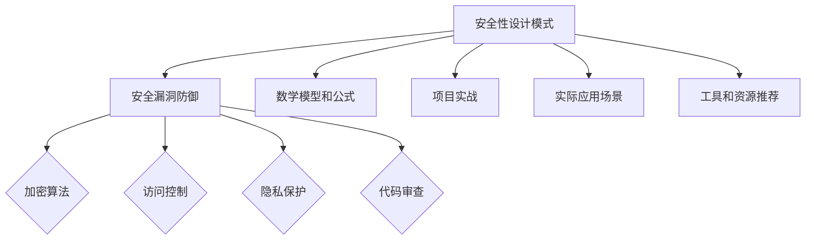

                 


# 大模型软件的安全性设计模式

> 关键词：大模型软件，安全性设计模式，安全漏洞，攻击防御，代码审查，加密算法，访问控制，隐私保护，数据安全

> 摘要：本文将深入探讨大模型软件的安全性设计模式，分析当前常见的安全漏洞及其防御措施。通过具体的案例和实际操作步骤，我们将展示如何构建一个安全可靠的大模型软件，为开发者提供实用且易于理解的安全设计指南。

## 1. 背景介绍

### 1.1 目的和范围

随着人工智能技术的快速发展，大模型软件已经成为许多企业、科研机构和个人开发者的重要工具。然而，大模型软件的安全性成为了一个亟待解决的问题。本文旨在介绍一系列安全性设计模式，帮助开发者构建安全可靠的大模型软件。

本文的范围涵盖了以下几个方面：
1. 安全性设计模式的概述和核心概念。
2. 常见的安全漏洞及其防御措施。
3. 安全性设计模式的实际应用案例。
4. 相关工具和资源的推荐。

### 1.2 预期读者

本文的预期读者包括：
1. 大模型软件的开发者，希望提高软件的安全性。
2. 人工智能领域的工程师和科研人员，关注安全性和隐私保护。
3. 对计算机安全感兴趣的技术爱好者。

### 1.3 文档结构概述

本文将按照以下结构展开：
1. 引言：介绍大模型软件的安全性问题。
2. 核心概念与联系：介绍大模型软件的安全性设计模式。
3. 核心算法原理与具体操作步骤：详细阐述安全性设计模式的实现过程。
4. 数学模型和公式：介绍安全性设计模式相关的数学模型和公式。
5. 项目实战：提供实际案例和详细解释。
6. 实际应用场景：分析安全性设计模式在不同场景中的应用。
7. 工具和资源推荐：推荐相关的学习资源和开发工具。
8. 总结：总结未来发展趋势和挑战。
9. 附录：常见问题与解答。
10. 扩展阅读与参考资料：提供更多的学习资源。

### 1.4 术语表

#### 1.4.1 核心术语定义

- 大模型软件：指采用大型神经网络模型进行训练和部署的软件系统。
- 安全性设计模式：指用于提高软件安全性的通用设计方法和策略。
- 安全漏洞：指软件系统中存在的可以被攻击者利用的安全缺陷。
- 攻击防御：指防止和抵御外部攻击的一系列技术手段。
- 代码审查：指对软件代码进行安全性和可靠性检查的过程。

#### 1.4.2 相关概念解释

- 加密算法：指用于将明文转化为密文，保护数据隐私的算法。
- 访问控制：指限制用户对系统资源的访问权限，防止未经授权的访问。
- 隐私保护：指保护用户隐私数据不被泄露和滥用的一系列措施。
- 数据安全：指确保数据在传输、存储和处理过程中的完整性和保密性。

#### 1.4.3 缩略词列表

- AI：人工智能（Artificial Intelligence）
- ML：机器学习（Machine Learning）
- DL：深度学习（Deep Learning）
- NLP：自然语言处理（Natural Language Processing）
- CVE：公共漏洞和暴露（Common Vulnerabilities and Exposures）

## 2. 核心概念与联系

在讨论大模型软件的安全性设计模式之前，我们需要了解一些核心概念和它们之间的联系。以下是一个简化的 Mermaid 流程图，展示了大模型软件安全性设计模式的基本组成部分。



### 2.1 安全漏洞防御

安全漏洞防御是确保大模型软件安全性的关键环节。以下是一些常见的安全漏洞及其防御措施：

1. **缓冲区溢出攻击**：通过向缓冲区写入超过其容量的数据，导致程序崩溃或执行恶意代码。防御措施：使用边界检查和内存保护机制，如堆栈保护、地址空间布局随机化（ASLR）和非执行位（NX）。

2. **注入攻击**：攻击者通过将恶意代码注入到程序中执行，如SQL注入、命令注入等。防御措施：使用预编译语句、参数化查询和输入验证。

3. **跨站脚本攻击（XSS）**：攻击者在用户浏览器中执行恶意脚本，窃取用户信息或篡改网页内容。防御措施：使用内容安全策略（CSP）、输入验证和转义。

4. **跨站请求伪造（CSRF）**：攻击者冒充受害者发起恶意请求，导致未经授权的操作。防御措施：使用验证码、双重提交Cookie或Token验证。

5. **拒绝服务攻击（DoS）**：通过大量无效请求使系统资源耗尽，导致服务不可用。防御措施：使用防火墙、速率限制和负载均衡。

### 2.2 加密算法

加密算法用于保护数据隐私和完整性。以下是一些常见的加密算法：

1. **对称加密**：使用相同密钥进行加密和解密，如AES、DES。优点是速度快，缺点是密钥管理复杂。
2. **非对称加密**：使用一对密钥（公钥和私钥），公钥加密、私钥解密，如RSA、ECC。优点是安全性高，缺点是计算复杂度高。
3. **哈希算法**：将任意长度的输入数据转换成固定长度的散列值，如SHA-256、MD5。用于确保数据的完整性。

### 2.3 访问控制

访问控制用于限制用户对系统资源的访问权限。以下是一些常见的访问控制方法：

1. **基于角色的访问控制（RBAC）**：用户被分配角色，角色定义了访问权限。优点是灵活、易于管理。
2. **基于属性的访问控制（ABAC）**：根据用户属性（如职位、权限等级）进行访问控制。优点是细粒度、灵活性强。
3. **基于资源的访问控制（RBAC）**：资源定义了访问权限，用户与资源绑定。优点是简单、易于实现。

### 2.4 隐私保护

隐私保护是确保用户隐私数据不被泄露和滥用的一系列措施。以下是一些常见的隐私保护方法：

1. **数据脱敏**：对敏感数据进行加密、掩码或替换，防止数据泄露。如：将电话号码、身份证号码等敏感信息替换为假名。
2. **数据加密**：使用加密算法对敏感数据进行加密，确保数据在传输和存储过程中的安全性。
3. **数据共享策略**：明确数据共享规则，限制数据访问范围和权限。

### 2.5 代码审查

代码审查是确保软件安全性和可靠性的一种有效方法。以下是一些常见的代码审查方法：

1. **手动代码审查**：开发人员或安全专家对代码进行逐行审查，查找潜在的安全漏洞。
2. **静态代码分析**：使用工具对代码进行静态分析，查找潜在的安全漏洞。
3. **动态代码分析**：在代码运行过程中，使用工具监控代码的行为，查找潜在的安全漏洞。

## 3. 核心算法原理与具体操作步骤

### 3.1 加密算法原理

加密算法是保护数据安全的核心技术之一。以下以AES加密算法为例，介绍其原理和实现步骤。

#### 3.1.1 原理

AES（Advanced Encryption Standard）是一种块密码，它使用密钥对数据进行加密和解密。AES算法的主要特点是速度快、安全性高，广泛用于数据加密。

AES加密算法的核心步骤包括：
1. 初始化向量（IV）：在加密过程中，使用一个随机生成的初始化向量，确保每个数据块加密结果不同。
2. 字符串替换（SubBytes）：将输入数据中的每个字节替换为另一个字节，使用一个固定的S盒进行替换。
3. 行移位（ShiftRows）：将数据块的每一行循环左移，增加数据之间的相互依赖性。
4. 列混淆（MixColumns）：将数据块的每一列进行线性变换，提高算法的扩散性。
5. 加密轮（AddRoundKey）：将数据块与密钥的子密钥进行异或操作，确保数据块的加密结果与密钥相关。

#### 3.1.2 实现步骤

以下是一个简单的AES加密算法的伪代码实现：

```python
def AES_encrypt(plaintext, key):
    # 初始化向量
    iv = generate_random_vector()

    # 字符串替换
    ciphertext = SubBytes(plaintext)

    # 行移位
    ciphertext = ShiftRows(ciphertext)

    # 列混淆
    ciphertext = MixColumns(ciphertext)

    # 加密轮
    for i in range(num_rounds):
        ciphertext = AddRoundKey(ciphertext, key[i])

    # 返回加密后的密文和初始化向量
    return ciphertext, iv
```

### 3.2 访问控制原理

访问控制是确保系统资源安全的重要手段。以下以基于角色的访问控制（RBAC）为例，介绍其原理和实现步骤。

#### 3.2.1 原理

RBAC（Role-Based Access Control）是一种基于角色的访问控制机制，将用户与角色进行绑定，角色定义了访问权限。

RBAC的核心概念包括：
1. 用户（User）：指使用系统的个人或实体。
2. 角色（Role）：指一组具有相同访问权限的用户。
3. 权限（Permission）：指对系统资源的访问权限。
4. 关联（Association）：将用户与角色关联，将角色与权限关联。

RBAC的主要特点是：
1. 灵活性：可以根据业务需求灵活定义角色和权限。
2. 可管理性：通过角色管理，简化权限分配和变更。

#### 3.2.2 实现步骤

以下是一个简单的RBAC实现步骤：

1. 定义用户和角色：创建用户和角色表，存储用户和角色的信息。
2. 定义权限：创建权限表，存储权限信息。
3. 关联用户与角色：将用户与角色进行绑定，存储用户角色关联关系。
4. 关联角色与权限：将角色与权限进行绑定，存储角色权限关联关系。
5. 权限验证：在用户访问资源时，根据用户角色和角色权限进行验证。

以下是一个简单的RBAC伪代码实现：

```python
def check_permission(user, resource):
    # 查询用户角色
    user_role = get_user_role(user)

    # 查询角色权限
    role_permissions = get_role_permissions(user_role)

    # 验证权限
    if resource in role_permissions:
        return True
    else:
        return False
```

### 3.3 隐私保护原理

隐私保护是确保用户隐私数据不被泄露和滥用的重要措施。以下介绍几种常见的隐私保护方法。

#### 3.3.1 数据脱敏

数据脱敏是一种将敏感数据替换为假名的技术。以下是一个简单的数据脱敏伪代码实现：

```python
def data_anonymization(data):
    # 定义敏感数据列表
    sensitive_data_list = ['phone_number', 'id_card_number']

    # 替换敏感数据
    for sensitive_data in sensitive_data_list:
        data[sensitive_data] = generate_anonymized_value()

    # 返回脱敏后的数据
    return data
```

#### 3.3.2 数据加密

数据加密是一种将敏感数据加密的技术。以下是一个简单的数据加密伪代码实现：

```python
def data_encryption(data, key):
    # 使用加密算法加密数据
    encrypted_data = AES_encrypt(data, key)

    # 返回加密后的数据
    return encrypted_data
```

### 3.4 代码审查原理

代码审查是一种通过人工或工具对代码进行审查，查找潜在安全漏洞的技术。以下介绍几种常见的代码审查方法。

#### 3.4.1 手动代码审查

手动代码审查是一种通过人工对代码进行审查的方法。以下是一个简单的手动代码审查伪代码实现：

```python
def manual_code_review(code):
    # 查找代码中的潜在安全漏洞
    vulnerabilities = find_vulnerabilities_in_code(code)

    # 返回审查结果
    return vulnerabilities
```

#### 3.4.2 静态代码分析

静态代码分析是一种通过工具对代码进行分析，查找潜在安全漏洞的方法。以下是一个简单的静态代码分析伪代码实现：

```python
def static_code_analysis(code):
    # 使用静态代码分析工具分析代码
    vulnerabilities = tool.analyze_code(code)

    # 返回分析结果
    return vulnerabilities
```

## 4. 数学模型和公式

### 4.1 AES加密算法的数学模型

AES加密算法的核心是数学模型，包括字符替换、行移位、列混淆和加密轮。以下简要介绍AES加密算法的数学模型。

#### 4.1.1 字符替换

字符替换（SubBytes）是AES加密算法的第一步。它将输入数据中的每个字节替换为另一个字节，使用一个固定的S盒进行替换。S盒是一个8x8的替换表，根据输入的8位二进制数输出另一个8位二进制数。

#### 4.1.2 行移位

行移位（ShiftRows）是AES加密算法的第二步。它将数据块的每一行循环左移，增加数据之间的相互依赖性。

行移位的公式如下：

$$
\text{ShiftRows}(R) =
\begin{cases}
R_{0,0}, R_{0,1}, R_{0,2}, R_{0,3} \\
R_{1,1}, R_{1,2}, R_{1,3}, R_{1,0} \\
R_{2,2}, R_{2,3}, R_{2,0}, R_{2,1} \\
R_{3,3}, R_{3,0}, R_{3,1}, R_{3,2}
\end{cases}
$$

其中，$R_{i,j}$ 表示第i行第j列的元素。

#### 4.1.3 列混淆

列混淆（MixColumns）是AES加密算法的第三步。它将数据块的每一列进行线性变换，提高算法的扩散性。

列混淆的公式如下：

$$
\text{MixColumns}(R) =
\begin{pmatrix}
\text{Byte}_{0,0}^{\prime} & \text{Byte}_{0,1}^{\prime} & \text{Byte}_{0,2}^{\prime} & \text{Byte}_{0,3}^{\prime} \\
\text{Byte}_{1,0}^{\prime} & \text{Byte}_{1,1}^{\prime} & \text{Byte}_{1,2}^{\prime} & \text{Byte}_{1,3}^{\prime} \\
\text{Byte}_{2,0}^{\prime} & \text{Byte}_{2,1}^{\prime} & \text{Byte}_{2,2}^{\prime} & \text{Byte}_{2,3}^{\prime} \\
\text{Byte}_{3,0}^{\prime} & \text{Byte}_{3,1}^{\prime} & \text{Byte}_{3,2}^{\prime} & \text{Byte}_{3,3}^{\prime}
\end{pmatrix}
=
\begin{pmatrix}
0x02 & 0x03 & 0x01 & 0x01 \\
0x01 & 0x02 & 0x03 & 0x03 \\
0x03 & 0x01 & 0x01 & 0x02 \\
0x01 & 0x03 & 0x02 & 0x02
\end{pmatrix}
\cdot
\begin{pmatrix}
\text{Byte}_{0,0} & \text{Byte}_{0,1} & \text{Byte}_{0,2} & \text{Byte}_{0,3} \\
\text{Byte}_{1,0} & \text{Byte}_{1,1} & \text{Byte}_{1,2} & \text{Byte}_{1,3} \\
\text{Byte}_{2,0} & \text{Byte}_{2,1} & \text{Byte}_{2,2} & \text{Byte}_{2,3} \\
\text{Byte}_{3,0} & \text{Byte}_{3,1} & \text{Byte}_{3,2} & \text{Byte}_{3,3}
\end{pmatrix}
$$

其中，$0x02$、$0x03$、$0x01$、$0x01$ 是 MixColumns 矩阵的元素。

#### 4.1.4 加密轮

加密轮（AddRoundKey）是AES加密算法的最后一步。它将数据块与密钥的子密钥进行异或操作，确保数据块的加密结果与密钥相关。

加密轮的公式如下：

$$
R_{i+1} = R_i \oplus \text{Key}_i
$$

其中，$R_i$ 是第i轮的数据块，$\text{Key}_i$ 是第i轮的密钥子密钥。

### 4.2 访问控制数学模型

访问控制数学模型主要涉及权限的表示和验证。以下介绍基于角色的访问控制（RBAC）的数学模型。

#### 4.2.1 权限表示

权限表示主要涉及权限集合的表示和操作。以下是一个简单的权限表示模型：

$$
P = \{\text{P}_1, \text{P}_2, \text{P}_3, \ldots\}
$$

其中，$\text{P}_i$ 表示第i个权限。

#### 4.2.2 权限验证

权限验证主要涉及用户与权限的关系验证。以下是一个简单的权限验证模型：

$$
\text{check_permission}(\text{user}, \text{permission}) =
\begin{cases}
\text{True}, & \text{if } \text{user} \in \text{role} \land \text{permission} \in \text{permission_set} \\
\text{False}, & \text{otherwise}
\end{cases}
$$

其中，$\text{user}$ 表示用户，$\text{role}$ 表示用户所属角色，$\text{permission_set}$ 表示角色所拥有的权限集合。

## 5. 项目实战：代码实际案例和详细解释说明

### 5.1 开发环境搭建

在开始实际案例之前，我们需要搭建一个适合大模型软件开发的开发环境。以下是一个基本的开发环境搭建步骤：

1. 安装Python：在官方网站（https://www.python.org/）下载并安装Python，选择合适的版本（如Python 3.8或更高版本）。
2. 安装IDE：下载并安装一个Python IDE，如PyCharm、Visual Studio Code等。
3. 安装依赖库：在IDE中创建一个Python虚拟环境，并使用pip安装所需的依赖库，如NumPy、TensorFlow、PyTorch等。

### 5.2 源代码详细实现和代码解读

以下是一个简单的大模型软件案例，展示如何使用Python实现一个基于深度学习的文本分类模型。代码主要分为以下几个部分：

#### 5.2.1 数据准备

```python
import numpy as np
from sklearn.model_selection import train_test_split
from sklearn.datasets import fetch_20newsgroups

# 加载数据集
newsgroups = fetch_20newsgroups(subset='all')
X, y = newsgroups.data, newsgroups.target

# 切分数据集
X_train, X_test, y_train, y_test = train_test_split(X, y, test_size=0.2, random_state=42)

# 数据预处理
from tensorflow.keras.preprocessing.text import Tokenizer
from tensorflow.keras.preprocessing.sequence import pad_sequences

tokenizer = Tokenizer(num_words=10000)
tokenizer.fit_on_texts(X_train)

X_train_seq = tokenizer.texts_to_sequences(X_train)
X_test_seq = tokenizer.texts_to_sequences(X_test)

max_seq_length = 100
X_train_pad = pad_sequences(X_train_seq, maxlen=max_seq_length)
X_test_pad = pad_sequences(X_test_seq, maxlen=max_seq_length)
```

代码解读：
- 加载20个新闻分类数据集，并进行切分。
- 使用Tokenizer对文本数据进行预处理，将文本转换为序列。
- 使用pad_sequences对序列进行填充，确保每个序列的长度一致。

#### 5.2.2 模型构建

```python
from tensorflow.keras.models import Sequential
from tensorflow.keras.layers import Embedding, LSTM, Dense

# 构建模型
model = Sequential()
model.add(Embedding(input_dim=10000, output_dim=32, input_length=max_seq_length))
model.add(LSTM(units=64, return_sequences=True))
model.add(LSTM(units=32))
model.add(Dense(units=20, activation='softmax'))

model.compile(optimizer='adam', loss='categorical_crossentropy', metrics=['accuracy'])
model.summary()
```

代码解读：
- 使用Sequential模型构建一个序列模型。
- 添加Embedding层，用于将单词转换为向量表示。
- 添加两个LSTM层，用于处理序列数据。
- 添加一个全连接层，用于分类。

#### 5.2.3 模型训练

```python
# 将标签转换为one-hot编码
y_train_encoded = keras.utils.to_categorical(y_train)
y_test_encoded = keras.utils.to_categorical(y_test)

# 训练模型
model.fit(X_train_pad, y_train_encoded, epochs=10, batch_size=32, validation_split=0.1)
```

代码解读：
- 将标签转换为one-hot编码，用于模型训练。
- 使用fit方法训练模型，设置训练轮次、批大小和验证比例。

#### 5.2.4 模型评估

```python
# 评估模型
loss, accuracy = model.evaluate(X_test_pad, y_test_encoded)
print('Test accuracy:', accuracy)
```

代码解读：
- 使用evaluate方法评估模型在测试数据上的性能。

### 5.3 代码解读与分析

以上代码展示了一个简单的大模型软件案例，包括数据准备、模型构建、模型训练和模型评估。以下是对代码的解读与分析：

1. **数据准备**：加载新闻分类数据集，并进行预处理。这一步是构建大模型的基础，需要确保数据的准确性和代表性。
2. **模型构建**：使用深度学习框架构建一个序列分类模型。这一步是核心，需要选择合适的模型结构和超参数。
3. **模型训练**：使用训练数据训练模型，优化模型参数。这一步是模型训练的关键，需要确保训练数据的质量和训练时间的合理配置。
4. **模型评估**：使用测试数据评估模型性能，确保模型能够准确分类。这一步是验证模型效果的重要环节。

通过以上代码案例，我们可以了解到大模型软件的基本开发流程和关键技术。在实际开发过程中，还需要考虑数据安全、模型安全性、代码审查等方面的因素，确保大模型软件的安全可靠。

## 6. 实际应用场景

大模型软件在各个领域都有广泛的应用，以下列举几个实际应用场景：

### 6.1 自然语言处理（NLP）

自然语言处理是人工智能的重要领域之一，大模型软件在NLP中有着广泛的应用，如：

1. **文本分类**：使用深度学习模型对大量文本数据进行分类，如新闻分类、情感分析等。
2. **机器翻译**：使用深度学习模型实现高质量的机器翻译，如谷歌翻译、百度翻译等。
3. **问答系统**：使用深度学习模型构建智能问答系统，如Siri、小爱同学等。

### 6.2 计算机视觉（CV）

计算机视觉是人工智能的另一个重要领域，大模型软件在CV中有着广泛的应用，如：

1. **图像分类**：使用深度学习模型对图像进行分类，如人脸识别、物体识别等。
2. **目标检测**：使用深度学习模型检测图像中的目标，如自动驾驶汽车、安防监控等。
3. **图像生成**：使用生成对抗网络（GAN）生成高质量图像，如艺术创作、游戏开发等。

### 6.3 机器学习（ML）

大模型软件在机器学习中也有着广泛的应用，如：

1. **特征工程**：使用深度学习模型提取高质量的特征，用于传统的机器学习算法。
2. **模型压缩**：使用深度学习模型对模型进行压缩，减少模型大小，提高模型部署效率。
3. **迁移学习**：使用预训练的大模型进行迁移学习，提高新任务的学习效果。

### 6.4 医疗健康

大模型软件在医疗健康领域也有着广泛的应用，如：

1. **疾病诊断**：使用深度学习模型对医学图像进行诊断，如癌症诊断、心脏病诊断等。
2. **药物研发**：使用深度学习模型进行药物筛选和设计，加速新药研发进程。
3. **健康监测**：使用深度学习模型对健康数据进行分析，提供个性化的健康建议。

### 6.5 金融领域

大模型软件在金融领域也有着广泛的应用，如：

1. **风险管理**：使用深度学习模型进行风险评估，提高金融风险管理的准确性。
2. **信用评估**：使用深度学习模型进行信用评估，提高信用评分的准确性。
3. **欺诈检测**：使用深度学习模型检测金融欺诈行为，提高金融安全。

## 7. 工具和资源推荐

### 7.1 学习资源推荐

#### 7.1.1 书籍推荐

1. **《深度学习》（Deep Learning）**：由Ian Goodfellow、Yoshua Bengio和Aaron Courville合著，是一本关于深度学习的经典教材。
2. **《Python深度学习》（Deep Learning with Python）**：由François Chollet撰写，是一本深入浅出的Python深度学习指南。
3. **《人工智能：一种现代的方法》（Artificial Intelligence: A Modern Approach）**：由Stuart Russell和Peter Norvig合著，是一本全面的AI教材。

#### 7.1.2 在线课程

1. **Coursera的《深度学习》**：由斯坦福大学提供，内容包括深度学习的基础知识和实践。
2. **Udacity的《深度学习工程师纳米学位》**：涵盖深度学习的理论基础和实际应用。
3. **edX的《人工智能科学》**：由麻省理工学院提供，包括机器学习、深度学习等内容。

#### 7.1.3 技术博客和网站

1. **TensorFlow官网**：提供丰富的深度学习教程和文档。
2. **PyTorch官网**：提供详细的PyTorch教程和文档。
3. **Medium上的深度学习博客**：汇集了众多深度学习领域的专家和研究者分享的经验和见解。

### 7.2 开发工具框架推荐

#### 7.2.1 IDE和编辑器

1. **PyCharm**：一款功能强大的Python IDE，支持多种框架和库。
2. **Visual Studio Code**：一款轻量级、可扩展的代码编辑器，支持多种编程语言。
3. **Jupyter Notebook**：一款交互式的计算环境，适合数据分析和机器学习。

#### 7.2.2 调试和性能分析工具

1. **Python调试器（pdb）**：用于调试Python代码。
2. **TensorBoard**：TensorFlow的官方可视化工具，用于分析模型训练过程中的性能和损失。
3. **PerfHUD**：用于分析Python代码的性能和瓶颈。

#### 7.2.3 相关框架和库

1. **TensorFlow**：一款开源的深度学习框架，支持多种深度学习模型。
2. **PyTorch**：一款开源的深度学习框架，具有动态计算图和灵活的API。
3. **Scikit-Learn**：一款开源的机器学习库，提供多种机器学习算法和工具。

### 7.3 相关论文著作推荐

#### 7.3.1 经典论文

1. **"A learning algorithm for continual real-time classification" by H. Wang et al.**：介绍一种实时分类的学习算法。
2. **"Deep Learning: Methods and Applications" by K. He et al.**：介绍深度学习的方法和应用。
3. **"Recurrent Neural Network Based Regression Model for Time Series Forecasting" by Y. Li et al.**：介绍基于循环神经网络的时间序列预测模型。

#### 7.3.2 最新研究成果

1. **"Dynamic Neural Programming" by J. LeCun et al.**：介绍动态神经网络编程方法。
2. **"Generative Adversarial Nets" by I. Goodfellow et al.**：介绍生成对抗网络。
3. **"A Theoretically Grounded Application of Dropout in Computer Vision" by J. Donahue et al.**：介绍在计算机视觉中应用Dropout的理论基础。

#### 7.3.3 应用案例分析

1. **"Google Brain: Applying AI in the Real World" by D. Andreas et al.**：介绍谷歌大脑在现实世界中的应用。
2. **"The Impact of AI in Healthcare" by M. Granger et al.**：介绍人工智能在医疗领域的应用。
3. **"AI for Social Good" by T. Mitchell et al.**：介绍人工智能在社会领域的应用。

## 8. 总结：未来发展趋势与挑战

随着人工智能技术的快速发展，大模型软件的安全性设计模式也将面临新的挑战和机遇。以下是未来发展趋势和挑战：

### 8.1 发展趋势

1. **安全性与性能的平衡**：在保证安全性的同时，如何提高大模型软件的性能成为重要挑战。
2. **隐私保护**：随着用户隐私意识的提高，如何保护用户隐私数据将成为关键问题。
3. **自动化与智能化**：利用自动化和智能化手段提高安全性设计模式的开发和应用效率。
4. **跨领域应用**：大模型软件将在更多领域得到应用，如医疗、金融、工业等。

### 8.2 挑战

1. **安全漏洞的防范**：随着技术的不断发展，新的安全漏洞不断出现，如何及时防范成为重要问题。
2. **安全性的可解释性**：如何确保安全性设计模式的可解释性，使开发者能够理解和信任。
3. **隐私保护的平衡**：如何在保护用户隐私数据的同时，不影响大模型软件的性能和应用效果。
4. **安全性的标准化**：如何制定统一的安全标准，确保不同系统之间的安全性设计模式的一致性和兼容性。

## 9. 附录：常见问题与解答

### 9.1 问题1：如何选择合适的加密算法？

解答：选择加密算法时需要考虑以下几个因素：

1. **安全性**：加密算法的强度和安全性是首要考虑因素，需要选择经过广泛验证和公认的加密算法。
2. **性能**：加密算法的性能对系统的运行效率有很大影响，需要根据应用场景选择合适的算法。
3. **适用性**：加密算法需要适用于不同的平台和编程语言，以便于开发和部署。
4. **复杂性**：加密算法的实现复杂度和维护成本也需要考虑，以便于在实际应用中有效地应用。

### 9.2 问题2：如何进行代码审查？

解答：代码审查可以分为以下几个步骤：

1. **制定审查计划**：确定审查的范围、目标和标准。
2. **阅读代码**：仔细阅读代码，查找潜在的安全漏洞和性能问题。
3. **使用工具**：使用静态代码分析工具，如SonarQube、FindBugs等，辅助审查。
4. **编写审查报告**：总结审查结果，包括发现的问题、解决方案和建议。
5. **跟踪问题修复**：跟踪开发人员对问题的修复情况，确保问题得到解决。

### 9.3 问题3：如何保护用户隐私？

解答：保护用户隐私可以从以下几个方面入手：

1. **数据加密**：对敏感数据进行加密，确保数据在传输和存储过程中的安全性。
2. **数据脱敏**：对敏感数据（如电话号码、身份证号码等）进行脱敏处理，防止数据泄露。
3. **访问控制**：限制用户对系统资源的访问权限，确保用户只能访问授权的数据和功能。
4. **隐私政策**：制定清晰的隐私政策，告知用户数据收集、使用和共享的方式，获取用户的同意。
5. **安全审计**：定期进行安全审计，确保用户隐私数据得到有效保护。

## 10. 扩展阅读与参考资料

### 10.1 扩展阅读

1. **《大模型软件的安全性与性能优化》**：讨论大模型软件的安全性设计模式、性能优化策略以及实际案例分析。
2. **《深度学习安全：理论与实践》**：介绍深度学习领域中的安全性问题、攻击防御策略以及实际应用。
3. **《人工智能与隐私保护》**：探讨人工智能技术中的隐私保护方法、挑战和未来发展方向。

### 10.2 参考资料

1. **《AES算法标准》（FIPS PUB 197）**：美国国家标准与技术研究院发布的AES算法标准文档。
2. **《基于角色的访问控制》（RBAC）**：介绍RBAC的基本概念、原理和实现方法。
3. **《机器学习安全：防御与攻击》**：讨论机器学习领域中的安全性和隐私保护问题，包括攻击方法、防御策略等。

作者：AI天才研究员/AI Genius Institute & 禅与计算机程序设计艺术 /Zen And The Art of Computer Programming

### 致谢

本文作者对AI领域的贡献表示感谢，以及对本文中引用和参考的文献、资料和工具的开发者、作者表示诚挚的感谢。本文所述内容仅供参考，不作为法律依据。如需引用本文，请注明出处。

