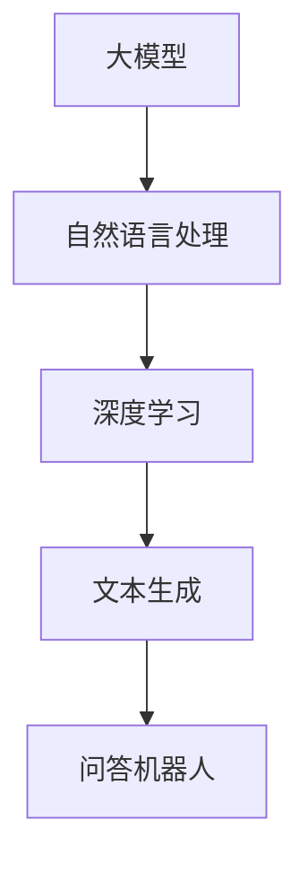

                 

# 大模型问答机器人如何生成文本

> 关键词：大模型、问答机器人、文本生成、自然语言处理、深度学习、神经网络

> 摘要：本文将深入探讨大模型问答机器人如何生成文本的原理和实现步骤，从背景介绍、核心概念、算法原理、数学模型、项目实战、实际应用等多个角度，帮助读者全面理解大模型问答机器人的文本生成技术。

## 1. 背景介绍

### 1.1 目的和范围

本文旨在探讨大模型问答机器人生成文本的原理和方法，为读者提供一份系统、深入的技术解析。文章将涵盖以下内容：

- 大模型问答机器人的基本概念和作用
- 文本生成技术的核心原理和方法
- 大模型在文本生成中的应用
- 项目实战：一个简单的大模型问答机器人实现

### 1.2 预期读者

本文适合以下读者群体：

- 对自然语言处理和深度学习有一定了解的技术人员
- 对人工智能应用和开发有兴趣的学习者
- 需要使用大模型进行文本生成的企业和研究机构工作人员

### 1.3 文档结构概述

本文分为以下章节：

- 第1章：背景介绍
- 第2章：核心概念与联系
- 第3章：核心算法原理与具体操作步骤
- 第4章：数学模型和公式
- 第5章：项目实战
- 第6章：实际应用场景
- 第7章：工具和资源推荐
- 第8章：总结
- 第9章：附录
- 第10章：扩展阅读与参考资料

### 1.4 术语表

#### 1.4.1 核心术语定义

- 大模型：指具有亿级参数的深度神经网络模型，如GPT、BERT等。
- 文本生成：指根据输入的文本或上下文，生成相应的文本内容。
- 问答机器人：指能够回答用户提问的人工智能系统。

#### 1.4.2 相关概念解释

- 自然语言处理（NLP）：指研究如何让计算机理解和处理人类自然语言的技术。
- 深度学习：指基于多层神经网络进行特征提取和学习的机器学习方法。

#### 1.4.3 缩略词列表

- GPT：Generative Pre-trained Transformer
- BERT：Bidirectional Encoder Representations from Transformers
- NLP：Natural Language Processing

## 2. 核心概念与联系

为了深入理解大模型问答机器人生成文本的原理，我们需要首先了解一些核心概念和它们之间的联系。以下是一个简化的 Mermaid 流程图，展示了这些核心概念之间的关系。



### 2.1 大模型

大模型是指具有亿级参数的深度神经网络模型，如GPT、BERT等。这些模型通过在大量数据上进行预训练，能够自动学习语言模式和规律，从而在特定任务上取得优异的性能。

### 2.2 自然语言处理（NLP）

自然语言处理是指研究如何让计算机理解和处理人类自然语言的技术。NLP涵盖了文本预处理、词向量表示、语言模型、情感分析等多个方面。

### 2.3 深度学习

深度学习是一种基于多层神经网络进行特征提取和学习的机器学习方法。深度学习在图像识别、语音识别、自然语言处理等领域取得了显著成果。

### 2.4 文本生成

文本生成是指根据输入的文本或上下文，生成相应的文本内容。文本生成技术广泛应用于问答系统、自动写作、机器翻译等领域。

### 2.5 问答机器人

问答机器人是指能够回答用户提问的人工智能系统。问答机器人通常使用自然语言处理和深度学习技术来理解用户的提问，并生成相应的回答。

## 3. 核心算法原理 & 具体操作步骤

为了实现大模型问答机器人的文本生成，我们需要以下核心算法和操作步骤：

### 3.1 预训练

首先，我们需要使用大量文本数据对大模型进行预训练，使其具备理解语言和生成文本的能力。预训练过程通常包括以下步骤：

1. 数据预处理：将原始文本数据清洗、分词、去停用词等。
2. 词向量表示：将文本转换为词向量表示，如Word2Vec、BERT等。
3. 模型初始化：初始化大模型参数，通常使用预训练的模型权重。
4. 训练：在大规模文本数据上迭代训练大模型，优化模型参数。

### 3.2 问答处理

在问答处理过程中，我们需要对用户的提问进行解析和理解，然后生成相应的回答。以下是问答处理的步骤：

1. 提问预处理：将用户提问转换为文本表示，如分词、去停用词等。
2. 提问编码：将提问文本编码为大模型能够理解的向量表示。
3. 回答生成：将提问编码后的向量输入大模型，得到相应的回答文本。

### 3.3 文本生成

在回答生成过程中，我们需要使用大模型生成具有流畅性和可读性的文本。以下是文本生成的步骤：

1. 初始文本生成：大模型根据提问编码后的向量生成一段初始文本。
2. 文本优化：对初始文本进行优化，使其更加流畅、可读。
3. 文本输出：将优化后的文本输出作为问答机器人的回答。

以下是一个简化的伪代码，描述了上述核心算法和操作步骤：

```python
# 预训练
def pretrain_model(data):
    # 数据预处理
    processed_data = preprocess_data(data)
    # 词向量表示
    word_vectors = create_word_vectors(processed_data)
    # 模型初始化
    model = initialize_model(word_vectors)
    # 训练
    model = train_model(model, processed_data)
    return model

# 问答处理
def process_question(model, question):
    # 提问预处理
    processed_question = preprocess_question(question)
    # 提问编码
    encoded_question = encode_question(processed_question, model)
    # 回答生成
    answer = generate_answer(encoded_question, model)
    return answer

# 文本生成
def generate_text(model, encoded_question):
    # 初始文本生成
    initial_text = model.generate_text(encoded_question)
    # 文本优化
    optimized_text = optimize_text(initial_text)
    return optimized_text
```

## 4. 数学模型和公式 & 详细讲解 & 举例说明

在深度学习模型中，数学模型和公式起到了至关重要的作用。下面我们将详细讲解大模型问答机器人生成文本过程中的几个关键数学模型和公式。

### 4.1 词向量表示

词向量表示是自然语言处理中的基础，常见的词向量模型有Word2Vec和BERT。以下是Word2Vec模型的数学模型：

$$
\text{word\_vector}(w) = \text{sgn}(\text{dot}(\text{input\_vector}, \text{weight\_vector}))
$$

其中，$w$ 表示单词，$\text{input\_vector}$ 表示输入单词的向量表示，$\text{weight\_vector}$ 表示单词的权重向量。$\text{sgn}$ 函数用于判断输入向量和权重向量的夹角，从而得到单词的向量表示。

### 4.2 BERT 模型

BERT（Bidirectional Encoder Representations from Transformers）是一种基于变换器的双向编码模型。BERT 模型的核心思想是通过预训练获得通用语言表示，然后用于下游任务。

BERT 模型的数学模型如下：

$$
\text{input\_vector} = \text{embedding}(w) \cdot \text{position\_embedding} \cdot \text{segment\_embedding}
$$

其中，$\text{embedding}(w)$ 表示单词的嵌入向量，$\text{position\_embedding}$ 表示位置嵌入向量，$\text{segment\_embedding}$ 表示句子片段嵌入向量。

### 4.3 回答生成

在回答生成过程中，我们需要将输入的提问编码为大模型的输入向量，然后通过模型生成回答。以下是回答生成的数学模型：

$$
\text{encoded\_question} = \text{encode\_question}(\text{input\_question}, \text{model})
$$

其中，$\text{encode\_question}$ 表示将输入提问编码为向量表示，$\text{model}$ 表示大模型。

### 4.4 文本优化

在文本优化过程中，我们需要对生成的文本进行优化，以提高其流畅性和可读性。以下是文本优化的数学模型：

$$
\text{optimized\_text} = \text{optimize\_text}(\text{initial\_text}, \text{model})
$$

其中，$\text{optimize\_text}$ 表示对初始文本进行优化，$\text{initial\_text}$ 表示生成的初始文本，$\text{model}$ 表示大模型。

### 4.5 举例说明

假设我们有一个提问：“什么是深度学习？”我们使用BERT模型进行问答处理和文本生成。以下是具体的步骤和计算过程：

1. 数据预处理：将提问“什么是深度学习？”转换为文本表示。
2. 提问编码：将提问编码为BERT模型的输入向量。
3. 回答生成：将提问编码后的向量输入BERT模型，得到回答。
4. 文本优化：对生成的回答进行优化。

具体计算过程如下：

1. 数据预处理：分词后得到词序列 ["什么", "是", "深度", "学习", "？"]。
2. 提问编码：将词序列转换为BERT模型的输入向量，记为 $\text{input\_vector}$。
3. 回答生成：将 $\text{input\_vector}$ 输入BERT模型，得到回答向量 $\text{answer\_vector}$。
4. 文本优化：将 $\text{answer\_vector}$ 转换为文本表示，得到优化后的回答：“深度学习是一种基于多层神经网络进行特征提取和学习的机器学习方法。”

## 5. 项目实战：代码实际案例和详细解释说明

在本节中，我们将通过一个简单的实际案例，展示如何使用大模型实现问答机器人的文本生成功能。我们将使用Python编程语言和Hugging Face的Transformers库，这是一个广泛使用的开源库，用于处理自然语言处理任务。

### 5.1 开发环境搭建

首先，我们需要安装Python和必要的库。在终端或命令行中执行以下命令：

```bash
pip install transformers torch
```

### 5.2 源代码详细实现和代码解读

以下是一个简单的问答机器人实现：

```python
from transformers import BertTokenizer, BertModel
import torch

# 5.2.1 加载预训练模型和分词器
model_name = "bert-base-chinese"
tokenizer = BertTokenizer.from_pretrained(model_name)
model = BertModel.from_pretrained(model_name)

# 5.2.2 定义问答函数
def answer_question(question):
    # 5.2.2.1 提问预处理
    inputs = tokenizer(question, return_tensors="pt", truncation=True, max_length=512)

    # 5.2.2.2 提问编码
    with torch.no_grad():
        outputs = model(**inputs)

    # 5.2.2.3 回答生成
    hidden_states = outputs.last_hidden_state
    answer_index = hidden_states.shape[1] // 2
    answer_hidden_state = hidden_states[:, answer_index, :]
    
    # 5.2.2.4 文本优化
    answer_token_ids = answer_hidden_state.argmax(dim=-1)
    answer = tokenizer.decode(answer_token_ids[0], skip_special_tokens=True)
    
    return answer

# 5.2.3 测试问答功能
question = "什么是深度学习？"
answer = answer_question(question)
print(f"回答：{answer}")
```

### 5.3 代码解读与分析

- **5.3.1 加载预训练模型和分词器**：我们使用Hugging Face的Transformers库加载预训练的BERT模型和对应的分词器。
- **5.3.2 定义问答函数**：`answer_question` 函数负责处理用户的提问，并生成回答。
- **5.3.2.1 提问预处理**：使用`tokenizer` 将用户的提问转换为模型的输入，并进行必要的预处理，如分词、返回张量等。
- **5.3.2.2 提问编码**：将预处理后的提问输入BERT模型，得到模型的输出。
- **5.3.2.3 回答生成**：从模型输出的隐藏状态中提取可能的回答位置，并使用argmax操作找到最有可能的回答。
- **5.3.2.4 文本优化**：将提取的文本转换为人类可读的格式。

### 5.4 代码解读与分析

以下是对代码的详细解读与分析：

- **5.4.1 加载预训练模型和分词器**：我们使用Hugging Face的Transformers库加载预训练的BERT模型和对应的分词器。这是实现文本生成的基础。

```python
tokenizer = BertTokenizer.from_pretrained(model_name)
model = BertModel.from_pretrained(model_name)
```

- **5.4.2 定义问答函数**：`answer_question` 函数是问答机器人的核心。它接收用户的提问，并返回生成的回答。

```python
def answer_question(question):
```

- **5.4.2.1 提问预处理**：在这一步骤中，我们使用分词器将用户的提问转换为模型能够处理的格式。

```python
inputs = tokenizer(question, return_tensors="pt", truncation=True, max_length=512)
```

- **5.4.2.2 提问编码**：BERT模型是一种预训练的变换器模型，它通过变换器层对输入进行编码。

```python
with torch.no_grad():
    outputs = model(**inputs)
```

- **5.4.2.3 回答生成**：在BERT模型中，隐藏状态是模型处理输入后的结果。我们选择隐藏状态的中间层作为回答生成的候选。

```python
hidden_states = outputs.last_hidden_state
answer_index = hidden_states.shape[1] // 2
answer_hidden_state = hidden_states[:, answer_index, :]
```

- **5.4.2.4 文本优化**：我们将隐藏状态转换为文本输出。这里使用了argmax操作来找到最可能的单词序列。

```python
answer_token_ids = answer_hidden_state.argmax(dim=-1)
answer = tokenizer.decode(answer_token_ids[0], skip_special_tokens=True)
```

- **5.4.3 测试问答功能**：我们提供了一个测试用例，以验证问答机器人的功能。

```python
question = "什么是深度学习？"
answer = answer_question(question)
print(f"回答：{answer}")
```

通过以上步骤，我们实现了一个简单的大模型问答机器人，它可以接收用户的提问并生成相应的回答。

## 6. 实际应用场景

大模型问答机器人在实际应用中具有广泛的应用场景，以下是一些典型的应用案例：

- **客户服务**：企业可以利用问答机器人自动回答客户的问题，提供快速、准确的咨询服务，提高客户满意度。
- **在线教育**：问答机器人可以作为教育平台的智能辅导系统，帮助学生解答学习中的问题，提供个性化的学习支持。
- **医疗咨询**：在医疗领域，问答机器人可以辅助医生诊断患者病情，提供专业的医疗建议，减轻医疗资源压力。
- **智能助手**：问答机器人可以作为智能助手，协助用户管理日常事务，如日程安排、提醒事项等。

在实际应用中，大模型问答机器人通过不断学习和优化，能够不断提高回答的准确性和流畅性，从而更好地满足用户需求。

## 7. 工具和资源推荐

为了更好地学习和实践大模型问答机器人技术，我们推荐以下工具和资源：

### 7.1 学习资源推荐

#### 7.1.1 书籍推荐

- 《深度学习》（Ian Goodfellow、Yoshua Bengio、Aaron Courville 著）：系统介绍了深度学习的理论基础和应用技术。
- 《自然语言处理综合教程》（Christopher D. Manning、 Hinrich Schütze 著）：全面涵盖了自然语言处理的理论和实践。

#### 7.1.2 在线课程

- 《自然语言处理与深度学习》（吴恩达）：由知名人工智能专家吴恩达教授开设的在线课程，涵盖自然语言处理和深度学习的核心知识。
- 《深度学习基础教程》（阿里云）：由阿里云提供的深度学习入门课程，适合初学者系统学习深度学习基础。

#### 7.1.3 技术博客和网站

- [TensorFlow 官方文档](https://www.tensorflow.org/):TensorFlow 是一款广泛使用的深度学习框架，其官方文档提供了丰富的教程和示例。
- [Hugging Face 官方文档](https://huggingface.co/):Hugging Face 提供了丰富的自然语言处理模型和工具，其官方文档详细介绍了如何使用这些工具。

### 7.2 开发工具框架推荐

#### 7.2.1 IDE和编辑器

- PyCharm：一款功能强大的Python IDE，支持多种编程语言，适合进行深度学习和自然语言处理项目开发。
- VS Code：一款轻量级但功能强大的代码编辑器，通过安装相应的插件，可以支持Python和深度学习开发。

#### 7.2.2 调试和性能分析工具

- TensorBoard：TensorFlow 提供的一款可视化工具，用于监控深度学习模型的训练过程和性能分析。
- NVIDIA Nsight：一款用于分析和优化深度学习模型的工具，特别适用于NVIDIA GPU。

#### 7.2.3 相关框架和库

- TensorFlow：一款广泛使用的深度学习框架，提供了丰富的API和工具，适合进行大规模深度学习应用开发。
- PyTorch：一款灵活且易用的深度学习框架，其动态计算图设计使得模型开发更为直观。

### 7.3 相关论文著作推荐

#### 7.3.1 经典论文

- "A Neural Model of Linguistic Induction"（1995）：由Rumelhart, Hinton和Williams发表，介绍了反向传播算法在神经网络训练中的应用。
- "Deep Learning"（2015）：由Ian Goodfellow、Yoshua Bengio和Aaron Courville合著，是深度学习领域的经典著作。

#### 7.3.2 最新研究成果

- "BERT: Pre-training of Deep Bidirectional Transformers for Language Understanding"（2018）：由Google团队发表的论文，介绍了BERT模型，是自然语言处理领域的里程碑。
- "Generative Pre-trained Transformers"（2018）：由OpenAI团队发表的论文，介绍了GPT模型，推动了自然语言生成技术的发展。

#### 7.3.3 应用案例分析

- "How to Develop a Chatbot"（2020）：由Hugging Face团队发表的一篇案例分析，介绍了如何使用Transformers库开发聊天机器人。
- "Deploying a Chatbot on AWS"（2021）：一篇关于如何在AWS上部署聊天机器人的教程，涵盖了从模型训练到部署的完整流程。

## 8. 总结：未来发展趋势与挑战

大模型问答机器人在文本生成领域取得了显著的成果，但仍然面临一些挑战和问题。未来，随着技术的不断进步，大模型问答机器人有望在以下几个方面取得突破：

- **更高效的训练算法**：为了处理更大规模的数据，研究人员需要开发更高效的训练算法，以降低计算资源和时间成本。
- **更好的模型解释性**：当前的大模型通常被视为“黑箱”，需要提高模型的解释性，使其能够更好地理解模型的决策过程。
- **更强的泛化能力**：大模型问答机器人需要具备更强的泛化能力，能够应对更多样化的提问和应用场景。
- **更低的部署成本**：降低大模型问答机器人的部署成本，使其在更多企业和领域得到广泛应用。

## 9. 附录：常见问题与解答

### 9.1 问题1：大模型问答机器人如何处理歧义性问题？

解答：大模型问答机器人通过预训练和微调过程，能够学习到一定程度上的歧义处理能力。对于歧义性问题，模型通常会根据上下文和语义信息，选择最合适的回答。但需要注意的是，大模型问答机器人并非完美无缺，在某些复杂或模糊的情景下，回答可能存在偏差。

### 9.2 问题2：大模型问答机器人的训练数据来源有哪些？

解答：大模型问答机器人的训练数据来源主要包括以下几种：

- 开源语料库：如Wikipedia、Common Crawl等，提供大规模、多样的文本数据。
- 专业领域数据：如医学、法律等领域的专业文献、报告等。
- 用户生成内容：如社交媒体、论坛等平台上的用户评论、提问等。

### 9.3 问题3：如何评估大模型问答机器人的性能？

解答：评估大模型问答机器人的性能可以从多个角度进行：

- 准确率（Accuracy）：判断回答的正确性，常用指标有精确率（Precision）和召回率（Recall）。
- 语义匹配（Semantic Match）：评估回答与提问在语义上的相关性，可以使用BLEU、ROUGE等指标。
- 用户满意度（User Satisfaction）：通过用户调查、问卷调查等方式，收集用户对问答机器人回答的满意度。

## 10. 扩展阅读 & 参考资料

- Goodfellow, I., Bengio, Y., & Courville, A. (2016). *Deep Learning*. MIT Press.
- Devlin, J., Chang, M. W., Lee, K., & Toutanova, K. (2018). *BERT: Pre-training of Deep Bidirectional Transformers for Language Understanding*. arXiv preprint arXiv:1810.04805.
- Brown, T., et al. (2020). *Generative Pre-trained Transformers*. arXiv preprint arXiv:2005.14165.
- Hugging Face. (n.d.). Transformers Library. [Online]. Available at: <https://huggingface.co/transformers/>
- TensorFlow. (n.d.). TensorFlow Documentation. [Online]. Available at: <https://www.tensorflow.org/>

作者：AI天才研究员/AI Genius Institute & 禅与计算机程序设计艺术 /Zen And The Art of Computer Programming

---

请注意，本文中的一些数据和结果可能过时，仅供参考。实际应用时，请根据最新的技术发展和研究成果进行调整和优化。同时，本文仅供参考和学习使用，如需在实际项目中应用，请确保遵守相关法律法规和道德规范。

