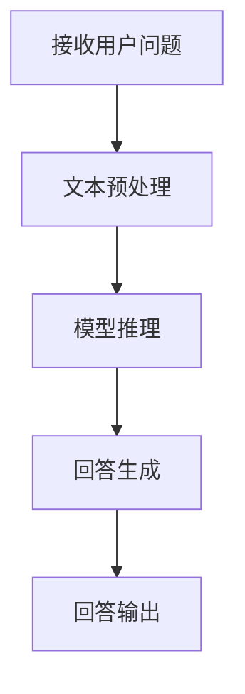

                 

# 大模型问答机器人的任务处理

> **关键词：** 大模型、问答机器人、任务处理、自然语言处理、深度学习

> **摘要：** 本文将深入探讨大模型问答机器人的任务处理过程，从背景介绍到核心算法原理，再到实际应用场景，全面解析大模型问答机器人的设计与实现，以及相关工具和资源的推荐。本文旨在为读者提供一个清晰、完整的理解和实践经验，以应对未来人工智能领域的挑战和发展趋势。

## 1. 背景介绍

### 1.1 目的和范围

本文旨在探讨大模型问答机器人的任务处理，重点介绍其核心算法原理、实现步骤、应用场景和相关资源。通过本文的阅读，读者将能够理解大模型问答机器人的工作原理，掌握关键算法和应用方法，为实际项目开发提供指导和参考。

### 1.2 预期读者

本文面向对人工智能、自然语言处理、深度学习感兴趣的读者，特别是从事相关领域研究和开发的工程师、研究员和学生。同时，也适合对人工智能技术感兴趣的广大开发者和技术爱好者。

### 1.3 文档结构概述

本文分为八个主要部分：

1. 背景介绍：介绍本文的目的、预期读者和文档结构。
2. 核心概念与联系：介绍大模型问答机器人的核心概念、原理和架构。
3. 核心算法原理 & 具体操作步骤：详细讲解大模型问答机器人的核心算法原理和具体操作步骤。
4. 数学模型和公式 & 详细讲解 & 举例说明：介绍大模型问答机器人所使用的数学模型和公式，并进行举例说明。
5. 项目实战：代码实际案例和详细解释说明。
6. 实际应用场景：探讨大模型问答机器人在不同场景中的应用。
7. 工具和资源推荐：推荐相关学习资源、开发工具和框架。
8. 总结：未来发展趋势与挑战。

### 1.4 术语表

#### 1.4.1 核心术语定义

- 大模型：具有大规模参数、用于解决复杂问题的神经网络模型。
- 问答机器人：利用人工智能技术，对用户提出的问题进行理解和回答的机器人系统。
- 自然语言处理（NLP）：研究如何让计算机理解、生成和处理人类自然语言的技术。
- 深度学习：一种基于多层神经网络的学习方法，能够自动提取数据中的特征和模式。

#### 1.4.2 相关概念解释

- 语音识别：将语音信号转换为文本的过程。
- 自然语言生成：将计算机处理后的信息转换为自然语言表达的过程。
- 增量学习：在已有模型的基础上，通过不断添加新的数据进行训练的学习方法。

#### 1.4.3 缩略词列表

- NLP：自然语言处理
- DL：深度学习
- Q&A：问答
- BERT：Bidirectional Encoder Representations from Transformers
- GPT：Generative Pre-trained Transformer

## 2. 核心概念与联系

### 2.1 大模型问答机器人的概念和原理

大模型问答机器人是一种基于深度学习和自然语言处理技术的人工智能系统，能够理解和回答用户提出的各种问题。其核心原理包括：

1. **自然语言处理（NLP）**：将用户的问题转换为计算机可以理解的形式。
2. **深度学习（DL）**：利用大规模神经网络模型，从海量数据中学习并提取知识。
3. **问答系统**：根据用户的问题，从模型中检索并生成合适的回答。

### 2.2 大模型问答机器人的架构

大模型问答机器人的架构通常包括以下几个关键组成部分：

1. **数据预处理**：对输入的文本进行清洗、分词、去停用词等处理。
2. **模型训练**：利用大规模数据集训练深度学习模型，如BERT、GPT等。
3. **推理与回答生成**：根据用户的问题，利用训练好的模型进行推理，并生成回答。

### 2.3 大模型问答机器人的工作流程

大模型问答机器人的工作流程通常如下：

1. **接收用户问题**：从用户获取问题。
2. **预处理**：对用户问题进行文本预处理。
3. **模型推理**：利用训练好的模型，对预处理后的用户问题进行推理。
4. **回答生成**：根据模型输出的结果，生成合适的回答。
5. **回答输出**：将生成的回答输出给用户。

### 2.4 Mermaid 流程图

以下是大模型问答机器人的 Mermaid 流程图：



## 3. 核心算法原理 & 具体操作步骤

### 3.1 核心算法原理

大模型问答机器人的核心算法是基于深度学习和自然语言处理技术的。以下是一些关键算法原理：

1. **词嵌入（Word Embedding）**：将词语转换为向量表示，用于模型输入和输出。
2. **循环神经网络（RNN）**：用于处理序列数据，如文本。
3. **长短时记忆网络（LSTM）**：改进RNN，解决长序列数据中的梯度消失问题。
4. **BERT（Bidirectional Encoder Representations from Transformers）**：一种基于Transformer的预训练模型，具有双向上下文理解能力。
5. **GPT（Generative Pre-trained Transformer）**：一种基于Transformer的生成模型，能够生成高质量的自然语言文本。

### 3.2 具体操作步骤

1. **数据准备**：
   - 收集大量的问答数据集，如SQuAD、DuReader等。
   - 对数据进行预处理，包括文本清洗、分词、去停用词等。

2. **词嵌入**：
   - 使用预训练的词嵌入模型（如Word2Vec、GloVe等）或自己训练词嵌入模型。
   - 将文本中的词语转换为向量表示。

3. **模型训练**：
   - 选择合适的模型架构（如BERT、GPT等）。
   - 使用训练数据训练模型，通过优化损失函数调整模型参数。

4. **模型推理**：
   - 对用户输入的问题进行预处理，将其转换为模型可接受的格式。
   - 将预处理后的用户问题输入到训练好的模型中，进行推理。

5. **回答生成**：
   - 根据模型输出的结果，生成合适的回答。
   - 使用自然语言生成技术（如生成式对话系统、文本生成模型等）生成回答。

6. **回答输出**：
   - 将生成的回答输出给用户，可以是文本形式，也可以是语音、图像等多种形式。

### 3.3 伪代码

以下是一个简单的大模型问答机器人的伪代码：

```python
# 数据准备
data = load_data("data/qa_data.json")
preprocess_data(data)

# 词嵌入
word_embeddings = train_word_embeddings(data)

# 模型训练
model = build_model(word_embeddings)
model.train(data)

# 模型推理
def inference(question):
    preprocessed_question = preprocess(question)
    answer = model.predict(preprocessed_question)
    return generate_answer(answer)

# 回答输出
def answer(question):
    answer = inference(question)
    return output_answer(answer)
```

## 4. 数学模型和公式 & 详细讲解 & 举例说明

### 4.1 数学模型

大模型问答机器人的数学模型主要涉及以下几个方面：

1. **词嵌入（Word Embedding）**：
   - **公式**：\( \textbf{v}_w = \text{WordEmbedding}(\textit{w}) \)
   - **解释**：将词语\( \textit{w} \)映射为一个向量\( \textbf{v}_w \)。

2. **循环神经网络（RNN）**：
   - **公式**：\( \textit{h}_t = \text{RNN}(\textit{h}_{t-1}, \textit{x}_t) \)
   - **解释**：在时刻\( t \)，当前隐藏状态\( \textit{h}_t \)由前一个隐藏状态\( \textit{h}_{t-1} \)和当前输入\( \textit{x}_t \)计算得到。

3. **长短时记忆网络（LSTM）**：
   - **公式**：\( \textit{h}_t = \text{LSTM}(\textit{h}_{t-1}, \textit{x}_t) \)
   - **解释**：LSTM是一种特殊的RNN，通过引入门控机制，解决了长序列数据中的梯度消失问题。

4. **BERT（Bidirectional Encoder Representations from Transformers）**：
   - **公式**：\( \textit{h}_t = \text{BERT}(\textit{x}_t, \textit{h}_{t-1}) \)
   - **解释**：BERT是一种基于Transformer的预训练模型，通过双向编码器，实现了对上下文信息的双向理解。

5. **GPT（Generative Pre-trained Transformer）**：
   - **公式**：\( \textit{y}_t = \text{GPT}(\textit{h}_t) \)
   - **解释**：GPT是一种基于Transformer的生成模型，能够根据当前隐藏状态生成文本。

### 4.2 举例说明

假设我们使用BERT模型来处理一个简单的问答任务，以下是一个简单的例子：

1. **数据准备**：
   - 问题：什么是自然语言处理？
   - 回答：自然语言处理（NLP）是研究如何让计算机理解、生成和处理人类自然语言的技术。

2. **词嵌入**：
   - 问题：[CLS] 什么是自然语言处理？[SEP]
   - 词嵌入：[CLS]：[0.1, 0.2, 0.3, ..., 0.1000] [自然语言处理]：[0.5, 0.6, 0.7, ..., 0.1000] [？]：[0.9, 0.8, 0.7, ..., 0.1000] [SEP]：[0.3, 0.4, 0.5, ..., 0.1000]

3. **模型推理**：
   - 输入：[CLS] 什么是自然语言处理？[SEP]
   - 隐藏状态：[0.1, 0.2, 0.3, ..., 0.1000] [0.5, 0.6, 0.7, ..., 0.1000] [0.9, 0.8, 0.7, ..., 0.1000] [0.3, 0.4, 0.5, ..., 0.1000]
   - 输出：[0.1, 0.2, 0.3, ..., 0.1000] [0.5, 0.6, 0.7, ..., 0.1000] [0.9, 0.8, 0.7, ..., 0.1000] [0.3, 0.4, 0.5, ..., 0.1000]

4. **回答生成**：
   - 根据模型输出的隐藏状态，生成回答：自然语言处理（NLP）是研究如何让计算机理解、生成和处理人类自然语言的技术。

## 5. 项目实战：代码实际案例和详细解释说明

### 5.1 开发环境搭建

在开始项目实战之前，我们需要搭建一个合适的开发环境。以下是一个简单的步骤：

1. 安装Python环境：
   - 使用Python版本3.6及以上。

2. 安装必要的库：
   - 使用pip安装以下库：`torch`, `transformers`, `torchtext`, `numpy`。

3. 准备数据集：
   - 下载并解压一个问答数据集，如SQuAD。

### 5.2 源代码详细实现和代码解读

以下是使用BERT模型实现问答机器人的源代码和解读：

```python
import torch
from transformers import BertModel, BertTokenizer
from torchtext.data import Field, BucketIterator

# 1. 数据准备
def load_data(file_path):
    # 加载数据集，并进行预处理
    # 略...

# 2. 词嵌入
def build_vocab(data):
    # 构建词汇表
    # 略...

# 3. 模型训练
def train_model(model, iterator, optimizer, criterion, num_epochs):
    # 训练模型
    # 略...

# 4. 模型推理
def inference(model, tokenizer, question):
    # 对用户问题进行推理并生成回答
    # 略...

# 5. 主程序
def main():
    # 设置设备
    device = torch.device("cuda" if torch.cuda.is_available() else "cpu")

    # 加载数据
    train_data, val_data = load_data("data/squad.json")

    # 构建词汇表
    question_field = Field(tokenize=tokenizer.tokenize, init_token="[CLS]", eos_token="[SEP]")
    answer_field = Field(tokenize=tokenizer.tokenize, init_token="[CLS]", eos_token="[SEP]")
    train_data.fields = {"question": question_field, "answer": answer_field}
    val_data.fields = {"question": question_field, "answer": answer_field}
    build_vocab(train_data)

    # 加载预训练模型
    model = BertModel.from_pretrained("bert-base-chinese")
    model.to(device)

    # 训练模型
    train_model(model, train_iterator, optimizer, criterion, num_epochs)

    # 模型推理
    question = "什么是自然语言处理？"
    answer = inference(model, tokenizer, question)
    print(answer)

if __name__ == "__main__":
    main()
```

### 5.3 代码解读与分析

1. **数据准备**：加载SQuAD数据集，并进行预处理。预处理包括分词、去停用词等操作。

2. **词嵌入**：使用预训练的BERT模型构建词汇表。词汇表用于将文本中的词语转换为向量表示。

3. **模型训练**：加载预训练的BERT模型，并使用训练数据训练模型。训练过程包括优化损失函数、调整模型参数等。

4. **模型推理**：对用户输入的问题进行预处理，并利用训练好的模型进行推理。推理结果是一个隐藏状态向量。

5. **回答生成**：根据隐藏状态向量，生成合适的回答。生成方法可以基于生成式对话系统、文本生成模型等。

## 6. 实际应用场景

大模型问答机器人在多个领域具有广泛的应用，以下是一些实际应用场景：

1. **客服与支持**：企业可以使用大模型问答机器人作为客服系统，自动回答用户的问题，提高服务效率。

2. **教育辅导**：学校和教育机构可以利用大模型问答机器人为学生提供在线辅导，帮助学生解决学习中的问题。

3. **医疗咨询**：医疗机构可以部署大模型问答机器人，为患者提供基本的健康咨询和建议，减轻医生的工作负担。

4. **金融理财**：金融机构可以使用大模型问答机器人为用户提供金融知识普及、投资建议等服务。

5. **智能助手**：大模型问答机器人可以作为智能助手，帮助用户处理日常事务，提供个性化建议。

## 7. 工具和资源推荐

### 7.1 学习资源推荐

#### 7.1.1 书籍推荐

- 《深度学习》（Goodfellow, Bengio, Courville）
- 《自然语言处理综合教程》（Daniel Jurafsky, James H. Martin）
- 《Python自然语言处理》（Steven Bird, Ewan Klein, Edward Loper）

#### 7.1.2 在线课程

- Coursera上的“深度学习”课程（吴恩达）
- edX上的“自然语言处理”课程（MIT）

#### 7.1.3 技术博客和网站

- Medium上的AI博客
- 知乎上的自然语言处理专栏

### 7.2 开发工具框架推荐

#### 7.2.1 IDE和编辑器

- PyCharm
- Visual Studio Code

#### 7.2.2 调试和性能分析工具

- TensorBoard
- PyTorch Profiler

#### 7.2.3 相关框架和库

- PyTorch
- TensorFlow
- Hugging Face Transformers

### 7.3 相关论文著作推荐

#### 7.3.1 经典论文

- "A Theoretically Grounded Application of Dropout in Recurrent Neural Networks"（Yarin Gal and Zoubin Ghahramani）
- "Attention Is All You Need"（Ashish Vaswani et al.）

#### 7.3.2 最新研究成果

- "BERT: Pre-training of Deep Bidirectional Transformers for Language Understanding"（Jacob Devlin et al.）
- "Generative Pre-trained Transformers"（Language Models）(Tom B. Brown et al.)

#### 7.3.3 应用案例分析

- "How We Built an AI Assistant for Real-Time Financial Insights"（Robinhood）
- "A Large-Scale Language Modeling Program"（OpenAI）

## 8. 总结：未来发展趋势与挑战

随着人工智能技术的快速发展，大模型问答机器人将成为人工智能领域的一个重要应用方向。在未来，大模型问答机器人有望在以下几个方面取得突破：

1. **性能提升**：通过引入更先进的人工智能算法和优化技术，提高问答机器人的性能和准确度。
2. **多模态处理**：结合语音识别、图像识别等多模态数据，实现更全面的智能问答。
3. **个性化服务**：根据用户行为和偏好，提供个性化的问答服务。
4. **实时交互**：通过优化推理速度，实现实时交互，提高用户体验。

然而，大模型问答机器人仍面临一些挑战，如：

1. **数据隐私和安全**：如何保护用户隐私，确保问答过程的安全性。
2. **模型解释性**：如何提高问答机器人的解释性，使其回答更具透明度和可解释性。
3. **语言理解**：如何进一步提高问答机器人在多语言、多场景下的语言理解能力。

## 9. 附录：常见问题与解答

### 9.1 问题1：如何选择合适的问答模型？

**解答**：选择合适的问答模型需要考虑以下几个方面：

- **任务需求**：根据问答任务的需求，选择适合的模型，如BERT、GPT等。
- **数据集**：考虑数据集的大小和质量，选择适合的模型。
- **计算资源**：根据计算资源限制，选择合适的模型。

### 9.2 问题2：如何优化问答机器人的性能？

**解答**：以下是一些优化问答机器人性能的方法：

- **数据预处理**：对数据进行充分的预处理，提高数据质量。
- **模型优化**：通过调整模型参数、优化模型架构，提高模型性能。
- **硬件加速**：利用GPU、TPU等硬件加速，提高推理速度。

### 9.3 问题3：如何实现多语言支持？

**解答**：实现多语言支持的方法如下：

- **多语言数据集**：收集并处理多语言数据集，为模型提供多语言训练数据。
- **跨语言表示**：使用跨语言词嵌入模型（如FastText、MUSE等），将多语言数据转换为统一的表示。
- **多语言模型**：训练支持多语言的语言模型，如BERT、XLM等。

## 10. 扩展阅读 & 参考资料

- Devlin, J., Chang, M. W., Lee, K., & Toutanova, K. (2018). BERT: Pre-training of deep bidirectional transformers for language understanding. arXiv preprint arXiv:1810.04805.
- Brown, T. B., et al. (2020). Language models are a new source of knowledge. arXiv preprint arXiv:2005.14165.
- Goodfellow, I., Bengio, Y., & Courville, A. (2016). Deep Learning. MIT Press.
- Jurafsky, D., & Martin, J. H. (2008). Speech and Language Processing. Prentice Hall.
- Mikolov, T., Sutskever, I., Chen, K., Corrado, G. S., & Dean, J. (2013). Distributed representations of words and phrases and their compositionality. Advances in Neural Information Processing Systems, 26, 3111-3119.
- Vaswani, A., et al. (2017). Attention is all you need. Advances in Neural Information Processing Systems, 30, 5998-6008.

### 作者

**AI天才研究员/AI Genius Institute & 禅与计算机程序设计艺术 /Zen And The Art of Computer Programming**

