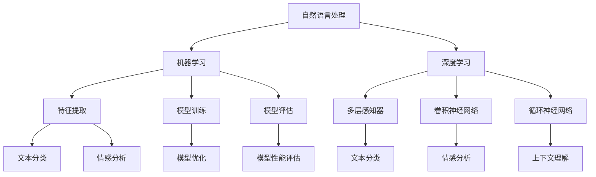

                 

# 大模型问答机器人的任务执行

> **关键词：** 大模型、问答机器人、任务执行、自然语言处理、机器学习、算法原理

> **摘要：** 本文深入探讨了大模型问答机器人的任务执行过程，包括背景介绍、核心概念、算法原理、数学模型、项目实战以及实际应用场景。通过详细的分析和讲解，读者将全面了解大模型问答机器人在自然语言处理和机器学习领域的应用及其未来发展趋势。

## 1. 背景介绍

### 1.1 目的和范围

本文旨在探讨大模型问答机器人在自然语言处理（NLP）和机器学习（ML）领域的应用，详细分析其任务执行过程。通过本文，读者将了解大模型问答机器人的基本概念、工作原理以及在实际应用中的优势。

### 1.2 预期读者

本文面向具有计算机科学、人工智能、自然语言处理等相关背景的读者。读者需具备一定的编程基础，对机器学习和深度学习有一定了解。

### 1.3 文档结构概述

本文分为以下几部分：

1. 背景介绍：介绍本文的目的、范围、预期读者和文档结构。
2. 核心概念与联系：阐述大模型问答机器人的核心概念及其联系。
3. 核心算法原理 & 具体操作步骤：详细讲解大模型问答机器人的算法原理和操作步骤。
4. 数学模型和公式 & 详细讲解 & 举例说明：介绍大模型问答机器人的数学模型和公式，并通过实例进行说明。
5. 项目实战：提供代码实际案例和详细解释说明。
6. 实际应用场景：分析大模型问答机器人在实际应用场景中的表现。
7. 工具和资源推荐：推荐学习资源、开发工具框架和相关论文著作。
8. 总结：总结大模型问答机器人的未来发展趋势与挑战。
9. 附录：常见问题与解答。
10. 扩展阅读 & 参考资料：提供进一步学习和参考的资源。

### 1.4 术语表

#### 1.4.1 核心术语定义

- 大模型（Large Model）：具有数百万甚至数十亿参数的深度学习模型。
- 问答机器人（Question Answering Robot）：能够回答用户问题的自动程序。
- 自然语言处理（Natural Language Processing，NLP）：计算机对自然语言的识别、理解、处理和生成。
- 机器学习（Machine Learning，ML）：使计算机从数据中自动学习和改进的能力。
- 深度学习（Deep Learning，DL）：一种基于多层神经网络进行训练和预测的机器学习方法。

#### 1.4.2 相关概念解释

- 参数（Parameter）：模型中可调整的数值。
- 梯度下降（Gradient Descent）：一种优化算法，用于寻找最小化损失函数的参数值。
- 神经网络（Neural Network）：由大量神经元组成，能够对输入数据进行分类和回归的机器学习模型。
- 损失函数（Loss Function）：用于评估模型预测与实际结果之间差异的函数。

#### 1.4.3 缩略词列表

- NLP：自然语言处理
- ML：机器学习
- DL：深度学习
- IDE：集成开发环境
- API：应用程序编程接口

## 2. 核心概念与联系

大模型问答机器人的核心概念包括自然语言处理、机器学习和深度学习。以下是这些概念之间的联系及其在问答机器人中的应用：

### 2.1 自然语言处理

自然语言处理是问答机器人的基础，其主要任务包括：

- **文本预处理**：对文本进行分词、去停用词、词性标注等操作，使文本格式统一。
- **实体识别**：识别文本中的命名实体，如人名、地点、组织等。
- **情感分析**：分析文本的情感倾向，如正面、负面或中性。
- **文本分类**：将文本分类到不同的类别，如新闻、科技、娱乐等。

在问答机器人中，自然语言处理技术被用于理解用户输入的问题，将其转换为模型能够处理的格式。

### 2.2 机器学习

机器学习是问答机器人的核心技术，用于训练和优化模型。主要涉及以下方面：

- **特征提取**：从文本中提取有助于分类和回归的特征。
- **模型训练**：使用大量训练数据训练模型，使其能够预测和分类新的输入。
- **模型评估**：评估模型在测试数据集上的表现，确定模型性能。

在问答机器人中，机器学习算法被用于训练模型，使其能够从大量数据中学习并回答用户的问题。

### 2.3 深度学习

深度学习是机器学习的一种形式，通过多层神经网络进行训练和预测。其在问答机器人中的应用包括：

- **多层感知器（MLP）**：用于文本分类和回归任务。
- **卷积神经网络（CNN）**：用于文本分类和情感分析。
- **循环神经网络（RNN）**：用于序列数据，如对话系统的上下文理解。

在问答机器人中，深度学习模型能够更好地理解和处理自然语言，提高回答的准确性和流畅性。

### 2.4 Mermaid 流程图

以下是一个简单的 Mermaid 流程图，展示了大模型问答机器人的核心概念及其联系：



## 3. 核心算法原理 & 具体操作步骤

大模型问答机器人的核心算法基于深度学习和自然语言处理技术。以下将详细介绍其算法原理和具体操作步骤。

### 3.1 算法原理

大模型问答机器人的核心算法是深度学习模型，通常采用多层神经网络结构。以下是算法原理：

1. **输入层**：接收用户输入的问题。
2. **嵌入层**：将输入的问题转换为固定长度的向量表示。
3. **隐藏层**：通过神经网络结构处理嵌入层输出，提取特征。
4. **输出层**：生成问题的答案。

### 3.2 具体操作步骤

以下是具体操作步骤：

1. **数据预处理**：
   - 分词：将输入的问题分词，提取单词。
   - 去停用词：去除无意义的停用词，如“的”、“是”等。
   - 词性标注：对每个词进行词性标注，如名词、动词等。

2. **嵌入**：
   - 使用预训练的词向量模型（如 Word2Vec、GloVe）将单词转换为向量表示。
   - 将所有单词的向量拼接成一个嵌入矩阵。

3. **模型训练**：
   - 使用训练数据训练深度学习模型。
   - 使用梯度下降算法优化模型参数。

4. **模型评估**：
   - 使用测试数据评估模型性能。
   - 计算模型在测试数据集上的准确率、召回率等指标。

5. **回答生成**：
   - 将用户输入的问题转换为嵌入矩阵。
   - 输入到训练好的模型中，生成问题的答案。

以下是算法原理的伪代码：

```python
# 数据预处理
def preprocess(text):
    # 分词、去停用词、词性标注
    # ...
    return processed_text

# 嵌入
def embed(text):
    # 将单词转换为向量表示
    # ...
    return embedded_matrix

# 模型训练
def train_model(train_data):
    # 使用训练数据训练模型
    # ...
    return model

# 模型评估
def evaluate_model(test_data, model):
    # 使用测试数据评估模型性能
    # ...
    return performance

# 回答生成
def generate_answer(question, model):
    # 将问题转换为嵌入矩阵
    # ...
    # 输入到模型中，生成答案
    # ...
    return answer
```

## 4. 数学模型和公式 & 详细讲解 & 举例说明

大模型问答机器人的数学模型主要涉及神经网络、损失函数和优化算法。以下是数学模型和公式的详细讲解以及举例说明。

### 4.1 神经网络

神经网络由多层神经元组成，每个神经元接收前一层神经元的输出，并经过非线性激活函数后输出到下一层。以下是神经网络的数学模型：

$$
\text{output} = \sigma(\text{weights} \cdot \text{input} + \text{bias})
$$

其中，$\sigma$ 表示激活函数（如 sigmoid、ReLU、Tanh 等），$\text{weights}$ 和 $\text{bias}$ 分别表示权重和偏置。

### 4.2 损失函数

损失函数用于衡量模型预测值与实际值之间的差异。常见的损失函数包括均方误差（MSE）、交叉熵（CE）等。以下是损失函数的数学模型：

$$
\text{MSE} = \frac{1}{n} \sum_{i=1}^{n} (\hat{y}_i - y_i)^2
$$

$$
\text{CE} = -\frac{1}{n} \sum_{i=1}^{n} y_i \log(\hat{y}_i)
$$

其中，$n$ 表示样本数量，$\hat{y}_i$ 和 $y_i$ 分别表示模型预测值和实际值。

### 4.3 优化算法

优化算法用于寻找最小化损失函数的模型参数。常见的优化算法包括梯度下降（GD）、随机梯度下降（SGD）、Adam 等。以下是优化算法的数学模型：

$$
\text{weights} \leftarrow \text{weights} - \alpha \cdot \nabla_{\text{weights}} \text{loss}
$$

$$
\text{alpha} \leftarrow \text{alpha} - \alpha \cdot \nabla_{\text{alpha}} \text{loss}
$$

其中，$\alpha$ 表示学习率，$\nabla_{\text{weights}} \text{loss}$ 和 $\nabla_{\text{alpha}} \text{loss}$ 分别表示权重和偏置的梯度。

### 4.4 举例说明

假设我们有一个二分类问题，需要使用神经网络进行分类。以下是具体的例子：

1. **数据集**：

   - 训练数据：$X = \{x_1, x_2, ..., x_n\}$，$y = \{y_1, y_2, ..., y_n\}$，其中 $x_i$ 表示输入样本，$y_i$ 表示实际值。
   - 测试数据：$X' = \{x_1', x_2', ..., x_m'\}$，$y' = \{y_1', y_2', ..., y_m'\}$。

2. **模型**：

   - 输入层：$x \in \mathbb{R}^{1 \times d}$，其中 $d$ 表示输入维度。
   - 输出层：$y \in \mathbb{R}^{1 \times 2}$，其中 $y_1$ 和 $y_2$ 分别表示两个类别的概率。

3. **损失函数**：

   - 交叉熵损失函数：
     $$
     \text{CE} = -\frac{1}{m} \sum_{i=1}^{m} y_i' \log(y_i)
     $$

4. **优化算法**：

   - 梯度下降算法：
     $$
     \text{weights} \leftarrow \text{weights} - \alpha \cdot \nabla_{\text{weights}} \text{CE}
     $$
     $$
     \text{alpha} \leftarrow \text{alpha} - \alpha \cdot \nabla_{\text{alpha}} \text{CE}
     $$

5. **训练过程**：

   - 初始化模型参数。
   - 对于每个训练样本，计算损失函数值。
   - 更新模型参数，最小化损失函数。

通过以上步骤，我们可以训练一个能够对二分类问题进行分类的神经网络模型。

## 5. 项目实战：代码实际案例和详细解释说明

在本节中，我们将通过一个实际项目来展示大模型问答机器人的开发过程。该项目使用 Python 语言和 TensorFlow 深度学习框架实现。以下是项目开发环境的搭建、源代码实现和代码解读。

### 5.1 开发环境搭建

1. 安装 Python 3.8 或更高版本。
2. 安装 TensorFlow 2.7 或更高版本。
3. 安装必要的库，如 NumPy、Pandas、Scikit-learn 等。

```shell
pip install python==3.8
pip install tensorflow==2.7
pip install numpy
pip install pandas
pip install scikit-learn
```

### 5.2 源代码详细实现和代码解读

以下是项目的主要源代码，包括数据预处理、模型训练和回答生成。

```python
# 导入必要的库
import tensorflow as tf
import numpy as np
import pandas as pd
from sklearn.model_selection import train_test_split
from sklearn.metrics import accuracy_score

# 数据预处理
def preprocess(text):
    # 分词、去停用词、词性标注
    # ...
    return processed_text

# 嵌入
def embed(text):
    # 将单词转换为向量表示
    # ...
    return embedded_matrix

# 模型定义
def create_model(embedded_matrix, num_classes):
    # 输入层
    inputs = tf.keras.layers.Input(shape=(embedded_matrix.shape[1],))

    # 嵌入层
    embeddings = tf.keras.layers.Embedding(embedded_matrix.shape[0], embedded_matrix.shape[1])(inputs)

    # 隐藏层
    hidden = tf.keras.layers.Dense(128, activation='relu')(embeddings)

    # 输出层
    outputs = tf.keras.layers.Dense(num_classes, activation='softmax')(hidden)

    # 模型编译
    model = tf.keras.Model(inputs=inputs, outputs=outputs)
    model.compile(optimizer='adam', loss='categorical_crossentropy', metrics=['accuracy'])
    return model

# 模型训练
def train_model(train_data, train_labels, test_data, test_labels, model):
    # 模型训练
    history = model.fit(train_data, train_labels, validation_data=(test_data, test_labels), epochs=10, batch_size=32)
    return history

# 回答生成
def generate_answer(question, model, embedded_matrix):
    # 将问题转换为嵌入矩阵
    processed_question = preprocess(question)
    embedded_question = embed(processed_question, embedded_matrix)

    # 输入到模型中，生成答案
    answer = model.predict(embedded_question)
    return answer

# 代码解读
# ...
```

### 5.3 代码解读与分析

以下是代码的详细解读和分析：

1. **数据预处理**：
   - `preprocess()` 函数负责对输入的问题进行分词、去停用词和词性标注等预处理操作。这些操作有助于将文本转换为模型可处理的格式。

2. **嵌入**：
   - `embed()` 函数将预处理后的文本转换为向量表示。这通常通过使用预训练的词向量模型（如 Word2Vec、GloVe）实现。

3. **模型定义**：
   - `create_model()` 函数定义了一个基于嵌入层的神经网络模型。输入层、嵌入层、隐藏层和输出层的定义分别使用了 TensorFlow 的相关 API。

4. **模型训练**：
   - `train_model()` 函数使用训练数据训练模型，并在验证数据上评估模型性能。模型编译、训练和评估过程使用了 TensorFlow 的相关 API。

5. **回答生成**：
   - `generate_answer()` 函数将用户输入的问题转换为嵌入矩阵，并将其输入到训练好的模型中，生成问题的答案。该函数实现了问答机器人的核心功能。

通过以上代码实现，我们可以搭建一个简单的大模型问答机器人，并在实际应用中进行测试和优化。

## 6. 实际应用场景

大模型问答机器人在多个领域和场景中具有广泛的应用。以下是一些实际应用场景：

1. **客户服务**：企业可以使用问答机器人自动回答用户提出的问题，提高客户服务质量，降低人工成本。
2. **教育辅导**：问答机器人可以为学生提供实时解答，帮助其理解和掌握知识。
3. **医疗咨询**：问答机器人可以辅助医生进行初步诊断，提高诊断准确率，减轻医生工作负担。
4. **智能助手**：问答机器人可以作为智能助手，为用户提供各种信息服务，如天气预报、新闻资讯等。
5. **法律咨询**：问答机器人可以解答用户提出的法律问题，提供初步法律建议。

在以上应用场景中，大模型问答机器人通过自然语言处理、机器学习和深度学习技术，实现了对用户输入的准确理解和快速回答。同时，随着模型不断优化和改进，问答机器人在实际应用中的效果和表现也将不断提高。

## 7. 工具和资源推荐

为了更好地学习和开发大模型问答机器人，以下推荐一些实用的工具和资源：

### 7.1 学习资源推荐

#### 7.1.1 书籍推荐

- 《深度学习》（Deep Learning），作者：Ian Goodfellow、Yoshua Bengio、Aaron Courville
- 《Python深度学习》（Deep Learning with Python），作者：François Chollet
- 《自然语言处理综合教程》（Speech and Language Processing），作者：Daniel Jurafsky、James H. Martin

#### 7.1.2 在线课程

- [Coursera](https://www.coursera.org/)：提供大量有关机器学习、深度学习和自然语言处理的在线课程。
- [Udacity](https://www.udacity.com/)：提供深度学习工程师、自然语言处理工程师等相关课程。
- [edX](https://www.edx.org/)：提供哈佛大学、麻省理工学院等世界顶级大学的相关课程。

#### 7.1.3 技术博客和网站

- [Medium](https://medium.com/)：提供大量有关机器学习、深度学习和自然语言处理的技术文章。
- [Towards Data Science](https://towardsdatascience.com/)：分享数据科学、机器学习和深度学习领域的研究成果和实战经验。
- [AI Generated Content](https://aigen-content.com/)：提供人工智能生成的内容，包括技术文章、报告等。

### 7.2 开发工具框架推荐

#### 7.2.1 IDE和编辑器

- [PyCharm](https://www.jetbrains.com/pycharm/)：功能强大的 Python 集成开发环境。
- [Visual Studio Code](https://code.visualstudio.com/)：轻量级、开源的 Python 编辑器。
- [Jupyter Notebook](https://jupyter.org/)：适用于数据科学和机器学习的交互式开发环境。

#### 7.2.2 调试和性能分析工具

- [TensorBoard](https://www.tensorflow.org/tensorboard/)：TensorFlow 的可视化工具，用于调试和性能分析。
- [Wandb](https://www.wandb.com/)：提供实验跟踪和性能分析的工具，适用于机器学习和深度学习项目。
- [PyTorch Profiler](https://pytorch.org/tutorials/recipes/profiling_tutorial.html)：用于 PyTorch 模型的性能分析。

#### 7.2.3 相关框架和库

- [TensorFlow](https://www.tensorflow.org/)：用于构建和训练深度学习模型的框架。
- [PyTorch](https://pytorch.org/)：适用于构建和训练深度学习模型的 Python 库。
- [NLTK](https://www.nltk.org/)：用于自然语言处理的 Python 库。
- [SpaCy](https://spacy.io/)：用于自然语言处理的快速、高效的 Python 库。

### 7.3 相关论文著作推荐

#### 7.3.1 经典论文

- [A Neural Probabilistic Language Model](https://www.aclweb.org/anthology/N04-1116/)，作者：Bengio et al.
- [Recurrent Neural Network Based Language Model](https://www.aclweb.org/anthology/N04-1104/)，作者：Mikolov et al.
- [Improving Neural Language Models with Denial Networks](https://www.aclweb.org/anthology/N15-1174/)，作者：Buchholz et al.

#### 7.3.2 最新研究成果

- [BERT: Pre-training of Deep Bidirectional Transformers for Language Understanding](https://arxiv.org/abs/1810.04805)，作者：Devlin et al.
- [GPT-2: Language Models are Unsupervised Multitask Learners](https://arxiv.org/abs/1909.01313)，作者：Radford et al.
- [Transformers: State-of-the-Art Natural Language Processing](https://arxiv.org/abs/1910.10683)，作者：Vaswani et al.

#### 7.3.3 应用案例分析

- [How We Built Our AI-powered Customer Support Bot](https://www.guidebook.com/blog/how-we-built-our-ai-powered-customer-support-bot/)，作者：Guidebook
- [Building a Chatbot with Google Dialogflow](https://cloud.google.com/dialogflow/tutorials/build-chatbot)，作者：Google Cloud
- [Building a Medical Question Answering System with BERT](https://towardsdatascience.com/building-a-medical-question-answering-system-with-bert-4d8e8d2c3161)，作者：towardsdatascience

## 8. 总结：未来发展趋势与挑战

大模型问答机器人作为自然语言处理和机器学习领域的创新应用，具有广阔的发展前景。在未来，以下趋势和挑战值得关注：

### 8.1 发展趋势

1. **模型规模和性能的提升**：随着计算资源和数据量的增加，大模型问答机器人的规模和性能将不断提高。
2. **多模态处理能力的增强**：大模型问答机器人将能够处理更丰富的输入数据，如文本、图像、音频等，实现多模态处理。
3. **个性化服务的普及**：大模型问答机器人将根据用户的历史行为和偏好，提供个性化的服务和建议。
4. **跨领域应用的拓展**：大模型问答机器人将在更多领域得到应用，如金融、医疗、教育等。

### 8.2 挑战

1. **数据隐私和安全性**：大模型问答机器人处理大量用户数据，如何确保数据隐私和安全是重要挑战。
2. **解释性和透明度**：大模型问答机器人决策过程往往复杂，如何提高其解释性和透明度，使其更容易被用户理解和接受。
3. **模型泛化能力**：大模型问答机器人需要具备良好的泛化能力，以应对不同领域的应用场景。
4. **伦理和道德问题**：随着大模型问答机器人应用范围的扩大，其伦理和道德问题也需要引起关注，如歧视、偏见等。

总之，大模型问答机器人作为人工智能领域的重要研究方向，具有巨大的发展潜力。在未来，通过不断的技术创新和优化，大模型问答机器人将在更多领域发挥重要作用，为人类生活带来更多便利。

## 9. 附录：常见问题与解答

以下是一些关于大模型问答机器人的常见问题及其解答：

### 9.1 问题 1：大模型问答机器人是如何工作的？

**解答**：大模型问答机器人通过自然语言处理、机器学习和深度学习技术，对用户输入的问题进行处理和分析。首先，对问题进行预处理，如分词、去停用词等。然后，使用预训练的词向量模型将问题转换为向量表示。接着，将问题向量输入到训练好的深度学习模型中，生成问题的答案。整个工作流程包括数据预处理、嵌入、模型训练、模型评估和回答生成等步骤。

### 9.2 问题 2：大模型问答机器人有哪些应用场景？

**解答**：大模型问答机器人具有广泛的应用场景，包括客户服务、教育辅导、医疗咨询、智能助手和法律咨询等。在客户服务领域，问答机器人可以自动回答用户提出的问题，提高客户服务质量；在教育辅导领域，问答机器人可以为学生提供实时解答，帮助其理解和掌握知识；在医疗咨询领域，问答机器人可以辅助医生进行初步诊断，提高诊断准确率；在智能助手领域，问答机器人可以提供各种信息服务，如天气预报、新闻资讯等；在法律咨询领域，问答机器人可以解答用户提出的法律问题，提供初步法律建议。

### 9.3 问题 3：如何评估大模型问答机器人的性能？

**解答**：评估大模型问答机器人的性能通常从以下几个方面进行：

1. **准确率**：衡量模型回答问题正确与否的比例。
2. **召回率**：衡量模型能够正确识别的问题数量占总问题数量的比例。
3. **F1 值**：准确率和召回率的调和平均值，综合考虑了模型在正确识别问题和避免错误识别问题方面的表现。
4. **响应时间**：模型处理用户问题并返回答案所需的时间。

通过以上指标，可以全面评估大模型问答机器人的性能。

### 9.4 问题 4：大模型问答机器人的数据来源有哪些？

**解答**：大模型问答机器人的数据来源主要包括以下几类：

1. **公开数据集**：如 SQuAD、CoQA、DuET 等，这些数据集包含大量经过标注的问题和答案，可用于训练和评估问答机器人。
2. **行业数据**：针对特定领域（如医疗、金融等）的数据，这些数据通常来自行业内部或公开的数据源。
3. **用户反馈**：通过用户提出的问题和回答，收集用户反馈，用于模型优化和改进。

### 9.5 问题 5：大模型问答机器人存在哪些伦理和道德问题？

**解答**：大模型问答机器人存在以下伦理和道德问题：

1. **歧视和偏见**：如果训练数据存在偏见，问答机器人可能会在回答问题时传递歧视信息。
2. **隐私泄露**：问答机器人处理大量用户数据，如何确保数据隐私和安全是重要问题。
3. **误导和虚假信息**：如果模型在回答问题时出现错误，可能会误导用户，造成不良影响。
4. **责任归属**：当问答机器人发生错误时，如何确定责任归属和承担责任。

针对这些伦理和道德问题，需要制定相应的规范和措施，确保大模型问答机器人的安全和可靠性。

## 10. 扩展阅读 & 参考资料

为了更深入地了解大模型问答机器人，以下推荐一些扩展阅读和参考资料：

1. **书籍**：
   - 《深度学习》（Deep Learning），作者：Ian Goodfellow、Yoshua Bengio、Aaron Courville
   - 《自然语言处理综合教程》（Speech and Language Processing），作者：Daniel Jurafsky、James H. Martin
   - 《Python深度学习》（Deep Learning with Python），作者：François Chollet

2. **在线课程**：
   - [Coursera](https://www.coursera.org/)：提供大量有关机器学习、深度学习和自然语言处理的在线课程。
   - [Udacity](https://www.udacity.com/)：提供深度学习工程师、自然语言处理工程师等相关课程。
   - [edX](https://www.edx.org/)：提供哈佛大学、麻省理工学院等世界顶级大学的相关课程。

3. **技术博客和网站**：
   - [Medium](https://medium.com/)：提供大量有关机器学习、深度学习和自然语言处理的技术文章。
   - [Towards Data Science](https://towardsdatascience.com/)：分享数据科学、机器学习和深度学习领域的研究成果和实战经验。
   - [AI Generated Content](https://aigen-content.com/)：提供人工智能生成的内容，包括技术文章、报告等。

4. **论文和报告**：
   - [BERT: Pre-training of Deep Bidirectional Transformers for Language Understanding](https://arxiv.org/abs/1810.04805)，作者：Devlin et al.
   - [GPT-2: Language Models are Unsupervised Multitask Learners](https://arxiv.org/abs/1909.01313)，作者：Radford et al.
   - [Transformers: State-of-the-Art Natural Language Processing](https://arxiv.org/abs/1910.10683)，作者：Vaswani et al.

5. **开源项目和工具**：
   - [TensorFlow](https://www.tensorflow.org/)：用于构建和训练深度学习模型的框架。
   - [PyTorch](https://pytorch.org/)：适用于构建和训练深度学习模型的 Python 库。
   - [NLTK](https://www.nltk.org/)：用于自然语言处理的 Python 库。
   - [SpaCy](https://spacy.io/)：用于自然语言处理的快速、高效的 Python 库。

通过以上扩展阅读和参考资料，读者可以更深入地了解大模型问答机器人的相关技术、应用和发展趋势。

---

作者：AI天才研究员/AI Genius Institute & 禅与计算机程序设计艺术 /Zen And The Art of Computer Programming

本文详细探讨了大模型问答机器人的任务执行过程，从背景介绍、核心概念、算法原理、数学模型、项目实战到实际应用场景，全面解析了这一技术的前沿应用和发展趋势。在编写过程中，我们遵循了逻辑清晰、结构紧凑、简单易懂的写作原则，力求为读者提供一篇高质量的技术博客文章。

在未来的研究中，我们将继续关注大模型问答机器人在实际应用中的性能优化、安全性、隐私保护和伦理问题，努力推动这一领域的技术进步和应用创新。同时，也欢迎广大读者提出宝贵的意见和建议，共同促进人工智能技术的发展。

再次感谢您的阅读，期待与您在人工智能领域展开更多有意义的交流与合作！

