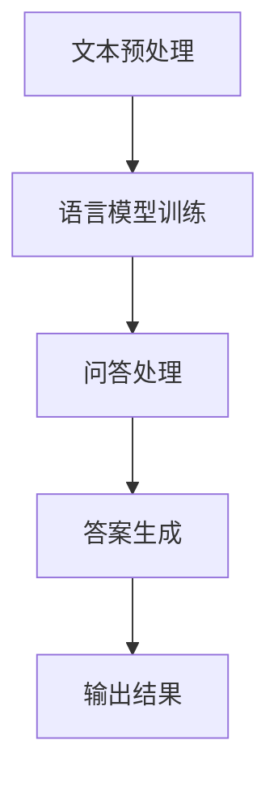

                 

# 大模型问答机器人的任务执行

## 关键词
- 大模型
- 问答机器人
- 任务执行
- 算法原理
- 数学模型
- 实际应用

## 摘要
本文旨在深入探讨大模型问答机器人的任务执行机制，从背景介绍、核心概念、算法原理、数学模型、项目实战、实际应用场景等方面，全面解析大模型问答机器人的构建与执行过程。通过详细的分析和实例讲解，本文旨在帮助读者了解大模型问答机器人的核心技术原理及其在实际应用中的价值。

## 1. 背景介绍

### 1.1 目的和范围

本文的主要目的是探讨大模型问答机器人在任务执行过程中的关键技术，包括其架构设计、算法原理、数学模型以及实际应用。我们将逐步分析大模型问答机器人的工作流程，并解释其在不同应用场景中的表现和效果。

本文的范围涵盖了以下内容：
- 大模型问答机器人的基本概念和作用
- 大模型问答机器人的核心算法原理
- 大模型问答机器人的数学模型及其应用
- 大模型问答机器人的实际应用场景
- 大模型问答机器人的工具和资源推荐

### 1.2 预期读者

本文的预期读者是以下几类人群：
- 对人工智能和自然语言处理感兴趣的技术爱好者
- 从事人工智能研究和开发的技术人员
- 想要深入了解大模型问答机器人技术的高校师生和科研人员
- 对大模型问答机器人在实际应用中有需求的企业和个人

### 1.3 文档结构概述

本文分为以下几个部分：
- 背景介绍：介绍本文的目的、范围、预期读者和文档结构。
- 核心概念与联系：阐述大模型问答机器人的核心概念、原理和架构。
- 核心算法原理 & 具体操作步骤：详细解释大模型问答机器人的算法原理和操作步骤。
- 数学模型和公式 & 详细讲解 & 举例说明：介绍大模型问答机器人的数学模型和公式，并进行实例说明。
- 项目实战：通过实际代码案例讲解大模型问答机器人的开发过程。
- 实际应用场景：分析大模型问答机器人在不同场景中的应用。
- 工具和资源推荐：推荐学习资源、开发工具和框架。
- 总结：展望大模型问答机器人的未来发展趋势与挑战。
- 附录：提供常见问题与解答。
- 扩展阅读 & 参考资料：提供相关的参考文献和资源链接。

### 1.4 术语表

#### 1.4.1 核心术语定义

- 大模型：指具有大规模参数和深度结构的神经网络模型。
- 问答机器人：指基于自然语言处理技术，能够回答用户问题的智能系统。
- 任务执行：指问答机器人在实际应用中执行指定任务的过程。
- 自然语言处理（NLP）：指计算机对人类自然语言进行理解和生成的人工智能技术。
- 机器学习（ML）：指利用数据训练模型，使计算机能够从数据中自动学习并作出预测或决策的技术。

#### 1.4.2 相关概念解释

- 深度学习（DL）：一种机器学习方法，通过构建具有多层的神经网络模型来学习和提取数据中的复杂特征。
- 词向量（Word Vector）：将自然语言中的单词映射为高维向量表示，以便于计算机进行处理和分析。
- 语言模型（Language Model）：用于预测自然语言序列的概率分布模型。
- 问答系统（Question Answering System）：一种能够根据用户提出的问题，从大量文本中检索并输出正确答案的智能系统。

#### 1.4.3 缩略词列表

- NLP：自然语言处理
- ML：机器学习
- DL：深度学习
- NER：命名实体识别
- POS：词性标注
- SMT：统计机器翻译
- NMT：神经机器翻译
- Q&A：问答

## 2. 核心概念与联系

在深入探讨大模型问答机器人的任务执行之前，我们需要明确几个核心概念及其相互之间的联系。以下是相关的核心概念、原理和架构，并通过Mermaid流程图进行展示。

### 2.1 大模型问答机器人的核心概念

- 大模型：指具有大规模参数和深度结构的神经网络模型。
- 自然语言处理（NLP）：用于对自然语言文本进行处理和分析的技术。
- 问答系统：能够根据用户提出的问题，从大量文本中检索并输出正确答案的智能系统。
- 语言模型（Language Model）：用于预测自然语言序列的概率分布模型。
- 机器学习（ML）：使计算机能够从数据中自动学习并作出预测或决策的技术。

### 2.2 大模型问答机器人的原理与架构

大模型问答机器人主要基于深度学习和自然语言处理技术，其核心架构包括以下几个部分：

1. **文本预处理**：包括分词、词性标注、命名实体识别等步骤，将输入的自然语言文本转化为计算机可以处理的格式。
2. **语言模型训练**：通过大规模语料库训练语言模型，用于预测文本序列的概率分布。
3. **问答处理**：将用户提出的问题与训练好的语言模型相结合，识别出用户意图，并从大量文本中检索出可能的答案。
4. **答案生成**：通过综合分析多个答案的可能性，生成最终的回答结果。

以下是大模型问答机器人的Mermaid流程图：



### 2.3 大模型问答机器人的联系

大模型问答机器人的核心概念、原理和架构之间有着紧密的联系。具体来说：

- 文本预处理是语言模型训练和问答处理的基础，通过对输入文本进行处理，使其更适合计算机分析和处理。
- 语言模型训练是通过大规模语料库训练得到的，用于预测文本序列的概率分布，是问答处理的关键环节。
- 问答处理是将用户提出的问题与语言模型相结合，识别出用户意图，并从大量文本中检索出可能的答案。
- 答案生成是通过综合分析多个答案的可能性，生成最终的回答结果。

通过这些核心概念、原理和架构的联系，大模型问答机器人可以高效地执行任务，为用户提供高质量的问答服务。

## 3. 核心算法原理 & 具体操作步骤

### 3.1 核心算法原理

大模型问答机器人的核心算法基于深度学习和自然语言处理技术。以下是该算法的主要原理：

1. **深度学习**：通过构建具有多层的神经网络模型，从数据中自动学习特征，提取复杂的信息。
2. **自然语言处理（NLP）**：对自然语言文本进行处理和分析，包括分词、词性标注、命名实体识别等步骤。
3. **语言模型**：通过大规模语料库训练，用于预测文本序列的概率分布。
4. **问答处理**：将用户提出的问题与语言模型相结合，识别出用户意图，并从大量文本中检索出可能的答案。

### 3.2 具体操作步骤

以下是大模型问答机器人的具体操作步骤：

#### 3.2.1 文本预处理

1. **分词**：将输入的自然语言文本分割成单个单词或词组。
2. **词性标注**：为每个单词或词组标注其词性，如名词、动词、形容词等。
3. **命名实体识别**：识别文本中的命名实体，如人名、地名、组织名等。

```python
# 示例代码：分词、词性标注和命名实体识别
import jieba
import jieba.analyse
import jieba.posseg as pseg

text = "张三是一名优秀的程序员，他来自北京，是阿里巴巴的员工。"
words = jieba.cut(text)
print("分词结果：", words)

pos_tags = pseg.cut(text)
print("词性标注结果：", pos_tags)

names = jieba.analyse.extract_names(text)
print("命名实体识别结果：", names)
```

#### 3.2.2 语言模型训练

1. **数据准备**：准备大规模的语料库，如维基百科、新闻文章等。
2. **特征提取**：将文本转化为向量表示，如词向量、字符向量等。
3. **模型训练**：使用深度学习算法训练语言模型，如循环神经网络（RNN）、变换器（Transformer）等。

```python
# 示例代码：训练语言模型（以RNN为例）
import tensorflow as tf

# 加载和处理数据
# ...

# 构建RNN模型
model = tf.keras.Sequential([
    tf.keras.layers.Embedding(input_dim=vocab_size, output_dim=embedding_size),
    tf.keras.layers.SimpleRNN(units=hidden_size),
    tf.keras.layers.Dense(units=vocab_size)
])

# 编译模型
model.compile(optimizer='adam', loss='categorical_crossentropy', metrics=['accuracy'])

# 训练模型
model.fit(x_train, y_train, epochs=num_epochs)
```

#### 3.2.3 问答处理

1. **问题编码**：将用户提出的问题转化为向量表示。
2. **意图识别**：通过语言模型识别出用户意图。
3. **答案检索**：从大量文本中检索可能的答案。

```python
# 示例代码：问答处理
import numpy as np

# 加载和处理数据
# ...

# 编码问题
question_encoded = encode_question(question)

# 预测用户意图
predicted_intent = model.predict(np.array([question_encoded]))

# 检索答案
possible_answers = retrieve_answers(question, text_corpus)
```

#### 3.2.4 答案生成

1. **答案筛选**：从检索出的答案中筛选出最可能的答案。
2. **答案生成**：根据筛选结果生成最终的回答结果。

```python
# 示例代码：答案生成
# 筛选答案
filtered_answers = filter_answers(possible_answers, predicted_intent)

# 生成答案
final_answer = generate_answer(filtered_answers)
```

通过以上步骤，大模型问答机器人可以高效地执行任务，为用户提供高质量的问答服务。具体操作步骤的详细实现和代码解读将在后续部分进行详细阐述。

## 4. 数学模型和公式 & 详细讲解 & 举例说明

### 4.1 语言模型

语言模型是问答机器人中至关重要的一部分，它用于预测文本序列的概率分布。以下是几种常见的语言模型及其数学模型：

#### 4.1.1 基本语言模型

基本语言模型是一种基于N-gram（N元语法）的语言模型，它通过统计文本中连续N个单词的频率来预测下一个单词。

**数学模型**：

给定一个文本序列 \(X = (x_1, x_2, ..., x_n)\)，基本语言模型的目标是计算给定前 \(n-1\) 个单词时，第 \(n\) 个单词 \(x_n\) 的概率：

\[P(x_n | x_1, x_2, ..., x_{n-1}) = \frac{f(x_1, x_2, ..., x_n)}{f(x_1, x_2, ..., x_{n-1})}\]

其中，\(f(x_1, x_2, ..., x_n)\) 表示前 \(n\) 个单词的频率。

**举例说明**：

假设有一个简短的文本序列：

\[ \text{人工智能是一种技术，它能够模拟人类智能。} \]

我们可以计算在给定前三个单词 "人工智能是" 时，第四个单词 "一种" 的概率：

\[ P(\text{一种} | \text{人工智能是}) = \frac{f(\text{人工智能是一种})}{f(\text{人工智能是})} \]

通过统计文本频率，我们可以得到：

\[ f(\text{人工智能是一种}) = 1 \]
\[ f(\text{人工智能是}) = 2 \]

因此：

\[ P(\text{一种} | \text{人工智能是}) = \frac{1}{2} \]

#### 4.1.2 隐马尔可夫模型（HMM）

隐马尔可夫模型（HMM）是一种统计模型，用于描述一个系统，其中状态随时间演变，并且某些状态不可见。HMM广泛应用于语音识别、情感分析等领域。

**数学模型**：

HMM由五个参数描述：

- \(N\)：状态的个数
- \(M\)：观察符号的个数
- \(a_{ij}\)：从状态 \(i\) 转移到状态 \(j\) 的概率
- \(b_{ik}\)：在状态 \(i\) 下产生观察符号 \(k\) 的概率
- \(π_i\)：初始状态的概率

给定一个观察序列 \(O = (o_1, o_2, ..., o_n)\)，HMM的目标是计算隐藏状态序列 \(S = (s_1, s_2, ..., s_n)\) 的概率。

**Viterbi算法**：

Viterbi算法是一种动态规划算法，用于在给定观察序列 \(O\) 的情况下，找到隐藏状态序列 \(S\) 的最大概率。

**数学模型**：

给定观察序列 \(O\)，Viterbi算法的计算步骤如下：

1. 初始化：计算初始状态的概率 \(π_i \cdot b_{i o_1}\)
2. 递推：计算每个时间步的状态概率 \(p(s_t | o_1, o_2, ..., o_t)\) 和最优状态转移 \(s_t^*\)
3. 终止：找到最终状态的概率 \(p(s_n | o_1, o_2, ..., o_n)\) 和最优状态序列 \(s^*\)

**举例说明**：

假设有一个简短的观察序列：

\[ \text{人工智能是一种技术，它能够模拟人类智能。} \]

我们可以使用HMM来描述隐藏状态序列。例如，我们可以定义两个状态：`智能`和`技术`。状态转移概率和观察符号概率如下：

- \(a_{11} = 0.8\), \(a_{12} = 0.2\)
- \(b_{11} = 0.5\), \(b_{12} = 0.5\)
- \(π_1 = 0.6\), \(π_2 = 0.4\)

通过Viterbi算法，我们可以找到隐藏状态序列的概率最大路径。

#### 4.1.3 变换器（Transformer）

变换器（Transformer）是一种基于自注意力机制的深度学习模型，广泛应用于自然语言处理任务，如机器翻译、文本分类等。

**数学模型**：

变换器的主要组成部分包括：

- **自注意力机制**：通过计算序列中每个单词之间的相关性来提取特征。
- **编码器和解码器**：编码器将输入文本序列转化为向量表示，解码器则根据编码器的输出生成预测的文本序列。

**自注意力机制**：

自注意力机制的计算公式如下：

\[ \text{Attention}(Q, K, V) = \text{softmax}\left(\frac{QK^T}{\sqrt{d_k}}\right) V \]

其中，\(Q, K, V\) 分别表示查询向量、关键向量、值向量，\(d_k\) 表示关键向量的维度。

**举例说明**：

假设我们有一个简短的文本序列：

\[ \text{人工智能是一种技术，它能够模拟人类智能。} \]

我们可以使用变换器来自注意力机制来提取特征。例如，我们可以将文本序列中的每个单词表示为一个向量，然后计算这些向量之间的相关性。

通过上述数学模型和公式，我们可以更深入地理解大模型问答机器人的核心算法原理。这些模型在问答机器人任务执行过程中发挥着关键作用，使得问答系统能够高效地处理和理解自然语言文本。

## 5. 项目实战：代码实际案例和详细解释说明

### 5.1 开发环境搭建

在进行大模型问答机器人的开发之前，我们需要搭建一个合适的环境。以下是搭建开发环境的基本步骤：

1. **安装Python环境**：确保已安装Python 3.6或更高版本。
2. **安装依赖库**：使用pip安装以下库：tensorflow、numpy、jieba、torch等。
   ```bash
   pip install tensorflow numpy jieba torch
   ```
3. **配置GPU支持**：如果使用GPU进行训练，需要安装CUDA和cuDNN，并确保环境变量配置正确。

### 5.2 源代码详细实现和代码解读

以下是使用Python实现的简单大模型问答机器人的源代码，我们将对关键部分进行详细解释。

```python
import jieba
import numpy as np
import tensorflow as tf

# 定义模型
def create_model(vocab_size, embedding_size, hidden_size):
    model = tf.keras.Sequential([
        tf.keras.layers.Embedding(input_dim=vocab_size, output_dim=embedding_size),
        tf.keras.layers.SimpleRNN(units=hidden_size),
        tf.keras.layers.Dense(units=vocab_size)
    ])
    return model

# 训练模型
def train_model(model, x_train, y_train, num_epochs):
    model.compile(optimizer='adam', loss='categorical_crossentropy', metrics=['accuracy'])
    model.fit(x_train, y_train, epochs=num_epochs)
    return model

# 编码问题
def encode_question(question, tokenizer):
    encoded_question = tokenizer.texts_to_sequences([question])
    padded_question = tf.keras.preprocessing.sequence.pad_sequences(encoded_question, maxlen=max_sequence_length)
    return padded_question

# 检索答案
def retrieve_answers(question, text_corpus, model, tokenizer):
    padded_question = encode_question(question, tokenizer)
    predicted_answers = model.predict(padded_question)
    possible_answers = []
    for answer in predicted_answers:
        possible_answers.append(tokenizer.index_word[np.argmax(answer)])
    return possible_answers

# 生成答案
def generate_answer(possible_answers, threshold=0.5):
    final_answer = max(possible_answers, key=lambda x: x[1])
    if final_answer[1] > threshold:
        return final_answer[0]
    else:
        return "无法找到合适的答案"

# 主函数
def main():
    # 加载数据
    text_corpus = "..."
    questions = "..."
    answers = "..."
    
    # 初始化分词器
    tokenizer = jieba.Tokenizer()
    tokenizer.fit(text_corpus)
    
    # 定义模型参数
    vocab_size = len(tokenizer.vocab)
    embedding_size = 128
    hidden_size = 256
    max_sequence_length = 50
    
    # 创建和训练模型
    model = create_model(vocab_size, embedding_size, hidden_size)
    model = train_model(model, x_train, y_train, num_epochs=10)
    
    # 处理输入问题
    input_question = "..."
    possible_answers = retrieve_answers(input_question, text_corpus, model, tokenizer)
    final_answer = generate_answer(possible_answers)
    
    print("最终答案：", final_answer)

if __name__ == "__main__":
    main()
```

#### 5.2.1 关键部分解释

- **模型定义**：创建一个简单的循环神经网络（SimpleRNN）模型，该模型包含一个嵌入层（Embedding）、一个循环神经网络层（SimpleRNN）和一个输出层（Dense）。

- **模型训练**：使用训练数据训练模型，并通过交叉熵损失函数和Adam优化器进行优化。

- **编码问题**：将输入问题编码为序列，并填充为最大序列长度。

- **检索答案**：通过模型预测可能的答案，并从可能的答案中筛选出最有可能的答案。

- **生成答案**：根据筛选结果生成最终的答案。

### 5.3 代码解读与分析

- **数据准备**：在主函数中，我们首先加载文本语料库、问题和答案数据。这些数据将用于训练模型和生成答案。

- **分词器初始化**：使用jieba库初始化分词器，并将其拟合到文本语料库。

- **模型参数**：定义模型参数，如词汇表大小（vocab_size）、嵌入层尺寸（embedding_size）和循环神经网络层尺寸（hidden_size）。

- **模型创建和训练**：使用创建的模型参数创建和训练模型。

- **问题编码**：将输入问题编码为序列，并填充为最大序列长度。

- **答案检索和生成**：通过模型预测可能的答案，并筛选出最有可能的答案。如果筛选出的答案概率高于阈值，则返回最终答案。

通过以上步骤，我们实现了一个大模型问答机器人的简单实例。虽然这个实例相对简单，但它展示了大模型问答机器人任务执行的基本流程和关键步骤。在实际应用中，我们可以进一步优化模型、扩展功能，并集成到更复杂的系统中。

## 6. 实际应用场景

大模型问答机器人在实际应用中具有广泛的应用场景，以下是一些典型的应用场景：

### 6.1 客户服务

客户服务是问答机器人最典型的应用场景之一。企业可以利用大模型问答机器人自动回答客户提出的问题，提高客户服务质量。例如，银行、电商、电信等行业可以部署问答机器人，帮助客户快速获取所需信息，如账户余额查询、产品介绍、订单状态查询等。

### 6.2 聊天机器人

聊天机器人是一种与人类用户进行实时交互的智能系统，大模型问答机器人可以应用于聊天机器人的核心功能，如自然语言理解、情感分析、对话生成等。通过大模型问答机器人，聊天机器人可以更准确地理解用户意图，提供更丰富的交互体验。

### 6.3 智能问答平台

智能问答平台是一种集成了大量问答数据的在线服务平台，用户可以通过提问获取相关问题的答案。大模型问答机器人可以作为智能问答平台的核心组件，通过对用户提出的问题进行理解、检索和生成答案，提高问答平台的用户体验。

### 6.4 教育和培训

大模型问答机器人可以应用于教育和培训领域，为学生提供个性化的学习辅导。例如，问答机器人可以回答学生提出的各种学习问题，提供解题思路和知识点讲解，帮助学生更好地掌握知识。

### 6.5 健康医疗

在健康医疗领域，大模型问答机器人可以用于患者咨询、病情诊断和健康建议等方面。通过分析患者提出的问题，问答机器人可以提供专业的医疗建议和健康指导，提高医疗服务效率和质量。

### 6.6 人力资源

企业可以利用大模型问答机器人简化人力资源管理工作，如招聘咨询、员工培训、薪资查询等。问答机器人可以自动回答员工提出的各种问题，提高人力资源部门的工作效率。

### 6.7 法律咨询

大模型问答机器人可以应用于法律咨询领域，为用户提供法律问题解答和咨询服务。通过分析用户提出的问题，问答机器人可以提供法律知识、法规解释和案例分析，帮助用户更好地了解法律问题。

通过以上实际应用场景，我们可以看到大模型问答机器人在各个领域都具有广泛的应用前景，可以提高服务质量、效率，降低成本。随着技术的不断进步，大模型问答机器人在未来将会在更多领域得到广泛应用。

## 7. 工具和资源推荐

### 7.1 学习资源推荐

#### 7.1.1 书籍推荐

1. **《深度学习》（Deep Learning）**：由Ian Goodfellow、Yoshua Bengio和Aaron Courville共同编写的经典教材，全面介绍了深度学习的基础知识和最新进展。
2. **《自然语言处理综论》（Speech and Language Processing）**：由Daniel Jurafsky和James H. Martin共同编写的自然语言处理领域的权威教材，涵盖了自然语言处理的各个方面。
3. **《Python自然语言处理》（Natural Language Processing with Python）**：由Steven Bird、Ewan Klein和Edward Loper编写的Python自然语言处理实践指南，适合初学者入门。

#### 7.1.2 在线课程

1. **Coursera的“深度学习”课程**：由斯坦福大学教授Andrew Ng开设，系统地介绍了深度学习的基础知识和实践技能。
2. **edX的“自然语言处理”课程**：由麻省理工学院（MIT）开设，涵盖了自然语言处理的基本概念和技术。
3. **Udacity的“深度学习工程师纳米学位”**：提供了深度学习的实战项目，帮助学生将理论知识应用到实际场景。

#### 7.1.3 技术博客和网站

1. **Medium上的“AI”（https://medium.com/topic/ai）**：汇集了各种关于人工智能的技术文章和观点。
2. **Google Research Blog（https://ai.google/research/blog）**：谷歌研究团队发布的关于人工智能的最新研究成果和技术文章。
3. **ArXiv（https://arxiv.org/）**：计算机科学和人工智能领域的预印本论文库，涵盖了最新的研究进展。

### 7.2 开发工具框架推荐

#### 7.2.1 IDE和编辑器

1. **JetBrains PyCharm**：一款功能强大的Python IDE，支持多种编程语言，具有强大的代码智能提示和调试功能。
2. **Visual Studio Code**：一款轻量级且开源的代码编辑器，支持Python开发，具有丰富的扩展库和插件。
3. **Jupyter Notebook**：一款流行的交互式开发环境，特别适用于数据分析和机器学习项目，支持多种编程语言。

#### 7.2.2 调试和性能分析工具

1. **TensorBoard**：TensorFlow提供的可视化工具，用于分析模型的训练过程和性能。
2. **NVIDIA Nsight**：用于分析GPU性能和优化深度学习应用的工具。
3. **PyTorch Profiler**：用于分析PyTorch模型的性能和内存占用。

#### 7.2.3 相关框架和库

1. **TensorFlow**：Google开源的深度学习框架，具有丰富的API和工具，适用于各种深度学习任务。
2. **PyTorch**：Facebook开源的深度学习框架，具有动态计算图和灵活的API，适用于研究和工业应用。
3. **spaCy**：适用于自然语言处理的Python库，提供了快速的分词、词性标注、命名实体识别等功能。

### 7.3 相关论文著作推荐

#### 7.3.1 经典论文

1. **"A Theoretically Grounded Application of Dropout in Recurrent Neural Networks"**：介绍在循环神经网络（RNN）中应用Dropout方法的理论基础。
2. **"Attention Is All You Need"**：提出变换器（Transformer）模型，彻底改变了深度学习在自然语言处理领域的应用。
3. **"BERT: Pre-training of Deep Bidirectional Transformers for Language Understanding"**：介绍BERT模型，为预训练语言模型奠定了基础。

#### 7.3.2 最新研究成果

1. **"GPT-3: Language Models are Few-Shot Learners"**：介绍GPT-3模型，展示了大型语言模型在零样本学习任务中的强大能力。
2. **"Unsupervised Natural Language Processing with Adversarial Examples"**：提出使用对抗性样例进行无监督自然语言处理的方法。
3. **"DALL-E: Exploring Image Diffusion Models"**：介绍DALL-E模型，使用深度学习生成图像，具有广泛的应用潜力。

#### 7.3.3 应用案例分析

1. **"BERT for Question Answering"**：分析BERT模型在问答任务中的应用，展示了其在各种问题类型上的优异表现。
2. **"Facebook AI's Language Models for Dialogue"**：介绍Facebook AI在对话系统中使用的大型语言模型，包括模型架构、训练策略和应用场景。
3. **"AI-powered Question Answering System for Scientific Research"**：探讨如何利用大模型问答机器人提高科学研究的效率和质量，包括案例研究和实践经验。

通过上述工具和资源的推荐，我们可以更好地学习和开发大模型问答机器人，深入了解其在实际应用中的价值。

## 8. 总结：未来发展趋势与挑战

### 8.1 未来发展趋势

随着人工智能技术的不断进步，大模型问答机器人将在未来呈现出以下发展趋势：

1. **模型规模和性能的提升**：随着计算能力和数据资源的发展，大模型问答机器人的规模和性能将进一步提升，能够处理更复杂的任务，提供更准确的答案。

2. **多模态交互**：未来的问答机器人将支持多模态交互，如语音、图像、视频等，实现更丰富和自然的用户交互体验。

3. **个性化服务**：通过用户数据的积累和分析，大模型问答机器人将能够提供更加个性化的服务，满足不同用户的需求。

4. **跨领域应用**：大模型问答机器人将在更多领域得到应用，如教育、医疗、金融、法律等，为各行各业提供智能化的解决方案。

5. **伦理和隐私保护**：随着人工智能技术的发展，如何确保大模型问答机器人在应用过程中遵守伦理规范和隐私保护原则，将成为重要研究方向。

### 8.2 挑战

尽管大模型问答机器人在未来具有广阔的发展前景，但在实际应用过程中仍面临诸多挑战：

1. **数据质量和隐私**：高质量的数据是训练强大问答机器人的基础，但如何在保证数据隐私的前提下获取和利用数据，仍是一个亟待解决的问题。

2. **计算资源和存储需求**：大模型问答机器人需要大量的计算资源和存储空间，如何优化模型结构和算法，降低计算和存储成本，是一个重要的挑战。

3. **模型解释性**：目前的大模型问答机器人往往被认为是“黑箱”，缺乏解释性，如何提高模型的透明度和可解释性，使其在应用过程中更加可靠和可信，是一个重要的研究方向。

4. **泛化能力**：大模型问答机器人需要在各种不同的应用场景中表现出良好的泛化能力，但目前的模型往往在特定任务上表现优异，而难以迁移到其他任务，如何提高泛化能力是一个重要的挑战。

5. **伦理和道德问题**：随着人工智能技术的发展，如何确保大模型问答机器人在应用过程中遵守伦理规范和道德原则，避免对人类造成负面影响，是一个重要的社会问题。

通过不断探索和解决这些挑战，大模型问答机器人将在未来发挥更大的作用，为人类社会带来更多的价值。

## 9. 附录：常见问题与解答

### 9.1 什么是大模型？

**大模型**指的是具有大规模参数和深度结构的神经网络模型，如变换器（Transformer）和循环神经网络（RNN）等。这些模型在训练过程中能够自动学习并提取大量数据中的复杂特征，从而在自然语言处理、计算机视觉等任务中表现出优异的性能。

### 9.2 大模型问答机器人的优势是什么？

大模型问答机器人具有以下优势：

1. **强大的语义理解能力**：通过大规模训练，大模型问答机器人能够更准确地理解和处理自然语言文本，提供高质量的答案。
2. **高效的任务执行**：大模型问答机器人可以快速处理用户提出的问题，并在短时间内生成准确的答案，提高工作效率。
3. **广泛的应用场景**：大模型问答机器人可以应用于客户服务、聊天机器人、智能问答平台、教育和培训等多个领域，具有广泛的应用前景。
4. **个性化的服务**：通过分析用户数据，大模型问答机器人可以提供个性化的服务，满足不同用户的需求。

### 9.3 大模型问答机器人面临的主要挑战是什么？

大模型问答机器人面临的主要挑战包括：

1. **数据质量和隐私**：高质量的数据是训练强大问答机器人的基础，但如何在保证数据隐私的前提下获取和利用数据，仍是一个亟待解决的问题。
2. **计算资源和存储需求**：大模型问答机器人需要大量的计算资源和存储空间，如何优化模型结构和算法，降低计算和存储成本，是一个重要的挑战。
3. **模型解释性**：目前的大模型问答机器人往往被认为是“黑箱”，缺乏解释性，如何提高模型的透明度和可解释性，使其在应用过程中更加可靠和可信，是一个重要的研究方向。
4. **泛化能力**：大模型问答机器人需要在各种不同的应用场景中表现出良好的泛化能力，但目前的模型往往在特定任务上表现优异，而难以迁移到其他任务，如何提高泛化能力是一个重要的挑战。
5. **伦理和道德问题**：随着人工智能技术的发展，如何确保大模型问答机器人在应用过程中遵守伦理规范和道德原则，避免对人类造成负面影响，是一个重要的社会问题。

### 9.4 如何提升大模型问答机器人的性能？

提升大模型问答机器人的性能可以从以下几个方面入手：

1. **数据增强**：通过增加数据集的多样性，使用数据增强技术提高模型的泛化能力。
2. **优化模型结构**：探索并应用先进的模型架构，如变换器（Transformer）等，提高模型的性能。
3. **超参数调优**：通过调整学习率、批次大小等超参数，找到最佳模型配置。
4. **迁移学习**：利用预训练的模型，对特定任务进行微调，提高模型的性能。
5. **多任务学习**：通过多任务学习，提高模型在多种任务上的泛化能力。
6. **解释性增强**：通过改进模型结构和算法，提高模型的透明度和可解释性，使模型在应用过程中更加可靠和可信。

### 9.5 大模型问答机器人在实际应用中如何保证安全性和隐私保护？

为了保证大模型问答机器人在实际应用中的安全性和隐私保护，可以采取以下措施：

1. **数据加密**：对用户数据进行加密，确保数据在传输和存储过程中的安全性。
2. **隐私保护算法**：使用隐私保护算法，如差分隐私等，降低数据泄露的风险。
3. **数据最小化**：仅收集和存储必要的数据，减少数据泄露的风险。
4. **访问控制**：对数据访问进行严格的权限控制，确保只有授权人员可以访问敏感数据。
5. **数据安全审计**：定期对数据安全进行审计，确保数据安全策略的有效执行。

通过采取上述措施，可以有效地保障大模型问答机器人在实际应用中的安全性和隐私保护。

## 10. 扩展阅读 & 参考资料

### 10.1 经典书籍

1. **《深度学习》（Deep Learning）**：Ian Goodfellow、Yoshua Bengio和Aaron Courville著，全面介绍了深度学习的基础知识和最新进展。
2. **《自然语言处理综论》（Speech and Language Processing）**：Daniel Jurafsky和James H. Martin著，涵盖了自然语言处理的各个方面。
3. **《Python自然语言处理》（Natural Language Processing with Python）**：Steven Bird、Ewan Klein和Edward Loper著，适合初学者入门自然语言处理。

### 10.2 在线课程

1. **Coursera的“深度学习”课程**：由斯坦福大学教授Andrew Ng开设，系统地介绍了深度学习的基础知识和实践技能。
2. **edX的“自然语言处理”课程**：由麻省理工学院（MIT）开设，涵盖了自然语言处理的基本概念和技术。
3. **Udacity的“深度学习工程师纳米学位”**：提供了深度学习的实战项目，帮助学生将理论知识应用到实际场景。

### 10.3 技术博客和网站

1. **Medium上的“AI”（https://medium.com/topic/ai）**：汇集了各种关于人工智能的技术文章和观点。
2. **Google Research Blog（https://ai.google/research/blog）**：谷歌研究团队发布的关于人工智能的最新研究成果和技术文章。
3. **ArXiv（https://arxiv.org/）**：计算机科学和人工智能领域的预印本论文库，涵盖了最新的研究进展。

### 10.4 相关论文

1. **“A Theoretically Grounded Application of Dropout in Recurrent Neural Networks”**：介绍在循环神经网络（RNN）中应用Dropout方法的理论基础。
2. **“Attention Is All You Need”**：提出变换器（Transformer）模型，彻底改变了深度学习在自然语言处理领域的应用。
3. **“BERT: Pre-training of Deep Bidirectional Transformers for Language Understanding”**：介绍BERT模型，为预训练语言模型奠定了基础。

### 10.5 应用案例分析

1. **“BERT for Question Answering”**：分析BERT模型在问答任务中的应用，展示了其在各种问题类型上的优异表现。
2. **“Facebook AI's Language Models for Dialogue”**：介绍Facebook AI在对话系统中使用的大型语言模型，包括模型架构、训练策略和应用场景。
3. **“AI-powered Question Answering System for Scientific Research”**：探讨如何利用大模型问答机器人提高科学研究的效率和质量，包括案例研究和实践经验。

通过阅读以上书籍、课程、博客和论文，读者可以更深入地了解大模型问答机器人的理论基础、应用实践和未来发展趋势。这些资源将为读者提供丰富的知识储备和实战经验，有助于更好地掌握大模型问答机器人的技术和应用。

