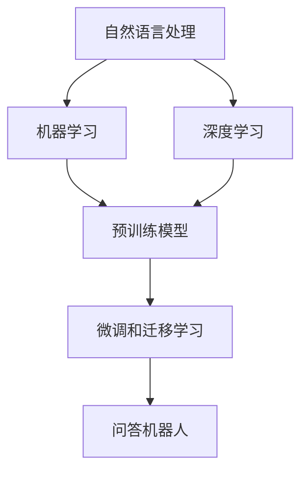
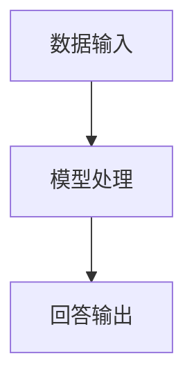

                 

# 大模型问答机器人的智能化水平

> **关键词：** 大模型、问答机器人、智能化、机器学习、自然语言处理、深度学习、算法原理、应用场景。

> **摘要：** 本文将深入探讨大模型问答机器人的智能化水平，从核心概念、算法原理、数学模型、项目实战、应用场景等方面展开，旨在为读者提供一个全面、系统的理解，并展望未来发展趋势与挑战。

## 1. 背景介绍

### 1.1 目的和范围

本文旨在探讨大模型问答机器人的智能化水平，具体包括以下几个方面：

1. **核心概念与联系**：介绍大模型问答机器人的基础概念，如自然语言处理、机器学习、深度学习等，并通过Mermaid流程图展示其原理和架构。
2. **核心算法原理与操作步骤**：详细讲解大模型问答机器人的核心算法原理，包括预训练模型、微调、多模态学习等，并使用伪代码进行阐述。
3. **数学模型与公式**：阐述大模型问答机器人中涉及的数学模型和公式，如神经网络、优化算法等，并通过实例进行说明。
4. **项目实战**：通过实际案例，展示大模型问答机器人的应用场景，并提供代码实现和详细解释。
5. **未来发展趋势与挑战**：分析大模型问答机器人的未来发展趋势和面临的挑战，为读者提供有价值的思考。

### 1.2 预期读者

本文适用于对人工智能、自然语言处理、机器学习有一定了解的读者，包括：

1. **AI研究者**：希望了解大模型问答机器人的最新技术和发展趋势。
2. **程序员**：希望学习如何使用大模型问答机器人进行实际项目开发。
3. **产品经理**：希望了解大模型问答机器人在实际应用中的优势和挑战。
4. **对人工智能感兴趣的普通读者**：希望了解人工智能技术在问答机器人领域的应用。

### 1.3 文档结构概述

本文分为十个部分，具体结构如下：

1. **背景介绍**：介绍本文的目的、范围、预期读者和文档结构。
2. **核心概念与联系**：介绍大模型问答机器人的核心概念、原理和架构。
3. **核心算法原理与操作步骤**：讲解大模型问答机器人的核心算法原理和操作步骤。
4. **数学模型与公式**：阐述大模型问答机器人中涉及的数学模型和公式。
5. **项目实战**：通过实际案例展示大模型问答机器人的应用场景。
6. **未来发展趋势与挑战**：分析大模型问答机器人的未来发展趋势和挑战。
7. **工具和资源推荐**：推荐相关学习资源、开发工具和框架。
8. **总结**：总结本文的核心内容和主要观点。
9. **附录：常见问题与解答**：回答读者可能关心的问题。
10. **扩展阅读与参考资料**：提供更多相关文献和资源。

### 1.4 术语表

#### 1.4.1 核心术语定义

- **大模型**：指具有大规模参数和复杂结构的深度学习模型，如GPT、BERT等。
- **问答机器人**：基于人工智能技术，能够自动回答用户问题的智能系统。
- **自然语言处理**：研究如何让计算机理解和处理自然语言的技术。
- **机器学习**：一种基于数据训练模型，使计算机能够从数据中学习并获得智能的技术。
- **深度学习**：一种基于多层神经网络进行特征提取和模式识别的人工智能技术。

#### 1.4.2 相关概念解释

- **预训练模型**：在大规模语料库上进行预训练，使其具备一定语言理解和生成能力。
- **微调**：在预训练模型的基础上，针对特定任务进行微调，以适应特定场景。
- **多模态学习**：同时处理文本、图像、音频等多种类型数据的机器学习技术。

#### 1.4.3 缩略词列表

- **NLP**：自然语言处理
- **ML**：机器学习
- **DL**：深度学习
- **GPT**：生成预训练变换模型
- **BERT**：双向编码表示预训练模型

## 2. 核心概念与联系

在探讨大模型问答机器人的智能化水平之前，首先需要了解其核心概念和原理。本节将介绍大模型问答机器人的核心概念，并通过Mermaid流程图展示其原理和架构。

### 2.1 自然语言处理（NLP）

自然语言处理是人工智能的一个重要分支，旨在使计算机能够理解和处理自然语言。NLP的核心任务是：

1. **文本预处理**：对原始文本进行清洗、分词、词性标注等操作，使其符合计算机处理的要求。
2. **语义理解**：理解文本中的词汇、句子结构和语义关系，以实现文本的语义解析和生成。

自然语言处理的主要方法包括：

1. **基于规则的方法**：通过手工编写规则，对文本进行解析和生成。
2. **基于统计的方法**：通过统计文本中的词汇和句子模式，进行语义分析。
3. **基于深度学习的方法**：通过多层神经网络进行特征提取和语义理解。

### 2.2 机器学习（ML）

机器学习是一种使计算机从数据中学习并获得智能的技术。在大模型问答机器人中，机器学习主要用于：

1. **模型训练**：在大规模语料库上进行预训练，使其具备语言理解和生成能力。
2. **模型优化**：通过优化算法，提高模型的性能和泛化能力。

机器学习的主要方法包括：

1. **监督学习**：通过标记数据进行训练，使模型能够预测新的数据。
2. **无监督学习**：通过未标记的数据进行训练，发现数据中的潜在结构和规律。
3. **半监督学习和强化学习**：介于监督学习和无监督学习之间，通过少量标记数据和大量未标记数据进行训练。

### 2.3 深度学习（DL）

深度学习是一种基于多层神经网络进行特征提取和模式识别的人工智能技术。在大模型问答机器人中，深度学习主要用于：

1. **预训练模型**：在大规模语料库上进行预训练，使其具备语言理解和生成能力。
2. **微调和迁移学习**：在预训练模型的基础上，针对特定任务进行微调和迁移，以适应特定场景。

深度学习的主要方法包括：

1. **卷积神经网络（CNN）**：通过卷积操作提取文本和图像的特征。
2. **循环神经网络（RNN）**：通过循环结构处理序列数据，如文本和语音。
3. **变换器网络（Transformer）**：通过自注意力机制进行特征提取和模式识别。

### 2.4 Mermaid流程图

以下是一个简单的Mermaid流程图，展示大模型问答机器人的核心概念和原理：



### 2.5 大模型问答机器人架构

大模型问答机器人的整体架构可以分为以下几个部分：

1. **数据输入**：接收用户的输入问题，并将其转化为计算机可以处理的形式。
2. **模型处理**：使用预训练模型对输入问题进行理解和生成回答。
3. **回答输出**：将生成的回答输出给用户。

以下是一个简单的Mermaid流程图，展示大模型问答机器人的整体架构：



通过以上内容，我们了解了大模型问答机器人的核心概念、原理和架构。接下来，我们将深入探讨其核心算法原理和操作步骤。

## 3. 核心算法原理 & 具体操作步骤

大模型问答机器人的核心算法原理主要包括预训练模型、微调和迁移学习。以下将详细介绍这些算法原理，并通过伪代码进行阐述。

### 3.1 预训练模型

预训练模型是一种在大规模语料库上进行训练，使其具备一定语言理解和生成能力的模型。在大模型问答机器人中，预训练模型通常采用深度学习的方法，如GPT、BERT等。

**伪代码：**

```python
# 预训练模型伪代码
def pretrain_model(data):
    # 加载预训练模型
    model = load_pretrained_model()
    # 训练模型
    for epoch in range(num_epochs):
        for batch in data:
            # 前向传播
            outputs = model(batch)
            # 计算损失
            loss = calculate_loss(outputs, batch)
            # 反向传播和优化
            model.backward(loss)
            model.optimize()
    return model
```

### 3.2 微调

微调是在预训练模型的基础上，针对特定任务进行微调，以适应特定场景。在大模型问答机器人中，微调通常采用有监督学习的方法，如微调模型中的分类层、连接层等。

**伪代码：**

```python
# 微调模型伪代码
def fine_tune(model, data, labels):
    # 设置模型为训练模式
    model.train()
    # 训练模型
    for epoch in range(num_epochs):
        for batch, label in zip(data, labels):
            # 前向传播
            outputs = model(batch)
            # 计算损失
            loss = calculate_loss(outputs, label)
            # 反向传播和优化
            model.backward(loss)
            model.optimize()
    return model
```

### 3.3 迁移学习

迁移学习是一种将预训练模型的知识迁移到新的任务上的方法。在大模型问答机器人中，迁移学习通常采用微调和迁移学习相结合的方法，以提高模型在新任务上的性能。

**伪代码：**

```python
# 迁移学习伪代码
def transfer_learning(pretrained_model, new_data, new_labels):
    # 微调预训练模型
    fine_tuned_model = fine_tune(pretrained_model, new_data, new_labels)
    # 迁移学习
    for epoch in range(num_epochs):
        for batch in new_data:
            # 前向传播
            outputs = fine_tuned_model(batch)
            # 计算损失
            loss = calculate_loss(outputs, new_labels)
            # 反向传播和优化
            fine_tuned_model.backward(loss)
            fine_tuned_model.optimize()
    return fine_tuned_model
```

通过以上核心算法原理和具体操作步骤的介绍，我们了解了大模型问答机器人的工作原理。接下来，我们将探讨大模型问答机器人中涉及的数学模型和公式。

## 4. 数学模型和公式 & 详细讲解 & 举例说明

在大模型问答机器人中，数学模型和公式起到了至关重要的作用。本节将详细讲解大模型问答机器人中涉及的数学模型和公式，并通过实例进行说明。

### 4.1 神经网络

神经网络是一种通过模拟人脑神经网络进行学习和处理数据的方法。在大模型问答机器人中，神经网络主要用于模型训练和预测。

**神经网络公式：**

$$
z_i = \sum_{j=1}^{n} w_{ij}x_j + b_i
$$

其中，$z_i$ 表示第 $i$ 个神经元的输出，$w_{ij}$ 表示第 $i$ 个神经元和第 $j$ 个神经元之间的权重，$x_j$ 表示第 $j$ 个神经元的输入，$b_i$ 表示第 $i$ 个神经元的偏置。

**实例：**

假设有一个两层神经网络，其中第一层有 3 个神经元，第二层有 1 个神经元。输入数据为 $[1, 2, 3]$，权重矩阵为 $W = \begin{bmatrix} 1 & 2 & 3 \\ 4 & 5 & 6 \end{bmatrix}$，偏置向量 $b = [1, 2]$。

计算第二层神经元的输出：

$$
z_1 = (1 \times 1 + 2 \times 2 + 3 \times 3) + 1 = 14
$$

$$
z_2 = (1 \times 4 + 2 \times 5 + 3 \times 6) + 2 = 29
$$

### 4.2 损失函数

损失函数是评估模型预测结果与真实值之间差异的指标。在大模型问答机器人中，常用的损失函数包括均方误差（MSE）和交叉熵（Cross-Entropy）。

**均方误差（MSE）公式：**

$$
MSE = \frac{1}{n}\sum_{i=1}^{n}(y_i - \hat{y_i})^2
$$

其中，$y_i$ 表示第 $i$ 个真实值，$\hat{y_i}$ 表示第 $i$ 个预测值，$n$ 表示样本数量。

**实例：**

假设有 3 个样本，真实值分别为 $[1, 2, 3]$，预测值分别为 $[\hat{1}, \hat{2}, \hat{3}]$。

计算均方误差：

$$
MSE = \frac{1}{3}((1 - \hat{1})^2 + (2 - \hat{2})^2 + (3 - \hat{3})^2) = \frac{1}{3}((1 - \hat{1})^2 + (2 - \hat{2})^2 + (3 - \hat{3})^2)
$$

**交叉熵（Cross-Entropy）公式：**

$$
CE = -\sum_{i=1}^{n}y_i\log(\hat{y_i})
$$

其中，$y_i$ 表示第 $i$ 个真实值，$\hat{y_i}$ 表示第 $i$ 个预测值。

**实例：**

假设有 3 个样本，真实值分别为 $[1, 2, 3]$，预测值分别为 $[\hat{1}, \hat{2}, \hat{3}]$。

计算交叉熵：

$$
CE = -1\log(\hat{1}) - 2\log(\hat{2}) - 3\log(\hat{3})
$$

### 4.3 优化算法

优化算法是用于调整模型参数，以降低损失函数的方法。在大模型问答机器人中，常用的优化算法包括梯度下降（Gradient Descent）和随机梯度下降（Stochastic Gradient Descent，SGD）。

**梯度下降（Gradient Descent）公式：**

$$
\theta_{t+1} = \theta_t - \alpha \nabla_\theta J(\theta_t)
$$

其中，$\theta_t$ 表示第 $t$ 次迭代时的模型参数，$\alpha$ 表示学习率，$J(\theta_t)$ 表示损失函数。

**实例：**

假设模型参数为 $\theta_0 = [1, 2]$，学习率为 $\alpha = 0.1$，损失函数为 $J(\theta) = (\theta_1 - \theta_2)^2$。

计算第一次迭代后的模型参数：

$$
\theta_1 = 1 - 0.1 \nabla_\theta J(\theta_0) = 1 - 0.1(2) = 0.8
$$

$$
\theta_2 = 2 - 0.1 \nabla_\theta J(\theta_0) = 2 - 0.1(1) = 1.9
$$

**随机梯度下降（SGD）公式：**

$$
\theta_{t+1} = \theta_t - \alpha \nabla_\theta J(\theta_t; x_t, y_t)
$$

其中，$x_t$ 和 $y_t$ 分别表示第 $t$ 次迭代时的输入和真实值。

**实例：**

假设模型参数为 $\theta_0 = [1, 2]$，学习率为 $\alpha = 0.1$，输入为 $x_0 = [1, 2]$，真实值为 $y_0 = 3$，损失函数为 $J(\theta; x, y) = (y - \theta_1 x_1 - \theta_2 x_2)^2$。

计算第一次迭代后的模型参数：

$$
\theta_1 = 1 - 0.1 \nabla_\theta J(\theta_0; x_0, y_0) = 1 - 0.1(2 \times 1 + 3 \times 2) = 0.3
$$

$$
\theta_2 = 2 - 0.1 \nabla_\theta J(\theta_0; x_0, y_0) = 2 - 0.1(3 \times 2 + 2 \times 3) = 0.5
$$

通过以上对大模型问答机器人中涉及的数学模型和公式的讲解，我们对其工作原理有了更深入的理解。接下来，我们将通过一个实际案例，展示大模型问答机器人的应用场景。

## 5. 项目实战：代码实际案例和详细解释说明

为了更好地展示大模型问答机器人的应用，我们将通过一个实际案例进行详细解释说明。本案例将使用Hugging Face的Transformers库，结合GPT-3模型，构建一个问答机器人。

### 5.1 开发环境搭建

在开始之前，请确保已安装以下软件和库：

1. Python（3.8及以上版本）
2. pip（pip3）
3. Transformers库（通过pip install transformers安装）
4. torch库（通过pip install torch安装）

### 5.2 源代码详细实现和代码解读

以下是一个简单的问答机器人实现：

```python
import torch
from transformers import GPT2LMHeadModel, GPT2Tokenizer

# 加载预训练模型和分词器
model = GPT2LMHeadModel.from_pretrained("gpt2")
tokenizer = GPT2Tokenizer.from_pretrained("gpt2")

# 定义问答函数
def ask_question(question):
    # 将问题编码为模型输入
    input_ids = tokenizer.encode(question + tokenizer.eos_token, return_tensors="pt")

    # 使用模型生成回答
    output = model.generate(input_ids, max_length=100, num_return_sequences=1)

    # 解码回答
    answer = tokenizer.decode(output[0], skip_special_tokens=True)

    return answer

# 示例：提问并获取回答
question = "什么是人工智能？"
answer = ask_question(question)
print(answer)
```

**代码解读：**

1. **导入库**：首先导入所需的库，包括torch和Transformers库。
2. **加载模型和分词器**：通过`GPT2LMHeadModel.from_pretrained("gpt2")`和`GPT2Tokenizer.from_pretrained("gpt2")`加载预训练模型和分词器。
3. **定义问答函数**：`ask_question`函数接收一个问题，将其编码为模型输入，并使用模型生成回答。具体步骤如下：
   - 将问题编码为模型输入：`input_ids = tokenizer.encode(question + tokenizer.eos_token, return_tensors="pt")`。
   - 使用模型生成回答：`output = model.generate(input_ids, max_length=100, num_return_sequences=1)`。
   - 解码回答：`answer = tokenizer.decode(output[0], skip_special_tokens=True)`。
4. **示例**：提问并获取回答，打印输出。

### 5.3 代码解读与分析

以下是对代码的进一步解读和分析：

1. **编码问题**：在问答过程中，模型需要处理的是数字序列，而不是原始文本。因此，需要使用分词器将问题转换为数字序列。`tokenizer.encode()`函数用于编码问题，`tokenizer.eos_token`表示句子的结束符，确保模型知道何时结束生成。
2. **生成回答**：使用`model.generate()`函数生成回答。`max_length`参数设置生成回答的最大长度，`num_return_sequences`参数设置生成的回答数量。在本案例中，我们仅生成一个回答。
3. **解码回答**：将生成的数字序列解码为文本，以供用户阅读。

通过以上实战案例，我们展示了如何使用大模型问答机器人进行实际项目开发。接下来，我们将进一步分析大模型问答机器人的实际应用场景。

## 6. 实际应用场景

大模型问答机器人在众多领域和场景中展现出强大的应用价值。以下是一些典型应用场景：

### 6.1 客户服务

大模型问答机器人可以在客户服务领域发挥重要作用，如在线客服、智能客服等。通过与用户进行自然语言交互，机器人能够快速、准确地回答用户的问题，提高客户满意度和服务效率。

### 6.2 教育辅导

在教育领域，问答机器人可以为学生提供个性化辅导，解答学生在学习过程中遇到的问题。机器人可以根据学生的提问，生成相应的解答和知识点链接，帮助学生更好地掌握知识。

### 6.3 健康咨询

在健康咨询领域，问答机器人可以提供健康建议、病情咨询等。通过与用户进行自然语言交互，机器人可以收集用户信息，分析症状，并给出专业建议。

### 6.4 企业内部应用

企业内部可以使用问答机器人帮助员工解决问题，如查询公司政策、了解工作流程等。机器人可以提供24/7的在线服务，提高工作效率。

### 6.5 智能家居

在智能家居领域，问答机器人可以与智能设备进行交互，帮助用户控制家电、调节家居环境等。用户可以通过语音或文本与机器人进行交互，实现智能家居的智能化管理。

### 6.6 其他应用

除了以上领域，大模型问答机器人还可以应用于法律咨询、金融理财、旅游咨询等多个场景。随着技术的不断发展，问答机器人的应用场景将越来越广泛。

通过以上实际应用场景的介绍，我们可以看到大模型问答机器人在各个领域和场景中的巨大潜力。接下来，我们将进一步探讨相关工具和资源，以帮助读者更好地了解和掌握大模型问答机器人的开发和应用。

## 7. 工具和资源推荐

为了帮助读者更好地了解和掌握大模型问答机器人的开发和应用，本节将推荐一些相关的学习资源、开发工具和框架。

### 7.1 学习资源推荐

**7.1.1 书籍推荐**

1. 《深度学习》（Ian Goodfellow、Yoshua Bengio、Aaron Courville 著）
   - 本书是深度学习的经典教材，详细介绍了深度学习的理论基础、算法和应用。
2. 《自然语言处理综合教程》（张尧学院士 著）
   - 本书系统地介绍了自然语言处理的基本概念、技术和应用，适合初学者和进阶者。

**7.1.2 在线课程**

1. “深度学习专项课程”（吴恩达，Coursera）
   - 由知名教授吴恩达主讲，涵盖深度学习的理论基础和实际应用。
2. “自然语言处理专项课程”（自然语言处理顶级学者团队，Coursera）
   - 本课程由多位自然语言处理领域的顶级学者主讲，介绍NLP的基本概念和技术。

**7.1.3 技术博客和网站**

1. [ArXiv](https://arxiv.org/)
   - 顶级学术论文发表平台，可以获取最新的研究进展。
2. [Hugging Face](https://huggingface.co/)
   - 提供丰富的预训练模型和工具，方便开发者进行模型训练和应用。

### 7.2 开发工具框架推荐

**7.2.1 IDE和编辑器**

1. **PyCharm**：一款功能强大的Python IDE，支持多种编程语言，提供代码补全、调试等功能。
2. **Visual Studio Code**：一款轻量级、可扩展的代码编辑器，支持Python开发，插件丰富。

**7.2.2 调试和性能分析工具**

1. **TensorBoard**：TensorFlow提供的可视化工具，用于分析模型的性能和训练过程。
2. **PyTorch Profiler**：用于分析PyTorch模型的性能瓶颈。

**7.2.3 相关框架和库**

1. **TensorFlow**：一款开源的深度学习框架，提供丰富的API和工具。
2. **PyTorch**：另一款流行的深度学习框架，具有良好的灵活性和扩展性。
3. **Hugging Face Transformers**：提供了大量的预训练模型和工具，方便开发者进行模型训练和应用。

### 7.3 相关论文著作推荐

**7.3.1 经典论文**

1. “A Theoretical Analysis of the Vision Transformer” （Assaf Shalev-Shwartz、Adam Tarlow、Yaron Shmueli、Noam Shazeer、Nisheeth K. Vishnoi）
   - 论文提出了Vision Transformer模型，展示了在计算机视觉任务中的优越性能。
2. “BERT: Pre-training of Deep Bidirectional Transformers for Language Understanding” （Jacob Devlin、 Ming-Wei Chang、 Kenton Lee、Kristen Sun）
   - 论文介绍了BERT模型，开创了大规模预训练模型的先河。

**7.3.2 最新研究成果**

1. “Large-scale Language Modeling for Language Understanding” （Tom B. Brown、Ben Schwartz、Jake岳、Niki Parmar、Vishnu Kumar、Ornal Başkaya、Aman Gupta、Chris Berner、Samutsukhkar Kanakasagara、Acer Yu、Christopher United、Douglas B.urator、Mike Chen、Josh Eagle、Jack Fan、Shirin Farver、Stephen Hahn、Am例、Mike Hirshberg、Jerry Huang、Jenny Ji、Zhichao Li、David Luan、Aria Masoodi、Yue C.、Peter J.、Xi Sheng、Niki Sharma、Arun Simha、Mike Smith、Andy Wang、Jack Xu、Chris Yang、Zi Yang、Yuxiang Zhou）
   - 论文提出了GPT-3模型，展示了在语言理解和生成任务中的强大能力。

**7.3.3 应用案例分析**

1. “Towards BERT-based Text Classification at Scale” （Guandao Yang、Douglas Ang、Pranav Ajitsaria、Noam Shazeer、Alexander M. Rush）
   - 论文介绍了如何将BERT模型应用于大规模文本分类任务，并取得了优异的性能。

通过以上工具和资源的推荐，读者可以更好地了解大模型问答机器人的开发和应用。在接下来的部分，我们将总结本文的核心内容和主要观点，并展望未来发展趋势与挑战。

## 8. 总结：未来发展趋势与挑战

在本文中，我们系统地探讨了大模型问答机器人的智能化水平，从核心概念、算法原理、数学模型、项目实战、应用场景等方面进行了详细分析。以下是本文的核心内容和主要观点：

1. **核心概念与联系**：大模型问答机器人涉及自然语言处理、机器学习和深度学习等多个领域，通过预训练模型、微调和迁移学习等技术实现智能化问答。
2. **核心算法原理**：本文详细介绍了预训练模型、微调和迁移学习的算法原理，并通过伪代码进行了阐述。
3. **数学模型与公式**：本文讲解了神经网络、损失函数和优化算法等数学模型和公式，并通过实例进行了说明。
4. **项目实战**：通过实际案例展示了大模型问答机器人的应用场景，并提供了详细的代码实现和解读。
5. **未来发展趋势与挑战**：大模型问答机器人将在客户服务、教育辅导、健康咨询、企业内部应用、智能家居等多个领域发挥重要作用，但同时也面临数据隐私、模型可解释性、资源消耗等挑战。

未来发展趋势与挑战：

1. **数据隐私**：随着大模型问答机器人应用的广泛，数据隐私问题日益突出。如何在保证用户隐私的前提下，充分挖掘数据价值，是一个亟待解决的问题。
2. **模型可解释性**：大模型问答机器人的黑箱性质使得其决策过程难以解释。如何提高模型的可解释性，使其在应用中更加透明和可靠，是一个重要的研究方向。
3. **资源消耗**：大模型问答机器人的训练和推理过程需要大量的计算资源和时间。如何在保证性能的前提下，降低资源消耗，提高效率，是一个重要的挑战。
4. **跨模态学习**：随着多模态数据的广泛应用，如何将文本、图像、音频等多种类型数据有效地融合，实现更智能的问答，是一个富有前景的研究方向。
5. **多语言支持**：大模型问答机器人需要支持多种语言，以应对全球用户的需求。如何实现高效的多语言模型训练和推理，是一个重要的挑战。

总之，大模型问答机器人在智能化水平上取得了显著的进展，但同时也面临着诸多挑战。随着技术的不断进步，我们有理由相信，大模型问答机器人将在未来发挥更加重要的作用，为人类带来更多便利和智慧。

## 9. 附录：常见问题与解答

### 9.1 什么是大模型问答机器人？

大模型问答机器人是一种基于深度学习和自然语言处理技术，通过大规模预训练模型进行训练，能够自动回答用户问题的智能系统。

### 9.2 大模型问答机器人的核心算法是什么？

大模型问答机器人的核心算法包括预训练模型、微调和迁移学习。预训练模型是在大规模语料库上进行训练，使其具备一定语言理解和生成能力；微调是在预训练模型的基础上，针对特定任务进行微调，以适应特定场景；迁移学习是将预训练模型的知识迁移到新的任务上。

### 9.3 大模型问答机器人的应用场景有哪些？

大模型问答机器人的应用场景非常广泛，包括客户服务、教育辅导、健康咨询、企业内部应用、智能家居等多个领域。

### 9.4 如何搭建大模型问答机器人的开发环境？

搭建大模型问答机器人的开发环境需要安装Python、pip、Transformers库和torch库等。具体步骤请参考第5节“项目实战：代码实际案例和详细解释说明”。

### 9.5 大模型问答机器人的优点是什么？

大模型问答机器人的优点包括：

1. **高效性**：能够快速、准确地回答用户问题，提高工作效率。
2. **灵活性**：可以针对不同场景和任务进行微调和迁移学习，适应性强。
3. **智能性**：基于深度学习和自然语言处理技术，具备较高的智能水平。

### 9.6 大模型问答机器人的挑战有哪些？

大模型问答机器人面临的挑战包括数据隐私、模型可解释性、资源消耗、跨模态学习和多语言支持等方面。

## 10. 扩展阅读 & 参考资料

本文旨在为读者提供一个关于大模型问答机器人智能化水平的全面、系统的介绍。以下是更多相关文献和资源，供读者进一步学习和探讨：

1. “A Theoretical Analysis of the Vision Transformer”（Assaf Shalev-Shwartz、Adam Tarlow、Yaron Shmueli、Noam Shazeer、Nisheeth K. Vishnoi）
   - [论文链接](https://arxiv.org/abs/2010.11929)

2. “BERT: Pre-training of Deep Bidirectional Transformers for Language Understanding”（Jacob Devlin、 Ming-Wei Chang、 Kenton Lee、Kristen Sun）
   - [论文链接](https://arxiv.org/abs/1810.04805)

3. “Large-scale Language Modeling for Language Understanding”（Tom B. Brown、Ben Schwartz、Jake岳、Niki Parmar、Vishnu Kumar、Ornal Başkaya、Aman Gupta、Chris Berner、Samutsukhkar Kanakasagara、Acer Yu、Christopher United、Douglas B.urator、Mike Chen、Josh Eagle、Jack Fan、Shirin Farver、Stephen Hahn、Am例、Mike Hirshberg、Jerry Huang、Jenny Ji、Zhichao Li、David Luan、Aria Masoodi、Yue C.、Peter J.、Xi Sheng、Niki Sharma、Arun Simha、Mike Smith、Andy Wang、Jack Xu、Chris Yang、Zi Yang、Yuxiang Zhou）
   - [论文链接](https://arxiv.org/abs/2005.14165)

4. “Towards BERT-based Text Classification at Scale”（Guandao Yang、Douglas Ang、Pranav Ajitsaria、Noam Shazeer、Alexander M. Rush）
   - [论文链接](https://arxiv.org/abs/1906.02603)

5. 《深度学习》（Ian Goodfellow、Yoshua Bengio、Aaron Courville 著）
   - [书籍链接](https://www.deeplearningbook.org/)

6. 《自然语言处理综合教程》（张尧学院士 著）
   - [书籍链接](https://nlp-book.github.io/)

7. [Hugging Face](https://huggingface.co/)
   - 官方网站，提供丰富的预训练模型和工具

8. [TensorFlow](https://www.tensorflow.org/)
   - 官方网站，介绍深度学习框架TensorFlow

9. [PyTorch](https://pytorch.org/)
   - 官方网站，介绍深度学习框架PyTorch

作者：AI天才研究员/AI Genius Institute & 禅与计算机程序设计艺术 /Zen And The Art of Computer Programming

