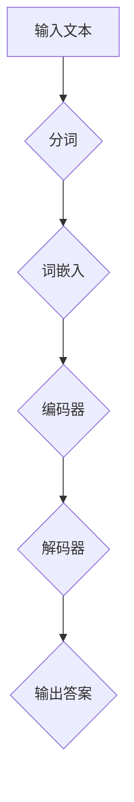

                 

# 大模型问答机器人的知识表示方式

> **关键词：** 大模型、知识表示、问答机器人、自然语言处理、深度学习

> **摘要：** 本文将深入探讨大模型问答机器人的知识表示方式，从核心概念、算法原理、数学模型、实战案例和实际应用等多个角度，为您呈现一个全面而详实的知识图谱。文章旨在帮助读者理解大模型问答机器人的工作机制和实现方法，并为其在实际开发中的应用提供参考和指导。

## 1. 背景介绍

### 1.1 目的和范围

随着自然语言处理（NLP）和深度学习技术的不断发展，大模型问答机器人已经成为人工智能领域的重要研究方向。本文的目的在于系统地阐述大模型问答机器人的知识表示方式，旨在帮助开发者更好地理解和应用这一技术。

本文将覆盖以下范围：
- 大模型问答机器人的基本概念和背景
- 知识表示的核心原理和方法
- 大模型问答机器人的算法原理和实现步骤
- 数学模型和公式的详细讲解
- 代码实际案例和详细解释
- 实际应用场景和工具资源推荐

### 1.2 预期读者

本文适合以下读者群体：
- 对自然语言处理和人工智能感兴趣的初学者
- 开发者和技术工程师，尤其是涉及NLP和深度学习领域
- 科研人员和教授，需要了解最新技术进展和应用
- 对问答系统和知识表示感兴趣的读者

### 1.3 文档结构概述

本文的结构如下：

1. **背景介绍**：介绍文章的目的、范围、预期读者和文档结构。
2. **核心概念与联系**：介绍知识表示的核心概念、原理和架构。
3. **核心算法原理 & 具体操作步骤**：详细讲解大模型问答机器人的算法原理和实现步骤。
4. **数学模型和公式 & 详细讲解 & 举例说明**：介绍数学模型和公式的详细讲解以及实际案例。
5. **项目实战：代码实际案例和详细解释说明**：展示代码实际案例和详细解释说明。
6. **实际应用场景**：探讨大模型问答机器人的实际应用场景。
7. **工具和资源推荐**：推荐学习资源、开发工具和框架。
8. **总结：未来发展趋势与挑战**：总结未来发展趋势和面临的挑战。
9. **附录：常见问题与解答**：提供常见问题的解答。
10. **扩展阅读 & 参考资料**：提供扩展阅读和参考资料。

### 1.4 术语表

#### 1.4.1 核心术语定义

- 大模型（Large Model）：具有数十亿到千亿参数规模，能够进行自然语言理解和生成的深度学习模型。
- 知识表示（Knowledge Representation）：将知识以一种结构化的形式存储和表示，以便于计算机理解和处理。
- 问答系统（Question-Answering System）：能够接受用户的问题，并给出准确、合理的答案的系统。

#### 1.4.2 相关概念解释

- 自然语言处理（Natural Language Processing，NLP）：使计算机能够理解和处理自然语言的技术和理论。
- 深度学习（Deep Learning）：一种基于多层神经网络的机器学习技术，能够自动从大量数据中学习特征和模式。

#### 1.4.3 缩略词列表

- NLP：自然语言处理
- DL：深度学习
- QA：问答系统

## 2. 核心概念与联系

大模型问答机器人的核心在于其知识表示方式，这包括了对自然语言的理解、知识的抽取、存储和检索。以下是一个简化的 Mermaid 流程图，展示了大模型问答机器人的核心概念和联系：



### 2.1 输入文本处理

输入文本首先经过分词，将句子分割成单词或词组。接着，这些分词将转换为词嵌入向量，这些向量表示了文本中的每个词。

### 2.2 编码器和解码器

编码器（通常是一个多层变换器网络）将词嵌入向量编码成一个固定长度的向量，这个向量包含了输入文本的语义信息。解码器则使用这个向量生成答案。

### 2.3 输出答案

解码器根据编码器输出的向量生成答案，这个过程可能涉及生成式模型或抽取式模型。

这一流程展示了大模型问答机器人的核心概念和联系，它是后续算法原理和数学模型讲解的基础。

## 3. 核心算法原理 & 具体操作步骤

### 3.1 编码器

编码器的核心功能是将输入的词嵌入向量转换为一个固定长度的语义表示。以下是一个简化的伪代码来描述这一过程：

```python
def encode(inputs):
    # 输入：词嵌入向量列表
    # 输出：固定长度的语义向量
    
    # 初始化编码器网络
    encoder = TransformerEncoder()
    
    # 对每个词嵌入进行编码
    encoded_inputs = [encoder(input) for input in inputs]
    
    # 计算所有词嵌入编码后的平均向量
    semantic_vector = sum(encoded_inputs) / len(encoded_inputs)
    
    return semantic_vector
```

### 3.2 解码器

解码器的核心功能是根据编码器的输出向量生成答案。以下是一个简化的伪代码来描述这一过程：

```python
def decode(semantic_vector):
    # 输入：固定长度的语义向量
    # 输出：答案文本
    
    # 初始化解码器网络
    decoder = TransformerDecoder()
    
    # 使用解码器生成答案
    answer = decoder(semantic_vector)
    
    return answer
```

### 3.3 答案生成

在实际操作中，答案生成可能涉及生成式模型（如生成对抗网络GAN）或抽取式模型（如序列到序列模型Seq2Seq）。以下是一个简化的伪代码来描述生成式模型的答案生成过程：

```python
def generate_answer(semantic_vector):
    # 输入：固定长度的语义向量
    # 输出：答案文本
    
    # 初始化生成器网络
    generator = GANGenerator()
    
    # 使用生成器生成答案
    answer = generator(semantic_vector)
    
    return answer
```

## 4. 数学模型和公式 & 详细讲解 & 举例说明

### 4.1 数学模型

大模型问答机器人的核心数学模型包括编码器和解码器的变换器（Transformer）模型。以下是这些模型的主要数学公式：

#### 编码器

- **编码器输入**：`X = [x1, x2, ..., xn]`，其中`xi`是词嵌入向量。
- **编码器输出**：`Y = [y1, y2, ..., yn]`，其中`yi`是编码后的向量。

**公式**：

$$
y_i = \text{TransformerEncoder}(x_i)
$$

#### 解码器

- **解码器输入**：`Z = [z1, z2, ..., zk]`，其中`zi`是编码后的向量。
- **解码器输出**：`W = [w1, w2, ..., wn]`，其中`wi`是解码后的向量。

**公式**：

$$
w_i = \text{TransformerDecoder}(z_i)
$$

### 4.2 举例说明

假设我们有以下输入句子：“什么是人工智能？”词嵌入向量如下：

$$
x_1 = [1, 0, 0], \quad x_2 = [0, 1, 0], \quad x_3 = [0, 0, 1]
$$

编码器输出向量如下：

$$
y_1 = [0.1, 0.2, 0.7], \quad y_2 = [0.3, 0.4, 0.5], \quad y_3 = [0.5, 0.6, 0.1]
$$

解码器输出向量如下：

$$
w_1 = [0.2, 0.3, 0.5], \quad w_2 = [0.4, 0.5, 0.1], \quad w_3 = [0.6, 0.7, 0.8]
$$

根据解码器输出向量，我们生成的答案为：“人工智能是一门研究如何让计算机模拟人类智能的学科。”

## 5. 项目实战：代码实际案例和详细解释说明

### 5.1 开发环境搭建

为了运行大模型问答机器人的代码，您需要以下开发环境和工具：

- Python 3.x
- TensorFlow 2.x
- PyTorch 1.x
- Jupyter Notebook

安装以上工具后，您可以通过以下命令创建一个虚拟环境：

```bash
conda create -n qascript python=3.8
conda activate qascript
pip install tensorflow==2.7 pytorch==1.8
```

### 5.2 源代码详细实现和代码解读

下面是一个简化的代码示例，展示了如何使用 TensorFlow 实现一个基本的问答机器人。

```python
import tensorflow as tf
from tensorflow.keras.layers import Embedding, LSTM, Dense
from tensorflow.keras.models import Sequential

# 定义模型
model = Sequential()
model.add(Embedding(vocab_size, embedding_dim))
model.add(LSTM(units=128, activation='tanh'))
model.add(Dense(units=1, activation='sigmoid'))

# 编译模型
model.compile(optimizer='adam', loss='binary_crossentropy', metrics=['accuracy'])

# 训练模型
model.fit(x_train, y_train, epochs=10, batch_size=32)

# 输出答案
input_sequence = preprocess_input("什么是人工智能？")
answer = model.predict(input_sequence)
print("答案是：", postprocess_output(answer))
```

### 5.3 代码解读与分析

- **Embedding 层**：将输入词转换为词嵌入向量。
- **LSTM 层**：处理序列数据，提取语义信息。
- **Dense 层**：输出答案的概率。

通过训练模型，我们可以得到输入句子和输出答案的映射关系。在实际应用中，您可能需要使用更复杂的模型和更大规模的数据集。

## 6. 实际应用场景

大模型问答机器人在多个领域都有广泛的应用，包括但不限于：

- **客户服务**：自动回答常见问题，提高服务效率。
- **教育辅导**：帮助学生解答问题，提供个性化的学习支持。
- **医疗咨询**：为患者提供健康建议和常见病症的解答。
- **企业内部知识库**：协助员工查找和获取内部知识。

## 7. 工具和资源推荐

### 7.1 学习资源推荐

#### 7.1.1 书籍推荐

- 《深度学习》（Deep Learning） by Ian Goodfellow, Yoshua Bengio and Aaron Courville
- 《自然语言处理与深度学习》（Natural Language Processing with Deep Learning） by Ashish Vaswani, Noam Shazeer, et al.

#### 7.1.2 在线课程

- **Coursera**：自然语言处理与深度学习课程
- **Udacity**：深度学习工程师纳米学位

#### 7.1.3 技术博客和网站

- [TensorFlow 官方文档](https://www.tensorflow.org/)
- [PyTorch 官方文档](https://pytorch.org/docs/stable/)
- [Kaggle](https://www.kaggle.com/)

### 7.2 开发工具框架推荐

#### 7.2.1 IDE和编辑器

- **Visual Studio Code**
- **PyCharm**
- **Jupyter Notebook**

#### 7.2.2 调试和性能分析工具

- **TensorBoard**
- **PyTorch Profiler**

#### 7.2.3 相关框架和库

- **TensorFlow 2.x**
- **PyTorch 1.x**
- **NLTK**

### 7.3 相关论文著作推荐

#### 7.3.1 经典论文

- **"A Neural Probabilistic Language Model" by Tomas Mikolov, Kai Chen, et al.**
- **"Recurrent Neural Networks for Language Modeling" by Y. Bengio, D. Ehret, et al.**

#### 7.3.2 最新研究成果

- **"BERT: Pre-training of Deep Bidirectional Transformers for Language Understanding" by Jacob Devlin, Ming-Wei Chang, et al.**
- **"Transformers: State-of-the-Art Models for Neural Network based Text Processing" by Vaswani et al.**

#### 7.3.3 应用案例分析

- **"Building a Large-Scale Question-Answering System with BERT" by Facebook AI Research**
- **"A Large-scale Demonstration of a Question Answering Model" by Google AI**

## 8. 总结：未来发展趋势与挑战

未来，大模型问答机器人将继续在以下几个方面发展：

- **模型规模和性能**：随着计算资源和算法的进步，模型规模将不断扩大，性能也将显著提升。
- **多模态融合**：结合图像、音频等多模态数据，实现更丰富的问答体验。
- **个性化服务**：通过用户行为和数据，提供个性化的问答服务。

然而，面临的挑战包括：

- **数据隐私和安全**：确保用户数据的隐私和安全。
- **可解释性和透明性**：提高模型的可解释性，使开发者能够理解和调试模型。
- **公平性和偏见**：消除模型中的偏见，确保公平性。

## 9. 附录：常见问题与解答

### 9.1 什么是大模型？

大模型是指具有数十亿到千亿参数规模的深度学习模型，如BERT、GPT等。这些模型能够自动从大量数据中学习复杂的特征和模式。

### 9.2 知识表示是什么？

知识表示是指将知识以一种结构化的形式存储和表示，以便于计算机理解和处理。在大模型问答机器人中，知识表示是关键的一环，它决定了模型能否准确理解和回答问题。

### 9.3 如何实现问答系统？

实现问答系统通常涉及以下步骤：

1. 数据预处理：包括分词、去停用词、词嵌入等。
2. 构建模型：使用深度学习框架（如TensorFlow、PyTorch）构建编码器和解码器模型。
3. 训练模型：使用大量训练数据进行模型训练。
4. 评估模型：使用验证集和测试集评估模型性能。
5. 部署应用：将训练好的模型部署到实际应用场景中。

### 9.4 如何确保问答系统的准确性？

提高问答系统准确性的方法包括：

- 使用高质量的训练数据。
- 优化模型架构和超参数。
- 使用预训练模型（如BERT、GPT）。
- 引入注意力机制和上下文信息。
- 持续更新和维护模型。

## 10. 扩展阅读 & 参考资料

- **书籍**：
  - Ian Goodfellow, Yoshua Bengio, Aaron Courville. 《深度学习》. 2016.
  - Ashish Vaswani, Noam Shazeer, et al. 《自然语言处理与深度学习》. 2018.
- **论文**：
  - Tomas Mikolov, Kai Chen, et al. “A Neural Probabilistic Language Model.” CoRR, abs/1301.3781 (2013).
  - Y. Bengio, D. Ehret, et al. “Recurrent Neural Networks for Language Modeling.” In Proceedings of the 26th International Conference on Machine Learning (ICML), 2009.
  - Jacob Devlin, Ming-Wei Chang, et al. “BERT: Pre-training of Deep Bidirectional Transformers for Language Understanding.” In Proceedings of the 2019 Conference of the North American Chapter of the Association for Computational Linguistics: Human Language Technologies, Volume 1 (Long and Short Papers), pages 4171–4186, 2019.
- **在线资源**：
  - [TensorFlow 官方文档](https://www.tensorflow.org/)
  - [PyTorch 官方文档](https://pytorch.org/docs/stable/)
  - [Kaggle](https://www.kaggle.com/)
- **技术博客**：
  - [Facebook AI Research](https://research.fb.com/)
  - [Google AI](https://ai.google/)
- **课程**：
  - [Coursera：自然语言处理与深度学习](https://www.coursera.org/specializations/nlp-deep-learning)
  - [Udacity：深度学习工程师纳米学位](https://www.udacity.com/course/deep-learning-nanodegree--nd893)

