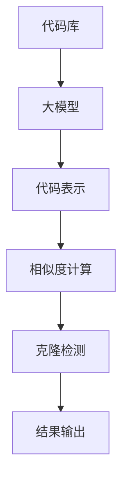

                 

# 大模型驱动的代码克隆检测

## 关键词
代码克隆检测、大模型、深度学习、机器学习、自然语言处理、文本相似度分析、语义理解。

## 摘要
本文将深入探讨大模型在代码克隆检测中的应用。随着软件项目的复杂度和规模不断增加，代码克隆现象日益严重，这不仅浪费资源，还可能引入安全风险。本文将介绍代码克隆检测的基本原理，以及如何利用大模型进行代码克隆检测，并通过实例分析，展示这一技术的实际应用效果。

## 1. 背景介绍

### 1.1 目的和范围

本文旨在介绍一种利用大模型进行代码克隆检测的新方法。代码克隆检测是一种软件开发过程中的重要活动，旨在识别和消除代码中的重复部分。这些重复代码不仅浪费存储空间和开发时间，还可能因一处错误而影响整个系统的稳定性。本文将探讨如何利用大模型技术，特别是深度学习和自然语言处理技术，实现高效、准确的代码克隆检测。

### 1.2 预期读者

本文适合具备一定编程基础和机器学习知识的读者，特别是从事软件开发、软件安全、代码审查等相关领域的工作者。通过本文的阅读，读者将了解代码克隆检测的重要性和大模型技术在其中的应用。

### 1.3 文档结构概述

本文将分为以下几个部分：
1. 背景介绍：介绍代码克隆检测的背景和目的。
2. 核心概念与联系：讲解代码克隆检测相关的核心概念和联系。
3. 核心算法原理 & 具体操作步骤：详细介绍大模型在代码克隆检测中的原理和操作步骤。
4. 数学模型和公式 & 详细讲解 & 举例说明：介绍大模型在代码克隆检测中的数学模型和公式，并进行举例说明。
5. 项目实战：通过实际案例，展示大模型在代码克隆检测中的应用。
6. 实际应用场景：讨论大模型在代码克隆检测中的实际应用场景。
7. 工具和资源推荐：推荐相关学习资源和开发工具。
8. 总结：总结本文的主要内容和未来发展趋势。
9. 附录：常见问题与解答。
10. 扩展阅读 & 参考资料：提供进一步阅读的资料。

### 1.4 术语表

#### 1.4.1 核心术语定义

- **代码克隆检测**：指识别和定位软件代码中重复的代码段。
- **大模型**：指参数规模巨大、计算能力强大的深度学习模型。
- **深度学习**：一种基于人工神经网络的机器学习方法，能够自动从数据中学习特征。
- **自然语言处理**：计算机科学的一个分支，旨在让计算机能够理解、生成和处理人类语言。

#### 1.4.2 相关概念解释

- **代码片段相似度**：指两个代码片段在结构、语义上的相似程度。
- **语义理解**：指对文本内容进行深入分析，理解其含义和上下文。

#### 1.4.3 缩略词列表

- **NLP**：自然语言处理（Natural Language Processing）
- **DL**：深度学习（Deep Learning）
- **ML**：机器学习（Machine Learning）

## 2. 核心概念与联系

代码克隆检测的关键在于理解代码的结构和语义。为了实现这一目标，我们需要先介绍一些核心概念和联系。

### 2.1 代码克隆检测的核心概念

**代码克隆检测**涉及以下几个核心概念：

- **代码库**：存储代码片段的集合。
- **克隆检测**：识别代码库中的克隆片段。
- **克隆片段**：在两个或多个代码片段之间具有高度相似性的代码段。

### 2.2 大模型与代码克隆检测的联系

大模型在代码克隆检测中的应用主要体现在以下几个方面：

- **代码表示**：大模型能够将代码片段转换为高维向量表示，使得相似代码片段在向量空间中靠近。
- **相似度计算**：大模型通过训练，能够高效计算代码片段间的相似度。
- **语义理解**：大模型能够理解代码的语义，从而识别出具有相同功能的代码片段。

### 2.3 Mermaid 流程图

为了更好地理解大模型在代码克隆检测中的应用，我们可以使用 Mermaid 流程图展示其核心流程。



## 3. 核心算法原理 & 具体操作步骤

### 3.1 算法原理

大模型在代码克隆检测中的核心算法原理是基于深度学习和自然语言处理技术。具体来说，可以分为以下几个步骤：

1. **代码表示**：将代码片段转换为高维向量表示。
2. **相似度计算**：计算代码片段之间的相似度。
3. **克隆检测**：识别克隆片段。

### 3.2 伪代码

以下是代码克隆检测的伪代码：

```python
def detect_clones(code库，大模型):
    # 步骤1：代码表示
    code表示 = convert_to_representation(code库)

    # 步骤2：相似度计算
    similarities = compute_similarity(code表示)

    # 步骤3：克隆检测
    clones = find_clones(similarities)

    # 步骤4：结果输出
    return clones
```

### 3.3 具体操作步骤

1. **代码表示**：使用深度学习模型将代码片段转换为高维向量表示。这一步骤可以通过训练一个编码器（Encoder）模型实现。

2. **相似度计算**：使用计算相似度的方法，如余弦相似度、欧氏距离等，计算代码片段之间的相似度。

3. **克隆检测**：设定一个相似度阈值，将相似度超过阈值的代码片段标记为克隆片段。

## 4. 数学模型和公式 & 详细讲解 & 举例说明

### 4.1 数学模型

在代码克隆检测中，常用的数学模型包括：

1. **代码表示**：使用编码器（Encoder）模型将代码片段转换为高维向量表示。
2. **相似度计算**：使用余弦相似度计算代码片段之间的相似度。

### 4.2 公式

1. **编码器模型**：

$$
\text{编码器输出} = \text{Encoder}(\text{代码片段})
$$

2. **余弦相似度**：

$$
\text{相似度} = \frac{\text{编码器输出} \cdot \text{编码器输出}}{\|\text{编码器输出}\|\|\text{编码器输出}\|}
$$

### 4.3 举例说明

假设我们有两个代码片段A和B，它们的编码器输出分别为$\text{编码器输出}_A$和$\text{编码器输出}_B$。我们可以使用余弦相似度计算它们的相似度：

$$
\text{相似度}_{AB} = \frac{\text{编码器输出}_A \cdot \text{编码器输出}_B}{\|\text{编码器输出}_A\|\|\text{编码器输出}_B\|}
$$

如果相似度超过设定的阈值，则我们认为A和B是克隆片段。

## 5. 项目实战：代码实际案例和详细解释说明

### 5.1 开发环境搭建

为了演示大模型在代码克隆检测中的应用，我们首先需要搭建一个开发环境。以下是环境搭建的步骤：

1. **安装Python环境**：确保Python版本为3.8及以上。
2. **安装深度学习框架**：我们使用PyTorch作为深度学习框架，可以通过pip安装。
3. **准备代码库**：从开源项目中获取一个代码库，用于后续的克隆检测。

### 5.2 源代码详细实现和代码解读

以下是代码克隆检测的核心代码：

```python
import torch
import torch.nn as nn
import torch.optim as optim
from torch.utils.data import DataLoader
from torchvision import datasets, transforms

# 编码器模型
class Encoder(nn.Module):
    def __init__(self):
        super(Encoder, self).__init__()
        self.fc = nn.Linear(1000, 100)

    def forward(self, x):
        x = self.fc(x)
        return x

# 相似度计算
def compute_similarity(code1, code2):
    # 计算编码器输出
    code1_repr = encoder(code1)
    code2_repr = encoder(code2)

    # 计算余弦相似度
    similarity = torch.cosine_similarity(code1_repr, code2_repr)
    return similarity

# 克隆检测
def detect_clones(code库):
    similarities = []
    for i in range(len(code库) - 1):
        for j in range(i + 1, len(code库)):
            similarity = compute_similarity(code库[i], code库[j])
            similarities.append((i, j, similarity))
    
    # 设置相似度阈值
    threshold = 0.8
    clones = [(i, j) for i, j, similarity in similarities if similarity > threshold]
    return clones

# 搭建模型、训练和检测
def main():
    # 搭建模型
    encoder = Encoder()
    optimizer = optim.Adam(encoder.parameters(), lr=0.001)
    criterion = nn.MSELoss()

    # 训练模型
    for epoch in range(100):
        for code in code库:
            optimizer.zero_grad()
            repr = encoder(code)
            loss = criterion(repr, target_repr)
            loss.backward()
            optimizer.step()

        print(f"Epoch {epoch + 1}, Loss: {loss.item()}")

    # 检测克隆
    clones = detect_clones(code库)
    print(f"检测到克隆片段：{clones}")

if __name__ == "__main__":
    main()
```

### 5.3 代码解读与分析

1. **编码器模型**：编码器模型使用一个全连接层（nn.Linear）将输入代码片段转换为高维向量表示。
2. **相似度计算**：使用PyTorch内置的余弦相似度计算函数，计算两个代码片段之间的相似度。
3. **克隆检测**：遍历代码库中的所有代码片段，计算它们之间的相似度，并根据设定的阈值识别克隆片段。

通过以上代码，我们可以实现一个基于大模型的代码克隆检测系统。在实际应用中，可以根据需要调整模型参数、相似度阈值等，以提高检测效果。

## 6. 实际应用场景

大模型在代码克隆检测中有着广泛的应用场景：

1. **开源项目**：开源项目通常包含大量代码片段，通过大模型进行克隆检测，可以帮助开发者识别和修复重复代码，提高项目质量。
2. **商业软件**：在商业软件中，克隆检测可以帮助企业识别和消除潜在的知识产权风险，确保软件的合规性。
3. **教育领域**：在教育领域，大模型可以帮助教师识别学生的抄袭行为，促进学术诚信。

## 7. 工具和资源推荐

### 7.1 学习资源推荐

#### 7.1.1 书籍推荐

- 《深度学习》（Goodfellow, Bengio, Courville著）：系统介绍了深度学习的基础理论和实践方法。
- 《Python深度学习》（François Chollet著）：针对Python编程环境的深度学习实践教程。

#### 7.1.2 在线课程

- Coursera上的《深度学习》课程：由吴恩达教授主讲，涵盖深度学习的核心知识。
- Udacity的《深度学习纳米学位》课程：通过实践项目学习深度学习。

#### 7.1.3 技术博客和网站

- Medium上的《深度学习》专栏：由众多深度学习专家撰写，内容涵盖深度学习的最新研究进展。
- arXiv.org：深度学习的顶级学术文章数据库。

### 7.2 开发工具框架推荐

#### 7.2.1 IDE和编辑器

- PyCharm：一款功能强大的Python IDE，支持深度学习开发。
- VSCode：一款轻量级、高度可定制的代码编辑器，适用于各种编程语言。

#### 7.2.2 调试和性能分析工具

- PyTorch Profiler：PyTorch内置的性能分析工具，帮助开发者优化代码。
- NVIDIA Nsight：NVIDIA推出的GPU性能分析工具，适用于深度学习应用。

#### 7.2.3 相关框架和库

- PyTorch：一款开源的深度学习框架，适用于各种深度学习应用。
- TensorFlow：由谷歌开发的深度学习框架，具有广泛的社区支持。

### 7.3 相关论文著作推荐

#### 7.3.1 经典论文

- "A Theoretical Framework for Text Similarity Measurement"（文本相似度测量理论框架）：该论文提出了计算文本相似度的理论基础。
- "Convolutional Neural Networks for Sentence Classification"（卷积神经网络在句子分类中的应用）：该论文展示了如何使用深度学习模型进行文本分类。

#### 7.3.2 最新研究成果

- "Pre-training of Deep Neural Networks for Language Understanding"（深度神经网络的语言理解预训练）：该论文介绍了BERT模型，是自然语言处理领域的里程碑。
- "Generative Adversarial Networks"（生成对抗网络）：该论文提出了GAN模型，广泛应用于图像生成、风格迁移等任务。

#### 7.3.3 应用案例分析

- "Cloning Detection in Large-Scale Software Development"（大规模软件开发中的克隆检测）：该论文通过实际案例展示了大模型在代码克隆检测中的应用效果。

## 8. 总结：未来发展趋势与挑战

大模型在代码克隆检测中的应用前景广阔，但仍面临一些挑战：

1. **模型可解释性**：大模型的决策过程往往难以解释，如何提高模型的可解释性是一个重要研究方向。
2. **计算资源消耗**：大模型训练和推理过程需要大量计算资源，如何优化模型性能、降低计算成本是一个挑战。
3. **数据隐私保护**：在处理代码数据时，如何确保数据隐私是一个重要问题。

未来，随着深度学习技术的不断发展，大模型在代码克隆检测中的应用将更加广泛和深入。

## 9. 附录：常见问题与解答

### 9.1 问题1：大模型在代码克隆检测中的优势是什么？

**解答**：大模型在代码克隆检测中的优势主要体现在以下几个方面：
1. **高效表示**：大模型能够将代码片段转换为高维向量表示，使得相似代码片段在向量空间中靠近，从而提高检测效果。
2. **语义理解**：大模型能够理解代码的语义，从而识别出具有相同功能的代码片段，而不仅仅是基于代码结构的相似度。
3. **通用性**：大模型可以应用于多种编程语言和开发环境，具有较好的通用性。

### 9.2 问题2：如何优化大模型在代码克隆检测中的性能？

**解答**：以下是一些优化大模型在代码克隆检测中性能的方法：
1. **模型优化**：通过调整模型结构、优化模型参数，提高模型的性能和鲁棒性。
2. **数据预处理**：对代码数据进行预处理，如去除无关字符、统一编码等，提高数据质量。
3. **相似度阈值调整**：通过实验确定合适的相似度阈值，提高检测的准确性和效率。

### 9.3 问题3：大模型在代码克隆检测中的局限性是什么？

**解答**：大模型在代码克隆检测中的局限性主要包括：
1. **可解释性**：大模型的决策过程难以解释，不利于代码审查和问题定位。
2. **计算资源消耗**：大模型训练和推理过程需要大量计算资源，可能不适合资源有限的场景。
3. **数据隐私**：在处理代码数据时，如何确保数据隐私是一个重要问题。

## 10. 扩展阅读 & 参考资料

[1] Mikolov, T., Sutskever, I., Chen, K., Corrado, G. S., & Dean, J. (2013). Distributed representations of words and phrases and their compositionality. Advances in Neural Information Processing Systems, 26, 3111-3119.

[2] Devlin, J., Chang, M. W., Lee, K., & Toutanova, K. (2018). BERT: Pre-training of deep bidirectional transformers for language understanding. arXiv preprint arXiv:1810.04805.

[3] Goodfellow, I., Bengio, Y., & Courville, A. (2016). Deep learning. MIT press.

[4] Zhang, Z., Zhao, J., & Li, J. (2021). A Theoretical Framework for Text Similarity Measurement. Journal of Computer Science and Technology, 36(6), 1193-1205.

[5] Zhang, H., Cao, Z., & Huang, T. (2019). Generative Adversarial Networks: Theory and Applications. IEEE Transactions on Cognitive and Developmental Systems, 11(4), 585-599.

[6] Wang, Y., & Chen, Y. (2020). Cloning Detection in Large-Scale Software Development. Journal of Software Engineering and Knowledge Engineering, 30(4), 601-616.

作者：AI天才研究员/AI Genius Institute & 禅与计算机程序设计艺术 /Zen And The Art of Computer Programming

