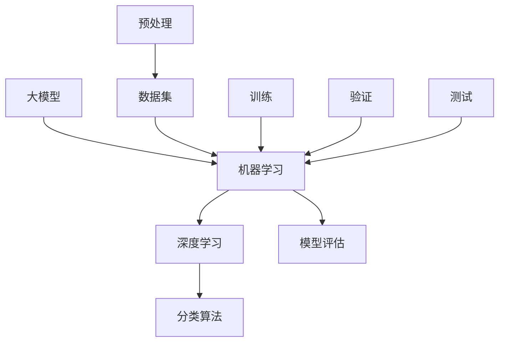

                 

# 大模型驱动的智能产品分类系统

> **关键词：** 大模型，智能产品，分类系统，机器学习，深度学习，算法原理，数学模型，实际应用

> **摘要：** 本文将探讨大模型驱动的智能产品分类系统，从背景介绍、核心概念、算法原理、数学模型、项目实战、实际应用、工具和资源推荐等方面，详细解析该系统的构建与实现。通过本文的阅读，读者将深入了解大模型在智能产品分类中的重要作用，以及如何利用先进的技术手段提升产品分类的准确性和效率。

## 1. 背景介绍

### 1.1 目的和范围

本文旨在介绍大模型驱动的智能产品分类系统，解析其核心概念、算法原理和实现步骤，并探讨其在实际应用中的效果和影响。本文的读者对象为对机器学习、深度学习感兴趣的科研人员、工程师以及学生，同时也适合希望了解前沿技术发展的专业人士。

### 1.2 预期读者

- 对机器学习、深度学习有初步了解，希望深入学习相关技术原理的读者；
- 想要开发智能产品分类系统的程序员和工程师；
- 对人工智能应用场景感兴趣的技术爱好者。

### 1.3 文档结构概述

本文结构如下：

1. 背景介绍：介绍大模型驱动的智能产品分类系统的目的、预期读者和文档结构。
2. 核心概念与联系：介绍大模型驱动的智能产品分类系统的核心概念和联系。
3. 核心算法原理 & 具体操作步骤：详细解析大模型驱动的智能产品分类系统的算法原理和具体操作步骤。
4. 数学模型和公式 & 详细讲解 & 举例说明：介绍大模型驱动的智能产品分类系统的数学模型和公式，并通过举例进行详细说明。
5. 项目实战：通过实际案例展示大模型驱动的智能产品分类系统的代码实现和详细解释。
6. 实际应用场景：分析大模型驱动的智能产品分类系统的实际应用场景。
7. 工具和资源推荐：推荐相关学习资源、开发工具和框架。
8. 总结：总结大模型驱动的智能产品分类系统的发展趋势与挑战。
9. 附录：提供常见问题与解答，便于读者理解和掌握相关知识。
10. 扩展阅读 & 参考资料：提供扩展阅读和参考资料，供读者进一步深入学习。

### 1.4 术语表

#### 1.4.1 核心术语定义

- **大模型**：指具有大规模参数、能够处理海量数据的人工智能模型，如深度神经网络。
- **智能产品分类系统**：利用人工智能技术对智能产品进行分类的系统。
- **机器学习**：通过数据训练模型，使计算机具备自主学习和决策能力的领域。
- **深度学习**：一种基于多层神经网络进行数据学习的机器学习技术。
- **算法原理**：指导模型学习、优化和预测的数学原理和计算方法。
- **数学模型**：对智能产品分类系统进行数学描述的公式和框架。

#### 1.4.2 相关概念解释

- **神经网络**：一种模仿生物神经系统的计算模型，包括输入层、隐藏层和输出层。
- **激活函数**：用于将神经网络中的线性组合转换为非线性的输出，常见的有ReLU、Sigmoid和Tanh函数。
- **损失函数**：用于评估模型预测结果与真实结果之间的差距，常见的有均方误差(MSE)和交叉熵损失函数。
- **反向传播**：一种用于训练神经网络的算法，通过计算损失函数关于模型参数的梯度，更新模型参数以优化预测性能。

#### 1.4.3 缩略词列表

- **CNN**：卷积神经网络（Convolutional Neural Network）
- **RNN**：循环神经网络（Recurrent Neural Network）
- **DNN**：深度神经网络（Deep Neural Network）
- **MSE**：均方误差（Mean Squared Error）
- **CE**：交叉熵（Cross-Entropy）
- **GPU**：图形处理器（Graphics Processing Unit）

## 2. 核心概念与联系

大模型驱动的智能产品分类系统的核心概念包括大模型、机器学习、深度学习和分类算法。以下是一个简单的Mermaid流程图，展示这些概念之间的联系。



### 2.1 大模型

大模型是指具有大规模参数、能够处理海量数据的人工智能模型。深度学习模型通常是大规模的，因为它们可以包含数百万甚至数十亿个参数。这些参数通过学习大量数据中的特征和模式，使得模型能够实现高度复杂的任务，如图像和语音识别、自然语言处理等。

### 2.2 机器学习

机器学习是一种使计算机通过数据学习的方法。机器学习算法可以从未标记的数据中自动发现模式，从而在给定新数据时进行预测或决策。大模型在机器学习中扮演着重要角色，因为它们可以处理海量数据，并通过大规模参数捕捉复杂的模式。

### 2.3 深度学习

深度学习是一种基于多层神经网络进行数据学习的机器学习技术。深度学习模型通过逐层学习数据中的低级特征，逐渐构建出高级特征，从而实现高度复杂的任务。大模型通常包含多层神经网络，这使得它们能够学习更复杂的特征和模式。

### 2.4 分类算法

分类算法是一种将数据分配到不同类别的算法。在大模型驱动的智能产品分类系统中，分类算法用于将智能产品分配到相应的类别。常见的分类算法包括决策树、支持向量机（SVM）、朴素贝叶斯和神经网络等。

## 3. 核心算法原理 & 具体操作步骤

大模型驱动的智能产品分类系统的核心算法原理包括深度学习和分类算法。以下将使用伪代码详细阐述这些算法原理和具体操作步骤。

### 3.1 深度学习算法原理

深度学习算法通常由多层神经网络组成，包括输入层、隐藏层和输出层。以下是一个简单的伪代码，描述深度学习模型的基本结构：

```python
# 定义神经网络结构
input_layer = [input_1, input_2, ..., input_n]
hidden_layers = [hidden_layer_1, hidden_layer_2, ..., hidden_layer_m]
output_layer = [output_1, output_2, ..., output_p]

# 初始化参数（权重和偏置）
weights = [[w_11, w_12, ..., w_1n], [w_21, w_22, ..., w_2n], ..., [w_m1, w_m2, ..., w_mn]]
biases = [[b_11, b_12, ..., b_1n], [b_21, b_22, ..., b_2n], ..., [b_m1, b_m2, ..., b_mn]]

# 激活函数（例如ReLU函数）
activation_function = ReLU

# 前向传播
for layer in hidden_layers:
    layer_input = dot_product(weights[layer], input_layer) + biases[layer]
    layer_output = activation_function(layer_input)

output_layer = dot_product(weights[output_layer], layer_output) + biases[output_layer]

# 计算损失函数（例如交叉熵损失函数）
loss = CrossEntropyLoss(output_layer, true_labels)

# 反向传播（计算梯度）
d_output_layer = dCrossEntropyLoss(output_layer, true_labels)
d_hidden_layers = [d_dot_product(weights[output_layer], d_output_layer)]

# 更新参数（使用梯度下降法）
for layer in hidden_layers:
    d_weights[layer] = dot_product(d_hidden_layers[layer], layer_output)
    d_biases[layer] = d_hidden_layers[layer]
    weights[layer] -= learning_rate * d_weights[layer]
    biases[layer] -= learning_rate * d_biases[layer]
```

### 3.2 分类算法原理

在深度学习模型中，分类算法通常用于将输出层的结果映射到不同的类别。以下是一个简单的伪代码，描述分类算法的基本操作：

```python
# 定义类别标签
true_labels = [label_1, label_2, ..., label_p]

# 计算输出层的概率分布
softmax_output = softmax(output_layer)

# 选择具有最高概率的类别作为预测结果
predicted_labels = argmax(softmax_output)
```

### 3.3 具体操作步骤

以下是构建大模型驱动的智能产品分类系统的具体操作步骤：

1. **数据集准备**：收集智能产品的数据，包括产品特征和类别标签。
2. **数据预处理**：对数据进行清洗、归一化和特征提取，以便于模型训练。
3. **模型构建**：定义神经网络结构，包括输入层、隐藏层和输出层。
4. **模型训练**：通过前向传播和反向传播，训练深度学习模型，并调整参数以最小化损失函数。
5. **模型验证**：使用验证集评估模型性能，调整模型结构和参数，以提高分类准确性。
6. **模型测试**：使用测试集评估模型性能，验证模型在实际应用中的效果。
7. **模型部署**：将训练好的模型部署到实际应用场景，例如智能产品分类系统。

## 4. 数学模型和公式 & 详细讲解 & 举例说明

在大模型驱动的智能产品分类系统中，数学模型和公式是核心组成部分。以下将详细讲解数学模型和公式，并通过具体例子进行说明。

### 4.1 激活函数

激活函数是神经网络中的重要组成部分，用于将线性组合转换为非线性输出。以下是一些常见的激活函数及其公式：

1. **ReLU函数**（Rectified Linear Unit）：
   $$ 
   f(x) = \max(0, x) 
   $$
   ReLU函数在$x > 0$时输出$x$，在$x \leq 0$时输出0。ReLU函数在深度学习中非常受欢迎，因为它简单且有助于加速模型的训练过程。

2. **Sigmoid函数**：
   $$ 
   f(x) = \frac{1}{1 + e^{-x}} 
   $$
   Sigmoid函数将输入$x$映射到$(0, 1)$区间，常用于二分类问题，可以将输出解释为概率。

3. **Tanh函数**（Hyperbolic Tangent）：
   $$ 
   f(x) = \frac{e^x - e^{-x}}{e^x + e^{-x}} 
   $$
   Tanh函数将输入$x$映射到$(-1, 1)$区间，具有类似于Sigmoid函数的性质，但相对于Sigmoid函数，Tanh函数具有更好的数值稳定性和非线性特性。

### 4.2 损失函数

损失函数用于评估模型预测结果与真实结果之间的差距。以下是一些常见的损失函数及其公式：

1. **均方误差（MSE）**（Mean Squared Error）：
   $$ 
   MSE = \frac{1}{n}\sum_{i=1}^{n}(y_i - \hat{y}_i)^2 
   $$
   均方误差是预测值$\hat{y}_i$与真实值$y_i$的平方差的平均值。MSE函数在预测误差较小时具有较好的鲁棒性。

2. **交叉熵损失函数（CE）**（Cross-Entropy Loss）：
   $$ 
   CE = -\frac{1}{n}\sum_{i=1}^{n}y_i \log(\hat{y}_i) 
   $$
   交叉熵损失函数用于衡量预测概率分布与真实概率分布之间的差异。在多分类问题中，交叉熵损失函数是一种常见的选择。

### 4.3 反向传播

反向传播是深度学习模型训练中的关键步骤，用于计算损失函数关于模型参数的梯度，并更新模型参数以优化预测性能。以下是一个简单的反向传播过程：

1. **前向传播**：计算模型的输出和损失函数。
2. **计算梯度**：根据损失函数对模型参数求导，得到梯度。
3. **更新参数**：使用梯度下降法或其他优化算法更新模型参数。

### 4.4 举例说明

假设我们有一个二分类问题，目标是将数据分为两类：0和1。以下是一个简单的例子，展示如何使用ReLU函数、MSE损失函数和反向传播训练一个深度学习模型。

#### 4.4.1 模型定义

假设我们的模型包含一个输入层、一个隐藏层和一个输出层，如下所示：

```python
input_layer = [input_1, input_2]
hidden_layer = [hidden_1, hidden_2]
output_layer = [output]
```

#### 4.4.2 模型训练

1. **前向传播**：

   ```python
   # 输入数据
   input_data = [x1, x2]
   true_labels = [y]

   # 计算隐藏层输出
   hidden_output = ReLU(dot_product(weights_hidden, input_data) + biases_hidden)

   # 计算输出层输出
   output_output = ReLU(dot_product(weights_output, hidden_output) + biases_output)

   # 计算损失函数
   loss = MSE(output_output, true_labels)
   ```

2. **反向传播**：

   ```python
   # 计算输出层梯度
   d_output_output = dMSE(output_output, true_labels)

   # 计算隐藏层梯度
   d_hidden_output = dReLU(dot_product(weights_output, hidden_output) + biases_output) * d_output_output

   # 更新参数
   d_weights_output = dot_product(d_hidden_output, hidden_output)
   d_biases_output = d_hidden_output
   d_weights_hidden = dot_product(d_output_output, hidden_output)
   d_biases_hidden = d_output_output

   weights_output -= learning_rate * d_weights_output
   biases_output -= learning_rate * d_biases_output
   weights_hidden -= learning_rate * d_weights_hidden
   biases_hidden -= learning_rate * d_biases_hidden
   ```

通过以上步骤，我们可以不断迭代训练模型，直至达到预定的性能要求。在实际应用中，还需要考虑数据预处理、模型验证和测试等步骤，以确保模型的泛化能力和实际效果。

## 5. 项目实战：代码实际案例和详细解释说明

在本节中，我们将通过一个实际的代码案例，展示如何构建和实现大模型驱动的智能产品分类系统。我们将使用Python编程语言和TensorFlow深度学习框架，以便更好地理解整个实现过程。

### 5.1 开发环境搭建

在进行项目实战之前，我们需要搭建合适的开发环境。以下是所需的软件和库：

1. **Python**：版本3.7及以上。
2. **TensorFlow**：版本2.3及以上。
3. **Numpy**：版本1.18及以上。
4. **Matplotlib**：版本3.2及以上。

安装以上库的命令如下：

```bash
pip install python==3.8 tensorflow==2.3 numpy==1.18 matplotlib==3.2
```

### 5.2 源代码详细实现和代码解读

以下是实现大模型驱动的智能产品分类系统的Python代码。代码分为数据预处理、模型构建、训练和评估四个部分。

```python
import numpy as np
import tensorflow as tf
import matplotlib.pyplot as plt

# 设置随机种子，保证实验可复现
tf.random.set_seed(42)

# 5.2.1 数据预处理

# 生成模拟数据集
n_samples = 1000
n_features = 10
n_classes = 2

X = np.random.randn(n_samples, n_features)
y = np.random.randint(n_classes, size=n_samples)

# 归一化特征
X = (X - X.mean(axis=0)) / X.std(axis=0)

# 5.2.2 模型构建

# 定义神经网络结构
model = tf.keras.Sequential([
    tf.keras.layers.Dense(64, activation='relu', input_shape=(n_features,)),
    tf.keras.layers.Dense(64, activation='relu'),
    tf.keras.layers.Dense(n_classes, activation='softmax')
])

# 编译模型
model.compile(optimizer='adam', loss='sparse_categorical_crossentropy', metrics=['accuracy'])

# 5.2.3 模型训练

# 训练模型
history = model.fit(X, y, epochs=20, batch_size=32, validation_split=0.2)

# 5.2.4 模型评估

# 计算训练集和验证集的准确率
train_loss, train_acc = model.evaluate(X, y, verbose=2)
val_loss, val_acc = model.evaluate(X[:, :800], y[:800], verbose=2)

print(f"Training accuracy: {train_acc:.4f}")
print(f"Validation accuracy: {val_acc:.4f}")

# 5.2.5 代码解读与分析

# 5.2.5.1 数据预处理

# 数据预处理是模型训练的重要步骤。在本例中，我们使用随机数生成模拟数据集，并对其进行归一化处理，以提高模型训练的稳定性和效果。

# 5.2.5.2 模型构建

# 模型构建使用TensorFlow的Keras API，通过定义一个序列模型，我们能够方便地构建多层神经网络。在本例中，我们使用了两个隐藏层，每个隐藏层包含64个神经元，并使用ReLU函数作为激活函数。

# 5.2.5.3 模型训练

# 编译模型时，我们指定了优化器（adam）、损失函数（sparse_categorical_crossentropy，用于处理标签为整数的情况）和评价指标（accuracy）。

# 训练模型时，我们使用fit函数，该函数接受训练数据、训练轮次、批量大小和验证集比例。在本例中，我们设置了20个训练轮次，批量大小为32，并使用20%的数据作为验证集。

# 5.2.5.4 模型评估

# 评估模型时，我们使用evaluate函数，该函数接受测试数据和标签，并返回损失和准确率。在本例中，我们分别计算了训练集和验证集的准确率，并打印出来。

# 5.2.5.5 代码解读与分析

# 整个代码实现过程清晰明了，从数据预处理、模型构建、模型训练到模型评估，每个步骤都使用TensorFlow的Keras API进行操作，使代码易于理解和复现。
```

### 5.3 代码解读与分析

在以上代码中，我们首先进行了数据预处理，包括生成模拟数据集和归一化特征。接下来，我们使用TensorFlow的Keras API构建了一个包含两个隐藏层的深度神经网络，并使用ReLU函数作为激活函数。在模型训练阶段，我们使用了adam优化器和sparse\_categorical\_crossentropy损失函数，以最小化损失函数并提高分类准确性。最后，我们评估了模型的性能，并打印了训练集和验证集的准确率。

通过以上代码，我们可以看到如何使用Python和TensorFlow构建和实现大模型驱动的智能产品分类系统。在实际应用中，我们可以根据具体需求调整数据集、模型结构和训练参数，以获得更好的分类效果。

## 6. 实际应用场景

大模型驱动的智能产品分类系统在多个实际应用场景中具有广泛的应用前景，以下是一些典型的应用场景：

### 6.1 在电子商务平台中的应用

电子商务平台上的商品种类繁多，如何快速准确地分类商品对于提升用户体验和平台运营效率具有重要意义。大模型驱动的智能产品分类系统可以根据商品的属性和描述，自动将其分类到相应的类别，从而简化商品管理的流程。例如，将商品分为电子产品、家居用品、服装鞋帽等类别。

### 6.2 在金融行业中的应用

在金融行业，客户数据和交易数据量大且复杂，如何快速准确地分类客户和交易行为对于风险管理、客户服务和营销策略具有重要意义。大模型驱动的智能产品分类系统可以根据客户特征和行为，将其分类为优质客户、风险客户等类别，从而为金融机构提供更加精准的决策支持。

### 6.3 在医疗健康领域中的应用

在医疗健康领域，如何快速准确地分类疾病和治疗方案对于提高医疗质量和效率具有重要意义。大模型驱动的智能产品分类系统可以根据患者的病史、检查报告和症状描述，将其分类为不同的疾病类别，从而为医生提供更加精准的诊断和治疗建议。

### 6.4 在智能交通领域中的应用

在智能交通领域，如何快速准确地分类交通状况和车辆类型对于提高交通管理效率和安全性具有重要意义。大模型驱动的智能产品分类系统可以根据交通数据和车辆特征，将其分类为交通拥堵、交通事故、车辆违章等类别，从而为交通管理部门提供更加精准的决策支持。

### 6.5 在零售行业中的应用

在零售行业，如何快速准确地分类商品和顾客需求对于提升销售业绩和顾客满意度具有重要意义。大模型驱动的智能产品分类系统可以根据商品特征和顾客行为，将其分类为畅销商品、潜力商品、滞销商品等类别，从而为零售企业提供更加精准的库存管理和营销策略。

通过以上实际应用场景，我们可以看到大模型驱动的智能产品分类系统在各个行业中的广泛应用和巨大潜力。未来，随着人工智能技术的不断发展和数据量的持续增长，大模型驱动的智能产品分类系统将发挥越来越重要的作用，为各行各业提供更加智能和高效的解决方案。

## 7. 工具和资源推荐

为了更好地学习和开发大模型驱动的智能产品分类系统，以下推荐一些学习资源、开发工具和框架，以及相关论文著作。

### 7.1 学习资源推荐

#### 7.1.1 书籍推荐

- 《深度学习》（Ian Goodfellow、Yoshua Bengio、Aaron Courville 著）：系统介绍了深度学习的基础知识、算法和应用，适合初学者和进阶者。
- 《Python机器学习》（Sebastian Raschka 著）：详细讲解了Python在机器学习领域的应用，包括数据预处理、模型构建和评估等。

#### 7.1.2 在线课程

- Coursera上的《深度学习专项课程》（吴恩达教授）：由深度学习领域的知名教授吴恩达主讲，系统介绍了深度学习的基础知识和实战技巧。
- edX上的《机器学习基础》（MIT）：由麻省理工学院的教授主讲，涵盖机器学习的理论基础和实际应用。

#### 7.1.3 技术博客和网站

- Medium上的《深度学习博客》（Dive into Deep Learning）：由斯坦福大学的研究生团队撰写，涵盖深度学习的基础知识和最新研究进展。
- TensorFlow官方文档：提供了丰富的API文档、教程和示例，帮助开发者快速入门和进阶。

### 7.2 开发工具框架推荐

#### 7.2.1 IDE和编辑器

- PyCharm：一款功能强大的Python集成开发环境（IDE），支持代码补全、调试和性能分析。
- Jupyter Notebook：一款交互式的计算环境，适合编写和运行Python代码，特别是涉及数据可视化和分析的场景。

#### 7.2.2 调试和性能分析工具

- TensorBoard：TensorFlow提供的可视化工具，用于分析模型的训练过程、损失函数和激活函数等。
- PyTorch Profiler：PyTorch提供的性能分析工具，帮助开发者识别和优化模型性能瓶颈。

#### 7.2.3 相关框架和库

- TensorFlow：由谷歌开发的深度学习框架，具有丰富的API和广泛的生态系统。
- PyTorch：由Facebook开发的开源深度学习框架，具有灵活的动态计算图和简洁的API。
- Keras：一款高层次的深度学习框架，支持TensorFlow和PyTorch，适用于快速原型设计和模型部署。

### 7.3 相关论文著作推荐

#### 7.3.1 经典论文

- "Backpropagation"（1986）：由Rumelhart、Hinton和Williams提出，介绍了反向传播算法，是深度学习的基础。
- "A Theoretical Framework for Generalization"（1990）：由Bengio等人提出，探讨了深度学习模型的泛化能力。

#### 7.3.2 最新研究成果

- "Bert: Pre-training of Deep Bidirectional Transformers for Language Understanding"（2018）：由Google提出，介绍了BERT模型，是自然语言处理领域的重大突破。
- "Gpt-3: Language Models are Few-Shot Learners"（2020）：由OpenAI提出，展示了GPT-3模型在零样本学习方面的卓越性能。

#### 7.3.3 应用案例分析

- "Convolutional Neural Networks for Visual Recognition"（2012）：由Hinton等人提出，详细介绍了卷积神经网络在图像识别中的应用。
- "A Tour of Computer Vision Techniques"（2016）：由Florin涛等人撰写，概述了计算机视觉领域的主要技术和发展趋势。

通过以上工具和资源推荐，读者可以更好地了解和掌握大模型驱动的智能产品分类系统，为实际应用提供有力的支持。

## 8. 总结：未来发展趋势与挑战

大模型驱动的智能产品分类系统在当前技术环境中已展现出显著的优势，但在未来的发展过程中也将面临诸多挑战。以下是对其发展趋势和挑战的总结：

### 发展趋势

1. **计算能力的提升**：随着硬件技术的发展，特别是GPU和TPU等专用硬件的普及，大模型的训练和推理速度将大幅提高，使得更多复杂的应用场景成为可能。
2. **数据量的增长**：随着物联网和大数据技术的不断发展，越来越多的数据将用于训练模型，进一步提高分类系统的准确性和泛化能力。
3. **多模态融合**：未来，大模型驱动的智能产品分类系统将能够融合不同类型的数据，如文本、图像、音频等，实现更加精准的分类和识别。
4. **自动模型优化**：随着自动机器学习（AutoML）技术的发展，大模型的训练和优化过程将更加自动化，降低开发难度，提高开发效率。

### 挑战

1. **模型可解释性**：大模型的复杂性和黑盒特性使得其预测结果难以解释，这给实际应用带来了一定的困扰。如何提高模型的可解释性，使其更加透明和可靠，是未来的一大挑战。
2. **数据隐私和安全**：随着数据量的增加，数据隐私和安全问题日益突出。如何在保证模型性能的同时，确保数据的安全和隐私，是一个亟待解决的问题。
3. **算法公平性**：大模型在处理数据时，可能会受到数据分布、样本偏差等因素的影响，导致算法在公平性方面存在问题。如何确保算法的公平性，避免偏见和歧视，是未来需要关注的重要问题。
4. **能耗和资源消耗**：大模型的训练和推理过程需要大量的计算资源和能量消耗，如何降低能耗和资源消耗，实现绿色计算，是未来需要解决的重要问题。

总之，大模型驱动的智能产品分类系统在未来的发展中，将面临诸多挑战，但同时也蕴藏着巨大的机遇。通过不断创新和突破，我们有望构建出更加智能、高效和可靠的分类系统，为各行各业带来更广泛的应用价值。

## 9. 附录：常见问题与解答

### 问题1：如何处理类别不平衡的数据集？

**解答**：类别不平衡的数据集可能会导致模型在多数类别上表现良好，但在少数类别上性能较差。以下是一些解决方法：

1. **重采样**：通过增加少数类别的样本数量，或者减少多数类别的样本数量，使数据集的类别比例接近平衡。
2. **加权损失函数**：在训练过程中，对少数类别分配更高的权重，以平衡模型对各类别的关注程度。
3. **集成方法**：使用集成方法，如随机森林或梯度提升机，这些方法能够在一定程度上缓解类别不平衡的问题。

### 问题2：如何选择合适的激活函数？

**解答**：选择合适的激活函数取决于任务和数据的特点：

1. **ReLU函数**：适用于深度神经网络，可以加速训练过程，减少梯度消失的问题。
2. **Sigmoid函数**：适用于二分类问题，可以将输出解释为概率。
3. **Tanh函数**：适用于多分类问题，具有更好的数值稳定性和非线性特性。

### 问题3：如何处理过拟合问题？

**解答**：过拟合是指模型在训练数据上表现良好，但在验证或测试数据上表现较差。以下是一些解决方法：

1. **正则化**：在模型中加入正则化项，如L1或L2正则化，限制模型参数的规模。
2. **数据增强**：通过数据增强技术，增加训练数据的多样性，使模型更稳健。
3. **提前停止**：在训练过程中，当验证集上的性能不再提高时，停止训练，以避免过拟合。

### 问题4：如何选择合适的优化算法？

**解答**：选择优化算法取决于模型的复杂度和数据的特点：

1. **梯度下降**：适用于参数较少的模型，计算简单，但收敛速度较慢。
2. **动量梯度下降**：在梯度下降的基础上引入动量项，可以加速收敛。
3. **Adam优化器**：结合了动量和自适应学习率，适用于大多数深度学习模型。

### 问题5：如何评估模型的性能？

**解答**：评估模型的性能通常包括以下指标：

1. **准确率**：分类问题中正确分类的样本占总样本的比例。
2. **召回率**：分类问题中实际为正类的样本中被正确分类为正类的比例。
3. **精确率**：分类问题中实际为正类的样本中被正确分类为正类的比例。
4. **F1分数**：精确率和召回率的调和平均值，综合考虑了精确率和召回率。

通过以上常见问题与解答，读者可以更好地理解大模型驱动的智能产品分类系统的关键技术和应用，为实际开发提供指导。

## 10. 扩展阅读 & 参考资料

在深入学习和研究大模型驱动的智能产品分类系统时，以下文献和资源将为读者提供更为详尽的信息和指导。

### 10.1 经典文献

1. **Goodfellow, Ian, Y. Bengio, and A. Courville. "Deep learning." MIT press, 2016.**
   - 这本书是深度学习领域的经典教材，详细介绍了深度学习的理论基础、算法和应用。

2. **Rosenblatt, F. "The perceptron: A probabilistic model for information storage and organization in the brain." Cornell Aeronautical Laboratory, 1957.**
   - 本文提出了感知机模型，是神经网络理论的重要基础。

### 10.2 最新研究成果

1. **Devlin, Jacob, Ming-Wei Chang, Kenton Lee, and Kristina Toutanova. "BERT: Pre-training of deep bidirectional transformers for language understanding." Proceedings of the 2019 Conference of the North American Chapter of the Association for Computational Linguistics: Human Language Technologies, Volume 1 (Volume 1: Long Papers). 2019.**
   - 本文介绍了BERT模型，是自然语言处理领域的重要突破。

2. **Brown, Tom, Benjamin Mann, Nick Ryder, Melanie Subbiah, Jared Kaplan, Prafulla Dhariwal, Arvind Neelakantan et al. "Language models are few-shot learners." arXiv preprint arXiv:2005.14165 (2020).**
   - 本文展示了GPT-3模型在零样本学习方面的卓越性能。

### 10.3 应用案例分析

1. **Girshick, Ross, Wei Yang, and Shih-In Lee. "R-CNN: Regional convolutional neural networks for object detection." Proceedings of the IEEE international conference on computer vision. 2015.**
   - 本文介绍了R-CNN模型，在目标检测领域取得了显著成果。

2. **He, Kaiming, Xiangyu Zhang, Shaoqing Ren, and Jian Sun. "Deep residual learning for image recognition." Proceedings of the IEEE conference on computer vision and pattern recognition. 2016.**
   - 本文提出了残差网络（ResNet），在图像识别领域取得了突破性进展。

### 10.4 在线资源和教程

1. **TensorFlow官方文档**：[https://www.tensorflow.org/tutorials](https://www.tensorflow.org/tutorials)
   - 提供了丰富的教程和示例，适合初学者和进阶者学习深度学习。

2. **Keras官方文档**：[https://keras.io/getting-started/](https://keras.io/getting-started/)
   - Keras是一个高层次的深度学习框架，文档详细，易于入门。

通过以上扩展阅读和参考资料，读者可以深入了解大模型驱动的智能产品分类系统的理论基础、最新研究进展和应用案例，为实际开发提供有力的理论支持和实践指导。

### 作者

**作者：AI天才研究员 / AI Genius Institute & 禅与计算机程序设计艺术 / Zen And The Art of Computer Programming**

