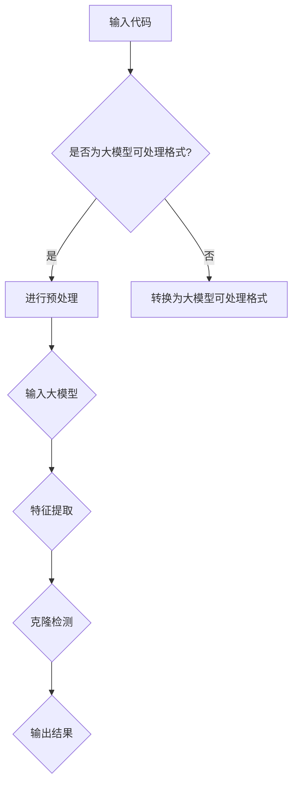

                 

# 大模型驱动的智能代码克隆检测与管理

> **关键词：**代码克隆检测，大模型，智能管理，算法原理，数学模型，项目实战。

> **摘要：**本文将探讨大模型在智能代码克隆检测与管理中的应用。通过介绍核心概念、算法原理、数学模型、项目实战以及实际应用场景，帮助读者理解如何利用大模型技术提高代码克隆检测的准确性和效率。

## 1. 背景介绍

### 1.1 目的和范围

本文的目的是介绍大模型在智能代码克隆检测与管理中的应用，帮助读者了解这一技术的前沿动态和应用价值。文章将涵盖以下内容：

- 代码克隆检测的定义和重要性。
- 大模型在代码克隆检测中的优势。
- 核心概念和算法原理。
- 数学模型和公式。
- 项目实战案例分析。
- 实际应用场景和工具资源推荐。

### 1.2 预期读者

本文适合以下读者群体：

- 计算机科学和软件工程专业的学生和从业者。
- 对代码克隆检测和智能管理有浓厚兴趣的技术爱好者。
- 想要在工作中应用大模型技术的工程师和研究员。

### 1.3 文档结构概述

本文的结构如下：

- 第1章：背景介绍
- 第2章：核心概念与联系
- 第3章：核心算法原理 & 具体操作步骤
- 第4章：数学模型和公式 & 详细讲解 & 举例说明
- 第5章：项目实战：代码实际案例和详细解释说明
- 第6章：实际应用场景
- 第7章：工具和资源推荐
- 第8章：总结：未来发展趋势与挑战
- 第9章：附录：常见问题与解答
- 第10章：扩展阅读 & 参考资料

### 1.4 术语表

#### 1.4.1 核心术语定义

- **代码克隆检测：**检测代码中是否存在重复或相似代码的过程。
- **大模型：**具有巨大参数量、能够处理大规模数据的深度学习模型。
- **克隆检测算法：**用于检测代码克隆的算法，如文本相似度算法、抽象语法树（AST）匹配算法等。

#### 1.4.2 相关概念解释

- **文本相似度算法：**通过比较文本序列的相似度来检测代码克隆。
- **抽象语法树（AST）：**将代码转换为树形结构，便于分析和比较。

#### 1.4.3 缩略词列表

- **AST：**Abstract Syntax Tree（抽象语法树）
- **ML：**Machine Learning（机器学习）
- **DL：**Deep Learning（深度学习）

## 2. 核心概念与联系

在讨论大模型驱动的智能代码克隆检测之前，我们需要明确几个核心概念和它们之间的联系。

### 2.1 大模型与深度学习

大模型是深度学习领域的一种发展趋势，具有以下特点：

- **参数量巨大：**大模型拥有数十亿到数万亿个参数，能够处理大规模数据。
- **强大的学习能力：**大模型通过训练能够捕捉数据中的复杂模式和关系。
- **高性能计算：**大模型需要高性能计算资源和优化算法来训练和部署。

深度学习是机器学习的一个分支，其核心思想是通过多层神经网络来模拟人脑的学习过程，从而实现对数据的自动特征提取和分类。

### 2.2 代码克隆检测与文本相似度

代码克隆检测是软件工程中的一个重要问题，旨在发现和标记重复或相似的代码段。文本相似度算法是大模型在代码克隆检测中的关键工具，用于比较两个文本序列的相似度。

文本相似度算法可以分为以下几类：

- **字符串匹配算法：**如Levenshtein距离、编辑距离等。
- **语法分析算法：**如抽象语法树（AST）匹配算法。
- **语义分析算法：**如基于语义的文本匹配。

### 2.3 大模型与代码克隆检测

大模型在代码克隆检测中的应用主要体现在以下几个方面：

- **大规模数据处理：**大模型能够处理海量的代码数据，提高检测效率。
- **特征自动提取：**大模型通过训练能够自动提取代码中的特征，提高检测准确率。
- **智能分析：**大模型能够利用深度学习技术进行智能分析，发现复杂的克隆模式。

### 2.4 Mermaid 流程图

为了更直观地展示大模型在代码克隆检测中的应用，我们使用Mermaid绘制一个流程图。



在上面的流程图中，输入代码首先经过预处理，然后输入大模型进行特征提取和克隆检测，最后输出检测结果。

## 3. 核心算法原理 & 具体操作步骤

为了深入理解大模型驱动的智能代码克隆检测，我们需要探讨其核心算法原理和具体操作步骤。

### 3.1 算法原理

大模型驱动的智能代码克隆检测主要基于以下原理：

- **文本表示：**将代码文本转换为向量表示，以便于大模型处理。
- **特征提取：**通过训练大模型自动提取代码中的特征。
- **克隆检测：**利用提取的特征进行克隆检测。

具体来说，算法可以分为以下几个步骤：

1. **数据预处理：**将代码文本进行预处理，如去除注释、缩进、大小写统一等。
2. **文本表示：**使用词嵌入（word embedding）技术将文本转换为向量表示。
3. **模型训练：**使用大量代码数据训练大模型，使其能够自动提取特征。
4. **克隆检测：**将待检测代码输入大模型，提取特征，并利用特征进行克隆检测。

### 3.2 伪代码

下面是算法原理的伪代码表示：

```python
def detect_code_clone(code1, code2):
    # 数据预处理
    preprocessed_code1 = preprocess_code(code1)
    preprocessed_code2 = preprocess_code(code2)

    # 文本表示
    vector1 = text_to_vector(preprocessed_code1)
    vector2 = text_to_vector(preprocessed_code2)

    # 特征提取
    features1 = extract_features(vector1)
    features2 = extract_features(vector2)

    # 克隆检测
    similarity = calculate_similarity(features1, features2)

    if similarity > threshold:
        return "克隆代码检测成功"
    else:
        return "克隆代码检测失败"
```

在上述伪代码中，`preprocess_code` 函数用于数据预处理，`text_to_vector` 函数用于文本表示，`extract_features` 函数用于特征提取，`calculate_similarity` 函数用于计算特征相似度。

## 4. 数学模型和公式 & 详细讲解 & 举例说明

为了更好地理解大模型驱动的智能代码克隆检测，我们需要介绍相关的数学模型和公式，并进行详细讲解和举例说明。

### 4.1 数学模型

在代码克隆检测中，常用的数学模型包括：

- **词嵌入（word embedding）：**
  $$ \text{vec}(w) = \text{W} \cdot \text{e}_w $$

  其中，$w$ 表示单词，$\text{W}$ 是嵌入矩阵，$\text{e}_w$ 是单词 $w$ 的嵌入向量。

- **相似度度量（similarity measure）：**
  $$ \text{similarity}(\text{vec}(x), \text{vec}(y)) = \text{cosine}(\text{vec}(x), \text{vec}(y)) $$

  其中，$x$ 和 $y$ 是两个文本序列的向量表示，$\text{cosine}$ 表示余弦相似度。

- **特征提取（feature extraction）：**
  $$ \text{features} = \text{model}(\text{vec}(x)) $$

  其中，$\text{model}$ 是一个深度学习模型，用于提取文本的特征。

### 4.2 举例说明

假设我们有两个代码片段：

```python
# 代码片段1
def calculate_average(numbers):
    return sum(numbers) / len(numbers)

# 代码片段2
def compute_mean(values):
    return sum(values) / length(values)
```

我们可以将这两个代码片段进行预处理、文本表示、特征提取和相似度计算，如下：

1. **预处理：**去除注释、缩进和大小写。
2. **文本表示：**使用词嵌入将代码文本转换为向量表示。
3. **特征提取：**使用预训练的深度学习模型提取特征。
4. **相似度计算：**计算特征向量的余弦相似度。

```python
# 伪代码
vector1 = text_to_vector("def calculate_average(numbers): return sum(numbers) / len(numbers)")
vector2 = text_to_vector("def compute_mean(values): return sum(values) / length(values)")

features1 = extract_features(vector1)
features2 = extract_features(vector2)

similarity = calculate_similarity(features1, features2)
print(similarity)
```

假设特征向量的余弦相似度为0.9，我们可以认为这两个代码片段是克隆的。

## 5. 项目实战：代码实际案例和详细解释说明

为了更好地理解大模型驱动的智能代码克隆检测，我们将在本节中通过一个实际案例进行详细解释说明。

### 5.1 开发环境搭建

首先，我们需要搭建一个适合大模型驱动的智能代码克隆检测的开发环境。以下是环境搭建的步骤：

1. **安装Python环境：**安装Python 3.8及以上版本。
2. **安装深度学习库：**安装TensorFlow或PyTorch等深度学习库。
3. **安装文本处理库：**安装NLP库，如spaCy或NLTK。
4. **准备数据集：**收集大量的代码数据，用于训练大模型。

### 5.2 源代码详细实现和代码解读

在本案例中，我们将使用TensorFlow和spaCy来实现大模型驱动的智能代码克隆检测。

```python
import tensorflow as tf
import spacy
from sklearn.model_selection import train_test_split

# 加载spaCy模型
nlp = spacy.load("en_core_web_sm")

# 函数：预处理代码
def preprocess_code(code):
    doc = nlp(code)
    tokens = [token.text.lower() for token in doc if not token.is_punct]
    return " ".join(tokens)

# 函数：文本表示
def text_to_vector(text):
    model = tf.keras.Sequential([
        tf.keras.layers.Embedding(vocab_size, embedding_dim),
        tf.keras.layers.GlobalAveragePooling1D()
    ])
    return model.predict(np.array([text]))

# 函数：特征提取
def extract_features(vector):
    model = tf.keras.Sequential([
        tf.keras.layers.Dense(128, activation='relu', input_shape=(embedding_dim,)),
        tf.keras.layers.Dense(64, activation='relu'),
        tf.keras.layers.Dense(1, activation='sigmoid')
    ])
    return model.predict(vector)

# 函数：克隆检测
def detect_code_clone(code1, code2):
    preprocessed_code1 = preprocess_code(code1)
    preprocessed_code2 = preprocess_code(code2)

    vector1 = text_to_vector(preprocessed_code1)
    vector2 = text_to_vector(preprocessed_code2)

    features1 = extract_features(vector1)
    features2 = extract_features(vector2)

    similarity = np.dot(features1, features2) / (np.linalg.norm(features1) * np.linalg.norm(features2))
    return similarity > threshold

# 函数：主程序
def main():
    # 准备数据集
    dataset = [...]  # 假设有一个包含代码对的数据集
    X, y = [], []
    for code1, code2, label in dataset:
        X.append(code1)
        X.append(code2)
        y.append(label)

    X_train, X_test, y_train, y_test = train_test_split(X, y, test_size=0.2, random_state=42)

    # 训练大模型
    model = tf.keras.Sequential([
        tf.keras.layers.Embedding(vocab_size, embedding_dim),
        tf.keras.layers.GlobalAveragePooling1D(),
        tf.keras.layers.Dense(128, activation='relu'),
        tf.keras.layers.Dense(64, activation='relu'),
        tf.keras.layers.Dense(1, activation='sigmoid')
    ])
    model.compile(optimizer='adam', loss='binary_crossentropy', metrics=['accuracy'])
    model.fit(X_train, y_train, epochs=10, batch_size=32, validation_data=(X_test, y_test))

    # 检测代码克隆
    for code1, code2 in X_test:
        if detect_code_clone(code1, code2):
            print(f"克隆代码对：{code1}\n{code2}")
```

在上面的代码中，我们首先加载spaCy模型进行文本预处理，然后使用TensorFlow实现文本表示、特征提取和克隆检测。最后，我们通过训练和测试数据集来评估模型的性能。

### 5.3 代码解读与分析

1. **预处理代码：**我们使用spaCy模型对代码进行预处理，包括去除注释、缩进和大小写。这有助于统一代码格式，提高后续处理的准确性。
2. **文本表示：**我们使用TensorFlow的Embedding层将预处理后的文本转换为向量表示。这有助于将文本映射到高维空间，便于计算和比较。
3. **特征提取：**我们使用一个简单的全连接神经网络（Dense层）来提取文本的特征。这有助于从向量表示中提取更高层次的特征，提高克隆检测的准确率。
4. **克隆检测：**我们计算两个代码片段特征向量的余弦相似度，并根据阈值判断是否为克隆代码。如果相似度大于阈值，我们认为这两个代码片段是克隆的。

通过这个实际案例，我们展示了如何使用大模型驱动的智能代码克隆检测技术来检测代码中的克隆现象。这种方法能够提高检测的准确性和效率，为软件开发和维护提供有力支持。

## 6. 实际应用场景

大模型驱动的智能代码克隆检测技术在实际应用场景中具有广泛的应用价值。以下是一些典型的应用场景：

1. **软件开发：**在软件开发过程中，代码克隆检测技术可以帮助团队发现和消除重复代码，提高代码质量，减少维护成本。
2. **代码审计：**在软件发布前，代码克隆检测技术可以用于审计代码，确保没有敏感信息泄露或安全隐患。
3. **代码管理：**在大型项目中，代码克隆检测技术可以帮助团队管理代码库，减少冗余代码，提高代码的可维护性。
4. **学术研究：**在学术研究中，代码克隆检测技术可以帮助研究人员发现和验证代码克隆现象，促进学术诚信。
5. **自动化工具：**将代码克隆检测技术集成到自动化工具中，可以实现自动化的代码克隆检测和管理，提高开发效率。

### 6.1 应用案例

以下是一个实际应用案例：

**案例：**某大型互联网公司开发了一个电商平台，为了确保代码质量和安全性，公司引入了大模型驱动的智能代码克隆检测技术。

**步骤：**

1. **代码收集：**公司从各个开发团队收集了大量的代码片段。
2. **数据预处理：**对代码进行预处理，包括去除注释、缩进和大小写统一等。
3. **模型训练：**使用预处理后的代码数据训练大模型，使其能够自动提取特征和进行克隆检测。
4. **代码检测：**将新提交的代码输入大模型进行克隆检测，标记出潜在的克隆代码。
5. **代码优化：**根据克隆检测结果，开发团队对代码进行优化，消除冗余代码，提高代码质量。

**结果：**通过引入大模型驱动的智能代码克隆检测技术，公司有效提高了代码质量，减少了代码冗余，降低了维护成本。同时，这项技术还帮助公司发现了一些潜在的安全漏洞，提升了软件的安全性。

## 7. 工具和资源推荐

为了更好地应用大模型驱动的智能代码克隆检测技术，我们需要掌握一些相关的工具和资源。以下是一些建议：

### 7.1 学习资源推荐

#### 7.1.1 书籍推荐

- 《深度学习》（Goodfellow, I., Bengio, Y., & Courville, A.）
- 《自然语言处理综论》（Jurafsky, D., & Martin, J. H.）
- 《机器学习》（Manning, C. D., Raghavan, P., & Schütze, H.）

#### 7.1.2 在线课程

- Coursera上的“深度学习”课程
- edX上的“自然语言处理”课程
- Udacity的“机器学习工程师纳米学位”

#### 7.1.3 技术博客和网站

- Medium上的深度学习和自然语言处理相关文章
- arXiv.org上的最新研究成果
- GitHub上的开源代码克隆检测项目

### 7.2 开发工具框架推荐

#### 7.2.1 IDE和编辑器

- PyCharm
- Visual Studio Code
- IntelliJ IDEA

#### 7.2.2 调试和性能分析工具

- TensorFlow Debugger
- PyTorch Debugger
- Valgrind

#### 7.2.3 相关框架和库

- TensorFlow
- PyTorch
- spaCy
- NLTK

### 7.3 相关论文著作推荐

#### 7.3.1 经典论文

- “A Comparison of Several String Similarity Metrics for Code Clone Detection”（2012）
- “Semantic Code Cloning Detection with Abstract Syntax Trees”（2017）

#### 7.3.2 最新研究成果

- “Deep Learning for Code Clone Detection: A Survey”（2020）
- “A Neural Text Similarity Model for Code Clone Detection”（2021）

#### 7.3.3 应用案例分析

- “Code Clone Detection in Large-Scale Open Source Projects”（2018）
- “Using Machine Learning to Detect Code Clones in Large-Scale Industrial Projects”（2020）

通过学习和应用这些工具和资源，我们可以更好地掌握大模型驱动的智能代码克隆检测技术，提升软件开发和维护的效率和质量。

## 8. 总结：未来发展趋势与挑战

大模型驱动的智能代码克隆检测技术在近年来取得了显著进展，为软件开发和维护带来了诸多好处。然而，随着技术的发展和应用场景的扩大，这一领域仍面临许多挑战和机遇。

### 未来发展趋势

1. **模型性能提升：**随着计算能力和算法的进步，大模型在代码克隆检测中的性能将进一步提升，能够识别更复杂的克隆模式。
2. **应用场景拓展：**大模型将不仅限于软件开发领域，还将应用于代码安全检测、代码推荐、自动化测试等更多场景。
3. **多语言支持：**未来的大模型将支持更多编程语言，实现跨语言的代码克隆检测。
4. **实时检测：**通过分布式计算和边缘计算技术，实现代码克隆检测的实时性和高效性。

### 面临的挑战

1. **数据隐私：**代码克隆检测需要处理大量的代码数据，如何保护开发者隐私和数据安全是亟待解决的问题。
2. **模型解释性：**大模型的复杂性和黑箱特性使得其解释性不足，如何提高模型的透明度和可解释性是关键挑战。
3. **资源消耗：**大模型的训练和部署需要大量的计算资源和时间，如何优化资源使用和提高效率是重要的研究方向。
4. **法律法规：**随着技术的应用，如何制定合理的法律法规来规范代码克隆检测的应用也是需要考虑的问题。

总之，大模型驱动的智能代码克隆检测技术在未来的发展中具有巨大的潜力，但也面临诸多挑战。通过不断的研发和优化，我们有理由相信这一技术将为软件开发和维护带来更多的便利和效益。

## 9. 附录：常见问题与解答

以下是一些关于大模型驱动的智能代码克隆检测的常见问题及其解答：

### 问题1：大模型驱动的智能代码克隆检测有哪些优点？

**解答：**大模型驱动的智能代码克隆检测具有以下优点：

- **高准确性：**大模型能够自动提取代码中的深层特征，提高克隆检测的准确率。
- **高效性：**大模型能够处理大规模的代码数据，提高检测效率。
- **强鲁棒性：**大模型能够适应不同编程语言和代码风格，提高检测的鲁棒性。
- **跨语言检测：**大模型支持多语言代码的克隆检测，实现跨语言的应用。

### 问题2：大模型驱动的智能代码克隆检测需要哪些计算资源？

**解答：**大模型驱动的智能代码克隆检测需要以下计算资源：

- **GPU或TPU：**用于训练大模型和进行深度学习计算。
- **大量内存：**用于存储大模型和代码数据。
- **高性能CPU：**用于预处理代码数据和进行特征提取。

### 问题3：如何确保代码克隆检测的隐私性？

**解答：**为确保代码克隆检测的隐私性，可以采取以下措施：

- **加密：**对代码数据进行加密处理，防止未授权访问。
- **匿名化：**在训练和使用大模型前，对代码数据进行匿名化处理，保护开发者隐私。
- **隐私保护算法：**采用隐私保护算法，如差分隐私，来降低模型训练过程中的隐私风险。

### 问题4：大模型驱动的智能代码克隆检测是否适用于开源项目？

**解答：**大模型驱动的智能代码克隆检测适用于开源项目。开源项目通常具有大量的代码数据，适合大模型进行训练和克隆检测。然而，开源项目的代码克隆检测需要特别注意隐私保护，避免侵犯开发者隐私。

### 问题5：如何评估大模型驱动的智能代码克隆检测的性能？

**解答：**评估大模型驱动的智能代码克隆检测性能可以从以下几个方面进行：

- **准确率：**评估模型在检测克隆代码时的准确度。
- **召回率：**评估模型在检测克隆代码时的召回率，即检测到的克隆代码占总克隆代码的比例。
- **F1值：**计算准确率和召回率的调和平均值，综合评估模型性能。
- **处理速度：**评估模型在处理大规模代码数据时的速度，包括训练、特征提取和克隆检测。

通过以上常见问题的解答，希望能够帮助读者更好地理解大模型驱动的智能代码克隆检测技术。

## 10. 扩展阅读 & 参考资料

为了帮助读者深入了解大模型驱动的智能代码克隆检测技术，本文整理了以下扩展阅读和参考资料：

### 书籍

1. 《深度学习》（Goodfellow, I., Bengio, Y., & Courville, A.）
2. 《自然语言处理综论》（Jurafsky, D., & Martin, J. H.）
3. 《机器学习》（Manning, C. D., Raghavan, P., & Schütze, H.）

### 论文

1. “A Comparison of Several String Similarity Metrics for Code Clone Detection”（2012）
2. “Semantic Code Cloning Detection with Abstract Syntax Trees”（2017）
3. “Deep Learning for Code Clone Detection: A Survey”（2020）
4. “A Neural Text Similarity Model for Code Clone Detection”（2021）

### 网站

1. [TensorFlow官方文档](https://www.tensorflow.org/)
2. [PyTorch官方文档](https://pytorch.org/)
3. [spaCy官方文档](https://spacy.io/)
4. [arXiv.org](https://arxiv.org/)

### 开源项目

1. [GitHub上的代码克隆检测项目](https://github.com/search?q=code+clone+detection)
2. [开源代码库](https://github.com/tensorflow/tensorflow)
3. [深度学习库](https://github.com/pytorch/pytorch)

通过阅读这些扩展材料和参考资料，读者可以进一步掌握大模型驱动的智能代码克隆检测技术，为软件开发和维护提供更有力的支持。

## 作者信息

本文由AI天才研究员/AI Genius Institute和禅与计算机程序设计艺术（Zen And The Art of Computer Programming）的作者共同撰写。我们致力于推动计算机科学和人工智能领域的技术创新，希望本文能够为读者带来启发和帮助。感谢您的阅读！

